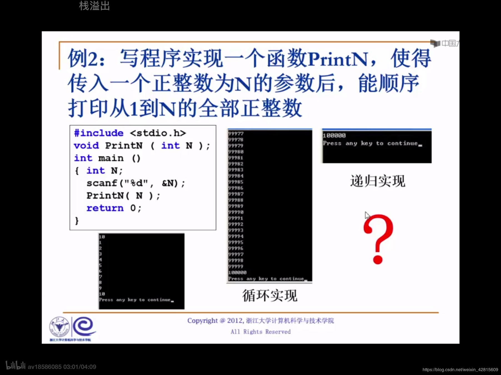
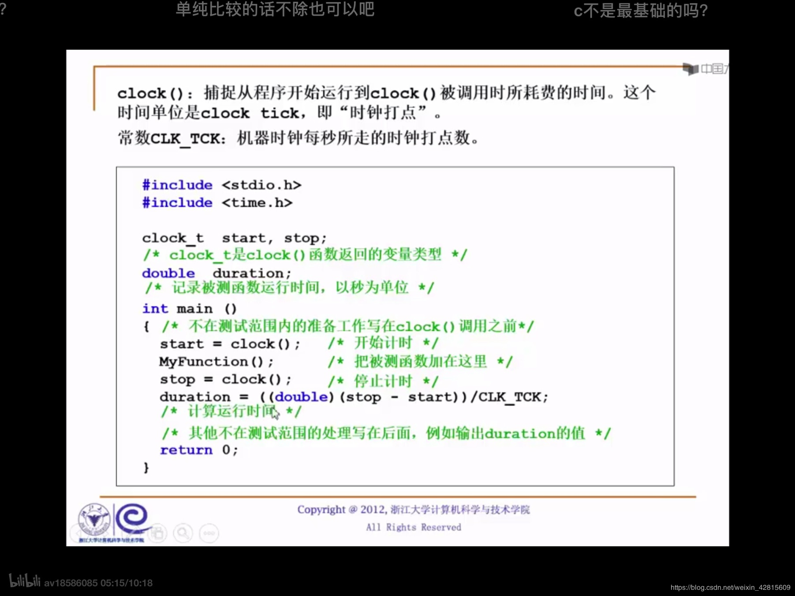
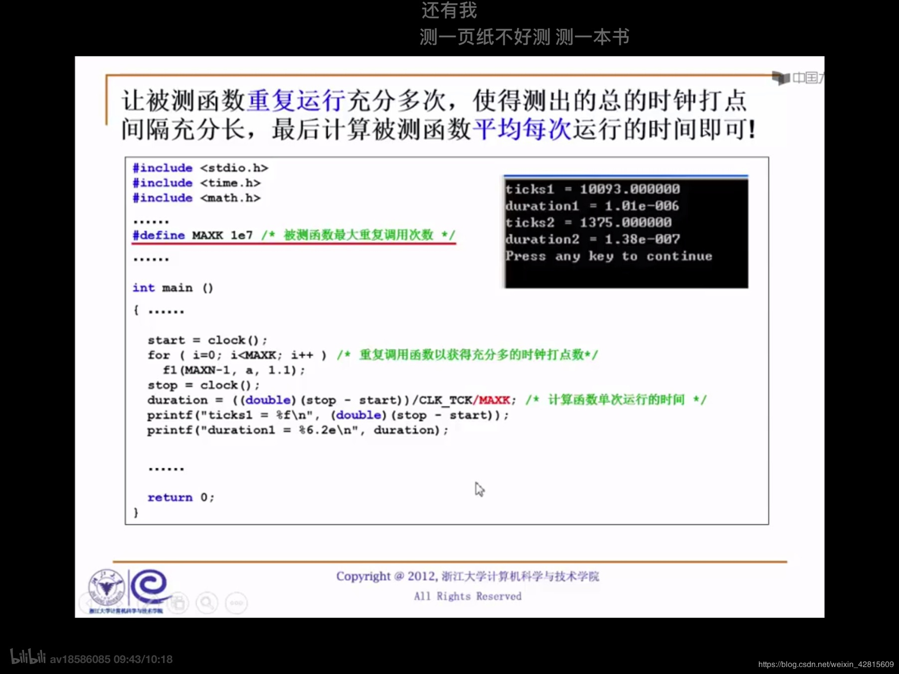
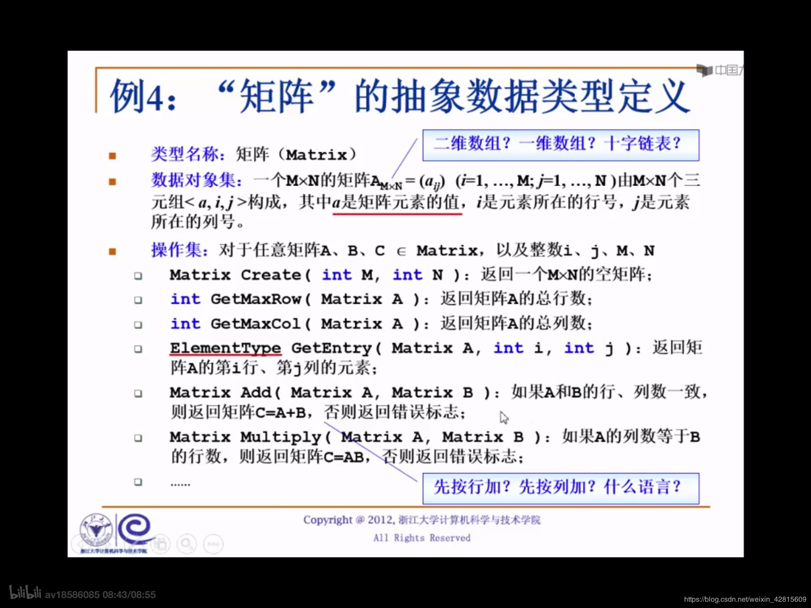

### 什么是数据结构？

数据结构总是与**算法**同时出现。好的数据结构带来好的算法。

**解决问题的方法效率，跟数据的组织方式是直接相关的。**

### 空间的使用

例：写程序实现一个PrintN，使得传入一个正整数为N的参数后，能顺序打印从1到N的全部正整数。

```c
// 方法一：循环实现
void PrintN(int N)
{
    if (N)
    {
        PrintN(N - 1);
        printf("%d\n", N);
    }
    return;
}
// 方法二：递归实现
void PrintN(int N)
{
    if (N)
    {
        PrintN(N - 1);
        printf("%d\n", N);
    }
    return;
}
```

代码见[ds_cou_1.cpp](../../cLib/DataStructure)。



递归程序对空间占用过于恐怖。非正常终止了。

**解决问题方法的效率，也跟空间的效率是有关的。**

### 算法效率

例：写程序计算给定多项式在给定点x处的值。
$$f(x)=a_0+a_1x+...+a_{n-1}x^{n-1}+a_nx^n$$

```c
double f(int n, double a[], double x)
{
    int i;
    double p = a[0];
    for (i = 1; i <= n; i++)
    {
        p += (a[i] * pow(x, i));
    }
    return p;
}
```

但是上述算法效率低。使用**秦九韶算法**可以高效解决这类问题。

$$f(x)=a_0+x(a_1+x(...(a_{n-1}+x(a_n))...))$$

```c
double f(int n, double a[], double x)
{
    int i;
    double p = a[n];
    for (i = n; i <= n; i--)
    {
        p = a[i - 1] + x * p;
    }
    return p;
}
```




代码见[ds_cou_1_time.cpp](../../cLib/DataStructure)。

**解决问题方法的效率，跟算法的巧妙程度有关。**

### 什么是数据结构

- 数据对象在计算机中的组织方式
- - 逻辑结构
- - 物理存储结构
- 数据对象必定与一些列加在其上的操作相关联
- 完成这些操作所用的方法就是**算法**

### 抽象数据类型（Abstract Data Type）

数据类型，包含：**数据对象集**、**数据集合相关联操作集**。

**抽象指，描述数据类型的方法不依赖于具体实现。** 与存放数据的机器、物理结、编程语言构等无关。


