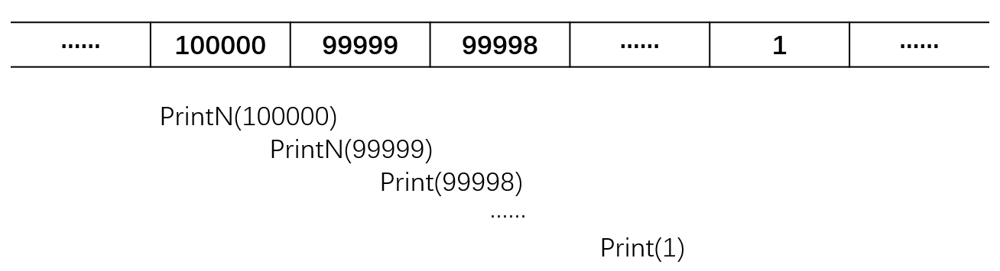

> **摘要:** 本次笔记主要讨论了时间、空间复杂度，还是以秦九韶算法为例。文末给出了函数映射表，说明了降低时间复杂度的必要性。最后，给出了几个判断时间复杂度的技巧。

### 算法

算法是一个有限的指令集，一定在有限步骤之后终止，产生输出。
- 每一条指令必须有充分明确的目标，不可以有歧义；
- 计算机能处理的范围之内；
- 描述应不依赖于任何一种计算机语言以及具体的实现手段。

#### 例：选择排序算法的伪码描述

```c
void SelectionSort(int List[], int N)
{
    // 将N个整数List[0]...List[N-1]进行非递减排序
    for(i=0; i<N; i++) {
        MinPosition = ScanForMin(List, i, N-1);
        // 从List[i]到List[N-1]中找最小元，并将其位置赋给MinPosition
        Swap(List[i], List[MinPosition]);
        // 将未排序部分的最小元换到有序部分的最后位置
    }
}
```

上述算法中，List、Swap还是抽象的概念，因此要考虑：
- List到底使用数组还是链表实现？
- Swap用函数还是用宏去实现？

### 算法的优劣

- **空间复杂度S(n)**，占用存储单元的长度
- **时间复杂度T(n)**，耗费时间的长度

> 图灵机证明了算法是可实现的，代价是是需要时间与空间；由此，算法需要讨论$S(n)$、$T(n)$。*（如果语句有失严谨，欢迎 push issues）*

#### 例：打印N个整数递归

```c
void PrintN(int N)
{
    if(N)
    {
        PrintN(N-1);
        printf("%d\n", N);
    }
    return;
}
```



上图中，$S(N)=C \cdot N$。在调用PrintN(99999)前，PrintN(100000)由于还没有返回，其变量N=100000被存在内存中。以此类推。其空间复杂度与N呈线性关系。

#### 例：求多项式的值

```c
double f(int n, double a[], double x)
{
    int i;
    double p = a[0];
    for(i=1;i<=N;i++)
        p += (a[i] * pow(x, i));
    return p;
}
```

上述算法中，$(1+2+...+n) = (n^2 + n)/2$次乘法，因此$T(n) = C_1 n^2 + C_2 n$。

```c
double f(int n, double a[], double x)
{
    int i;
    double p = a[n];
    for (i=n;i>0;i--)
        p = a[i-1] + x*p;
    return p;
}
```

上述算法（秦九韶算法）中，用了$n$次乘法，因此$T(n)=C \cdot n$。

#### 什么是好的算法？

在分析一般算法的效率时，经常只关注下面两种复杂度：
- 最坏情况复杂度$T_{worst}(n)$
- 平均复杂度$T_{avg}(n)$
- 通常分析最坏情况复杂度

### 复杂度的渐进表示法

- $T(n)=O(f(n))$表示存在常数$C>0$,$n_0>0$使得当$n \ge n_0$时有$T(n) \le C \cdot f(n)$
- $T(n)=\Omega (f(n))$表示存在常数$C>0$,$n_0>0$使得当$n \ge n_0$时有$T(n) \ge C \cdot f(n)$
- $T(n)=\Theta (f(n))$表示存在常数$C>0$,$n_0>0$使得当$n = n_0$时有$T(n) = C \cdot f(n)$

下表为不同函数对于输入规模n的映射。

|函数|1|2|4|8|16|32|
|---|---|---|---|---|---|---|
|1|1|1|1|1|1|1|
|log n|0|1|2|3|4|5|
|n|1|2|4|8|16|32|
|n log n|0|2|8|24|64|160|
|n^2|1|4|16|64|256|1024|
|n^3|1|8|64|512|4096|32768|
|2^n|2|4|16|256|65536|4294967296|
|n!|1|2|24|40326|209227898800|26313e33|

可以看出，及时输入规模只有32，$n!$与$2^n$的复杂度就已经到了几乎无法令人接受的水平。因此选择最合适的数据结构，降低时间、空间复杂度尤为重要。

#### 复杂度分析小窍门

若两段算法分别有复杂度$T_1 (n) = O(f_1 (n))和T_2 (n)=O(f_2 (n))$，则
- $T_1 (n) + T_2 (n) = max(O(f_1 (n)), O(f_2 (n)))$
- $T_1 (n) + T_2 (n) = O(f_1 (n) \times f_2 (n))$

若$T(n)$是关于n的k阶多项式，那么$T(n)=\Theta\left(n^{k}\right)$

一个for循环的时间复杂度等于循环次数乘以循环体代码的复杂度；

if-else结构的复杂度取决于if的条件判断负责度和两个分支部分的复杂度，总体复杂度取三者中最大。