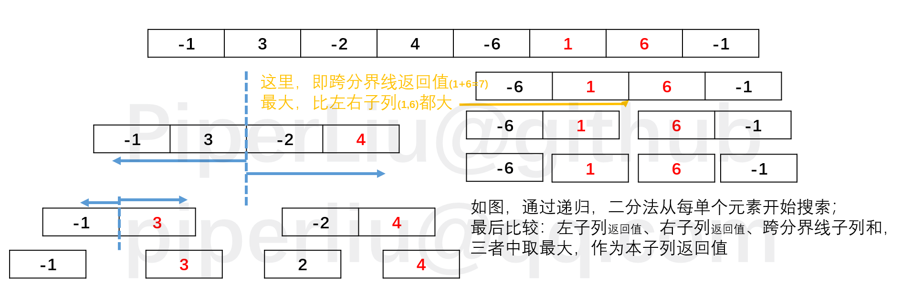

> **摘要:** 求最大子列和是一道经典的数据结构算法问题。本文采用了四种方法（暴力遍历、不做重复加法、分而治之/二分法、在线处理法），分别对时间复杂度进行了讨论。值得注意的是，本文在分而治之的算法叙述部分，给出了“二分法时间复杂度为什么等于$N \log_2 N$”的[粗略证明](#dichotomy)。

**本笔记中提到的四种算法，都在[ds_cou_1_maxSum.cpp](../../cLib/DataStructure/ds_cou_1_maxSum.cpp)中被实现，并记录、比较了时长。**

[ds_cou_1_maxSum.cpp](../../cLib/DataStructure/ds_cou_1_maxSum.cpp)中四种算法时长：
    duration_1 = 1.46e-006
    duration_2 = 2.80e-007
    duration_3 = 2.70e-007
    duration_4 = 3.00e-008
    数据规模小，分而治之的方法与不做重复加法的方法相比，优势不明显。

### 最大子列和问题

给定N个整数的序列$\{A_1,A_2,...,A_N\}$，求函数$f(i,j)=\max \left\{ 0,\sum^j_{k=1}A_k \right\}$(任一连续子列的非负和)的最大值。

#### 算法1：把所有子列拿出来比较（暴力法）

```c
int MaxSubseqSum1(int A[], int N)
{
    int ThisSum, MaxSum = 0;
    int i, j, k;
    for (i = 0; i < N; i++)
    {
        for (j = 1; j < N; j++)
        {
            ThisSum = 0;
            for (k = i; k <= j; k++)
                ThisSum += A[k];
            if (ThisSum > MaxSum)
                MaxSum = ThisSum;
        }
    }
    return MaxSum;
}
```

复杂度$T(N)=O(N^3)$

#### 算法2：不做重复的加法

```c
int MaxSubseqSum2(int A[], int N)
{
    int ThisSum, MaxSum = 0;
    int i, j, k;
    for (i = 0; i < N; i++)
    {
        ThisSum = 0;
        for (j = i; j < N; j++)
        {
            ThisSum += A[j];
            if (ThisSum > MaxSum)
                MaxSum = ThisSum;
        }
    }
    return MaxSum;
}
```

复杂度$T(N)=O(N^2)$

#### 算法3：分而治之（见到N^2转换为NlogN）

> 经验：遇到时间复杂度为$T(N^2)$的算法时，要考虑能否用“分而治之”的思想将其时间复杂度降到$N \log N$。

```c
int Max3(int A, int B, int C)
{ /* 返回3个整数中的最大值 */
    return A > B ? A > C ? A : C : B > C ? B : C;
    // 即A > B ? (A > C ? A : C) : (B > C ? B : C) ;
}

int DivideAndConquer(int List[], int left, int right)
{   /* 分治法求List[left]到List[right]的最大子列和 */
    int MaxLeftSum, MaxRightSum;             /* 存放左右子问题的解 */
    int MaxLeftBorderSum, MaxRightBorderSum; /*存放跨分界线的结果*/

    int LeftBorderSum, RightBorderSum;
    int center, i;

    if (left == right)
    { /* 递归的终止条件，子列只有1个数字 */
        if (List[left] > 0)
            return List[left];
        else
            return 0;
    }

    /* 下面是"分"的过程 */
    center = (left + right) / 2; /* 找到中分点 */
    /* 递归求得两边子列的最大和 */
    MaxLeftSum = DivideAndConquer(List, left, center);
    MaxRightSum = DivideAndConquer(List, center + 1, right);

    /* 下面求跨分界线的最大子列和 */
    MaxLeftBorderSum = 0;
    LeftBorderSum = 0;
    for (i = center; i >= left; i--)
    { /* 从中线向左扫描 */
        LeftBorderSum += List[i];
        if (LeftBorderSum > MaxLeftBorderSum)
            MaxLeftBorderSum = LeftBorderSum;
    } /* 左边扫描结束 */

    MaxRightBorderSum = 0;
    RightBorderSum = 0;
    for (i = center + 1; i <= right; i++)
    { /* 从中线向右扫描 */
        RightBorderSum += List[i];
        if (RightBorderSum > MaxRightBorderSum)
            MaxRightBorderSum = RightBorderSum;
    } /* 右边扫描结束 */

    /* 下面返回"治"的结果 */
    return Max3(MaxLeftSum, MaxRightSum, MaxLeftBorderSum + MaxRightBorderSum);
}

int MaxSubseqSum3(int List[], int N)
{ /* 保持与前2种算法相同的函数接口 */
    return DivideAndConquer(List, 0, N - 1);
}
```

二分法思想如下图：



> 下面证明，二分法的时间复杂度：

1) T(N) 由左子列递归+右子列递归+跨越中线扫描三步运算构成，即

$$T(N) = 2 T(N/2) + cN$$

2) 并且，由实际情况可知，当只有一个元素时，时间复杂度为1，即

$$T(1) = O(1)$$

3) 左右子列又可以分出子子列，因此可以对(1)进行展开，即

$$T(N) = 2 [2 T(N/2^2) + c N/2] + c N$$

4) 一共可以展开k次，满足$N/2^k = 1$（向上取整），即

$$T(N) = 2^k O(1) + c k N$$

5) 其中$2^k O(1) = N$，$c k N = c \log_2 (N) N$，T(N)取大者，即

$$T(N) = N \log_2 N$$

#### 算法4：在线处理

代码如下：

```c
// 在线处理
int MaxSubseqSum4(int A[], int N)
{
    int ThisSum, MaxSum;
    int i;
    ThisSum = MaxSum = 0;
    for (i = 0; i < N; i++)
    {
        ThisSum += A[i]; // 向右累加
        if (ThisSum > MaxSum)
            MaxSum = ThisSum; // 发现更大和则更新当前结果
        else if (ThisSum < 0) // 如果当前子列和为负
            ThisSum = 0;      // 则不可能使后面的部分和增大，抛弃之
    }
    return MaxSum;
}
```

$$T(N) = O(N)$$

算法效率高是有代价的：**其正确性不明显（他人难以理解算法是如何工作的）**。


如上图，在线处理运行中的一个断点的状态。对于这个数组，最后得到的最大子列和为7（i=5与i=6的和）。