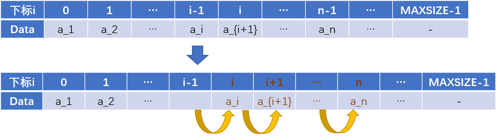
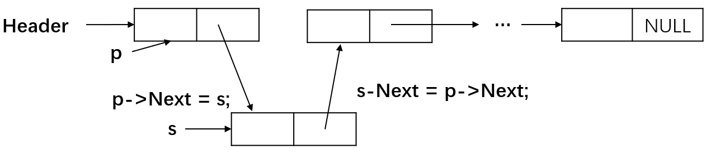
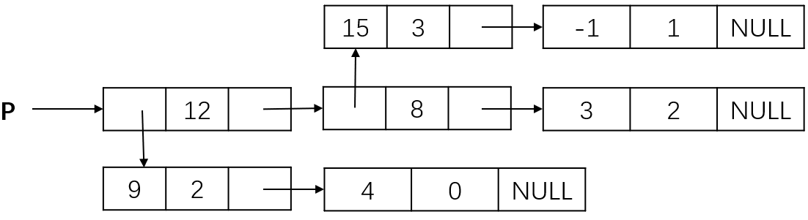
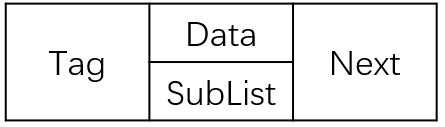
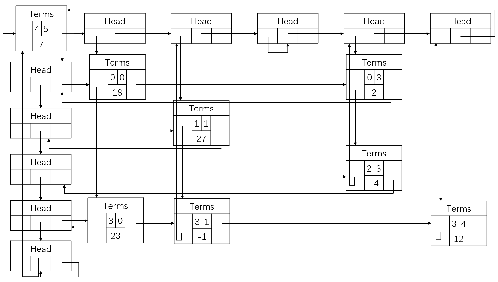

> **摘要：** 本文以多项式表示为引例引出线性表这个数据结构类型。接着讨论了数组线性表与链表的具象表示、代码实现以及主要操作。最后对线性表进行推广，得到广义表的概念与应用，并以多重链表表示矩阵的数据结构示意收尾。

### 引例：多项式表示

$$f(x)=a_0+a_1x+...+a_{n-1}x^{n-1}+a_nx^n$$

#### 方法1：顺序存储结构直接表示

数组各分量对应多项式各项：a[i]表示项$x^i$的系数$a_i$

例如：$f(x) = 4 x^5 -3 x^2 + 1$

表示成：

| 下标i | 0 | 1 | 2        | 3 | 4 | 5       | ... |
|-------|---|---|----------|---|---|---------|-----|
| a[i]  | 1 | 0 | -3   | 0 | 0 | 4       | ... |
|       | 1 |   | $-3 x^2$ |   |   | $4 x^5$ |     |

则，两个多项式相加可以表示为两个数组对应分量相加。

**那么问题来了，如何表示多项式$x+3 x^{2000}$？这种方式是否非常浪费空间？**

**弊端：** 过于稀疏，存在浪费。

#### 方法2：顺序存储结构表示非零项

- 可以将多项式看成一个(a,i)二元组的集合
- 用结构数组表示

例如：$P_1(x) = 9x^{12} + 15 x^8 + 3 x^2$和$P_2(x) = 26 x^{19} - 4x^8 -13 x^6 +82$

表示成：

| 下标i     | 0  | 1  | 2 | ... |
|-----------|----|----|---|-----|
| 系数$a^i$ | 9  | 15 | 3 | -   |
| 指数$i$   | 12 | 8  | 2 | -   |

| 下标i     | 0  | 1  | 2   | 3  | ... |
|-----------|----|----|-----|----|-----|
| 系数$a^i$ | 26 | -4 | -13 | 82 | -   |
| 指数$i$   | 19 | 8  | 6   | 0  | -   |

应注意，要按照指数大小有序存储。

#### 方法3：链表结构存储非零项

链表中每个结点存储多项式中的一个非零项，包括系数和指数两个数据域以及一个指针域。

|coef|expon|link|
|---|---|---|

```c
typedef struct PolyNode *Polynomial;
struct PolyNode {
    int coef;
    int expon;
    Polynomial link;    // link为指向下一结点的指针
}
```

例如：$P_1(x) = 9x^{12} + 15 x^8 + 3 x^2$和$P_2(x) = 26 x^{19} - 4x^8 -13 x^6 +82$

链表存储形式为：


### 什么是线性表

**线性表（Linear List）**：由同类型的**数据元素**构成的**有序序列**的线性结构
- 表中元素个数成为线性表的**长度**
- 线性表没有元素时，成为**空表**
- 表起始位置称**表头**，表结束位置称**表尾**

**数据对象集：** 线性表是n(n>=0)个元素构成的有序序列(a1,a2,..,an)
**操作集：** 线性表L∈List，整数i表示位置，元素X∈ElementType，线性表的基本操作主要有：
- List MakeEmpty()：初始化一个空线性表L；
- ElementType FindKth( int K, List L )：根据位序K，返回相应元素；
- int Find( ElementType X, List L )：在线性表L中查找X的第一次出现位置；
- void Insert( ElementType X, int i, List L )：在位序i前插入一个新元素X；
- void Delete( int i, List L )：删除指定位序i的元素；
- int Length( List L )：返回线性表L的长度n。

#### 线性表的顺序存储实现

- 利用数组的**连续存储空间顺序存放**线性表的各元素

| 下标i | 0   | 1   | ... | i-1 | i       | ... | n-1 | ... | MAXSIZE-1 |
|-------|-----|-----|-----|-----|---------|-----|-----|-----|-----------|
| Data  | a_1 | a_2 | ... | a_i | a_{i+1} | ... | a_n | ... | -         |

其中，Last指向a_n，表示当前元素个数-1。

LNode的代码可见[../../cLib/DataStructure/ds_cou_2_LNode.h](../../cLib/DataStructure/ds_cou_2_LNode.h)。

```c
typedef struct LNode *List;
struct LNode
{
    ElementType Data[MAXSIZE];
    int Last;
};
struct LNode L;
List PtrL;
```

其中，typedef struct LNode *List指：为struct LNode \*定义了一个**别名List**，List是指针。

主要操作实现如下：

```c
// 初始化，建立空的顺序表
List MakeEmpty()
{
    List PtrL;
    PtrL = (List)malloc(sizeof(struct LNode));
    PtrL->Last = -1;
    return PtrL;
}

// 查找
int Find(ElementType X, List PtrL)
{
    int i = 0;
    while (i <= PtrL->Last && PtrL->Data[i] != X)
        i++;
    if (i > PtrL->Last)
        return -1; // 如果没有找到，返回-1
    else
        return i; // 找到后返回的是存储的位置(起始为1)
}
```

其中，**malloc()为申请动态内存的函数**。令指针指向内存Ptrl=(List)malloc([内存大小])。

查找的时间复杂度为O(n)。

对于插入，使用“先移动，再插入”的策略：



```c
// 插入，第i个位置(起始为1)上插入一个值为X的新元素
void Insert(ElementType X, int i, List PtrL)
{
    int j;
    if (PtrL->Last == MAXSIZE - 1)
    {
        printf("表满");
        return;
    }
    if (i < 1 || i > PtrL->Last + 2)
    {
        printf("位置不合法");
        return;
    }
    for (j = PtrL->Last; j >= i - 1; j--)
        PtrL->Data[j + 1] = PtrL->Data[j]; // 将a_i~a_n倒序向后移动
    PtrL->Data[i - 1] = X;                 // 新元素插入
    PtrL->Last++;                          // Last仍指向最后的元素
    return;
}

// 删除
void Delete(int i, List PtrL)
{
    int j;
    if (i < 1 || i > PtrL->Last + 1)
    {
        printf("不存在第%d个元素", i);
        return;
    }
    for (j = i; j <= PtrL->Last; j++)
        PtrL->Data[j - 1] = PtrL->Data[j];
    PtrL->Last--;
    return;
}
```

插入的平均移动次数为$n/2$，平均时间性能为O(n)；删除的平均移动次数为$(n-1)/2$，平均时间性能为O(n)。

#### 线性表的链式存储实现

- 不要求逻辑上相邻的两个元素物理上也相邻，用“链”建立起元素间的逻辑关系。
- 插入、删除不需要移动数据元素，只需要修改“链”。


链表的代码见[../../cLib/DataStructure/ds_cou_2_LinkedList.h](../../cLib/DataStructure/ds_cou_2_LinkedList.h)。

```cpp
typedef struct LNode *List;
struct LNode
{
    ElementType Data;
    List Next;
};
struct LNode L;
List PtrL;
```

值得注意的是，我们通过调用头指针来调用链表。

```cpp
// 求表长
int Length(List PtrL)
{
    List p = PtrL;
    int j = 0;
    while (p)
    {
        p = p->Next;
        j++;
    }
    return j;
}

// 查找：按序号查找
List FindKth(int K, List PtrL)
{
    List p = PtrL;
    int i = 1;
    while (p != nullptr && i < K)
    {
        p = p->Next;
        i++;
    }
    if (i == K)
        return p;
    else
        return nullptr;
}

// 查找：按值查找
List Find(ElementType X, List PtrL)
{
    List p = PtrL;
    while (p != nullptr && p->Data != X)
        p = p->Next;
    return p; // 没找到就返回NULL
}
```

插入即在第$i-1(1\le i\le n+1)$个结点后插入一个值为X的新节点，步骤为：
(1)先构造一个新结点，用s指向；
(2)再找到链表的第i-1个结点，用p指向；
(3)然后修改指针，插入结点（p之后插入新结点是s）。



```cpp
// 插入
List Insert(ElementType X, int i, List PtrL)
{
    List p, s;
    if (i == 1)
    { /* 新节点插入在表头 */
        s = (List)malloc(sizeof(struct LNode));
        s->Data = X;
        s->Next = PtrL;
        return s;
    }
    p = FindKth(i - 1, PtrL);
    if (p == nullptr)
    {
        printf("参数i错");
        return NULL;
    }
    else
    {
        s = (List)malloc(sizeof(struct LNode));
        s->Data = X;
        s->Next = p->Next;
        p->Next = s;
        return PtrL;
    }
}
```

删除：
- 删除链表的第$i(1\le i\le n)$位置上的结点
- 不要忘记释放s所指的空间，内存空间才不会泄露

步骤如下：
(1)先找到链表的第i-1个结点，用p指向；
(2)再用指针s指向要被删除的结点(p的下一个结点)；
(3)然后修改指针，删除s所指结点；
(4)最后释放s所指结点的空间。

```cpp
// 删除
List Delete(int i, List PtrL)
{
    List p, s;
    if (i == 1)
    {
        s = PtrL;
        if (PtrL != NULL)
            PtrL = PtrL->Next;
        else
            return NULL;
        free(s);
        return PtrL;
    }
    p = FindKth(i - 1, PtrL);
    if (p == nullptr)
    {
        printf("第%d个结点不存在", i - 1);
        return NULL;
    }
    else if (p->Next == NULL)
    {
        printf("第%d个结点不存在", i);
        return NULL;
    }
    else
    {
        s = p->Next;
        p->Next = s->Next;
        free(s);
        return PtrL;
    }
}
```

### 广义表

#### 例：二元多项式如何表示？

我们知道了一元多项式的表示，那么二元多项式又该如何表示？

比如，给定二元多项式：$P(x,y) = 9 x^{12} y^2 + 4 x^{12} + 15 x^8 y^3 - x^8 y + 3 x^2$，可以将上述二元多项式看成关于x的一元多项式，即：$$P(x,y) = (9 y^2 + 4) x^12 + (15 y^3 - y) x^8 + 3 x^2$$

所以，上述二元多项式可以用“复杂”链表表示为：



- **广义表（Generalized List）** 是线性表的推广

#### Tag和union{}URegion来区分广义表中数据类型

- 注意到Tag可能是单元素也可能是广义表；
- 因此引入Tag概念。

代码可见[../../cLib/DataStructure/ds_cou_2_GeneralizedList.h](../../cLib/DataStructure/ds_cou_2_GeneralizedList.h)。

```cpp
typedef struct GNode *GList;
struct GNode
{
    int Tag; // 标志域：0表示结点是单元素，1表示结点是广义表
    union    // 子表指针域与单元素数据域Data复用，即共用存储空间
    {
        ElementType Data;
        GList SubList;
    } URegion;
    GList Next; // 指向后继结点
};
```

其结点结构如下：



#### 多重链表

- 链表中结点可能同时隶属于多个链；
- 多重链表中结点**指针域会有多个**，如前面例子包含了Next和SubList两个指针域；
- 但包含两个指针域的链表不一定是多重链表，比如**双向链表不是多重链表**。
- 多重链表有广泛的用途，基本上如树、图这样相对复杂的数据结构都可以采用多重链表的方式实现存储。

#### 多重链表例：矩阵表示

矩阵可以用二维数组表示，但二维数组表示有两个缺陷：
- 一是数组的大小需要事先确定；
- 二是对于“稀疏矩阵”，将造成大量的存储空间浪费，如下。

$$A=\left[\begin{array}{ccccc}
{18} & {0} & {0} & {2} & {0} \\
{0} & {27} & {0} & {0} & {0} \\
{0} & {0} & {0} & {-4} & {0} \\
{23} & {-1} & {0} & {0} & {12} \\
\end{array}\right]$$

$$B=\left[\begin{array}{cccccc}
{0} & {2} & {11} & {0} & {0} & {0} \\
{3} & {-4} & {-1} & {0} & {0} & {0} \\
{0} & {0} & {0} & {9} & {13} & {0} \\
{0} & {-2} & {0} & {0} & {10} & {7} \\
{6} & {0} & {0} & {5} & {0} & {0}
\end{array}\right]$$

因此，采用一种典型的多重链表“十字链表”来存储稀疏矩阵。
- 只存储矩阵非0元素项，结点的数据域：行坐标Row、列坐标Col、数值 Value；
- 每个结点通过两个指针域，把同行、同列串起来；行指针(或称为向右指针)Right、列指针(或称为向下指针)Down。



- Term链表分别与同行同列的结点形成**循环链表**；
- Head头结点；
- 左上角Term[4,5,7]，是链表的**入口结点**，表示4行5列7个非零元素。
- **实际上，第i行的Head和第i列的Head是同一个Head。**


- 用一个标识域Tag来区分头结点和非0元素结点；
- 头结点的标识值为“Head”，矩阵非0元素结点的标识值为“Term”。
- **Term和Head用统一的结构（Tag）表示。**

代码在本仓库中不做实现。可以参考网络资料：[用典型的多重链表（十字链表）存储稀疏矩阵](https://blog.csdn.net/haipeng206304/article/details/50731909)，但是觉得某些地方有待考究。看代码时对照图看。
