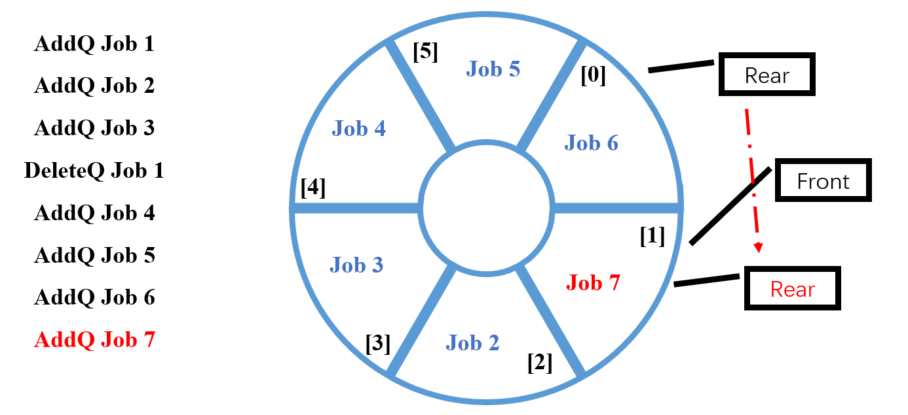

> **摘要：** 队列是一种“先进先出”的线性表，本次笔记具体讨论了队列中的循环队列与队列的链式存储实现。

### 什么是队列

队列（Queue），数据对象集为一个有0或多个元素的有穷线性表。
- 插入和删除操作：只能在一段插入，而在另一端删除。
- 数据插入：入队列（AddQ）
- 数据删除：出队列（DeleteQ）
- 先来先服务，先进先出：FIFO

操作集如下：
- Queue CreateQueue(int MaxSize)：生成长度为MaxSize的空队列；
- int IsFullQ(Queue Q, int MaxSize)：判断队列Q是否已满；
- void AddQ(Queue Q, ElementType item)：将数据元素item插入队列Q中；
- int IsEmpty(Queue Q)：判断队列Q是否为空；
- ElementType DeleteQ(Queue Q)：将队头数据元素从队列中删除并返回。

### 队列的顺序存储实现

代码见[../../cLib/DataStructure/ds_cou_2_Queue.h](../../cLib/DataStructure/ds_cou_2_Queue.h)。

队列的顺序存储结构通常由一个一维数组和一个记录队列头元素位置的变量front以及一个记录队列尾元素位置的变量rear组成。

```cpp
struct QNode{
    ElementType Data[MaxSize];
    int rear;
    int front;
};
typedef struct QNode *Queue;;
```

加入元素，即队尾rear向后移动。

#### 循环队列



如上图，循环队列会出现空、满无法区分的情况。

无法区分队列状态的根本原因在于，front和rear的距离只有n种，而实际情况有n+1种。

解决方案：
1. 使用额外标记：Size或者tag域；
2. 仅使用n-1个数组空间

使用第二种方案，实现队列。

（1）入队列
```cpp
void AddQ(Queue PtrQ, ElementType item)
{
    if ((PtrQ->rear + 1) % MaxSize == PtrQ->front)
    {
        printf("队列满");
        return;
    }
    PtrQ->rear = (PtrQ->rear + 1) % MaxSize;
    PtrQ->Data[PtrQ->rear] = item;
}
```

（2）出队列

```cpp
ElementType DeleteQ(Queue PtrQ)
{
    if (PtrQ->front == PtrQ->rear)
    {
        printf("队列空");
        return NULL;
    }
    else
    {
        PtrQ->front = (PtrQ->front + 1) % MaxSize;
        return PtrQ->Data[PtrQ->front];
    }
}
```

### 队列的链式存储实现

代码见[../../cLib/DataStructure/ds_cou_2_QueueWithLinkedList.h](../../cLib/DataStructure/ds_cou_2_QueueWithLinkedList.h)。

链表设计时，应注意不能将front设置在-1位置（因为没有）。

```cpp
struct Node
{
    ElementType Data;
    struct Node *Next;
};
struct QNode
{                       // 链队列结构
    struct Node *rear;  // 指向队尾结点
    struct Node *front; // 指向队头结点
};
typedef struct QNode *Queue;
Queue PtrQ;
```


出队操作：

```c
ElementType DeleteQ(Queue PtrQ)
{
    struct Node *FrontCell;
    ElementType FrontElem;

    if (PtrQ->front == NULL)
    {
        printf("队列空");
        return NULL;
    }
    FrontCell = PtrQ->front;
    if (PtrQ->front == PtrQ->rear)       // 若队列只有一个元素
        PtrQ->front = PtrQ->rear = NULL; // 删除后队列置为空
    else
        PtrQ->front = PtrQ->front->Next;
    FrontElem = FrontCell->Data;
    free(FrontCell); // 释放被删除结点空间
    return FrontElem;
}
```

入队操作：

```c
// 入队操作，PiperLiu@qq.com自己写的
void AddQ(ElementType item, Queue PtrQ)
{
    struct Node TmpNode;
    TmpNode.Data = item;
    TmpNode.Next = NULL;

    if (PtrQ->front == NULL)
    { // 若当前队列为空
        PtrQ->front = &TmpNode;
        PtrQ->rear = &TmpNode;
    }
    else
    {
        PtrQ->rear->Next = &TmpNode;
        PtrQ->rear = &TmpNode;
    }
}
```

### 如何用两个堆栈模拟实现一个队列?

参考[Mrslinxm](https://www.icourse163.org/learn/ZJU-93001?tid=1465570445#/learn/content?type=detail&id=1245209342&cid=1270015711)：

队列的容量为`2n+1`，首先入栈时向`m`进行入栈操作，当入栈操作结束时或`m`中数据个数为`n`时，`m`进行出栈，将`m`出栈的数据入栈到`n`，此时`n`进行出栈操作即可模拟队列的出列，若`n`栈满时，继续向`m`中进行入栈操作，可向`m`中入栈`n+1`个数据，进行出列操作即`n`进行出栈操作，当`n`为空时将`m`中的数据出栈后入栈到`n`，`n`再进行出栈操作。
