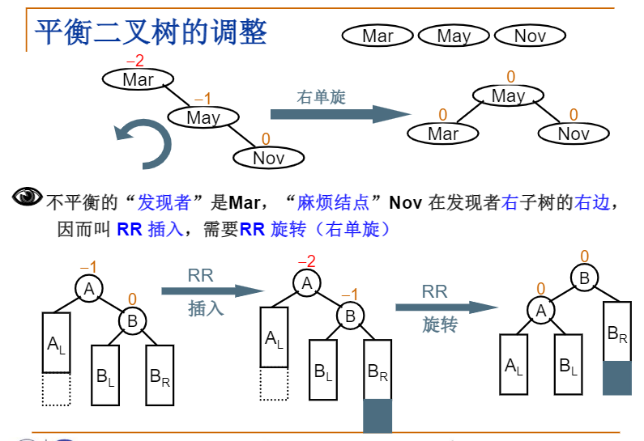

# 平衡二叉树

关于平衡二叉树，不再介绍基础内容，其意义请参考我的算法笔记：
- [github.com/PiperLiu/ACMOI_Journey/平衡二叉树](https://github.com/PiperLiu/ACMOI_Journey/blob/master/notes/acwings/PAT%E7%94%B2%E7%BA%A7%E8%BE%85%E5%AF%BC%E8%AF%BE/drafts/pat.0.1.md)

### 高度为 h 时至少有多少节点

### 证明查找效率

如上，可得 $h = O(\log_2 n)$ 。

### AVL树的调整

具体的代码都在上面提到的算法笔记里，这里总结两点：
- “麻烦结点”在“发现者”的X子树的Y边，则采用XY旋转
- 上图中下半部分的抽象图很好用，记住
- 这个 ppt 里没有讲清具体怎么旋，算法笔记里有

注意：**这里叙述的左旋就是我算法笔记里的右旋！但是这里的LR旋转，并不等于笔记里的RL旋转，也不等于笔记里的L+R旋转！我还是喜欢算法笔记中的描述。**
