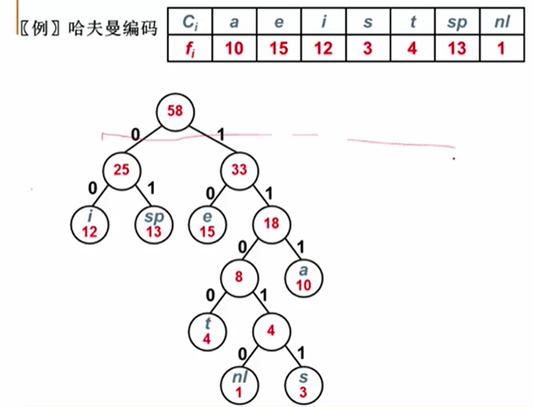

# 哈夫曼树与哈夫曼编码

## 哈夫曼树

### WPL

引入一个概念：WPL（Weighted Path Length of Tree, 树的带权路径长度）。

如其名字，树的带权路径长度记为`WPL=(W1*L1+W2*L2+W3*L3+...+Wn*Ln)`，`N`个权值`Wi(i=1,2,...n)`构成一棵有`N`个叶结点的二叉树，相应的 **叶结点** 的路径长度为`Li(i=1,2,...n)`。可以证明哈夫曼树的WPL是最小的。

注意这里针对的是叶节点。

### 哈夫曼树怎么构造？

对于 `{1, 2, 4, 5}` ：
- 先选 `1` 和 `2` 这两个最小的，组成一个二叉树，其根节点值为 `1+2 = 3`
- 把 `3` 放到 `{4, 5}` 中去
- 然后再挑两个最小的合并

### 哈夫曼树特点

- 没有度为1的结点（因为构造时都是两两合并）
- `n`个叶子结点的哈夫曼树共有`2n-1`个结点（`n2 = n0 - 1` 且 `n0 + n2 = 总数`）
- 对同一组权值哈夫曼树，存在两个步同构的哈夫曼树

## 哈夫曼编码

要注意如何避免编码的二义性。

如上，一图胜千言，把对象放在叶节点上。
