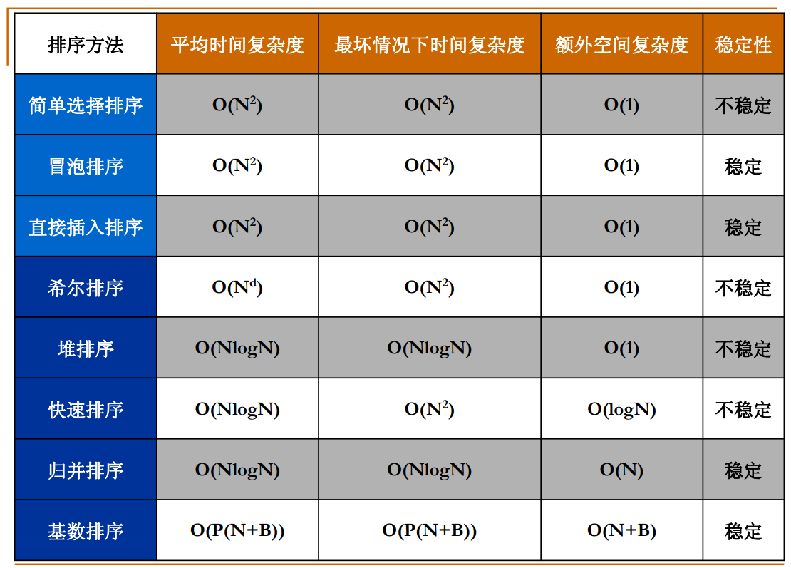

# 经典排序算法总结

本笔记动图来自[https://www.runoob.com/w3cnote/ten-sorting-algorithm.html](https://www.runoob.com/w3cnote/ten-sorting-algorithm.html)。

### 表排序

感觉表排序更像：

```cpp
// 已有 vector<ComplexStruct> vecs;
int p[n];
for (int i = 0; i < n; ++ i) p[i] = i;
sort(p.begin(), p.end(), [&](int a, int b) {
    return vecs[a] < vecs[b];
});
```

索引排序结束了，接着如果需要根据这些索引物理地讲元素更改位置（就是去操作上面例子中的 `vecs`），这里要注意两个问题：
- 参考[表排序课件](../../notes/data_structure/resources/10.2 表排序.pdf)第4页，元素间可以根据索引关系形成环
- 当有 $\lfloor N / 2 \rfloor$ 个环，即每个换包含 $2$ 个元素时，需要物理地交换 $3N/2$ 次，是最坏的时间复杂度

### 基数排序/桶排序/多关键字排序


桶排序有点哈希表的意思。


基数排序这里用次位优先（LSD, Least Significant Digit）举例子，如上图。

基数排序还可以进行多关键字排序，[课件](../../notes/data_structure/resources/10.3 基数排序.pdf)中以主位优先（MSD, Most Significant Digit）为例。

基数排序时间复杂度 $O(P(N+B))$ ，其中 $P$ 是需要多少趟，分几个层次的桶， $B$ 是多少个桶。

### 排序算法总结


