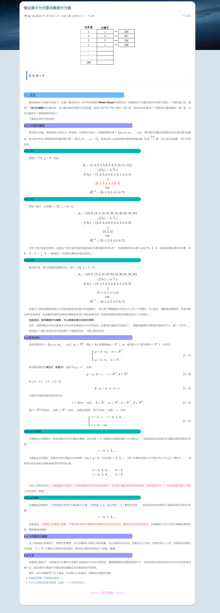
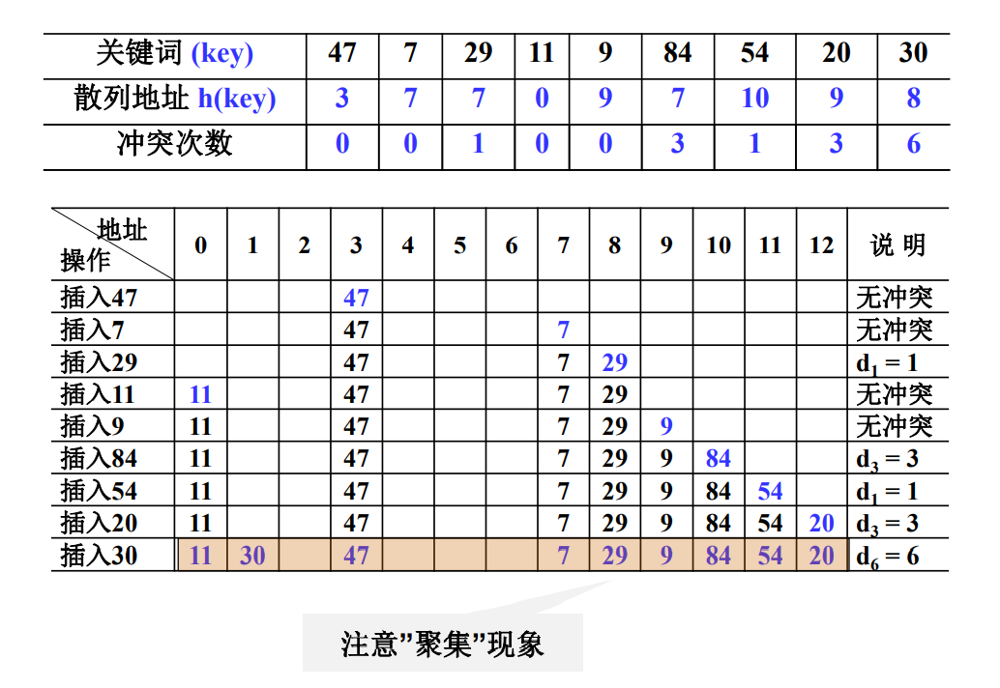

# 关于散列表/哈希表的一些补充

<!-- @import "[TOC]" {cmd="toc" depthFrom=3 depthTo=6 orderedList=false} -->

<!-- code_chunk_output -->

- [模运算中为何要用素数作为模？](#模运算中为何要用素数作为模)
- [设立散列规则时一般关注“别有聚集效应”](#设立散列规则时一般关注别有聚集效应)
- [衡量哈希表性能？ASLs和ASLu](#衡量哈希表性能asls和aslu)
- [一些tips](#一些tips)

<!-- /code_chunk_output -->

### 模运算中为何要用素数作为模？

参考：[模运算中为何要用素数作为模](https://flat2010.github.io/2018/04/19/%E6%A8%A1%E8%BF%90%E7%AE%97%E4%B8%AD%E4%B8%BA%E4%BD%95%E8%A6%81%E7%94%A8%E7%B4%A0%E6%95%B0%E4%BD%9C%E4%B8%BA%E6%A8%A1/)

《算法导论》中字符串匹配的Rabin-Karp算法的时候，里面提到了对要匹配的字符串计算出一个整型值之后，使用一个较大的素数进行模运算，并以模运算的结果作为匹配值。这里让[作者](https://flat2010.github.io/about/)产生了两个疑问，第一是：取余为何非要用一个素数进行模运算呢？第二是：为何还要把这个素数取得非常大？

### 设立散列规则时一般关注“别有聚集效应”

如上是线性探测法（Linear Probing）容易产生“聚集现象”。

聚集现象容易导致空间浪费，并且查找时间增加。

但是使用比如平方探测法，容易导致有剩余空间，但就是探测不到。如何解决这个问题？见 <a href="../../notes/data_structure/resources/11.3 冲突处理方法.pdf">11.3 ppt</a> ：
- 有定理显示，如果散列表长度是某个 `4k+3` （`k`是正整数）形式的素数时，平方探测法就可以查找到整个散列表空间。

### 衡量哈希表性能？ASLs和ASLu

有两个为维度：
- 成功平均查找长度 ASLs
- 不成功平均查找长度 ASLu

算例见 <a href="../../notes/data_structure/resources/11.3 冲突处理方法.pdf">11.3 ppt</a>。

更多讨论见 <a href="../../notes/data_structure/resources/11.4 散列表的性能分析.pdf">11.4 ppt</a>。

### 一些tips

注意散列表中删除，一般用懒惰删除，即不是真正删除，而是标记一下那个位置，下次插入用到的话，可以直接覆盖。
