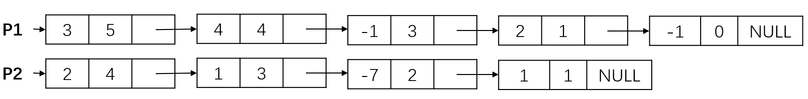

> **摘要：** 本次笔记从程序结构讲起，设计了一个较为复杂的多项式相加、相乘处理程序。锻炼对链表综合运用能力。

### 多项式加法运算

#### 采用不带头结点的单项链表实现

- 采用不带头结点的单向链表，按照指数递减的顺序排列各项。

代码见[../../cLib/DataStructure/ds_cou_2_Poly.cpp](../../cLib/DataStructure/ds_cou_2_Poly.cpp)。



如图三个每个结点中有三个参数：系数、指数、下一结点的指针。

```cpp
struct PolyNode
{
    int coef;              // 系数
    int expon;             // 指数
    struct PolyNode *link; // 指向下一节点的指针
};
typedef struct PolyNode *Polynomial;
Polynomial P1, P2;
```

##### 算法思路

- 用指针P1、P2分别指向这两个多项式的第一个结点，不断循环。
- - P1->expon==P2->expon：系数相加，若结果不为0，则作为结果多项式对应项的系数。同时，P1和P2都分别指向下一项；
- - P1->expon>P2->expon：将P1的当前项存入结果多项式，并使P1指向下一项；
- - P1->expon\<P2->expon：将P2的当前项存入结果多项式，并使P2指向下一项；
- 当某一项多项式处理完时，将另一项多项式的所有结点依此复制到结果多项式中去。

##### 算法实现

```cpp
Polynomial PolyAdd(Polynomial P1, Polynomial P2)
{
    Polynomial front, rear, temp;
    int sum;
    rear = (Polynomial)malloc(sizeof(struct PolyNode));
    front = rear;
    while (P1 && P2)
    {
        switch (Compare(P1->expon, P2->expon))
        {
        case 1:
            Attach(P1->coef, P1->expon, &rear);
            // Attach()将系数、指数形成新的项，拷贝到rear的后面
            P1 = P1->link;
            break;
        case -1:
            Attach(P2->coef, P2->expon, &rear);
            P2 = P2->link;
            break;
        case 0:
            sum = P1->coef + P2->coef;
            if (sum)
                Attach(sum, P1->expon, &rear);
            P1 = P1->link;
            P2 = P2->link;
            break;
        }
    }
    for (; P1; P1 = P1->link)
        Attach(P1->coef, P2->expon, &rear);
    for (; P2; P2 = P2->link)
        Attach(P2->coef, P2->expon, &rear);
    rear->link = NULL;
    temp = front; // 把空节点赋给temp，front后移，空节点temp释放掉。
    front = front->link;
    free(temp);
    return front;
}
```

其中，对Attach()的定义为

```cpp
void Attach(int c, int e, Polynomial *pRear)
{
    // 因为c函数常数为值传递，因此传入指针的指针pRear
    // 而*pRear代表pRear（指针的指针）指向的值
    Polynomial P;

    P = (Polynomial)malloc(sizeof(struct PolyNode));
    P->coef = c;
    P->expon = e;
    P->link = NULL;
    (*pRear)->link = P;
    *pRear = P;
}
```

### 设计函数求两个一元多项式的乘积与和

#### 输入样例

> 4 3 4 -5 2 6 1 -2 0
> 3 5 20 -7 4 3 1
> 第一行，代表第一个多项式有4项，系数指数分别为(,),(,),(,),(,)。

#### 求解思路

1. 多项式的表示
2. 程序框架
3. 读多项式
4. 加法实现
5. 乘法实现
6. 多项式输出

#### 多项式表示

1. 用数组表示：编程简单、调试容易，但是需要事先确定数组大小；
2. 用链表表示：动态性强，变成略微复杂、调试比较困难。

一种比较好的方式是动态数组。但是本次实现还是采用链表。

#### 程序框架搭建

```c
int main()
{
	读入多项式1
	读入多项式2
	乘法运算并输出
	加法运算并输出
	
	return 0;
}
```

需要设计的函数：
- 读一个多项式
- 量多项式相乘
- 两多项式相加
- 多项式输出

```c
int main()
{
	Polynomial P1, P2, PP, PS;

	P1 = ReadPoly();
	P2 = ReadPoly();
	PP = Mult( P1, P2 );
	PrintPoly( PP );
	PS = Add( P1, P2 );
	PrintPoly( PS );

	return 0;
}
```

#### 如何读入多项式

```c
Polynomial ReadPoly()
{
	......
	scanf("%d", &N);
	......
	while(N--){
		scanf("%d %d", &c, &e);
		Attach(c, e, &Rear);
	}
	......
	return P;
}
```

注意将Rear传入Attach()中时，应该采用传址调用。Rear初值设为NULL的话，Attach中要增加关于Rear的判断环节，不妥。因此令Rear指向一个空结点。

```c
Polynomial ReadPoly()
{
    Polynomial P, Rear, t;
    int c, e, N;

    printf("N Polynome, N: ");
    scanf("%d", &N);
    P = (Polynomial)malloc(sizeof(struct PolyNode));
    P->link = NULL;
    Rear = P;
    while (N--)
    {
        printf("coef and expon:");
        scanf("%d %d", &c, &e);
        Attach(c, e, &Rear);
    }
    t = P;
    P = P->link;
    free(t);
    return P;
}
```

#### 如何实现两多项式相乘

1. 将乘法运算转换为加法运算
- 将P1当前项(ci,ei)乘P2多项式，再加到结果多项式里

```c
t1 = P1; t2 = P2;
P = (Polynomial)malloc(sizeof(struct PolyNode));
P->link = NULL;
Rear = P;
while(t2){
	Attach(t1->coef*t2->coef, t1->expon+t2->expon, &Rear);
	t2 = t2->link;
} 
```

2. 逐项插入
- 将P1当前项(c1_i,e1_i)乘P2当前项(c2_i,e2_i)，并插入到结果多项式中，关键是要找到插入位置。
- 初始结果多项式可由P1第一项乘P2获得（如上）
- 逐项插入的实现框架如下

```c
Polynomial Mult(Polynomial P1, Polynomial P2){
    ......
    t1=P1;t2=P2;
    ......
    while (t2)  /* 先用P1的第1项乘以P2，得到P */
    {
        ......
    }
    t1 = t1->link;
    while (t1)
    {
        t2 = P2;Rear=P;
        while(t2){
            e=t1->expon+t2->expon;
            c=t1->coef*t2->coef;
            ......
            t2=t2->link;
        }
        t1=t1->link;
    }
    ......    
}
```

具体实现如下

```c
Polynomial Mult(Polynomial P1, Polynomial P2)
{
    Polynomial P, Rear, t1, t2, t;
    int c, e;

    if (!P1 || !P2)
        return NULL;

    t1 = P1;
    t2 = P2;
    P = (Polynomial)malloc(sizeof(struct PolyNode));
    P->link = NULL;
    Rear = P;
    while (t2) /* 先用P1的第1项乘以P2，得到P */
    {
        Attach(t1->coef * t2->coef, t1->expon + t2->expon, &Rear);
        t2 = t2->link;
    }
    t1 = t1->link;
    while (t1)
    {
        t2 = P2;
        Rear = P;
        while (t2)
        {
            e = t1->expon + t2->expon;
            c = t1->coef * t2->coef;
            while (Rear->link && Rear->link->expon > e)
            {
                Rear = Rear->link;
            }
            if (Rear->link && Rear->link->expon == e)
            {
                if (Rear->link->coef + c)
                    Rear->link->coef += c;
                else
                { // 如果系数相加等于0，删去这个结点
                    t = Rear->link;
                    Rear->link = t->link;
                    free(t);
                }
            }
            else
            { // 如果指数不相等，即小于的情况，申请新结点
                t = (Polynomial)malloc(sizeof(struct PolyNode));
                t->coef = c;
                t->expon = e;
                t->link = Rear->link;
                Rear->link = t;
                Rear = Rear->link;
            }
            t2 = t2->link;
        }
        t1 = t1->link;
    }
    t2 = P;
    P = P->link;
    free(t2);
    return P;
}
```

#### 多项式输出

实际上是一个链表的遍历问题，链表遍历的基本框架如下

```c
void PrintPoly(Polynomial P){
	
	while(P){
		
		P = P->link;
	}
}
```

具体实现如下

```c
void PrintPoly(Polynomial P)
{
    int flag = 0; // 辅助调整输出格式用
    if (!P)
    {
        printf("0 0\n");
        return;
    }
    while (P)
    {
        if (!flag)
        {
            printf("\n");
            flag = 1;
        }
        else
            printf(" ");
        printf("%d %d", P->coef, P->expon);
        P = P->link;
    }
}
```

flag作用为，如果是第一个输出的多项式的项，则前面不需要置空格。