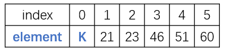
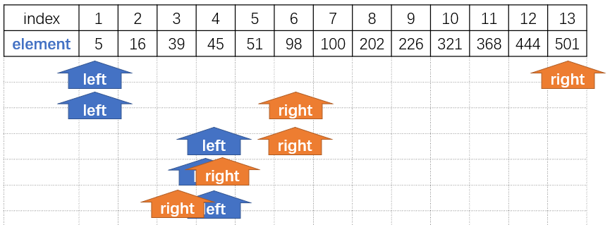
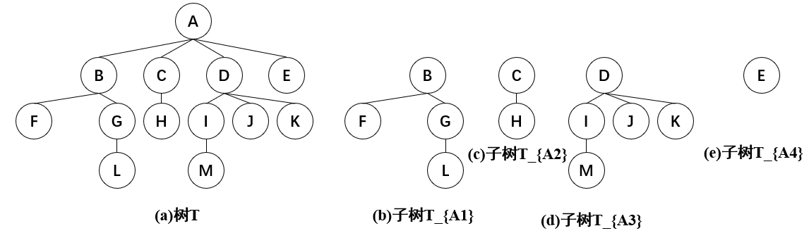
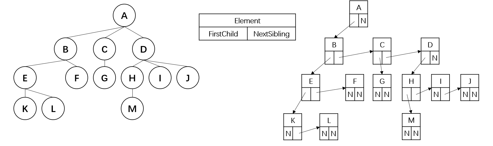
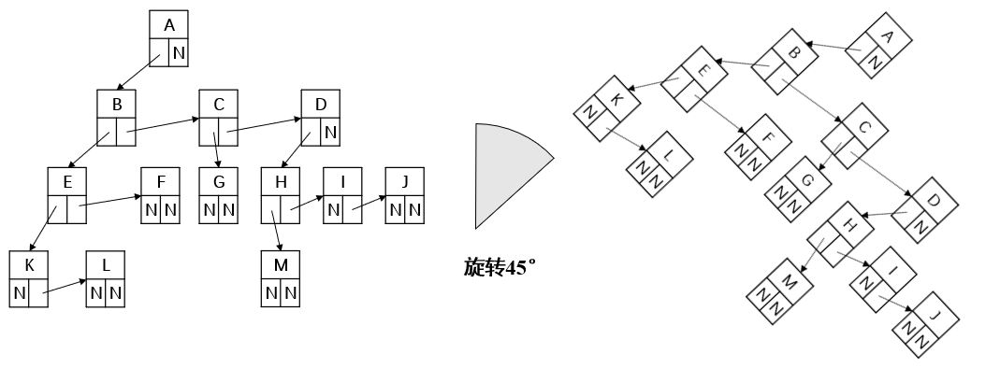

> **摘要：** 本笔记以“查找”案例开头，顺带介绍了顺序查找中的“哨兵”技巧。在案例中，引出特定条件下（有顺序的数组）使用二分查找效率更高的概念，进而介绍树的用处：可以高效二分查找，且可以动态插入、删除元素。二叉树可以表示所有树，且具有很多重要特性。

### 树的引子：查找

- 客观事件中许多事物存在层次关系。
- 分层次组织在管理上具有更高的效率（查找）。

#### 查找（Searching）

首先来看一个关于查找的案例，理解为什么要“分层次”，也就是为什么要引出“树”的概念。

- 查找就是根据某个给定的关键字K，从集合R中找出关键字与K相同的记录。
- 静态查找：没有插入和删除的操作；
- 动态查找：有插入和删除的操作。

#### 静态查找

##### 方法1：顺序查找（哨兵）



如上图，在 `Element[1] ~ Element[n]` 中放置元素，0位置留给哨兵。

```c
int SequentialSearch(List Tbl, ElementType K)
{ /* 在 Element[1] ~ Element[n] 中查找 */
    int i;
    Tbl->Element[0] = K; /* 建立哨兵 */
    for (i = Tbl->Length; Tbl->Element[i] != K; i--)
        ;
    return i; /* 查找成功，则返回所在单元下标，否则返回0 */
}

typedef struct LNode *List;
struct LNode
{
    ElementType Element[MAXSIZE];
    int Length;
};
```

```c
int SequentialSearch(List Tbl, ElementType K)
{ /* 在 Element[1] ~ Element[n] 中查找 */
    int i;
    for (i = Tbl->Length; i>0 && Tbl->Element[i] != K; i--)
        ;
    // 如上，如果没有哨兵，则需要设置 i > 0。
    return i; /* 查找成功，则返回所在单元下标，否则返回0 */
}
```

使用技巧：哨兵，在边缘处放置一个值（ `index=0` 处），如果查找到“哨兵”，循环就应该退出。哨兵减去了循环过程中边界片段的行为。

上述是哨兵的实现，在0处放置K；如果不成功，返回0。顺序查找算法的时间复杂度是`o(n)`。

##### 方法2：二分查找（Binary Search）

假设 n 个数据元素的关键字满足有序（比如从小到大）：

$$k_1<k_2<...<k_n$$

并且，其连续存放，那么可以进行二分查找。

例如，二分查找关键字为43的数据元素如下：



1. left=1, right=13; mid=(1+13)/2=7; L[mid]>43;
2. left=1, right=mid-1=6; mid=(1+6)/2=3; L[mid]<43;
3. left=mid+1=4, right=6; mid=(4+6)/2=5; L[mid]>43;
4. left=4, right=mid-1=4; mid=(4+4)/2=4; L[mid]>43;
5. left=4, right=mid-1=3; left>right, 查找失败，结束。

如上，当$left>right$时，可断定要找的元素不在数组中。

##### 二分查找的实现

```c
int BinarySearch(List Tbl, ElementType K)
{
    int left, right, mid, NotFound = -1;
    left = 1;
    right = Tbl->Length;
    while (left <= right)
    {
        mid = (left + right) / 2;
        if (K < Tbl->Element[mid])
            right = mid - 1;
        else if (K > Tbl->Element[mid])
            left = mid + 1;
        else
            return mid;
    }
    return NotFound;
}
```

每次循环查找范围都除以二，因此时间复杂度为$log_2(n)$。

##### 二分查找的启示（二分查找判定树）

- 判定树上每个结点需要的查找次数刚好为该结点所在层数；
- 查找成功时查找次数不会超过判定树的深度；
- n个结点的判定树的深度为$[log_2n]+1$。
- ASL（平均成功查找次数）=$(4\times 4+4\times 3+2\times 2+1)/11=3$。查找4次才成功的有4个元素，以此类推。

因此，引出**查找树**的概念。查找树时间复杂度也为$log_2(n)$，但插入、删除操作更为方便。因此适于动态查找。

### 树

树（Tree）：n（n大于等于0）个结点构成的有限集合。
- 当n=0时，称为**空树**；
- 对于任一棵非空树（n大于0），具备以下性质：
- - 树中有一个称为“根（Root）”的特殊结点，用r表示；
- - 其余结点可分为m（m大于0）个互不相交的有限集T_1，T_2，...，T_m，其中每个集合本身又是一棵树，称为原来树的“子树（SubTree）”。



#### 树与非树

注意，在树中：
- 子树是不相交的；
- 除了根节点外，每个结点有且仅有一个父结点；
- 一棵N个结点的树有N-1条边。

m 棵树共有 k 条边，则一共有 m + k 个节点。

#### 树的基本术语

1. 结点的度（Degree）：结点的子树个数；
2. 树的度：树的所有结点中最大的度数；
3. 叶结点（Leaf）：度为0的结点；
4. 父节点（Parent）：有子树的结点是其子树的根结点的父结点；
5. 子节点（Child）：若A结点是B结点的父结点，则称B结点是A结点的子结点；子结点也称孩子结点；
6. 兄弟结点（Sibling）：具有同一父结点的各个结点彼此是兄弟结点；
7. 路径和路径的长度：从结点n_1到n_k的路径为一个结点序列n_1，n_2，...，n_i是n_{i+1}的父结点。路径所包含的个数为路径的长度；
8. 祖先结点（Ancestor）：沿树根到某一节点路径上所有结点都是这个结点的祖先结点；
9. 子孙结点（Descendant）：某一节点的子树中的所有结点是这个结点的子孙；
10. 结点的层次（Level）：规定根节点在1层，其他任一结点的层数是其父结点的层数加1；
11. 树的深度（Depth）：树中所有结点中最大层次是这棵树的深度。

#### 树的实现（儿子-兄弟表示法）


如上图树**难以**用数组、链表表示（每个结点不一样）。

因此采用儿子兄弟表示法。



将上述链表旋转45度，如下图。



旋转45度后，每个链结点都有0-2个子树。因此二叉树可以表示任意树。二叉树是树结构研究中最为重要的内容。
