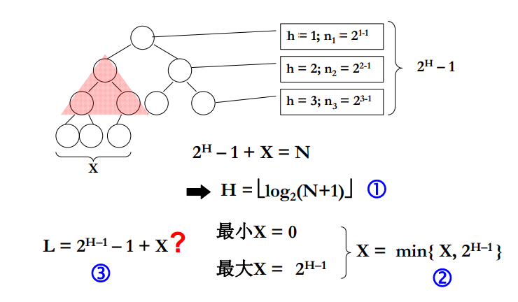

# 完全二叉搜索树

<!-- @import "[TOC]" {cmd="toc" depthFrom=3 depthTo=6 orderedList=false} -->

<!-- code_chunk_output -->

- [根节点从0开始的完全二叉树](#根节点从0开始的完全二叉树)
- [已知`n`，求完全二叉树左子树长度](#已知n求完全二叉树左子树长度)

<!-- /code_chunk_output -->

### 根节点从0开始的完全二叉树

如果根节点从 `0` 开始计数，则：
- 左子树： `2 * i + 1`
- 右子树： `2 * i + 2`

### 已知`n`，求完全二叉树左子树长度

已知完全二叉树其节点数量为 `N` ，则求其左子树结点数量。

首先，我们能确定完全二叉树有多少层，不确定的就是，最后一层有多少个结点，设这个遍历为 `X` 。

完全二叉树的 **满的高度** 是

$$H = \lfloor log_2 (N + 1) \rfloor$$

注意， `X` 是最后一层的节点数量，而我们要求然后求的是左子树中最后一层的结点数量，因此有

$$X_{left} = \min\{ N - 2^H + 1 , 2^{H - 1} \}$$

所以，左子树结点数量为：

$$L = 2^{H - 1} - 1 + X_{left}$$

