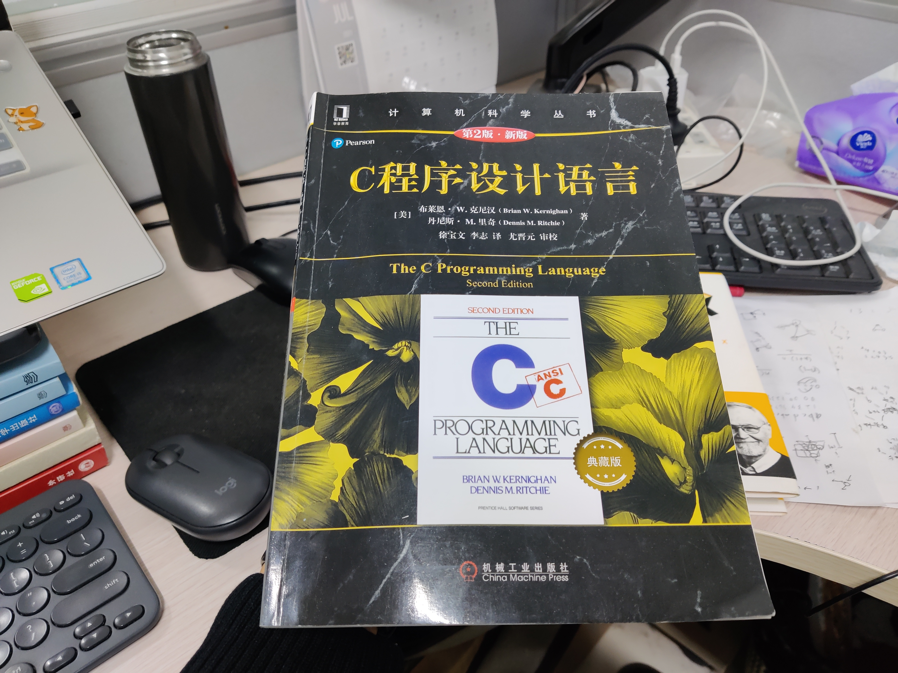

# 《C程序设计语言》拾遗

这是不是第一个高级编程语言，但是是一个划时代的语言。

<!-- @import "[TOC]" {cmd="toc" depthFrom=3 depthTo=6 orderedList=false} -->

<!-- code_chunk_output -->

- [总结：核心还是算法](#总结核心还是算法)
- [（不常用）寄存器变量register](#不常用寄存器变量register)
- [宏比你想象的更常用，但不建议使用](#宏比你想象的更常用但不建议使用)
- [标准库中定义了很多有趣的东西比如NULL](#标准库中定义了很多有趣的东西比如null)
- [argc与argv](#argc与argv)
- [？函数名本身就是函数地址](#函数名本身就是函数地址)
- [任何类型的指针都可以转换为 void *](#任何类型的指针都可以转换为-void)
- [编译时（compile-time）运算符sizeof](#编译时compile-time运算符sizeof)
- [union](#union)
- [变长参数表与stdarg.h](#变长参数表与stdargh)
- [标准库实现杂记](#标准库实现杂记)
  - [名字以下划线开始](#名字以下划线开始)
  - [malloc与free的基础：用链表保存记录](#malloc与free的基础用链表保存记录)

<!-- /code_chunk_output -->

### 总结：核心还是算法



I/O、内存分配、系统调用...你会发现本书中的标准库实例大多重点都还是算法与数据结构。

这里不记录具体实现，挑一些思想与容易被遗漏的内容记录。

### （不常用）寄存器变量register

```c
register int x;
register char c;

f(register unsigned m, register long n)
{
    register int i;
    ...
}
```

只适用于自动变量（Automatic Variable, 指的是局部作用域变量）或者函数的形式参数。

这种声明是告诉编译器，变量使用频率较高，可以将其放在寄存器中，可以使程序更小、执行速度更快。

### 宏比你想象的更常用，但不建议使用

标准库中很多内容都是用宏实现的，但是 `Effective C++` 中建议能少使用宏就少使用宏，这里不赘述 `Effective C++` 中的原因。

头文件 `<stdio.h>` 中的 `getchar` 和 `putchar` “函数”以及 `<ctype.h>` 中的 `tolower` “函数”一般都是宏，这样就避免了对每个字符都进行函数调用的开销。

```c
#define getchar() getc(stdin)
#define putchar(c) putc((c), stdout)
```

### 标准库中定义了很多有趣的东西比如NULL

比如 `NULL` 定义在 `<stddef.h>` 中。

### argc与argv

```c
main(int argc, char *argv[])
{
    for (i = 1; i < argc; i++)
    {
        ...
    }
    return 0;
}
```

- `argv[0]` 的值是启动该程序的程序名，因此 `argc` 的值至少为 `1`
- ANSI标准要求 `arhv[argc]` 的值必须为一空指针

原来命令行参数是这样获取并解析的。

### ？函数名本身就是函数地址

这个很好理解：
```c
int foo()
{
    return 5;
}

int (*funcptr)() = foo;
```

### 任何类型的指针都可以转换为 void *

```c
void qsort(void *v[], int left, int right, int (*comp)(void *, void *))
{
    int i, last;
    void swap(void *v[], int, int);

    if (left >= right)
        return ;

    swap(v, left, (left + right) / 2);
    last = left;

    for (i = left + 1; i <= right; i++)
        if ((*comp)(v[i], v[left]) < 0)
            swap(v, ++last, i);
    swap(v, left, last);
    qsort(v, left, last-1, comp);
    qsort(v, last+1, right, comp);
}
```

### 编译时（compile-time）运算符sizeof

```c
sizeof 对象
sizeof(类型名)
```

一个求数组长度的实例：
```c
struct key {
    char *word;
    int count;
} keytab[] = {
    "auto", 0,
    "break", 0,
    /* ... */
    "void", 0,
    "volatile", 0,
    "while", 0
};

// 数组的长度在编译时已经完全确定
// 等于数组项的长度乘以项数，因此可以是
// keytab 的长度 / struct key 的长度
#define NKEYS (sizeof keytab / sizeof(struct key))
// 而下一种方法更好，因为类型改变了不需要改动程序
#define NKEYS (sizeof keytab / sizeof keytab[0])
```

条件编译语句 `#if` 中不能使用 `sizeof` ，因为预处理器不对类型名进行分析。但预处理器并不计算 `#define` 语句中的表达式，因此，在 `#define` 中使用 `sizeof` 是合法的。

### union

```c
union u_tag {
    int ival;
    float fval;
    char *sval;
} u;

// 实例如下
struct {
    char *name;
    int flags;
    int utype;
    union {
        int ival;
        float fval;
        char *sval;
    } u;
} symtab[NSYM];

symtab[i].u.ival
*symtab[i].u.sval
```

联合 `union` 只能有一个成员有值，只能用其第一个成员类型的值初始化。

此外，联合是一个结构，其所有成员相对于基地址的偏移量都是0，必须足够“宽”，因此一般强制一个变量在特定类型的存储边界上，以对其。如下为 `malloc` 链表块头部的例子：

```c
typedef long Align;  /* 让 union 安装 long 类型的边界对齐 */

union header {
    struct {
        union header *ptr;
        unsigned size;
    } s;
    Align x;  // 永远不会被使用，用于对其
};

typedef union header Header;
```

### 变长参数表与stdarg.h

函数 `printf` 的正确声明形式为：
```c
int printf(char *fmt, ...)
```

省略号表示参数表中参数的数量和类型是可变的。省略号只能在出现参数表的尾部。

这里以简化版 `prinf` —— `minprintf` 为例。

编写 `minprintf` 的 **关键在于如何处理一个甚至连名字都没有的参数表。标准头文件<stdarg.h>中包含一组宏定义，** 它们对如何遍历参数表进行了定义。该头文件的实现因为不同的机器而不同，但提供的接口是一致的。

`Va_list` 类型用于声明一个变量，该变量将依次引用各参数。我们将在 `minprintf` 例子中将该变量称为 `ap` ，即“参数指针”。宏 `va_start` 将 `ap` 初始化为指向第一个无名参数的指针。在使用 `ap` 之前， `va_start` 必须被调用一次。参数表必须至少包括一个有名参数， `va_start` 将最后一个有名参数作为起点。

每次调用 `va_arg` ，该函数都将返回一个参数，并将 `ap` 指向下一个参数。 `va_arg` 使用一个类型名来决定返回的对象类型、指针移动的步长。最后，必须在函数返回之前调用 `va_end` ，以完成一些清理工作。

```c
#include <stdarg.h>

/* minprintf 函数：带有可变参数表的简化 printf 函数 */
void minprintf(char *fmt, ...)
{
    va_list ap;  // 依次指向每个无名参数
    char *p, *sval;
    int ival;
    double dval;

    va_start(ap, fmt);  // 将 ap 指向第一个无名参数
    for (p = fmt; *p; p++) {
        if (*p != '%') {
            putchar(*p);
            continue;
        }
        switch (*++p) {
        case 'd':
            ival = va_arg(ap, int);
            printf("%d", ival);
            break;  // break 的是 switch
        case 'f':
            dval = va_arg(ap, double);
            printf("%f", dval);
            break;
        case 's':
            for (sval = va_arg(ap, char *); *sval; sval++)
                putchar(*sval);
            break;
        default:
            putchar(*p);
            break;
        }
    }
    va_end(ap);  // 结束时的清理工作
}
```

### 标准库实现杂记

#### 名字以下划线开始

只供标准库中其他函数所使用的名字以下划线开始。

`<stdio.h>`：
```c
...

extern FILE _iob[OPEN_MAX];

#define stdin  (&_iob[0])
#define stdout (&_iob[1])
#define stderr (&_iob[2])

enum _flags {
    _READ  = 01,
    _WRITE = 02,
    _UNBUT = 04,
    _EOF   = 010,
    _ERR   = 020
}

...
```

#### malloc与free的基础：用链表保存记录

`malloc` 是通过扫描链表，并且切分出连续空闲空间（或者向系统申请）来分配内存的。神奇的设计。
