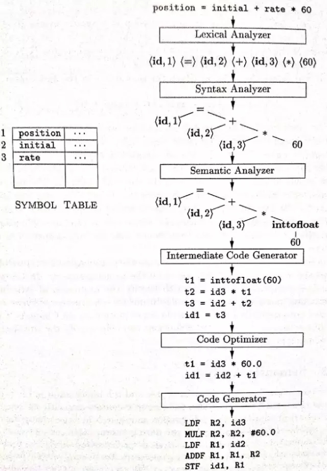
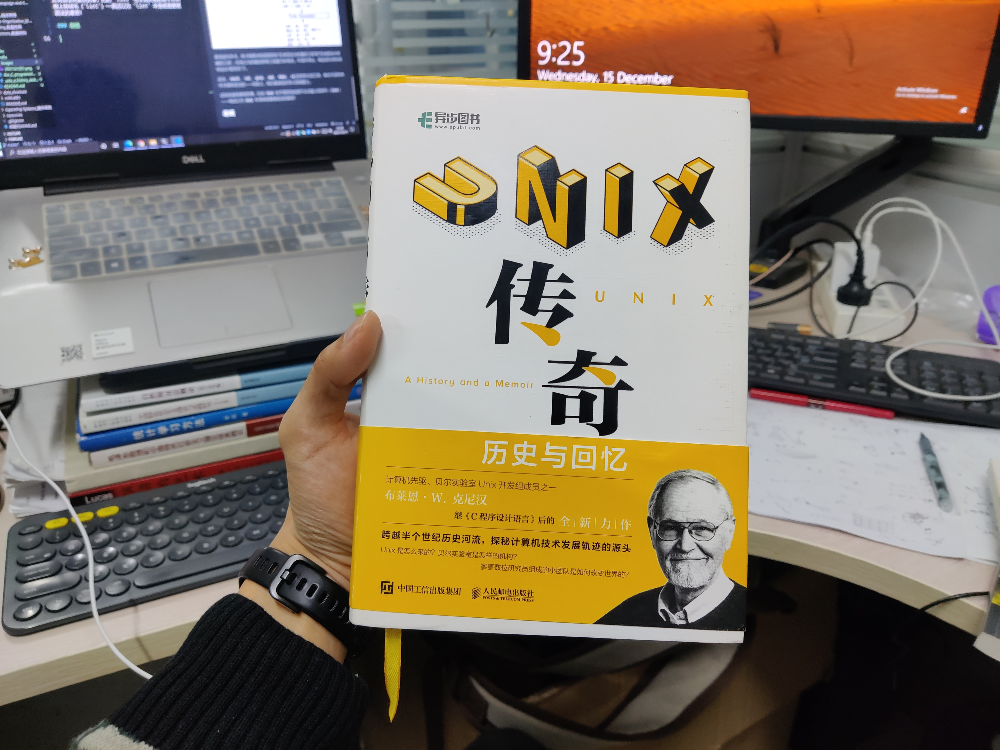

# 《Unix 传奇》读后感

这是一本值得珍藏在书架里的书。记录一些随笔与心得。

<!-- @import "[TOC]" {cmd="toc" depthFrom=3 depthTo=6 orderedList=false} -->

<!-- code_chunk_output -->

- [纠缠：计算机与数学优化](#纠缠计算机与数学优化)
- [失败：第二系统效应与 Plan 9 的傲慢](#失败第二系统效应与-plan-9-的傲慢)
- [传奇：伟大的人与伟大的工具](#传奇伟大的人与伟大的工具)
- [总结](#总结)

<!-- /code_chunk_output -->

### 纠缠：计算机与数学优化

计算机与数学优化总是纠缠在一起。但我没有想到作者最先提到的工作是一些今天看起来有点简单，但那个时候颇具挑战性的运筹问题（“运筹”这个词是管理学中数学优化所属的领域，涵盖最优化方法、线性规划等内容）。很难想象在分支定界也才刚刚被发明出来的上世纪六、七十年代，他们是如何在没有 C 语言的情况下完成自动化的求解工作的。

尽管，数学优化似乎与 Unix 的诞生并没有什么数学关系，肯 · 汤普森书写最初版的 Unix 代码时也不需要怎么推到数学公式，但作者布莱恩 · 克尼汉在数学优化上的工作以及 1127 中心隔壁的数学研究专家中心让我认识到：在贝尔实验室工作是一件颇费脑力的事，他们总是面临着最前沿和最艰巨的脑力挑战；换言之，**挑战并不来自于设备等外部因素，而是来自于自己的智慧——只有真正智慧的头脑才能设计出如此巧妙的操作系统架构，才能让当前世界上上百亿的设备上的操作系统都具有 Unix DNA 。**

### 失败：第二系统效应与 Plan 9 的傲慢

Unix 的诞生多少“得益于”`Multics（Multiplexed Information and Computing Service`, 多路复用信息和计算服务）的失败。

作者认为其失败是由于“第二系统效应（`second system effect`）”，这里摘抄一下第二系统效应的意思：所谓第二系统效应，意思是在首个系统创建成功后，打算创建一个新系统，修正旧系统的遗留问题，还要添加每个人期望的新特性，结果常常是塞了太多不同的东西进去，最终得到过于复杂的系统。

或许也可以理解为“过度设计（`over-engineered`）”？

这条经验对于我这种个人开发者多少有些启示：
- 开发项目时，与其纠结功能与完整性，不如先从简单的功能做起
- 精巧的架构远比繁杂的功能更重要，在设计之初采用了正确的思想，好的架构让代码更加利于扩展、维护、升级和使用

**因此我想，或许在 Unix 没有什么团队合作是有益的，因为有些东西比如 Unix ，是需要些“个人英雄主义”的。** 让肯 · 汤普森独自敲三周代码，设计出的东西将注定要强于一堆不如肯的人你一嘴我一嘴所得到的中庸玩意。

Unix 的商业失败我这里不谈（或许也不算失败）。我更想提一句 Plan 9 这个“更好”的操作系统：一个用于弥补 Unix 的操作系统，竟然在九十年代不准备提供 C 的标准I/O库 `stdio` 而是使用新库 `bio` 、 不兼容 `Make` ... **现在我们都知道，抛弃生态是不可理喻的：** `C#` 与 `java` 语法相似，甚至前者在设计与性能上都优于后者，但是却无法分得后者哪怕一点蛋糕；就算你能设计出性能比现有指令集好100倍的指令集，也没人会为你造芯片，因为主流的软硬件几乎无法迁移；`JavaScript` 有这么多语言 bug 可在我看来依旧是影响力无可比拟的语言。

但是 `uft-8` 竟然是诞生于 Plan 9 的，伟大的作品。

### 传奇：伟大的人与伟大的工具

我实在是无法将这么多名字记住。在书中享有单独一小节“小传”的人有三位：肯 · 汤普森，丹尼斯 · 里奇，道格 · 麦基尔罗伊。然而伟大的同事实在太多了，或许随着我对操作系统、计算机网络的深入，会逐渐发现更多出现在本书里的名字。

**给我留下深刻印象的工具是 `Lex` 和 `Yacc` 。** 我专门去学习了这两个工具：[Part 01: Tutorial on lex/yacc](https://www.youtube.com/watch?v=54bo1qaHAfk)、[Part 02: Tutorial on lex/yacc](https://www.youtube.com/watch?v=__-wUHG2rfM)。

直到读完本书，我才粗略地知道竟然有“生成词法分析器的工具”和“生成语法分析器的工具”，比我以为的编译原理工具要巧妙得多。不得不承认，我还是太低估这些远古“程序员”了。

此外，`shell`、`cat`、`grep`、`awk`、`Make`、`vi`这些伟大的工具，我们不该将他作为理所应当的——实际上，我们都是踩在伟人的肩膀上。

还有些很有意思的事，比如 `lint` 名字竟然是起源于从衣服上拾绒毛（`lint`）——我还以为 `lint` 本身就是整理语法的意思！

### 总结

在这个时代，如果你选择成为开发者，那么恭喜你：**你脚下的巨人雄伟无比，能在踩他的肩膀上是全人类的幸事。**
