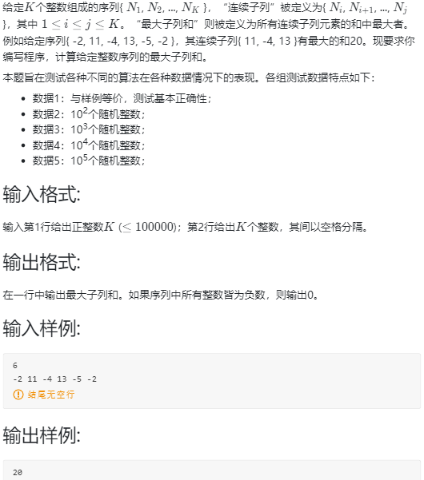
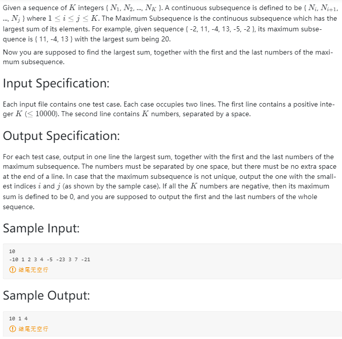

<!-- @import "[TOC]" {cmd="toc" depthFrom=1 depthTo=6 orderedList=false} -->

<!-- code_chunk_output -->

- [选择题](#选择题)
  - [一段代码的时间复杂度是](#一段代码的时间复杂度是)
- [编程题](#编程题)
  - [01-复杂度1 最大子列和问题 (20 分)](#01-复杂度1-最大子列和问题-20-分)
  - [01-复杂度2 Maximum Subsequence Sum (25 分)](#01-复杂度2-maximum-subsequence-sum-25-分)

<!-- /code_chunk_output -->


## 选择题

### 一段代码的时间复杂度是

```cpp
if ( A > B ) {
    for ( i=0; i<N; i++ )
        for ( j=N*N; j>i; j-- )
            A += B;
}
else {
    for ( i=0; i<N*2; i++ )
        for ( j=N*2; j>i; j-- )
            A += B;
}
```

- $O(N^3)$

## 编程题

### 01-复杂度1 最大子列和问题 (20 分)



```cpp
// dp
#include <iostream>
using namespace std;

typedef long long LL;

const int N = 1e5 + 10;
int a[N];
LL dp[N];

int main()
{
    int n;
    scanf("%d", &n);
    for (int i = 0; i < n; ++ i) scanf("%d", &a[i]);
    
    dp[0] = a[0];
    LL maxv = 0;
    for (int i = 1; i < n; ++ i)
    {
        if (dp[i - 1] < 0) dp[i] = (LL) a[i];
        else dp[i] = dp[i - 1] + (LL) a[i];
        if (dp[i] > maxv) maxv = dp[i];
    }
    printf("%lld\n", maxv);
}
```

### 01-复杂度2 Maximum Subsequence Sum (25 分)



```cpp
#include <iostream>
using namespace std;

typedef long long LL;

const int N = 1e4 + 10;

int n;
int a[N];

int main()
{
    scanf("%d", &n);
    for (int i = 0; i < n; ++ i) scanf("%d", &a[i]);
    
    int l = a[0], r = a[0];
    int last_l = a[0];
    LL lastSeq = (LL) a[0], maxv = a[0];
    // 警惕变量命名，上面别用 i j 表示左右指针
    for (int i = 1; i < n; ++ i)
    {
        if (lastSeq >= 0)
        {
            lastSeq = lastSeq + (LL) a[i];
        }
        else
        {
            lastSeq = a[i];
            last_l = a[i];
        }
        if (lastSeq > maxv) l = last_l, r = a[i], maxv = lastSeq;
    }
 
    if (maxv < 0) printf("0 %d %d\n", a[0], a[n-1]);
    else printf("%lld %d %d\n", maxv, l, r);
}
```
