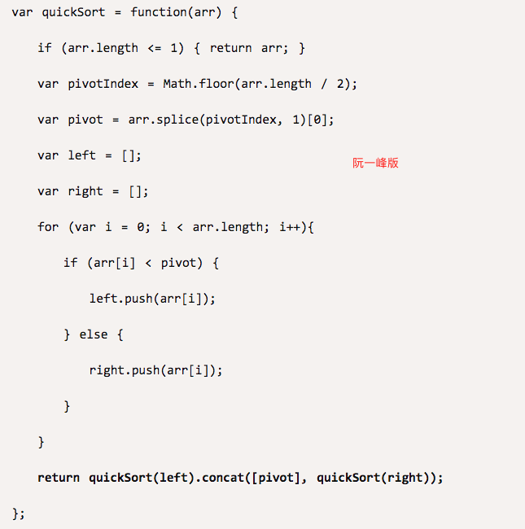

<!-- @import "[TOC]" {cmd="toc" depthFrom=1 depthTo=6 orderedList=false} -->

<!-- code_chunk_output -->

- [选择题](#选择题)
  - [什么是快速排序算法的最好情况？](#什么是快速排序算法的最好情况)
  - [快速排序是稳定的算法（错）](#快速排序是稳定的算法错)
  - [给定A[]调用非递归的归并排序加表排序执行第1趟后，表元素的结果是](#给定a调用非递归的归并排序加表排序执行第1趟后表元素的结果是)
  - [给定A[]调用表排序后，表元素的结果是](#给定a调用表排序后表元素的结果是)
  - [基数排序是稳定的算法（对）](#基数排序是稳定的算法对)
  - [请选择下面四种排序算法中最快又是稳定的排序算法](#请选择下面四种排序算法中最快又是稳定的排序算法)
  - [下列排序算法中，哪种算法可能出现：在最后一趟开始之前，所有的元素都不在其最终的位置上](#下列排序算法中哪种算法可能出现在最后一趟开始之前所有的元素都不在其最终的位置上)
  - [当待排序列已经基本有序时，下面哪个排序算法效率最差](#当待排序列已经基本有序时下面哪个排序算法效率最差)
  - [数据序列（3,2,4,9,8,11,6,20）只能是下列哪种排序算法的两趟排序结果](#数据序列3249811620只能是下列哪种排序算法的两趟排序结果)
- [讨论题](#讨论题)
  - [快排问题](#快排问题)
  - [从1000个数字中找出最大的10个数字，最快的算法是——](#从1000个数字中找出最大的10个数字最快的算法是)
- [编程题](#编程题)
  - [](#)

<!-- /code_chunk_output -->

## 选择题

### 什么是快速排序算法的最好情况？

每次正好中分。

因为这样才严格地进行了分而治之，则完美用到了二分的时间复杂度 $Nlog N$ 。

反之，如果每次都选到了边缘，则每次递归处理的序列大小为 $n-1, n-2, ..., 1$ 时间复杂度就成了 $N^2$ 。

### 快速排序是稳定的算法（错）

观察程序显而易见。

### 给定A[]调用非递归的归并排序加表排序执行第1趟后，表元素的结果是

```
A[]={46, 23, 8, 99, 31, 12, 85}

1, 0, 2, 3, 5, 4, 6
```

实际上就是对索引排序，然后所谓`非递归的归并排序执行第1趟`就是`(0,1) (1,2) ...`这些互换位置。

### 给定A[]调用表排序后，表元素的结果是

```
A[]={23, 46, 8, 99, 31, 12, 85}

2, 5, 0, 4, 1, 6, 3
```

### 基数排序是稳定的算法（对）

### 请选择下面四种排序算法中最快又是稳定的排序算法

- A.希尔排序
- B.堆排序
- C.归并排序（对）
- D.快速排序

### 下列排序算法中，哪种算法可能出现：在最后一趟开始之前，所有的元素都不在其最终的位置上

- A.堆排序
- B.插入排序（对）
- C.冒泡排序
- D.快速排序

有可能最后一个元素插到最前面，所有元素后移。

### 当待排序列已经基本有序时，下面哪个排序算法效率最差

- A.快速排序
- B.直接插入
- C.选择排序（对）
- D.堆排序

选择排序咋都得来个 $O(N^2)$ 。

### 数据序列（3,2,4,9,8,11,6,20）只能是下列哪种排序算法的两趟排序结果

- A.冒泡排序（后2个数必须是最大的）
- B.插入排序（前2个数必须是有序的）
- C.选择排序（前2个数必须是最小的）
- D.快速排序（至少`1+2`个元素在正确的位置上）

```
2 3 4 6 8 9 11 20
3 2 4 9 8 11 6 20
    √   √      √
```

## 讨论题

### 快排问题



这个快排问题在哪？

额外的空间就不是 $O(\log N)$ 了，而是 $O(N\log N)$ 。

### 从1000个数字中找出最大的10个数字，最快的算法是——

A. 归并排序
B. 快速排序
C. 堆排序
D. 选择排序

答案是C。但是这个答案真的对吗？

摘自[曾纪岚](https://www.icourse163.org/learn/ZJU-93001?tid=1465570445#/learn/forumpersonal?uid=1418130817)：感觉优化过的选择排序或许会更好，将选择排序中的maxdate换成一个数组形式，可以用最小堆进行存储。每次把读入数据和堆顶进行比较，然后删除，插入即可。（没太懂）

摘自[mooc41747005296524519](https://www.icourse163.org/learn/ZJU-93001?tid=1465570445#/learn/forumpersonal?uid=1402956424)：如果只有这四个选项，我会选堆排序；但我觉得冒泡排序性能可能会更好

## 编程题

### 
