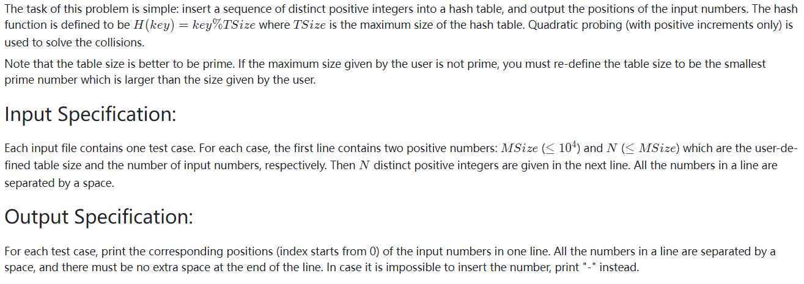
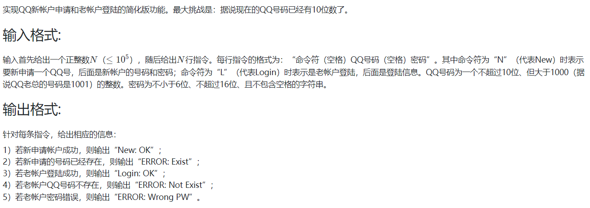
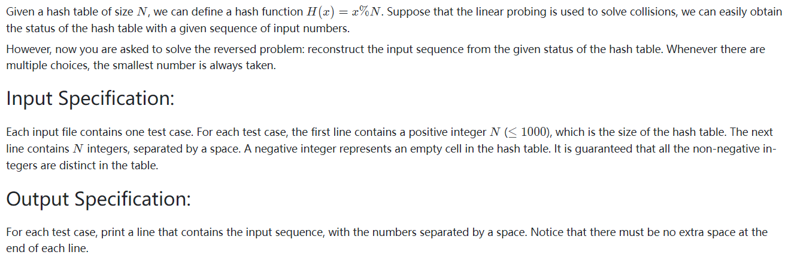

<!-- @import "[TOC]" {cmd="toc" depthFrom=1 depthTo=6 orderedList=false} -->

<!-- code_chunk_output -->

- [选择题](#选择题)
  - [分离链接法构造散列表](#分离链接法构造散列表)
  - [平方探测法解决冲突，该元素将被放在什么位置](#平方探测法解决冲突该元素将被放在什么位置)
  - [线性探测法解决冲突，该元素将被放在什么位置](#线性探测法解决冲突该元素将被放在什么位置)
- [讨论题](#讨论题)
  - [已知散列表元素状态，推测可能的元素输入顺序](#已知散列表元素状态推测可能的元素输入顺序)
- [编程题](#编程题)
  - [11-散列1 电话聊天狂人 (25 分)](#11-散列1-电话聊天狂人-25-分)
  - [11-散列2 Hashing (25 分)](#11-散列2-hashing-25-分)
  - [11-散列3 QQ帐户的申请与登陆 (25 分)](#11-散列3-qq帐户的申请与登陆-25-分)
  - [11-散列4 Hashing - Hard Version (30 分)](#11-散列4-hashing-hard-version-30-分)

<!-- /code_chunk_output -->

## 选择题

### 分离链接法构造散列表

设有一组记录的关键字为 {19，14，23，1，68，20，84，27，55，11，10，79}，用分离链接法构造散列表，散列函数为`H(key)= key mod 13`。问：散列地址为1的链中有几个记录？

> 4

### 平方探测法解决冲突，该元素将被放在什么位置

设一个散列表的大小是11, 散列函数是`H(key)=key mod 11`. 若采用平方探测（$d_i = +/- i^2$）冲突解决方法，将4个元素{14，38，61，86}顺序插入散列表中。如果再插入元素49，则该元素将被放在什么位置？

> 4

### 线性探测法解决冲突，该元素将被放在什么位置

假设一散列表的大小是11,散列函数是H`(key)=key mod 11`，用线性探测法解决冲突。先将4个元素{14，38，61，86}按顺序插入初始为空的散列表中。如果再插入元素49，则该元素被插入到表中哪个位置（下标）？ 

> 7

## 讨论题

### 已知散列表元素状态，推测可能的元素输入顺序

元素不多的话，可以暴搜+剪枝来做。

```cpp
function<void(int, int)> dfs = [&](int u)  // 插入 u
{
    // 插入 u 后如果与已知矛盾，剪枝
    // 否则继续枚举插入可能
};
```

具体编程见题目 [11-散列4 Hashing - Hard Version (30 分)](#11-散列4-hashing-hard-version-30-分) 。

## 编程题

### 11-散列1 电话聊天狂人 (25 分)

给定大量手机用户通话记录，找出其中通话次数最多的聊天狂人。

输入格式:
- 输入首先给出正整数$N(≤10^5)$，为通话记录条数。随后$N$行，每行给出一条通话记录。简单起见，这里只列出拨出方和接收方的11位数字构成的手机号码，其中以空格分隔。

输出格式:
- 在一行中给出聊天狂人的手机号码及其通话次数，其间以空格分隔。如果这样的人不唯一，则输出狂人中最小的号码及其通话次数，并且附加给出并列狂人的人数。

输入样例:
```
4
13005711862 13588625832
13505711862 13088625832
13588625832 18087925832
15005713862 13588625832
```

输出样例:
```
13588625832 3
```

```cpp
#include <unordered_map>
#include <iostream>
using namespace std;

unordered_map<string, int> h;

int main()
{
    string a, b;
    int n;
    cin >> n;
    for (int i = 0; i < n; ++ i)
    {
        cin >> a >> b;
        h[a] ++ ;
        h[b] ++ ;
    }

    string maxs = "99999999999";
    int maxv = -1, cnt = 0;
    for (auto&& item: h)
    {
        if (item.second > maxv)
        {
            maxv = item.second;
            maxs = item.first;
            cnt = 1;
        }
        else if (item.second == maxv)
        {
            cnt ++ ;
            if (maxs > item.first)
                maxs = item.first;
        }
    }

    cout << maxs << " " << maxv;
    if (cnt > 1) cout << " " << cnt;
    cout << endl;
}
```

### 11-散列2 Hashing (25 分)



```cpp
#include <iostream>
#include <cstring>
using namespace std;

bool isPrime(int x)
{
    if (x <= 1) return false;  // 一定要有这个判断
    for (int i = 2; i * i <= x; ++ i)
        if (x % i == 0) return false;
    return true;
}

int findP(int x)
{
    while (!isPrime(x))
        x ++ ;
    return x;
}

int main()
{
    int n, m;
    cin >> n >> m;
    int p = findP(n);

    int st[p];
    memset(st, 0, sizeof st);

    for (int i = 0; i < m; ++ i)
    {
        int num;
        cin >> num;
        int pos = num % p;
        int base = pos;

        int cnt = 1;
        while (st[pos] && cnt <= p)
        {
            // pos = base + (cnt / 2) * (cnt / 2) * (cnt % 2 == 0 ? 1 : -1);
            // pos = (pos < 0 ? p + pos % p : pos % p);
            pos = base + cnt * cnt;
            pos = pos % p;
            ++ cnt ;
        }
        if (st[pos]) cout << "-";
        else
        {
            st[pos] = 1;
            cout << pos;
        }
        if (i < m - 1) cout << " ";
    }
}
```

即便判断是否为素数不是本题重点，我也应该给写严谨，应该包含 `if (x <= 1) return false;` 这个判断。

此外这题很坑，平方探测法根本不是上课讲的那种。

### 11-散列3 QQ帐户的申请与登陆 (25 分)



```
// input
5
L 1234567890 myQQ@qq.com
N 1234567890 myQQ@qq.com
N 1234567890 myQQ@qq.com
L 1234567890 myQQ@qq
L 1234567890 myQQ@qq.com

// output
ERROR: Not Exist
New: OK
ERROR: Exist
ERROR: Wrong PW
Login: OK
```

```cpp
#include <iostream>
#include <unordered_map>
using namespace std;

char op;
string id, pw;
int n;
unordered_map<string, string> db;

int main()
{
    cin >> n;
    while (n --)
    {
        cin >> op >> id >> pw;
        if (op == 'L')
        {
            if (!db.count(id))
            {
                cout << "ERROR: Not Exist\n";
                continue;
            }
            if (pw == db[id])
            {
                cout << "Login: OK\n";
                continue;
            }
            else
            {
                cout << "ERROR: Wrong PW\n";
                continue;
            }
        }
        else
        {
            if (!db.count(id))
            {
                cout << "New: OK\n";
                db[id] = pw;
                continue;
            }
            else
            {
                cout << "ERROR: Exist\n";
                continue;
            }
        }
    }
}
```

### 11-散列4 Hashing - Hard Version (30 分)



```cpp
#include <iostream>
#include <cstring>
#include <algorithm>
#include <functional>
using namespace std;

int main()
{
    int n, m = 0;
    cin >> n;
    int table[n], values[n];
    for (int i = 0; i < n; ++ i)
    {
        cin >> table[i];
        values[i] = table[i];
        if (table[i] < 0) ++ m;  // 空值数量
    }
    
    // used[i] 是 i 这个位置是否有数
    // st[i] 是 values 中第 i 个数被用过
    int ans[n], st[n], used[n], cnt = 0;
    memset(st, 0, sizeof st);
    memset(used, 0, sizeof used);
    
    function<int(int u)> insert = [&](int u) -> int
    {
        int idx = u % n;
        for (int i = 0; i < n; ++ i)
        {
            int pos = (idx + i) % n;
            if (!used[pos])
            {
                // cout << pos << " " << u << endl;
                if (table[pos] == u) return pos;
                else return -1;
            }
        }
        return -1;
    };
    
    sort(values, values + n);  // 保证最小值最先被选
    // for (int i = 0; i < n; ++ i) cout << values[i] << " ";
    // cout << endl;
    
    function<bool(void)> dfs = [&]() -> bool
    {
        if (cnt == n - m) return true;
        
        for (int i = 0; i < n; ++ i)
        {
            if (values[i] < 0) continue;
            if (st[i]) continue;
            int pos = insert(values[i]);
            if (pos != -1)
            {
                // cout << cnt << " " << values[i] << " " << pos << endl;
                st[i] = 1;
                used[pos] = 1;
                ans[cnt] = values[i];
                cnt ++ ;
                if (dfs()) return true;
                cnt -- ;
                st[i] = 0;
                used[pos] = 0;
            }
        }
        
        return false;
    };
    
    if (dfs()) for (int i = 0; i < n - m; ++ i)
    {
        if (i > 0) cout << " ";
        cout << ans[i];
    }
}
```
