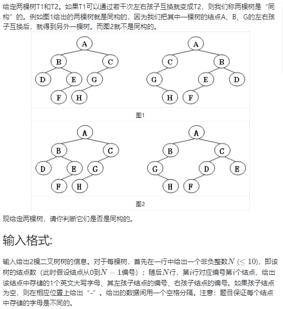
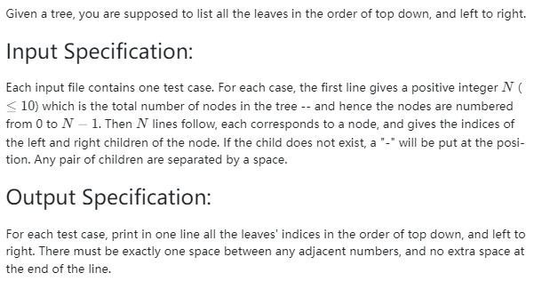

<!-- @import "[TOC]" {cmd="toc" depthFrom=1 depthTo=6 orderedList=false} -->

<!-- code_chunk_output -->

- [选择题](#选择题)
  - [哪个位置的元素在这两种方法的查找中总次数最少](#哪个位置的元素在这两种方法的查找中总次数最少)
  - [一棵度为 m 的树](#一棵度为-m-的树)
  - [已知二叉树的总结点数、结点数，求叶结点数](#已知二叉树的总结点数-结点数求叶结点数)
  - [二叉树的结点数至少](#二叉树的结点数至少)
  - [已知一二叉树的后序和中序遍历](#已知一二叉树的后序和中序遍历)
- [讨论题](#讨论题)
  - [m 叉树中各类结点数之间的关系](#m-叉树中各类结点数之间的关系)
- [编程题](#编程题)
  - [03-树1 树的同构 (25 分)](#03-树1-树的同构-25-分)
  - [03-树2 List Leaves (25 分)](#03-树2-list-leaves-25-分)
  - [03-树3 Tree Traversals Again (25 分)](#03-树3-tree-traversals-again-25-分)

<!-- /code_chunk_output -->


## 选择题

### 哪个位置的元素在这两种方法的查找中总次数最少

参考 [课件3.1.pdf](../resources/3.1 树与树的表示.pdf) 第9页：

```c
int BinarySearch(StaticTable* Tbl, ElementType K)
{
  int left, right, mid, NotFound = -1;

  left = 1;
  right = Tbl->Length;
  while (left <= right)
  {
    mid = (left + right) / 2;
    if (K < Tbl->Element[mid]) right = mid - 1;
    else if (K > Tbl->Element[mid]) left = mid + 1;
    else return mid;
  }
  return NotFound;
}
```

在分量1~11的数组中按从小到大顺序存放11个元素，如果用顺序查找和二分查找分别查找这11个元素，哪个位置的元素在这两种方法的查找中总次数最少？

```
A.1
1
6 3 1

B.2
1 2
6 3 1 2

C.3
1 2 3
6 3

D.6
1 2 3 4 5 6
6
```

### 一棵度为 m 的树

一棵度为 m 的树有 n 个节点。若每个节点直接用 m 个链指向相应的儿子，则表示这个树所需要的总空间是n*(m+1) (假定每个链以及表示节点的数据域都是一个单位空间).。当采用儿子/兄弟（First Child/Next Sibling）表示法时，所需的总空间是：**$3n$**

度为 m 即树中节点度最大为 m ，儿子/兄弟表示法，则每棵树节点需要 3 个空间：数据域、儿子、兄弟。

### 已知二叉树的总结点数、结点数，求叶结点数

若有一二叉树的总结点数为98，只有一个儿子的结点数为48，则该树的叶结点数是多少？

根据[讨论题第一题](#m-叉树中各类结点数之间的关系)，有 $n_0 = n_2 + 1$ ，此时 $n_1 = 48$ ，则 $n_0 + n_2 = 50 = 2n_2 + 1$

而 $2n_2 = 49$ 无解，因此这样的树不存在。

### 二叉树的结点数至少

设深度为d（只有一个根结点时，d为1）的二叉树只有度为0和2的结点，则此类二叉树的结点数至少为2d-1。

**对。** 每层都是 1 个 2 度节点和 多个 0 度节点。

### 已知一二叉树的后序和中序遍历

后序遍历从后向前看，知道了根节点，再通过中序遍历直到左子树和右子树，一点一点画树就行。

## 讨论题

### m 叉树中各类结点数之间的关系

在二叉树中，我们知道叶结点总数 $n_0$ 与有两个儿子的结点总数 $n_2$ 之间的关系是： $n_0 = n_2 + 1$ .

那么类似关系是否可以推广到 $m$ 叉树中？也就是，如果在 $m$ 叉树中，叶结点总数是 $n_0$ ，有一个儿子的结点总数是 $n_1$ ，有 2 个儿子的结点总数是 $n_2$ ，有3个儿子的结点总数是 $n_3$ ，...。那么， $n_i$ 之间存在什么关系？

**用节点总数建立等式：**
- 节点总数表示方法一：$\sum_{i=0}^m n_i$
- 节点总数表示方法二：$1 + \sum_{i=0}^m n_i \times i$（根节点 + 各个节点子节点数量求和，每个子节点的父节点都是唯一的）

所以二者相等，化简一下有：

$$n_0 = 1 + \sum_{i=2}^m n_i\times (i-1)$$

## 编程题

### 03-树1 树的同构 (25 分)



```
// ex1 input
8
A 1 2
B 3 4
C 5 -
D - -
E 6 -
G 7 -
F - -
H - -
8
G - 4
B 7 6
F - -
A 5 1
H - -
C 0 -
D - -
E 2 -

// ex1 output
Yes

// ex2 input
8
B 5 7
F - -
A 0 3
C 6 -
H - -
D - -
G 4 -
E 1 -
8
D 6 -
B 5 -
E - -
H - -
C 0 2
G - 3
F - -
A 1 4

// ex2 output
No
```

我是用父节点做的，被 WA 了。这么做有点取巧，代价就是容易 WA ，一定要多加点条件讨论。

[课件4_树的同构](../../../DataStructure_数据结构/course_3/4_树的同构.md)里使用递归+大量讨论做的，也没巧妙到哪去。

```cpp
// 存储字母的父节点
// 父节点都相同，则同构
#include <iostream>
#include <cstring>
using namespace std;

const int N = 11;
int l[N], r[N], fa[N], e[N];

int main()
{
    int n;
    cin >> n;
    int n1 = n;
    memset(l, -1, sizeof l);
    memset(r, -1, sizeof r);
    for (int i = 0; i < n; ++ i)
    {
        char a, b, c;
        cin >> a >> b >> c;
        e[i] = a - 'A';
        if (b != '-') l[i] = b - '0';
        if (c != '-') r[i] = c - '0';
    }
    
    for (int i = 0; i < n; ++ i)
    {
        if (l[i] != -1) fa[e[l[i]]] = e[i];
        if (r[i] != -1) fa[e[r[i]]] = e[i];
    }

    // 第二棵树
    cin >> n;
    
    // 应对节点数不同
    if (n1 != n)
    {
        puts("No");
        return 0;
    }
    
    // 应对只有一个节点
    if (n == 1)
    {
        char a, b, c;
        cin >> a >> b >> c;
        if (a - 'A' != e[0])
        {
            puts("No");
            return 0;
        }
    }
    
    memset(l, -1, sizeof l);
    memset(r, -1, sizeof r);
    for (int i = 0; i < n; ++ i)
    {
        char a, b, c;
        cin >> a >> b >> c;
        e[i] = a - 'A';
        if (b != '-') l[i] = b - '0';
        if (c != '-') r[i] = c - '0';
    }
    
    bool flag = true;
    for (int i = 0; i < n; ++ i)
    {
        if (l[i] != -1 && fa[e[l[i]]] != e[i] ||
            r[i] != -1 && fa[e[r[i]]] != e[i])
        {
            flag = false;
            break;
        }
    }
    
    if (flag) puts("Yes");
    else puts("No");
}
```

### 03-树2 List Leaves (25 分)



```
// ex input
8
1 -
- -
0 -
2 7
- -
- -
5 -
4 6

// ex output
4 1 5
```

```cpp
// 层序遍历，是叶结点的打印
#include <iostream>
#include <cstring>

using namespace std;

const int N = 15;
int l[N], r[N], q[N];
bool has_father[N];
int hh = 0, tt = -1;

void bfs(int u)
{
    bool first = true;
    q[++ tt] = u;
    while (hh <= tt)
    {
        int t = q[hh ++];
        int lt = l[t], rt = r[t];
        if (lt == -1 && rt == -1)
        {
            if (!first) cout << " ";
            else first = false;
            cout << t;
        }
        if (lt != -1) q[++ tt] = lt;
        if (rt != -1) q[++ tt] = rt;
    }
}

int main()
{
    int n;
    cin >> n;
    memset(l, -1, sizeof l);
    memset(r, -1, sizeof r);
    for (int i = 0; i < n; ++ i)
    {
        char b, c;
        cin >> b >> c;
        if (b != '-') l[i] = b - '0', has_father[l[i]] = true;
        if (c != '-') r[i] = c - '0', has_father[r[i]] = true;
    }

    int root = 0;
    while (has_father[root]) root ++ ;

    bfs(root);
}
```

### 03-树3 Tree Traversals Again (25 分)

PAT 里做过：https://github.com/PiperLiu/ACMOI_Journey/blob/master/notes/acwings/PAT%E7%94%B2%E7%BA%A7%E8%BE%85%E5%AF%BC%E8%AF%BE/drafts/pat.5.1#再次树遍历-1086-tree-traversals-again-25-points

```cpp
// push(x) 时就能知道 x 父节点
// push(x) 前 push(f) ，则 l[f] = x
// push(x) 前 pop() f ，则 r[f] = x
#include <iostream>
#include <cstring>
#include <stack>

using namespace std;

const int N = 35;
int root = 1;
int l[N], r[N], has_father[N];

void dfs(int u)
{
    if (!u) return ;
    
    dfs(l[u]);
    dfs(r[u]);

    cout << u;
    if (u != root) cout << " ";
}

int main()
{
    stack<int> stk;
    int n;
    cin >> n;
    string op;
    int x, last = 0, last_move = 0;  // 0 for 'Push', 1 for 'Pop'
    for (int i = 0; i < n * 2; ++ i)
    {
        cin >> op;
        if (op == "Push")
        {
            cin >> x;
            if (!last) root = x;
            else
            {
                if (last_move == 0) l[last] = x;
                else r[last] = x;
            }
            last = x;
            last_move = 0;
            stk.push(x);
        }
        else
        {
            last = stk.top();
            stk.pop();
            last_move = 1;
        }
    }
    dfs(root);
}
```
