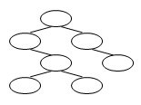
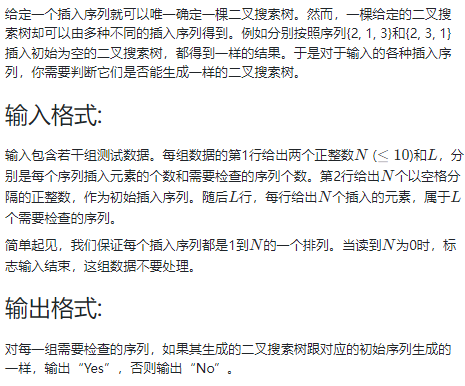

<!-- @import "[TOC]" {cmd="toc" depthFrom=1 depthTo=6 orderedList=false} -->

<!-- code_chunk_output -->

- [选择题](#选择题)
  - [已知二叉搜索树（查找树）结构，问：根结点是什么](#已知二叉搜索树查找树结构问根结点是什么)
  - [若一搜索树（查找树）是一个有n个结点的完全二叉树，则该树的最大值一定在叶结点上](#若一搜索树查找树是一个有n个结点的完全二叉树则该树的最大值一定在叶结点上)
  - [若一搜索树（查找树）是一个有n个结点的完全二叉树，则该树的最小值一定在叶结点上](#若一搜索树查找树是一个有n个结点的完全二叉树则该树的最小值一定在叶结点上)
  - [若一AVL树的结点数是21，则该树的高度至多是](#若一avl树的结点数是21则该树的高度至多是)
- [编程题](#编程题)
  - [04-树7 二叉搜索树的操作集 (30 分)](#04-树7-二叉搜索树的操作集-30-分)
  - [04-树4 是否同一棵二叉搜索树 (25 分)](#04-树4-是否同一棵二叉搜索树-25-分)
  - [04-树5 Root of AVL Tree (25 分)](#04-树5-root-of-avl-tree-25-分)
  - [04-树6 Complete Binary Search Tree (30 分)](#04-树6-complete-binary-search-tree-30-分)

<!-- /code_chunk_output -->


## 选择题

### 已知二叉搜索树（查找树）结构，问：根结点是什么

已知一棵由1、2、3、4、5、6、7共7个结点组成的二叉搜索树（查找树），其结构如图所示，问：根结点是什么？ 



答：中序遍历，然后按照升序填数就行。

答案是 5 。

### 若一搜索树（查找树）是一个有n个结点的完全二叉树，则该树的最大值一定在叶结点上

错，考虑只有两个节点的情况，最大值在根节点。

### 若一搜索树（查找树）是一个有n个结点的完全二叉树，则该树的最小值一定在叶结点上

注意是完全二叉树。

对。

### 若一AVL树的结点数是21，则该树的高度至多是


 若一AVL树的结点数是21，则该树的高度至多是多少？注：只有一个根节点的树高度为0。

 答：AVL树随着层数增加，节点数最少为1，2，4，7，12，20，33；对应层数为0，1，2，3，4，5，6。

 所以答案是 5 。

## 编程题

### 04-树7 二叉搜索树的操作集 (30 分)

```c
#include <stdio.h>
#include <stdlib.h>

typedef int ElementType;
typedef struct TNode *Position;
typedef Position BinTree;
struct TNode{
    ElementType Data;
    BinTree Left;
    BinTree Right;
};

void PreorderTraversal( BinTree BT ); /* 先序遍历，由裁判实现，细节不表 */
void InorderTraversal( BinTree BT );  /* 中序遍历，由裁判实现，细节不表 */

BinTree Insert( BinTree BST, ElementType X );
BinTree Delete( BinTree BST, ElementType X );
Position Find( BinTree BST, ElementType X );
Position FindMin( BinTree BST );
Position FindMax( BinTree BST );

int main()
{
    BinTree BST, MinP, MaxP, Tmp;
    ElementType X;
    int N, i;

    BST = NULL;
    scanf("%d", &N);
    for ( i=0; i<N; i++ ) {
        scanf("%d", &X);
        BST = Insert(BST, X);
    }
    printf("Preorder:"); PreorderTraversal(BST); printf("\n");
    MinP = FindMin(BST);
    MaxP = FindMax(BST);
    scanf("%d", &N);
    for( i=0; i<N; i++ ) {
        scanf("%d", &X);
        Tmp = Find(BST, X);
        if (Tmp == NULL) printf("%d is not found\n", X);
        else {
            printf("%d is found\n", Tmp->Data);
            if (Tmp==MinP) printf("%d is the smallest key\n", Tmp->Data);
            if (Tmp==MaxP) printf("%d is the largest key\n", Tmp->Data);
        }
    }
    scanf("%d", &N);
    for( i=0; i<N; i++ ) {
        scanf("%d", &X);
        BST = Delete(BST, X);
    }
    printf("Inorder:"); InorderTraversal(BST); printf("\n");

    return 0;
}
/* 你的代码将被嵌在这里 */
```

- 函数`Insert`将`X`插入二叉搜索树`BST`并返回结果树的根结点指针；
- 函数`Delete`将`X`从二叉搜索树`BST`中删除，并返回结果树的根结点指针；如果`X`不在树中，则打印一行`Not Found`并返回原树的根结点指针；
- 函数`Find`在二叉搜索树`BST`中找到`X`，返回该结点的指针；如果找不到则返回空指针；
- 函数`FindMin`返回二叉搜索树`BST`中最小元结点的指针；
- 函数`FindMax`返回二叉搜索树`BST`中最大元结点的指针。

```c
// 参考课堂代码
BinTree Insert( BinTree BST, ElementType X )
{
    if (!BST)
    {
        BST = (BinTree)malloc(sizeof (struct TNode));
        BST->Data = X;
        BST->Left = BST->Right = NULL;
    }
    else
    {
        if (BST->Data > X) BST->Left = Insert(BST->Left, X);
        else if (BST->Data < X) BST->Right = Insert(BST->Right, X);
    }
    return BST;
}

BinTree Delete( BinTree BST, ElementType X )
{
    if (!BST)
        printf("Not Found\n");
    else
    {
        if (X < BST->Data)
            BST->Left = Delete(BST->Left, X);
        else if (X > BST->Data)
            BST->Right = Delete(BST->Right, X);
        else
        {
            if (BST->Left && BST->Right)
            {
                // Position 和 BinTree 一样的，但是 Position 更好理解
                // 右子树里找最小值，替代这个节点
                Position Tmp = FindMin(BST->Right);
                BST->Data = Tmp->Data;
                BST->Right = Delete(BST->Right, BST->Data);
                // 在左子树找最大值也行
            }
            else
            {
                Position Tmp = BST;
                if (!BST->Left)
                    BST = BST->Right;
                else
                    BST = BST->Left;
                free(Tmp);
            }
        }
    }
    return BST;
}

Position Find( BinTree BST, ElementType X )
{
    while (BST)
    {
        if (BST->Data > X)
            BST = BST->Left;
        else if (BST->Data < X)
            BST = BST->Right;
        else
            return BST;
    }
    return NULL;
}

Position FindMin( BinTree BST )
{
    if (!BST) return NULL;  // 这句要有，否则段错误
    while (BST->Left)
        BST = BST->Left;
    return BST;
}
Position FindMax( BinTree BST )
{
    if (!BST) return NULL;
    while (BST->Right)
        BST = BST->Right;
    return BST;
}
```

### 04-树4 是否同一棵二叉搜索树 (25 分)



```
// input
4 2
3 1 4 2
3 4 1 2
3 2 4 1
2 1
2 1
1 2
0

// output
Yes
No
No
```

```cpp
#include <iostream>
#include <cstring>

using namespace std;

const int N = 15;

int n, k;
int a[N];
int l[N], r[N], fa1[N], fa2[N], root;  // l[i] i即是地址，也是数值

int insert(int ele, int u, int* fa)
{
    if (u == -1) return ele;
    if (ele < u)
    {
        l[u] = insert(ele, l[u], fa);
        if (l[u] != -1) fa[l[u]] = u;
    }
    else if (ele > u)
    {
        r[u] = insert(ele, r[u], fa);
        if (r[u] != -1) fa[r[u]] = u;
    }
    return u;
}

void check()
{
    memset(l, -1, sizeof l);
    memset(r, -1, sizeof r);
    memset(fa2, -1, sizeof fa2);
    for (int i = 1; i <= n; ++ i) cin >> a[i];
    for (int i = 1; i <= n; ++ i)
    {
        if (!i && root != a[i])
        {
            puts("No");
            return ;
        }
        else
        {
            insert(a[i], root, fa2);
            if (fa1[a[i]] != fa2[a[i]])
            {
                puts("No");
                return ;
            }
        }
    }
    puts("Yes");
    return ;
}

int main()
{
    while (cin >> n, n)
    {
        cin >> k;
        memset(l, -1, sizeof l);
        memset(r, -1, sizeof r);
        memset(fa1, -1, sizeof fa1);
        for (int i = 1; i <= n; ++ i)
        {
            cin >> a[i];
            if (!i) root = a[i];
            else insert(a[i], root, fa1);
        }
        
        for (int i = 0; i < k; ++ i)
        {
            check();
        }
    }
}
```

### 04-树5 Root of AVL Tree (25 分)

PAT 里做过：https://github.com/PiperLiu/ACMOI_Journey/blob/master/notes/acwings/PAT%E7%94%B2%E7%BA%A7%E8%BE%85%E5%AF%BC%E8%AF%BE/drafts/pat.5.2.md#avl树的根-1066-root-of-avl-tree-25-points

```cpp
#include <iostream>

using namespace std;

const int N = 25;

int l[N], r[N], v[N], h[N], idx;  // 0 是未分配

void update(int u)
{
    h[u] = max(h[l[u]], h[r[u]]) + 1;
}

int get_balance(int u)
{
    return h[l[u]] - h[r[u]];
}

void L(int& u)
{
    int p = r[u];
    r[u] = l[p], l[p] = u;
    update(u), update(p);
    u = p;
}

void R(int& u)
{
    int p = l[u];
    l[u] = r[p], r[p] = u;
    update(u), update(p);
    u = p;
}

void insert(int& u, int w)
{
    if (!u) u = ++ idx, v[u] = w;
    else if (w < v[u])
    {
        insert(l[u], w);
        if (get_balance(u) == 2)
        {
            if (get_balance(l[u]) == 1) R(u);
            else L(l[u]), R(u);
        }
    }
    else
    {
        insert(r[u], w);
        if (get_balance(u) == -2)
        {
            if (get_balance(r[u]) == -1) L(u);
            else R(r[u]), L(u);
        }
    }
    
    update(u);
}

int main()
{
    int n, root = 0;
    cin >> n;
    for (int i = 0; i < n; ++ i)
    {
        int w;
        cin >> w;
        insert(root, w);
    }
    
    cout << v[root] << endl;
}
```

### 04-树6 Complete Binary Search Tree (30 分)

PAT 里做过：https://github.com/PiperLiu/ACMOI_Journey/blob/master/notes/acwings/PAT%E7%94%B2%E7%BA%A7%E8%BE%85%E5%AF%BC%E8%AF%BE/drafts/pat.5.1.md#完全二叉搜索树-1064-complete-binary-search-tree-30-points

```cpp
// 建一个 n 个节点的完全二叉树
// 然后 sort 按照中序遍历往里填数
#include <iostream>
#include <algorithm>

using namespace std;

const int N = 1010;

int n;
int tr[N], w[N];

void dfs(int u, int& k)
{
    if (u * 2 <= n) dfs(u * 2, k);
    tr[u] = w[k ++];
    if (u * 2 + 1 <= n) dfs(u * 2 + 1, k);
}

int main()
{
    cin >> n;
    for (int i = 0; i < n; ++ i) cin >> w[i];
    
    sort(w, w + n);
    
    int k = 0;
    dfs(1, k);
    
    // 层序遍历
    cout << tr[1];
    for (int i = 2; i <= n; ++ i) cout << " " << tr[i];
}
```
