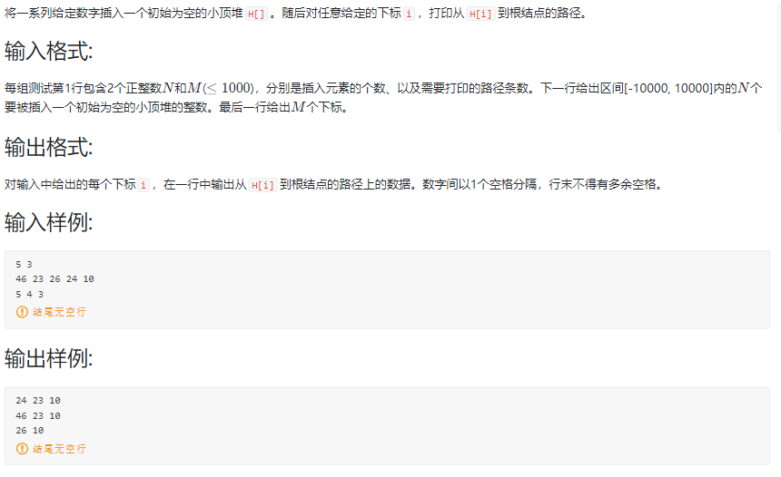
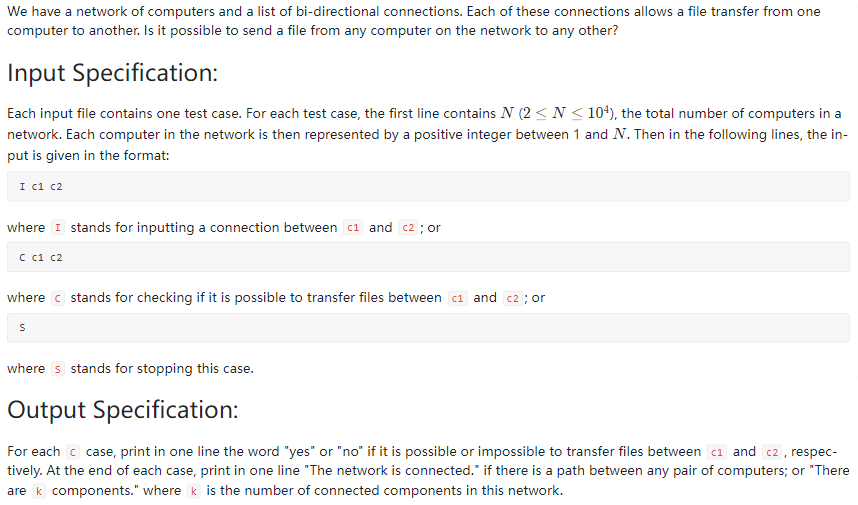

<!-- @import "[TOC]" {cmd="toc" depthFrom=1 depthTo=6 orderedList=false} -->

<!-- code_chunk_output -->

- [选择题](#选择题)
  - [元素个数为12的堆，其各结点的高度之和](#元素个数为12的堆其各结点的高度之和)
  - [下列序列中哪个是最小堆？](#下列序列中哪个是最小堆)
  - [在最大堆{...}中插入83后](#在最大堆中插入83后)
  - [二叉搜索树（查找树）和最小堆](#二叉搜索树查找树和最小堆)
  - [如果哈夫曼树有67个结点，则可知叶结点总数](#如果哈夫曼树有67个结点则可知叶结点总数)
  - [下列方案中哪个不可能是哈夫曼编码](#下列方案中哪个不可能是哈夫曼编码)
  - [一段文本出现次数相应为...，则经过哈夫曼编码后所占总位数](#一段文本出现次数相应为则经过哈夫曼编码后所占总位数)
  - [已知a、b两个元素均是所在集合的根结点...](#已知a-b两个元素均是所在集合的根结点)
- [讨论题](#讨论题)
  - [判别是否是前缀码的算法](#判别是否是前缀码的算法)
- [编程题](#编程题)
  - [05-树7 堆中的路径 (25 分)](#05-树7-堆中的路径-25-分)
  - [05-树8 File Transfer (25 分)](#05-树8-file-transfer-25-分)
  - [05-树9 Huffman Codes (30 分)](#05-树9-huffman-codes-30-分)

<!-- /code_chunk_output -->


## 选择题

### 元素个数为12的堆，其各结点的高度之和

建堆时，最坏情况下需要挪动元素次数是等于树中各结点的高度和。问：对于元素个数为12的堆，其各结点的高度之和是多少？

答：一共有 4 层。

1 + 2 + 3 + 4 = 10

### 下列序列中哪个是最小堆？

- A. 2, 55, 52, 72, 28, 98, 71
- B. 2, 28, 71, 72, 55, 98, 52 
- C. 2, 28, 52, 72, 55, 98, 71 (√)
- D. 28, 2, 71, 72, 55, 98, 52

自己按照 `1 - (2, 3)`, `2 - (4, 5)` 的树结构捋。

### 在最大堆{...}中插入83后

在最大堆 {97,76,65,50,49,13,27}中插入83后，该最大堆为：

- A. {97,76,65,83,49,13,27,50}
- B. {97,83,65,76,49,13,27,50} (√)
- C. {97,83,65,76,50,13,27,49}
- D. {97,83,65,76,49,50,13,27}

把 83 放到队尾，位置是 8 ，然后自己往前捋：`4 2 1 ...`

### 二叉搜索树（查找树）和最小堆

对由同样的n个整数构成的二叉搜索树（查找树）和最小堆，下面哪个说法是不正确的:

- A. 二叉搜索树（查找树）高度大于等于最小堆高度`（二叉搜树不一定是完全二叉树，对）`
- B. 对该二叉搜索树（查找树）进行中序遍历可得到从小到大的序列
- C. 从最小堆根节点到其任何叶结点的路径上的结点值构成从小到大的序列
- D. 对该最小堆进行按层序（level order）遍历可得到从小到大的序列`（1,2,3和1,3,2都是最小堆）`

### 如果哈夫曼树有67个结点，则可知叶结点总数

如果哈夫曼树有67个结点，则可知叶结点总数为：34

> 2n-1=67

### 下列方案中哪个不可能是哈夫曼编码

- A. 00，100，101，110，111（存在度为1的结点）
- B. 000，001，01，10，11
- C. 0000，0001，001，01，1
- D. 000，001，010，011，1

### 一段文本出现次数相应为...，则经过哈夫曼编码后所占总位数

一段文本中包含对象{a,b,c,d,e}，其出现次数相应为{3,2,4,2,1}，则经过哈夫曼编码后，该文本所占总位数为：`27`。

先画哈夫曼树，然后得到每个的编码，然后编码长度乘出现次数求和。

### 已知a、b两个元素均是所在集合的根结点...

已知a、b两个元素均是所在集合的根结点，且分别位于数组分量3和2位置上，其parent值分别为-3,-2。问：将这两个集合按集合大小合并后，a和b的parent值分别是多少？

> -5 3

`-3` 表示是根节点，且本集合有 `3` 个元素。

## 讨论题

### 判别是否是前缀码的算法

我认为，应该是把树画出来，看有没有对象不在叶节点上。

## 编程题

### 05-树7 堆中的路径 (25 分)



很简单的建堆。

```cpp
#include <iostream>
#include <algorithm>

using namespace std;

const int N = 1010;
int h[N], idx;

void up(int u)
{
    while (u / 2 && h[u / 2] > h[u])
    {
        swap(h[u], h[u / 2]);
        u = u / 2;
    }
}

int main()
{
    int n, m;
    cin >> n >> m;
    for (int i = 0; i < n; ++ i)
    {
        int a;
        cin >> a;
        h[++idx] = a;
        up(idx);
    }
    
    for (int i = 0; i < m; ++ i)
    {
        int a;
        cin >> a;
        cout << h[a];
        while (a / 2)
        {
            cout << " " << h[a / 2];
            a = a / 2;
        }
        cout << endl;
    }
}
```

### 05-树8 File Transfer (25 分)



```
input 1
5
C 3 2
I 3 2
C 1 5
I 4 5
I 2 4
C 3 5
S

output 1
no
no
yes
There are 2 components.

input 2
5
C 3 2
I 3 2
C 1 5
I 4 5
I 2 4
C 3 5
I 1 3
C 1 5
S

output 2
no
no
yes
yes
The network is connected.
```

```cpp
#include <iostream>
using namespace std;

const int N = 10010;

int p[N], st[N];

int find(int x)
{
    if (p[x] != x) p[x] = find(p[x]);
    return p[x];
}

int main()
{
    for (int i = 0; i < N; ++ i) p[i] = i;
    
    int n;
    scanf("%d", &n);
    
    char op;
    scanf("%c", &op);
    while (true)
    {
        if (op == 'S') break;
        int a, b;
        scanf("%d %d", &a, &b);
        if (op == 'I')
            p[a] = find(b);
        else if (op == 'C')
        {
            int pa = find(a);
            int pb = find(b);
            if (pa == pb) printf("yes\n");
            else printf("no\n");
        }
        scanf("%c", &op);
    }
    
    int k = 0;
    for (int i = 1; i <= n; ++ i)
    {
        int px = find(i);
        if (!st[px])
        {
            k ++ ;
            st[px] = true;
        }
    }
    
    if (k == 1) printf("The network is connected.");
    else printf("There are %d components.", k);
}
```

很迷，我压缩路径了啊...哪里错了...

### 05-树9 Huffman Codes (30 分)

```cpp
// 建树，建完了检查：
// - WPL 最小
// - 有没有度为1的节点
// - 有没有是编码终点但是不是叶节点的
#include <iostream>
#incldue <cstring>
#include <queue>
using namespace std;

const int N = 130;  // n 个字符，合并 n - 1 次，新增 n - 1 个节点

int n, l[N], r[N], idx;

int char2int(char c)
{
    if (c >= '0' && c <= '9') return c - 0;
    if (c >= 'a' && c <= 'z') return c - 'a' + 10;
    if (c >= 'A' && c <= 'Z') return c - 'A' + 'z' - 'a' + 1;
    return '9' - '0' + 1 + 'z' - 'a' + 1 + 'Z' - 'A' + 1;
}


int main()
{
    cin >> n;
    
    // 先自己建个哈夫曼树求最优 WPL
    priority_queue<int> q;
    for (int i = 0; i < n; ++ i)
    {
        char c;
        int a, b;
        cin >> c >> b;
        a = char2int(c);
        q.push(-b);
    }
    // 建一下树
    int best_wpl = 0;
    while (q.size())
    {
        auto t = q.top();
        q.pop();
        if (q.size())
        {
            auto t1 = q.top();
            q.pop();
            int new_node = - t - t1;
            best_wpl += new_node;
            q.push(- new_node);
        }
    }
}

... 没写完
```