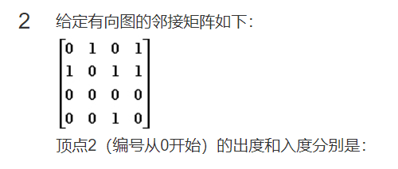
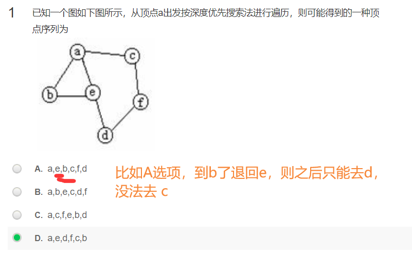
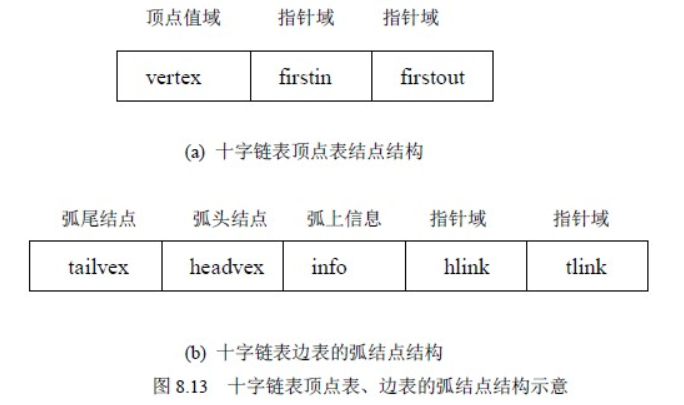
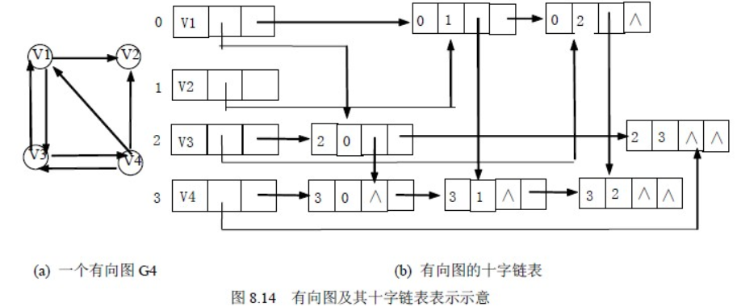
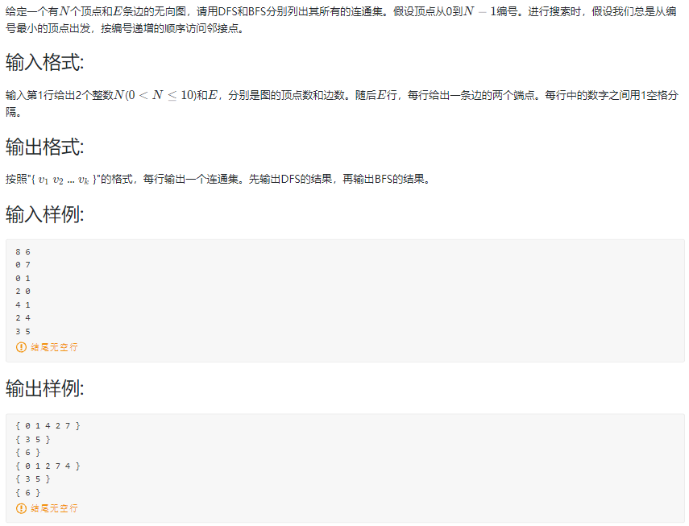
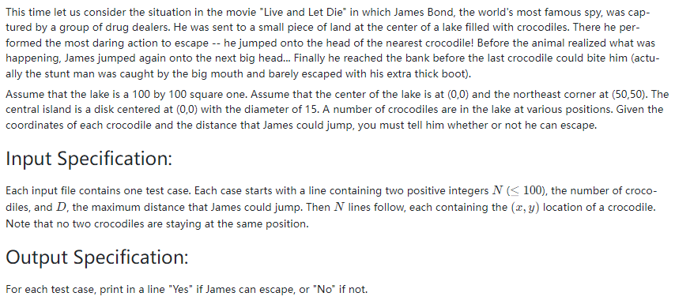
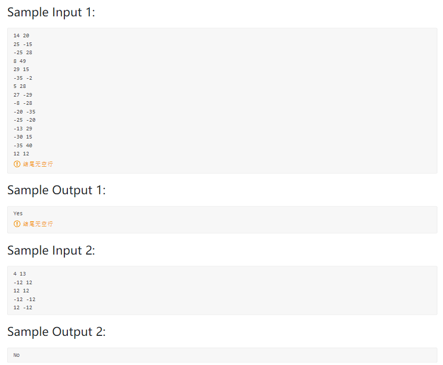
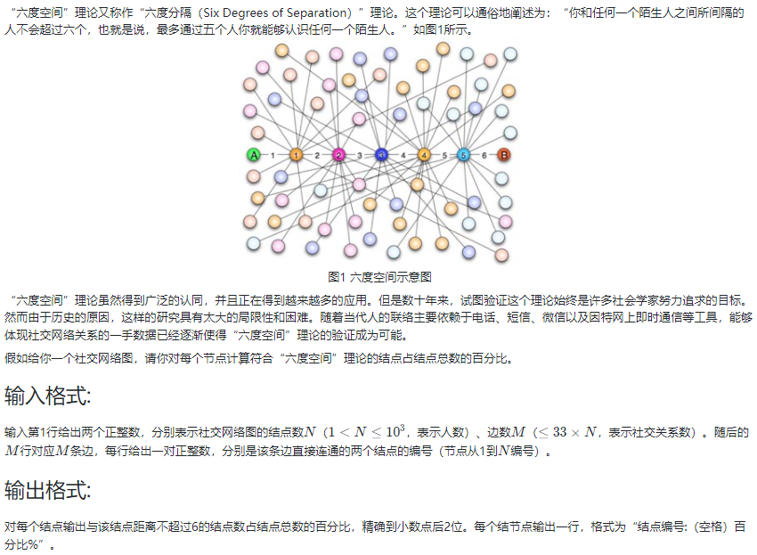
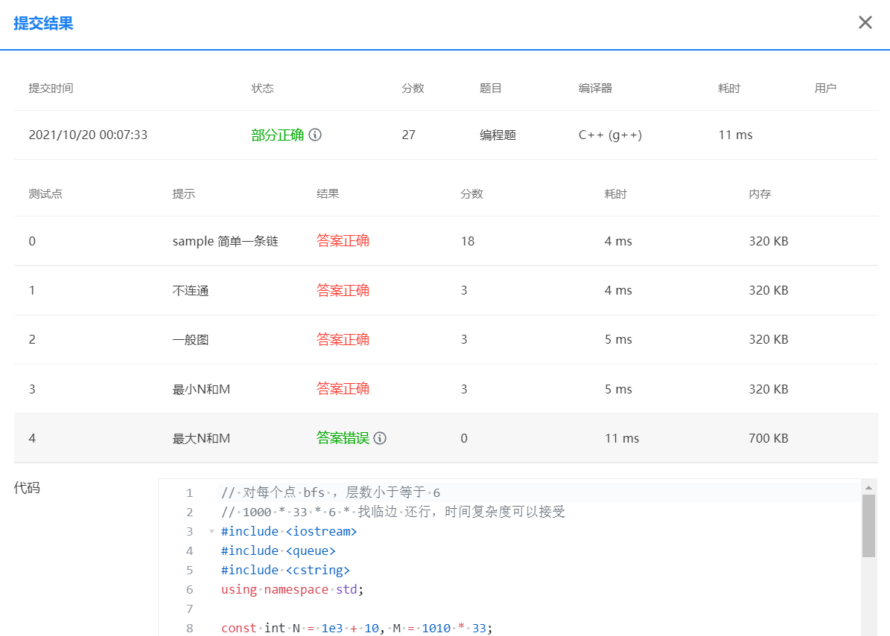

<!-- @import "[TOC]" {cmd="toc" depthFrom=1 depthTo=6 orderedList=false} -->

<!-- code_chunk_output -->

- [选择题](#选择题)
  - [有个顶点的无向完全图有多少条边](#有个顶点的无向完全图有多少条边)
  - [给定有向图的邻接矩阵如下求出度入度](#给定有向图的邻接矩阵如下求出度入度)
  - [有向图的邻接矩阵一定是不对称的（不对）](#有向图的邻接矩阵一定是不对称的不对)
  - [用一维数组G存储有4个顶点的无向图如下](#用一维数组g存储有4个顶点的无向图如下)
  - [用邻接表表示图，则遍历图中所有边的时间复杂度](#用邻接表表示图则遍历图中所有边的时间复杂度)
  - [深度优先搜索序列](#深度优先搜索序列)
  - [具有N个顶点的无向图至多有多少个连通分量](#具有n个顶点的无向图至多有多少个连通分量)
  - [如果从无向图的任一顶点出发进行一次深度优先搜索可访问所有顶点，则该图一定是](#如果从无向图的任一顶点出发进行一次深度优先搜索可访问所有顶点则该图一定是)
  - [具有N个顶点的无向图至少有多少个连通分量](#具有n个顶点的无向图至少有多少个连通分量)
- [讨论题](#讨论题)
  - [关于用链表得到有向图的出、入度--其他办法](#关于用链表得到有向图的出-入度-其他办法)
- [编程题](#编程题)
  - [06-图1 列出连通集 (25 分)](#06-图1-列出连通集-25-分)
  - [06-图2 Saving James Bond - Easy Version (25 分)](#06-图2-saving-james-bond-easy-version-25-分)
  - [06-图3 六度空间 (30 分)](#06-图3-六度空间-30-分)

<!-- /code_chunk_output -->


## 选择题

### 有个顶点的无向完全图有多少条边

有个顶点的无向完全图有多少条边？

$$N(N-1)/2$$

想象邻接矩阵的下三角元素个数（不算对角线）：
$1 + 2 + ... + (N-1)$

### 给定有向图的邻接矩阵如下求出度入度



> 0, 2

### 有向图的邻接矩阵一定是不对称的（不对）

有向图的邻接矩阵一定是不对称的，肯定不对。

### 用一维数组G存储有4个顶点的无向图如下

用一维数组`G[ ]`存储有`4`个顶点的无向图如下：

`G[ ] = { 0, 1, 0, 1, 1, 0, 0, 0, 1, 0 }`

则顶点2和顶点0之间是有边的。

> 对，参考<a href="../resources/6.1 什么是图.pdf">resources/6.1 什么是图.pdf</a>第11页。

```
0
1 0
1 1 0
0 0 1 0
```

### 用邻接表表示图，则遍历图中所有边的时间复杂度

用邻接表表示有个 N 顶点、 E 条边的图，则遍历图中所有边的时间复杂度为：

> O(N + E)

想象最坏情况：所有边都存在于一个点上，则我们需要遍历所有点，这为 $N$ ，然后其中一个点对应的链表长度为 $E$ 。

### 深度优先搜索序列



### 具有N个顶点的无向图至多有多少个连通分量

具有N(N>0)个顶点的无向图至多有多少个连通分量？

> N

### 如果从无向图的任一顶点出发进行一次深度优先搜索可访问所有顶点，则该图一定是

如果从无向图的任一顶点出发进行一次深度优先搜索可访问所有顶点，则该图一定是

> 连通图

### 具有N个顶点的无向图至少有多少个连通分量

具有N(N>0)个顶点的无向图至少有多少个连通分量

> 1

## 讨论题

### 关于用链表得到有向图的出、入度--其他办法

出度好求，入度建一个逆邻接表就好。

参考[图的存储表示—十字链表](http://c.biancheng.net/cpp/html/993.html)。



如上，十字链表（Orthogonal List）是有向图的一种存储方法，它实际上是邻接表与逆邻接表的结合，即把每一条边的边结点分别组织到以弧尾顶点为头结点的链表和以弧头顶点为头顶点的链表中：
- 其中尾域(`tailvex`)和头(`headvex`)分别指示弧尾和弧头这两个顶点在图中的位置
- 链域 `hlink` 指向弧头相同的下一条弧，链域 `tlink` 指向弧尾相同的下一条弧
- `info` 域指向该弧的相关信息。弧头相同的弧在同一链表上，弧尾相同的弧也在同一链表上。
- 它们的头结点即为顶点结点，它由三个域组成：其中 `vertex` 域存储和顶点相关的信息，如顶点的名称等； `firstin` 和 `firstout` 为两个链域，分别指向以该顶点为弧头或弧尾的第一个弧结点。

```c
#define MAX_VERTEX_NUM 20

typedef struct _ArcBox {
    int tailvex, headvex; /* 该弧的尾和头顶点的位置 */
    struct _ArcBox *hlink, *tlink; /* 分别为弧头相同和弧尾相财的弧的链域 */
    InfoType info; /* 该弧相关信息的指针 */
}ArcBox;

typedef struct _VexNode {
    VertexType vertex:
    ArcBox *fisrin, *firstout; /* 分别指向该顶点第一条入弧和出弧 */
}VexNode;

typedef struct _OLGraph{
    VexNode xlist[MAX_VERTEX_NUM]; /*表头向量*/
    int vexnum, arcnum; /*有向图的顶点数和弧数*/
}OLGraph;
```



示例如上。

## 编程题

### 06-图1 列出连通集 (25 分)



```cpp
// 进行搜索时，假设我们总是从编号最小的顶点出发
// 因此用邻接表

#include <iostream>
#include <queue>
#include <cstring>
using namespace std;

const int N = 15;
int g[N][N], n, m;
int st[N];

void dfs(int u)
{
    cout << u << " ";
    for (int i = 0; i < n; ++ i)
    {
        if (i == u) continue;
        if (!g[u][i]) continue;
        if (st[i]) continue;
        st[i] = true;
        dfs(i);
    }
}

void bfs(int u)
{
    queue<int> q;
    q.push(u);
    while (q.size())
    {
        auto t = q.front();
        q.pop();
        cout << t << " ";
        for (int i = 0; i < n; ++ i)
        {
            if (i == t) continue;
            if (!g[t][i]) continue;
            if (st[i]) continue;
            st[i] = true;
            q.push(i);
        }
    }
}

int main()
{
    cin >> n >> m;
    for (int i = 0; i < m; ++ i)
    {
        int a, b;
        cin >> a >> b;
        g[a][b] = 1;
        g[b][a] = 1;
    }
    
    for (int i = 0; i < n; ++ i)
        if (!st[i])
        {
            cout << "{ ";
            st[i] = true;
            dfs(i);
            cout << "}\n";
        }

    memset(st, 0, sizeof st);
    for (int i = 0; i < n; ++ i)
        if (!st[i])
        {
            cout << "{ ";
            st[i] = true;
            bfs(i);
            cout << "}\n";
        }
}
```

### 06-图2 Saving James Bond - Easy Version (25 分)





```cpp
#include <iostream>
#include <algorithm>

using namespace std;

const int N = 110;

double pos[N][2], jump;
int n, g[N][N], st[N];

void dfs(int u)
{
    for (int i = 0; i <= n+1; ++ i)
    {
        if (st[i]) continue;
        if (i == u) continue;
        if (!g[u][i]) continue;
        st[i] = true;
        dfs(i);
    }
}

int main()
{
    cin >> n >> jump;
    for (int i = 1; i <= n; ++ i)
    {
        cin >> pos[i][0] >> pos[i][1];
        // 能否从起点抵达
        double d = pos[i][0] * pos[i][0] + pos[i][1] * pos[i][1];
        if ((jump + 7.5) * (jump + 7.5) >= d)
            g[0][i] = g[i][0] = true;
        // 能发到岸边
        d = min(50 - pos[i][0], 50 - pos[i][1]);
        if (jump >= d)  // 好家伙，这里写成 > 不给 AC ，必须 >= 才行
            g[i][n+1] = g[n+1][i] = true;
    }
        
    
    for (int i = 1; i < n; ++ i)
        for (int j = i; j <= n; ++ j)
        {
            double d = (pos[i][0] - pos[j][0]) * (pos[i][0] - pos[j][0]) + (pos[i][1] - pos[j][1]) * (pos[i][1] - pos[j][1]);
            if (jump * jump >= d)
                g[i][j] = g[j][i] = true;
        }
    
    st[0] = 0;
    dfs(0);
    
    if (st[n+1]) cout << "Yes";
    else cout << "No";
}
```

### 06-图3 六度空间 (30 分)



```
// input
10 9
1 2
2 3
3 4
4 5
5 6
6 7
7 8
8 9
9 10

// output
1: 70.00%
2: 80.00%
3: 90.00%
4: 100.00%
5: 100.00%
6: 100.00%
7: 100.00%
8: 90.00%
9: 80.00%
10: 70.00%
```

```cpp
// 对每个点 bfs ，层数小于等于 6
// 1000 * 33 * 6 * 找临边 还行，时间复杂度可以接受
#include <iostream>
#include <queue>
#include <cstring>
using namespace std;

const int N = 1e3 + 10, M = 1010 * 33;
int g[N][N], n, m, st[N];
int h[N], e[M], ne[M], idx;

void add(int u, int v)
{
    e[idx] = v, ne[idx] = h[u], h[u] = idx ++ ;
}

double bfs(int u)
{
    queue<int> q;
    q.push(u);
    st[u] = true;
    int cnt = 0;
    for (int step = 0; step <= 6; ++ step)
    {
        int sz = q.size();
        cnt += sz;
        for (int j = 0; j < sz; ++ j)
        {
            int t = q.front();
            q.pop();
            for (int i = h[t]; ~i; i = ne[i])
            {
                int k = e[i];
                if (!st[k])
                {
                    q.push(k);
                    st[k] = true;
                }
            }
        }
    }
    return (double)cnt / (double)n;
}

int main()
{
    cin >> n >> m;
    memset(h, -1, sizeof h);
    while (m --)
    {
        int a, b;
        cin >> a >> b;
        add(a, b);
        add(b, a);
    }
    
    for (int i = 1; i <= n; ++ i)
    {
        memset(st, 0, sizeof st);
        cout << i << ": ";
        double res = bfs(i);
        printf("%.2lf%\n", res * 100);
    }
}
```



如上，很迷，我这个处理最大 N 和 M 没问题，怎么就会答案错了呢。
