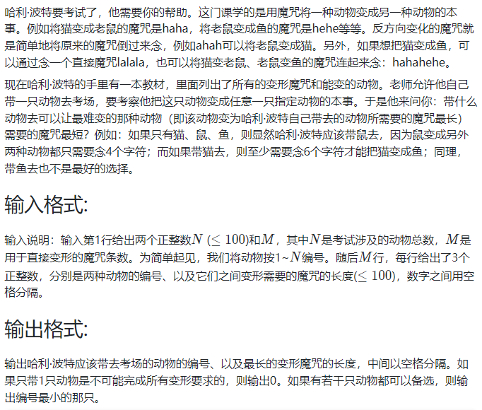

<!-- @import "[TOC]" {cmd="toc" depthFrom=1 depthTo=6 orderedList=false} -->

<!-- code_chunk_output -->

- [讨论题](#讨论题)
  - [无权图的单源最短路输出](#无权图的单源最短路输出)
  - [Floyd算法与负值圈](#floyd算法与负值圈)
- [编程题](#编程题)
  - [07-图4 哈利·波特的考试 (25 分)](#07-图4-哈利波特的考试-25-分)
  - [07-图5 Saving James Bond - Hard Version (30 分)](#07-图5-saving-james-bond-hard-version-30-分)
  - [07-图6 旅游规划 (25 分)](#07-图6-旅游规划-25-分)

<!-- /code_chunk_output -->


## 讨论题

### 无权图的单源最短路输出

利用堆栈，先按照倒叙查找push进去，再按照正序pop出来。

### Floyd算法与负值圈

如果图中有负值圈，Floyd算法还能用吗？如何知道图中是否存在负值圈？

负权可以，负权圈不行。

判断负权圈可以用 SPFA ，参考我的算法笔记：
- https://github.com/piperliu/acmoi_journey/blob/master/notes/acwings/算法基础课/ybase08.md#spfa判断负环模板

- 每次更新，都要做两个操作：`dist[x] = dist[t] + w[i]`，以及 `cnt[x] = cnt[t] + 1`
- 如果某次 `cnt[x] >= n` ，说明从 `1` 到 `x` 至少经过了 `n` 条边，则最短路需要 `n+1` 个以上的点，则肯定存在负环

## 编程题

### 07-图4 哈利·波特的考试 (25 分)



```
// input
6 11
3 4 70
1 2 1
5 4 50
2 6 50
5 6 60
1 3 70
4 6 60
3 6 80
5 1 100
2 4 60
5 2 80

// output
4 70
```

```cpp
#include <iostream>
#include <cstring>
using namespace std;

const int N = 110;
int g[N][N];
int n, m;

int main()
{
    cin >> n >> m;
    memset(g, 0x3f, sizeof g);
    for (int i = 1; i <= n; ++ i) g[i][i] = 0;
    
    while (m --)
    {
        int a, b, c;
        cin >> a >> b >> c;
        g[a][b] = c;
        g[b][a] = c;
    }
    
    for (int k = 1; k <= n; ++ k)  // 注意在最外面
	    for (int i = 1; i <= n; ++ i)
	        for (int j = 1; j <= n; ++ j)
                if (g[i][k] + g[k][j] < g[i][j])
                    g[i][j] = g[i][k] + g[k][j];
    
    int res = 2e9;
    int animal = -1;
    for (int i = 1; i <= n; ++ i)
    {
        int maxv = -1;
        for (int j = 1; j <= n; ++ j)
        {
            if (g[i][j] == 0x3f3f3f3f)
            {
                maxv = -1;
                break;
            }
            if (g[i][j] > maxv) maxv = g[i][j];
        }
        if (maxv != -1 && maxv < res)
        {
            res = maxv;
            animal = i;
        }
    }
    
    if (animal == -1) cout << 0 << endl;
    else cout << animal << " " << res << endl;
}
```

注意：
- Floyd 算法中 `k` 循环一定要在最外层

### 07-图5 Saving James Bond - Hard Version (30 分)

### 07-图6 旅游规划 (25 分)

