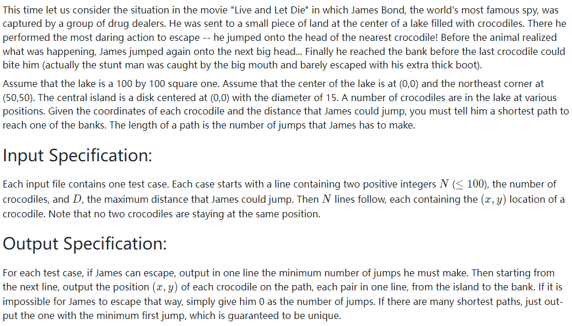
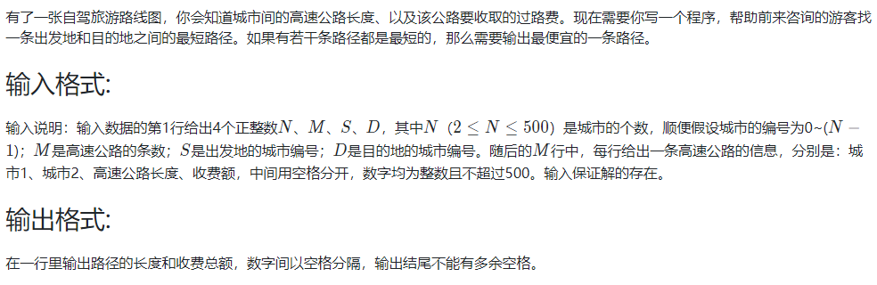

<!-- @import "[TOC]" {cmd="toc" depthFrom=1 depthTo=6 orderedList=false} -->

<!-- code_chunk_output -->

- [讨论题](#讨论题)
  - [无权图的单源最短路输出](#无权图的单源最短路输出)
  - [Floyd算法与负值圈](#floyd算法与负值圈)
- [编程题](#编程题)
  - [07-图4 哈利·波特的考试 (25 分)](#07-图4-哈利波特的考试-25-分)
  - [07-图5 Saving James Bond - Hard Version (30 分)](#07-图5-saving-james-bond-hard-version-30-分)
  - [07-图6 旅游规划 (25 分)](#07-图6-旅游规划-25-分)

<!-- /code_chunk_output -->


## 讨论题

### 无权图的单源最短路输出

利用堆栈，先按照倒叙查找push进去，再按照正序pop出来。

### Floyd算法与负值圈

如果图中有负值圈，Floyd算法还能用吗？如何知道图中是否存在负值圈？

负权可以，负权圈不行。

判断负权圈可以用 SPFA ，参考我的算法笔记：
- https://github.com/piperliu/acmoi_journey/blob/master/notes/acwings/算法基础课/ybase08.md#spfa判断负环模板

- 每次更新，都要做两个操作：`dist[x] = dist[t] + w[i]`，以及 `cnt[x] = cnt[t] + 1`
- 如果某次 `cnt[x] >= n` ，说明从 `1` 到 `x` 至少经过了 `n` 条边，则最短路需要 `n+1` 个以上的点，则肯定存在负环

## 编程题

### 07-图4 哈利·波特的考试 (25 分)


```
// input
6 11
3 4 70
1 2 1
5 4 50
2 6 50
5 6 60
1 3 70
4 6 60
3 6 80
5 1 100
2 4 60
5 2 80

// output
4 70
```

```cpp
#include <iostream>
#include <cstring>
using namespace std;

const int N = 110;
int g[N][N];
int n, m;

int main()
{
    cin >> n >> m;
    memset(g, 0x3f, sizeof g);
    for (int i = 1; i <= n; ++ i) g[i][i] = 0;
    
    while (m --)
    {
        int a, b, c;
        cin >> a >> b >> c;
        g[a][b] = c;
        g[b][a] = c;
    }
    
    for (int k = 1; k <= n; ++ k)  // 注意在最外面
        for (int i = 1; i <= n; ++ i)
            for (int j = 1; j <= n; ++ j)
                if (g[i][k] + g[k][j] < g[i][j])
                    g[i][j] = g[i][k] + g[k][j];
    
    int res = 2e9;
    int animal = -1;
    for (int i = 1; i <= n; ++ i)
    {
        int maxv = -1;
        for (int j = 1; j <= n; ++ j)
        {
            if (g[i][j] == 0x3f3f3f3f)
            {
                maxv = -1;
                break;
            }
            if (g[i][j] > maxv) maxv = g[i][j];
        }
        if (maxv != -1 && maxv < res)
        {
            res = maxv;
            animal = i;
        }
    }
    
    if (animal == -1) cout << 0 << endl;
    else cout << animal << " " << res << endl;
}
```

注意：
- Floyd 算法中 `k` 循环一定要在最外层

### 07-图5 Saving James Bond - Hard Version (30 分)



```
// input
17 15
10 -21
10 21
-40 10
30 -50
20 40
35 10
0 -10
-25 22
40 -40
-30 30
-10 22
0 11
25 21
25 10
10 10
10 35
-30 10

// output
4
0 11
10 21
10 35

// input
4 13
-12 12
12 12
-12 -12
12 -12

// output
0
```

以下两种方法都是错的，但我实在不知错在哪里。

方法一：

```cpp
// 输出第一跳最短这个要求实在太烦了
// 正反做两次 dijkstra 找到第一跳的点

#include <iostream>
#include <algorithm>
#include <cstring>
#include <cmath>

using namespace std;

const int N = 110;

double pos[N][2], jump;
int n, st[N];
double g[N][N];
int cnt1[N], cnt2[N];
int last[N];

void dijkstra1()
{
	memset(st, 0, sizeof st);
	cnt1[0] = 0;

	for (int i = 0; i <= n+1; ++ i)
	{
		int t = -1;
		for (int j = 0; j <= n+1; ++ j)
			if (!st[j] && (t == -1 || cnt1[j] <= cnt1[t]))
				t = j;

		for (int j = 0; j <= n+1; ++ j)
			if (!st[j] && g[t][j] < 1e11 && cnt1[t] + 1 < cnt1[j])
				cnt1[j] = cnt1[t] + 1;

		st[t] = 1;
	}
}

void dijkstra2()
{
	memset(st, 0, sizeof st);
	cnt2[n+1] = 0;

	for (int i = 0; i <= n+1; ++ i)
	{
		int t = -1;
		for (int j = 0; j <= n+1; ++j)
			if (!st[j] && (t == -1 || cnt2[j] < cnt2[t]))
				t = j;

		for (int j = 0; j <= n+1; ++ j)
			if (!st[j] && g[t][j] < 1e11 && cnt2[t] + 1 < cnt2[j])
			{
				cnt2[j] = cnt2[t] + 1;
				last[j] = t;
			}

		st[t] = 1;
	}
}

int main()
{
    cin >> n >> jump;

    memset(g, 0x42, sizeof g);
    
    for (int i = 1; i <= n; ++ i)
    {
        cin >> pos[i][0] >> pos[i][1];
        // 能否从起点抵达
        double d = pos[i][0] * pos[i][0] + pos[i][1] * pos[i][1];
        if ((jump + 7.5) * (jump + 7.5) >= d && d > 7.5 * 7.5)  // 在岛内的不能算
            g[0][i] = g[i][0] = d;
        // 能否到岸边
        d = min((50 - pos[i][0]) * (50 - pos[i][0]), (50 - pos[i][1]) * (50 - pos[i][1]));
        if (jump * jump >= d)
            g[i][n+1] = g[n+1][i] = d;  // 这里 d 不是平方级别
    }

    for (int i = 1; i < n; ++ i)
        for (int j = i + 1; j <= n; ++ j)
        {
            double d = (pos[i][0] - pos[j][0]) * (pos[i][0] - pos[j][0]) + (pos[i][1] - pos[j][1]) * (pos[i][1] - pos[j][1]);
            if (jump * jump >= d)
                g[i][j] = g[j][i] = d;
        }
    
    if (jump >= 50 - 7.5) g[0][n+1] = g[n+1][0] = 50 * 50;  // 可以一步上岸

	memset(cnt1, 0x3f, sizeof cnt1);
	memset(cnt2, 0x3f, sizeof cnt2);

	dijkstra1();
	dijkstra2();
    
    if (cnt1[n+1] == 0x3f3f3f3f) cout << 0 << endl;
    else
    {
    	cout << cnt1[n+1] << endl;
    	// 找第一跳最短的点
    	int t = n+1;
    	double minv = 1e10;
    	for (int i = 1; i <= n; ++ i)
    	{
    		if (cnt1[i] != 1) continue;  // 不是第一跳
    		if (cnt2[i] + 1 != cnt2[0]) continue;  // 没法抵达终点或不是最优路径上的
    		if (g[0][i] < minv)
    		{
    			t = i;
    			minv = g[0][i];
    		}
    	}
    	for ( ; t != n + 1 ; )
    	{
    		cout << pos[t][0] << " " << pos[t][1] << endl;
    		t = last[t];
    	}
    }
}
```

方法二：

```cpp
// 试试把每个点都 dijkstra

#include <iostream>
#include <unordered_map>
#include <algorithm>
#include <cstring>
#include <cmath>

using namespace std;

const int N = 110;

double pos[N][2], jump;
int n, st[N];
double g[N][N];
int cnt[N];
unordered_map<int, int> last;

int dijkstra(int u)
{
    memset(cnt, 0x3f, sizeof cnt);
	memset(st, 0, sizeof st);
    last.clear();
	cnt[u] = 0;

	for (int i = 1; i <= n+1; ++ i)
	{
		int t = -1;
		for (int j = 1; j <= n+1; ++ j)
			if (!st[j] && (t == -1 || cnt[j] <= cnt[t]))
				t = j;

		for (int j = 1; j <= n+1; ++ j)
			if (!st[j] && g[t][j] < 1e11 && cnt[t] + 1 < cnt[j])
            {
                cnt[j] = cnt[t] + 1;
                last[j] = t;
            }


		st[t] = 1;
	}
    
    return cnt[n+1];
}

int main()
{
    cin >> n >> jump;

    memset(g, 0x42, sizeof g);
    
    for (int i = 1; i <= n; ++ i)
    {
        cin >> pos[i][0] >> pos[i][1];
        // 能否从起点抵达
        double d = pos[i][0] * pos[i][0] + pos[i][1] * pos[i][1];
        if ((jump + 7.5) * (jump + 7.5) >= d && d > 7.5 * 7.5)  // 在岛内的不能算
            g[0][i] = g[i][0] = d;
        // 能否到岸边
        d = min((50 - pos[i][0]) * (50 - pos[i][0]), (50 - pos[i][1]) * (50 - pos[i][1]));
        if (jump * jump >= d)
            g[i][n+1] = g[n+1][i] = d;  // 这里 d 不是平方级别
    }

    for (int i = 1; i < n; ++ i)
        for (int j = i + 1; j <= n; ++ j)
        {
            double d = (pos[i][0] - pos[j][0]) * (pos[i][0] - pos[j][0]) + (pos[i][1] - pos[j][1]) * (pos[i][1] - pos[j][1]);
            if (jump * jump >= d)
                g[i][j] = g[j][i] = d;
        }

    if (jump >= 50 - 7.5) // 可以一步上岸
    {
    	cout << 1 << endl;
    	return 0;
    }

    int res = 0x3f3f3f3f;
    double minv = 1e10;
    unordered_map<int, int> path;
    for (int i = 1; i <= n; ++ i)
    {
    	if (g[0][i] > 1e11) continue;
        int tmp = dijkstra(i);
        if (tmp < res || tmp == res && g[0][i] < minv)
        {
            res = tmp;
            minv = g[0][i];
            path = last;
        }
    }

    if (res == 0x3f3f3f3f) cout << 0 << endl;
    else
    {
        cout << res + 1 << endl;
        int l = path[n+1];
        int ps[res];
        for (int i = 0; i < res; ++ i)
        {
            ps[res - i - 1] = l;
            l = path[l];
        }
        for (int i = 0; i < res; ++ i)
            cout << pos[ps[i]][0] << " " << pos[ps[i]][1] << endl;
    }
}
```

|测试点|提示|结果|分数|耗时|内存|
|---|---|---|---|---|---|
|0|sample1 多条最短路，同一点有多路，最近点无路，多连通|答案正确|15|4 ms|696 KB|
|1|sample 2 聚集型，均离岸远|答案正确|3|4 ms|576 KB|
|2|分散型，均跳不到，有在角上|答案正确|2|4 ms|436 KB|
|3|有一只在岸上，有一只在岛上，不能算在内|答案正确|3|4 ms|596 KB|
|4|最大N，sample1的复杂版，可选路径8条，后面要更新前面的最短路|答案错误|0|5 ms|448 KB|
|5|最小N，一步跳到岸|答案正确|1|4 ms|440 KB|

改了一个晚上+一个上午，还是一个测试点过不去，麻了。

参考[石前有座桥](https://blog.csdn.net/lyw_321/article/details/71330811)，思路都是一样的，我还没细看，不清楚我错哪里了。

```cpp
#include <stdio.h>
#include <math.h>
#define inf 9999999
int n, d, flag = 0, exist = 0, newp;
int mark[101];
int path[101];
int distance[101];
struct node
{
    int x;
    int y;
} stu[101];
double dis(int x, int y)
{
    return sqrt(x * x + y * y);
}
int canjump(int x1, int y1, int x2, int y2)
{
    if (sqrt(pow((x1 - x2), 2) + pow(y1 - y2, 2)) <= d)
    {
        return 1;
    }
    else
    {
        return 0;
    }
}
void init()
{
    int i;
    flag = 0;
    for (i = 0; i < n; i++)
    {
        mark[i] = 0;
        path[i] = -1;
        distance[i] = inf;
    }
}
void dijkstra(int s)
{
    mark[s] = 1;
    distance[s] = 1; //从第一跳开始 ！
    path[s] = -2;
    int i;
    newp = s;
    while (1)
    {
        if (50 - abs(stu[newp].x) <= d || 50 - abs(stu[newp].y) <= d)
        {
            distance[newp]++; //还要跳到岸上！
            flag = 1;
            exist = 1;
            break;
        }
        for (i = 0; i < n; i++)
        {
            if (mark[i] == 0 && canjump(stu[newp].x, stu[newp].y, stu[i].x, stu[i].y))
            {
                if (distance[newp] + 1 < distance[i])
                {
                    distance[i] = distance[newp] + 1;
                    path[i] = newp;
                }
            }
        }
        int min = inf;
        for (i = 0; i < n; i++)
        {
            if (mark[i] == 0 && distance[i] < inf)
            {
                if (distance[i] < min)
                {
                    min = distance[i];
                    newp = i;
                }
            }
        }
        mark[newp] = 1;
        if (min == inf)
        {
            break;
        }
    }
}
int main()
{
    int i;
    scanf("%d %d", &n, &d);
    for (i = 0; i < n; i++)
    {
        scanf("%d %d", &stu[i].x, &stu[i].y);
    }
    if (d >= 50 - 7.5)
    {
        printf("1\n");
        return 0; //最小N，一步跳到岸 错了这个点
    }
    int firstjump[n]; //第一跳下标
    int numfirst = 0;
    for (i = 0; i < n; i++)
    {
        if (d + 7.5 >= dis(stu[i].x, stu[i].y))
        {
            firstjump[numfirst++] = i;
        }
    }
    int min = inf, index;
    int store[n], cou = 0;
    for (i = 0; i < numfirst; i++)
    {
        init();
        dijkstra(firstjump[i]);
        if (flag)
        { //找到路径
            if (distance[newp] < min)
            {
                min = distance[newp];
                cou = 0;
                store[cou++] = firstjump[i];
            }
            else if (distance[newp] == min)
            {
                store[cou++] = firstjump[i];
            }
        }
    }
    if (exist == 0)
    {
        printf("0");
        return 0;
    }
    min = inf;
    int indexmin; //如果最短路径相同，则距离源点最近的点唯一（题目保证）
    for (i = 0; i < cou; i++)
    {
        int index = store[i];
        if (min > dis(stu[index].x, stu[index].y) - 7.5)
        {
            min = dis(stu[index].x, stu[index].y) - 7.5;
            indexmin = store[i];
        }
    }
    init(); //别忘了初始化 !!!!
    dijkstra(indexmin);
    printf("%d\n", distance[newp]);
    cou = 0;
    while (1)
    {
        store[cou++] = newp;
        newp = path[newp];
        if (newp == -2)
        {
            break;
        }
    }
    for (i = cou - 1; i >= 0; i--)
    {
        printf("%d %d\n", stu[store[i]].x, stu[store[i]].y);
    }
}
```

### 07-图6 旅游规划 (25 分)



```
// input
4 5 0 3
0 1 1 20
1 3 2 30
0 3 4 10
0 2 2 20
2 3 1 20

// output
3 40
```

```cpp
#include <iostream>
#include <cstring>
using namespace std;

const int N = 510;
int d[N], w[N];
int gd[N][N], gw[N][N];
int st[N];

int main()
{
    int n, m, sta, end;
    cin >> n >> m >> sta >> end;
    
    memset(gd, 0x3f, sizeof gd);
    memset(gw, 0x3f, sizeof gw);
    memset(d, 0x3f, sizeof d);
    memset(w, 0x3f, sizeof w);
    
    while (m --)
    {
        int a, b, c, d;
        cin >> a >> b >> c >> d;
        gd[a][b] = gd[b][a] = c;
        gw[a][b] = gw[b][a] = d;
    }
    
    auto dijkstra = [&](int u, int v) -> void
    {
        d[u] = 0;
        w[u] = 0;
        for (int i = 0; i < n; ++ i)
        {
            int t = -1;
            for (int j = 0; j < n; ++ j)
                if (!st[j] && (t == -1 || d[j] < d[t]))
                    t = j;

            for (int j = 0; j < n; ++ j)
            {
                if (st[j]) continue;
                if (d[t] + gd[t][j] < d[j])
                {
                	d[j] = d[t] + gd[t][j];
                	w[j] = w[t] + gw[t][j];
                }
                else if (d[t] + gd[t][j] == d[j] && w[t] + gw[t][j] < w[j])
                    w[j] = w[t] + gw[t][j];
            }
    
            st[t] = 1;
            if (t == v) break;
        }
    };
    
    dijkstra(sta, end);
    cout << d[end] << " "  << w[end] << endl;
}
```
