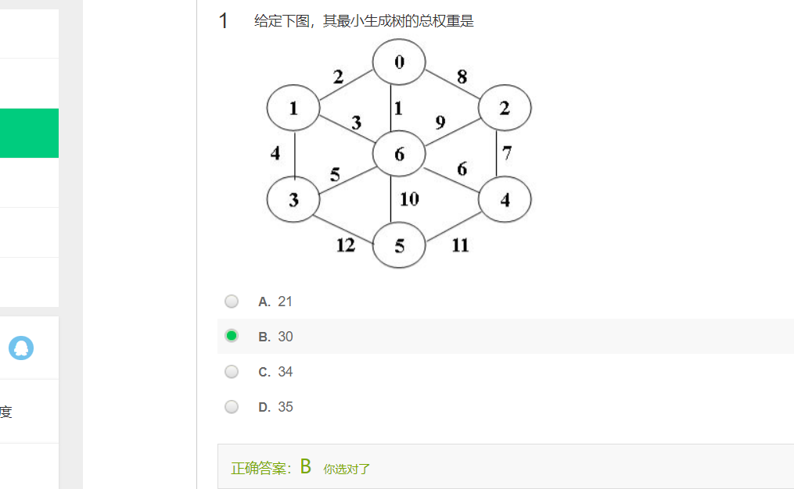
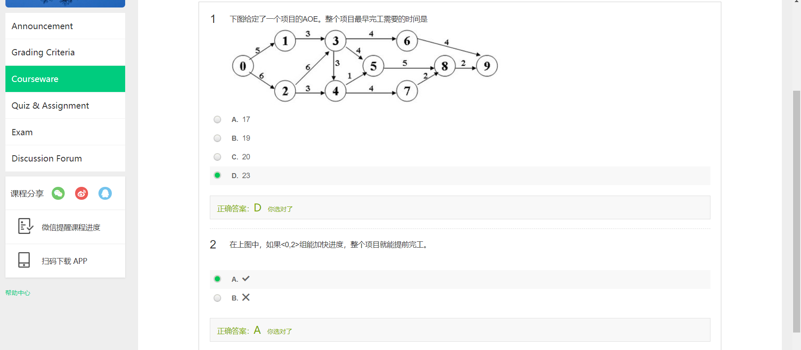
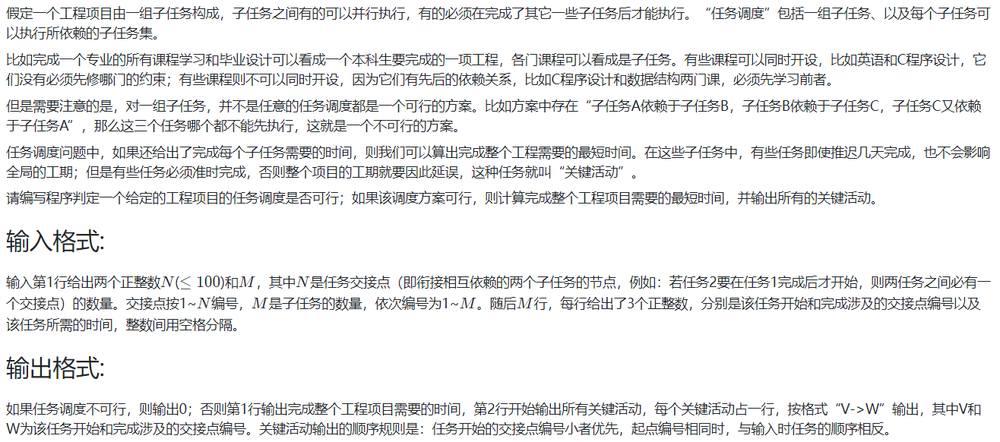

<!-- @import "[TOC]" {cmd="toc" depthFrom=1 depthTo=6 orderedList=false} -->

<!-- code_chunk_output -->

- [选择题](#选择题)
  - [给定下图，其最小生成树的总权重是](#给定下图其最小生成树的总权重是)
  - [连通图的最小生成树一定是唯一的（错）](#连通图的最小生成树一定是唯一的错)
  - [拓扑序一定是唯一的（错）](#拓扑序一定是唯一的错)
  - [工序问题AOE（Activity On Edge）](#工序问题aoeactivity-on-edge)
- [讨论题](#讨论题)
  - [容器的影响](#容器的影响)
- [编程题](#编程题)
  - [08-图7 公路村村通 (30 分)](#08-图7-公路村村通-30-分)
  - [08-图8 How Long Does It Take (25 分)](#08-图8-how-long-does-it-take-25-分)
  - [08-图9 关键活动 (30 分)](#08-图9-关键活动-30-分)

<!-- /code_chunk_output -->


## 选择题

### 给定下图，其最小生成树的总权重是



### 连通图的最小生成树一定是唯一的（错）

肯定不对，边权一样的两条边怎么算。

### 拓扑序一定是唯一的（错）

同一层的可以随便排。

### 工序问题AOE（Activity On Edge）



## 讨论题

### 容器的影响

分别用队列和堆栈作为容器，对计算机专业课程进行拓扑排序，得到的序列有什么区别？用哪种容器排课更合理？

- 队列对应bfs：广度优先，齐头并进
- 堆栈对应递归dfs：向着一个方向深入

## 编程题

### 08-图7 公路村村通 (30 分)

现有村落间道路的统计数据表中，列出了有可能建设成标准公路的若干条道路的成本，求使每个村落都有公路连通所需要的最低成本。

输入格式:
- 输入数据包括城镇数目正整数N（≤1000）和候选道路数目M（≤3N）；随后的M行对应M条道路，每行给出3个正整数，分别是该条道路直接连通的两个城镇的编号以及该道路改建的预算成本。为简单起见，城镇从1到N编号。

输出格式:
- 输出村村通需要的最低成本。如果输入数据不足以保证畅通，则输出−1，表示需要建设更多公路。

输入样例:
```
6 15
1 2 5
1 3 3
1 4 7
1 5 4
1 6 2
2 3 4
2 4 6
2 5 2
2 6 6
3 4 6
3 5 1
3 6 1
4 5 10
4 6 8
5 6 3
```

输出样例:
```
12
```

```cpp
#include <iostream>
#include <algorithm>
using namespace std;

const int N = 1010, M = N * 3;

struct Edge
{
    int a, b, v;
    bool operator< (const Edge& t) const
    {
        return v < t.v;
    }
} edges[M];

int p[N];
int find(int x)
{
    if (p[x] != x) p[x] = find(p[x]);
    return p[x];
}

int main()
{
    int n, m;
    cin >> n >> m;
    
    for (int i = 0; i < m; ++ i)
    {
        int a, b, v;
        cin >> a >> b >> v;
        edges[i] = {a, b, v};
    }
    
    sort(edges, edges + m);
    
    for (int i = 1; i <= n; ++ i) p[i] = i;
    
    int ans = 0, cnt = 1;
    for (auto&& e: edges)
    {
        int pa = find(e.a), pb = find(e.b);
        if (pa != pb)
        {
            p[pa] = pb;
            ans += e.v;
            cnt ++ ;
        }
    }
    
    if (cnt == n) cout << ans << endl;
    else cout << -1 << endl;
}
```

### 08-图8 How Long Does It Take (25 分)

Given the relations of all the activities of a project, you are supposed to find the earliest completion time of the project.

Input Specification:
- Each input file contains one test case. Each case starts with a line containing two positive integers N (≤100), the number of activity check points (hence it is assumed that the check points are numbered from 0 to N−1), and M, the number of activities. Then M lines follow, each gives the description of an activity. For the i-th activity, three non-negative numbers are given: `S[i]`, `E[i]`, and `L[i]`, where `S[i]` is the index of the starting check point, `E[i]` of the ending check point, and `L[i]` the lasting time of the activity. The numbers in a line are separated by a space.

Output Specification:
- For each test case, if the scheduling is possible, print in a line its earliest completion time; or simply output "`Impossible`".

Sample Input 1:
```
9 12
0 1 6
0 2 4
0 3 5
1 4 1
2 4 1
3 5 2
5 4 0
4 6 9
4 7 7
5 7 4
6 8 2
7 8 4
```

Sample Output 1:
```
18
```

Sample Input 2:
```
4 5
0 1 1
0 2 2
2 1 3
1 3 4
3 2 5
```

Sample Output 2:
```
Impossible
```

```
// dp + 拓扑排序
#include <iostream>
#include <cstring>
#include <queue>

using namespace std;

const int N = 110, M = 10100;
int h[N], e[M], ne[M], w[M], idx;
int n, m;
int d[N], f[N];  // 入度, dp值

void add(int a, int b, int c)
{
    e[idx] = b, w[idx] = c, ne[idx] = h[a], h[a] = idx ++ ;
}

int main()
{
    memset(h, -1, sizeof h);
    cin >> n >> m;
    for (int i = 0; i < m; ++ i)
    {
        int a, b, c;
        cin >> a >> b >> c;
        add(a, b, c);
        d[b] ++ ;
    }

    queue<int> q;
    for (int i = 0; i < n; ++ i)
        if (d[i] == 0) q.push(i);
    while (q.size())
    {
        int t = q.front();
        q.pop();
        
        for (int i = h[t]; ~i; i = ne[i])
        {
            int j = e[i];
            f[j] = max(f[j], f[t] + w[i]);
            if (-- d[j] == 0) q.push(j);
        }
    }
    
    for (int i = 0; i < n; ++ i)
        if (d[i] > 0)
        {
            cout << "Impossible" << endl;
            return 0;
        }
    
    int maxv = -1;
    for (int i = 0; i < n; ++ i)
        if (maxv < f[i])
            maxv = f[i];
    
    cout << maxv << endl;
}
```

### 08-图9 关键活动 (30 分)



```
7 8
1 2 4
1 3 3
2 4 5
3 4 3
4 5 1
4 6 6
5 7 5
6 7 2

17
1->2
2->4
4->6
6->7
```

```cpp
// 求 earliest 和 lastest
// 对于工序 i->j
// lastest[j] - earliest[i] == w[i->j]
// 则这个工序是关键工序
// 注意！
/*
如果存在多个连通分量，应该用
    **整个项目** 的完成时间来作为反向遍历起点的同一 lastest 时间
比如下面数据
7 6
1 2 4
1 3 3
2 4 5
3 4 3
5 7 5
6 7 2

如果把 4 和 7 都作为反向遍历起点，则输出
9
1->2
2->4
5->7

而答案是
9
1->2
2->4

这是因为 7 最早完成时间本来就比 4 小，因此
    7 对应的连通图上没有关键工序

还有个做法就是加虚起点和虚终点
*/
#include <iostream>
#include <cstring>
#include <queue>
#include <stack>

using namespace std;

const int N = 110, M = 10100;
int h1[N], e1[M], ne1[M], w1[M], idx1;  // 正向遍历
int h2[N], e2[M], ne2[M], w2[M], idx2;  // 反向遍历
int n, m;
int d1[N], d2[N];  // 入度
int earliest[N], lastest[N];

void add1(int a, int b, int c)
{
    e1[idx1] = b, w1[idx1] = c, ne1[idx1] = h1[a], h1[a] = idx1 ++ ;
}

void add2(int a, int b, int c)
{
    e2[idx2] = b, w2[idx2] = c, ne2[idx2] = h2[a], h2[a] = idx2 ++ ;
}

void clear(queue<int>& q)
{
    queue<int> empty;
    swap(empty, q);
}

int main()
{
    memset(h1, -1, sizeof h1);
    memset(h2, -1, sizeof h2);
    cin >> n >> m;
    for (int i = 0; i < m; ++ i)
    {
        int a, b, c;
        cin >> a >> b >> c;
        add1(a, b, c);
        add2(b, a, c);
        d1[b] ++ ;
        d2[a] ++ ;
    }

    memset(earliest, 0, sizeof earliest);
    memset(lastest, 0x3f, sizeof lastest);
    
    queue<int> q;
    for (int i = 1; i <= n; ++ i)
        if (d1[i] == 0) q.push(i);
    while (q.size())
    {
        int t = q.front();
        q.pop();
        
        for (int i = h1[t]; ~i; i = ne1[i])
        {
            int j = e1[i];
            earliest[j] = max(earliest[j], earliest[t] + w1[i]);
            if (-- d1[j] == 0) q.push(j);
        }
    }

    for (int i = 1; i <= n; ++ i)
        if (d1[i] > 0)
        {
            cout << 0 << endl;
            return 0;
        }
    
    // 反着遍历
    int maxv = -1;
    for (int i = 1; i <= n; ++ i)
        if (maxv < earliest[i])
            maxv = earliest[i];

    cout << maxv << endl;

    clear(q);
    for (int i = 1; i <= n; ++ i)
        if (d2[i] == 0)
        {
            // 注意
            // 这里一定要写成 lastest[i] = maxv;
            // 不要写成 if (earliest[i] == maxv) q.push(i)
            // 因为这样落下了应有的反向遍历起点
            q.push(i);
            lastest[i] = maxv;
        }
    while (q.size())
    {
        int t = q.front();
        q.pop();

        for (int i = h2[t]; ~i; i = ne2[i])
        {
            int j = e2[i];
            lastest[j] = min(lastest[j], lastest[t] - w2[i]);
            if (-- d2[j] == 0) q.push(j);
        }
    }

    for (int t = 1; t <= n; ++ t)
    {
        // if (earliest[t] != lastest[t]) continue;
        for (int i = h1[t]; ~i; i = ne1[i])
        {
            int j = e1[i];
            // if (earliest[j] == lastest[j])
                // cout << t << "->" << j << endl;
            if (lastest[j] - earliest[t] == w1[i])
                cout << t << "->" << j << endl;
        }
    }
}
```
