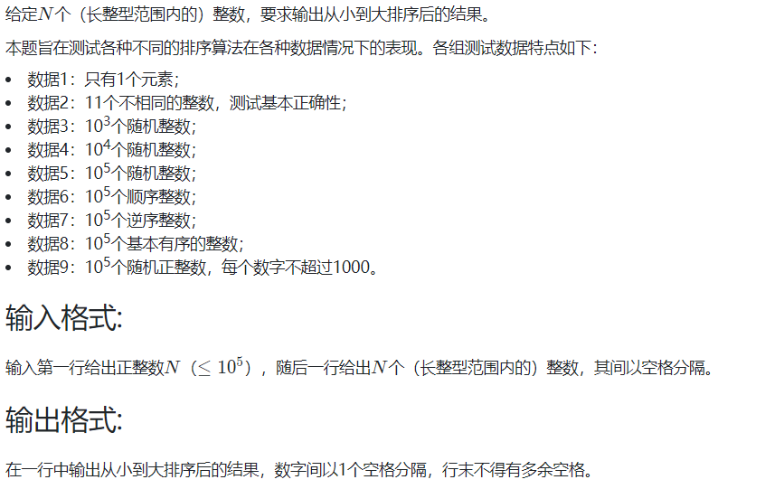
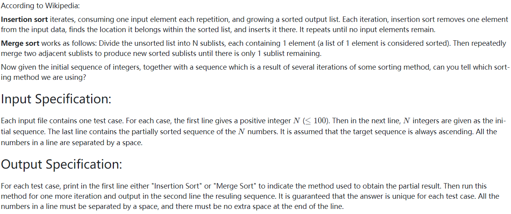
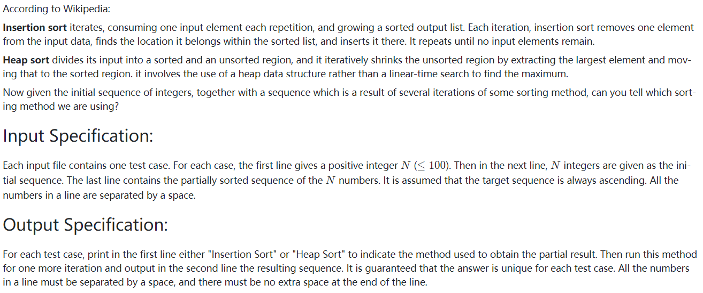

<!-- @import "[TOC]" {cmd="toc" depthFrom=1 depthTo=6 orderedList=false} -->

<!-- code_chunk_output -->

- [选择题](#选择题)
  - [对于7个数进行冒泡排序，最坏情况下需要进行的比较次数为](#对于7个数进行冒泡排序最坏情况下需要进行的比较次数为)
  - [对一组包含10个元素的非递减有序序列，采用插入排序排成非递增序列，其可能的比较次数和移动次数分别是](#对一组包含10个元素的非递减有序序列采用插入排序排成非递增序列其可能的比较次数和移动次数分别是)
  - [希尔排序是稳定的（错）](#希尔排序是稳定的错)
  - [有一组记录（46,77,55,38,41,85），用堆排序建立的初始堆为](#有一组记录467755384185用堆排序建立的初始堆为)
- [讨论题](#讨论题)
  - [堆排序最适合解决什么样的问题？](#堆排序最适合解决什么样的问题)
- [编程题](#编程题)
  - [09-排序1 排序 (25 分)](#09-排序1-排序-25-分)
  - [09-排序2 Insert or Merge (25 分)](#09-排序2-insert-or-merge-25-分)
  - [09-排序3 Insertion or Heap Sort (25 分)](#09-排序3-insertion-or-heap-sort-25-分)

<!-- /code_chunk_output -->


## 选择题

### 对于7个数进行冒泡排序，最坏情况下需要进行的比较次数为

对于7个数进行冒泡排序，最坏情况下需要进行的比较次数为：
- 21
- 6 + 5 + ... + 1 = 21

### 对一组包含10个元素的非递减有序序列，采用插入排序排成非递增序列，其可能的比较次数和移动次数分别是

- 45, 44 对
- 54, 63
- 100, 54
- 100, 100

这是把递增序列拍成从大到小的序列。

顶多比较 $1 + ... + 9 = 45$ 次。

### 希尔排序是稳定的（错）

错，因为其虽然是插排的升级，但是不是把相邻的逆序对消除。

### 有一组记录（46,77,55,38,41,85），用堆排序建立的初始堆为

85,77,55,38,41,46

注意：
- 堆排序先建立最大堆
- 建立最大堆，从最小的最右下的一颗子树开始建堆

## 讨论题

### 堆排序最适合解决什么样的问题？

参考[漠Paranoid](https://www.icourse163.org/learn/ZJU-93001?tid=1465570445#/learn/forumpersonal?uid=1139020951)：
- 从全球70多亿人口中找出最富有的100个人
- 堆排序需要$O(n)$的时间建立最大堆，然后在100次内得出结果
- 依据：从大量的$N$个数据中找最大/最小的k个元素时，用堆排序是比较快的，可以在$O(N+klogN)$时间内得到解

我总结下，就是取 `n` 个数中 `k` 个最大值。

## 编程题

### 09-排序1 排序 (25 分)

各自排序算法 C++ 实现汇总。



```
// input
11
4 981 10 -17 0 -20 29 50 8 43 -5

// output
-20 -17 -5 0 4 8 10 29 43 50 981
```

```cpp
#include <iostream>
#include <algorithm>
#include <functional>
using namespace std;

const int N = 1e5 + 10;
int n;
int a[N];

// 简单选择排序
void selection_sort(int s[], int n)
{
    int i, j;

    for (int i = 0; i < n - 1; ++ i)
    {
        int mini = i;
        for (j = i + 1; j < n; ++ j)
            if (s[mini] > s[j]) mini = j;
        swap(s[mini], s[i]);
    }
}

// 冒泡排序
void bubble_sort(int s[], int n)
{
    int flag;
    for (int i = n - 1; i >= 0; -- i)
    {
        flag = 0;
        for (int j = 0; j < i; ++ j)
            if (s[j] > s[j + 1])
            {
                swap(s[j], s[j + 1]);
                flag = 1;
            }
        if (!flag) break;
    }
}

// 直接插入排序
void insertion_sort(int s[], int n)
{
    for (int i = 1; i < n; ++ i)
    {
        int tmp = s[i];
        int j;
        for (j = i; j > 0 && s[j - 1] > tmp; -- j)
            s[j] = s[j - 1];
        s[j] = tmp;
    }
}

// 希尔排序
void shell_sort(int s[], int n)
{
    int i, j, k, p;
    int tmp;
    int Sedgewick[] = {
        929, 505, 209, 109, 41, 19, 5, 1, 0
    };
    // 初始增量不超过序列长度
    for (i = 0; Sedgewick[i] >= n; ++ i);
    for (j = Sedgewick[i]; j > 0; j = Sedgewick[++ i])
        for (k = j; k < n; ++ k)
        {
            tmp = s[k];
            for (p = k; p >= j && s[p - j] >= tmp; p -= j)
                s[p] = s[p - j];
            s[p] = tmp;
        }
}

// 堆排序
void heap_sort(int s[], int n)
{
    int cnt = n;
    int h[cnt];
    for (int i = 0; i < n; ++ i) h[i + 1] = s[i];
    function<void(int)> down = [&](int u) -> void
    {
        int t = u;
        if (u * 2 <= cnt && h[u * 2] < h[t]) t = u * 2;
        if (u * 2 + 1 <= cnt && h[u * 2 + 1] < h[t]) t = u * 2 + 1;
        if (u != t)
        {
            swap(h[u], h[t]);
            down(t);
        }
    };
    
    for (int i = n / 2; i > 0; i --) down(i);

    for (int i = 0; i < n; ++ i)
    {
        s[i] = h[1];
        h[1] = h[cnt --];
        down(1);
    }
}

// 快速排序
void quick_sort(int s[], int n)
{
    function<void(int, int)> quickSort = [&](int l, int r)
    {
        if (l >= r) return ;
        int i = l - 1, j = r + 1, pivot = s[l + r >> 1];
        while (i < j)
        {
            do ++ i; while (s[i] < pivot);
            do -- j; while (s[j] > pivot);
            if (i < j) swap(s[i], s[j]);
        }
        quickSort(l, j), quickSort(j + 1, r);
        return ;
    };
    quickSort(0, n - 1);
}

// 归并排序
void merge_sort(int s[], int n)
{
	int tmp[n];
	function<void(int, int)> mergeSort = [&](int l, int r)
	{
		if (l >= r) return ;
		int mid = l + r >> 1;
		mergeSort(l, mid);
		mergeSort(mid + 1, r);
		int k = 0, i = l, j = mid + 1;
		while (i <= mid && j <= r)
			if (s[i] < s[j]) tmp[k ++] = s[i ++];
			else tmp[k ++] = s[j ++];
		while (i <= mid) tmp[k ++] = s[i ++];
		while (j <= r) tmp[k ++] = s[j ++];
		for (i = l, j = 0; i <= r; ++ i, ++ j)
			s[i] = tmp[j];
	};
	mergeSort(0, n - 1);
}

// 基数排序，先不写了
// void radix_sort(int s[], int n)

int main()
{
    scanf("%d", &n);
    for (int i = 0; i < n; ++ i) scanf("%d", &a[i]);
    
//     selection_sort(a, n);  // 3932 ms
//     bubble_sort(a, n);  // 4, 8 两个测试点超时
//     insertion_sort(a, n);  // 3071 ms
//     shell_sort(a, n);  // 34 ms
//     heap_sort(a, n);  // 30 ms
//     quick_sort(a, n);  // 31 ms
// 	   merge_sort(a, n);  // 28 ms

    printf("%d", a[0]);
    for (int i = 1; i < n; ++ i) printf(" %d", a[i]);
}
```

### 09-排序2 Insert or Merge (25 分)



```
// input 1
10
3 1 2 8 7 5 9 4 6 0
1 2 3 7 8 5 9 4 6 0

// output 1
Insertion Sort
1 2 3 5 7 8 9 4 6 0

// input 2
10
3 1 2 8 7 5 9 4 0 6
1 3 2 8 5 7 4 9 0 6

// output 2
Merge Sort
1 2 3 8 4 5 7 9 0 6
```

```cpp
#include <iostream>
#include <algorithm>
using namespace std;

const int N = 110;
int a[N], b[N], n;

bool check()
{
    for (int i = 0; i < n; ++ i)
        if (a[i] != b[i])
            return false;
    return true;  // a 与 b 完全相等
}

int main()
{
    cin >> n;
    for (int i = 0; i < n; ++ i) cin >> a[i];
    for (int i = 0; i < n; ++ i) cin >> b[i];
    
    // 先判断是不是插入排序：①前k个有序②后面的与原序列同
    int k = 0, match = 1;
    while (b[k + 1] >= b[k]) ++ k;
    for (int i = k + 1; i < n; ++ i)
        if (a[i] != b[i])
        {
            match = 0;
            break;
        }
    
    if (match)  // 是插入排序
    {
        puts("Insertion Sort");
        sort(b, b + k + 2);
        cout << b[0];
        for (int i = 1; i < n; ++ i) cout << " " << b[i];
    }
    else  // 归并排序
    {
    	puts("Merge Sort");
        int k = 1;
        while (true)
        {
            match = check();
            int len = 1 << k;
            for (int i = 0; i < n; i += len)
                sort(a + i, a + min(i + len, n));
            if (match) break;  // 本次排序是 b 的下一步迭代
            ++ k;
        }
        cout << a[0];
        for (int i = 1; i < n; ++ i) cout << " " << a[i];
    }
}
```

### 09-排序3 Insertion or Heap Sort (25 分)



```
// input 1
10
3 1 2 8 7 5 9 4 6 0
1 2 3 7 8 5 9 4 6 0

// output 1
Insertion Sort
1 2 3 5 7 8 9 4 6 0

// input 2
10
3 1 2 8 7 5 9 4 6 0
6 4 5 1 0 3 2 7 8 9

// output 2
Heap Sort
5 4 3 1 0 2 6 7 8 9
```

```cpp
#include <iostream>
#include <algorithm>
using namespace std;

const int N = 110;
int a[N], b[N], n;

void down(int u, int size)
{
    int t = u;
    if (u * 2 <= size && b[t] < b[u * 2]) t = u * 2;
    if (u * 2 + 1 <= size && b[t] < b[u * 2 + 1]) t = u * 2 + 1;
    if (t != u)
    {
        swap(b[t], b[u]);
        down(t, size);
    }
}

int main()
{
    cin >> n;
    // 为了堆排序，这里从 1 开始存
    for (int i = 1; i <= n; ++ i) cin >> a[i];
    for (int i = 1; i <= n; ++ i) cin >> b[i];
    
    // 先判断是不是插入排序：①前k个有序②后面的与原序列同
    int k = 1, match = 1;
    while (b[k + 1] >= b[k]) ++ k;
    for (int i = k + 1; i <= n; ++ i)
        if (a[i] != b[i])
        {
            match = 0;
            break;
        }
    
    if (match)  // 是插入排序
    {
        puts("Insertion Sort");
        sort(b + 1, b + k + 2);
        cout << b[1];
        for (int i = 2; i <= n; ++ i) cout << " " << b[i];
    }
    else  // 堆排序
    {
    	puts("Heap Sort");
        int k = n;
        while (b[1] <= b[k]) -- k;
        swap(b[1], b[k]);
        down(1, k - 1);
        cout << b[1];
        for (int i = 2; i <= n; ++ i) cout << " " << b[i];
    }
}
```
