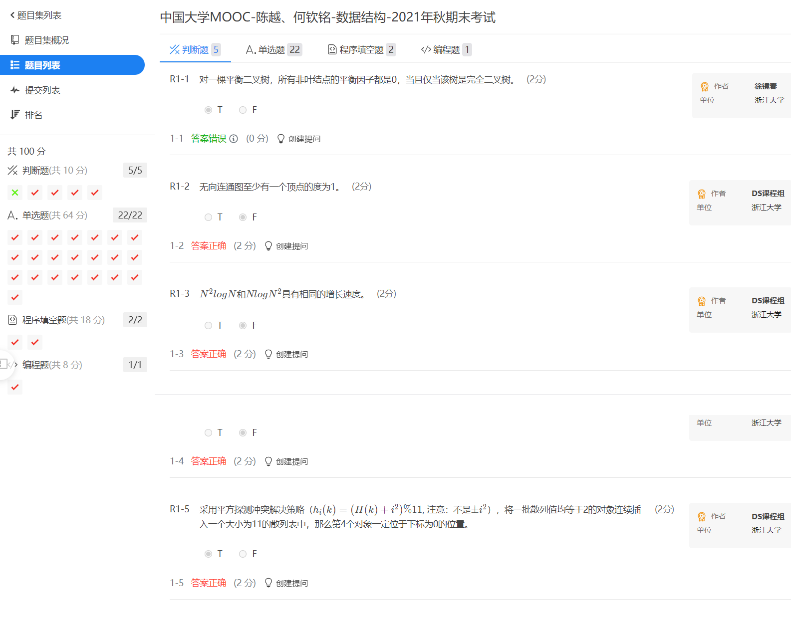

# 中国大学MOOC-陈越、何钦铭-数据结构-2021年秋期末考试

98分，错了最简单的一道题...

<!-- @import "[TOC]" {cmd="toc" depthFrom=3 depthTo=6 orderedList=false} -->

<!-- code_chunk_output -->

- [判断题（5）](#判断题5)
- [单选题（22）](#单选题22)
- [程序填空题（2）](#程序填空题2)
- [编程题（1）](#编程题1)

<!-- /code_chunk_output -->

### 判断题（5）



**完美二叉树**才能所有非叶节点平衡因子都是`0`！

### 单选题（22）


### 程序填空题（2）


### 编程题（1）


```cpp
#include <iostream>
#include <vector>
#include <algorithm>
#include <queue>
using namespace std;

const int N = 35;

int l[N], r[N];
int n;
vector<int> in, pre;

int build(int il, int ir, int pl, int pr)
{
    if (il > ir) return -1;
    int u = -1;
    for (u = il; u <= ir; ++ u)
        if (in[u] == pre[pl]) break;

    l[u] = build(il, u - 1, pl + 1, pl + (u - il));
    r[u] = build(u + 1, ir, pl + u - il + 1, pr);
    
    return u;
}

void rev(int u)
{
    if (l[u] == -1 && r[u] == -1) return ;
    if (l[u] != -1) rev(l[u]);
    if (r[u] != -1) rev(r[u]);
    swap(l[u], r[u]);
}

int main()
{
    cin >> n;
    for (int i = 0; i < n; ++ i)
    {
        int a;
        cin >> a;
        in.push_back(a);
    }
    
    for (int i = 0; i < n; ++ i)
    {
        int a;
        cin >> a;
        pre.push_back(a);
    }
    
    int root = build(0, n - 1, 0, n - 1);

    // 反转
    rev(root);
    
    // bfs
    vector<int> res;
    queue<int> q;
    q.push(root);
    while (q.size())
    {
        int k = q.size();
        for (int i = 0; i < k; ++ i)
        {
            int t = q.front();
            res.push_back(t);
            q.pop();
            if (l[t] != -1) q.push(l[t]);
            if (r[t] != -1) q.push(r[t]);
        }
    }
    
    for (int i = 0; i < n; ++ i)
    {
        if (i != 0) cout << " ";
        cout << in[res[i]];
    }
    cout << endl;
}
```