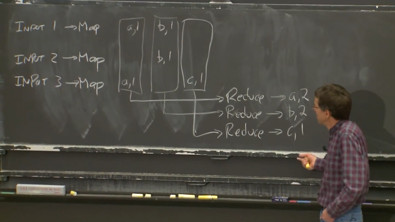
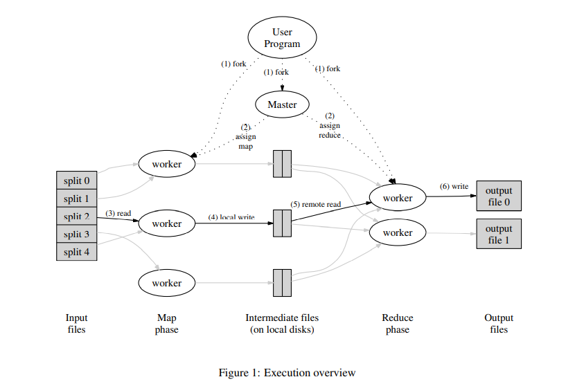

# LEC 1: Introductions

本笔记大量参考了 [肖宏辉大佬的MIT6.824分布式系统课程中文翻译](https://www.zhihu.com/column/c_1273718607160393728) 的笔记。

<!-- @import "[TOC]" {cmd="toc" depthFrom=2 depthTo=6 orderedList=false} -->

<!-- code_chunk_output -->

- [分布式系统的驱动力和挑战 Drivens and Challenges](#分布式系统的驱动力和挑战-drivens-and-challenges)
  - [大量的相互协作的计算机驱动力](#大量的相互协作的计算机驱动力)
  - [分布式系统的问题（挑战）](#分布式系统的问题挑战)
- [课程结构（Course Structure）](#课程结构course-structure)
- [分布式系统的抽象和实现工具 Abstraction and Implementation](#分布式系统的抽象和实现工具-abstraction-and-implementation)
- [分布式系统评判维度](#分布式系统评判维度)
  - [可扩展性 Scalability](#可扩展性-scalability)
  - [可用性 Availability](#可用性-availability)
  - [一致性 Consistency](#一致性-consistency)
- [MapReduce](#mapreduce)
  - [MapReduce 诞生背景](#mapreduce-诞生背景)
  - [Map Reduce 基本工作方式](#map-reduce-基本工作方式)
  - [Map 函数伪代码](#map-函数伪代码)
  - [Reduce 函数伪代码](#reduce-函数伪代码)
  - [关于 MapReduce 的问答](#关于-mapreduce-的问答)

<!-- /code_chunk_output -->

## 分布式系统的驱动力和挑战 Drivens and Challenges

本课程是 6.824 分布式系统。我会先简单的介绍我理解的分布式系统。

大家都知道分布式系统的核心是通过网络来协调，共同完成一致任务的一些计算机。我们在本课程中将会重点介绍一些案例，包括：大型网站的储存系统、大数据运算，如 MapReduce、以及一些更为奇妙的技术，比如点对点的文件共享。这是我们学习过程中的一些例子。分布式计算之所以如此重要的原因是，许多重要的基础设施都是在它之上建立的， **它们需要多台计算机或者说本质上需要多台物理隔离的计算机。**

在我先介绍分布式系统之前，也是提醒大家，在你设计一个系统时或者面对一个你需要解决的问题时，如果你可以在一台计算机上解决，而不需要分布式系统，那你就应该用一台计算机解决问题。有很多的工作都可以在一台计算机上完成，并且通常比分布式系统简单很多。所以，在选择使用分布式系统解决问题前，你应该要充分尝试别的思路，因为分布式系统会让问题解决变得复杂。

### 大量的相互协作的计算机驱动力

人们使用大量的相互协作的计算机驱动力是：
- 人们需要获得更高的计算性能。可以这么理解这一点，（大量的计算机意味着）大量的并行运算，大量CPU、大量内存、以及大量磁盘在并行的运行。
- 另一个人们构建分布式系统的原因是，它可以提供容错（tolerate faults）。比如两台计算机运行完全相同的任务，其中一台发生故障，可以切换到另一台。
- 第三个原因是，一些问题天然在空间上是分布的。例如银行转账，我们假设银行A在纽约有一台服务器，银行B在伦敦有一台服务器，这就需要一种两者之间协调的方法。所以，有一些天然的原因导致系统是物理分布的。
- 最后一个原因是，人们构建分布式系统来达成一些安全的目标。比如有一些代码并不被信任，但是你又需要和它进行交互，这些代码不会立即表现的恶意或者出现bug。你不会想要信任这些代码，所以你或许想要将代码分散在多处运行，这样你的代码在另一台计算机运行，我的代码在我的计算机上运行，我们通过一些特定的网络协议通信。所以，我们可能会担心安全问题，我们把系统分成多个的计算机，这样可以限制出错域。

这门课程中，我们主要会讨论前两点：性能和容错。剩下两点我们会通过对某些案例的研究来学习。

### 分布式系统的问题（挑战）

- 因为系统中存在很多部分，这些部分又在并发执行，你会遇到并发编程和各种复杂交互所带来的问题，以及时间依赖的问题（比如同步，异步）。这让分布式系统变得很难。
- 另一个导致分布式系统很难的原因是，分布式系统有多个组成部分，再加上计算机网络，你会遇到一些意想不到的故障。如果你只有一台计算机，那么它通常要么是工作，要么是故障或者没电，总的来说，要么是在工作，要么是没有工作。而由多台计算机组成的分布式系统，可能会有一部分组件在工作，而另一部分组件停止运行，或者这些计算机都在正常运行，但是网络中断了或者不稳定。所以，局部错误也是分布式系统很难的原因。
- 最后一个导致分布式系统很难的原因是，人们设计分布式系统的根本原因通常是为了获得更高的性能，比如说一千台计算机或者一千个磁盘臂达到的性能。但是实际上一千台机器到底有多少性能是一个棘手的问题，这里有很多难点。所以通常需要倍加小心地设计才能让系统实际达到你期望的性能。

本门课程就是为了解决这些问题。通常来说，问题和解决方案在技术上都很有趣。对于这些问题，有些有很好的解决方案，有些就没有那么好的解决方案。

分布式系统应用在很多现实生活中系统，例如大型网站通常是由大量的计算机构成的分布式系统来运行。当我刚开始教这门课的时候，分布式系统还是一种学术上的好奇尝试。人们只是发现有时需要一些小规模的系统，并且预感在未来这（大规模分布式系统）可能很重要。但是现在，随着大型网站的兴起和推动，出现了大量的数据和大型数据中心。在过去的二十年中，分布式系统已经是计算架构中很重要的一部分。这意味着大量的精力投入到解决相关问题的工作中，但是同样有少数问题还没有被解决。如果你是个研究生，并且对这方面研究感兴趣，还有很多关于分布式系统的问题等着你去解决，去进行相关研究。最后 如果你是一位热衷动手的同学，这会是一门不错的课程，因为它有一系列实验，你会编写出贴近现实，并且关注性能和容错的分布式系统。所以你会有很多机会去构建一个分布式系统并且让他们正常工作。

## 课程结构（Course Structure）

这门课有几个重要组成部分：
- 课堂授课
- 几乎每节课都有论文阅读
- 两次考试
- 编程实验
- 可选的项目（与Lab4二选一）

**授课内容会围绕分布式系统的两个方面（性能和容错）。** 有几节课会介绍一些关于编程实验的内容。许多课程我们将会以案例分析为主要形式。我会在课前提供一些关于分布式系统的论文，这些论文有些是学术研究，也有一些是工业界关于现实问题的解决方案。授课内容会被录像并被上传到网络，这样不在课堂的人也可以在别的地方观看视频，同时你们也可以回顾课程视频。

这里的论文每周需要读一篇，论文主要是研究论文，也有一些经典论文，比如今天我希望你们阅读的论文是MapReduce的论文。这篇论文很老，但是这篇论文不论在学术界还是工业界都激发了巨大的关于分布式系统的兴趣。所以，论文有一些是经典论文，也有一些最近发布的论文，用来讨论最近人们关心的最新研究成果。我希望通过这些论文可以让你们弄清楚，什么是基本的问题，研究者们有哪些想法，这些想法可能会，也可能不会对解决分布式系统的问题有用。我们有时会讨论这些论文中的一些实施细节，因为这些细节与实际构建软件系统有很多关联。我们同样会花一些时间去看对人们对系统的评估。人们是如何通过系统容错性和性能来评估一个分布式系统。我希望你们在每次讲课前，都可以完成相关论文的阅读。如果没有提前阅读，光是课程本身的内容或许没有那么有意义，因为我们没有足够的时间来解释论文中的所有内容，同时来反思论文中一些有意思的地方。所以，我真的希望大家来课堂前先阅读论文。我也希望快速高效的读论文会是这堂课的一个收获，比如跳过一些并不太重要的部分，而关注作者重要的想法。我们课程网站上每一个日程的链接都有一些思考问题，你应该在读完每篇论文后回答这个问题。我们也需要你在网站上提出关于论文的一些问题，可以让我思考一下我对课程的准备。如果我有时间我会至少通过电子邮件回答一部分问题。这些问题和回答都需要课程前一天的零点前提交。

有两次考试，一次是随堂期中，大概在春假前最后一节课；并且会在学期期末周迎来期末考试。考试内容主要为论文和实验中的内容。我建议最好的准备方式当然参加课堂授课，并且阅读论文。另一个好的准备考试的方式就是查看我们过去20年所有的考试，这在网站上都有链接。这样你就知道，我会在考试中问哪些问题？因为我们（相比往年）会涉及到一些重复的论文，所以不可避免的，我会问一些与历年题目类似的问题。

有四次编程实验。第一次实验需要在下周五前完成，这是一个简单的MapReduce实验。你们要根据你们在论文中读到的来实现你们版本的MapReduce。我们过一会就会讨论这个论文。 **第二个实验实现Raft算法，这是一个理论上通过复制来让系统容错的算法，具体是通过复制和出现故障时自动切换来实现。** 第三个实验，你需要使用你的Raft算法实现来建立一个可以容错的KV服务。第四个实验，你需要把你写的KV服务器分发到一系列的独立集群中，这样你会切分你的KV服务，并通过运行这些独立的副本集群进行加速。同时，你也要负责将不同的数据块在不同的服务器之间搬迁，并确保数据完整。这里我们通常称之为分片式KV服务。分片是指我们将数据在多个服务器上做了分区，来实现并行的加速。

如果你不想做实验四，你也可以选择你自己的项目。如果你对分布式系统有一些自己的想法，比如我们课堂上讨论到的某个类型的分布式系统，或者说你有一些自己的追求并且想对这个想法进行评估，看他们能不能正确运行，你可以选择做这个项目。这个项目中你需要联系一些你的同学，因为我们需要以2-3人的小组形式完成。你需要把想法发给我，我来确定下是否合适或者是给你一些建议。如果我觉得合适，你也想做这个项目，你就可以用它在本学期末代替实验四。你需要做一些系统设计，并构建一个真实的系统并在最后一节课前演示。同时需要交一个简短的关于如何构建它的书面报告。我在网站上也提出一些或许对你们构建这个项目有帮助的大胆的想法。当然最好的项目应该是，你自己有一个很好的想法。你需要选择一个和课程讨论内容相关的系统作为你的项目。

回到实验部分，实验成绩会由一系列针对你代码的测试构成，所以你的成绩就是我们所有测试的结果。我们会公开全部的测试数据，并没有隐藏的测试，所以如果你完成了实验并且可靠的通过了全部测试，除非出现一些愚蠢的问题，一般来说就会得到满分。希望你们不会有任何关于实验评分的问题。我需要提醒你的是，debug这些代码可能很耗时间，因为它们是分布式系统，它们有很多并发和通信，可能发生一些奇怪且困难的错误。所以，你们应该尽早开始实验 ，不要在提交实验的最后时刻还要处理很多麻烦。如果有对实验有问题，可以在工作时间来到助教办公室，你也可以在Piazza上自由提问。当然我也希望，如果你知道一个问题的答案，你可以在Piazza回答别人的提问。

还有什么关于课程的问题吗？
- 学生提问：这些部分在总成绩的占比是多少？
- Robert教授：我其实不记得了，不过你在课程网站上应该能找到答案。我想实验应该是占比最大的。

## 分布式系统的抽象和实现工具 Abstraction and Implementation

这门课程是有关应用的基础架构的。所以，贯穿整个课程，我会以分离的方式介绍：第三方的应用程序，和这些应用程序所基于的，我们课程中主要介绍的一些基础架构。基础架构的类型主要是存储，通信（网络）和计算。

我们会讨论包含所有这三个部分的基础设施，但实际上我们最关注的是存储，因为这是一个定义明确且有用的抽象概念，并且通常比较直观。人们知道如何构建和使用储存系统，知道如何去构建一种多副本，容错的，高性能分布式存储实现。

我们还会讨论一些计算系统，比如今天会介绍的MapReduce。我们也会说一些关于通信的问题，但是主要的出发点是通信是我们建立分布式系统所用的工具。比如计算机可能需要通过网络相互通信，但是可能需要保证一定的可靠性，所以我们会提到一些通信。实际上我们更多是使用已有的通信方式，如果你想了解更多关于通信系统的问题，在6.829这门课程有更多的介绍。

**对于存储和计算，我们的目标是为了能够设计一些简单接口，让第三方应用能够使用这些分布式的存储和计算，这样才能简单的在这些基础架构之上，构建第三方应用程序。这里的意思是，我们希望通过这种抽象的接口，将分布式特性隐藏在整个系统内。** 尽管这几乎是无法实现的梦想，但是我们确实希望建立这样的接口，这样从应用程序的角度来看，整个系统是一个非分布式的系统，就像一个文件系统或者一个大家知道如何编程的普通系统，并且有一个非常简单的模型语句。我们希望构建一个接口，它看起来就像一个非分布式存储和计算系统一样，但是实际上又是一个有极高的性能和容错性的分布式系统。

随着课程的进行，我们会知道，很难能找到一个抽象来描述分布式的存储或者计算，使得它们能够像非分布式系统一样有简单易懂的接口。但是，人们在这方面的做的越来越好，我们会尝试学习人们在构建这样的抽象时的一些收获。

当我们在考虑这些抽象的时候，第一个出现的话题就是实现。人们在构建分布系统时，使用了很多的工具，例如：
- RPC（Remote Procedure Call）。RPC的目标就是掩盖我们正在不可靠网络上通信的事实。
- 另一个我们会经常看到的实现相关的内容就是线程。这是一种编程技术，使得我们可以利用多核心计算机。对于本课程而言，更重要的是，线程提供了一种结构化的并发操作方式，这样，从程序员角度来说可以简化并发操作。
- 因为我们会经常用到线程，我们需要在实现的层面上，花费一定的时间来考虑并发控制，比如锁。

关于这些实现思想会在课程中出现，我们也会在许多论文中看到。对于你来说，你将会在实验中面对这些问题。你需要编程实现分布式系统，而这些工具不仅是普通的编程工具，同时也是非常重要的用来构建分布式系统的工具。

## 分布式系统评判维度

### 可扩展性 Scalability

另一个在很多论文中都出现过重要的话题，就是性能。

通常来说，构建分布式系统的目的是为了获取人们常常提到的可扩展的加速。所以，我们这里追求的是可扩展性（Scalability）。而我这里说的可扩展或者可扩展性指的是，如果我用一台计算机解决了一些问题，当我买了第二台计算机，我只需要一半的时间就可以解决这些问题，或者说每分钟可以解决两倍数量的问题。两台计算机构成的系统如果有两倍性能或者吞吐，就是我说的可扩展性。

这是一个很强大的特性。如果你构建了一个系统，并且只要增加计算机的数量，系统就能相应提高性能或者吞吐量，这将会是一个巨大的成果，因为计算机只需要花钱就可以买到。如果不增加计算机，就需要花钱雇程序员来重构这些系统，进而使这些系统有更高的性能，更高的运行效率，或者应用一个更好的算法之类的。花钱请程序员来修补这些代码，使它们运行的更快，通常会是一个昂贵的方法。我们还是希望能够通过从十台计算机提升到一千台计算机，就能扛住一百倍的流量。

所以，当人们使用一整个机房的计算机来构建大型网站的时候，为了获取对应的性能，必须要时刻考虑可扩展性。你需要仔细设计系统，才能获得与计算机数量匹配的性能。

我在课程中可能经常会画图来说明，比如我们来看这样一个图。假设我们建立了一个常规网站，一般来说一个网站有一个 HTTP 服务器，还有一些用户和浏览器，用户与一个基于 Python 或者 PHP 的 web 服务器通信， web 服务器进而跟一些数据库进行交互。

当你只有1-2个用户时，一台计算机就可以运行web服务器和数据，或者一台计算机运行web服务器，一台计算机运行数据库。但是有可能你的网站一夜之间就火了起来，你发现可能有一亿人要登录你的网站。你该怎么修改你的网站，使它能够在一台计算机上支持一亿个用户？你可以花费大量时间极致优化你的网站，但是很显然你没有那个时间。所以，为了提升性能，你要做的第一件事情就是购买更多的web服务器，然后把不同用户分到不同服务器上。这样，一部分用户可以去访问第一台web服务器，另一部分去访问第二台web服务器。因为你正在构建的是类似于Reddit的网站，所有的用户最终都需要看到相同的数据。所以，所有的web服务器都与后端数据库通信。这样，很长一段时间你都可以通过添加web服务器来并行的提高web服务器的代码效率。

只要单台web服务器没有给数据库带来太多的压力，你可以在出现问题前添加很多web服务器，但是这种可扩展性并不是无限的。很可能在某个时间点你有了10台，20台，甚至100台web服务器，它们都在和同一个数据库通信。现在，数据库突然成为了瓶颈，并且增加更多的web服务器都无济于事了。所以很少有可以通过无限增加计算机来获取完整的可扩展性的场景。因为在某个临界点，你在系统中添加计算机的位置将不再是瓶颈了。在我们的例子中，如果你有了很多的web服务器，那么瓶颈就会转移到了别的地方，这里是从web服务器移到了数据库。

这时，你几乎是必然要做一些重构工作。但是只有一个数据库时，很难重构它。而虽然可以将一个数据库拆分成多个数据库（进而提升性能），但是这需要大量的工作。

我们在本课程中，会看到很多有关分布式存储系统的例子，因为相关论文或者系统的作者都在运行大型网站，而单个数据库或者存储服务器不能支撑这样规模的网站（所以才需要分布式存储）。

所以，有关扩展性是这样：我们希望可以通过增加机器的方式来实现扩展，但是现实中这很难实现，需要一些架构设计来将这个可扩展性无限推进下去。

### 可用性 Availability

另一个重要的话题是容错。

如果你只使用一台计算机构建你的系统，那么你的系统大概率是可靠的。因为一台计算机通常可以很好的运行很多年，比如我办公室的服务器已经运行很多年而没有故障，计算机是可靠的，操作系统是可靠的，明显我办公室的电源也是可靠的。所以，一台计算机正常工作很长时间并不少见。然而如果你通过数千台计算机构建你的系统，那么即使每台计算机可以稳定运行一年，对于1000台计算机也意味着平均每天会有3台计算机故障。

所以，大型分布式系统中有一个大问题，那就是一些很罕见的问题会被放大。例如在我们的1000台计算机的集群中，总是有故障，要么是机器故障，要么是运行出错，要么是运行缓慢，要么是执行错误的任务。一个更常见的问题是网络，在一个有1000台计算机的网络中，会有大量的网络电缆和网络交换机，所以总是会有人踩着网线导致网线从接口掉出，或者交换机风扇故障导致交换机过热而不工作。在一个大规模分布式系统中，各个地方总是有一些小问题出现。所以大规模系统会将一些几乎不可能并且你不需要考虑的问题，变成一个持续不断的问题。

所以，因为错误总会发生，必须要在设计时就考虑，系统能够屏蔽错误，或者说能够在出错时继续运行。同时，因为我们需要为第三方应用开发人员提供方便的抽象接口，我们的确也需要构建这样一种基础架构，它能够尽可能多的对应用开发人员屏蔽和掩盖错误。这样，应用开发人员就不需要处理各种各样的可能发生的错误。

对于容错，有很多不同的概念可以表述。这些表述中，有一个共同的思想就是可用性（Availability）。某些系统经过精心的设计，这样在特定的错误类型下，系统仍然能够正常运行，仍然可以像没有出现错误一样，为你提供完整的服务。

某些系统通过这种方式提供可用性。比如，你构建了一个有两个拷贝的多副本系统，其中一个故障了，另一个还能运行。当然如果两个副本都故障了，你的系统就不再有可用性。所以，可用系统通常是指，在特定的故障范围内，系统仍然能够提供服务，系统仍然是可用的。如果出现了更多的故障，系统将不再可用。

除了可用性之外，另一种容错特性是自我可恢复性（recoverability）。这里的意思是，如果出现了问题，服务会停止工作，不再响应请求，之后有人来修复，并且在修复之后系统仍然可以正常运行，就像没有出现过问题一样。这是一个比可用性更弱的需求，因为在出现故障到故障组件被修复期间，系统将会完全停止工作。但是修复之后，系统又可以完全正确的重新运行，所以可恢复性是一个重要的需求。

对于一个可恢复的系统，通常需要做一些操作，例如将最新的数据存放在磁盘中，这样在供电恢复之后（假设故障就是断电），才能将这些数据取回来。甚至说对于一个具备可用性的系统，为了让系统在实际中具备应用意义，也需要具备可恢复性。因为可用的系统仅仅是在一定的故障范围内才可用，如果故障太多，可用系统也会停止工作，停止一切响应。但是当足够的故障被修复之后，系统还是需要能继续工作。所以，一个好的可用的系统，某种程度上应该也是可恢复的。当出现太多故障时，系统会停止响应，但是修复之后依然能正确运行。这是我们期望看到的。

为了实现这些特性，有很多工具。其中最重要的有两个：
- 一个是非易失存储（non-volatile storage，类似于硬盘）。这样当出现类似电源故障，甚至整个机房的电源都故障时，我们可以使用非易失存储，比如硬盘，闪存，SSD之类的。我们可以存放一些checkpoint或者系统状态的log在这些存储中，这样当备用电源恢复或者某人修好了电力供给，我们还是可以从硬盘中读出系统最新的状态，并从那个状态继续运行。所以，这里的一个工具是非易失存储。因为更新非易失存储是代价很高的操作，所以相应的出现了很多非易失存储的管理工具。同时构建一个高性能，容错的系统，聪明的做法是避免频繁的写入非易失存储。在过去，甚至对于今天的一个3GHZ的处理器，写入一个非易失存储意味着移动磁盘臂并等待磁碟旋转，这两个过程都非常缓慢。有了闪存会好很多，但是为了获取好的性能，仍然需要许多思考。
- 对于容错的另一个重要工具是复制（replication），不过，管理复制的多副本系统会有些棘手。任何一个多副本系统中，都会有一个关键的问题，比如说，我们有两台服务器，它们本来应该是有着相同的系统状态，现在的关键问题在于，这两个副本总是会意外的偏离同步的状态，而不再互为副本。对于任何一种使用复制实现容错的系统，我们都面临这个问题。lab2和lab3都是通过管理多副本来实现容错的系统，你将会看到这里究竟有多复杂。

### 一致性 Consistency

最后一个很重要的话题是一致性（Consistency）。

要理解一致性，这里有个例子，假设我们在构建一个分布式存储系统，并且这是一个KV服务。这个KV服务只支持两种操作，其中一个是put操作会将一个value存入一个key；另一个是get操作会取出key对应的value。整体表现就像是一个大的key-value表单。当我需要对一个分布式系统举例时，我总是会想到KV服务，因为它们也很基础，可以算是某种基础简单版本的存储系统。

现在，如果你是程序员，如果这两个操作有特定的意义（或者说操作满足一致性），那么对于你是有帮助的。你可以去查看手册，手册会向你解释，如果你调用get你会获取到什么，如果你调用put会有什么效果。如果有这样的手册，那是极好的。否则，如果你不知道put/get的实际行为，你又该如何写你的应用程序呢？

一致性就是用来定义操作行为的概念。之所以一致性是分布式系统中一个有趣的话题，是因为，从性能和容错的角度来说，我们通常会有多个副本。在一个非分布式系统中，你通常只有一个服务器，一个表单。虽然不是绝对，但是通常来说对于put/get的行为不会有歧义。直观上来说，put就是更新这个表单，get就是从表单中获取当前表单中存储的数据。但是在一个分布式系统中，由于复制或者缓存，数据可能存在于多个副本当中，于是就有了多个不同版本的key-value对。假设服务器有两个副本，那么他们都有一个key-value表单，两个表单中key 1对应的值都是20。

现在某个客户端发送了一个put请求，并希望将key 1改成值21。这里或许是KV服务里面的一个计数器。这个put请求发送给了第一台服务器。

之后会发送给第二台服务器，因为相同的put请求需要发送给两个副本，这样这两个副本才能保持同步。但是就在客户端准备给第二台服务器发送相同请求时，这个客户端故障了，可能是电源故障或者操作系统的bug之类的。所以，现在我们处于一个不好的状态，我们发送了一个put请求，更新了一个副本的值是21，但是另一个副本的值仍然是20。

如果现在某人通过get读取key为1的值，那么他可能获得21，也可能获得20，取决于get请求发送到了哪个服务器。即使规定了总是把请求先发送给第一个服务器，那么我们在构建容错系统时，如果第一台服务器故障了，请求也会发给第二台服务器。所以不管怎么样，总有一天你会面临暴露旧数据的风险。很可能是这样，最开始许多get请求都得到了21，之后过了一周突然一些get请求得到了一周之前的旧数据（20）。所以，这里不是很一致。并且，如果我们不小心的话，这个场景是可能发生的。 **所以，我们需要确定put/get操作的一些规则。**

实际上，对于一致性有很多不同的定义。有一些非常直观，比如说get请求可以得到最近一次完成的put请求写入的值。这种一般也被称为强一致（Strong Consistency）。但是，事实上，构建一个弱一致的系统也是非常有用的。弱一致是指，不保证get请求可以得到最近一次完成的put请求写入的值。尽管有很多细节的工作要处理，强一致可以保证get得到的是put写入的最新的数据；而很多的弱一致系统不会做出类似的保证。所以在一个弱一致系统中，某人通过put请求写入了一个数据，但是你通过get看到的可能仍然是一个旧数据，而这个旧数据可能是很久之前写入的。

**人们对于弱一致感兴趣的原因是，虽然强一致可以确保get获取的是最新的数据，但是实现这一点的代价非常高。** 几乎可以确定的是，分布式系统的各个组件需要做大量的通信，才能实现强一致性。如果你有多个副本，那么不管get还是put都需要询问每一个副本。在之前的例子中，客户端在更新的过程中故障了，导致一个副本更新了，而另一个副本没有更新。如果我们要实现强一致，简单的方法就是同时读两个副本，如果有多个副本就读取所有的副本，并使用最近一次写入的数据。但是这样的代价很高，因为需要大量的通信才能得到一个数据。所以，为了尽可能的避免通信，尤其当副本相隔的很远的时候，人们会构建弱一致系统，并允许读取出旧的数据。当然，为了让弱一致更有实际意义，人们还会定义更多的规则。

强一致带来的昂贵的通信问题，会把你带入这样的困境：当我们使用多副本来完成容错时，我们的确需要每个副本都有独立的出错概率，这样故障才不会关联。例如，将两个副本放在一个机房的一个机架上，是一个非常糟糕的主意。如果有谁踢到了机架的电源线，那我们数据的两个副本都没了，因为它们都连在同一个机架的同一根电线上。所以，为了使副本的错误域尽可能独立，为了获得良好的容错特性，人们希望将不同的副本放置在尽可能远的位置，例如在不同的城市或者在大陆的两端。这样，如果地震摧毁了一个数据中心，另一个数据中心中的副本有很大可能还能保留。我们期望这样的效果。但是如果我们这么做了，另一个副本可能在数千英里之外，按照光速来算，也需要花费几毫秒到几十毫秒才能完成横跨洲际的数据通信，而这只是为了更新数据的另一个副本。所以，为了保持强一致的通信，代价可能会非常高。因为每次你执行put或者get请求，你都需要等待几十毫秒来与数据的两个副本通信，以确保它们都被更新了或者都被检查了以获得最新的数据。现在的处理器每秒可以执行数十亿条指令，等待几十毫秒会大大影响系统的处理速度。

所以，人们常常会使用弱一致系统，你只需要更新最近的数据副本，并且只需要从最近的副本获取数据。在学术界和现实世界（工业界），有大量关于构建弱一致性保证的研究。所以，弱一致对于应用程序来说很有用，并且它可以用来获取高的性能。

以上就是本课程中一些技术思想的快速预览。

## MapReduce

### MapReduce 诞生背景

接下来介绍MapReduce。这是一个详细的案例研究，它会展示之前讲过的大部分的思想。

MapReduce是由Google设计，开发和使用的一个系统，相关的论文在2004年发表。Google当时面临的问题是，他们需要在TB级别的数据上进行大量的计算。比如说，为所有的网页创建索引，分析整个互联网的链接路径并得出最重要或者最权威的网页。 **如你所知，在当时，整个互联网的数据也有数十TB。构建索引基本上等同于对整个数据做排序，而排序比较费时。** 如果用一台计算机对整个互联网数据进行排序，要花费多长时间呢？可能要几周，几个月，甚至几年。所以，当时Google非常希望能将对大量数据的大量运算并行跑在几千台计算机上，这样才能快速完成计算。对Google来说，购买大量的计算机是没问题的，这样Google的工程师就不用花大量时间来看报纸来等他们的大型计算任务完成。所以，有段时间，Google买了大量的计算机，并让它的聪明的工程师在这些计算机上编写分布式软件，这样工程师们可以将手头的问题分包到大量计算机上去完成，管理这些运算，并将数据取回。

如果你只雇佣熟练的分布式系统专家作为工程师，尽管可能会有些浪费，也是可以的。但是Google想雇用的是各方面有特长的人，不一定是想把所有时间都花在编写分布式软件上的工程师。所以Google需要一种框架，可以让它的工程师能够进行任意的数据分析，例如排序，网络索引器，链接分析器以及任何的运算。工程师只需要实现应用程序的核心，就能将应用程序运行在数千台计算机上，而不用考虑如何将运算工作分发到数千台计算机，如何组织这些计算机，如何移动数据，如何处理故障等等这些细节。所以，当时Google需要一种框架，使得普通工程师也可以很容易的完成并运行大规模的分布式运算。这就是MapReduce出现的背景。

### Map Reduce 基本工作方式

MapReduce的思想是，应用程序设计人员和分布式运算的使用者，只需要写简单的Map函数和Reduce函数，而不需要知道任何有关分布式的事情，MapReduce框架会处理剩下的事情。

抽象来看，MapReduce假设有一些输入，这些输入被分割成大量的不同的文件或者数据块。所以，我们假设现在有输入文件1，输入文件2和输入文件3，这些输入可能是从网上抓取的网页，更可能是包含了大量网页的文件。

MapReduce启动时，会查找Map函数。之后，MapReduce框架会为每个输入文件运行Map函数。这里很明显有一些可以并行运算的地方，比如说可以并行运行多个只关注输入和输出的Map函数。

Map函数以文件作为输入，文件又是整个输入数据的一部分。 **Map函数的输出是一个key-value对的列表。假设我们在实现一个最简单的MapReduce Job：单词计数器。它会统计每个单词出现的次数。在这个例子中，Map函数会输出key-value对，其中key是单词，而value是1。** Map函数会将输入中的每个单词拆分，并输出一个key-value对，key是该单词，value是1。最后需要对所有的key-value进行计数，以获得最终的输出。所以，假设输入文件1包含了单词a和单词b，Map函数的输出将会是key=a，value=1和key=b，value=1。第二个Map函数只从输入文件2看到了b，那么输出将会是key=b，value=1。第三个输入文件有一个a和一个c。

**我们对所有的输入文件都运行了Map函数，并得到了论文中称之为中间输出（intermediate output），也就是每个Map函数输出的key-value对。**

运算的第二阶段是运行Reduce函数。MapReduce框架会收集所有Map函数输出的每一个单词的统计。比如说，MapReduce框架会先收集每一个Map函数输出的key为a的key-value对。收集了之后，会将它们提交给Reduce函数。



之后会收集所有的b。这里的收集是真正意义上的收集，因为b是由不同计算机上的不同Map函数生成，所以不仅仅是数据从一台计算机移动到另一台（如果Map只在一台计算机的一个实例里，可以直接通过一个RPC将数据从Map移到Reduce）。我们收集所有的b，并将它们提交给另一个Reduce函数。这个Reduce函数的入参是所有的key为b的key-value对。对c也是一样。所以，MapReduce框架会为所有Map函数输出的每一个key，调用一次Reduce函数。

在我们这个简单的单词计数器的例子中，Reduce函数只需要统计传入参数的长度，甚至都不用查看传入参数的具体内容，因为每一个传入参数代表对单词加1，而我们只需要统计个数。最后，每个Reduce都输出与其关联的单词和这个单词的数量。所以第一个Reduce输出a=2，第二个Reduce输出b=2，第三个Reduce输出c=1。

这就是一个典型的MapReduce Job。从整体来看，为了保证完整性，有一些术语要介绍一下：
- **Job ，整个MapReduce计算称为Job。**
- **Task ，每一次MapReduce调用称为Task。**

所以，对于一个完整的MapReduce Job，它由一些Map Task和一些Reduce Task组成。所以这是一个单词计数器的例子，它解释了MapReduce的基本工作方式。

### Map 函数伪代码

```
map(String key, String value):
    // key: document name
    // value: document contents
    for each word w in value:
        EmitIntermediate(w, "1");
```

Map函数使用一个key和一个value作为参数。我们这里说的函数是由普通编程语言编写，例如C++，Java等，所以这里的函数任何人都可以写出来。入参中，key是输入文件的名字，通常会被忽略，因为我们不太关心文件名是什么，value是输入文件的内容。所以，对于一个单词计数器来说，value包含了要统计的文本，我们会将这个文本拆分成单词。之后对于每一个单词，我们都会调用emit。emit由MapReduce框架提供，并且这里的emit属于Map函数。emit会接收两个参数，其中一个是key，另一个是value。在单词计数器的例子中，emit入参的key是单词，value是字符串“1”。这就是一个Map函数。在一个单词计数器的MapReduce Job中，Map函数实际就可以这么简单。而这个Map函数不需要知道任何分布式相关的信息，不需要知道有多台计算机，不需要知道实际会通过网络来移动数据。这里非常直观。

### Reduce 函数伪代码

```
reduce(String key, Iterator values):
    // key: a word
    // values: a list of counts
    int result = 0;
    for each v in values:
        result += ParseInt(v);
    Emit(AsString(result));
```

Reduce函数的入参是某个特定key的所有实例（Map输出中的key-value对中，出现了一次特定的key就可以算作一个实例）。所以Reduce函数也是使用一个key和一个value作为参数，其中value是一个数组，里面每一个元素是Map函数输出的key的一个实例的value。对于单词计数器来说，key就是单词，value就是由字符串“1”组成的数组，所以，我们不需要关心value的内容是什么，我们只需要关心value数组的长度。Reduce函数也有一个属于自己的emit函数。这里的emit函数只会接受一个参数value，这个value会作为Reduce函数入参的key的最终输出。所以，对于单词计数器，我们会给emit传入数组的长度。这就是一个最简单的Reduce函数。并且Reduce也不需要知道任何有关容错或者其他有关分布式相关的信息。

### 关于 MapReduce 的问答

学生提问：可以将Reduce函数的输出再传递给Map函数吗？

Robert教授：在现实中，这是很常见的。MapReduce用户定义了一个MapReduce Job，接收一些输入，生成一些输出。之后可能会有第二个MapReduce Job来消费前一个Job的输出。对于一些非常复杂的多阶段分析或者迭代算法，比如说Google用来评价网页的重要性和影响力的PageRank算法，这些算法是逐渐向答案收敛的。我认为Google最初就是这么使用MapReduce的，他们运行MapReduce Job多次，每一次的输出都是一个网页的列表，其中包含了网页的价值，权重或者重要性。所以将MapReduce的输出作为另一个MapReduce Job的输入这很正常。

学生提问：如果可以将Reduce的输出作为Map的输入，在生成Reduce函数的输出时需要有什么注意吗？

Robert教授：是的，你需要设置一些内容。比如你需要这么写Reduce函数，使其在某种程度上知道应该按照下一个MapReduce Job需要的格式生成数据。这里实际上带出了一些MapReduce框架的缺点。如果你的算法可以很简单的由Map函数、Map函数的中间输出以及Reduce函数来表达，那是极好的。MapReduce对于能够套用这种形式的算法是极好的。并且，Map函数必须是完全独立的，它们是一些只关心入参的函数。这里就有一些限制了。事实上，很多人想要的更长的运算流程，这涉及到不同的处理。使用MapReduce的话，你不得不将多个MapReduce Job拼装在一起。而在本课程后面会介绍的一些更高级的系统中，会让你指定完整的计算流程，然后这些系统会做优化。这些系统会发现所有你想完成的工作，然后有效的组织更复杂的计算。

学生提问：MapReduce框架更重要还是Map/Reduce函数更重要？

Robert教授：从程序员的角度来看，只需要关心Map函数和Reduce函数。从我们的角度来看，我们需要关心的是worker进程和worker服务器。这些是MapReduce框架的一部分，它们与其它很多组件一起调用了Map函数和Reduce函数。所以是的，从我们的角度来看，我们更关心框架是如何组成的。从程序员的角度来看，所有的分布式的内容都被剥离了。

学生提问：当你调用emit时，数据会发生什么变化？emit函数在哪运行？



Robert教授：首先看，这些函数在哪运行。这里可以看MapReduce论文的图1。现实中，MapReduce运行在大量的服务器之上，我们称之为worker服务器或者worker。同时，也会有一个Master节点来组织整个计算过程。这里实际发生的是，Master服务器知道有多少输入文件，例如5000个输入文件，之后它将Map函数分发到不同的worker。所以，它会向worker服务器发送一条消息说，请对这个输入文件执行Map函数吧。之后，MapReduce框架中的worker进程会读取文件的内容，调用Map函数并将文件名和文件内容作为参数传给Map函数。worker进程还需要实现emit，这样，每次Map函数调用emit，worker进程就会将数据写入到本地磁盘的文件中。 **所以，Map函数中调用emit的效果是在worker的本地磁盘上创建文件，这些文件包含了当前worker的Map函数生成的所有的key和value。**

所以，Map阶段结束时，我们看到的就是Map函数在worker上生成的一些文件。之后，MapReduce的worker会将这些数据移动到Reduce所需要的位置。对于一个典型的大型运算，Reduce的入参包含了所有Map函数对于特定key的输出。通常来说，每个Map函数都可能生成大量key。所以通常来说，在运行Reduce函数之前。运行在MapReduce的worker服务器上的进程需要与集群中每一个其他服务器交互来询问说，看，我需要对key=a运行Reduce，请看一下你本地磁盘中存储的Map函数的中间输出，找出所有key=a，并通过网络将它们发给我。所以，Reduce worker需要从每一个worker获取特定key的实例。这是通过由Master通知到Reduce worker的一条指令来触发。一旦worker收集完所有的数据，它会调用Reduce函数，Reduce函数运算完了会调用自己的emit，这个emit与Map函数中的emit不一样，它会将输出写入到一个Google使用的共享文件服务中。

有关输入和输出文件的存放位置，这是我之前没有提到的，它们都存放在文件中，但是因为我们想要灵活的在任意的worker上读取任意的数据，这意味着我们需要某种网络文件系统（network file system）来存放输入数据。所以实际上，MapReduce论文谈到了GFS（Google File System）。GFS是一个共享文件服务，并且它也运行在MapReduce的worker集群的物理服务器上。GFS会自动拆分你存储的任何大文件，并且以64MB的块存储在多个服务器之上。所以，如果你有了10TB的网页数据，你只需要将它们写入到GFS，甚至你写入的时候是作为一个大文件写入的，GFS会自动将这个大文件拆分成64MB的块，并将这些块平均的分布在所有的GFS服务器之上，而这是极好的，这正是我们所需要的。如果我们接下来想要对刚刚那10TB的网页数据运行MapReduce Job，数据已经均匀的分割存储在所有的服务器上了。如果我们有1000台服务器，我们会启动1000个Map worker，每个Map worker会读取1/1000输入数据。这些Map worker可以并行的从1000个GFS文件服务器读取数据，并获取巨大的读取吞吐量，也就是1000台服务器能提供的吞吐量。

随着Google这些年对MapReduce系统的改进，答案也略有不同。通常情况下，如果我们在一个例如GFS的文件系统中存储大的文件，你的数据分散在大量服务器之上，你需要通过网络与这些服务器通信以获取你的数据。

MapReduce的worker需要通过网络与存储了输入文件的GFS服务器通信，并通过网络将数据读取到MapReduce的worker节点，进而将数据传递给Map函数。这是最常见的情况。并且这是MapReduce论文中介绍的工作方式。但是如果你这么做了，这里就有很多网络通信。 如果数据总共是10TB，那么相应的就需要在数据中心网络上移动10TB的数据。而数据中心网络通常是GB级别的带宽，所以移动10TB的数据需要大量的时间。在论文发表的2004年，MapReduce系统最大的限制瓶颈是网络吞吐。如果你读到了论文的评估部分，你会发现，当时运行在一个有数千台机器的网络上，每台计算机都接入到一个机架，机架上有以太网交换机，机架之间通过root交换机连接。


如果随机的选择MapReduce的worker服务器和GFS服务器，那么至少有一半的机会，它们之间的通信需要经过root交换机，而这个root交换机的吞吐量总是固定的。如果做一个除法，root交换机的总吞吐除以2000，那么每台机器只能分到50Mb/S的网络容量。这个网络容量相比磁盘或者CPU的速度来说，要小得多。所以，50Mb/S是一个巨大的限制。

在MapReduce论文中，讨论了大量的避免使用网络的技巧。其中一个是将GFS和MapReduce混合运行在一组服务器上。所以如果有1000台服务器，那么GFS和MapReduce都运行在那1000台服务器之上。当MapReduce的Master节点拆分Map任务并分包到不同的worker服务器上时，Master节点会找出输入文件具体存在哪台GFS服务器上，并把对应于那个输入文件的Map Task调度到同一台服务器上。所以，默认情况下，这里的箭头是指读取本地文件，而不会涉及网络。虽然由于故障，负载或者其他原因，不能总是让Map函数都读取本地文件，但是几乎所有的Map函数都会运行在存储了数据的相同机器上，并因此节省了大量的时间，否则通过网络来读取输入数据将会耗费大量的时间。

我之前提过，Map函数会将输出存储到机器的本地磁盘，所以存储Map函数的输出不需要网络通信，至少不需要实时的网络通信。但是，我们可以确定的是，为了收集所有特定key的输出，并将它们传递给某个机器的Reduce函数，还是需要网络通信。假设现在我们想要读取所有的相关数据，并通过网络将这些数据传递给单台机器，数据最开始在运行Map Task的机器上按照行存储（例如第一行代表第一个Map函数输出a=1，b=1）。

而我们最终需要这些数据在运行Reduce函数的机器上按照列存储（例如，Reduce函数需要的是第一个Map函数的a=1和第三个Map函数的a=1）。论文里称这种数据转换之为洗牌（shuffle）。所以，这里确实需要将每一份数据都通过网络从创建它的Map节点传输到需要它的Reduce节点。所以，这也是MapReduce中代价较大的一部分。

学生提问：是否可以通过Streaming的方式加速Reduce的读取？

Robert教授：你是对的。你可以设想一个不同的定义，其中Reduce通过streaming方式读取数据。我没有仔细想过这个方法，我也不知道这是否可行。作为一个程序接口，MapReduce的第一目标就是让人们能够简单的编程，人们不需要知道MapReduce里面发生了什么。对于一个streaming方式的Reduce函数，或许就没有之前的定义那么简单了。

不过或许可以这么做。实际上，很多现代的系统中，会按照streaming的方式处理数据，而不是像MapReduce那样通过批量的方式处理Reduce函数。在MapReduce中，需要一直要等到所有的数据都获取到了才会进行Reduce处理，所以这是一种批量处理。现代系统通常会使用streaming并且效率会高一些。

所以这里的shuffle的重点是，这里实际上可能会有大量的网络通信。假设你在进行排序，排序的输入输出会有相同的大小。这样，如果你的输入是10TB，为了能排序，你需要将10TB的数据在网络上移动，并且输出也会是10TB，所以这里有大量的数据。这可能发生在任何MapReduce job中，尽管有一些MapReduce job在不同阶段的数据没有那么大。

之前有人提过，想将Reduce的输出传给另一个MapReduce job，而这也是人们常做的事情。在一些场景中，Reduce的输出可能会非常巨大，比如排序，比如网页索引器。10TB的输入对应的是10TB的输出。所以，Reduce的输出也会存储在GFS上。但是Reduce只会生成key-value对，MapReduce框架会收集这些数据，并将它们写入到GFS的大文件中。所以，这里有需要一大轮的网络通信，将每个Reduce的输出传输到相应的GFS服务器上。你或许会认为，这里会使用相同的技巧，就将Reduce的输出存储在运行了Reduce Task的同一个GFS服务器上（因为是混部的）。或许Google这么做了，但是因为GFS会将数据做拆分，并且为了提高性能并保留容错性，数据会有2-3份副本。这意味着，不论你写什么，你总是需要通过网络将一份数据拷贝写到2-3台服务器上。所以，这里会有大量的网络通信。这里的网络通信，是2004年限制MapReduce的瓶颈。在2020年，因为之前的网络架构成为了人们想在数据中心中做的很多事情的限制因素，现代数据中心中，root交换机比过去快了很多。并且，你或许已经见过，一个典型的现代数据中心网络，会有很多的root交换机而不是一个交换机（spine-leaf架构）。每个机架交换机都与每个root交换机相连，网络流量在多个root交换机之间做负载分担。所以，现代数据中心网络的吞吐大多了。

我认为Google几年前就不再使用MapReduce了，不过在那之前，现代的MapReduce已经不再尝试在GFS数据存储的服务器上运行Map函数了，它乐意从任何地方加载数据，因为网络已经足够快了。

好的，我们没有时间聊MapReduce了，下周有一个lab，你会在lab中实现一个你自己的简单版本的MapReduce。
