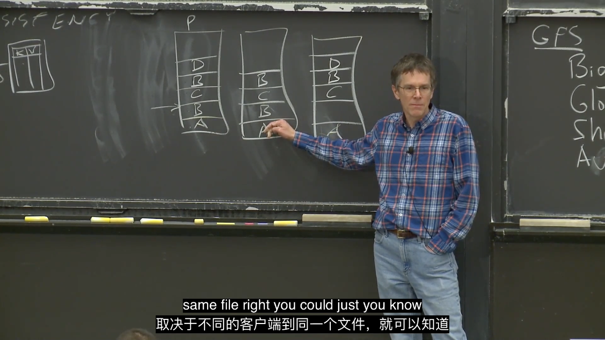

# LEC 3: GFS

课堂实录可参考 [肖宏辉大佬的MIT6.824分布式系统课程中文翻译](https://www.zhihu.com/column/c_1273718607160393728) 的笔记。

<!-- @import "[TOC]" {cmd="toc" depthFrom=2 depthTo=6 orderedList=false} -->

<!-- code_chunk_output -->

- [预习内容](#预习内容)
- [WHY HARD 要克服什么挑战，面临什么取舍](#why-hard-要克服什么挑战面临什么取舍)
- [Google File System](#google-file-system)
- [GFS 读文件](#gfs-读文件)
- [GFS 写文件](#gfs-写文件)
- [GFS 一致性](#gfs-一致性)
- [额外阅读：GFS、Tectonic、JuiceFS](#额外阅读gfs-tectonic-juicefs)

<!-- /code_chunk_output -->

## 预习内容

1. GFS 概述
- GFS是Google设计的用于大规模分布式数据密集型应用的可扩展分布式文件系统。它在廉价的商用硬件上运行，提供容错能力，并为大量客户端提供高聚合性能。

2. GFS 的关键特性
- **容错能力**：GFS在设计时就考虑到了组件故障的常态，通过持续监控、数据复制和自动恢复来实现系统的容错。
- **大文件优化**：GFS针对的是大型文件，这些文件通常是通过追加操作而不是随机写入来修改的。
- **简化的一致性模型**：GFS放宽了一致性模型，简化了文件系统的设计，同时也减轻了应用层面的负担。
- **原子记录追加**：GFS提供了原子记录追加操作，允许多个客户端无需额外同步即可并发追加到同一个文件。
- **快照功能**：GFS支持快照操作，可以低成本地创建文件或目录树的副本。

3. GFS 架构
- **主从架构**：GFS集群由单个主服务器（master）和多个块服务器（chunkserver）组成，客户端通过主服务器访问数据。
- **数据分块**：文件被分割成固定大小的数据块（chunks），每个块在多个块服务器上存储以实现冗余。
- **元数据管理**：主服务器维护所有文件系统元数据，包括命名空间、访问控制信息、文件到块的映射以及块的当前位置。

4. GFS 的性能和可靠性
- **高聚合吞吐量**：通过分离文件系统控制和数据传输，GFS能够为大量并发读写操作提供高聚合吞吐量。
- **在线修复机制**：GFS定期在线修复损坏，并补偿丢失的副本，以维持数据的完整性。

5. GFS 的局限性和权衡
- **简化的一致性模型**：GFS的一致性模型被简化，以换取性能和设计的简单性，这可能不适合所有类型的应用。
- **单主服务器的瓶颈**：GFS使用单个主服务器，虽然简化了设计，但随着系统的扩展，可能会成为性能瓶颈。

6. GFS 的替代方案
- **Colossus**：据传GFS已被Colossus取代，Colossus在保持相同目标的同时，对主服务器性能和容错能力进行了改进。

## WHY HARD 要克服什么挑战，面临什么取舍

面临性能与一致性的权衡，这里教授的逻辑链很巧：
```
希望有 Performance -> 因此需要数据分片到多台机器并行处理 Sharding
成百机器并行处理，总会有 Faults -> 因此我们需要容错 Tolerance
若想实现容错 Tolerance -> 一种方法是数据冗余 Replication
若有数据冗余 REPL -> 可能会带来数据不一致的问题 Inconsistency
若想实现一致性 Consistency -> 则导致了 Low Performance
```

## Google File System

Big, Fast, Global, Sharding, Automatic recovery

Single data center, Internal use, Big sequential access （并非随机访问）

> 尽管实际中可以拿多台机器作为Master节点，但是GFS中Master是Active-Standby模式，所以只有一个Master节点在工作。Master节点保存了文件名和存储位置的对应关系。除此之外，还有大量的Chunk服务器，可能会有数百个，每一个Chunk服务器上都有1-2块磁盘。

Master存管理数据，Chunk存数据。

防止数据丢失，Master会在磁盘构建checkpoint。

## GFS 读文件

要读哪个文件，问 Master ，获取 ChunkID 。

> 第一步是，应用程序想读取某个特定文件的某个特定的偏移位置上的某段特定长度的数据，比如说第1000到第2000个字节的数据。所以，应用程序将文件名，长度和起始位置发送给Master节点。Master节点会从其file表单中查询文件名并找到包含这个数据段的Chunk。

> 客户端也许可以算出来是哪个Chunk，但是客户端不知道Chunk在哪个服务器上。为了获取服务器信息，客户端需要与Master交互。

## GFS 写文件

明确一下“版本号”：
- 版本号只在Master节点认为Chunk没有Primary时才会增加。在一个正常的流程中，如果对于一个Chunk来说，已经存在了Primary，那么Master节点会记住已经有一个Primary和一些Secondary，Master不会重新选择Primary，也不会增加版本号。它只会告诉客户端说这是Primary，并不会变更版本号。
- 所有的Secondary都有相同的版本号。版本号只会在Master指定一个新Primary时才会改变。通常只有在原Primary发生故障了，才会指定一个新的Primary。所以，副本（参与写操作的Primary和Secondary）都有相同的版本号，你没法通过版本号来判断它们是否一样，或许它们就是不一样的（取决于数据追加成功与否）。

首先讨论了：
- 对于同一份数据， Master 如何确认 Chunk 最新的版本号
- Master 告诉他认为是 Primary Chunk 的服务器，你是 Primary ，并且在接下来 60s 都是（租约）

> Primary告诉所有的副本去执行数据追加操作，某些成功了，某些没成功。如果某些副本没有成功执行，Primary会回复客户端说执行失败。之后客户端会认为数据没有追加成功。但是实际上，部分副本还是成功将数据追加了。所以现在，一个Chunk的部分副本成功完成了数据追加，而另一部分没有成功，这种状态是可接受的，没有什么需要恢复，这就是GFS的工作方式。

> 如果写文件失败之后，一个客户端读取相同的Chunk，客户端可能可以读到追加的数据，也可能读不到，取决于客户端读的是Chunk的哪个副本。

**所以，客户端并不一定接受到最准确的数据，除非客户端明确要求自己接受到最准确的数据：** 当Primary回复“no”给客户端时，客户端知道写入失败了，之后客户端的GFS库会重新发起追加数据的请求，直到最后成功追加数据。成功了之后，追加的数据会在所有的副本中相同位置存在。在那之前，追加的数据只会在部分副本中存在。（但其实也不一定能做到准确）

## GFS 一致性

弱一致。



这里，若 B 没写，写 C 应根据偏移量写，而非并入 A 后面。

GFS 要做到强一致性还有很多需要改进的。我不想在此多加讨论，之后做 raft 时再考虑。

## 额外阅读：GFS、Tectonic、JuiceFS

浅析三款大规模分布式文件系统架构设计：https://juicefs.com/zh-cn/blog/engineering/large-scale-distributed-filesystem-comparison

JuiceFS 用过，支持 POSIX 接口，好用。

看到 JuiceFS 的 github repo 一下想到了 GFS ，有相似的地方。粗浅地理解为： JuiceFS 用 Redis 管理元数据；对象存储 Object Storage 用的亚马逊 S3 存储文件数据，基本对应 GFS 的 chunk 。

Tectonic 是 Meta 的 EB 级别数据分布式存储，因此抽象出了三个层次： Name layer 是与文件的名字或者目录结构有关的元数据，File layer 是跟当前文件本身的一些属性相关的数据，Block layer 是每一个数据块在 Chunk Store 位置的元数据。

> 这里记录下文章中写的 GFS 的意义：GFS 证明了我们可以用相对廉价的通用计算机，来组建一个足够强大、可扩展、可靠的分布式存储。Google 当时在设计 GFS 时做了很多取舍，它舍弃掉了很多传统单机文件系统的特性，保留了对于当时 Google 搜索引擎场景需要的一些分布式存储的需求。
