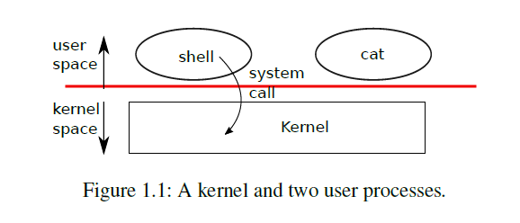
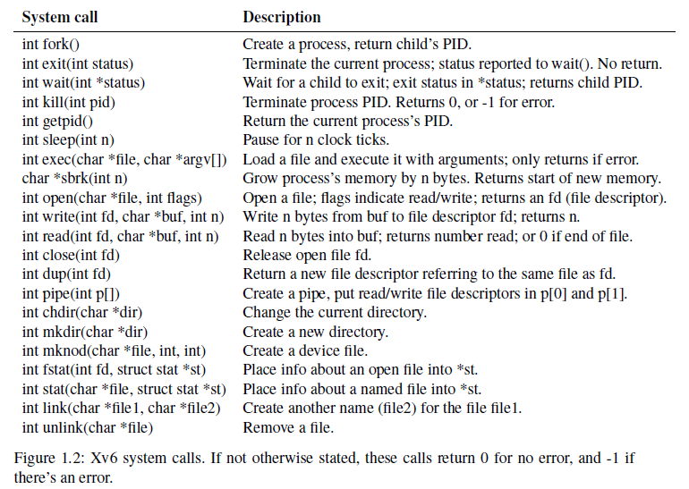
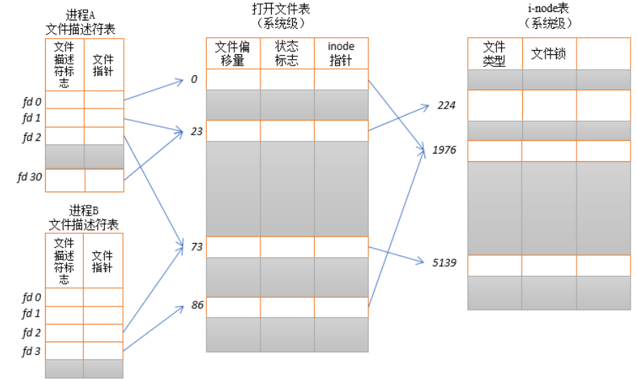
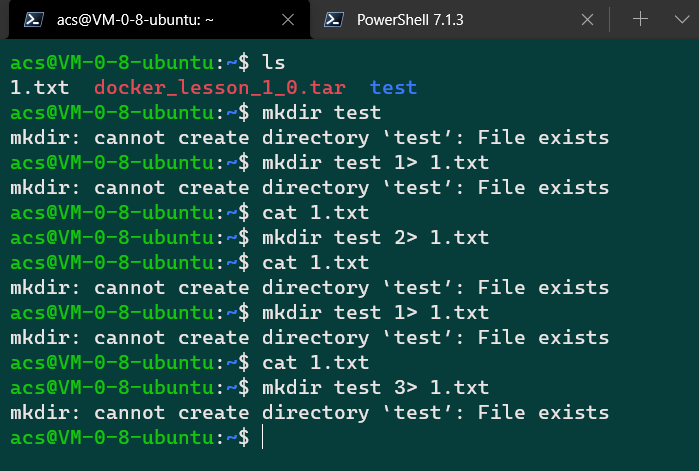
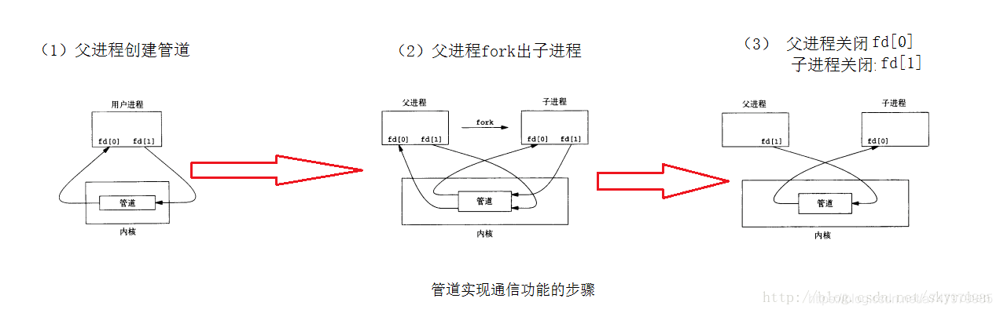
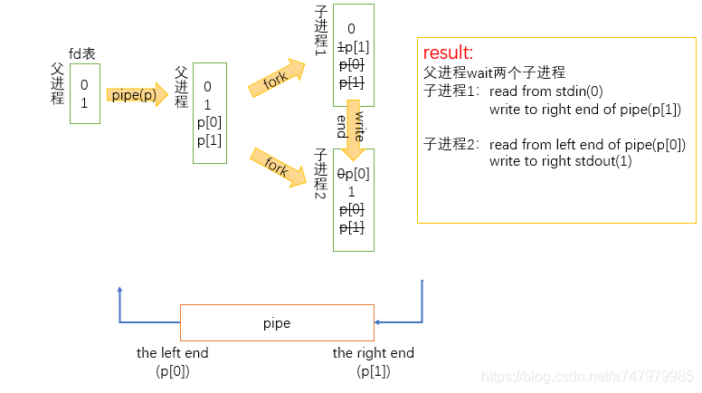

# LEC 1 (rtm): Introduction and examples

目录：

<!-- @import "[TOC]" {cmd="toc" depthFrom=2 depthTo=2 orderedList=false} -->

<!-- code_chunk_output -->

- [课前预习：阅读教材第一章](#课前预习阅读教材第一章)
- [补充知识点](#补充知识点)

<!-- /code_chunk_output -->

细分目录：

<!-- @import "[TOC]" {cmd="toc" depthFrom=2 depthTo=6 orderedList=false} -->

<!-- code_chunk_output -->

- [课前预习：阅读教材第一章](#课前预习阅读教材第一章)
  - [Foreword and acknowledgments](#foreword-and-acknowledgments)
  - [Chapter 1 Operating system interfaces](#chapter-1-operating-system-interfaces)
    - [1.1 Processes and memory](#11-processes-and-memory)
      - [system call: fork](#system-call-fork)
      - [system call: exec](#system-call-exec)
      - [main structure of shell](#main-structure-of-shell)
    - [1.2 I/O and File descriptors](#12-io-and-file-descriptors)
      - [文件描述符 file descriptor](#文件描述符-file-descriptor)
      - [文件描述符补充知识](#文件描述符补充知识)
      - [open和write](#open和write)
      - [close和文件重定向](#close和文件重定向)
      - [dup和文件重定向](#dup和文件重定向)
    - [1.3 Pipes](#13-pipes)
    - [1.4 File system](#14-file-system)
      - [数据结构inode](#数据结构inode)
      - [文件封装命令以及cd](#文件封装命令以及cd)
    - [1.5 Real world](#15-real-world)
    - [1.6 Exercises](#16-exercises)
- [补充知识点](#补充知识点)
  - [子进程中使用两次fork](#子进程中使用两次fork)

<!-- /code_chunk_output -->

## 课前预习：阅读教材第一章

教材：[../lec/book-riscv-rev1.pdf](../lec/book-riscv-rev1.pdf)

### Foreword and acknowledgments

xv6 基于 Unix 之父的 Unix Version 6 （最经典的操作系统），并且，是基于 `ANSI C for a multi-core RISC-V` 实现的。

### Chapter 1 Operating system interfaces

什么是操作系统？

The job of an operating system is to share a computer among multiple programs and to provide a more useful set of services than the hardware alone supports. An operating system manages and abstracts the low-level hardware, so that, for example, a word processor need not concern itself with which type of disk hardware is being used. An operating system shares the hardware among multiple programs so that they run (or appear to run) at the same time. Finally, operating systems provide controlled ways for programs to interact, so that they can share data or work together.

我概括一下：
- 封装硬件，给应用程序提供运行环境
- 调配应用程序间资源

接着这里阐明了为什么用 xv6 系统。系统精简巧妙，其基于的 Unix v6 是最经典的操作系统，是现代操作系统的鼻祖：
- 接口单一，但是泛化性很强（功能强）
- 设计思维影响了几乎所有现代操作系统



如上，按我的理解， `cat` 应该也和 `shell` 一样，也是一个 `process` 。上图中， `shell` 发起了一个系统调用 `system call` 。



Xv6 实现了 Unix v6 的系统调用的子集。

#### 1.1 Processes and memory

进程 process 由以下部分组成：
- 用户态内存 user-space memory ： instructions, data, stack
- 在内核状态 per-process state private to the kernel

Xv6 管理进程：在后台给进程切换可用 CPU ，进程挂起（保存 its CPU registers, restoring them when it next runs the process），分配 PID 等。

##### system call: fork

一个进程创建新的 process ，可以用系统调用 `fork` 。

`fork` 父子进程的内存相同，父进程返回子进程 PID ，子进程返回 0 。

```c
int pid = fork();
if (pid > 0) {
    printf("parent: child=%d\n", pid);
    pid = wait((int *) 0);
    printf("child %d is done\n", pid);
} else if (pid == 0) {
    printf("child: exiting\n");
    exit(0);
} else {
    printf("fork error\n");
}
```

如上程序，可能输出：
```
parent: child=1234
child: exiting
parent: child 1234 is done
```

解释一下重点：
- `wait` 返回当前进程子进程的 `PID` ，并且传入一个指针，这个指针将被修改为指向 `child exit status`
- 父进程 `wait` 后，开始等待子进程结束，而子进程复制了父进程的内容，因此会把程序再执行一遍，只不过因为其子进程身份，`fork()` 返回的是 `0`
- 所以，如果我们不在乎 `child exit status` 可以传入一个无所谓的 0 指针（`(int *) 0`）
- 初始化时，父子进程的 `memory` 与 `registers` 相同，但之后改变其中一个的变量并不影响另一个的变量

##### system call: exec

`exec` 系统调用会把 calling process 的内存用新内存快照替换掉，这个内存快照会遵守特定的格式：
- ELF 格式（第三章将会详细讨论）
- 包括数据区、指令从哪里开始

`exec` 成功执行后，并不返回调用它的程序（ calling process ），而是到 ELF header 那里。

`exec` 有两个参数：
- 可执行文件名
- 参数（`an array of string`）

```c
char *argv[3];

argv[0] = "echo";
argv[1] = "hello";
argv[2] = 0;
exec("/bin/echo", argv);
printf("exec error\n");
```

我们的程序在、是 `/bin/echo` 文件；大部分程序会无视参数数组的第一个，因为那个往往是程序名称。

##### main structure of shell

`shell` 的 `main` 是一个 `loop` ，用 `getcmd` 读输入，然后调用 `fork` （ `creates a copy of the shell process` ）。

参考：[https://github.com/mit-pdos/xv6-riscv/blob/riscv//user/sh.c#L145](https://github.com/mit-pdos/xv6-riscv/blob/riscv//user/sh.c#L145)

```c
main(void)
{
  static char buf[100];
  int fd;

  // Ensure that three file descriptors are open.
  while((fd = open("console", O_RDWR)) >= 0){
    if(fd >= 3){
      close(fd);
      break;
    }
  }

  // Read and run input commands.
  while(getcmd(buf, sizeof(buf)) >= 0){
    if(buf[0] == 'c' && buf[1] == 'd' && buf[2] == ' '){
      // Chdir must be called by the parent, not the child.
      buf[strlen(buf)-1] = 0;  // chop \n
      if(chdir(buf+3) < 0)
        fprintf(2, "cannot cd %s\n", buf+3);
      continue;
    }
    if(fork1() == 0)
      runcmd(parsecmd(buf));
    wait(0);  // runcmd 执行完毕则 return from wait
  }
  exit(0);
}
```

原来只有 `cd` 指令不是个进程，牛逼。

Xv6 隐式地分配大部分用户态内存：
- `fork` 为子进程分配父进程的内存拷贝
- `exec` 为可执行文件分配足够内存
- 诸如 `malloc` 这种在运行时需要更多内存的进程，可以调用 `sbrk(n)` 来增加数据内存， `n` 表示 `n` 字节， `sbrk` 返回新内存的位置

#### 1.2 I/O and File descriptors

##### 文件描述符 file descriptor

文件描述符是一个小的整数（`small integer`），代表一个内核对象（`kernel-managed object`）。进程会去读或写这个内核对象。

为了方便有简称：
- `file` 就代表 `file descriptor`
- `input and output` 用 `I/O` 表示

文件描述符提供了抽象的接口，使得 `files` 、 `pipes` 、 `devices` 都看起来一样，成了字节流（`streams of bytes`）。

##### 文件描述符补充知识

这里参考了：[百度百科](https://baike.baidu.com/item/%E6%96%87%E4%BB%B6%E6%8F%8F%E8%BF%B0%E7%AC%A6)、[文件描述符（0、1、2）的用法](https://blog.csdn.net/baozhourui/article/details/88265557)、[文件描述符与socket连接](https://www.cnblogs.com/DengGao/p/file_symbol.html)。

每一个文件描述符会与一个打开文件相对应，同时，不同的文件描述符也会指向同一个文件。相同的文件可以被不同的进程打开也可以在同一个进程中被多次打开。系统为每一个进程维护了一个文件描述符表，该表的值都是从0开始的，所以在不同的进程中你会看到相同的文件描述符，这种情况下相同文件描述符有可能指向同一个文件，也有可能指向不同的文件。



在进程A中，文件描述符`1`和`30`都指向了同一个打开的文件句柄（标号`23`）。这可能是通过调用`dup()`、`dup2()`、`fcntl()`或者对同一个文件多次调用了`open()`函数而形成的。

进程A的文件描述符`2`和进程B的文件描述符`2`都指向了同一个打开的文件句柄（标号73）。这种情形可能是在调用`fork()`后出现的（即，进程`A`、`B`是父子进程关系），或者当某进程通过`UNIX`域套接字将一个打开的文件描述符传递给另一个进程时，也会发生。再者是不同的进程独自去调用`open`函数打开了同一个文件，此时进程内部的描述符正好分配到与其他进程打开该文件的描述符一样。

此外，进程`A`的描述符`0`和进程`B`的描述符`3`分别指向不同的打开文件句柄，但这些句柄均指向`i-node`表的相同条目（`1976`），换言之，指向同一个文件。发生这种情况是因为每个进程各自对同一个文件发起了`open()`调用。同一个进程两次打开同一个文件，也会发生类似情况。

上图对于 `fd 0` 的例子可能并不标准，因为 **还有3个特殊的文件描述符。**
- `0` 代表标准输入 `standard input`
- `1` 代表标准输出 `standard output`
- `2` 代表标准错误 `standard error`

比如， `0<`  表示标准输入， `1>` 就会输出标准输出，而 `2>` 就会输出表征错误，我们随便操作一下 Linux 系统就会看出：



在 `shell` 的 `main` 里，也会有保证这三个文件描述符被打开了（[user/sh.c:151](https://github.com/mit-pdos/xv6-riscv/blob/riscv//user/sh.c#L151)）：

```c
int
main(void)
{
  static char buf[100];
  int fd;

  // Ensure that three file descriptors are open.
  while((fd = open("console", O_RDWR)) >= 0){
    if(fd >= 3){
      close(fd);
      break;
    }
  }
  ...
}
```

##### open和write

涉及到一些系统调用：
- `open(fd, buf, n)` ，把 `n` 个字节的内容复制到 `buf` ，并且返回其读的字节数
  - 如果没有可读的，就返回 `0`
  - 每个 `fd` 都有一个偏移量， `read` 会在偏移量基础上读
- `write(fd, buf, n)` ， 从 `buf` 复制 `n` 个字节到 `fd` ，也根据并控制偏移量

看一个例子，即简易版 `cat` 命令：

```c
char buf[512];
int n;

for (;;)
{
  n = read(0, buf, sizeof buf);  // 读标准输入
  if (n == 0)
    break;
  if (n < 0)
  {
    fprintf(2, "read error\n");
    exit(1);
  }
  if (write(1, buf, n) != n)  // 写给标准输出
  {
    fprintf(2, "write error\n");
    exit(1);
  }
}
```

**使用标准输入和标准输出，`cat` 就用不着区分它是从文件、控制台还是管道来读的程序了。**

##### close和文件重定向

`close` 则释放一个 `fd` ，这个 `fd` 则可以被以后的 `open` 重新使用。注意 `open` **总是会打开最小的没被占用的** `fd` ，应用这点我们来看 `cat < input.txt` ：

```c
char *argv[2];

argv[0] = "cat";
argv[1] = 0;
if (fork() == 0)
{
  close(0);
  open("input.txt", O_RDONLY);
  exec("cat", argv);
}
```

这里子进程 `close` 把标准输入关了，又因为此时空闲的最小的文件描述符一定是 `0` 了，则 `open` 必会把 `"input.txt` 作为标准输入。此外，父进程的文件描述符不会受影响，甚妙！

##### dup和文件重定向

但是，如果：

```c
if (fork() == 0)
{
  write(1, "hello ", 6);
  exit(0);
} else {
  wait(0);
  write(1, "world\n", 6);
}
```

则输出 `hello world` ，对于 `write` 其改动的 `fd` 的偏移量对于父进程是全局的，无论是否在子进程中调用。

此外，也可以使用 `dup` 一个打开的文件号（`fd`），使两个文件号都指向同一个文件。**且其文件偏移量是共享的。**

因此下面这段程序输出的也是 `hello world` ：
```c
fd = dup(1);
write(1, "hello ", 6);
write(fd, "world\n", 6);
```

`dup` 有什么用？请见这条 `sh` ：
```sh
ls existing-file non-existing-file > tmp1 2>&1
```

`&1` 就是 `tmp1` ，如此，我们在内核中实现时就做了一次 `dup(tmp1)` ，而 `existing-file` 的名字和 `non-existing-file` 的错误信息都将出现在 `tmp1` 文件中。

最后，书中再次强调了：文件描述符这种抽象的牛逼之处，万物皆文件得到很好的体现。

> File descriptors are a powerful abstraction, because they hide the details of what they are connected to: a process writing to file descriptor 1 may be writing to a file, to a device like the console, or to a pipe.

#### 1.3 Pipes

管道 `pipe` 作为一个内核缓存区，是一对文件描述符 `file descriptor` ，一个用于读入，一个用于写出。

举个例子：
```sh
# 有管道
echo hello world | wc
# 没有管道
echo hello world >/tmp/xyz; wc </tmp/xyz
```

以 `wc` 为例，其中标准输入被连接到一个管道的输出：

```c
int p[2];
char *argv[2];

argv[0] = "wc";
argv[1] = 0；

pipe(p);
if (fork() == 0) {  // 在子进程中
  close(0);
  dup(p[0]);  // 因为关了 0 ，因此分配 0 与 p[0] 同
              // 所以子进程标准输入就成了文件 p[0]
  close(p[0]);
  close(p[1]);
  exec("/bin/wc", argv);
} else {  // 父进程中
  close(p[0]);
  write(p[1], "hello world\n", 12);
  close(p[1]);
}
```

这里再举个源码例子[user/sh.c#L100](https://github.com/mit-pdos/xv6-riscv/blob/riscv//user/sh.c#L100)：

```c
struct cmd {
  int type;
};

struct pipecmd {
  int type;
  struct cmd *left;
  struct cmd *right;
};

...

int fork1(void);  // Fork but panics on failure.
void panic(char*);
struct cmd *parsecmd(char*);

...

// Execute cmd.  Never returns.
void
runcmd(struct cmd *cmd)
{
  int p[2];
  ...
  struct pipecmd *pcmd;
  ...

  if(cmd == 0)
    exit(1);

  switch(cmd->type){
  default:
    panic("runcmd");

  ...

  case PIPE:
    pcmd = (struct pipecmd*)cmd;
    if(pipe(p) < 0)
      panic("pipe");
    if(fork1() == 0){
      close(1);
      dup(p[1]);
      close(p[0]);
      close(p[1]);
      runcmd(pcmd->left);
    }
    if(fork1() == 0){  // 上面 fork1() 的子进程不会到这里，因为 runcmd 会 exit()
    // 这里只会是主进程创建的第二个子进程
    // 在 runcmd 里可能也会有管道，因此最终可能会成为一棵进程树
      close(0);
      dup(p[0]);
      close(p[0]);
      close(p[1]);
      runcmd(pcmd->right);
    }
    close(p[0]);
    close(p[1]);
    wait(0);
    wait(0);
    break;

    ...
  }
  ...
}

...

void
panic(char *s)
{
  fprintf(2, "%s\n", s);
  exit(1);
}

int
fork1(void)
{
  int pid;

  pid = fork();
  if(pid == -1)
    panic("fork");
  return pid;
}

...
```

找到两张图，觉得值得参考：
- [进程间的通信方式——pipe（管道）](https://blog.csdn.net/skyroben/article/details/71513385)
- [MIT6.828学习之homework2：shell](https://blog.csdn.net/a747979985/article/details/95094094)





书中最后总结了管道跟临时文件相比，至少有4点优势（翻译取自[橡树人](https://www.jianshu.com/p/6d782bb606d5)）：
- 管道会自动的清理数据。使用了文件重定向，`shell`要仔细地移除`/tmp/xyz`；
- 管道可传递任意长度的数据流，而文件重定向要求磁盘上有足够的空闲空间来存储所有的数据；
- 管道允许并行流水线的状态并行执行，但是文件重定向要求：在第二个程序完成前，第一个程序必须完成；
- 如果正在实现进程间通信，则管道的阻塞读和阻塞写回被文件的非阻塞语义更有效。

#### 1.4 File system

在 C 语言中，系统调用包括：
- `chdir()` 改变当前的工作目录

```c
chdir("/a");
chdir("b");
open("c", O_RDONLY);

// 等价于
open("/a/b/c", O_RDONLY);
```

- `mkdir("/new_dir")` 创建一个新目录
- `open` 加上参数 `O_CREATE` 创建新文件 `fd = open("/dir/file", O_CREATE|O_WRONLY);`
- `mknod` 创建指向硬件的特殊文件 `mknod("/console", 1, 1);`

##### 数据结构inode

`inode` 是一种数据结构，用于描述文件，一个文件可以有多个名字（`links`）。

`fstat` 用于从 `inode` 中通过文件描述符提取文件信息，哪些信息呢？见 kernel/stat.h ：
```c
#define T_DIR      1  // Directory
#define T_FILE     2  // File
#define T_DEVICE   3  // Device

struct stat {
  int dev;      // File system's disk device
  uint ino;     // Inode number
  short type;   // Type of file
  short nlink;  // Number of links to file
  uint64 size;  // Size of file in bytes
}
```

`link` 系统调用可以增加文件名称，如下：
```c
open("a", O_CREATE|O_WRONLY);
link("a", "b");
```

此时 `a` 与 `b` 完全等价。`nlink` 就是 2 了。

`unlink` 系统调用可以释放名称。如下。

```c
unlink("a");
```

当一个 `inode` 的 `link` 都没了，并且没有文件描述符指向它了，这个 `inode` 就会被释放。如下。

```c
fd = open("/tmp/xyz", O_CREATE|O_RDWR);
unlink("/tmp/xyz");
```

上面是一种常用的创建临时 `inode` 的方法，当进程结束或者 `fd` 被关闭时，这个 `inode` 也被释放。

##### 文件封装命令以及cd

`Unix` 提供了文件工具比如 `mkdir` 、 `ln` 、 `rm` 在用户层（`shell`）使用。在当时，这种设计其实很有开创新，因为很多同时期的其它系统，其类似的命令是与 `shell` 强集成的，而 `shell` 又是直接在内核建立起来的。

只有一个特例，`cd`不是文件，而是在 `shell` 里被特殊判断的字符。因为其要改变主进程（`shell`）的工作路径，而非子进程的。

#### 1.5 Real world

记录一下 `xv6` 并不是完备的 POSIX （`Portable Operating System Interface`）。

#### 1.6 Exercises

在 Linux 里跑就行，反正都是 POSIX ，用 `#include <unistd.h>` 调 `fork()` 。

参考[6.828/2019 Exercise 1.6.1: pingpong](https://ypl.coffee/xv6-exercise-pingpong/)。

见 [../exercises/1.6.ping_pong.c](../exercises/1.6.ping_pong.c) 。

```bash
gcc -o 1.6.ping_pong 1.6.ping_pong.c
./1.6.ping_pong
```

输出：
```
parent p2[0] 5
child p2[0] 5
parent p2[1] 6
child p2[1] 6
parent p1[0] 3
child p1[0] 3
parent p1[1] 4
child p1[1] 4
average RTT: 0.037730 ms
exchanges per second: 26503 times
```

- 可以看出父子进程轮流运行
- 我的 wsl2 以及电脑本身真的挺慢的...

## 补充知识点

### 子进程中使用两次fork

运行以下 `c` 程序：
```c
#include <stdio.h>
#include <unistd.h>

int main()
{
    int pid1, pid2;

    printf("before fork\n");
    pid1 = fork();
    printf("%d: 1 %d\n", pid1, pid1);
    printf("%d: after fork1\n", pid1);
    pid2 = fork();
    printf("%d: 2 %d\n", pid1, pid2);
    printf("%d: after fork2\n", pid1);

    return 0;
}
```

输出：
```
before fork
970: 1 970       // 主进程创造了子进程 970 在主进程中打印此句
970: after fork1 // 主进程
0: 1 0           // 970 进程调用 fork 返回 0 （ 970 是主进程的子进程）
970: 2 971       // 主进程再次 fork 创造了子进程 971
0: after fork1   // 970
970: after fork2 // 主进程
970: 2 0         // 971 进程 fork 得到的是 0 （ 971 是主进程的子进程）
970: after fork2 // 971
0: 2 972         // 970 进程再次 fork 则作为父进程创建 972
0: after fork2   // 970
0: 2 0           // 972 进程 fork 得到 0 （ 972 是 970 子进程）
0: after fork2   // 972 进程
```

可以看到：
- 只有一个 `before fork` ，说明 `fork()` 后，子进程从这句 `fork()` 开始运行
- 最后有四个 `after fork2` 因为这里一共创建了四个进程，具体看我上面分析
