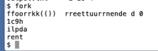

# LEC 1 (rtm): Introduction and examples

笔记大量参考了[肖宏辉](https://www.zhihu.com/people/xiao-hong-hui-15)大佬的翻译：
- https://www.zhihu.com/column/c_1294282919087964160

目录：

<!-- @import "[TOC]" {cmd="toc" depthFrom=2 depthTo=2 orderedList=false} -->

<!-- code_chunk_output -->

- [课程简介：操作系统做哪些事](#课程简介操作系统做哪些事)
- [计算机系统](#计算机系统)
- [系统调用：read和write](#系统调用read和write)
- [shell](#shell)
- [进程相关系统调用：fork和exec以及wait](#进程相关系统调用fork和exec以及wait)
- [I/O重定向与课程总结](#io重定向与课程总结)

<!-- /code_chunk_output -->

细分目录：

<!-- @import "[TOC]" {cmd="toc" depthFrom=2 depthTo=6 orderedList=false} -->

<!-- code_chunk_output -->

- [课程简介：操作系统做哪些事](#课程简介操作系统做哪些事)
- [计算机系统](#计算机系统)
  - [Kernel在干什么](#kernel在干什么)
  - [系统调用以及例子](#系统调用以及例子)
  - [为什么操作系统的设计是困难且有趣的？](#为什么操作系统的设计是困难且有趣的)
- [系统调用：read和write](#系统调用read和write)
  - [最简单例子copy.c](#最简单例子copyc)
  - [open与文件描述符](#open与文件描述符)
- [shell](#shell)
  - [shell简介](#shell简介)
  - [重定向IO](#重定向io)
- [进程相关系统调用：fork和exec以及wait](#进程相关系统调用fork和exec以及wait)
  - [fork](#fork)
  - [exec](#exec)
  - [wait](#wait)
- [I/O重定向与课程总结](#io重定向与课程总结)

<!-- /code_chunk_output -->

## 课程简介：操作系统做哪些事

对于操作系统的目标，我也列出了几个点。你知道的，市面上有大量不同的操作系统，通常来说，他们都有一些共同的目标。
- 第一个就是抽象硬件。通常来说，你会买一个计算机，里面包含了CPU，内存，但是这是一种非常低层级的资源。幸好我们有一些应用程序实现了高层级的接口和抽象，例如进程，文件系统。这些高层级的接口和抽象（`Abstraction`）方便了应用的开发，也提供了更好的移植性。
- 操作系统的另一个重要的任务是：在多个应用程序之间共用硬件资源。你可以在一个操作系统同时运行文本编辑器，程序编译器，多个数据库等等。操作系统能非常神奇的在不相互干扰的前提下，同时运行这些程序。这里通常被称为`multiplex`。
- 因为在操作系统中可能同时运行很多程序，即使程序出现了故障，多个程序之间互不干扰就变得非常重要。所以这里需要隔离性（`Isolation`），不同的活动之间不能相互干扰。
- 但是另一方便，不同的活动之间有时又想要相互影响，比如说数据交互，协同完成任务等。举个例子，我通过文本编辑器创建了一个文件，并且我希望我的编译器能读取文件，我绝对想要数据能共享。所以，我们希望能在需要的时候实现共享（`Sharing`）。
- 但是在很多场景下，用户并不想要共享，比如你登录到了一个公共的计算机，例如`Athena`，你不会想要其他人来读取你的文件。所以在共享的同时，我们也希望在没有必要的时候不共享。这里我们称为`Security`或者`Permission System`或者是`Access Control System`。
- 另一个人们认为操作系统应该具有的价值是：如果你在硬件上花费了大量的金钱，你会期望你的应用程序拥有硬件应该提供的完整性能，但是很多时候你只负责应用程序编程，你会期望操作系统也必须保证自身提供的服务不会阻止应用程序获得高性能。所以操作系统需要至少不阻止应用程序获得高性能，甚至需要帮助应用程序获得高性能（`Performance`）。
- 最后，对于大部分操作系统，必须要支持大量不同类型的应用程序，或许这是一个笔记本，正在运行文本编辑器，正在运行游戏，或许你的操作系统需要支持数据库服务器和云计算。通常来说，设计并构造一个操作系统代价是非常大的，所以人们总是希望在相同的操作系统上，例如`Linux`，运行大量的任务。我认为大部分人都已经跑过`Linux`，并使用了我刚刚描述的所有的场景。所以，同一个操作系统需要能够支持大量不同的用户场景。

## 计算机系统

### Kernel在干什么


区别于用户空间程序，有一个特殊的程序总是会在运行，它称为`Kernel`。`Kernel`是计算机资源的守护者。当你打开计算机时，`Kernel`总是第一个被启动。`Kernel`程序只有一个，它维护数据来管理每一个用户空间进程。`Kernel`同时还维护了大量的数据结构来帮助它管理各种各样的硬件资源，以供用户空间的程序使用。`Kernel`同时还有大量内置的服务，例如，`Kernel`通常会有文件系统实现类似文件名，文件内容，目录的东西，并理解如何将文件存储在磁盘中。所以用户空间的程序会与`Kernel`中的文件系统交互，文件系统再与磁盘交互。

在这门课程中，我们主要关注点在`Kernel`、连接`Kernal`和用户空间程序的接口、`Kernel`内软件的架构。所以，我们会关心`Kernel`中的服务，其中一个服务是文件系统，另一个就是进程管理系统。每一个用户空间程序都被称为一个进程，它们有自己的内存和共享的CPU时间。同时，`Kernel`会管理内存的分配。不同的进程需要不同数量的内存，`Kernel`会复用内存、划分内存，并为所有的进程分配内存。

文件系统通常有一些逻辑分区。目前而言，我们可以认为文件系统的作用是管理文件内容并找出文件具体在磁盘中的哪个位置。文件系统还维护了一个独立的命名空间，其中每个文件都有文件名，并且命名空间中有一个层级的目录，每个目录包含了一些文件。所有这些都被文件系统所管理。

这里还有一些安全的考虑，我们可以称之为`Access Control`。当一个进程想要使用某些资源时，比如读取磁盘中的数据，使用某些内存，`Kernel`中的`Access Control`机制会决定是否允许这样的操作。对于一个分时共享的计算机，例如`Athena`系统，这里可能会变得很复杂。因为在`Athena`系统中，每一个进程可能属于不同的用户，因此会有不同`Access`规则来约定哪些资源可以被访问。

在一个真实的完备的操作系统中，会有很多很多其他的服务，比如在不同进程之间通信的进程间通信服务，比如一大票与网络关联的软件（`TCP/IP`协议栈），比如支持声卡的软件，比如支持数百种不同磁盘，不同网卡的驱动。所以在一个完备的系统中，`Kernel`会包含大量的内容，数百万行代码。

### 系统调用以及例子

我们同时也对应用程序是如何与`Kernel`交互，它们之间的接口长什么样感兴趣。这里通常成为`Kernel`的`API`，它决定了应用程序如何访问`Kernel`。通常来说，这里是通过所谓的系统调用（`System Call`）来完成。

```c
fd = open("out", 1);
write(fd, "hello\n", 6);
pid = fork();
```

第一个例子是，如果应用程序需要打开一个文件，它会调用名为`open`的系统调用，并且把文件名作为参数传给`open`。假设现在要打开一个名为“`out`”的文件，那么会将文件名“`out`”作为参数传入。同时我们还希望写入数据，那么还会有一个额外的参数，在这里这个参数的值是`1`，表明我想要写文件。

这里看起来像是个函数调用，但是`open`是一个系统调用，它会跳到`Kernel`，`Kernel`可以获取到`open`的参数，执行一些实现了`open`的`Kernel`代码，或许会与磁盘有一些交互，最后返回一个文件描述符对象。上图中的`fd`全称就是`file descriptor`。之后，应用程序可以使用这个文件描述符作为`handle`，来表示相应打开的文件。

如果你想要向文件写入数据，相应的系统调用是`write`。你需要向`write`传递一个由`open`返回的文件描述符作为参数。你还需要向`write`传递一个指向要写入数据的指针（数据通常是`char`型序列），在C语言中，可以简单传递一个双引号表示的字符串（`\n`表示是换行）。第三个参数是你想要写入字符的数量。

第二个参数的指针，实际上是内存中的地址。所以这里实际上告诉内核，将内存中这个地址起始的`6`个字节数据写入到`fd`对应的文件中。

另一个你可能会用到的，更有意思的系统调用是`fork`。`fork`是一个这样的系统调用，它创建了一个与调用进程一模一样的新的进程，并返回新进程的`process ID/pid`。这里实际上会复杂的多，我们后面会有更多的介绍。

> 学生提问：系统调用跳到内核与标准的函数调用跳到另一个函数相比，区别是什么？

> `Robert`教授：`Kernel`的代码总是有特殊的权限。当机器启动`Kernel`时，`Kernel`会有特殊的权限能直接访问各种各样的硬件，例如磁盘。而普通的用户程序是没有办法直接访问这些硬件的。所以，当你执行一个普通的函数调用时，你所调用的函数并没有对于硬件的特殊权限。然而，如果你触发系统调用到内核中，内核中的具体实现会具有这些特殊的权限，这样就能修改敏感的和被保护的硬件资源，比如访问硬件磁盘。我们之后会介绍更多有关的细节。

### 为什么操作系统的设计是困难且有趣的？

- 高效又易用：高效通常意味着操作系统需要在离硬件近的low-level进行操作，而易用则要求操作系统为应用程序提供抽象的high-level可移植接口
- 强大的操作系统服务：我们不想程序员看到数量巨多，复杂且难以理解的的内核接口。因为，如果他们不理解这些接口，他们就会很难使用这些接口。所以，我们也想要简单的API。所以，这里要提供一个简单的接口，同时又包含了强大的功能。
- 自由又安全：你希望给与应用程序尽可能多的灵活性，你不会想要限制应用程序，所以你需要内核具备灵活的接口。但是另一方面，你的确需要在某种程度上限制应用程序，因为你会想要安全性。我们希望给程序员完全的自由，但是实际上又不能是真正的完全自由，因为我们不想要程序员能直接访问到硬件，干扰到其他的应用程序，或者干扰操作系统的行为。

- 问：对于应用程序开发人员来说，他们会基于一些操作系统做开发，真正的深入理解这些操作系统有多重要？他们需要成为操作系统的专家吗？
  - 答：你不必成为一个专家。但是如果你花费大量时间来开发，维护并调试应用程序，你最终还是会知道大量操作系统的知识。不论你是否是有意要掌握这些知识，它们就是出现了，而你不得不去理解它们。
- 问：对于一些例如Python的高阶编程语言（高阶是指离自然语言更接近，低阶是指离机器语言更接近如C，汇编），它们是直接执行系统调用呢，还是内部对系统调用进行了封装呢？
  - 许多高阶的编程语言都离系统调用较远，这是一个事实。部分原因是很多编程语言想要提供可以在多个操作系统上运行的可移植的环境，所以它们不能依赖特定的系统调用。所以，对于这个问题的答案我认为是，如果你使用了Python，你在某种程度上就与系统调用接口隔离了。当然，在Python内部，最终还是要执行系统调用来完成相应的工作。当然，Python和许多其他的编程语言通常都有方法能直接访问系统调用。

## 系统调用：read和write

XV6运行在一个RISC-V微处理器上，我们会在一个QEMU模拟器上运行XV6。

XV6运行在QEMU模拟器之上。这样你们都能在没有特定硬件的前提下，运行XV6。

### 最简单例子copy.c

```c
// copy.c copy input to output.

#include "kernel/types.h"
#include "user/user.h"

int
main()
{
  char buf[64];

  while(1){
    int n = read(0, buf, sizeof(buf));
    if(n <= 0)
      break;
    write(1, buf, n);
  }
  
  exit(0);
}
```

运行 `copy` ，我们输入什么，按回车，就返回什么。

这里演示了基本的系统调用 `read` 和 `write` 。

`read`可能从一个文件读数据，如果到达了文件的结尾没有更多的内容了，`read`会返回`0`。如果出现了一些错误，比如文件描述符不存在，`read`或许会返回`-1`。在后面的很多例子中，比如第`16`行，我都没有通过检查系统调用的返回来判断系统调用是否出错，但是你应该比我更加小心，你应该清楚系统调用通常是通过返回`-1`来表示错误，你应该检查所有系统调用的返回值以确保没有错误。

- 学生提问：如果`read`的第三个参数设置成`1 + sizeof(buf)`会怎样？
  - Robert教授：如果第三个参数是`65`字节，操作系统会拷贝`65`个字节到你提供的内存中（第二个参数）。但是如果栈中的第`65`个字节有一些其他数据，那么这些数据会被覆盖，这里是个bug，或许会导致你的代码崩溃，或者一些异常的行为。所以，作为一个程序员，你必须要小心。C语言很容易写出一些编译器能通过的，但是最后运行时出错的代码。虽然很糟糕，但是现实就是这样。
- 学生提问：字节流是什么意思？
  - Robert教授：我。。。我的意思是，如果一个文件包含了一些字节，假设包含了数百万个字节，你触发了多个`read`，每个`read`读取`100`个字节，第一次`read`会读取前`100`个字节，第二次读取`101-200`个字节，第三次读取`201-300`个字节，这就是我的意思。（字节流就是一段连续的数据按照字节的长度读取）

有一件事情需要注意的事，这里的`copy`程序，或者说`read`，`write`系统调用，它们并不关心读写的数据格式，它们就是单纯的读写，而`copy`程序会按照`8bit`的字节流处理数据，你怎么解析它们，完全是用应用程序决定的。所以应用程序可能会解析这里的数据为C语言程序，但是操作系统只会认为这里的数据是按照`8bit`的字节流。

### open与文件描述符

还举了一个 `open.c` 例子，用了 `open` 系统调用，很简单：

```c
int fd = open("output.txt", O_WRONLY | O_CREATE);
write(fd, "ooo\n", 4);
```

文件描述符（`fd`）本质上对应了内核中的一个表单数据。内核维护了每个运行进程的状态，内核会为每一个运行进程保存一个表单，表单的key是文件描述符。这个表单让内核知道，每个文件描述符对应的实际内容是什么。这里比较关键的点是，每个进程都有自己独立的文件描述符空间，所以如果运行了两个不同的程序，对应两个不同的进程，如果它们都打开一个文件，它们或许可以得到相同数字的文件描述符，但是因为内核为每个进程都维护了一个独立的文件描述符空间，这里相同数字的文件描述符可能会对应到不同的文件。

## shell

### shell简介

当我输入`ls`时，实际的意义是我要求`Shell`运行名为`ls`的程序，文件系统中会有一个文件名为`ls`，这个文件中包含了一些计算机指令，所以实际上，当我输入`ls`时，我是在要求`Shell`运行位于文件`ls`内的这些计算机指令。

### 重定向IO

除了运行程序以外，`Shell`还会做一些其他的事情，比如，它允许你能`重定向IO`。比如，我输入 `ls > out` 。这里执行完成之后我们看不到任何的输出，因为输出都送到了`out`文件。现在我们知道`out`文件包含了一些数据，我们可以通过`cat`指令读取一个文件 `cat out` ，并显示文件的内容。

`grep x`会搜索输入中包含`x`的行，我可以告诉`shell`将输入重定向到文件`out`，这样我们就可以查看`out`中的`x`。

```sh
grep x < out
```

我们将会花很多时间在`Shell`上，`Shell`是最传统，最基础的`Unix`接口。因为当`Unix`最开始被开发出来时，只有简单的终端接口，例如`Shell`。`Unix`最早的用途是给多个用户分时复用机器，用户通过`Shell`与机器交互。

- 学生提问：有一个系统调用和编译器的问题。编译器如何处理系统调用？生成的汇编语言是不是会调用一些由操作系统定义的代码段？
  - Robert教授：有一个特殊的RISC-V指令，程序可以调用这个指令，并将控制权交给内核。所以，实际上当你运行C语言并执行例如`open`或者`write`的系统调用时，从技术上来说，`open`是一个C函数，但是这个函数内的指令实际上是机器指令，也就是说我们调用的`open`函数并不是一个C语言函数，它是由汇编语言实现，组成这个系统调用的汇编语言实际上在RISC-V中被称为`ecall`。这个特殊的指令将控制权转给内核。之后内核检查进程的内存和寄存器，并确定相应的参数。

## 进程相关系统调用：fork和exec以及wait

### fork

```c
// fork.c: create a new process

#include "kernel/types.h"
#include "user/user.h"

int
main()
{
  int pid;

  pid = fork();

  printf("fork() returned %d\n", pid);

  if (pid == 0){
    printf("child\n");
  } else {
    printf("parent\n");
  }

  exit(0);
}
```

我们调用了`fork`。`fork`会拷贝当前进程的内存，并创建一个新的进程，这里的内存包含了进程的指令和数据。之后，我们就有了两个拥有完全一样内存的进程。`fork`系统调用在两个进程中都会返回，在原始的进程中，`fork`系统调用会返回大于`0`的整数，这个是新创建进程的ID。而在新创建的进程中，`fork`系统调用会返回`0`。所以即使两个进程的内存是完全一样的，我们还是可以通过`fork`的返回值区分旧进程和新进程。



输出看起来像是垃圾数据。这里实际发生的是，`fork`系统调用之后，两个进程都在同时运行，QEMU实际上是在模拟多核处理器，所以这两个进程实际上就是同时在运行。所以当这两个进程在输出的时候，它们会同时一个字节一个字节的输出，两个进程的输出交织在一起，所以你可以看到两个`f`，两个`o`等等。在第一行最后，你可以看到`0`，这是子进程的输出。我猜父进程返回了`19`，作为子进程的进程ID。通常来说，这意味着这是操作系统启动之后的第`19`个进程。之后一个进程输出了`child`，一个进程输出了`parent`，这两个输出交织在一起。虽然这只是对于`fork`的一个简单应用，但是我们可以清晰的从输出看到这里创建了两个运行的进程，其中一个进程打印了`child`，另一个打印了`parent`。所以，`fork`（在子父进程中）返回不同的值是比较重要的。

- 学生提问：`fork`产生的子进程是不是总是与父进程是一样的？它们有可能不一样吗？
  - Robert教授：在XV6中，除了`fork`的返回值，两个进程是一样的。两个进程的指令是一样的，数据是一样的，栈是一样的，同时，两个进程又有各自独立的地址空间，它们都认为自己的内存从`0`开始增长，但这里是不同的内存。在一个更加复杂的操作系统，有一些细节我们现在并不关心，这些细节偶尔会导致父子进程不一致，但是在XV6中，父子进程除了`fork`的返回值，其他都是一样的。除了内存是一样的以外，文件描述符的表单也从父进程拷贝到子进程。所以如果父进程打开了一个文件，子进程可以看到同一个文件描述符，尽管子进程看到的是一个文件描述符的表单的拷贝。除了拷贝内存以外，`fork`还会拷贝文件描述符表单这一点还挺重要的，我们接下来会看到。

`fork`创建了一个新的进程。当我们在Shell中运行东西的时候，Shell实际上会创建一个新的进程来运行你输入的每一个指令。所以，当我输入`ls`时，我们需要Shell通过`fork`创建一个进程来运行`ls`，这里需要某种方式来让这个新的进程来运行`ls`程序中的指令，加载名为`ls`的文件中的指令（也就是后面的`exec`系统调用）。

### exec

```c
// exec.c: replace a process with an executable file

#include "kernel/types.h"
#include "user/user.h"

int
main()
{
  char *argv[] = { "echo", "this", "is", "echo", 0 };

  exec("echo", argv);

  printf("exec failed!\n");

  exit(0);
}
```

- 学生提问：`argv`中的最后一个`0`是什么意思？
  - Robert教授：它标记了数组的结尾。C是一个非常低阶（接近机器语言）的编程语言，并没有一个方法来确定一个数组究竟有多长。所以为了告诉内核数组的结尾在哪，我们将0作为最后一个指针。`argv`中的每一个字符串实际上是一块包含了数据的内存指针，但是第`5`个元素是`0`，通常来说指针`0`是一个`NULL`指针，它只表明结束。所以内核中的代码会遍历这里的数组，直到它找到了值为`0`的指针。

有关`exec`系统调用：
- `exec`系统调用会保留当前的文件描述符表单。所以任何在`exec`系统调用之前的文件描述符，例如`0`，`1`，`2`等。它们在新的程序中表示相同的东西。
- 通常来说`exec`系统调用不会返回，因为`exec`会完全替换当前进程的内存，相当于当前进程不复存在了，所以`exec`系统调用已经没有地方能返回了。`exec`系统调用从文件中读取指令，执行这些指令，然后就没有然后了。`exec`系统调用只会当出错时才会返回，因为某些错误会阻止操作系统为你运行文件中的指令，例如程序文件根本不存在，因为`exec`系统调用不能找到文件，`exec`会返回`-1`来表示：出错了，我找不到文件。

### wait

**因此，我们不希望 exec 直接在 shell 里执行，否则 shell 就被 exec 替代了，我们要让 exec 在 shell 子进程中进行。**

```c
// forkexec.c: fork then exec

int
main()
{
  int pid, status;

  pid = fork();
  if(pid == 0){
    char *argv[] = { "echo", "THIS", "IS", "ECHO", 0 };
    exec("echo", argv);
    printf("exec failed!\n");
    exit(1);
  } else {
    printf("parent waiting\n");
    wait(&status);
    printf("the child exited with status %d\n" status);
  }

  exit(0);
}
```

Unix提供了一个`wait`系统调用。`wait`会等待之前创建的子进程退出。当我在命令行执行一个指令时，我们一般会希望Shell等待指令执行完成。所以`wait`系统调用，使得父进程可以等待任何一个子进程返回。这里`wait`的参数`status`，是一种让退出的子进程以一个整数（`32bit`的数据）的格式与等待的父进程通信方式。所以`exit`的参数是`1`，操作系统会将`1`从退出的子进程传递到等待的父进程处。`&status`，是将`status`对应的地址传递给内核，内核会向这个地址写入子进程向`exit`传入的参数。

这里有一些东西需要注意，实际上我认为你们很多人已经注意到了，这里是一个常用的写法，先调用`fork`，再在子进程中调用`exec`。这里实际上有些浪费，`fork`首先拷贝了整个父进程的，但是之后`exec`整个将这个拷贝丢弃了，并用你要运行的文件替换了内存的内容。某种程度上来说这里的拷贝操作浪费了，因为所有拷贝的内存都被丢弃并被`exec`替换。在大型程序中这里的影响会比较明显。如果你运行了一个几G的程序，并且调用`fork`，那么实际就会拷贝所有的内存，可能会要消耗将近`1`秒钟来完成拷贝，这可能会是个问题。

在这门课程的后面，你们会实现一些优化，比如说`copy-on-write fork`，这种方式会消除`fork`的几乎所有的明显的低效，而只拷贝执行`exec`所需要的内存，这里需要很多涉及到虚拟内存系统的技巧。你可以构建一个`fork`，对于内存实行`lazy`拷贝，通常来说`fork`之后立刻是`exec`，这样你就不用实际的拷贝，因为子进程实际上并没有使用大部分的内存。我认为你们会觉得这将是一个有趣的实验。

- 学生提问：为什么父进程在子进程调用`exec`之前就打印了“`parent waiting`”？
  - Robert教授：这里只是巧合。父进程的输出有可能与子进程的输出交织在一起，就像我们之前在`fork`的例子中看到的一样，只是这里正好没有发生而已。并不是说我们一定能看到上面的输出，实际上，如果看到其他的输出也不用奇怪。我怀疑这里背后的原因是，`exec`系统调用代价比较高，它需要访问文件系统，访问磁盘，分配内存，并读取磁盘中`echo`文件的内容到分配的内存中，分配内存又可能需要等待内存释放。所以，`exec`系统调用背后会有很多逻辑，很明显，处理这些逻辑的时间足够长，这样父进程可以在`exec`开始执行`echo`指令之前完成输出。这样说得通吧？
- 学生提问：子进程可以等待父进程吗？
  - Robert教授： **Unix并没有一个直接的方法让子进程等待父进程。** `wait`系统调用只能等待当前进程的子进程。所以`wait`的工作原理是，如果当前进程有任何子进程，并且其中一个已经退出了，那么`wait`会返回。但是如果当前进程没有任何子进程，比如在这个简单的例子中，如果子进程调用了`wait`，因为子进程自己没有子进程了，所以`wait`会立即返回`-1`，表明出现错误了，当前的进程并没有任何子进程。
  - 简单来说，不可能让子进程等待父进程退出。
- 学生提问：当我们说子进程从父进程拷贝了所有的内存，这里具体指的是什么呢？是不是说子进程需要重新定义变量之类的？
  - Robert教授：在编译之后，你的C程序就是一些在内存中的指令，这些指令存在于内存中。所以这些指令可以被拷贝，因为它们就是内存中的字节，它们可以被拷贝到别处。通过一些有关虚拟内存的技巧，可以使得子进程的内存与父进程的内存一样，这里实际就是将父进程的内存镜像拷贝给子进程，并在子进程中执行。
  - 实际上，当我们在看C程序时，你应该认为它们就是一些机器指令，这些机器指令就是内存中的数据，所以可以被拷贝。
- 学生提问：如果父进程有多个子进程，`wait`是不是会在第一个子进程完成时就退出？这样的话，还有一些与父进程交错运行的子进程，是不是需要有多个`wait`来确保所有的子进程都完成？
- Robert教授：是的， **如果一个进程调用`fork`两次，如果它想要等两个子进程都退出，它需要调用wait两次。** 每个`wait`会在一个子进程退出时立即返回。当`wait`返回时，你实际上没有必要知道哪个子进程退出了，但是`wait`返回了子进程的进程号，所以在`wait`返回之后，你就可以知道是哪个子进程退出了。

## I/O重定向与课程总结

```c
// redirect.c: run a command with output redirected

int
main()
{
  int pid;

  pid = fork();
  if(pid == 0){
    close(1);
    open("output.txt", O_WRONLY | O_CREATE);

    char *argv[] = { "echo", "this", "is", "redirected", "echo", 0 };
    exec("echo", argv);
    printf("exec failed!\n");
    exit(1);
  } else {
    wait((int *) 0);
  }

  exit(0);
}
```

如上关闭了子进程的标准输出，然后调用 `open` ，因此 `open` 分配的文件描述符就是标准输出 `1`。

之后我们执行`exec(echo)`，`echo`会输出到文件描述符`1`，也就是文件`output.txt`。这里有意思的地方是，`echo`根本不知道发生了什么，`echo`也没有必要知道I/O重定向了，它只是将自己的输出写到了文件描述符`1`。只有Shell知道I/O重定向了。

这个例子同时也演示了分离`fork`和`exec`的好处。`fork`和`exec`是分开的系统调用，意味着在子进程中有一段时间，`fork`返回了，但是`exec`还没有执行，子进程仍然在运行父进程的指令。所以这段时间，尽管指令是运行在子进程中，但是这些指令仍然是父进程的指令，所以父进程仍然可以改变东西，直到代码执行到了`exec("echo", argv)`。这里`fork`和`exec`之间的间隔，提供了Shell修改文件描述符的可能。

总结一下本节课：
- 看了一些`Unix I/O`和进程的接口和抽象。这里需要记住的是，接口是相对的简单，你只需要传入表示文件描述符的整数，和进程ID作为参数给相应的系统调用。而接口内部的实现逻辑相对来说是复杂的，比如创建一个新的进程，拷贝当前进程。
- 除此之外，我还展示了一些例子。通过这些例子你可以看到，尽管接口本身是简单的，但是可以将多个接口结合起来形成复杂的用例。比如说创建I/O重定向。
