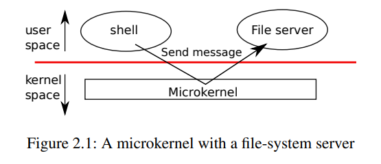
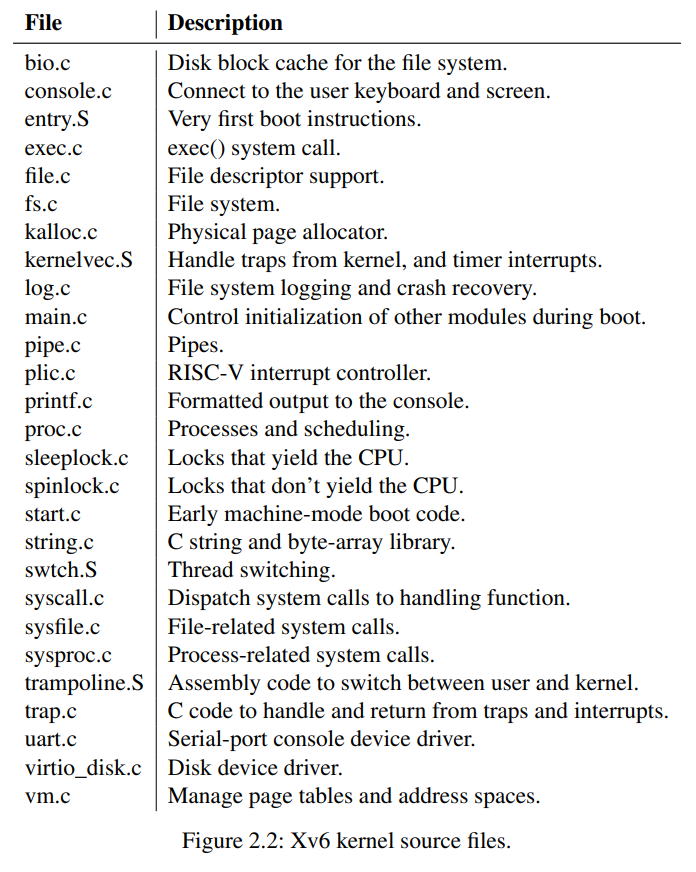
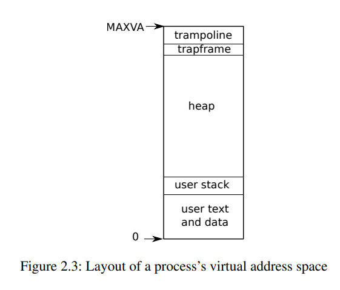

# LEC 2 (TAs/dm): C and gdb (pointers example)

目录：

<!-- @import "[TOC]" {cmd="toc" depthFrom=2 depthTo=2 orderedList=false} -->

<!-- code_chunk_output -->

- [C 的读书笔记](#c-的读书笔记)
- [Using the GNU Debugger](#using-the-gnu-debugger)
- [读书： Chapter 2 Operating system organization](#读书-chapter-2-operating-system-organization)

<!-- /code_chunk_output -->

细分目录：

<!-- @import "[TOC]" {cmd="toc" depthFrom=2 depthTo=6 orderedList=false} -->

<!-- code_chunk_output -->

- [C 的读书笔记](#c-的读书笔记)
  - [C 中的内存：静态、堆、栈](#c-中的内存静态-堆-栈)
  - [永远不要 include .c 文件](#永远不要-include-c-文件)
- [Using the GNU Debugger](#using-the-gnu-debugger)
- [读书： Chapter 2 Operating system organization](#读书-chapter-2-operating-system-organization)
  - [2.1 Abstracting physical resources](#21-abstracting-physical-resources)
  - [2.2 User mode, supervisor mode, and system calls （ ecall 是 RISC-V CPU 用于从用户态转为内核态的指令）](#22-user-mode-supervisor-mode-and-system-calls-ecall-是-risc-v-cpu-用于从用户态转为内核态的指令)
  - [2.3 Kernel organization](#23-kernel-organization)
  - [2.4 Code: xv6 organization](#24-code-xv6-organization)
  - [2.5 Process overview 进程与页表](#25-process-overview-进程与页表)
  - [2.6 Code: starting xv6 and the first process](#26-code-starting-xv6-and-the-first-process)
  - [2.7 Real world](#27-real-world)

<!-- /code_chunk_output -->

## C 的读书笔记

### C 中的内存：静态、堆、栈

这个道理咱都懂：
- static 内存，全局变量、 static 定义的变量
- stack 内存，在函数里的变量，函数结束了，就自动被销毁了
- heap 内存，由你来控制，比如 malloc() 和 free() ，很危险

来看一段错误的 C 程序：

```c
char* makeABC() {
  char y[3] = {'a', 'b', 'c'};
  return y;
}
```

这段 C 程序的错误，是因为我在函数里开了一个数组，相当于把 y 指向的内容开在了栈上，导致函数结束时被销毁了。

### 永远不要 include .c 文件

.h 中放声明， .c 中放定义，不再多说。

## Using the GNU Debugger

找了一个视频来入门：[Linux 使用gdb调试入门。](https://www.bilibili.com/video/BV1Kq4y1D7n2?p=1)

对于 C 而言，就是你在编译时 `gcc -g -o a.out` ，这个 `-g` 保留了用于 debug 的 Info 。然后你就可以 `gdb a.out` 了。

有很多很多命令：
```
b main 给 main 函数打断点
b /home/a.out:11 给第 11 行打断点
r 运行
n 不进函数体的单步执行
info b 查看断点
d 5 删除编号为 5 的断点
watch i 监控 i 变量的变化
info r 看寄存器的值
p i 查看变量 i 的值
p/x i 查看变量 i 的16进制
layout src 产生一个视窗（用Ctrl+x a退出）
layout asm 产生一个视窗看汇编
si 是汇编的步进
```

## 读书： Chapter 2 Operating system organization

### 2.1 Abstracting physical resources

应用间隔离但又要可以交互。

Thus an operating system must fulfill three requirements: multiplexing, isolation, and
interaction

RISC-V 是 64 位的 CPU ，用的 LP64 C ，即 Long 和 Pointers 都是 64 位的。

为了让应用之间隔离，我们把资源抽象成服务，而非直接让他们接触资源。

To achieve strong isolation it’s helpful to forbid applications from directly accessing sensitive hardware resources, and instead to abstract the resources into services.

比如用 open, read, write 和 close 来访问存储系统，而非让应用直接读进程。

抽象硬件有什么好处？让硬件对应用抽象由什么好处？如下，比如 exec 可以对进程建立自己的内存快照而非直接用物理内存。

As another example, Unix processes use exec to build up their memory image, instead of
directly interacting with physical memory. This allows the operating system to decide where to place a process in memory; if memory is tight, the operating system might even store some of a
process’s data on disk. Exec also provides users with the convenience of a file system to store executable program images.

应用间的交互一般用文件描述符。

Many forms of interaction among Unix processes occur via file descriptors.

### 2.2 User mode, supervisor mode, and system calls （ ecall 是 RISC-V CPU 用于从用户态转为内核态的指令）

隔离有啥用/啥是隔离？应用 A 出问题了（ fail ），别的应用应该还能继续跑。

RISC-V 有三个 CPU 指令级别来支持隔离：
- **machine mode** : a CPU starts in machine mode. Machine
mode is mostly intended for configuring a computer. Xv6 executes a few lines in machine mode
and then changes to supervisor mode.
- **supervisor mode** : CPU 可以执行特权指令，中断，读写存储页表地址的寄存器 In supervisor mode the CPU is allowed to execute privileged instructions: for example, enabling and disabling interrupts, reading and writing the register that holds the address of a page table, etc.
- **user mode** : 不能执行 a privileged instruction ，除非切换为内核态（ in supervisor mode / in supervisor mode ）

**ecall 是 RISC-V CPU 用于从用户态转为内核态的指令。**

An application that wants to invoke a kernel function (e.g., the read system call in xv6) must mtransition to the kernel. CPUs provide a special instruction that switches the CPU from user mode to supervisor mode and enters the kernel at an entry point specified by the kernel. (RISC-V provides the ecall instruction for this purpose.) 

ecall 后在内核态，内核对系统调用的参数等进行检验，决定是否让应用执行操作。**（什么是内核？ The software running in kernel space (or in upervisor mode) is called the kernel. ）**

### 2.3 Kernel organization

操作系统的哪些部分应该属于内核态呢？有两种思路：
- **monolithic kernel** 整个操作系统都有完整的硬件特权，好处是操作系统的各个部分更加易于合作，比如 an operating system might have a buffer cache that can be shared both by the file system and the virtual memory system. **Unix 用的是这种内核组织，这里 xv6 也是** ，坏处是，内核容易出问题，一旦出问题，整个机器就得重启
- **microkernel** 微内核，即将尽量少的 OS 操作放在 supervisor mode ，如下图， the file system runs as a user-level process. OS services running as processes are called servers. **To allow applications to interact with the file server, the kernel provides an inter-process communication mechanism to send messages from one user-mode process to another.** For example, if an application like the shell wants to read or write a file, it sends a message to the file server and waits for a response.



### 2.4 Code: xv6 organization

看看 kernel 文件夹中有啥：



模块间的接口 the inter-module interfaces 在 defs.h 。

```c
struct buf;
struct context;
struct file;
struct inode;
struct pipe;
struct proc;
struct spinlock;
struct sleeplock;
struct stat;
struct superblock;

// bio.c
void            binit(void);
struct buf*     bread(uint, uint);
void            brelse(struct buf*);
void            bwrite(struct buf*);
void            bpin(struct buf*);
void            bunpin(struct buf*);

// console.c
void            consoleinit(void);
void            consoleintr(int);
void            consputc(int);

// exec.c
int             exec(char*, char**);

// file.c
struct file*    filealloc(void);
void            fileclose(struct file*);
struct file*    filedup(struct file*);
void            fileinit(void);
int             fileread(struct file*, uint64, int n);
int             filestat(struct file*, uint64 addr);
int             filewrite(struct file*, uint64, int n);

...
```

### 2.5 Process overview 进程与页表

**一个单独的隔离就是进程。 The unit of isolation in xv6 (as in other Unix operating systems) is a process.**

一个进程有私有的内存系统/地址空间，进程也保证了程序“专属”的 CPU 来执行指令（?）

A process provides a program with what appears to be a private memory system, or address space, which other processes cannot read or write. A process also provides the program with what appears to be its own CPU to execute the program’s instructions.

**Xv6 基于页表 page tables （已经被硬件实现）来给各个进程独立的地址空间。**

RISC-V 指令操作的实际上也是虚拟地址 virtual address ，这个虚拟地址具体是什么 physical address 由 RISC-V 映射。 The RISC-V page table translates (or “maps”) a virtual address (the address that an RISC-V instruction manipulates) to a physical address (an address that the CPU chip sends to main memory).

一个进程的虚拟地址空间如下。



注意这里的 user stack 应该和 Intel x86 不太一样， Intel 的 x86 是从高地址到低地址，并且再往下才是 heap 。

你能在 `kernel/riscv.h:348` 里面看见最高地址的定义：

```c
// one beyond the highest possible virtual address.
// MAXVA is actually one bit less than the max allowed by
// Sv39, to avoid having to sign-extend virtual addresses
// that have the high bit set.
#define MAXVA (1L << (9 + 9 + 9 + 12 - 1))
```

最顶部 trampoline 用于页表映射，这里不详细展开。

如下是用于描述进程的结构。

```c
enum procstate { UNUSED, USED, SLEEPING, RUNNABLE, RUNNING, ZOMBIE };

// Per-process state
struct proc {
  struct spinlock lock;

  // p->lock must be held when using these:
  enum procstate state;        // Process state
  void *chan;                  // If non-zero, sleeping on chan
  int killed;                  // If non-zero, have been killed
  int xstate;                  // Exit status to be returned to parent's wait
  int pid;                     // Process ID

  // wait_lock must be held when using this:
  struct proc *parent;         // Parent process

  // these are private to the process, so p->lock need not be held.
  uint64 kstack;               // Virtual address of kernel stack
  uint64 sz;                   // Size of process memory (bytes)
  pagetable_t pagetable;       // User page table
  struct trapframe *trapframe; // data page for trampoline.S
  struct context context;      // swtch() here to run process
  struct file *ofile[NOFILE];  // Open files
  struct inode *cwd;           // Current directory
  char name[16];               // Process name (debugging)
};
```

每个进程都有一个执行的线程（？并不是编程中的“线程”）： a thread of execution (or thread for short) ，用于执行进程的指令。

线程可以被暂停与继续。切换进程就是通过暂停与继续线程。线程的状态就被存在 thread's stacks 中。 **Much of the state of a thread (local variables, function call return addresses) is stored on the thread’s stacks.**

每个进程都有两个栈： user stack 和 kernel stack (`p->kstack`) 。

执行用户指令时， kernel stack 是空的；通过系统调用或者中断切换到内核态时， user stack 还保存着数据。

进程的线程交替使用这两种 stack 。 A process’s thread alternates between actively using its user stack and its kernel stack.The kernel stack is separate and protected from user code) so that the kernel can execute even if a process has wrecked its user stack.

如何切换呢？使用 ecall 和 sret 两个指令。

A process can make a system call by executing the RISC-V ecall instruction. This instruction mraises the hardware privilege level and changes the program counter to a kernel-defined entry point. The code at the entry point switches to a kernel stack and executes the kernel instructions that implement the system call. When the system call completes, the kernel switches back to the user stack and returns to user space by calling the sret instruction, which lowers the hardware privilege level and resumes executing user instructions just after the system call instruction. A process’s thread can “block” in the kernel to wait for I/O, and resume where it left off when the I/O has finished.

### 2.6 Code: starting xv6 and the first process

xv6 内核如何启动？如何执行第一个进程？

通电后， a boot loader which is stored in read-only memory 跑起来了。这个 boot loader 把内核读入内存。然后在 machine mode 中， CPU 执行 kernel/entry.S 的 _entry 。此时，页表硬件是不可用的，虚地址就是物理地址。

如下是 kernel/entry.S 。

```S
	# qemu -kernel loads the kernel at 0x80000000
        # and causes each CPU to jump there.
        # kernel.ld causes the following code to
        # be placed at 0x80000000.
.section .text
.global _entry
_entry:
	# set up a stack for C.
        # stack0 is declared in start.c,
        # with a 4096-byte stack per CPU.
        # sp = stack0 + (hartid * 4096)
        la sp, stack0
        li a0, 1024*4
	csrr a1, mhartid
        addi a1, a1, 1
        mul a0, a0, a1
        add sp, sp, a0
	# jump to start() in start.c
        call start
spin:
        j spin
```

为什么把 xv6 kernel 存入物理地址 0x80000000 而非 0x0 ？因为 0x0:0x80000000 包含了 I/O 设备。

_entry 中的指令建了一个 stack ，由此 xv6 可以执行 C 代码。这里， sp 指向栈顶。执行的 C 代码时 kernel/start.c ：

```c
#include "types.h"
#include "param.h"
#include "memlayout.h"
#include "riscv.h"
#include "defs.h"

void main();
void timerinit();

// entry.S needs one stack per CPU.
__attribute__ ((aligned (16))) char stack0[4096 * NCPU];

// a scratch area per CPU for machine-mode timer interrupts.
uint64 timer_scratch[NCPU][5];

// assembly code in kernelvec.S for machine-mode timer interrupt.
extern void timervec();

// entry.S jumps here in machine mode on stack0.
void
start()
{
  // set M Previous Privilege mode to Supervisor, for mret.
  unsigned long x = r_mstatus();
  x &= ~MSTATUS_MPP_MASK;
  x |= MSTATUS_MPP_S;
  w_mstatus(x);

  // set M Exception Program Counter to main, for mret.
  // requires gcc -mcmodel=medany
  w_mepc((uint64)main);

  // disable paging for now.
  w_satp(0);

  // delegate all interrupts and exceptions to supervisor mode.
  w_medeleg(0xffff);
  w_mideleg(0xffff);
  w_sie(r_sie() | SIE_SEIE | SIE_STIE | SIE_SSIE);

  // configure Physical Memory Protection to give supervisor mode
  // access to all of physical memory.
  w_pmpaddr0(0x3fffffffffffffull);
  w_pmpcfg0(0xf);

  // ask for clock interrupts.
  timerinit();

  // keep each CPU's hartid in its tp register, for cpuid().
  int id = r_mhartid();
  w_tp(id);

  // switch to supervisor mode and jump to main().
  asm volatile("mret");
}

// set up to receive timer interrupts in machine mode,
// which arrive at timervec in kernelvec.S,
// which turns them into software interrupts for
// devintr() in trap.c.
void
timerinit()
{
  // each CPU has a separate source of timer interrupts.
  int id = r_mhartid();

  // ask the CLINT for a timer interrupt.
  int interval = 1000000; // cycles; about 1/10th second in qemu.
  *(uint64*)CLINT_MTIMECMP(id) = *(uint64*)CLINT_MTIME + interval;

  // prepare information in scratch[] for timervec.
  // scratch[0..2] : space for timervec to save registers.
  // scratch[3] : address of CLINT MTIMECMP register.
  // scratch[4] : desired interval (in cycles) between timer interrupts.
  uint64 *scratch = &timer_scratch[id][0];
  scratch[3] = CLINT_MTIMECMP(id);
  scratch[4] = interval;
  w_mscratch((uint64)scratch);

  // set the machine-mode trap handler.
  w_mtvec((uint64)timervec);

  // enable machine-mode interrupts.
  w_mstatus(r_mstatus() | MSTATUS_MIE);

  // enable machine-mode timer interrupts.
  w_mie(r_mie() | MIE_MTIE);
}
```


### 2.7 Real world

微内核用在嵌入式多一点。

现代操作系统一个进程可以有多个线程，跑在多个 CPU 上。比如 Linux's clone （一种 fork 的变种）就可以帮助做到这点。