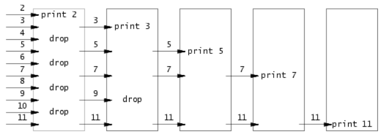
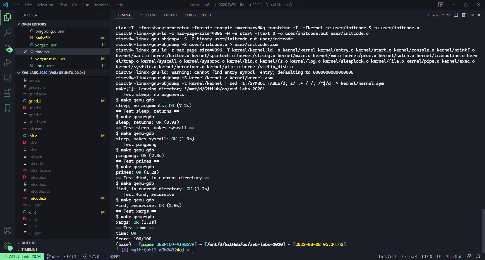

# LEC 1 (rtm): Introduction and examples

本节作业：
- https://github.com/PiperLiu/xv6-labs-2020/tree/util

目录：

<!-- @import "[TOC]" {cmd="toc" depthFrom=2 depthTo=2 orderedList=false} -->

<!-- code_chunk_output -->

- [阅读echo、grep和rm](#阅读echo-grep和rm)
- [阅读 sleep](#阅读-sleep)
- [pingpong](#pingpong)
- [利用管道和进程求素数 primes](#利用管道和进程求素数-primes)
- [find 实现：递归探索子目录](#find-实现递归探索子目录)
- [实现 xargs （从标准输入读入一行数据送给子进程）](#实现-xargs-从标准输入读入一行数据送给子进程)

<!-- /code_chunk_output -->

细分目录：

<!-- @import "[TOC]" {cmd="toc" depthFrom=2 depthTo=6 orderedList=false} -->

<!-- code_chunk_output -->

- [阅读echo、grep和rm](#阅读echo-grep和rm)
  - [echo.c](#echoc)
    - [插播：argc和argv](#插播argc和argv)
  - [grep.c](#grepc)
  - [user/rm.c](#userrmc)
- [阅读 sleep](#阅读-sleep)
  - [kernel/sysproc.c](#kernelsysprocc)
  - [user/user.h](#useruserh)
  - [user/usys.S](#userusyss)
  - [实现sleep.c](#实现sleepc)
- [pingpong](#pingpong)
- [利用管道和进程求素数 primes](#利用管道和进程求素数-primes)
- [find 实现：递归探索子目录](#find-实现递归探索子目录)
- [实现 xargs （从标准输入读入一行数据送给子进程）](#实现-xargs-从标准输入读入一行数据送给子进程)

<!-- /code_chunk_output -->

## 阅读echo、grep和rm

学习如何从命令行获取参数。

### echo.c

user/echo.c

```c
#include "kernel/types.h"
#include "kernel/stat.h"
#include "user/user.h"

int
main(int argc, char *argv[])
{
  int i;

  for(i = 1; i < argc; i++){
    write(1, argv[i], strlen(argv[i]));
    if(i + 1 < argc){
      write(1, " ", 1);
    } else {
      write(1, "\n", 1);
    }
  }
  exit(0);
}
```

#### 插播：argc和argv

关于 c 语言的 `argc` 和 `argv` ，有一篇回答很好：[What does int argc, char *argv[] mean?](https://stackoverflow.com/questions/3024197/what-does-int-argc-char-argv-mean)

```c
#include <iostream>

int main(int argc, char** argv) {
    std::cout << "Have " << argc << " arguments:" << std::endl;
    for (int i = 0; i < argc; ++i) {
        std::cout << argv[i] << std::endl;
    }
}
```

```bash
$ ./test a1 b2 c3
Have 4 arguments:
./test
a1
b2
c3
```

- `argc` 是参数数量加一
- `argv` 是字符串数组，包含可执行文件名

### grep.c

user/grep.c

```c
// Simple grep.  Only supports ^ . * $ operators.

#include "kernel/types.h"
#include "kernel/stat.h"
#include "user/user.h"

char buf[1024];
int match(char*, char*);

void
grep(char *pattern, int fd)
{
  int n, m;
  char *p, *q;

  m = 0;
  while((n = read(fd, buf+m, sizeof(buf)-m-1)) > 0){
    m += n;
    buf[m] = '\0';
    p = buf;
    while((q = strchr(p, '\n')) != 0){
      *q = 0;
      if(match(pattern, p)){
        *q = '\n';
        write(1, p, q+1 - p);  // 如果匹配了，输出以及回车
      }
      p = q+1;  // 否则看之后的一行是否匹配，p 指向下一行行首
    }
    if(m > 0){
      m -= p - buf;
      memmove(buf, p, m);
    }
  }
}

int
main(int argc, char *argv[])
{
  int fd, i;
  char *pattern;

  if(argc <= 1){
    fprintf(2, "usage: grep pattern [file ...]\n");
    exit(1);
  }
  pattern = argv[1];

  if(argc <= 2){
    grep(pattern, 0);  // 没指定 file 就从标准输入获得
    exit(0);
  }

  for(i = 2; i < argc; i++){
    if((fd = open(argv[i], 0)) < 0){
      printf("grep: cannot open %s\n", argv[i]);
      exit(1);
    }
    grep(pattern, fd);
    close(fd);  // 用完就 close
  }
  exit(0);
}

// Regexp matcher from Kernighan & Pike,
// The Practice of Programming, Chapter 9.

int matchhere(char*, char*);
int matchstar(int, char*, char*);

int
match(char *re, char *text)
{
  if(re[0] == '^')
    return matchhere(re+1, text);
  do{  // must look at empty string
    if(matchhere(re, text))
      return 1;
  }while(*text++ != '\0');
  return 0;
}

// matchhere: search for re at beginning of text
int matchhere(char *re, char *text)
{
  if(re[0] == '\0')
    return 1;
  if(re[1] == '*')
    return matchstar(re[0], re+2, text);
  if(re[0] == '$' && re[1] == '\0')
    return *text == '\0';
  if(*text!='\0' && (re[0]=='.' || re[0]==*text))
    return matchhere(re+1, text+1);
  return 0;
}

// matchstar: search for c*re at beginning of text
int matchstar(int c, char *re, char *text)
{
  do{  // a * matches zero or more instances
    if(matchhere(re, text))
      return 1;
  }while(*text!='\0' && (*text++==c || c=='.'));
  return 0;
}
```

### user/rm.c

```c
#include "kernel/types.h"
#include "kernel/stat.h"
#include "user/user.h"

int
main(int argc, char *argv[])
{
  int i;

  if(argc < 2){
    fprintf(2, "Usage: rm files...\n");
    exit(1);
  }

  for(i = 1; i < argc; i++){
    if(unlink(argv[i]) < 0){
      fprintf(2, "rm: %s failed to delete\n", argv[i]);
      break;
    }
  }

  exit(0);
}
```

原来 `rm` 是用 `unlink` 做的？

## 阅读 sleep

See `kernel/sysproc.c` for the xv6 kernel code that implements the sleep system call (look for `sys_sleep`), `user/user.h` for the C definition of sleep callable from a user program, and `user/usys.S` for the assembler code that jumps from user code into the kernel for sleep.

### kernel/sysproc.c

```c
uint64
sys_sleep(void)
{
  int n;
  uint ticks0;

  if(argint(0, &n) < 0)
    return -1;
  acquire(&tickslock);
  ticks0 = ticks;
  while(ticks - ticks0 < n){
    if(myproc()->killed){  // 因为某些原因本进程中断
      release(&tickslock);
      return -1;
    }
    sleep(&ticks, &tickslock);
  }
  release(&tickslock);
  return 0;
}
```

看起来像是一个锁，并且 `sleep(&ticks, &tickslock)` 是用来改变 `ticks` 这些信息的。

### user/user.h

```c
int sleep(int);
```

### user/usys.S

`usys.S` 是 `usys.pl` 生成的，得 `make qemu` 才能看到。

```S
# generated by usys.pl - do not edit
#include "kernel/syscall.h"
...
.global sleep
sleep:
 li a7, SYS_sleep  # 将 SYS_sleep 的低 6 位取出写入到 a7 中
 ecall             # Environment Call
 ret
...
```

### 实现sleep.c

```c
#include "kernel/types.h"
#include "user/user.h"

int
main(int argc, char *argv[])
{
  if (argc < 2){
    fprintf(2, "Usage: sleep TIME\n");
    exit(1);
  }

  sleep(atoi(argv[1]));

  exit(0);
}
```

**Make sure main calls exit() in order to exit your program.**

注意别 `return` ，我们要的是退出进程，而非返回到父进程。

## pingpong

```cpp
#include "kernel/types.h"
#include "user/user.h"

int
main(int argc, char *argv[])
{
  int p0[2], p1[2];
  char buf[1] = "0";

  pipe(p0);
  pipe(p1);

  if (fork() == 0){  // 子进程
    close(p1[0]);
    close(p0[1]);
    read(p0[0], buf, 1); // 2 // p0 读端，放到 buf 里一个字节
    printf("%d: received ping\n", getpid());
    write(p1[1], buf, 1); // 3 // p1 写端，写给 p1 写端
    close(p1[1]);
    close(p0[0]);
  } else {
    close(p0[0]);
    close(p1[1]);
    write(p0[1], buf, 1);  // 1
    read(p1[0], buf, 1);  // 4
    printf("%d: received pong\n", getpid());
    wait(0);
    close(p0[1]);
    close(p1[0]);
  }

  exit(0);
}
```

## 利用管道和进程求素数 primes

- Be careful to close file descriptors that a process doesn't need, because otherwise your program will run xv6 out of resources before the first process reaches 35.
- Once the first process reaches 35, it should wait until the entire pipeline terminates, including all children, grandchildren, &c. Thus the main primes process should only exit after all the output has been printed, and after all the other primes processes have exited.
- **Hint: read returns zero when the write-side of a pipe is closed.**
- It's simplest to directly write 32-bit (4-byte) ints to the pipes, rather than using formatted ASCII I/O.
- You should create the processes in the pipeline only as they are needed.
- Add the program to UPROGS in Makefile.



```cpp
#include "kernel/types.h"
#include "user/user.h"

#define RD 0
#define WR 1

const int INT_LEN = sizeof(int);

/**
 * 输入一个管道，将第一个数打印
 * 其他数是第一个数的倍数，过滤；
 * 否者传入管道，给子进程
 */
void get_prime(int*);

int
main(int argc, char *argv[])
{
    /**
     * 在 main 里简历一个发射器，把 2 到 35 发射到第一个管道
     * 并且创建一个子进程接手、筛选、发射管道的数据
     * 下一个管道由子子进程接收
     */
    int p0[2];
    pipe(p0);
    for (int i = 2; i <= 35; ++ i)
        write(p0[WR], &i, INT_LEN);

    if (fork() == 0)
        get_prime(p0);  // 子进程活动管道

    // 不要在子进程建立起来前就把 p0[RD] 给关了
    close(p0[RD]);
    close(p0[WR]);
    wait(0);  // 等待子进程结束

    return 0;
}

void get_prime(int* p0)
{
    // 在这个进程里，把 p0 的写端关闭
    close(p0[WR]);
    // 新建管道，连接自己与子进程
    int p1[2];
    pipe(p1);

    int prime_number;
    if (read(p0[RD], &prime_number, INT_LEN) > 0)
    {
        // 如果 p0 的读端可以读到至少一个数的话
        // 那么就打印第一个数、过滤这个数的倍数、写入管道其他数
        printf("prime %d\n", prime_number);

        // 写入管道
        int tmp;
        while (read(p0[RD], &tmp, INT_LEN) > 0)
            if (tmp % prime_number != 0)  // 过滤
                write(p1[WR], &tmp, INT_LEN);

        if (fork() == 0)
            get_prime(p1);  // 子进程调用函数 prime
        
        close(p0[RD]);
        close(p1[WR]);
        close(p1[RD]);
        wait(0);
        exit(0);
    }
    else
    {   // 如果 p0 根本没有数可读，对应 print 35 的下一个进程
        close(p1[WR]);
        close(p1[RD]);
        exit(0);
    }
}
```

## find 实现：递归探索子目录

- Look at user/ls.c to see how to read directories.
- Use recursion to allow find to descend into sub-directories.
- Don't recurse into "." and "..".
- Changes to the file system persist across runs of qemu; to get a clean file system run make clean and then make qemu.
- You'll need to use C strings. Have a look at K\&R (the C book), for example Section 5.5.
- Note that `==` does not compare strings like in Python. Use strcmp() instead.
- Add the program to UPROGS in Makefile.

使用示例：

```bash
$ make qemu
...
init: starting sh
$ echo > b
$ mkdir a
$ echo > a/b
$ find . b
./b
./a/b
$ 
```

ls 的定义如下：

```c
#include "kernel/types.h"
#include "kernel/stat.h"
#include "user/user.h"
#include "kernel/fs.h"

char*
fmtname(char *path)  // 让文件名字后面的空格补位
{
  static char buf[DIRSIZ+1];
  char *p;

  // Find first character after last slash.
  for(p=path+strlen(path); p >= path && *p != '/'; p--)
    ;
  p++;

  // Return blank-padded name.
  if(strlen(p) >= DIRSIZ)
    return p;
  memmove(buf, p, strlen(p));  // 把 p 复制到 buf
  memset(buf+strlen(p), ' ', DIRSIZ-strlen(p));  // 之后补空格
  return buf;
}

void
ls(char *path)
{
  char buf[512], *p;
  int fd;
  struct dirent de;
  struct stat st;

  if((fd = open(path, 0)) < 0){
    fprintf(2, "ls: cannot open %s\n", path);
    return;
  }

  if(fstat(fd, &st) < 0){  // fstat 系统调用，将 fd 所指文件信息复制到 st 种
    fprintf(2, "ls: cannot stat %s\n", path);
    close(fd);
    return;
  }

  switch(st.type){
  case T_FILE:
    printf("%s %d %d %l\n", fmtname(path), st.type, st.ino, st.size);
    break;

  case T_DIR:
    if(strlen(path) + 1 + DIRSIZ + 1 > sizeof buf){
      printf("ls: path too long\n");
      break;
    }
    strcpy(buf, path);
    p = buf+strlen(buf);
    *p++ = '/';  // 如果 fd 是个 DIR ，则去读 fd ，直到读不出东西为止
    while(read(fd, &de, sizeof(de)) == sizeof(de)){
      if(de.inum == 0)
        continue;
      memmove(p, de.name, DIRSIZ);
      p[DIRSIZ] = 0;
      if(stat(buf, &st) < 0){
        printf("ls: cannot stat %s\n", buf);
        continue;
      }
      printf("%s %d %d %d\n", fmtname(buf), st.type, st.ino, st.size);
    }
    break;
  }
  close(fd);
}

int
main(int argc, char *argv[])
{
  int i;

  if(argc < 2){
    ls(".");
    exit(0);
  }
  for(i=1; i<argc; i++)
    ls(argv[i]);
  exit(0);
}
```

我写好了，如下：

```c
#include "kernel/types.h"
#include "kernel/stat.h"
#include "user/user.h"
#include "kernel/fs.h"

void
find(char *path, char *exper)
{
  char buf[512], *p;
  int fd;
  struct dirent de;
  struct stat st;

  if((fd = open(path, 0)) < 0){
    fprintf(2, "ls: cannot open %s\n", path);
    return;
  }

  if(fstat(fd, &st) < 0){
    fprintf(2, "ls: cannot stat %s\n", path);
    close(fd);
    return;
  }

  // path 不是目录
  if (st.type != T_DIR) {
    printf("Usage: find: <path> <expression [, exper1, exper2, ...]>\n");
    exit(1);
  }

  if(strlen(path) + 1 + DIRSIZ + 1 > sizeof buf){
      printf("ls: path too long\n");
  }
  strcpy(buf, path);
  p = buf+strlen(buf);  // buf 是当前路径
  *p++ = '/';  // 这里给 buf 结尾加上 /
  while(read(fd, &de, sizeof(de)) == sizeof(de)){
    if(de.inum == 0)
      continue;
    memmove(p, de.name, DIRSIZ);  // 把当前找到的文件名记录到 p （追加到 buf 后）
    p[DIRSIZ] = 0;  // 终止符 0
    if(stat(buf, &st) < 0){
      printf("ls: cannot stat %s\n", buf);
      continue;
    }
    // strcmp(a, b) 在 a == b 时返回 0
    if (st.type == T_DIR && strcmp(p, ".") && strcmp(p, ".."))
      find(buf, exper);  // buf 为文件夹，且不为 . / .. 时才递归
    else if (strcmp(p, exper) == 0)
      printf("%s\n", buf);
  }

  close(fd);
}

int
main(int argc, char *argv[])
{
  int i;

  if(argc < 3){
    printf("Usage: find: <path> <expression [, exper1, exper2, ...]>\n");
    exit(1);
  }
  for(i=2; i<argc; i++)
    find(argv[1], argv[i]);
  exit(0);
}
```

其实都不用怎么改动 ls 。

## 实现 xargs （从标准输入读入一行数据送给子进程）

- Use fork and exec to invoke the command on each line of input. Use wait in the parent to wait for the child to complete the command.
- To read individual lines of input, read a character at a time until a newline ('\n') appears.
- kernel/param.h declares MAXARG, which may be useful if you need to declare an argv array.
- Add the program to UPROGS in Makefile.
- Changes to the file system persist across runs of qemu; to get a clean file system run make clean and then make qemu.

对于 UNIX ，我们想要取得的效果如同在 UNIX 调用 `-n 1` 参数。

```bash
$ echo "1\n2" | xargs -n 1 echo line
line 1
line 2
$
```

头脑里指针要搞懂。有点算法题那意思了：

```c
#include "kernel/types.h"
#include "kernel/param.h"
#include "user/user.h"

int main(int argc, char *argv[]) {
    if (argc - 1 >= MAXARG)  // 参数过多
    {
        // fprintf 输出到标准错误 2 中
        fprintf(2, "xargs: too many arguments\n");
        exit(1);
    }

    // 用于 exec(cmd, cmd_argv)
    char *cmd_argv[MAXARG];
    char *cmd = argv[1];
    
    int cmd_argc;
    for (cmd_argc = 1; cmd_argc < argc; ++ cmd_argc)
        cmd_argv[cmd_argc - 1] = argv[cmd_argc];

    // 现在从标准输入中一行一行地获取，把这一行贴到 cmd_argv 后面
    // 获取完一行（遇到 \n 或者标准输入没啥可读地了）
    // 就执行 exec
    while (1)
    {
        int cmd_argv_back = cmd_argc - 1;
        char line[512];  // 用于把本行参数贴到 cmd 后
        char *line_head, *line_last;

        line_head = line;
        line_last = line;

        // 开始从标准输入尝试读取一行
        // 如果读了一下发现没有东西可读，则退出（执行结束）
        if (read(0, line_last, sizeof(char)) != sizeof(char))
            exit(1);
        
        // 否则，接着读，直到读到 \n 或者没有可读
        line_last ++ ;
        while (read(0, line_last, sizeof(char)) == sizeof(char))
        {
            // 遇到空格，将当前 line 到 line_last 区间记入 cmd_argv
            if (*line_last == ' ' || *line_last == '\n')
            {
                *line_last = 0;
                cmd_argv[cmd_argv_back ++] = line_head;
                line_head = line_last + 1;
            }
            if (line_last - line >= 512)
            {
                fprintf(2, "xargs: too long argument\n");
                exit(1);
            }
            if (cmd_argv_back >= MAXARG)
            {
                fprintf(2, "xargs: too many arguments\n");
                exit(1);
            }
            // 如果本行读完
            if (*line_last == '\n')
                break;
            ++ line_last;  // 下一个区域待读
        }

        if (fork() == 0)  // 子进程执行
        {
            // printf("执行 %s\n", cmd);
            // printf("到底是不是子进程递归执行的：%d\n", getpid());
            exec(cmd, cmd_argv);
        }

        memset(cmd_argv, 0, sizeof(cmd_argv) - cmd_argc);

        wait(0);  // 等待子进程执行完毕（子进程负责读下一行）
    }

    exit(0);
}
```


