# LEC 3 (fk): OS organization and system calls

笔记大量参考了[肖宏辉](https://www.zhihu.com/people/xiao-hong-hui-15)大佬的翻译。

目录：

<!-- @import "[TOC]" {cmd="toc" depthFrom=2 depthTo=2 orderedList=false} -->

<!-- code_chunk_output -->

- [Isolation / Kernel mode / User mode / System calls](#isolation-kernel-mode-user-mode-system-calls)
- [硬件对于强隔离的支持](#硬件对于强隔离的支持)
- [宏内核 vs 微内核 （Monolithic Kernel vs Micro Kernel）](#宏内核-vs-微内核-monolithic-kernel-vs-micro-kernel)
- [编译运行kernel](#编译运行kernel)

<!-- /code_chunk_output -->

细分目录：

<!-- @import "[TOC]" {cmd="toc" depthFrom=2 depthTo=6 orderedList=false} -->

<!-- code_chunk_output -->

- [Isolation / Kernel mode / User mode / System calls](#isolation-kernel-mode-user-mode-system-calls)
  - [exec 抽象了内存](#exec-抽象了内存)
  - [操作系统防御性（Defensive）](#操作系统防御性defensive)
- [硬件对于强隔离的支持](#硬件对于强隔离的支持)
  - [user/kernle mode](#userkernle-mode)
  - [page table 来制造应用间隔离](#page-table-来制造应用间隔离)
  - [Kernel Mode 和 User Mode 切换](#kernel-mode-和-user-mode-切换)
- [宏内核 vs 微内核 （Monolithic Kernel vs Micro Kernel）](#宏内核-vs-微内核-monolithic-kernel-vs-micro-kernel)
- [编译运行kernel](#编译运行kernel)
  - [插曲：正确使用 gdb](#插曲正确使用-gdb)
  - [代码结构](#代码结构)
  - [简单介绍内核如何编译的](#简单介绍内核如何编译的)
  - [QEMU](#qemu)
  - [XV6启动过程（配合 gdb 实践）](#xv6启动过程配合-gdb-实践)

<!-- /code_chunk_output -->

## Isolation / Kernel mode / User mode / System calls

与预习时书中的结构基本一致。

### exec 抽象了内存

我们可以认为 `exec` 抽象了内存。当我们在执行 `exec` 系统调用的时候，我们会传入一个文件名，而这个文件名对应了一个应用程序的内存镜像。

内存镜像里面包括了程序对应的指令，全局的数据。 **应用程序可以逐渐扩展自己的内存，但是应用程序并没有直接访问物理内存的权限** ，例如应用程序不能直接访问物理内存的`1000-2000`这段地址。不能直接访问的原因是，操作系统会提供内存隔离并控制内存，操作系统会在应用程序和硬件资源之间提供一个中间层。 `exec` 是这样一种系统调用，它表明了应用程序不能直接访问物理内存。

学生提问：好的，但是多个进程不能在同一时间使用同一个CPU核，对吧？

Frans教授：是的，这里是分时复用。CPU运行一个进程一段时间，再运行另一个进程。

学生提问：更复杂的内核会不会尝试将进程调度到同一个CPU核上来减少 Cache Miss ？

Frans教授：是的。有一种东西叫做 Cache affinity 。现在的操作系统的确非常复杂，并且会尽量避免 Cache miss 和类似的事情来提升性能。我们在这门课程后面介绍高性能网络的时候会介绍更多相关的内容。

学生提问：XV6的代码中，哪一部分可以看到操作系统为多个进程复用了CPU？

Frans教授：有挺多文件与这个相关，但是 proc.c 应该是最相关的一个。两三周之后的课程中会有一个话题介绍这个内容。我们会看大量的细节，并展示操作系统的 multiplexing 是如何发生的。所以可以这么看待这节课，这节课的内容是对许多不同内容的初始介绍，因为我们总得从某个地方开始吧。

### 操作系统防御性（Defensive）

操作系统需要让：
- application cannot crash the OS
- application cannot break out os isolation

通常来说，需要通过硬件来实现这的强隔离性。我们这节课会简单介绍一些硬件隔离的内容，但是在后续的课程我们会介绍的更加详细。这里的硬件支持包括了两部分，第一部分是user/kernel mode，kernel mode在RISC-V中被称为Supervisor mode但是其实是同一个东西；第二部分是page table或者虚拟内存（Virtual Memory）。

所以，所有的处理器，如果需要运行能够支持多个应用程序的操作系统，需要同时支持user/kernle mode和虚拟内存。具体的实现或许会有细微的差别，但是基本上来说所有的处理器需要能支持这些。我们在这门课中使用的RISC-V处理器就支持了这些功能。

## 硬件对于强隔离的支持

硬件对于强隔离的支持包括了：user/kernle mode和虚拟内存。

这里会以尽可能全局的视角来介绍，有很多重要的细节在这节课中都不会涉及。

### user/kernle mode

为了支持user/kernel mode，处理器会有两种操作模式，第一种是user mode，第二种是kernel mode。当运行在kernel mode时，CPU可以运行特定权限的指令（privileged instructions）；当运行在user mode时，CPU只能运行普通权限的指令（unprivileged instructions）。

普通权限的指令都是一些你们熟悉的指令，例如将两个寄存器相加的指令ADD、将两个寄存器相减的指令SUB、跳转指令JRC、BRANCH指令等等。这些都是普通权限指令，所有的应用程序都允许执行这些指令。

**特殊权限指令主要是一些直接操纵硬件的指令和设置保护的指令，例如设置page table寄存器、关闭时钟中断。** 在处理器上有各种各样的状态，操作系统会使用这些状态，但是只能通过特殊权限指令来变更这些状态。

学生提问：如果kernel mode允许一些指令的执行，user mode不允许一些指令的执行，那么是谁在检查当前的mode并实际运行这些指令，并且怎么知道当前是不是kernel mode？是有什么标志位吗？

Frans教授：是的，在处理器里面有一个flag。在处理器的一个bit，当它为1的时候是user mode，当它为0时是kernel mode。当处理器在解析指令时，如果指令是特殊权限指令，并且该bit被设置为1，处理器会拒绝执行这条指令，就像在运算时不能除以0一样。

同一个学生继续问：所以，唯一的控制方式就是通过某种方式更新了那个bit？

Frans教授：你认为是什么指令更新了那个bit位？是特殊权限指令还是普通权限指令？很明显，设置那个bit位的指令必须是特殊权限指令，因为应用程序不应该能够设置那个bit到kernel mode，否则的话应用程序就可以运行各种特殊权限指令了。所以那个bit是被保护的，这样回答了你的问题吗？

学生提问：考虑到安全性，所有的用户代码都会通过内核访问硬件，但是有没有可能一个计算机的用户可以随意的操纵内核？

Frans教授：并不会，至少小心的设计就不会发生这种事。或许一些程序会有额外的权限，操作系统也会认可这一点。但是这些额外的权限并不会给每一个用户，比如只有root用户有特定的权限来完成安全相关的操作。

同一个学生提问：那BIOS呢？BIOS会在操作系统之前运行还是之后？

Frans教授： **BIOS是一段计算机自带的代码，它会先启动，之后它会启动操作系统，所以BIOS需要是一段可被信任的代码，它最好是正确的，且不是恶意的。**

学生提问：之前提到，设置处理器中kernel mode的bit位的指令是一条特殊权限指令，那么一个用户程序怎么才能让内核执行任何内核指令？因为现在切换到kernel mode的指令都是一条特殊权限指令了，对于用户程序来说也没法修改那个bit位。

Frans教授：你说的对，这也是我们想要看到的结果。可以这么来看这个问题，首先这里不是完全按照你说的方式工作， **在RISC-V中，如果你在用户空间（user space）尝试执行一条特殊权限指令用户程序会通过系统调用来切换到kernel mode。当用户程序执行系统调用，会通过ECALL触发一个软中断（software interrupt），软中断会查询操作系统预先设定的中断向量表，并执行中断向量表中包含的中断处理程序。中断处理程序在内核中，这样就完成了user mode到kernel mode的切换，并执行用户程序想要执行的特殊权限指令。**

### page table 来制造应用间隔离

每一个进程都会有自己独立的page table，这样的话，每一个进程只能访问出现在自己page table中的物理内存。操作系统会设置page table，使得每一个进程都有不重合的物理内存，这样一个进程就不能访问其他进程的物理内存，因为其他进程的物理内存都不在它的page table中。一个进程甚至都不能随意编造一个内存地址，然后通过这个内存地址来访问其他进程的物理内存。这样就给了我们内存的强隔离性。

比如现在有两个应用 ls 和 echo ， ls程序有了一个内存地址0，echo程序也有了一个内存地址0。但是操作系统会将两个程序的内存地址0映射到不同的物理内存地址，所以ls程序不能访问echo程序的内存，同样echo程序也不能访问ls程序的内存。

类似的，内核位于应用程序下方，假设是XV6，那么它也有自己的内存地址空间，并且与应用程序完全独立。

### Kernel Mode 和 User Mode 切换

需要有一种方式能够让应用程序可以将控制权转移给内核（Entering Kernel）。

在RISC-V中，有一个专门的指令用来实现这个功能，叫做ECALL。ECALL接收一个数字参数，当一个用户程序想要将程序执行的控制权转移到内核，它只需要执行ECALL指令，并传入一个数字。这里的数字参数代表了应用程序想要调用的System Call。

ECALL会跳转到内核中一个特定，由内核控制的位置。我们在这节课的最后可以看到在XV6中存在一个唯一的系统调用接入点，每一次应用程序执行ECALL指令，应用程序都会通过这个接入点进入到内核中。举个例子，不论是Shell还是其他的应用程序，当它在用户空间执行fork时，它并不是直接调用操作系统中对应的函数，而是调用ECALL指令，并将fork对应的数字作为参数传给ECALL。之后再通过ECALL跳转到内核。

这里需要澄清的是， **用户空间和内核空间的界限是一个硬性的界限，用户不能直接调用fork，用户的应用程序执行系统调用的唯一方法就是通过这里的ECALL指令。**

假设我现在要执行另一个系统调用write，相应的流程是类似的，write系统调用不能直接调用内核中的write代码，而是由封装好的系统调用函数执行ECALL指令。所以write函数实际上调用的是ECALL指令，指令的参数是代表了write系统调用的数字。之后控制权到了syscall函数，syscall会实际调用write系统调用。

学生提问：操作系统在什么时候检查是否允许执行fork或者write？现在看起来应用程序只需要执行ECALL再加上系统调用对应的数字就能完成调用，但是内核在什么时候决定这个应用程序是否有权限执行特定的系统调用？

Frans教授：是个好问题。原则上来说，在内核侧实现fork的位置可以实现任何的检查，例如检查系统调用的参数，并决定应用程序是否被允许执行fork系统调用。在Unix中，任何应用程序都能调用fork，我们以write为例吧，write的实现需要检查传递给write的地址（需要写入数据的指针）属于用户应用程序，这样内核才不会被欺骗从别的不属于应用程序的位置写入数据。

学生提问：当应用程序表现的恶意或者就是在一个死循环中，内核是如何夺回控制权限的？

Frans教授：内核会通过硬件设置一个定时器，定时器到期之后会将控制权限从用户空间转移到内核空间，之后内核就有了控制能力并可以重新调度CPU到另一个进程中。我们接下来会看一些更加详细的细节。

学生提问：这其实是一个顶层设计的问题，是什么驱动了操作系统的设计人员使用编程语言C？

Frans教授：啊，这是个好问题。C提供了很多对于硬件的控制能力，比如说当你需要去编程一个定时器芯片时，这更容易通过C来完成，因为你可以得到更多对于硬件资源的底层控制能力。所以，如果你要做大量的底层开发，C会是一个非常方便的编程语言，尤其是需要与硬件交互的时候。当然，不是说你不能用其他的编程语言，但是这是C成功的一个历史原因。

学生提问：为什么C比C++流行的多？仅仅是因为历史原因吗？有没有其他的原因导致大部分的操作系统并没有采用C++？

Frans教授：我认为有一些操作系统是用C++写的，这完全是可能的。但是大部分你知道的操作系统并不是用C++写的，这里的主要原因是Linus不喜欢C++，所以Linux主要是C语言实现。

## 宏内核 vs 微内核 （Monolithic Kernel vs Micro Kernel）

宏内核 bug 容易多，但是性能好。

这里解释一下为啥微内核性能差一些。

内核只有非常少的几个模块，例如，内核通常会有一些IPC的实现或者是Message passing；非常少的虚拟内存的支持，可能只支持了page table；以及分时复用CPU的一些支持。

微内核的目的在于将大部分的操作系统运行在内核之外。所以，我们还是会有user mode以及user/kernel mode的边界。但是我们现在会将原来在内核中的其他部分，作为普通的用户程序来运行。比如文件系统可能就是个常规的用户空间程序。

现在，文件系统运行的就像一个普通的用户程序，就像echo，Shell一样，这些程序都运行在用户空间。可能还会有一些其他的用户应用程序，例如虚拟内存系统的一部分也会以一个普通的应用程序的形式运行在user mode。

但是这种设计也有相应的问题。假设我们需要让Shell能与文件系统交互，比如Shell调用了exec，必须有种方式可以接入到文件系统中。通常来说，这里工作的方式是，Shell会通过内核中的IPC系统发送一条消息，内核会查看这条消息并发现这是给文件系统的消息，之后内核会把消息发送给文件系统。

文件系统会完成它的工作之后会向IPC系统发送回一条消息说，这是你的exec系统调用的结果，之后IPC系统再将这条消息发送给Shell。

所以，这里是典型的通过消息来实现传统的系统调用。现在，对于任何文件系统的交互，都需要分别完成2次用户空间<->内核空间的跳转。与宏内核对比，在宏内核中如果一个应用程序需要与文件系统交互，只需要完成1次用户空间<->内核空间的跳转，所以微内核的的跳转是宏内核的两倍。通常微内核的挑战在于性能更差，这里有两个方面需要考虑：
- 在user/kernel mode反复跳转带来的性能损耗。
- 在一个类似宏内核的紧耦合系统，各个组成部分，例如文件系统和虚拟内存系统，可以很容易的共享page cache。而在微内核中，每个部分之间都很好的隔离开了，这种共享更难实现。进而导致更难在微内核中得到更高的性能。

## 编译运行kernel

### 插曲：正确使用 gdb

这里使用 gdb 前需要注意，要按着 gdb 的提示，在 gdb 的配置文件比如 `/home/piper/.gdbinit`里添加 `set auto-load safe-path /` ，让 gdb 可以读取 xv6-riscv 下面的 .gdbinit 的文件：

```
set confirm off
set architecture riscv:rv64
target remote 127.0.0.1:26000
symbol-file kernel/kernel
set disassemble-next-line auto
set riscv use-compressed-breakpoints yes
```

使用 `gdb-multiarch` 工具就行。两个窗口，都在 xv6-riscv 下，一个运行 `make CPUS=1 qemu-gdb` ，一个运行 `gdb-multiarch` 如下：

```
0x0000000000001000 in ?? ()
(gdb) b _entry
Breakpoint 1 at 0x80000004
(gdb) c
Continuing.

Breakpoint 1, 0x0000000080000004 in _entry ()
=> 0x0000000080000004 <_entry+4>:       03 31 01 86     ld      sp,-1952(sp)
(gdb) si
0x0000000080000008 in _entry ()
=> 0x0000000080000008 <_entry+8>:       05 65   lui     a0,0x1
(gdb) si
0x000000008000000a in _entry ()
=> 0x000000008000000a <_entry+10>:      f3 25 40 f1     csrr    a1,mhartid
(gdb) b main
Breakpoint 2 at 0x80000e96: file kernel/main.c, line 13.
(gdb) c
Continuing.

Breakpoint 2, main () at kernel/main.c:13
13        if(cpuid() == 0){
(gdb)
```

### 代码结构

第一个是kernel。我们可以ls kernel的内容，里面包含了基本上所有的内核文件。因为XV6是一个宏内核结构，这里所有的文件会被编译成一个叫做kernel的二进制文件，然后这个二进制文件会被运行在kernle mode中。
第二个部分是user。这基本上是运行在user mode的程序。这也是为什么一个目录称为kernel，另一个目录称为user的原因。

第三部分叫做mkfs。它会创建一个空的文件镜像，我们会将这个镜像存在磁盘上，这样我们就可以直接使用一个空的文件系统。

### 简单介绍内核如何编译的

Makefile 会读取一个 C 文件，比如 proc.c ；然后调用 gcc 编译器，生成一个文件叫做 proc.s ，这是RISC-V 汇编语言文件；之后再走到汇编解释器（ assembler ），生成 proc.o ，这是汇编语言的二进制格式。

Makefile 会为所有内核文件做相同的操作，比如说 pipe.c ，会按照同样的套路，先经过 gcc 编译成 pipe.s ，再通过汇编解释器生成 pipe.o 。

之后，系统加载器（ Loader ）会收集所有的 .o 文件，将它们链接在一起，并生成内核文件。

这里生成的内核文件就是我们将会在QEMU中运行的文件。 **同时，为了你们的方便，Makefile还会创建kernel.asm，这里包含了内核的完整汇编语言，你们可以通过查看它来定位究竟是哪个指令导致了Bug。** 比如接下来查看 kernel.asm 文件，我们可以看到用汇编指令描述的内核：

（ kernel.asm 有一万多行）

```asm
kernel/kernel:     file format elf64-littleriscv


Disassembly of section .text:

0000000080000000 <_entry>:
    80000000:	00009117          	auipc	sp,0x9
    80000004:	86013103          	ld	sp,-1952(sp) # 80008860 <_GLOBAL_OFFSET_TABLE_+0x8>
    80000008:	6505                	lui	a0,0x1
    8000000a:	f14025f3          	csrr	a1,mhartid
    8000000e:	0585                	addi	a1,a1,1
    80000010:	02b50533          	mul	a0,a0,a1
    80000014:	912a                	add	sp,sp,a0
    80000016:	078000ef          	jal	ra,8000008e <start>

000000008000001a <spin>:
    8000001a:	a001                	j	8000001a <spin>

000000008000001c <timerinit>:
// which arrive at timervec in kernelvec.S,
// which turns them into software interrupts for
// devintr() in trap.c.
void
timerinit()
{
    8000001c:	1141                	addi	sp,sp,-16
    8000001e:	e422                	sd	s0,8(sp)
    80000020:	0800                	addi	s0,sp,16
// which hart (core) is this?
static inline uint64
r_mhartid()
{
  uint64 x;
  asm volatile("csrr %0, mhartid" : "=r" (x) );
    80000022:	f14027f3          	csrr	a5,mhartid
  // each CPU has a separate source of timer interrupts.
  int id = r_mhartid();
    80000026:	0007869b          	sext.w	a3,a5
...
```

第一个指令位于地址 0x80000000 ，对应的是一个RISC-V指令： auipc 指令。

有人知道第二列，例如 0x0000a117 、 0x83010113 、 0x6505 ，是什么意思吗？有人想来回答这个问题吗？

学生回答：这是汇编指令的16进制表现形式对吗？

是的，完全正确。所以这里 0x0000a117 就是 auipc ，这里是二进制编码后的指令。因为每个指令都有一个二进制编码， kernel 的 asm 文件会显示这些二进制编码。

当你在运行 gdb 时，如果你想知道具体在运行什么，你可以看具体的二进制编码是什么，有的时候这还挺方便的。

### QEMU

Makefile 里编译文件然后调用QEMU（qemu-system-riscv64指令）。这里本质上是通过C语言来模拟仿真RISC-V处理器。

我们来看传给QEMU的几个参数：
- `-kernel`：这里传递的是内核文件（kernel目录下的kernel文件），这是将在QEMU中运行的程序文件。
- `-m`：这里传递的是RISC-V虚拟机将会使用的内存数量
- `-smp`：这里传递的是虚拟机可以使用的CPU核数
- `-drive`：传递的是虚拟机使用的磁盘驱动，这里传入的是fs.img文件

这样，XV6系统就在QEMU中启动了。

QEMU 表现的就像一个真正的计算机一样。当你想到 QEMU 时，你不应该认为它是一个 C 程序，你应该把它想成一个真正的主板。

在内部，在QEMU的主循环中，只在做一件事情：
- 读取4字节或者8字节的RISC-V指令。
- 解析RISC-V指令，并找出对应的操作码（op code）。我们之前在看 kernel.asm 的时候，看过一些操作码的二进制版本。通过解析，或许可以知道这是一个 ADD 指令，或者是一个 SUB 指令。
- 之后，在软件中执行相应的指令。

这基本上就是QEMU的全部工作了，对于每个CPU核，QEMU都会运行这么一个循环。

学生提问：我想知道，QEMU有没有什么欺骗硬件的实现，比如说overlapping instruction？

Frans教授：并没有，真正的CPU运行在QEMU的下层。当你运行QEMU时，很有可能你是运行在一个x86处理器上，这个x86处理器本身会做各种处理，比如顺序解析指令。所以QEMU对你来说就是个C语言程序。

学生提问：那多线程呢？程序能真正跑在4个核上吗？还是只能跑在一个核上？如果能跑在多个核上，那么QEMU是不是有多线程？

Frans教授：我们在Athena上使用的QEMU还有你们下载的QEMU，它们会使用多线程。QEMU在内部通过多线程实现并行处理。所以，当QEMU在仿真4个CPU核的时候，它是并行的模拟这4个核。我们在后面有个实验会演示这里是如何工作的。所以，（当QEMU仿真多个CPU核时）这里真的是在不同的CPU核上并行运算。

### XV6启动过程（配合 gdb 实践）

首先，我会启动 QEMU ，并打开 gdb 。本质上来说 QEMU 内部有一个 gdb server ，当我们启动之后， QEMU 会等待 gdb 客户端连接。

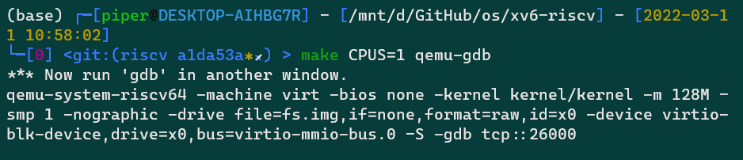

然后就可以连接 gdb-multiarch 。

这里我的运行结果和教授略有不同，我搬运一下[肖宏辉大大](https://zhuanlan.zhihu.com/p/266502391)的笔记：

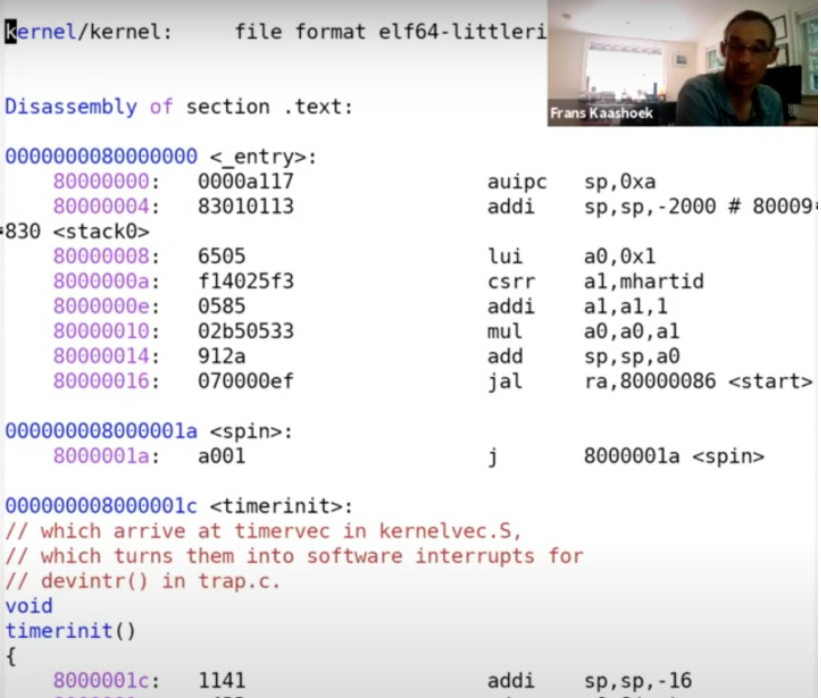

如上是 kernel.asm ，是教师编译生成的。与我的不一样，这里按照教授的来。

在连接上之后，我会在程序的入口处设置一个端点，因为我们知道这是QEMU会跳转到的第一个指令。

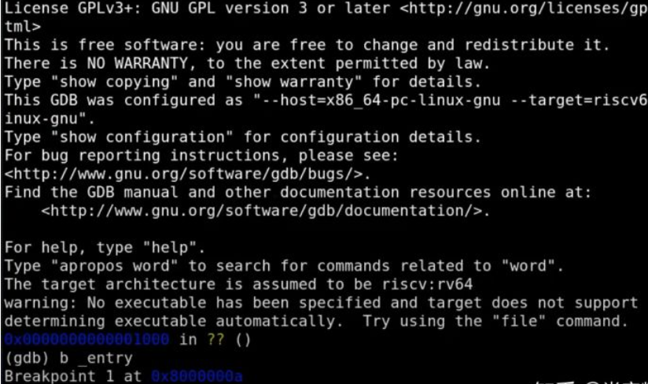

设置完断点之后，我运行程序，可以发现代码并没有停在0x8000000（见 kernel.asm 中， 0x80000000 是程序的起始位置），而是停在了 0x8000000a 。

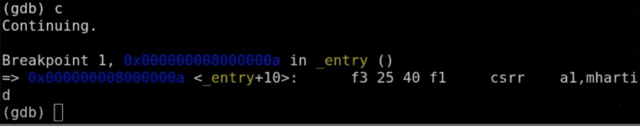

如果我们查看kernel的汇编文件，我们可以看到，在地址0x8000000a读取了控制系统寄存器（Control System Register）mhartid，并将结果加载到了a1寄存器。所以QEMU会模拟执行这条指令，之后执行下一条指令。

地址0x80000000是一个被QEMU认可的地址。也就是说如果你想使用QEMU，那么第一个指令地址必须是它。所以，我们会让内核加载器从那个位置开始加载内核。如果我们查看kernel.ld ：

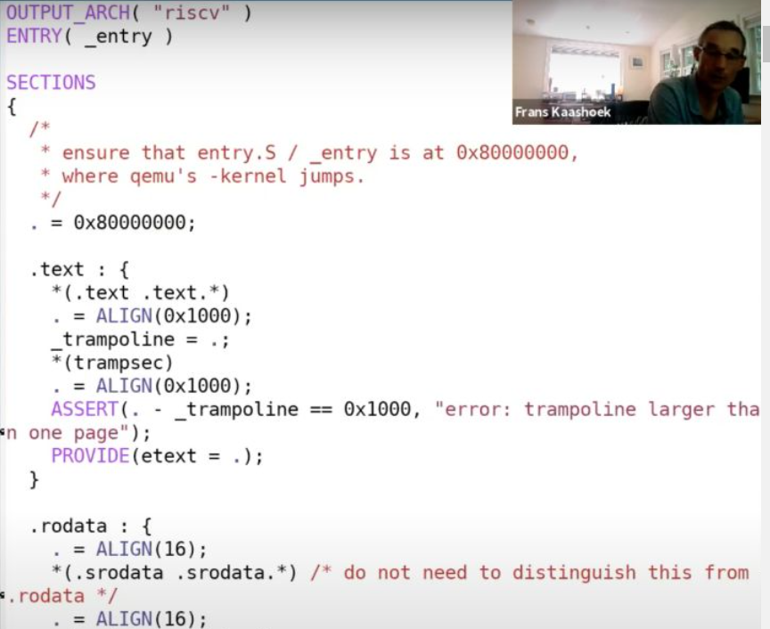

我们可以看到，这个文件定义了内核是如何被加载的，从这里也可以看到，内核使用的起始地址就是QEMU指定的0x80000000这个地址。这就是我们操作系统最初运行的步骤。

回到gdb，我们可以看到gdb也显示了指令的二进制编码。

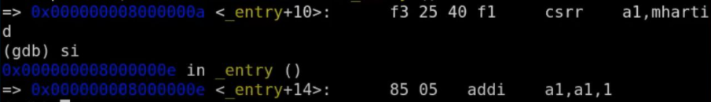

可以看出，csrr是一个4字节的指令，而addi是一个2字节的指令。

我们这里可以看到，XV6从entry.s开始启动，这个时候没有内存分页，没有隔离性，并且运行在M-mode（machine mode）。XV6会尽可能快的跳转到kernel mode或者说是supervisor mode。我们在main函数设置一个断点，main函数已经运行在supervisor mode了。接下来我运行程序，代码会在断点，也就是main函数的第一条指令停住。

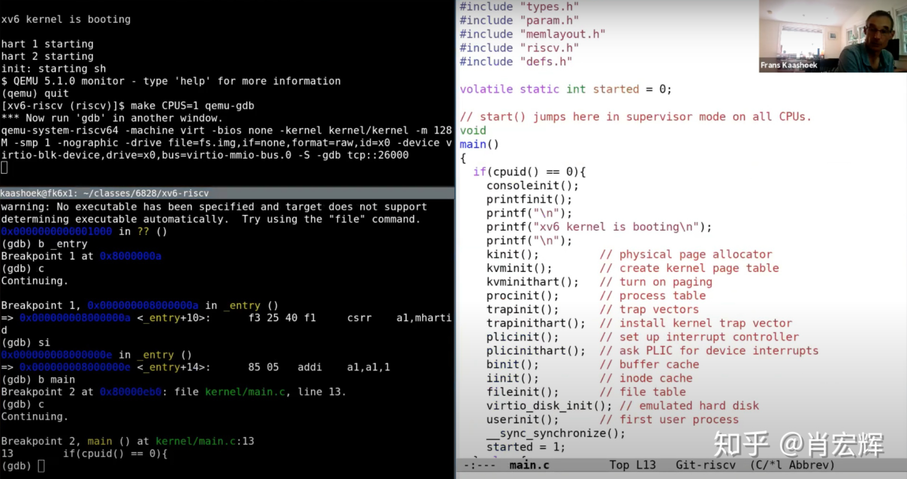

上图中，左下是gdb的断点显示，右边是main函数的源码。接下来，我想运行在gdb的layout split模式：

```
(gdb) layout split
```

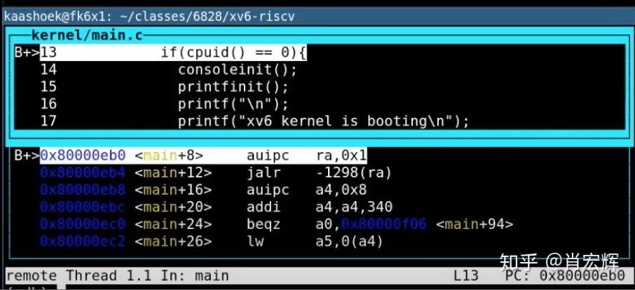

从这个视图可以看出gdb要执行的下一条指令是什么，断点具体在什么位置。

这里我只在一个CPU上运行QEMU（见最初的make参数），这样会使得gdb调试更加简单。因为现在只指定了一个CPU核，QEMU只会仿真一个核，我可以单步执行程序（因为在单核或者单线程场景下，单个断点就可以停止整个程序的运行）。

通过在gdb中输入n，可以挑到下一条指令。这里调用了一个名为consoleinit的函数，它的工作与你想象的完全一样，也就是设置好console。一旦console设置好了，接下来可以向console打印输出（代码16、17行）。执行完16、17行之后，我们可以在QEMU看到相应的输出。

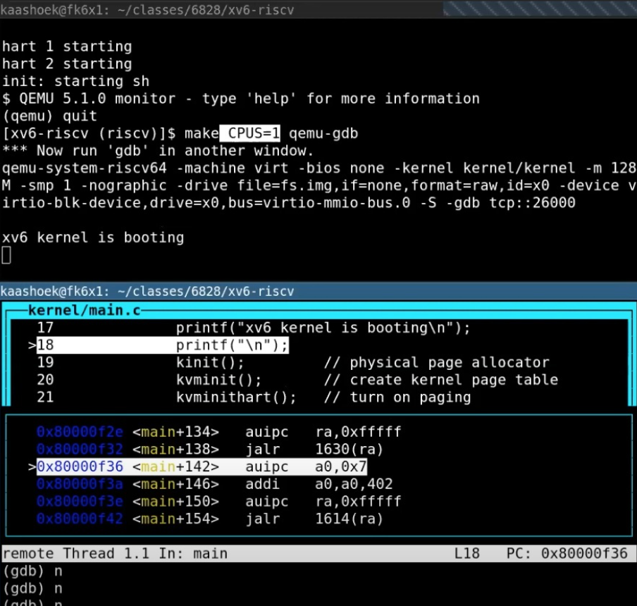

除了console之外，还有许多代码来做初始化。

- kinit：设置好页表分配器（page allocator）
- kvminit：设置好虚拟内存，这是下节课的内容
- kvminithart：打开页表，也是下节课的内容
- processinit：设置好初始进程或者说设置好进程表单
- trapinit/trapinithart：设置好user/kernel mode转换代码
- plicinit/plicinithart：设置好中断控制器PLIC（Platform Level Interrupt Controller），我们后面在介绍中断的时候会详细的介绍这部分，这是我们用来与磁盘和console交互方式
- binit：分配buffer cache
- iinit：初始化inode缓存
- fileinit：初始化文件系统
- virtio_disk_init：初始化磁盘
- userinit：最后当所有的设置都完成了，操作系统也运行起来了，会通过userinit运行第一个进程，这里有点意思，接下来我们看一下userinit

学生提问：这里的初始化函数的调用顺序重要吗？

Frans教授：重要，哈哈。一些函数必须在另一些函数之后运行，某几个函数的顺序可能不重要，但是对它们又需要在其他的一些函数之后运行。

可以通过gdb的s指令，跳到userinit内部。

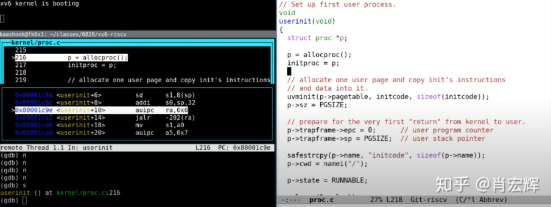

上图是userinit函数，右边是源码，左边是gdb视图。userinit有点像是胶水代码/Glue code（胶水代码不实现具体的功能，只是为了适配不同的部分而存在），它利用了XV6的特性，并启动了第一个进程。我们总是需要有一个用户进程在运行，这样才能实现与操作系统的交互，所以这里需要一个小程序来初始化第一个用户进程。这个小程序定义在initcode中。

/kernel/proc.c：

```c
// a user program that calls exec("/init")
// od -t xC initcode
uchar initcode[] = {
  0x17, 0x05, 0x00, 0x00, 0x13, 0x05, 0x45, 0x02,
  0x97, 0x05, 0x00, 0x00, 0x93, 0x85, 0x35, 0x02,
  0x93, 0x08, 0x70, 0x00, 0x73, 0x00, 0x00, 0x00,
  0x93, 0x08, 0x20, 0x00, 0x73, 0x00, 0x00, 0x00,
  0xef, 0xf0, 0x9f, 0xff, 0x2f, 0x69, 0x6e, 0x69,
  0x74, 0x00, 0x00, 0x24, 0x00, 0x00, 0x00, 0x00,
  0x00, 0x00, 0x00, 0x00
};

// Set up first user process.
void
userinit(void)
{
  struct proc *p;

  p = allocproc();
  initproc = p;
  
  // allocate one user page and copy init's instructions
  // and data into it.
  uvminit(p->pagetable, initcode, sizeof(initcode));
  p->sz = PGSIZE;

  // prepare for the very first "return" from kernel to user.
  p->trapframe->epc = 0;      // user program counter
  p->trapframe->sp = PGSIZE;  // user stack pointer

  safestrcpy(p->name, "initcode", sizeof(p->name));
  p->cwd = namei("/");

  p->state = RUNNABLE;

  release(&p->lock);
}
```

这里直接是程序的二进制形式，它会链接或者在内核中直接静态定义。实际上，这段代码对应了下面的汇编程序。

注意下面是 user/initcode.S ：

```S
# Initial process that execs /init.
# This code runs in user space.

#include "syscall.h"

# exec(init, argv)
.globl start
start:
        la a0, init
        la a1, argv
        li a7, SYS_exec
        ecall

# for(;;) exit();
exit:
        li a7, SYS_exit
        ecall
        jal exit

# char init[] = "/init\0";
init:
  .string "/init\0"

# char *argv[] = { init, 0 };
.p2align 2
argv:
  .long init
  .long 0
```

这个汇编程序中，它首先将init中的地址加载到a0（la a0, init），argv中的地址加载到a1（la a1, argv），exec系统调用对应的数字加载到a7（li a7, SYS_exec），最后调用ECALL。所以这里执行了3条指令，之后在第4条指令将控制权交给了操作系统。

如果我在syscall中设置一个断点：

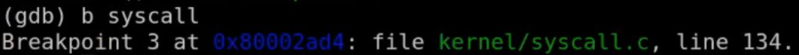

并让程序运行起来。userinit会创建初始进程，返回到用户空间，执行刚刚介绍的3条指令，再回到内核空间。这里是任何XV6用户会使用到的第一个系统调用。让我们来看一下会发生什么。通过在gdb中执行c，让程序运行起来，我们现在进入到了syscall函数。

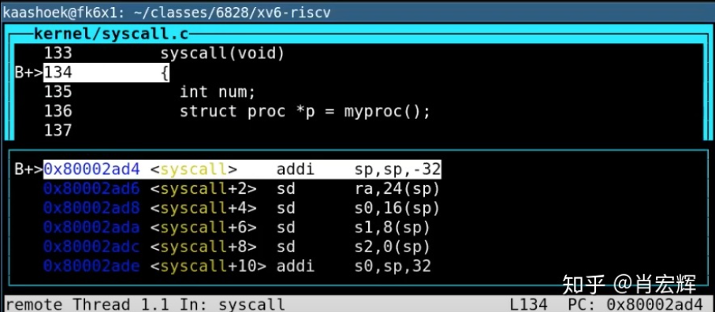

我们可以查看syscall的代码：

```c
void
syscall(void)
{
  int num;
  struct proc *p = myproc();

  num = p->trapframe->a7;
  if(num > 0 && num < NELEM(syscalls) && syscalls[num]) {
    p->trapframe->a0 = syscalls[num]();
  } else {
    printf("%d %s: unknown sys call %d\n",
            p->pid, p->name, num);
    p->trapframe->a0 = -1;
  }
}
```

num = p->trapframe->a7 会读取使用的系统调用对应的整数。当代码执行完这一行之后，我们可以在gdb中打印num，可以看到是7。

```
(gdb) p num
$1 = 7
```

如果我们查看syscall.h，可以看到7对应的是exec系统调用。

所以，这里本质上是告诉内核，某个用户应用程序执行了ECALL指令，并且想要调用exec系统调用。

`p->trapframe->a0 = syscall[num]()` 这一行是实际执行系统调用。这里可以看出，num用来索引一个数组，这个数组是一个函数指针数组，可以预期的是`syscall[7]`对应了`exec`的入口函数。我们跳到这个函数中去，可以看到，我们现在在`sys_exec`函数中。

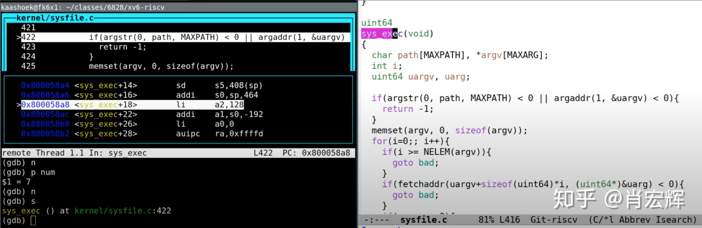

`sys_exec`中的第一件事情是从用户空间读取参数，它会读取path，也就是要执行程序的文件名。这里首先会为参数分配空间，然后从用户空间将参数拷贝到内核空间。之后我们打印path。

```
$2 = "/init\..."
```

可以看到传入的就是init程序。所以，综合来看，initcode完成了通过exec调用init程序。让我们来看看init程序：

```c
// init: The initial user-level program

#include "kernel/types.h"
#include "kernel/stat.h"
#include "kernel/spinlock.h"
#include "kernel/sleeplock.h"
#include "kernel/fs.h"
#include "kernel/file.h"
#include "user/user.h"
#include "kernel/fcntl.h"

char *argv[] = { "sh", 0 };

int
main(void)
{
  int pid, wpid;

  if(open("console", O_RDWR) < 0){
    mknod("console", CONSOLE, 0);
    open("console", O_RDWR);
  }
  dup(0);  // stdout
  dup(0);  // stderr

  for(;;){
    printf("init: starting sh\n");
    pid = fork();
    if(pid < 0){
      printf("init: fork failed\n");
      exit(1);
    }
    if(pid == 0){
      exec("sh", argv);
      printf("init: exec sh failed\n");
      exit(1);
    }

    for(;;){
      // this call to wait() returns if the shell exits,
      // or if a parentless process exits.
      wpid = wait((int *) 0);
      if(wpid == pid){
        // the shell exited; restart it.
        break;
      } else if(wpid < 0){
        printf("init: wait returned an error\n");
        exit(1);
      } else {
        // it was a parentless process; do nothing.
      }
    }
  }
}
```

init会为用户空间设置好一些东西，比如配置好console，调用fork，并在fork出的子进程中执行shell。

最终的效果就是Shell运行起来了。如果我再次运行代码，我还会陷入到syscall中的断点，并且同样也是调用exec系统调用，只是这次是通过exec运行Shell。当Shell运行起来之后，我们可以从QEMU看到Shell。

这里简单的介绍了一下XV6是如何从0开始直到第一个Shell程序运行起来。并且我们也看了一下第一个系统调用是在什么时候发生的。我们并没有看系统调用背后的具体机制，这个在后面会介绍。但是目前来说，这些对于你们完成这周的syscall lab是足够了。这些就是你们在实验中会用到的部分。这里有什么问题吗？

学生提问：我们会处理网络吗，比如说网络相关的实验？

Frans教授：是的，最后一个lab中你们会实现一个网络驱动。你们会写代码与硬件交互，操纵连接在RISC-V主板上网卡的驱动，以及寄存器，再向以太网发送一些网络报文。

好的，最后让我总结一下。因为没有涉及到太多的细节，我认为syscall lab可能会比上一个utils lab简单些，但是下一个实验会更加的复杂。要想做好实验总是会比较难，别总是拖到最后才完成实验，这样有什么奇怪的问题我们还能帮帮你。好了就这样，我退了，下节课再见~
