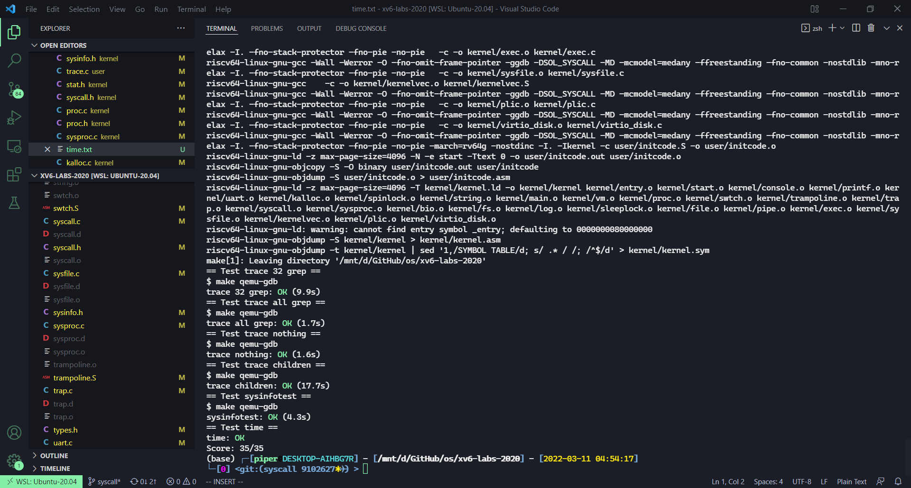

# Lab syscall: System calls

本节作业：
- https://github.com/PiperLiu/xv6-labs-2020/tree/syscall

目录：

<!-- @import "[TOC]" {cmd="toc" depthFrom=2 depthTo=2 orderedList=false} -->

<!-- code_chunk_output -->

- [System call tracing 新建一个系统调用](#system-call-tracing-新建一个系统调用)
- [Sysinfo 获取 free memory 和 processes](#sysinfo-获取-free-memory-和-processes)

<!-- /code_chunk_output -->

细分目录：

<!-- @import "[TOC]" {cmd="toc" depthFrom=2 depthTo=6 orderedList=false} -->

<!-- code_chunk_output -->

- [System call tracing 新建一个系统调用](#system-call-tracing-新建一个系统调用)
- [Sysinfo 获取 free memory 和 processes](#sysinfo-获取-free-memory-和-processes)

<!-- /code_chunk_output -->

## System call tracing 新建一个系统调用

In this assignment you will add a system call tracing feature that may help you when debugging later labs. You'll create a new trace system call that will control tracing. It should take one argument, an integer "mask", whose bits specify which system calls to trace. For example, to trace the fork system call, a program calls trace(`1 << SYS_fork`), where SYS_fork is a syscall number from kernel/syscall.h. You have to modify the xv6 kernel to print out a line when each system call is about to return, if the system call's number is set in the mask. **The line should contain the process id, the name of the system call and the return value;** you don't need to print the system call arguments. The trace system call should enable tracing for the process that calls it and any children that it subsequently forks, but should not affect other processes.

We provide a trace user-level program that runs another program with tracing enabled (see user/trace.c). When you're done, you should see output like this:

```bash
$ trace 32 grep hello README
3: syscall read -> 1023
3: syscall read -> 966
3: syscall read -> 70
3: syscall read -> 0
$ # 如下 2147483647 是 32 个 1 就是把所有系统调用都 trace
$ trace 2147483647 grep hello README
4: syscall trace -> 0
4: syscall exec -> 3
4: syscall open -> 3
4: syscall read -> 1023
4: syscall read -> 966
4: syscall read -> 70
4: syscall read -> 0
4: syscall close -> 0
$
$ grep hello README
$
$ trace 2 usertests forkforkfork
usertests starting
test forkforkfork: 407: syscall fork -> 408
408: syscall fork -> 409
409: syscall fork -> 410
410: syscall fork -> 411
409: syscall fork -> 412
410: syscall fork -> 413
409: syscall fork -> 414
411: syscall fork -> 415
...
$   
```

In the first example above, trace invokes grep tracing just the read system call. The 32 is `1<<SYS_read`. In the second example, trace runs grep while tracing all system calls; the 2147583647 has all 31 low bits set. In the third example, the program isn't traced, so no trace output is printed. In the fourth example, the fork system calls of all the descendants of the forkforkfork test in usertests are being traced. Your solution is correct if your program behaves as shown above (though the process IDs may be different).

Some hints:
- Add $U/_trace to UPROGS in Makefile
- Run make qemu and you will see that the compiler cannot compile user/trace.c, because the user-space stubs for the system call don't exist yet: add a prototype for the system call to user/user.h, a stub to user/usys.pl, and a syscall number to kernel/syscall.h. The Makefile invokes the perl script user/usys.pl, which produces user/usys.S, the actual system call stubs, which use the RISC-V ecall instruction to transition to the kernel. Once you fix the compilation issues, run trace 32 grep hello README; it will fail because you haven't implemented the system call in the kernel yet.
- Add a sys_trace() function in kernel/sysproc.c that implements the new system call by remembering its argument in a new variable in the proc structure (see kernel/proc.h). The functions to retrieve system call arguments from user space are in kernel/syscall.c, and you can see examples of their use in kernel/sysproc.c.
- Modify fork() (see kernel/proc.c) to copy the trace mask from the parent to the child process.
- Modify the syscall() function in kernel/syscall.c to print the trace output. You will need to add an array of syscall names to index into.

trace 用户态的命令已经写好了，是这样的：

```c
#include "kernel/param.h"
#include "kernel/types.h"
#include "kernel/stat.h"
#include "user/user.h"

int
main(int argc, char *argv[])
{
  int i;
  char *nargv[MAXARG];

  if(argc < 3 || (argv[1][0] < '0' || argv[1][0] > '9')){
    fprintf(2, "Usage: %s mask command\n", argv[0]);
    exit(1);
  }

  if (trace(atoi(argv[1])) < 0) {
    fprintf(2, "%s: trace failed\n", argv[0]);
    exit(1);
  }
  
  for(i = 2; i < argc && i < MAXARG; i++){
    nargv[i-2] = argv[i];
  }
  exec(nargv[0], nargv);
  exit(0);
}
```

修改步骤如下。

修改 Makefile 。

```makefile
$U/_trace\
```

添加 kernel/syscall.h ：

```c
#define SYS_trace  22
```

添加 user 与系统调用的接口。首先添加 user/user.h ：

```c
int trace(int);
```

以及 ：

```perl
entry("trace");
```

perl 将生成汇编代码，其中含有 ecall 用于进入内核态，执行真正的系统调用。

现在来做 kernel 。首先应该修改进程的数据结构：

kernel/proc.h ：
```c
// Per-process state
struct proc {
  ...
  int trace_mask;
};
```

然后修改 kernel/proc.c 中的 fork ：
```c
// Create a new process, copying the parent.
// Sets up child kernel stack to return as if from fork() system call.
int
fork(void)
{
  ...

  // 将父进程的 trace_mask 交给子进程
  np->trace_mask = p->trace_mask;

  ...
}
```

最后，做一下 trace 的核心逻辑：

kernel/sysproc.c ：

```c
uint64
sys_trace(void) {
  // 在 trace 被调用时
  // 把系统调用的第 0 个参数传给 trace_mask
  argint(0, &(myproc()->trace_mask));
  return 0;
}
```

kernel/syscall.c ：

```c
// 声明系统调用函数
extern uint64 sys_trace(void);

static uint64 (*syscalls[])(void) = {
...
// 新增 trace 的数字 -> 函数映射
[SYS_trace]   sys_trace,
};

// 新增除 trace 以外数字 -> 系统调用名映射
static char *syscallnames[] = {
[SYS_fork] "fork",
[SYS_exit] "exit",
[SYS_wait] "wait",
[SYS_pipe] "pipe",
[SYS_read] "read",
[SYS_kill] "kill",
[SYS_exec] "exec",
[SYS_fstat] "fstat",
[SYS_chdir] "chdir",
[SYS_dup] "dup",
[SYS_getpid] "getpid",
[SYS_sbrk] "sbrk",
[SYS_sleep] "sleep",
[SYS_uptime] "uptime",
[SYS_open] "open",
[SYS_write] "write",
[SYS_mknod] "mknod",
[SYS_unlink] "unlink",
[SYS_link] "link",
[SYS_mkdir] "mkdir",
[SYS_close] "close"
};

void
syscall(void)
{
  int num;
  struct proc *p = myproc();

  num = p->trapframe->a7;
  if(num > 0 && num < NELEM(syscalls) && syscalls[num]) {
    p->trapframe->a0 = syscalls[num]();
    /**
     * 下面是新增的
     */
    // 打印 trace 信息
    if ((1 << num) & (p->trace_mask)) {
      // p->trapframe->a0 是进程 p 的返回值
      printf("%d: syscall %s -> %d\n", p->pid, syscallnames[num], p->trapframe->a0);
    }
  } else {
    printf("%d %s: unknown sys call %d\n",
            p->pid, p->name, num);
    p->trapframe->a0 = -1;
  }
}
```

**请注意：在 make grade 前，一定要把 README 调为 LF 行尾格式，如果是 windows 默认的 CRLF 模式，会导致 README 读取到的字符数量不一样，最终导致 make grade 不通过。**

## Sysinfo 获取 free memory 和 processes

In this assignment you will add a system call, sysinfo, that collects information about the running system. **The system call takes one argument: a pointer to a struct sysinfo (see kernel/sysinfo.h). The kernel should fill out the fields of this struct: the freemem field should be set to the number of bytes of free memory, and the nproc field should be set to the number of processes whose state is not UNUSED.** We provide a test program sysinfotest; you pass this assignment if it prints "sysinfotest: OK".

Some hints:
- Add `$U/_sysinfotest` to UPROGS in Makefile
- Run make qemu; user/sysinfotest.c will fail to compile. Add the system call sysinfo, following the same steps as in the previous assignment. To declare the prototype for sysinfo() in user/user.h you need predeclare the existence of struct sysinfo:

```c
    struct sysinfo;
    int sysinfo(struct sysinfo *);
```

Once you fix the compilation issues, run sysinfotest; it will fail because you haven't implemented the system call in the kernel yet.

- sysinfo needs to copy a struct sysinfo back to user space; see sys_fstat() (kernel/sysfile.c) and filestat() (kernel/file.c) for examples of how to do that using copyout().
- To collect the amount of free memory, add a function to kernel/kalloc.c
- To collect the number of processes, add a function to kernel/proc.c

参考大佬的代码：https://github.com/duguosheng/xv6-labs-2020/tree/syscall

教授已经写好了 user/sysinfotest.c ：

```c
#include "kernel/types.h"
#include "kernel/riscv.h"
#include "kernel/sysinfo.h"
#include "user/user.h"


void
sinfo(struct sysinfo *info) {
  if (sysinfo(info) < 0) {
    printf("FAIL: sysinfo failed");
    exit(1);
  }
}

//
// use sbrk() to count how many free physical memory pages there are.
//
int
countfree()
{
  uint64 sz0 = (uint64)sbrk(0);
  struct sysinfo info;
  int n = 0;

  while(1){
    if((uint64)sbrk(PGSIZE) == 0xffffffffffffffff){
      break;
    }
    n += PGSIZE;
  }
  sinfo(&info);
  if (info.freemem != 0) {
    printf("FAIL: there is no free mem, but sysinfo.freemem=%d\n",
      info.freemem);
    exit(1);
  }
  sbrk(-((uint64)sbrk(0) - sz0));
  return n;
}

void
testmem() {
  struct sysinfo info;
  uint64 n = countfree();
  
  sinfo(&info);

  if (info.freemem!= n) {
    printf("FAIL: free mem %d (bytes) instead of %d\n", info.freemem, n);
    exit(1);
  }
  
  if((uint64)sbrk(PGSIZE) == 0xffffffffffffffff){
    printf("sbrk failed");
    exit(1);
  }

  sinfo(&info);
    
  if (info.freemem != n-PGSIZE) {
    printf("FAIL: free mem %d (bytes) instead of %d\n", n-PGSIZE, info.freemem);
    exit(1);
  }
  
  if((uint64)sbrk(-PGSIZE) == 0xffffffffffffffff){
    printf("sbrk failed");
    exit(1);
  }

  sinfo(&info);
    
  if (info.freemem != n) {
    printf("FAIL: free mem %d (bytes) instead of %d\n", n, info.freemem);
    exit(1);
  }
}

void
testcall() {
  struct sysinfo info;
  
  if (sysinfo(&info) < 0) {
    printf("FAIL: sysinfo failed\n");
    exit(1);
  }

  if (sysinfo((struct sysinfo *) 0xeaeb0b5b00002f5e) !=  0xffffffffffffffff) {
    printf("FAIL: sysinfo succeeded with bad argument\n");
    exit(1);
  }
}

void testproc() {
  struct sysinfo info;
  uint64 nproc;
  int status;
  int pid;
  
  sinfo(&info);
  nproc = info.nproc;

  pid = fork();
  if(pid < 0){
    printf("sysinfotest: fork failed\n");
    exit(1);
  }
  if(pid == 0){
    sinfo(&info);
    if(info.nproc != nproc+1) {
      printf("sysinfotest: FAIL nproc is %d instead of %d\n", info.nproc, nproc+1);
      exit(1);
    }
    exit(0);
  }
  wait(&status);
  sinfo(&info);
  if(info.nproc != nproc) {
      printf("sysinfotest: FAIL nproc is %d instead of %d\n", info.nproc, nproc);
      exit(1);
  }
}

int
main(int argc, char *argv[])
{
  printf("sysinfotest: start\n");
  testcall();
  testmem();
  testproc();
  printf("sysinfotest: OK\n");
  exit(0);
}
```

首先修改用户的接口，最最基础的，是把 Makefile 改了可以编译，这里与 user/sysinfotest.c 文件名对应：

```makefile
$U/_sysinfotest\
```

然后修改头文件 user/user.h ，用于给 user 调用：

```c
struct sysinfo;
int sysinfo(struct sysinfo*);
```

接着是 perl 脚本，用于生成带有 ecall 的汇编：

```perl
entry("sysinfo");
```

好了，来看 kernel 的头文件。

kernel/syscall.h ：

```c
#define SYS_sysinfo 23
```

kernel/syscall.c ：

```c
extern uint64 sys_sysinfo(void);

static uint64 (*syscalls[])(void) = {
...
[SYS_sysinfo] sys_sysinfo 
};

static char *syscallnames[] = {
...
[SYS_sysinfo] "sysinfo"
};
```

kernel/sysproc.c 这里定义了 sys_sysinfo 函数，也就是它到底要干什么。

注意到教授已经帮我们定义了头文件 sysinfo.h （规定了数据格式，我们用就行）：

```c
struct sysinfo {
  uint64 freemem;   // amount of free memory (bytes)
  uint64 nproc;     // number of process
};
```

kernel/sysproc.c 里面是这个系统调用的主逻辑：

```c
...
#include "sysinfo.h"
...

// To collect the amount of free memory, add a function to kernel/kalloc.c
extern unit64 freebytes(void);
// To collect the number of processes, add a function to kernel/proc.c
extern unit64 procnum(void);

uint64
sys_sysinfo(void) {
  // 保存系统信息
  struct sysinfo _sysinfo;
  _sysinfo.freemem = freebytes();
  _sysinfo.nproc = procnum();

  // 获取虚拟地址，即 user 给 sysinfo 这个系统调用的指针地址
  uint64 destaddr;
  argaddr(0, &destaddr);

  // 把 _sysinfo 从 kernel 拷贝到 user 给定的地址
  if (copyout(myproc()->pagetable, destaddr, (char*) &_sysinfo, sizeof _sysinfo) < 0) {
    return -1;
  }

  return 0;
}
```

然后是两个真正的核心逻辑， freebytes 和 procnum 。

先来看 kernel/kalloc.c ：

```c
// Physical memory allocator, for user processes,
// kernel stacks, page-table pages,
// and pipe buffers. Allocates whole 4096-byte pages.

#include "types.h"
#include "param.h"
#include "memlayout.h"
#include "spinlock.h"
#include "riscv.h"
#include "defs.h"

void freerange(void *pa_start, void *pa_end);

extern char end[]; // first address after kernel.
                   // defined by kernel.ld.

struct run {
  struct run *next;
};

struct {
  struct spinlock lock;
  struct run *freelist;
} kmem;

void
kinit()
{
  initlock(&kmem.lock, "kmem");
  freerange(end, (void*)PHYSTOP);
}

void
freerange(void *pa_start, void *pa_end)  // 释放指定区间的内存
{
  char *p;
  p = (char*)PGROUNDUP((uint64)pa_start);
  for(; p + PGSIZE <= (char*)pa_end; p += PGSIZE)
    kfree(p);
}

// Free the page of physical memory pointed at by v,
// which normally should have been returned by a
// call to kalloc().  (The exception is when
// initializing the allocator; see kinit above.)
void
kfree(void *pa)
{
  struct run *r;

  if(((uint64)pa % PGSIZE) != 0 || (char*)pa < end || (uint64)pa >= PHYSTOP)
    panic("kfree");

  // Fill with junk to catch dangling refs.
  memset(pa, 1, PGSIZE);

  r = (struct run*)pa;

  acquire(&kmem.lock);
  r->next = kmem.freelist;  // r 加到 kmem 头部
  kmem.freelist = r;
  release(&kmem.lock);
}

// Allocate one 4096-byte page of physical memory.
// Returns a pointer that the kernel can use.
// Returns 0 if the memory cannot be allocated.
void *
kalloc(void)
{
  struct run *r;

  acquire(&kmem.lock);
  r = kmem.freelist;
  if(r)
    kmem.freelist = r->next;
  release(&kmem.lock);

  if(r)
    memset((char*)r, 5, PGSIZE); // fill with junk
  return (void*)r;
}

// 新增的函数
// 获取剩余内存字节数
uint64
freebytes(void)
{
  uint64 bytes = 0;
  struct run *p = kmem.freelist; // 遍历指针

  acquire(&kmem.lock);
  while (p)
  {
    bytes += PGSIZE;
    p = p->next;
  }
  release(&kmem.lock);
  return bytes;
}
```

再来看 kernel/proc.c ：

```c
uint64
procnum(void)
{
  int np = 0;
  struct proc *p;
  // 前文有 struct proc proc[NPROC]; 定义了 proc 是一个数组
  for (p = proc; p < &proc[NPROC]; ++p) // &proc[NPROC] 是最大的 proc 的地址
  {
    // p->lock 必须被 held 在获取 state 时
    acquire(&p->lock);
    if (p->state != UNUSED)
      ++np;
    release(&p->lock);
  }
  return np;
}
```


