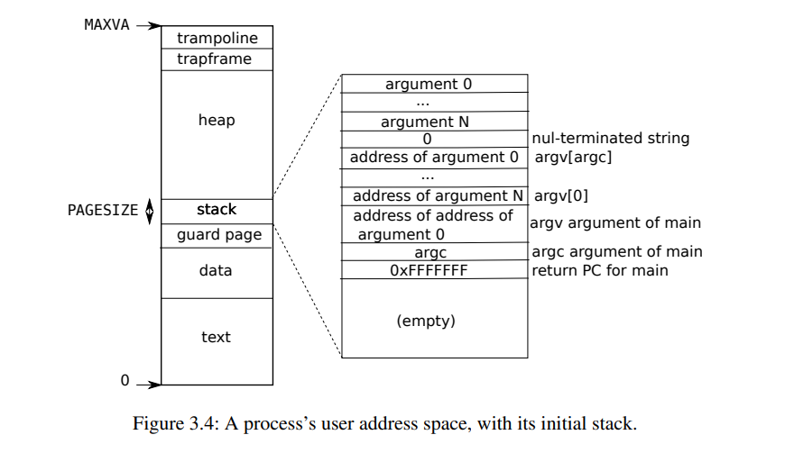

# LEC 4 (fk): Page tables

目录：

<!-- @import "[TOC]" {cmd="toc" depthFrom=2 depthTo=2 orderedList=false} -->

<!-- code_chunk_output -->

- [Chapter 3 Page tables](#chapter-3-page-tables)

<!-- /code_chunk_output -->

细分目录：

<!-- @import "[TOC]" {cmd="toc" depthFrom=2 depthTo=6 orderedList=false} -->

<!-- code_chunk_output -->

- [Chapter 3 Page tables](#chapter-3-page-tables)
  - [3.1 Paging hardware 页表基本概念与分级、 satp 寄存器](#31-paging-hardware-页表基本概念与分级-satp-寄存器)
  - [3.2 Kernel address space](#32-kernel-address-space)
  - [3.3 Code: creating an address space 以及 TLB](#33-code-creating-an-address-space-以及-tlb)
  - [3.4 Physical memory allocation](#34-physical-memory-allocation)
  - [3.5 Code: Physical memory allocator](#35-code-physical-memory-allocator)
  - [3.6 Process address space](#36-process-address-space)
  - [3.7 Code: sbrk 系统调用](#37-code-sbrk-系统调用)
  - [3.8 Code: exec](#38-code-exec)
  - [3.9 Real world](#39-real-world)
  - [3.10 Exercises](#310-exercises)

<!-- /code_chunk_output -->

## Chapter 3 Page tables

页表关键词：为进程创建隔离，将各个进程独自的虚拟地址映射到物理地址。防止进程直接修改物理地址，造成冲突。

Page tables also provide a level of indirection that allows xv6 to perform a few tricks: mapping the same memory (a trampoline page) in several address spaces, and guarding kernel and user stacks with an unmapped page.

### 3.1 Paging hardware 页表基本概念与分级、 satp 寄存器

xv6 runs on Sv39 RISC-V, which means that only the bottom 39 bits of a 64-bit virtual address
are used; **the top 25 bits are not used.**

In this Sv39 configuration, a RISC-V page table is logically an array of $2^{27}$ (134,217,728) **page table entries (PTEs)**.

上述核心重点在于，有 27 位是用于 PTE 的，即可以有 134,217,728 个页表。

Each PTE contains a 44-bit **physical page number (PPN)** and some flags.

每个 PTE 有一个 44 位的物理页编号和一些标志信息。硬件（the paging number）通过 27 位的去找到 PTE ，此时页表中 PPN 就是物理地址的 44 位，另外 12 位来自于原有的 Offset 。原文： The paging hardware translates a virtual address by using the top 27 bits of the 39 bits to index into the page table to find a PTE, and making a 56-bit physical address whose top 44 bits come from the PPN in the PTE and whose bottom 12 bits are copied from the original virtual address. 如下图。


然而，如果我们把 $2^{27}$ 这么大的内存拿出来保存 PTE ，那将浪费好多内存空间。所以实际上我们是用三级页表，这 27 位中分别用前中后三个 9 位来索引各级页表。如下图。


也正因如此，第一级页表大小为 4096 个字节也就是 512 个 PTE 。为啥？因为 $2^9=512$ 。之后有几个二级页表，根据实际情况开辟多少个，这样就实现了节省空间（相比不分级的页表）。

**If any of the three PTEs required to translate an address is not present, the paging hardware raises a page-fault exception, leaving it up to the kernel to handle the exception.**

还没有这个页表时，硬件就返回一个 page-fault exception 。

此外， PTE 的标志位如下图所示。


具体的意义这里不赘述，可以在 kernel/riscv.h 中看到这些以及一些其他与硬件相关的结构。如下。

```c
...

// use riscv's sv39 page table scheme.
#define SATP_SV39 (8L << 60)

#define MAKE_SATP(pagetable) (SATP_SV39 | (((uint64)pagetable) >> 12))

// supervisor address translation and protection;
// holds the address of the page table.
static inline void 
w_satp(uint64 x)
{
  asm volatile("csrw satp, %0" : : "r" (x));
}

static inline uint64
r_satp()
{
  uint64 x;
  asm volatile("csrr %0, satp" : "=r" (x) );
  return x;
}

...

// flush the TLB.
static inline void
sfence_vma()
{
  // the zero, zero means flush all TLB entries.
  asm volatile("sfence.vma zero, zero");
}


#define PGSIZE 4096 // bytes per page
#define PGSHIFT 12  // bits of offset within a page

#define PGROUNDUP(sz)  (((sz)+PGSIZE-1) & ~(PGSIZE-1))
#define PGROUNDDOWN(a) (((a)) & ~(PGSIZE-1))

#define PTE_V (1L << 0) // valid
#define PTE_R (1L << 1)
#define PTE_W (1L << 2)
#define PTE_X (1L << 3)
#define PTE_U (1L << 4) // 1 -> user can access

// shift a physical address to the right place for a PTE.
#define PA2PTE(pa) ((((uint64)pa) >> 12) << 10)

#define PTE2PA(pte) (((pte) >> 10) << 12)

#define PTE_FLAGS(pte) ((pte) & 0x3FF)

// extract the three 9-bit page table indices from a virtual address.
#define PXMASK          0x1FF // 9 bits
#define PXSHIFT(level)  (PGSHIFT+(9*(level)))
#define PX(level, va) ((((uint64) (va)) >> PXSHIFT(level)) & PXMASK)

// one beyond the highest possible virtual address.
// MAXVA is actually one bit less than the max allowed by
// Sv39, to avoid having to sign-extend virtual addresses
// that have the high bit set.
#define MAXVA (1L << (9 + 9 + 9 + 12 - 1))

typedef uint64 pte_t;
typedef uint64 *pagetable_t; // 512 PTEs
```

每个 CPU 都有一个 satp ， satp 记录着 CPU 自己的根页表的物理地址。

Physical memory refers to storage cells in DRAM. A byte of physical memory has an address, called a physical address. Instructions use only virtual addresses, which the paging hardware translates to physical addresses, and then sends to the DRAM hardware to read or write storage. **Unlike physical memory and virtual addresses, virtual memory isn’t a physical object,** but refers to the collection of abstractions and mechanisms the kernel provides to manage physical memory and virtual addresses.

### 3.2 Kernel address space

如下图定义了 kernel virtual address 到物理地址的映射。


kernel/memlayout.h 中定义了相关常量。

```c
// Physical memory layout

// qemu -machine virt is set up like this,
// based on qemu's hw/riscv/virt.c:
//
// 00001000 -- boot ROM, provided by qemu
// 02000000 -- CLINT
// 0C000000 -- PLIC
// 10000000 -- uart0 
// 10001000 -- virtio disk 
// 80000000 -- boot ROM jumps here in machine mode
//             -kernel loads the kernel here
// unused RAM after 80000000.

// the kernel uses physical memory thus:
// 80000000 -- entry.S, then kernel text and data
// end -- start of kernel page allocation area
// PHYSTOP -- end RAM used by the kernel

// qemu puts UART registers here in physical memory.
#define UART0 0x10000000L
#define UART0_IRQ 10

// virtio mmio interface
#define VIRTIO0 0x10001000
#define VIRTIO0_IRQ 1

// core local interruptor (CLINT), which contains the timer.
#define CLINT 0x2000000L
#define CLINT_MTIMECMP(hartid) (CLINT + 0x4000 + 8*(hartid))
#define CLINT_MTIME (CLINT + 0xBFF8) // cycles since boot.

// qemu puts platform-level interrupt controller (PLIC) here.
#define PLIC 0x0c000000L
#define PLIC_PRIORITY (PLIC + 0x0)
#define PLIC_PENDING (PLIC + 0x1000)
#define PLIC_MENABLE(hart) (PLIC + 0x2000 + (hart)*0x100)
#define PLIC_SENABLE(hart) (PLIC + 0x2080 + (hart)*0x100)
#define PLIC_MPRIORITY(hart) (PLIC + 0x200000 + (hart)*0x2000)
#define PLIC_SPRIORITY(hart) (PLIC + 0x201000 + (hart)*0x2000)
#define PLIC_MCLAIM(hart) (PLIC + 0x200004 + (hart)*0x2000)
#define PLIC_SCLAIM(hart) (PLIC + 0x201004 + (hart)*0x2000)

// the kernel expects there to be RAM
// for use by the kernel and user pages
// from physical address 0x80000000 to PHYSTOP.
#define KERNBASE 0x80000000L
#define PHYSTOP (KERNBASE + 128*1024*1024)

// map the trampoline page to the highest address,
// in both user and kernel space.
#define TRAMPOLINE (MAXVA - PGSIZE)

// map kernel stacks beneath the trampoline,
// each surrounded by invalid guard pages.
#define KSTACK(p) (TRAMPOLINE - ((p)+1)* 2*PGSIZE)

// User memory layout.
// Address zero first:
//   text
//   original data and bss
//   fixed-size stack
//   expandable heap
//   ...
//   TRAPFRAME (p->trapframe, used by the trampoline)
//   TRAMPOLINE (the same page as in the kernel)
#define TRAPFRAME (TRAMPOLINE - PGSIZE)
```

值得一提的是， The kernel can interact with the devices by reading/writing these special physical addresses; such reads and writes communicate with the device hardware rather than with RAM. （与其他设备交互也是通过与内存特殊地址交互的方式）

注意到对于 kernel 来讲某些虚地址和物理地址是一样的，这样节省了读取物理地址的实际。 when fork allocates user memory for the child process, the allocator returns the physical address of that memory; fork uses that address directly as a virtual address when it is copying the parent’s user memory to the child.

### 3.3 Code: creating an address space 以及 TLB

在 kernel/riscv.h 中：

```c
typedef uint64 pte_t;
typedef uint64 *pagetable_t; // 512 PTEs
```

定义了指针 pagetable_t ，指向的是一个 root page-table page 。 pagetable_t 可能是 kernel page table 也可能是 one of the perprocess page tables 。

kernel/vm.c 中定义了各种对于地址空间、页表的操作，核心的函数是 walk ：

```c
// Return the address of the PTE in page table pagetable
// that corresponds to virtual address va.  If alloc!=0,
// create any required page-table pages.
//
// The risc-v Sv39 scheme has three levels of page-table
// pages. A page-table page contains 512 64-bit PTEs.
// A 64-bit virtual address is split into five fields:
//   39..63 -- must be zero.
//   30..38 -- 9 bits of level-2 index.
//   21..29 -- 9 bits of level-1 index.
//   12..20 -- 9 bits of level-0 index.
//    0..11 -- 12 bits of byte offset within the page.
pte_t *
walk(pagetable_t pagetable, uint64 va, int alloc)
{
  if(va >= MAXVA)
    panic("walk");

  for(int level = 2; level > 0; level--) {
    pte_t *pte = &pagetable[PX(level, va)];
    if(*pte & PTE_V) {
      pagetable = (pagetable_t)PTE2PA(*pte);
    } else {
      if(!alloc || (pagetable = (pde_t*)kalloc()) == 0)
        return 0;
      memset(pagetable, 0, PGSIZE);
      *pte = PA2PTE(pagetable) | PTE_V;
    }
  }
  return &pagetable[PX(0, va)];
}
```

vm.c 里各个函数的意义不再详记。

Each RISC-V CPU caches page table entries in a Translation Look-aside Buffer (TLB), and when xv6 changes a page table, it must tell the CPU to invalidate corresponding cached TLB entries.

TLB 用于换存地址映射。

### 3.4 Physical memory allocation

xv6 uses the physical memory between **the end of the kernel and PHYSTOP for run-time allocation.** It allocates and frees whole 4096-byte pages at a time. It keeps track of **which pages are free by threading a linked list through the pages themselves.** Allocation consists of removing a page from the linked list; freeing consists of adding the freed page to the list.

### 3.5 Code: Physical memory allocator

如何分配内存的逻辑在 kernel/kalloc.c 中。

The free list is **protected by a spin lock (kernel/kalloc.c:21-24).**

```c
void freerange(void *pa_start, void *pa_end);

extern char end[]; // first address after kernel.
                   // defined by kernel.ld.

struct run {
  struct run *next;
};

struct {
  struct spinlock lock;
  struct run *freelist;
} kmem;

void
kinit()
{
  initlock(&kmem.lock, "kmem");
  freerange(end, (void*)PHYSTOP);
}

void
freerange(void *pa_start, void *pa_end)
{
  char *p;
  p = (char*)PGROUNDUP((uint64)pa_start);
  for(; p + PGSIZE <= (char*)pa_end; p += PGSIZE)
    kfree(p);
}
```

### 3.6 Process address space

每个进程对应的虚拟地址，是从 0 一直到 MAXVA (kernel/riscv.h:348) ，即 `#define MAXVA (1L << (9 + 9 + 9 + 12 - 1))` `MAXVA / 1024 / 1024 / 1024 == 256`(GB) 。

关于如何分配新页： When a process asks xv6 for more user memory, xv6 first uses kalloc to allocate physical pages. It then adds PTEs to the process’s page table that point to the new physical pages.

进程单独一个虚拟空间的优势：
- First, different processes’ page tables translate user addresses to different pages of physical memory, so that each process has private user memory. 进程空间隔离。
- Second, each process sees its memory as having contiguous virtual addresses starting at zero, while the process’s physical memory can be non-contiguous. 进程自己看到的地址是连续的。
- Third, the kernel maps a page with trampoline code at the top of the user address space, thus a single page of physical memory shows up in all address spaces. 用户态和内核态可以公用一些物理内存（通过 trampoline code at the top of the user address space ？）

如下是这个进程刚刚被 call main 的虚拟地址空间状态如下图。



注意到 guard page ，是用来判断是否栈溢出的。 If the user stack overflows and the process tries to use an address below the stack, the hardware will generate a page-fault exception because the mapping is not valid. **A real-world operating system might instead automatically allocate more memory for the user stack when it overflows.**

### 3.7 Code: sbrk 系统调用

Sbrk is the system call for a process to shrink or grow its memory.

xv6 uses **a process’s page table not just to tell the hardware how to map user virtual addresses, but also as the only record of which physical memory pages are allocated to that process.** That is the reason why freeing user memory (in uvmunmap) requires examination of the user page table.

### 3.8 Code: exec

既然每个进程都有自己的地址空间，那就不得不提到开启进程的 exec 系统调用了。

exec 会打开一个 path ，读取 ELF 格式的文件。

kernel/elf.h 中定义了 ELF 文件的格式：

```c
// Format of an ELF executable file

#define ELF_MAGIC 0x464C457FU  // "\x7FELF" in little endian

// File header
struct elfhdr {
  uint magic;  // must equal ELF_MAGIC
  uchar elf[12];
  ushort type;
  ushort machine;
  uint version;
  uint64 entry;
  uint64 phoff;
  uint64 shoff;
  uint flags;
  ushort ehsize;
  ushort phentsize;
  ushort phnum;
  ushort shentsize;
  ushort shnum;
  ushort shstrndx;
};

// Program section header
struct proghdr {
  uint32 type;
  uint32 flags;
  uint64 off;
  uint64 vaddr;
  uint64 paddr;
  uint64 filesz;
  uint64 memsz;
  uint64 align;
};

// Values for Proghdr type
#define ELF_PROG_LOAD           1

// Flag bits for Proghdr flags
#define ELF_PROG_FLAG_EXEC      1
#define ELF_PROG_FLAG_WRITE     2
#define ELF_PROG_FLAG_READ      4
```

注意到这个 magic 是什么： The first step is a quick check that the file probably contains an ELF binary. An ELF binary starts with the four-byte “magic number” 0x7F, ‘E’, ‘L’, ‘F’, or ELF_MAGIC (kernel/elf.h:3). If the ELF header has the right magic number, exec assumes that the binary is well-formed.

```c
int
exec(char *path, char **argv)
{
  char *s, *last;
  int i, off;
  uint64 argc, sz = 0, sp, ustack[MAXARG], stackbase;
  struct elfhdr elf;
  struct inode *ip;
  struct proghdr ph;
  pagetable_t pagetable = 0, oldpagetable;
  struct proc *p = myproc();

  begin_op();

  if((ip = namei(path)) == 0){
    end_op();
    return -1;
  }
  ilock(ip);

  // Check ELF header
  if(readi(ip, 0, (uint64)&elf, 0, sizeof(elf)) != sizeof(elf))
    goto bad;
  if(elf.magic != ELF_MAGIC)
    goto bad;

  if((pagetable = proc_pagetable(p)) == 0)
    goto bad;

  // Load program into memory.
  for(i=0, off=elf.phoff; i<elf.phnum; i++, off+=sizeof(ph) ) {
    if(readi(ip, 0, (uint64)&ph, off, sizeof(ph)) != sizeof(ph) )
      goto bad;
    if(ph.type != ELF_PROG_LOAD )
      continue;
    if(ph.memsz < ph.filesz)
      goto bad;
    if(ph.vaddr + ph.memsz < ph.vaddr)
      goto bad;
    uint64 sz1;
    if((sz1 = uvmalloc(pagetable, sz, ph.vaddr + ph.memsz)) == 0)
      goto bad;
    sz = sz1;
    if((ph.vaddr % PGSIZE) != 0 )
      goto bad;
    if(loadseg(pagetable, ph.vaddr, ip, ph.off, ph.filesz) < 0)
      goto bad;
  }
  ...
}
```

如上是节选到了声明空间的逻辑。

这里举个例子，对于 init 进程来讲，其 header 是这样的：


Exec 之后的工作是分配并且初始化 user stack 。如果 stack 超过一个 page 会报错，做法是 Exec places an inaccessible page just below the stack page, so that programs that try to use more than one page will fault.

Exec 中有很多 `goto bad` ，如下是处理错误的逻辑：

```c
bad:
  if(pagetable)
    proc_freepagetable(pagetable, sz);
  if(ip){
    iunlockput(ip);
    end_op();
  }
```

为什么有这个？这是因为有错误了不能直接退出，而是要等着把 new image 给 free 再 return -1 。

此外， Exec must wait to free the old image until it is sure that the system call will succeed: if the old image is gone, the system call cannot return -1 to it. The only error cases in exec happen during the creation of the image. Once the image is complete, exec can commit to the new page table (kernel/exec.c:113) and free the old one (kernel/exec.c:117).

```c
oldpagetable = p->pagetable;
p->pagetable = pagetable;
p->sz = sz;
p->trapframe->epc = elf.entry;  // initial program counter = main
p->trapframe->sp = sp; // initial stack pointer
proc_freepagetable(oldpagetable, oldsz);
```

### 3.9 Real world

实际上 kernel 中虚拟地址到物理地址中直接映射的部分没那么简单。 Real hardware places RAM and devices at unpredictable physical addresses, so that (for example) there might be no `RAM at 0x8000000`, where xv6 expect to be able to store the kernel. More serious kernel designs exploit the page table to turn arbitrary hardware physical memory layouts into predictable kernel virtual address layouts.

In addition, a more elaborate kernel would likely allocate many different sizes of small blocks, rather than (as in xv6) just 4096-byte blocks; **a real kernel allocator would need to handle small allocations as well as large ones.**

### 3.10 Exercises

具体的练习留到 lab 里去做。
