# LEC 4 (fk): Page tables

笔记大量参考了[肖宏辉](https://www.zhihu.com/people/xiao-hong-hui-15)大佬的翻译。

目录：

<!-- @import "[TOC]" {cmd="toc" depthFrom=2 depthTo=2 orderedList=false} -->

<!-- code_chunk_output -->

- [虚拟内存的基本概念](#虚拟内存的基本概念)
- [页表](#页表)
- [阅读 kernel 代码](#阅读-kernel-代码)

<!-- /code_chunk_output -->

细分目录：

<!-- @import "[TOC]" {cmd="toc" depthFrom=2 depthTo=6 orderedList=false} -->

<!-- code_chunk_output -->

- [虚拟内存的基本概念](#虚拟内存的基本概念)
- [页表](#页表)
  - [虚拟地址到物理地址转换](#虚拟地址到物理地址转换)
  - [多级页表](#多级页表)
  - [页表缓存 TLB](#页表缓存-tlb)
  - [kernel page table](#kernel-page-table)
- [阅读 kernel 代码](#阅读-kernel-代码)
  - [kvminit 函数](#kvminit-函数)
  - [kvminithart 函数](#kvminithart-函数)
  - [walk 函数](#walk-函数)

<!-- /code_chunk_output -->

## 虚拟内存的基本概念

- 学生提问：我比较好奇物理内存的配置，因为物理内存的数量是有限的，而虚拟地址空间存在最大虚拟内存地址，但是会有很多个虚拟地址空间，所以我们在设计的时候需要将最大虚拟内存地址设置的足够小吗？
- Frans教授：并不必要，虚拟内存可以比物理内存更大，物理内存也可以比虚拟内存更大。我们马上就会看到这里是如何实现的，其实就是通过page table来实现，这里非常灵活。
- 同一个学生继续问：如果有太多的进程使用了虚拟内存，有没有可能物理内存耗尽了？
- Frans教授：这必然是有可能的。我们接下来会看到如果你有一些大的应用程序，每个程序都有大的page table，并且分配了大量的内存，在某个时间你的内存就耗尽了。
- Frans教授提问：大家们，在XV6中从哪可以看到内存耗尽了？如果你们完成了syscall实验，你们会知道在syscall实验中有一部分是打印剩余内存的数量。
- 学生回答：kalloc？
- Frans教授：是的，kalloc。kalloc保存了空余page的列表，如果这个列表为空或者耗尽了，那么kalloc会返回一个空指针，内核会妥善处理并将结果返回给用户应用程序。并告诉用户应用程序，要么是对这个应用程序没有额外的内存了，要么是整个机器都没有内存了。
- 内核的一部分工作就是优雅的处理这些情况，这里的优雅是指向用户应用程序返回一个错误消息，而不是直接崩溃。

## 页表

如何能够实现地址空间呢？或者说如何在一个物理内存上，创建不同的地址空间？

最常见的方法，同时也是非常灵活的一种方法就是使用页表（Page Tables）。页表是在硬件中通过处理器和内存管理单元（Memory Management Unit）实现。所以，在你们的脑海中，应该有这么一张图：CPU正在执行指令，例如`sd $7, (a0)`。

对于任何一条带有地址的指令，其中的地址应该认为是虚拟内存地址而不是物理地址。假设寄存器a0中是地址`0x1000`，那么这是一个虚拟内存地址。虚拟内存地址会被转到内存管理单元（MMU，Memory Management Unit）

内存管理单元会将虚拟地址翻译成物理地址。之后这个物理地址会被用来索引物理内存，并从物理内存加载，或者向物理内存存储数据。

**从CPU的角度来说，一旦MMU打开了，它执行的每条指令中的地址都是虚拟内存地址。**

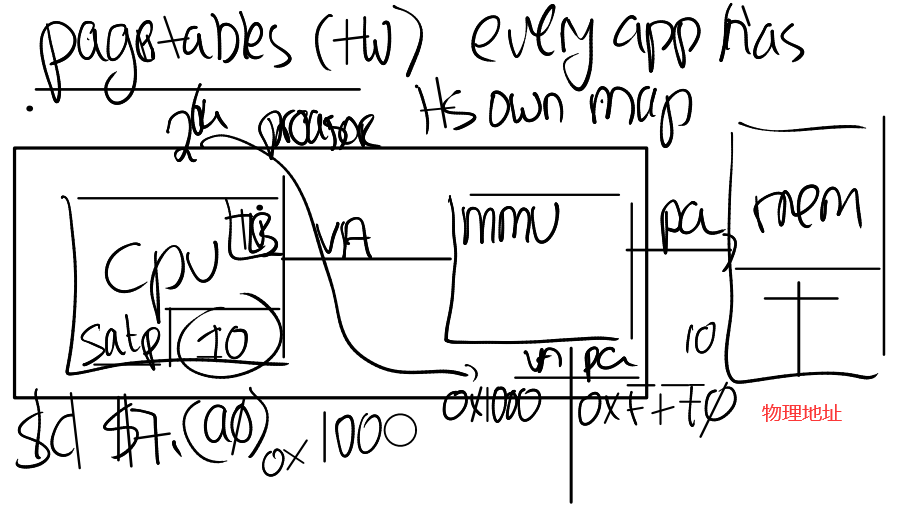

为了能够完成虚拟内存地址到物理内存地址的翻译，MMU会有一个表单，表单中，一边是虚拟内存地址，另一边是物理内存地址。举个例子，虚拟内存地址0x1000对应了一个我随口说的物理内存地址0xFFF0。这样的表单可以非常灵活。

通常来说，内存地址对应关系的表单也保存在内存中。所以CPU中需要有一些寄存器用来存放表单在物理内存中的地址。现在，在内存的某个位置保存了地址关系表单， **我们假设这个位置的物理内存地址是0x10。那么在RISC-V上一个叫做SATP的寄存器会保存地址0x10。**

这样，CPU就可以告诉MMU，可以从哪找到将虚拟内存地址翻译成物理内存地址的表单。

- 学生提问：所以MMU并不会保存page table，它只会从内存中读取page table，然后完成翻译，是吗？
- Frans教授：是的，这就是你们应该记住的。page table保存在内存中，MMU只是会去查看page table，我们接下来会看到，page table比我们这里画的要稍微复杂一些。

**这里的基本想法是每个应用程序都有自己独立的表单，并且这个表单定义了应用程序的地址空间。** 所以当操作系统将CPU从一个应用程序切换到另一个应用程序时，同时也需要切换SATP寄存器中的内容，从而指向新的进程保存在物理内存中的地址对应表单。这样的话，cat程序和Shell程序中相同的虚拟内存地址，就可以翻译到不同的物理内存地址，因为每个应用程序都有属于自己的不同的地址对应表单。

- 学生提问：刚刚说到SATP寄存器会根据进程而修改，我猜每个进程对应的SATP值是由内核保存的？
- Frans教授：是的。内核会写SATP寄存器，写SATP寄存器是一条特殊权限指令。所以，用户应用程序不能通过更新这个寄存器来更换一个地址对应表单，否则的话就会破坏隔离性。所以，只有运行在kernel mode的代码可以更新这个寄存器。

### 虚拟地址到物理地址转换

前面都是最基本的介绍，我们在前面画的图还有做的解释都比较初级且存在明显不合理的地方。有一件事情我刚刚没有提到，这里的表单是如何工作的？从刚刚画的图看来，对于每个虚拟地址，在表单中都有一个条目，如果我们真的这么做，表单会有多大？原则上说，在RISC-V上会有多少地址，或者一个寄存器可以保存多少个地址？寄存器是64bit的，所以有多少个地址呢？是的，$2^{64}$个地址，所以如果我们以地址为粒度来管理，表单会变得非常巨大。实际上，所有的内存都会被这里的表单耗尽，所以这一点也不合理。

所以，实际情况不可能是一个虚拟内存地址对应page table中的一个条目。接下来我将分两步介绍RISC-V中是如何工作的。

第一步：不要为每个地址创建一条表单条目，而是为每个page创建一条表单条目，所以每一次地址翻译都是针对一个page。 **而RISC-V中，一个page是4KB，也就是4096Bytes。这个大小非常常见，几乎所有的处理器都使用4KB大小的page或者支持4KB大小的page。**

现在，内存地址的翻译方式略微的不同了。首先对于虚拟内存地址，我们将它划分为两个部分，index和offset，index用来查找page，offset对应的是一个page中的哪个字节。

当MMU在做地址翻译的时候，通过读取虚拟内存地址中的index可以知道物理内存中的page号，这个page号对应了物理内存中的4096个字节。 **之后虚拟内存地址中的offset指向了page中的4096个字节中的某一个，假设offset是12，那么page中的第12个字节被使用了。** 将offset加上page的起始地址，就可以得到物理内存地址。

有关RISC-V的一件有意思的事情是，虚拟内存地址都是64bit，这也说的通，因为RISC-V的寄存器是64bit的。但是实际上，在我们使用的RSIC-V处理器上，并不是所有的64bit都被使用了，也就是说高25bit并没有被使用。这样的结果是限制了虚拟内存地址的数量，虚拟内存地址的数量现在只有2^39个，大概是512GB。当然，如果必要的话，最新的处理器或许可以支持更大的地址空间，只需要将未使用的25bit拿出来做为虚拟内存地址的一部分即可。

**在剩下的39bit中，有27bit被用来当做index，12bit被用来当做offset。offset必须是12bit，因为对应了一个page的4096个字节。**

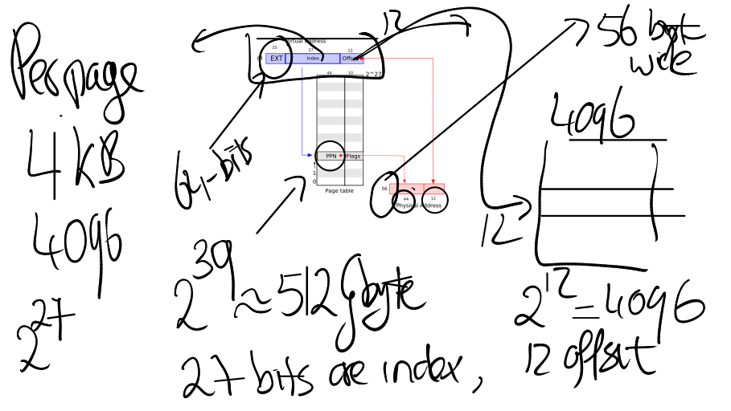

在RISC-V中，物理内存地址是56bit。所以物理内存可以大于单个虚拟内存地址空间，但是也最多到2^56。大多数主板还不支持2^56这么大的物理内存，但是原则上，如果你能造出这样的主板，那么最多可以支持2^56字节的物理内存。

**物理内存地址是56bit，其中44bit是物理page号（PPN，Physical Page Number），剩下12bit是offset完全继承自虚拟内存地址（也就是地址转换时，只需要将虚拟内存中的27bit翻译成物理内存中的44bit的page号，剩下的12bitoffset直接拷贝过来即可）。**

- 学生提问：我想知道4096字节作为一个page，这在物理内存中是连续的吗？
- Frans教授：是的，在物理内存中，这是连续的4096个字节。所以物理内存是以4096为粒度使用的。
- 同一个学生：所以offset才是12bit，这样就足够覆盖4096个字节？
- Frans教授：是的，page中的每个字节都可以被offset索引到。
- 同一个学生：图中的56bit又是根据什么确定的？
- Frans教授：这是由硬件设计人员决定的。所以RISC-V的设计人员认为56bit的物理内存地址是个不错的选择。可以假定，他们是通过技术发展的趋势得到这里的数字。比如说，设计是为了满足5年的需求，可以预测物理内存在5年内不可能超过2^56这么大。或许，他们预测是的一个小得多的数字，但是为了防止预测错误，他们选择了像2^56这么大的数字。这里说的通吗？很多同学都问了这个问题。
- 学生提问：如果虚拟内存最多是2^27（最多应该是2^39），而物理内存最多是2^56，这样我们可以有多个进程都用光了他们的虚拟内存，但是物理内存还有剩余，对吗？
- Frans教授：是的，完全正确。
- 学生提问：因为这是一个64bit的机器，为什么硬件设计人员本可以用64bit但是却用了56bit？
- Frans教授：选择56bit而不是64bit是因为在主板上只需要56根线。
- **学生提问：我们从CPU到MMU之后到了内存，但是不同的进程之间的怎么区别？比如说Shell进程在地址0x1000存了一些数据，ls进程也在地址0x1000也存了一些数据，我们需要怎么将它们翻译成不同的物理内存地址。**
- **Frans教授：SATP寄存器包含了需要使用的地址转换表的内存地址。所以ls有自己的地址转换表，cat也有自己的地址转换表。每个进程都有完全属于自己的地址转换表。**

### 多级页表

如果每个进程都有自己的page table，那么 **每个page table表** 会有多大呢？

这个page table最多会有$2^{27}$个条目（虚拟内存地址中的index长度为27），这是个非常大的数字。如果每个进程都使用这么大的page table，进程需要为page table消耗大量的内存，并且很快物理内存就会耗尽。

所以实际上，硬件并不是按照这里的方式来存储page table。从概念上来说，你可以认为page table是从0到$2^{27}$，但是实际上并不是这样。实际中，page table是一个多级的结构。下图是一个真正的RISC-V page table结构和硬件实现。

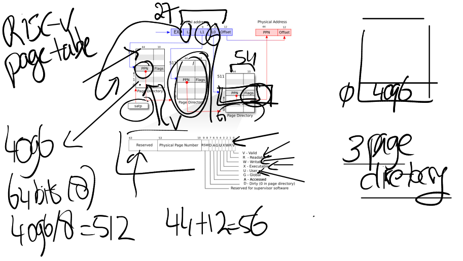

我们之前提到的虚拟内存地址中的27bit的index，实际上是由3个9bit的数字组成（L2，L1，L0）。前9个bit被用来索引最高级的page directory（注：通常page directory是用来索引page table或者其他page directory物理地址的表单，但是在课程中，page table，page directory， page directory table区分并不明显，可以都认为是有相同结构的地址对应表单）。

一个directory是4096Bytes，就跟page的大小是一样的。**Directory中的一个条目被称为PTE（Page Table Entry）是64bits，就像寄存器的大小一样，也就是8Bytes。所以一个Directory page有512个条目。**

所以实际上，SATP寄存器会指向最高一级的page directory的物理内存地址，之后我们用虚拟内存中index的高9bit用来索引最高一级的page directory，这样我们就能得到一个PPN，也就是物理page号。这个PPN指向了中间级的page directory。

当我们在使用中间级的page directory时，我们通过虚拟内存地址中的L1部分完成索引。接下来会走到最低级的page directory，我们通过虚拟内存地址中的L0部分完成索引。在最低级的page directory中，我们可以得到对应于虚拟内存地址的物理内存地址。

从某种程度上来说，与之前一种方案还是很相似的，除了实际的索引是由3步，而不是1步完成。这种方式的主要优点是，如果地址空间中大部分地址都没有使用，你不必为每一个index准备一个条目。举个例子，如果你的地址空间只使用了一个page，4096Bytes。

除此之外，你没有使用任何其他的地址。现在，你需要多少个page table entry，或者page table directory来映射这一个page？

在最高级，你需要一个page directory。在这个page directory中，你需要一个数字是0的PTE，指向中间级page directory。所以在中间级，你也需要一个page directory，里面也是一个数字0的PTE，指向最低级page directory。所以这里总共需要3个page directory（也就是3 * 512个条目）。

而在前一个方案中，虽然我们只使用了一个page，还是需要2^27个PTE。这个方案中，我们只需要3 * 512个PTE。所需的空间大大减少了。这是实际上硬件采用这种层次化的3级page directory结构的主要原因。这里有什么问题吗？这部分还是很重要的。

接下来，让我们看看PTE中的Flag，因为它也很重要。每个PTE的低10bit是一堆标志位：
- 第一个标志位是Valid。如果Valid bit位为1，那么表明这是一条合法的PTE，你可以用它来做地址翻译。对于刚刚举得那个小例子（应用程序只用了1个page的例子），我们只使用了3个page directory，每个page directory中只有第0个PTE被使用了，所以只有第0个PTE的Valid bit位会被设置成1，其他的511个PTE的Valid bit为0。这个标志位告诉MMU，你不能使用这条PTE，因为这条PTE并不包含有用的信息。
- 下两个标志位分别是Readable和Writable。表明你是否可以读/写这个page。
- Executable表明你可以从这个page执行指令。
- User表明这个page可以被运行在用户空间的进程访问。

其他标志位并不是那么重要，他们偶尔会出现，前面5个是重要的标志位。

- 学生提问：我对于这里的3个page table有个问题。PPN是如何合并成最终的物理内存地址？
- Frans教授：我之前或许没有很直接的说这部分（其实是有介绍的）。在最高级的page directory中的PPN，包含了下一级page directory的物理内存地址，依次类推。在最低级page directory，我们还是可以得到44bit的PPN，这里包含了我们实际上想要翻译的物理page地址，然后再加上虚拟内存地址的12bit offset，就得到了56bit物理内存地址。
- Frans教授：让我来问自己的一个有趣的问题，为什么是PPN存在这些page directory中？为什么不是一个虚拟内存地址？
- 某学生回答：因为我们需要在物理内存中查找下一个page directory的地址。
- Frans教授：是的，我们不能让我们的地址翻译依赖于另一个翻译，否则我们可能会陷入递归的无限循环中。所以page directory必须存物理地址。**那SATP呢？它存的是物理地址还是虚拟地址？**
- 某学生回答： **还是物理地址，因为最高级的page directory还是存在物理内存中，对吧。**
- Frans教授：是的，这里必须是物理地址，因为我们要用它来完成地址翻译，而不是对它进行地址翻译。所以SATP需要知道最高一级的page directory的物理地址是什么。
- 学生提问： 这里有层次化的3个page table，每个page table都由虚拟地址的9个bit来索引，所以是由虚拟地址中的3个9bit来分别索引3个page table，对吗？
- Frans教授：是的，最高的9个bit用来索引最高一级的page directory，第二个9bit用来索引中间级的page directory，第三个9bit用来索引最低级的page directory。
- 学生提问：当一个进程请求一个虚拟内存地址时，CPU会查看SATP寄存器得到对应的最高一级page table，这级page table会使用虚拟内存地址中27bit index的最高9bit来完成索引，如果索引的结果为空，MMU会自动创建一个page table吗？
- Frans教授：不会的，MMU会告诉操作系统或者处理器，抱歉我不能翻译这个地址，最终这会变成一个page fault。如果一个地址不能被翻译，那就不翻译。就像你在运算时除以0一样，处理器会拒绝那样做。
- 学生提问：我想知道我们是怎么计算page table的物理地址，是不是这样，我们从最高级的page table得到44bit的PPN，然后再加上虚拟地址中的12bit offset，就得到了完整的56bit page table物理地址？
- Frans教授：我们不会加上虚拟地址中的offset，这里只是使用了12bit的0。所以我们用44bit的PPN，再加上12bit的0，这样就得到了下一级page directory的56bit物理地址。这里要求每个page directory都与物理page对齐（也就是page directory的起始地址就是某个page的起始地址，所以低12bit都为0）。

### 页表缓存 TLB

如果我们回想一下page table的结构，你可以发现，当处理器从内存加载或者存储数据时，基本上都要做3次内存查找，第一次在最高级的page directory，第二次在中间级的page directory，最后一次在最低级的page directory。所以对于一个虚拟内存地址的寻址，需要读三次内存，这里代价有点高。所以实际中，几乎所有的处理器都会对于最近使用过的虚拟地址的翻译结果有缓存。这个缓存被称为：Translation Lookside Buffer（通常翻译成页表缓存）。你会经常看到它的缩写TLB。基本上来说，这就是Page Table Entry的缓存，也就是PTE的缓存。

当处理器第一次查找一个虚拟地址时，硬件通过3级page table得到最终的PPN，TLB会保存虚拟地址到物理地址的映射关系。这样下一次当你访问同一个虚拟地址时，处理器可以查看TLB，TLB会直接返回物理地址，而不需要通过page table得到结果。

- 学生提问：前面说TLB会保存虚拟地址到物理地址的对应关系，如果在page级别做cache是不是更加高效？
- Frans教授：有很多种方法都可以实现TLB，对于你们来说最重要的是知道TLB是存在的。TLB实现的具体细节不是我们要深入讨论的内容。这是处理器中的一些逻辑，对于操作系统来说是不可见的，操作系统也不需要知道TLB是如何工作的。你们需要知道TLB存在的唯一原因是， **如果你切换了page table，操作系统需要告诉处理器当前正在切换page table，处理器会清空TLB。** 因为本质上来说，如果你切换了page table，TLB中的缓存将不再有用，它们需要被清空，否则地址翻译可能会出错。所以操作系统知道TLB是存在的，但只会时不时的告诉操作系统，现在的TLB不能用了，因为要切换page table了。在RISC-V中，清空TLB的指令是sfence_vma。

- 学生提问：3级的page table是由操作系统实现的还是由硬件自己实现的？
- Frans教授：这是由硬件实现的，所以3级 page table的查找都发生在硬件中。MMU是硬件的一部分而不是操作系统的一部分。在XV6中，有一个函数也实现了page table的查找，因为时不时的XV6也需要完成硬件的工作，所以XV6有这个叫做walk的函数，它在软件中实现了MMU硬件相同的功能。
- 学生提问：在这个机制中，TLB发生在哪一步，是在地址翻译之前还是之后？
- Frans教授：整个CPU和MMU都在处理器芯片中，所以在一个RISC-V芯片中，有多个CPU核，MMU和TLB存在于每一个CPU核里面。RISC-V处理器有L1 cache，L2 Cache，有些cache是根据物理地址索引的，有些cache是根据虚拟地址索引的，由虚拟地址索引的cache位于MMU之前，由物理地址索引的cache位于MMU之后。
- 学生提问：**之前提到，硬件会完成3级 page table的查找，那为什么我们要在XV6中有一个walk函数来完成同样的工作？**
- Frans教授：非常好的问题。这里有几个原因， **首先XV6中的walk函数设置了最初的page table，它需要对3级page table进行编程所以它首先需要能模拟3级page table。** 另一个原因或许你们已经在syscall实验中遇到了，在XV6中，内核有它自己的page table，用户进程也有自己的page table，用户进程指向sys_info结构体的指针存在于用户空间的page table，但是内核需要将这个指针翻译成一个自己可以读写的物理地址。如果你查看copy_in，copy_out，你可以发现内核会通过用户进程的page table，将用户的虚拟地址翻译得到物理地址，这样内核可以读写相应的物理内存地址。这就是为什么在XV6中需要有walk函数的一些原因。 **（我的理解是，在 kernel 时候硬件只能用于查找 kernel 的 page ，此时如果先用到 user process 的 page ，则需要调用 walk 函数）**
- 学生提问：为什么硬件不开发类似于walk函数的接口？这样我们就不用在XV6中用软件实现自己的接口，自己实现还容易有bug。为什么没有一个特殊权限指令，接收虚拟内存地址，并返回物理内存地址？
- Frans教授：其实这就跟你向一个虚拟内存地址写数据，硬件会自动帮你完成工作一样（工作是指翻译成物理地址，并完成数据写入）。你们在page table实验中会完成相同的工作。我们接下来在看XV6的实现的时候会看到更多的内容。

在我们介绍XV6之前，有关page table我还想说一点。用时髦的话说，page table提供了一层抽象（[level of indirection](https://en.wikipedia.org/wiki/Indirection)）。我这里说的抽象就是指从虚拟地址到物理地址的映射。这里的映射关系完全由操作系统控制。

因为操作系统对于这里的地址翻译有完全的控制，它可以实现各种各样的功能。比如，当一个PTE是无效的，硬件会返回一个page fault，对于这个page fault，操作系统可以更新 page table并再次尝试指令。所以，通过操纵page table，在运行时有各种各样可以做的事情。我们在之后有一节课专门会讲，当出现page fault的时候，操作系统可以做哪些有意思的事情。现在只需要记住，page table是一个无比强大的机制，它为操作系统提供了非常大的灵活性。这就是为什么page table如此流行的一个原因。

### kernel page table

接下来，我们看一下在XV6中，page table是如何工作的？首先我们来看一下kernel page的分布。 **下图就是内核中地址的对应关系，左边是内核的虚拟地址空间，右边上半部分是物理内存或者说是DRAM，右边下半部分是I/O设备。** 接下来我会首先介绍右半部分，然后再介绍左半部分。

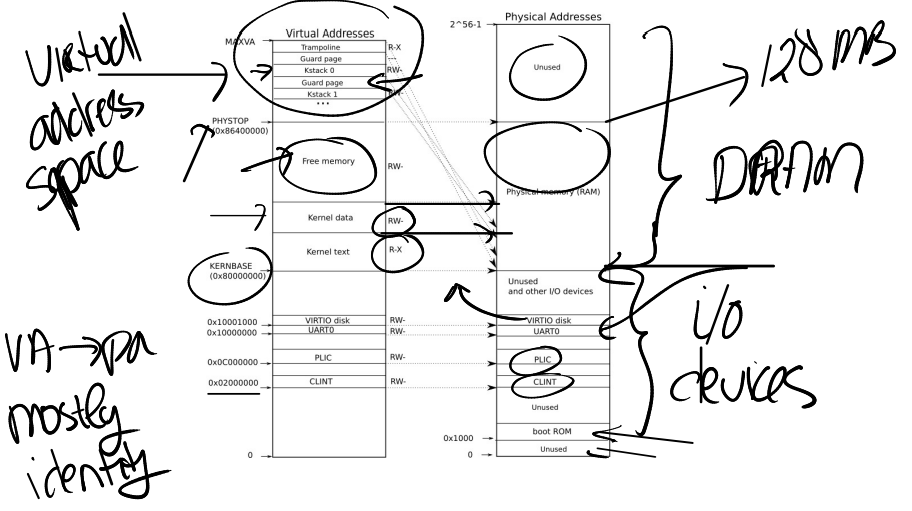

图中的右半部分的结构完全由硬件设计者决定。如你们上节课看到的一样，当操作系统启动时，会从地址`0x80000000`开始运行，这个地址其实也是由硬件设计者决定的。具体的来说，如果你们看一个主板如下：

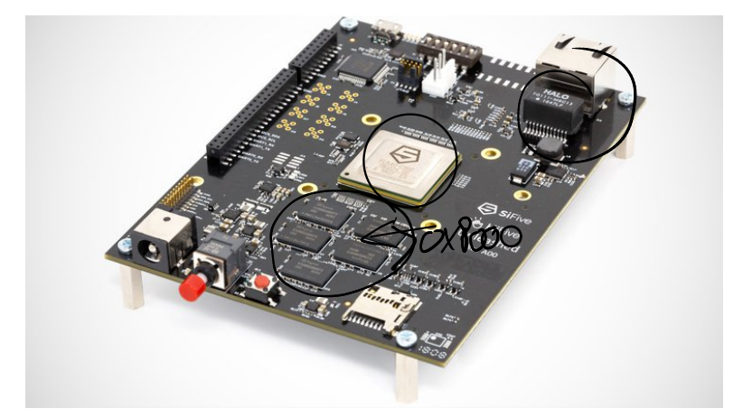

中间是RISC-V处理器，我们现在知道了处理器中有4个核，每个核都有自己的MMU和TLB。处理器旁边就是DRAM芯片。

主板的设计人员决定了，在完成了虚拟到物理地址的翻译之后，如果得到的物理地址大于0x80000000会走向DRAM芯片，如果得到的物理地址低于0x80000000会走向不同的I/O设备。这是由这个主板的设计人员决定的物理结构。如果你想要查看这里的物理结构，你可以阅读主板的手册，手册中会一一介绍物理地址对应关系。

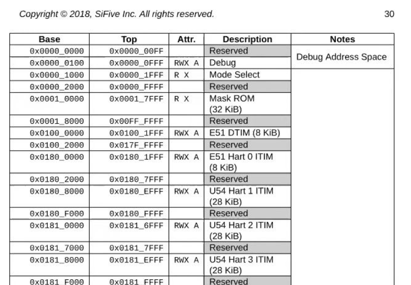

首先，地址0是保留的，地址`0x10090000`对应以太网，地址`0x80000000`对应DDR内存，处理器外的易失存储（Off-Chip Volatile Memory），也就是主板上的DRAM芯片。所以，在你们的脑海里应该要记住这张主板的图片，即使我们接下来会基于你们都知道的C语言程序---QEMU来做介绍，但是最终所有的事情都是由主板硬件决定的。

- 学生提问：当你说这里是由硬件决定的，硬件是特指CPU还是说CPU所在的主板？
- Frans教授：CPU所在的主板。CPU只是主板的一小部分，DRAM芯片位于处理器之外。是主板设计者将处理器，DRAM和许多I/O设备汇总在一起。对于一个操作系统来说，CPU只是一个部分，I/O设备同样也很重要。所以当你在写一个操作系统时，你需要同时处理CPU和I/O设备，比如你需要向互联网发送一个报文，操作系统需要调用网卡驱动和网卡来实际完成这个工作。

回到最初那张图的右侧：物理地址的分布。可以看到最下面是未被使用的地址，这与主板文档内容是一致的（地址为0）。**地址`0x1000`是boot ROM的物理地址，当你对主板上电，主板做的第一件事情就是运行存储在boot ROM中的代码，当boot完成之后，会跳转到地址`0x80000000`，操作系统需要确保那个地址有一些数据能够接着启动操作系统。**

这里还有一些其他的I/O设备：
- PLIC是中断控制器（Platform-Level Interrupt Controller）我们下周的课会讲。
- CLINT（Core Local Interruptor）也是中断的一部分。所以多个设备都能产生中断，需要中断控制器来将这些中断路由到合适的处理函数。
- UART0（Universal Asynchronous Receiver/Transmitter）负责与Console和显示器交互。
- VIRTIO disk，与磁盘进行交互。

地址`0x02000000`对应CLINT，当你向这个地址执行读写指令，你是向实现了CLINT的芯片执行读写。**这里你可以认为你直接在与设备交互，而不是读写物理内存。**

- 学生提问：确认一下，低于`0x80000000`的物理地址，不存在于DRAM中，当我们在使用这些地址的时候，指令会直接走向其他的硬件，对吗？
- Frans教授：是的。高于`0x80000000`的物理地址对应DRAM芯片，但是对于例如以太网接口，也有一个特定的低于`0x80000000`的物理地址，我们可以对这个叫做内存映射I/O（Memory-mapped I/O）的地址执行读写指令，来完成设备的操作。
- 学生提问：为什么物理地址最上面一大块标为未被使用？
- Frans教授：物理地址总共有$2^{56}$那么多，但是你不用在主板上接入那么多的内存。所以不论主板上有多少DRAM芯片，总是会有一部分物理地址没有被用到。实际上在XV6中，我们限制了内存的大小是128MB。
- 学生提问：当读指令从CPU发出后，它是怎么路由到正确的I/O设备的？比如说，当CPU要发出指令时，它可以发现现在地址是低于`0x80000000`，但是它怎么将指令送到正确的I/O设备？
- Frans教授：你可以认为在RISC-V中有一个多路输出选择器（demultiplexer）。

接下来我会切换到第一张图的左边，这就是XV6的虚拟内存地址空间。当机器刚刚启动时，还没有可用的page，XV6操作系统会设置好内核使用的虚拟地址空间，也就是这张图左边的地址分布。

因为我们想让XV6尽可能的简单易懂，所以这里的虚拟地址到物理地址的映射，大部分是相等的关系。比如说内核会按照这种方式设置page table，虚拟地址`0x02000000`对应物理地址`0x02000000`。这意味着左侧低于PHYSTOP的虚拟地址，与右侧使用的物理地址是一样的。

所以，这里的箭头都是水平的，因为这里是完全相等的映射。

除此之外，这里还有两件重要的事情：

第一件事情是，有一些page在虚拟内存中的地址很靠后，比如kernel stack在虚拟内存中的地址就很靠后。这是因为在它之下有一个未被映射的Guard page，这个Guard page对应的PTE的 Valid 标志位没有设置，这样，如果kernel stack耗尽了，它会溢出到Guard page，但是因为Guard page的PTE中Valid标志位未设置，会导致立即触发page fault，这样的结果好过内存越界之后造成的数据混乱。立即触发一个panic（也就是page fault），你就知道kernel stack出错了。同时我们也又不想浪费物理内存给Guard page，所以**Guard page不会映射到任何物理内存，它只是占据了虚拟地址空间的一段靠后的地址。**

同时，kernel stack被映射了两次，在靠后的虚拟地址映射了一次，在PHYSTOP下的Kernel data中又映射了一次，但是实际使用的时候用的是上面的部分，因为有Guard page会更加安全。

这是众多你可以通过page table实现的有意思的事情之一。你可以向同一个物理地址映射两个虚拟地址，你可以不将一个虚拟地址映射到物理地址。可以是一对一的映射，一对多映射，多对一映射。XV6至少在1-2个地方用到类似的技巧。这的kernel stack和Guard page就是XV6基于page table使用的有趣技巧的一个例子。

第二件事情是权限。例如Kernel text page被标位`R-X`，意味着你可以读它，也可以在这个地址段执行指令，但是你不能向Kernel text写数据。通过设置权限我们可以尽早的发现Bug从而避免Bug。对于Kernel data需要能被写入，所以它的标志位是RW-，但是你不能在这个地址段运行指令，所以它的X标志位未被设置。（注，所以，kernel text用来存代码，代码可以读，可以运行，但是不能篡改，kernel data用来存数据，数据可以读写，但是不能通过数据伪装代码在kernel中运行）

- 学生提问：对于不同的进程会有不同的kernel stack吗？
- Frans：答案是的。每一个用户进程都有一个对应的kernel stack
- 学生提问：用户程序的虚拟内存会映射到未使用的物理地址空间吗？
- Frans教授：在kernel page table中，有一段Free Memory，它对应了物理内存中的一段地址。XV6使用这段free memory来存放用户进程的page table，text和data。如果我们运行了非常多的用户进程，某个时间点我们会耗尽这段内存，这个时候fork或者exec会返回错误。
- 同一个学生提问：这就意味着，用户进程的虚拟地址空间会比内核的虚拟地址空间小的多，是吗？
- Frans教授：本质上来说，两边的虚拟地址空间大小是一样的。但是用户进程的虚拟地址空间使用率会更低。
- 学生提问：如果多个进程都将内存映射到了同一个物理位置，这里会优化合并到同一个地址吗？
- Frans教授：XV6不会做这样的事情，但是page table实验中有一部分就是做这个事情。真正的操作系统会做这样的工作。当你们完成了page table实验，你们就会对这些内容更加了解。
- 学生提问：每个进程都会有自己的3级树状page table，通过这个page table将虚拟地址翻译成物理地址。所以看起来当我们将内核虚拟地址翻译成物理地址时，我们并不需要kernel的page table，因为进程会使用自己的树状page table并完成地址翻译。
- Frans教授：当kernel创建了一个进程，针对这个进程的page table也会从Free memory中分配出来。内核会为用户进程的page table分配几个page，并填入PTE。在某个时间点，当内核运行了这个进程，内核会将进程的根page table的地址加载到SATP中。从那个时间点开始，处理器会使用内核为那个进程构建的虚拟地址空间。
- 同一个学生提问：所以内核为进程放弃了一些自己的内存，但是进程的虚拟地址空间理论上与内核的虚拟地址空间一样大，虽然实际中肯定不会这么大。
- Frans教授：是的，下图是用户进程的虚拟地址空间分布，与内核地址空间一样，它也是从0到MAXVA。它有由内核设置好的，专属于进程的page table来完成地址翻译。

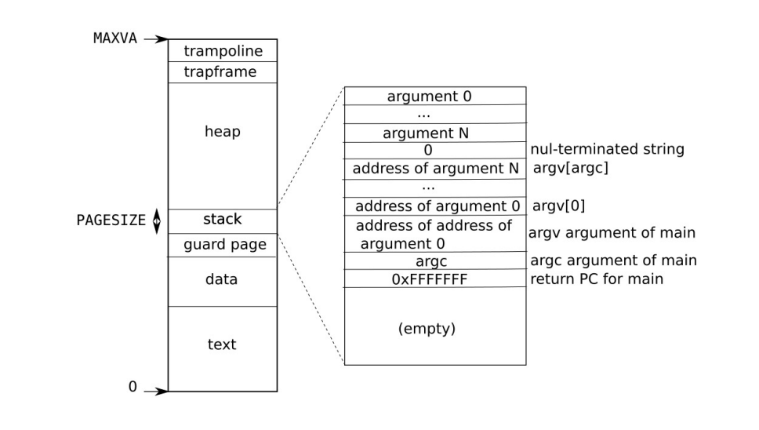

- 学生提问：但是我们不能将所有的MAXVA地址都使用吧？
- Frans教授：是的我们不能，这样我们会耗尽内存。大多数的进程使用的内存都远远小于虚拟地址空间。

## 阅读 kernel 代码

### kvminit 函数

接下来，让我们看一看代码，我认为很多东西都会因此变得更加清晰。

首先，我们来做一个的常规操作，启动我们的XV6，这里QEMU实现了主板，同时我们打开gdb。

上一次我们看了boot的流程，我们跟到了main函数。main函数中调用的一个函数是kvminit，这个函数会设置好kernel的地址空间。kvminit的代码如下图所示：

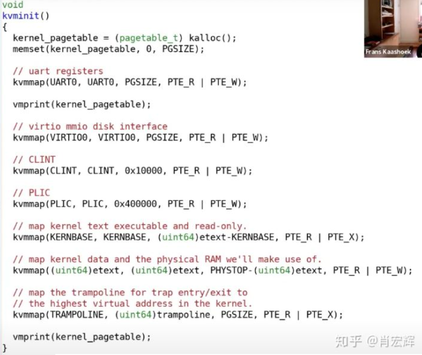

我们在前一部分看了kernel的地址空间长成什么样，这里我们来看一下代码是如何将它设置好的。首先在kvminit中设置一个断点，之后运行代码到断点位置。在gdb中执行layout split，可以看到（从上面的代码也可以看出）函数的第一步是为最高一级page directory分配物理page（注，调用kalloc就是分配物理page）。下一行将这段内存初始化为0。

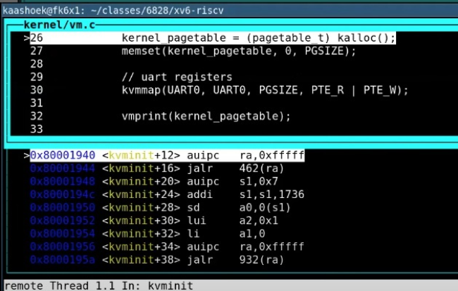

之后，通过kvmmap函数，将每一个I/O设备映射到内核。例如，下图中高亮的行将UART0映射到内核的地址空间。

我们可以查看一个文件叫做memlayout.h，它将4.5中的文档翻译成了一堆常量。在这个文件里面可以看到，UART0对应了地址0x10000000（注，之前的文档是真正SiFive RISC-V的文档，而下图是QEMU的地址，所以文档地址与这里的不符）。

所以，通过kvmmap可以将物理地址映射到相同的虚拟地址（注，因为kvmmap的前两个参数一致）。

在page table实验中，第一个练习是实现vmprint，这个函数会打印当前的kernel page table。我们现在跳过这个函数，看一下执行完第一个kvmmap时的kernel page table。

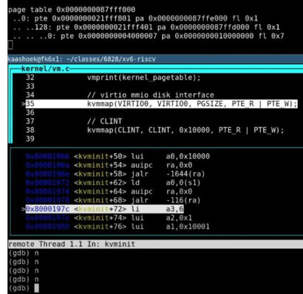

我们来看一下这里的输出。第一行是最高一级page directory的地址，这就是存在SATP或者将会存在SATP中的地址。第二行可以看到最高一级page directory只有一条PTE序号为0，它包含了中间级page directory的物理地址。第三行可以看到中间级的page directory只有一条PTE序号为128，它指向了最低级page directory的物理地址。第四行可以看到最低级的page directory包含了PTE指向物理地址。你们可以看到最低一级 page directory中PTE的物理地址就是`0x10000000`，对应了UART0。

前面是物理地址，我们可以从虚拟地址的角度来验证这里符合预期。我们将地址`0x10000000`向右移位12bit，这样可以得到虚拟地址的高27bit（index部分）。之后我们再对这部分右移位9bit，并打印成10进制数，可以得到128，这就是中间级page directory中PTE的序号。如下。

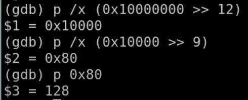

从标志位来看（fl部分），最低一级page directory中的PTE有读写标志位，并且Valid标志位也设置了。

内核会持续的按照这种方式，调用kvmmap来设置地址空间。之后会对VIRTIO0、CLINT、PLIC、kernel text、kernel data、最后是TRAMPOLINE进行地址映射。最后我们还会调用vmprint打印完整的kernel page directory，可以看出已经设置了很多PTE。

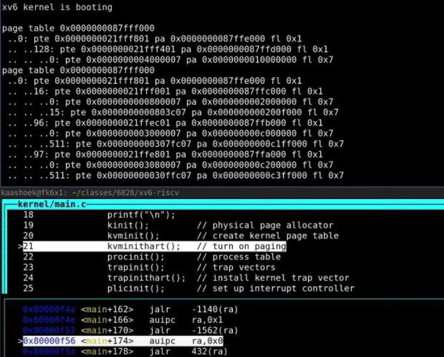

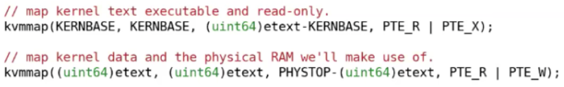

- 学生：上面这两行内存不会越界吗？
- Frans：不会。这里KERNBASE是0x80000000，这是内存开始的地址。kvmmap的第三个参数是size，etext是kernel text的最后一个地址，etext - KERNBASE会返回kernel text的字节数，我不确定这块有多大，大概是60-90个page，这部分是kernel的text部分。PHYSTOP是物理内存的最大位置，PHYSTOP-text是kernel的data部分。会有足够的DRAM来完成这里的映射。

### kvminithart 函数

之后，kvminit函数返回了，在main函数中，我们运行到了kvminithart函数。

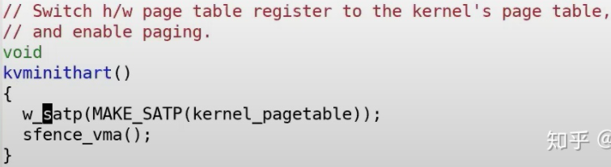

这个函数首先设置了SATP寄存器，kernel_pagetable变量来自于kvminit第一行。所以这里实际上是内核告诉MMU来使用刚刚设置好的page table。当这里这条指令执行之后，下一个指令的地址会发生什么？

在这条指令之前，还不存在可用的page table，所以也就不存在地址翻译。执行完这条指令之后，程序计数器（Program Counter）增加了4。而之后的下一条指令被执行时，程序计数器会被内存中的page table翻译。

所以这条指令的执行时刻是一个非常重要的时刻。因为整个地址翻译从这条指令之后开始生效，之后的每一个使用的内存地址都可能对应到与之不同的物理内存地址。因为在这条指令之前，我们使用的都是物理内存地址，这条指令之后page table开始生效，所有的内存地址都变成了另一个含义，也就是虚拟内存地址。

这里能正常工作的原因是值得注意的。因为前一条指令还是在物理内存中，而后一条指令已经在虚拟内存中了。比如，下一条指令地址是`0x80001110`就是一个虚拟内存地址。

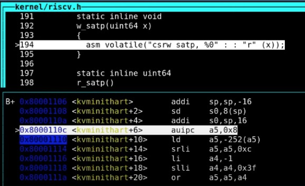

为什么这里能正常工作呢？因为kernel page的映射关系中，虚拟地址到物理地址是完全相等的。所以，在我们打开虚拟地址翻译硬件之后，地址翻译硬件会将一个虚拟地址翻译到相同的物理地址。所以实际上，我们最终还是能通过内存地址执行到正确的指令，因为经过地址翻译`0x80001110`还是对应`0x80001110`。

管理虚拟内存的一个难点是，一旦执行了类似于SATP这样的指令，你相当于将一个page table加载到了SATP寄存器，你的世界完全改变了。现在每一个地址都会被你设置好的page table所翻译。那么假设你的page table设置错误了，会发生什么呢？因为page table没有设置好，虚拟地址可能根本就翻译不了，那么内核会停止运行并panic。所以，如果page table中有bug，你将会看到奇怪的错误和崩溃，这导致了page table实验将会比较难。如果你不够小心，或者你没有完全理解一些细节，你可能会导致kernel崩溃，这将会花费一些时间和精力来追踪背后的原因。但这就是管理虚拟内存的一部分，因为对于一个这么强大的工具，如果出错了，相应的你也会得到严重的后果。我并不是要给你们泼凉水，哈哈。另一方面，这也很有乐趣，经过了page table实验，你们会真正理解虚拟内存是什么，虚拟内存能做什么。

### walk 函数

- 学生提问：我对于walk函数有个问题，从代码看它返回了最高级page table的PTE，但是它是怎么工作的呢？（注，应该是学生理解有误，walk函数模拟了MMU，返回的是va对应的最低级page table的PTE）
- Frans教授：这个函数会返回page table的PTE，而内核可以读写PTE。我来画个图，首先我们有一个page directory，这个page directory 有512个PTE。最下面是0，最上面是511。这个函数的作用是返回某一个PTE的指针。这是个虚拟地址，它指向了这个PTE。之后内核可以通过向这个地址写数据来操纵这条PTE指向的物理page。当page table被加载到SATP寄存器，这里的更改就会生效。
- 从代码看，这个函数从level2走到level1然后到level0，如果参数alloc不为0，且某一个level的page table不存在，这个函数会创建一个临时的page table，将内容初始化为0，并继续运行。所以最后总是返回的是最低一级的page directory的PTE。如果参数alloc没有设置，那么在第一个PTE对应的下一级page table不存在时就会返回。
- 学生提问：对于walk函数，我有一个比较困惑的地方，在写完SATP寄存器之后，内核还能直接访问物理地址吗？**在代码里面看起来像是通过page table将虚拟地址翻译成了物理地址，但是这个时候SATP已经被设置了，得到的物理地址不会被认为是虚拟地址吗？**
- Frans教授：让我们来看kvminithart函数，这里的kernel_page_table是一个物理地址，并写入到SATP寄存器中。从那以后，我们的代码运行在一个我们构建出来的地址空间中。在之前的kvminit函数中，kvmmap会对每个地址或者每个page调用walk函数。所以你的问题是什么？
- 学生：我想知道，在SATP寄存器设置完之后，walk是不是还是按照相同的方式工作？
- Frans：是的。**它还能工作的原因是，内核设置了虚拟地址等于物理地址的映射关系，这里很重要，因为很多地方能工作的原因都是因为内核设置的地址映射关系是相同的。**
- 学生：每一个进程的SATP寄存器存在哪？
- Frans：每个CPU核只有一个SATP寄存器，但是在每个proc结构体，如果你查看proc.h，里面有一个指向page table的指针，这对应了进程的根page table物理内存地址。
