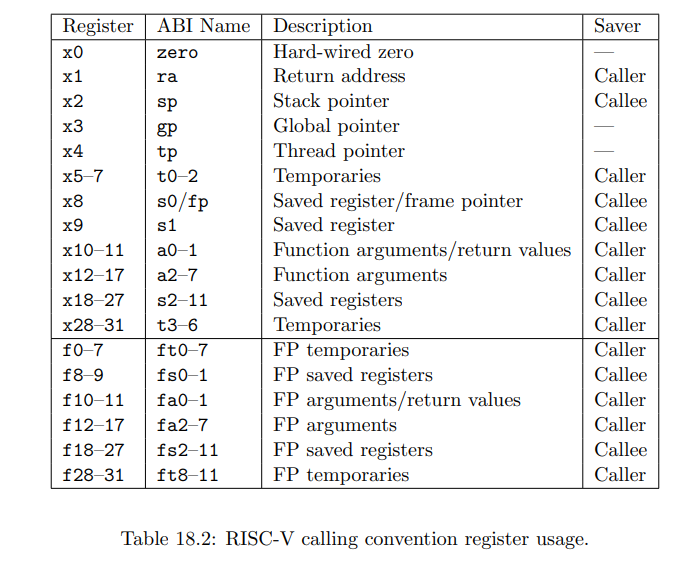

# LEC 5 (TAs/nk): Calling conventions and stack frames RISC-V

目录：

<!-- @import "[TOC]" {cmd="toc" depthFrom=2 depthTo=2 orderedList=false} -->

<!-- code_chunk_output -->

- [读书 Chapter 18 Calling Convention](#读书-chapter-18-calling-convention)

<!-- /code_chunk_output -->

细分目录：

<!-- @import "[TOC]" {cmd="toc" depthFrom=2 depthTo=6 orderedList=false} -->

<!-- code_chunk_output -->

- [读书 Chapter 18 Calling Convention](#读书-chapter-18-calling-convention)
  - [18.1 C Datatypes and Alignment](#181-c-datatypes-and-alignment)
  - [18.2 RVG Calling Convention](#182-rvg-calling-convention)
  - [18.3 Soft-Float Calling Convention](#183-soft-float-calling-convention)

<!-- /code_chunk_output -->

## 读书 Chapter 18 Calling Convention

这个章节应该节选自 RISC-V 官方说明。

### 18.1 C Datatypes and Alignment

在 RV32 中 `long` 和 `void*` 是 4 字节，而 RV64 中是 8 字节。

其他的没有差别。这也是编程题里要开 `long long` 的原因；实际上要是明确机器是 64 位直接开 `long` 就行。

### 18.2 RVG Calling Convention

If the arguments to a function are conceptualized as fields of a C struct, each with pointer alignment, the argument registers are a shadow of the first eight pointer-words of that struct. If argument i < 8 is a loating-point type, it is passed in floating-point register fai; otherwise, it is passed in integer register ai.

When primitive arguments twice the size of a pointer-word are passed on the stack, they are naturally aligned. When they are passed in the integer registers, they reside in an aligned even-odd register pair, with the even register holding the least-significant bits. In RV32, for example, the function `void foo(int, long long)` is passed its first argument in `a0` and its second in `a2` and `a3`. Nothing is passed in `a1`.

Arguments more than twice the size of a pointer-word are passed by reference.

**The portion of the conceptual struct that is not passed in argument registers is passed on the stack. The stack pointer sp points to the first argument not passed in a register.** 栈指针 sp 指向第一个没有被放进寄存器的参数。

上面这幅图应该课上会具体讲。

### 18.3 Soft-Float Calling Convention

**The soft-float calling convention is used on RV32 and RV64 implementations that lack floating point hardware.** It avoids all use of instructions in the F, D, and Q standard extensions, and hence the f registers.

涉及到一些特殊处理比如 C99 中的 `fenv.h` 等，这里不记录。
