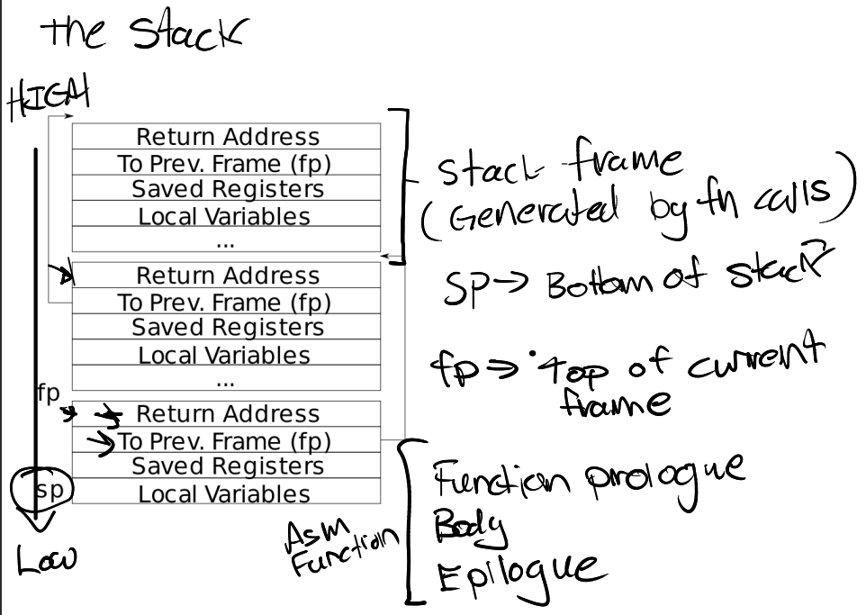

# LEC 5 (TAs/nk): Calling conventions and stack frames RISC-V

笔记大量参考了[肖宏辉](https://www.zhihu.com/people/xiao-hong-hui-15)大佬的翻译。

目录：

<!-- @import "[TOC]" {cmd="toc" depthFrom=2 depthTo=2 orderedList=false} -->

<!-- code_chunk_output -->

- [关于 RISC-V 处理器与指令集](#关于-risc-v-处理器与指令集)
- [汇编代码在内存的位置及其执行](#汇编代码在内存的位置及其执行)
- [关于 RISC-V 寄存器](#关于-risc-v-寄存器)
- [关于栈 stack](#关于栈-stack)
- [struct （内存中是一段连续的地址）](#struct-内存中是一段连续的地址)

<!-- /code_chunk_output -->

细分目录：

<!-- @import "[TOC]" {cmd="toc" depthFrom=2 depthTo=6 orderedList=false} -->

<!-- code_chunk_output -->

- [关于 RISC-V 处理器与指令集](#关于-risc-v-处理器与指令集)
  - [ISA（Instruction Sets Architecture）](#isainstruction-sets-architecture)
  - [x86指令集（CISC）](#x86指令集cisc)
  - [简单提一下 ARM 指令架构（RISC）](#简单提一下-arm-指令架构risc)
  - [RISC-V 区分了基本int指令与其他标准扩展](#risc-v-区分了基本int指令与其他标准扩展)
- [汇编代码在内存的位置及其执行](#汇编代码在内存的位置及其执行)
  - [“代码段”的具象化.text](#代码段的具象化text)
  - [关于 gdb](#关于-gdb)
- [关于 RISC-V 寄存器](#关于-risc-v-寄存器)
- [关于栈 stack](#关于栈-stack)
  - [【重要】关于stack的gdb调试（查看当前函数调用）](#重要关于stack的gdb调试查看当前函数调用)
- [struct （内存中是一段连续的地址）](#struct-内存中是一段连续的地址)

<!-- /code_chunk_output -->

## 关于 RISC-V 处理器与指令集

### ISA（Instruction Sets Architecture）

当我们说到一个RISC-V处理器时，意味着这个处理器能够理解RISC-V的指令集。所以，任何一个处理器都有一个关联的ISA（Instruction Sets Architecture），ISA就是处理器能够理解的指令集。每一条指令都有一个对应的二进制编码或者一个Opcode。当处理器在运行时，如果看见了这些编码，那么处理器就知道该做什么样的操作。

所以通常来说，要让C语言能够运行在你的处理器之上。我们首先要写出C程序，之后这个C程序需要被编译成汇编语言。这个过程中有一些链接和其他的步骤，但是因为这门课不是一个编译器的课程，所以我们忽略这些步骤。之后汇编语言会被翻译成二进制文件也就是.obj或者.o文件。

### x86指令集（CISC）

你们将会注意到，我们在这节课中反复会提到了RISC-V汇编。这一点很重要，因为汇编语言有很多种（注，因为不同的处理器指令集不一样，而汇编语言中都是一条条指令，所以不同处理器对应的汇编语言必然不一样）。如果你使用RISC-V，你不太能将Linux运行在上面。相应的，大多数现代计算机都运行在x86和x86-64处理器上。x86拥有一套不同的指令集，看起来与RISC-V非常相似。通常你们的个人电脑上运行的处理器是x86，Intel和AMD的CPU都实现了x86。

RISC-V和x86并没有它们第一眼看起来那么相似。RISC-V中的RISC是精简指令集（Reduced Instruction Set Computer）的意思，而x86通常被称为CISC，复杂指令集（Complex Instruction Set Computer）。这两者之间有一些关键的区别：
- 首先是指令的数量。实际上，创造RISC-V的一个非常大的初衷就是因为Intel手册中指令数量太多了。x86-64指令介绍由3个文档组成，并且新的指令以每个月3条的速度在增加。因为x86-64是在1970年代发布的，所以我认为现在有多于15000条指令。RISC-V指令介绍由两个文档组成。在这节课中，不需要你们记住每一个RISC-V指令，但是如果你感兴趣或者你发现你不能理解某个具体的指令的话，在课程网站的参考页面有RISC-V指令的两个文档链接。这两个文档包含了RISC-V的指令集的所有信息，分别是240页和135页，相比x86的指令集文档要小得多的多。这是有关RISC-V比较好的一个方面。所以在RISC-V中，我们有更少的指令数量。
- 除此之外，RISC-V指令也更加简单。在x86-64中，很多指令都做了不止一件事情。这些指令中的每一条都执行了一系列复杂的操作并返回结果。但是RISC-V不会这样做，RISC-V的指令趋向于完成更简单的工作，相应的也消耗更少的CPU执行时间。这其实是设计人员的在底层设计时的取舍。并没有一些非常确定的原因说RISC比CISC更好。它们各自有各自的使用场景。
- 相比x86来说， **RISC另一件有意思的事情是它是开源的。这是市场上唯一的一款开源指令集，这意味着任何人都可以为RISC-V开发主板。** RISC-V是来自于UC-Berkly的一个研究项目，之后被大量的公司选中并做了支持，网上有这些公司的名单，许多大公司对于支持一个开源指令集都感兴趣。

作为主要的RISC-V处理器生产商，SiFive宣称会发布一款基于RISC-V的主板，用来在个人计算机上运行Linux系统。

在最近几年，由于Intel的指令集是在是太大了，精简指令集的使用越来越多。Intel的指令集之所以这么大，是因为Intel对于向后兼容非常看重。所以一个现代的Intel处理器还可以运行30/40年前的指令。Intel并没有下线任何指令。而RISC-V提出的更晚，所以不存在历史包袱的问题。

- 学生提问：为什么x86会有15000条指令？
- TA：如我刚刚说的，我们需要许多指令来实现向后兼容，向后兼容是否重要因人而异。另一方面，我认为这里许多指令都是cmd指令，用来完成一些特殊的操作。我从来没有见过一个Intel的汇编代码使用了所有的15000个指令。 **大多数这些指令都是为了向后兼容和cmd的需求创建。**

### 简单提一下 ARM 指令架构（RISC）

在你们的日常生活中，你们可能已经在完全不知情的情况下使用了精简指令集。比如说ARM也是一个精简指令集，高通的Snapdragon处理器就是基于ARM。如果你使用一个Android手机，那么大概率你的手机运行在精简指令集上。如果你使用IOS，苹果公司也实现某种版本的ARM处理器，这些处理器运行在iPad，iPhone和大多数苹果移动设备上，甚至对于Mac，苹果公司也在尝试向ARM做迁移（注，刚刚发布的Macbook）。

### RISC-V 区分了基本int指令与其他标准扩展

如果查看RISC-V的文档，可以发现RISC-V的特殊之处在于：它区分了Base Integer Instruction Set和Standard Extension Instruction Set。Base Integer Instruction Set包含了所有的常用指令，比如add，mult。除此之外，处理器还可以选择性的支持Standard Extension Instruction Set。例如，一个处理器可以选择支持Standard Extension for Single-Precision Float-Point。这种模式使得RISC-V更容易支持向后兼容。 **每一个RISC-V处理器可以声明支持了哪些扩展指令集，然后编译器可以根据支持的指令集来编译代码。**

- 学生提问：看起来使用x86而不是RISC-V的唯一优势就是能得到性能的提升，但是这里的性能是以复杂度和潜在的安全为代价的，我的问题是为什么我们还在使用x86，而不是使用RISC-V处理器？
- TA：我并没有一个很好的答案来回答。现在整个世界都运行在x86上，如果你突然将处理器转变成RISC-V，那么你就会失去很多重要的软件支持。同时，Intel在它的处理器里面做了一些有意思的事情，例如安全相关的enclave，这是Intel最近加到处理器中来提升安全性的功能。此外，Intel还实现了一些非常具体的指令，这些指令可以非常高效的进行一些特定的运算。所以Intel有非常多的指令，通常来说对于一个场景都会有一个完美的指令，它的执行效率要高于RISC-V中的同等指令。但是这个问题更实际的答案是，RISC-V相对来说更新一些，目前还没有人基于RISC-V来制造个人计算机，SiFive也就是最近才成为第一批将RISC-V应用到个人计算机的公司。所以，从实际的角度来说，因为不能在RISC-V上运行所有为Intel设计的软件，是我对这个问题的最好的答案。

## 汇编代码在内存的位置及其执行

图中的代码，上半部分的注释是对应的C代码，这是个简单的函数，它累加了从1到n的所有数字，并返回结果。下半部分是可以编译出的最简单的汇编代码。如果你在你自己的计算机编写同样的C代码并编译，你得到的极有可能是差别较大的汇编代码。这里有很多原因，有一些原因我们之后会讲，有一些原因是因为编译器。当将C代码编译成汇编代码时，现代的编译器会执行各种各样的优化，所以你们自己编译得到的汇编代码可能看起来是不一样的。例如，当你在gdb中做debug的时候，有时候你会看到gdb提示你说某些变量被优化掉了，这意味着编译器决定了自己不再需要那个变量，变量以及相关的信息会在某个时间点删掉。

上图中的代码都很直观，首先将寄存器a0中的值保存在寄存器t0中。之后将寄存器a0设置为0，之后在每个循环中将t0中的数据加到a0中，直到t0变成0。这就是代码的所有内容。

> 上面的代码，真的优化了不少，甚至 for 循环都是倒序来做的。

### “代码段”的具象化.text

- 学生提问：这里面.secion，.global，.text分别是什么意思？
- TA： **global表示你可以在其他文件中调用这个函数。text表明这里的是代码，如果你还记得XV6中的下图。**

**每个进程的page table中有一个区域是text，汇编代码中的text表明这部分是代码，并且位于page table的text区域中。text中保存的就是代码。**

如果你对内核比较感兴趣，在编译完之后，你可以查看kernel.asm文件，你可以看到XV6完整内核的汇编版本。文件中每一行左边的数字表明的是这条指令会在内存中的哪个位置，这个信息非常有用。在汇编代码中还可以看到函数对应的label，以及它们是在哪里定义的。这些信息在我们调试代码的时候可能会非常非常有用，我稍后会展示这部分。

- 学生提问：.asm文件和.s文件有什么区别？
- TA：我并不是百分百确定。这两类文件都是汇编代码，.asm文件中包含大量额外的标注，而.s文件中没有。所以通常来说当你编译你的C代码，你得到的是.s文件。如果你好奇我们是如何得到.asm文件，makefile里面包含了具体的步骤。

### 关于 gdb 

之后老师关于 gdb 的展示我这里就记录要点了：
- `tui enable` 使用代码节目
- `layout split` 展示代码 `layout src` 展示源代码文件
- `layout asm` 展示汇编 `layout reg` 展示寄存器
- `focus reg` 光标到 寄存器窗口
- `info breakpoints` 查看断点
- `apropos tui` 是查看 `tui` 相关指令
- `i locals` 查看局部变量
- `watch sum` 表示当 sum 变量变化时，停下（结合 `layout src` 观察源代码确定变量以及程序运行到哪了）

## 关于 RISC-V 寄存器

你们现在对于这个表达应该都很熟悉了，这个表里面是RISC-V寄存器。寄存器是CPU或者处理器上，预先定义的可以用来存储数据的位置。寄存器之所以重要是因为汇编代码并不是在内存上执行，而是在寄存器上执行，也就是说，当我们在做add，sub时，我们是对寄存器进行操作。所以你们通常看到的汇编代码中的模式是，我们通过load将数据存放在寄存器中，这里的数据源可以是来自内存，也可以来自另一个寄存器。之后我们在寄存器上执行一些操作。如果我们对操作的结果关心的话，我们会将操作的结果store在某个地方。这里的目的地可能是内存中的某个地址，也可能是另一个寄存器。这就是通常使用寄存器的方法。

寄存器是用来进行任何运算和数据读取的最快的方式，这就是为什么使用它们很重要，也是为什么我们更喜欢使用寄存器而不是内存。当我们调用函数时，你可以看到这里有a0 - a7寄存器。通常我们在谈到寄存器的时候，我们会用它们的ABI名字。不仅是因为这样描述更清晰和标准，同时也因为在写汇编代码的时候使用的也是ABI名字。第一列中的寄存器名字并不是超级重要，它唯一重要的场景是在RISC-V的Compressed Instruction中。基本上来说，RISC-V中通常的指令是64bit，但是在Compressed Instruction中指令是16bit。**在Compressed Instruction中我们使用更少的寄存器，也就是x8 - x15寄存器。我猜你们可能会有疑问，为什么s1寄存器和其他的s寄存器是分开的，因为s1在Compressed Instruction是有效的，而s2-11却不是。除了Compressed Instruction，寄存器都是通过它们的ABI名字来引用。**

a0到a7寄存器是用来作为函数的参数。如果一个函数有超过8个参数，我们就需要用内存了。从这里也可以看出，当可以使用寄存器的时候，我们不会使用内存，我们只在不得不使用内存的场景才使用它。

表单中的第4列，Saver列，当我们在讨论寄存器的时候也非常重要。它有两个可能的值Caller，Callee。我经常混淆这两个值，因为它们只差一个字母。我发现最简单的记住它们的方法是：
- **Caller Saved寄存器在函数调用的时候不会保存**
- **Callee Saved寄存器在函数调用的时候会保存**

这里的意思是，一个Caller Saved寄存器可能被其他函数重写。假设我们在函数a中调用函数b，任何被函数a使用的并且是Caller Saved寄存器，调用函数b可能重写这些寄存器。 **我认为一个比较好的例子就是Return address寄存器（注，保存的是函数返回的地址），你可以看到ra寄存器是Caller Saved，这一点很重要，它导致了当函数a调用函数b的时侯，b会重写Return address。** 所以基本上来说，任何一个Caller Saved寄存器，作为调用方的函数要小心可能的数据可能的变化；任何一个Callee Saved寄存器，作为被调用方的函数要小心寄存器的值不会相应的变化。我经常会弄混这两者的区别，然后会到这张表来回顾它们。

如果你们还记得的话， **所有的寄存器都是64bit，各种各样的数据类型都会被改造的可以放进这64bit中。比如说我们有一个32bit的整数，取决于整数是不是有符号的，会通过在前面补32个0或者1来使得这个整数变成64bit并存在这些寄存器中。**

- 学生提问：返回值可以放在a1寄存器吗？
- TA：这是个好问题。我认为理论上是可以的，如果一个函数的返回值是long long型，也就是128bit，我们可以把它放到一对寄存器中。这也同样适用于函数的参数。所以，如果返回值超过了一个寄存器的长度，也就是64bit，我们可以将返回值保存在a0和a1。但是如果你只将返回值放在a1寄存器，我认为会出错。
- 学生提问：为什么寄存器不是连续的？比如为什么s1与其他的s寄存器是分开的？
- TA：我之前提到过，但是也只是我的猜想，我并不十分确定。因为s1寄存器在RISC-V的Compressed Instruction是可用的，所以它才被分开。
- 学生提问：除了Stack Pointer和Frame Pointer，我不认为我们需要更多的Callee Saved寄存器。
- TA：s0 - s11都是Callee寄存器，我认为它们是提供给编译器而不是程序员使用。在一些特定的场景下，你会想要确保一些数据在函数调用之后仍然能够保存，这个时候编译器可以选择使用s寄存器。

## 关于栈 stack

栈之所以很重要的原因是，它使得我们的函数变得有组织，且能够正常返回。

下面是一个非常简单的栈的结构图，其中每一个区域都是一个Stack Frame，每执行一次函数调用就会产生一个Stack Frame。

**每一次我们调用一个函数，函数都会为自己创建一个Stack Frame，并且只给自己用。函数通过移动Stack Pointer来完成Stack Frame的空间分配。**

对于Stack来说，是从高地址开始向低地址使用。所以栈总是向下增长。当我们想要创建一个新的Stack Frame的时候，总是对当前的Stack Pointer做减法。一个函数的Stack Frame包含了保存的寄存器，本地变量，并且，如果函数的参数多于8个，额外的参数会出现在Stack中。所以Stack Frame大小并不总是一样，即使在这个图里面看起来是一样大的。不同的函数有不同数量的本地变量，不同的寄存器，所以Stack Frame的大小是不一样的。但是有关Stack Frame有两件事情是确定的：
- Return address总是会出现在Stack Frame的第一位
- 指向前一个Stack Frame的指针也会出现在栈中的固定位置

有关Stack Frame中有两个重要的寄存器， **第一个是SP（Stack Pointer），它指向Stack的底部并代表了当前Stack Frame的位置。第二个是FP（Frame Pointer），它指向当前Stack Frame的顶部。** 因为Return address和指向前一个Stack Frame的的指针都在当前Stack Frame的固定位置，所以可以通过当前的FP寄存器寻址到这两个数据。

我们保存前一个Stack Frame的指针的原因是为了让我们能跳转回去。所以当前函数返回时，我们可以将前一个Frame Pointer存储到FP寄存器中。所以我们使用Frame Pointer来操纵我们的Stack Frames，并确保我们总是指向正确的函数。

Stack Frame必须要被汇编代码创建，所以是编译器生成了汇编代码，进而创建了Stack Frame。所以通常，在汇编代码中，函数的最开始你们可以看到Function prologue，之后是函数的本体，最后是Epollgue。这就是一个汇编函数通常的样子。

我们从汇编代码中来看一下这里的操作。

在我们之前的sum_to函数中，只有函数主体，并没有Stack Frame的内容。它这里能正常工作的原因是它足够简单，并且它是一个leaf函数。leaf函数是指不调用别的函数的函数，它的特别之处在于它不用担心保存自己的Return address或者任何其他的Caller Saved寄存器，因为它不会调用别的函数。

而另一个函数sum_then_double就不是一个leaf函数了，这里你可以看到它调用了sum_to。

所以在这个函数中，需要包含prologue。

这里我们对Stack Pointer减16，这样我们为新的Stack Frame创建了16字节的空间。之后我们将Return address保存在Stack Pointer位置。

之后就是调用sum_to并对结果乘以2。最后是Epilogue。

这里首先将Return address加载回ra寄存器，通过对Stack Pointer加16来删除刚刚创建的Stack Frame，最后ret从函数中退出。

### 【重要】关于stack的gdb调试（查看当前函数调用）

> 昨天还在想，怎么看是谁调用了这里的函数呢？今天看到 stack 的结构就知道了答案

- 这里我替大家问一个问题，如果我们删除掉Prologue和Epilogue，然后只剩下函数主体会发生什么？有人可以猜一下吗？
- 学生回答：sum_then_double将不知道它应该返回的Return address。所以调用sum_to的时候，Return address被覆盖了，最终sum_to函数不能返回到它原本的调用位置。

是的，完全正确，我们可以看一下具体会发生什么。先在修改过的sum_then_double设置断点，然后执行sum_then_double。

我们可以看到现在的ra寄存器是0x80006392，它指向demo2函数，也就是sum_then_double的调用函数。之后我们执行代码，调用了sum_to。

我们可以看到ra寄存器的值被sum_to重写成了0x800065f4，指向sum_then_double，这也合理，符合我们的预期。我们在函数sum_then_double中调用了sum_to，那么sum_to就应该要返回到sum_then_double。

之后执行代码直到sum_then_double返回。如前面那位同学说的，因为没有恢复sum_then_double自己的Return address，现在的Return address仍然是sum_to对应的值，现在我们就会进入到一个无限循环中。

我认为这是一个很好的例子用来展示为什么跟踪Caller和Callee寄存器是重要的。

- 学生提问，为什在最开始要对sp寄存器减16？
- TA：是为了Stack Frame创建空间。减16相当于内存地址向前移16，这样对于我们自己的Stack Frame就有了空间，我们可以在那个空间存数据。我们并不想覆盖原来在Stack Pointer位置的数据。
- 学生提问：为什么不减4呢？
- TA：我认为我们不需要减16那么多，但是4个也太少了，你至少需要减8，因为接下来要存的ra寄存器是64bit（8字节）。这里的习惯是用16字节，因为我们要存Return address和指向上一个Stack Frame的地址，只不过我们这里没有存指向上一个Stack Frame的地址。如果你看kernel.asm，你可以发现16个字节通常就是编译器的给的值。

接下来我们来看一些C代码。

demo4函数里面调用了dummymain函数。我们在dummymain函数中设置一个断点：

现在我们在dummymain函数中。如果我们在gdb中输入info frame，可以看到有关当前Stack Frame许多有用的信息。

- Stack level 0，表明这是调用栈的最底层
- pc，当前的程序计数器
- saved pc，demo4的位置，表明当前函数要返回的位置
- source language c，表明这是C代码
- Arglist at，表明参数的起始地址。当前的参数都在寄存器中，可以看到argc=3，argv是一个地址

**如果输入backtrace（简写bt）可以看到从当前调用栈开始的所有Stack Frame。**

如果对某一个Stack Frame感兴趣，可以先定位到那个frame再输入info frame，假设对syscall的Stack Frame感兴趣。**（因为 syscall 对应的是上图中栈的第三层）**

在这个Stack Frame中有更多的信息，有一堆的Saved Registers，有一些本地变量等等。这些信息对于调试代码来说超级重要。

- 学生提问：为什么有的时候编译器会优化掉argc或者argv？这个以前发生过。
- TA：这意味着编译器发现了一种更有效的方法，不使用这些变量，而是通过寄存器来完成所有的操作。如果一个变量不是百分百必要的话，这种优化还是很有常见的。我们并没有给你编译器的控制能力，但是在你们的日常使用中，你可以尝试设置编译器的optimization flag为0，不过就算这样，编译器也会做某些程度的优化。

## struct （内存中是一段连续的地址）

基本上来说，struct在内存中是一段连续的地址，如果我们有一个struct，并且有f1，f2，f3三个字段。

当我们创建这样一个struct时，内存中相应的字段会彼此相邻。**你可以认为struct像是一个数组，但是里面的不同字段的类型可以不一样。**

我们可以将struct作为参数传递给函数。

如上，我们这里给一处以 Person 结构体对象作为参数的函数打断点，可以如上查看 Person 对象的值。

- 学生提问：是谁创建了编译器来将C代码转换成各种各样的汇编代码，是不同的指令集创建者，还是第三方？
- TA：我认为不是指令集的创建者，通常是第三方创建的。你们常见的两大编译器，一个是gcc，这是由GNU基金会维护的；一个是llvm，这个是开源的，你可以查到相应的代码。当一个新的指令集，例如RISC-V，发布之后，我认为会指令集的创建者和编译器的设计者之间会有一些高度合作。简单来说我认为是第三方配合指令集的创建者完成的编译器。RISC-V或许是个例外，因为它是来自于一个研究项目，相应的团队或许自己写了编译器，但是我不认为Intel对于gcc或者llvm有任何输入。

