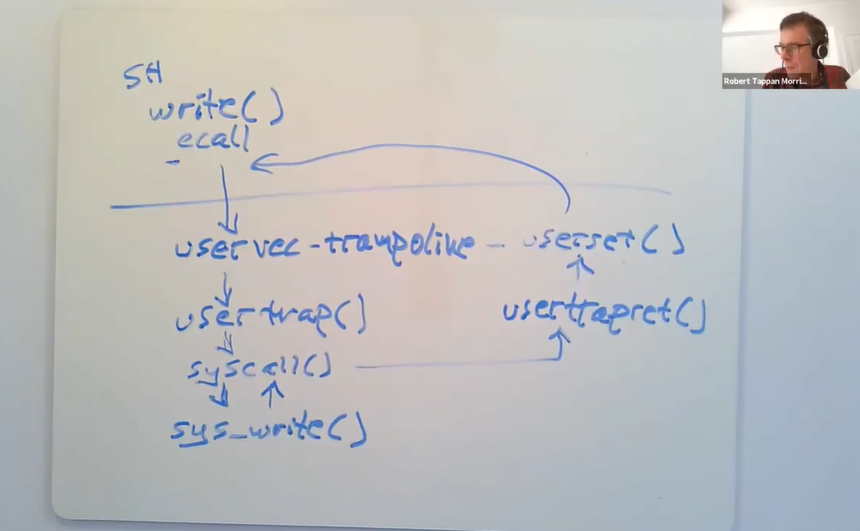
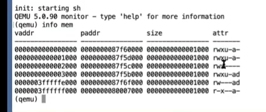
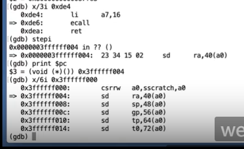
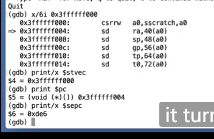
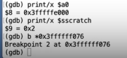
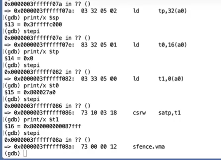
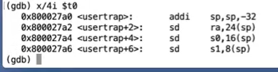

# LEC 6 (rtm): Isolation & system call entry/exit

笔记大量参考了[肖宏辉](https://www.zhihu.com/people/xiao-hong-hui-15)大佬的翻译。

目录：

<!-- @import "[TOC]" {cmd="toc" depthFrom=2 depthTo=2 orderedList=false} -->

<!-- code_chunk_output -->

- [trap概述](#trap概述)
- [使用gdb跟踪trap流程](#使用gdb跟踪trap流程)

<!-- /code_chunk_output -->

细分目录：

<!-- @import "[TOC]" {cmd="toc" depthFrom=2 depthTo=6 orderedList=false} -->

<!-- code_chunk_output -->

- [trap概述](#trap概述)
  - [trap时硬件以及kernel要做什么？](#trap时硬件以及kernel要做什么)
  - [supervisor mode能做什么](#supervisor-mode能做什么)
  - [trap 执行流程](#trap-执行流程)
- [使用gdb跟踪trap流程](#使用gdb跟踪trap流程)
  - [查看 shell 调用 write（打断点、看寄存器、看页表）](#查看-shell-调用-write打断点-看寄存器-看页表)
  - [进入 ecall](#进入-ecall)
  - [ecall 实际上只做了三件事（我们该额外做什么）](#ecall-实际上只做了三件事我们该额外做什么)
  - [trampoline page的起始，也是uservec函数的起始](#trampoline-page的起始也是uservec函数的起始)
  - [usertrap函数是位于trap.c文件的一个函数](#usertrap函数是位于trapc文件的一个函数)
  - [usertrapret函数，在返回到用户空间之前内核要做的工作](#usertrapret函数在返回到用户空间之前内核要做的工作)
  - [userret函数（又到了trampoline）](#userret函数又到了trampoline)

<!-- /code_chunk_output -->

## trap概述

### trap时硬件以及kernel要做什么？

可以肯定的是，在trap的最开始，CPU的所有状态都设置成运行用户代码而不是内核代码。在trap处理的过程中，我们实际上需要更改一些这里的状态，或者对状态做一些操作。这样我们才可以运行系统内核中普通的C程序。接下来我们先来预览一下需要做的操作：
- 首先，我们需要保存32个用户寄存器。因为很显然我们需要恢复用户应用程序的执行，尤其是当用户程序随机的被设备中断所打断时。我们希望内核能够响应中断，之后在用户程序完全无感知的情况下再恢复用户代码的执行。所以这意味着32个用户寄存器不能被内核弄乱。但是这些寄存器又要被内核代码所使用，所以在trap之前，你必须先在某处保存这32个用户寄存器。
- 程序计数器也需要在某个地方保存，它几乎跟一个用户寄存器的地位是一样的，我们需要能够在用户程序运行中断的位置继续执行用户程序。
- 我们需要将mode改成supervisor mode，因为我们想要使用内核中的各种各样的特权指令。
- SATP寄存器现在正指向user page table，而user page table只包含了用户程序所需要的内存映射和一两个其他的映射，它并没有包含整个内核数据的内存映射。所以在运行内核代码之前，我们需要将SATP指向kernel page table。
- 我们需要将堆栈寄存器指向位于内核的一个地址，因为我们需要一个堆栈来调用内核的C函数。
- 一旦我们设置好了，并且所有的硬件状态都适合在内核中使用， 我们需要跳入内核的C代码。

### supervisor mode能做什么

有一个特殊的寄存器我想讨论一下，也就是mode标志位。这里的mode表明当前是user mode还是supervisor mode。当然，当我们在用户空间时，这个标志位对应的是user mode，当我们在内核空间时，这个标志位对应supervisor mode。但是有一点很重要：当这个标志位从user mode变更到supervisor mode时，我们能得到什么样的权限。实际上，这里获得的额外权限实在是有限。也就是说，你可以在supervisor mode完成，但是不能在user mode完成的工作，或许并没有你想象的那么有特权。所以，我们接下来看看supervisor mode可以控制什么？
-其中的一件事情是，你现在可以读写控制寄存器了。比如说，当你在supervisor mode时，你可以：读写SATP寄存器，也就是page table的指针；STVEC，也就是处理trap的内核指令地址；SEPC，保存当发生trap时的程序计数器；SSCRATCH等等。在supervisor mode你可以读写这些寄存器，而用户代码不能做这样的操作。
- 另一件事情supervisor mode可以做的是，它可以使用PTE_U标志位为0的PTE。当PTE_U标志位为1的时候，表明用户代码可以使用这个页表；如果这个标志位为0，则只有supervisor mode可以使用这个页表。我们接下来会看一下为什么这很重要。
这两点就是supervisor mode可以做的事情，除此之外就不能再干别的事情了。

**需要特别指出的是，supervisor mode中的代码并不能读写任意物理地址。在supervisor mode中，就像普通的用户代码一样，也需要通过page table来访问内存。如果一个虚拟地址并不在当前由SATP指向的page table中，又或者SATP指向的page table中PTE_U=1，那么supervisor mode不能使用那个地址。所以，即使我们在supervisor mode，我们还是受限于当前page table设置的虚拟地址。**

- 学生提问：难道vm.c里的函数不是要直接访问物理内存吗？
- Robert教授：是的，这些函数能这么做的原因是，内核小心的在page table中设置好了各个PTE。这样当内核收到了一个读写虚拟内存地址的请求，会通过kernel page table将这个虚拟内存地址翻译成与之等价物理内存地址，再完成读写。所以，一旦使用了kernel page table，就可以非常方便的在内核中使用所有这些直接的映射关系。但是直到trap机制切换到内核之前，这些映射关系都不可用。直到trap机制将程序运行切换到内核空间之前，我们使用的仍然是没有这些方便映射关系的user page table。

### trap 执行流程

我们会跟踪如何在Shell中调用write系统调用。从Shell的角度来说，这就是个Shell代码中的C函数调用，但是实际上，write通过执行ECALL指令来执行系统调用。ECALL指令会切换到具有supervisor mode的内核中。在这个过程中，内核中执行的第一个指令是一个由汇编语言写的函数，叫做uservec。这个函数是内核代码trampoline.s文件的一部分。所以执行的第一个代码就是这个uservec汇编函数。



之后，在这个汇编函数中，代码执行跳转到了由C语言实现的函数usertrap中，这个函数在trap.c中。

现在代码运行在C中，所以代码更加容易理解。在usertrap这个C函数中，我们执行了一个叫做syscall的函数。

这个函数会在一个表单中，根据传入的代表系统调用的数字进行查找，并在内核中执行具体实现了系统调用功能的函数。对于我们来说，这个函数就是sys_write。

sys_write会将要显示数据输出到console上，当它完成了之后，它会返回给syscall函数。

因为我们现在相当于在ECALL之后中断了用户代码的执行，为了用户空间的代码恢复执行，需要做一系列的事情。在syscall函数中，会调用一个函数叫做usertrapret，它也位于trap.c中，这个函数完成了部分方便在C代码中实现的返回到用户空间的工作。

除此之外，最终还有一些工作只能在汇编语言中完成。这部分工作通过汇编语言实现，并且存在于trampoline.s文件中的userret函数中。

最终，在这个汇编函数中会调用机器指令返回到用户空间，并且恢复ECALL之后的用户程序的执行。

- 学生提问：这个问题或许并不完全相关，read和write系统调用，相比内存的读写，他们的代价都高的多，因为它们需要切换模式，并来回捣腾。有没有可能当你执行打开一个文件的系统调用时， 直接得到一个page table映射，而不是返回一个文件描述符？这样只需要向对应于设备的特定的地址写数据，程序就能通过page table访问特定的设备。你可以设置好限制，就像文件描述符只允许修改特定文件一样，这样就不用像系统调用一样在用户空间和内核空间来回捣腾了。
- Robert教授：这是个很好的想法。实际上很多操作系统都提供这种叫做 **内存映射文件（Memory-mapped file access）** 的机制，在这个机制里面通过page table，可以将用户空间的虚拟地址空间，对应到文件内容，这样你就可以通过内存地址直接读写文件。实际上，你们将在mmap 实验中完成这个机制。对于许多程序来说，这个机制的确会比直接调用read/write系统调用要快的多。

## 使用gdb跟踪trap流程

### 查看 shell 调用 write（打断点、看寄存器、看页表）

查看我们的 user/sh.asm ：

```asm
0000000000000dea <write>:
.global write
write:
 li a7, SYS_write
     dea:	48c1                	li	a7,16
 ecall
     dec:	00000073          	ecall
 ret
     df0:	8082                	ret
```

我们在 dec 打上断点，这样可以追踪 write 的 ecall 指令。

```sh
0x0000000000001000 in ?? ()
(gdb) b *0xdec
Breakpoint 1 at 0xdec
(gdb) c
Continuing.
[Switching to Thread 1.2]

Thread 2 hit Breakpoint 1, 0x0000000000000dec in ?? ()
=> 0x0000000000000dec:  73 00 00 00     ecall
(gdb)
```

我们删除这个断点，然后看一下 pc 寄存器和 32 个用户寄存器：

```sh
(gdb) delete 1
(gdb) print $pc
$1 = (void (*)()) 0xdec
(gdb) info reg
ra             0xe84    0xe84
sp             0x3e90   0x3e90
gp             0x505050505050505        0x505050505050505
tp             0x505050505050505        0x505050505050505
t0             0x505050505050505        361700864190383365
t1             0x505050505050505        361700864190383365
t2             0x505050505050505        361700864190383365
fp             0x3eb0   0x3eb0
s1             0x12e9   4841
a0             0x2      2
a1             0x3e9f   16031
a2             0x1      1
a3             0x505050505050505        361700864190383365
a4             0x505050505050505        361700864190383365
a5             0x24     36
a6             0x505050505050505        361700864190383365
a7             0x10     16
s2             0x24     36
s3             0x0      0
s4             0x25     37
s5             0x2      2
s6             0x3f50   16208
s7             0x1430   5168
s8             0x64     100
s9             0x6c     108
s10            0x78     120
s11            0x70     112
t3             0x505050505050505        361700864190383365
t4             0x505050505050505        361700864190383365
t5             0x505050505050505        361700864190383365
t6             0x505050505050505        361700864190383365
pc             0xdec    0xdec
```

注意到 a0 a1 a2 是 shell 传递给 write 的三个参数：文件描述符、指针、大小。

我们看看 a1 寄存器指向的那一个数据是什么：

```sh
(gdb) x/1c $a1
0x3e9f: 36 '$'
(gdb) x/2c $a1
0x3e9f: 36 '$'  48 '0'
```

**有一件事情需要注意，上图的寄存器中，程序计数器（pc）和堆栈指针（sp）的地址现在都在距离0比较近的地址，这进一步印证了当前代码运行在用户空间，因为用户空间中所有的地址都比较小。但是一旦我们进入到了内核，内核会使用大得多的内存地址。**

系统调用的时间点会有大量状态的变更，其中一个最重要的需要变更的状态，并且在它变更之前我们对它还有依赖的，就是是当前的page table。我们可以查看STAP寄存器。

```sh
(gdb) print/x $satp
$2 = 0x8000000000087f64
```

这里输出的是物理内存地址，它并没有告诉我们有关page table中的映射关系是什么，page table长什么样。但是幸运的是，在QEMU中有一个方法可以打印当前的page table。从QEMU界面，输入ctrl a + c可以进入到QEMU的console，之后输入info mem，QEMU会打印完整的page table。

```sh
(qemu) info mem
vaddr            paddr            size             attr
---------------- ---------------- ---------------- -------
000000000c000000 000000000c000000 0000000000001000 rw---ad
000000000c001000 000000000c001000 0000000000001000 rw-----
000000000c002000 000000000c002000 0000000000001000 rw---ad
000000000c003000 000000000c003000 00000000001fe000 rw-----
000000000c201000 000000000c201000 0000000000001000 rw---ad
000000000c202000 000000000c202000 0000000000001000 rw-----
000000000c203000 000000000c203000 0000000000001000 rw---ad
000000000c204000 000000000c204000 0000000000001000 rw-----
000000000c205000 000000000c205000 0000000000001000 rw---ad
000000000c206000 000000000c206000 00000000001fa000 rw-----
0000000010000000 0000000010000000 0000000000002000 rw---ad
0000000080000000 0000000080000000 0000000000007000 r-x--a-
0000000080007000 0000000080007000 0000000000001000 r-x----
0000000080008000 0000000080008000 0000000000005000 rw---ad
000000008000d000 000000008000d000 0000000000004000 rw-----
0000000080011000 0000000080011000 0000000000011000 rw---ad
0000000080022000 0000000080022000 0000000000001000 rw-----
0000000080023000 0000000080023000 0000000000003000 rw---ad
0000000080026000 0000000080026000 0000000007f36000 rw-----
0000000087f5c000 0000000087f5c000 000000000001c000 rw---ad
0000000087f78000 0000000087f78000 0000000000088000 rw-----
0000003ffff7f000 0000000087f78000 000000000003e000 rw-----
0000003fffffb000 0000000087fb6000 0000000000002000 rw---ad
0000003ffffff000 0000000080007000 0000000000001000 r-x--a-
```

教授的页表很小，表明 shell 的页表也很小（还处于用户进程的页表），我这里的页表很大，很奇怪，注意到低地址似乎包含了一些 kernel 的虚地址对物理地址的直接映射，而且页表中没有 u （PTE_U）这个状态位的。按理说现在还没有执行 ecall 应该处于用户态，页表应该是用的页表？很奇怪。



教授的 page table 如上，这是个非常小的page table，它只包含了6条映射关系。这是用户程序Shell的page table，而Shell是一个非常小的程序，这6条映射关系是有关Shell的指令和数据，以及一个无效的page用来作为guard page，以防止Shell尝试使用过多的stack page。我们可以看出这个page是无效的，因为在attr这一列它并没有设置u标志位（第三行）。attr这一列是PTE的标志位，第三行的标志位是rwx表明这个page可以读，可以写，也可以执行指令。之后的是u标志位，它表明PTE_u标志位是否被设置，用户代码只能访问u标志位设置了的PTE。再下一个标志位是Global。再下一个标志位是a（Accessed），表明这条PTE是不是被使用过。再下一个标志位d（Dirty）表明这条PTE是不是被写过。

现在，我们有了这个小小的page table。顺便说一下，最后两条PTE的虚拟地址非常大，非常接近虚拟地址的顶端，如果你读过了XV6的书，你就知道这两个page分别是trapframe page和trampoline page。你可以看到，它们都没有设置u标志，所以用户代码不能访问这两条PTE。一旦我们进入到了supervisor mode，我们就可以访问这两条PTE了。

对于这里page table，有一件事情需要注意：它并没有包含任何内核部分的地址映射，这里既没有对于kernel data的映射，也没有对于kernel指令的映射。除了最后两条PTE，这个page table几乎是完全为用户代码执行而创建，所以它对于在内核执行代码并没有直接特殊的作用。

- 学生提问：PTE中a标志位是什么意思？
- Robert教授：这表示这条PTE是不是被代码访问过，是不是曾经有一个被访问过的地址包含在这个PTE的范围内。d标志位表明是否曾经有写指令使用过这条PTE。这些标志位由硬件维护以方便操作系统使用。对于比XV6更复杂的操作系统，当物理内存吃紧的时候，可能会通过将一些内存写入到磁盘来，同时将相应的PTE设置成无效，来释放物理内存page。你可以想到，这里有很多策略可以让操作系统来挑选哪些page可以释放。我们可以查看a标志位来判断这条PTE是否被使用过，如果它没有被使用或者最近没有被使用，那么这条PTE对应的page适合用来保存到磁盘中。类似的，d标志位告诉内核，这个page最近被修改过。
不过XV6没有这样的策略。

我们看看现在的 pc ：

```sh
(gdb) x/3i 0xdea
   0xdea:       li      a7,16
=> 0xdec:       ecall
   0xdf0:       ret
(gdb) x/3i $pc - 2
   0xdea:       li      a7,16
=> 0xdec:       ecall
   0xdf0:       ret
```

**非常疑惑，我现在跟教授一样，都没有进入 ecall ，但是我的页表不是用户页表。**

### 进入 ecall

输入 `stepi` 调试了很久，我放弃了。我的 gdb 根本没有跟踪进入 ecall 的能力，直接跳到了 `0xdf0: ret` 。那就不挣扎了，先记录教授的操作吧。



- 学生提问：我想知道csrrw指令是干什么的？
- Robert教授：我们过几分钟会讨论这部分。但是对于你的问题的答案是，这条指令交换了寄存器a0和sscratch的内容。这个操作超级重要，它回答了这个问题，内核的trap代码如何能够在不使用任何寄存器的前提下做任何操作。这条指令将a0的数据保存在了sscratch中，同时又将sscratch内的数据保存在a0中。之后内核就可以任意的使用a0寄存器了。

可以看到程序计数器的值变化了，之前我们的程序计数器还在一个很小的地址0xde6（之前教授的 ecall 是在 0xde6），但是现在在一个大得多的地址。

我们还可以查看page table，我通过在QEMU中执行info mem来查看当前的page table，可以看出，这还是与之前完全相同的page table，所以page table没有改变。

根据现在的程序计数器，代码正在trampoline page的最开始，这是用户内存中一个非常大的地址。所以现在我们的指令正运行在内存的trampoline page中。我们可以来查看一下现在将要运行的指令。

这些指令是内核在supervisor mode中将要执行的最开始的几条指令，也是在trap机制中最开始要执行的几条指令。因为gdb有一些奇怪的行为，我们实际上已经执行了位于trampoline page最开始的一条指令（注，也就是csrrw指令），我们将要执行的是第二条指令。

我们可以查看寄存器，寄存器的值并没有改变，这里还是用户程序拥有的一些寄存器内容。



我们现在在这个地址0x3ffffff000，也就是上面page table输出的最后一个page，这是trampoline page。我们现在正在trampoline page中执行程序，这个page包含了内核的trap处理代码。ecall并不会切换page table，这是ecall指令的一个非常重要的特点。**所以这意味着，trap处理代码必须存在于每一个user page table中。因为ecall并不会切换page table，我们需要在user page table中的某个地方来执行最初的内核代码。而这个trampoline page，是由内核小心的映射到每一个user page table中，以使得当我们仍然在使用user page table时，内核在一个地方能够执行trap机制的最开始的一些指令。**

这里的控制是通过STVEC寄存器完成的，这是一个只能在supervisor mode下读写的特权寄存器。在从用户空间进入到内核空间之前，内核会设置好STVEC寄存器指向内核希望trap代码运行的位置。

所以如你所见， **内核已经事先设置好了STVEC寄存器的内容为0x3ffffff000，这就是trampoline page的起始位置。** STVEC寄存器的内容，就是在ecall指令执行之后，我们会在这个特定地址执行指令的原因。

### ecall 实际上只做了三件事（我们该额外做什么）

即使trampoline page是在用户地址空间的user page table完成的映射，用户代码不能写它，因为这些page对应的PTE并没有设置PTE_u标志位。这也是为什么trap机制是安全的。

我一直在告诉你们我们现在已经在supervisor mode了，但是实际上我并没有任何能直接确认当前在哪种mode下的方法。不过我的确发现程序计数器现在正在trampoline page执行代码，而这些page对应的PTE并没有设置PTE_u标志位。所以现在只有当代码在supervisor mode时，才可能在程序运行的同时而不崩溃。所以，我从代码没有崩溃和程序计数器的值推导出我们必然在supervisor mode。

我们是通过ecall走到trampoline page的，而ecall实际上只会改变三件事情：

第一，ecall将代码从user mode改到supervisor mode。

第二，ecall将程序计数器的值保存在了SEPC寄存器。我们可以通过打印程序计数器看到这里的效果如下。

尽管其他的寄存器还是还是用户寄存器，但是这里的程序计数器明显已经不是用户代码的程序计数器。这里的程序计数器是从STVEC寄存器拷贝过来的值。我们也可以打印SEPC（Supervisor Exception Program Counter）寄存器，这是ecall保存用户程序计数器的地方。

这个寄存器里面有熟悉的地址0xde6，这是ecall指令在用户空间的地址。所以ecall至少保存了程序计数器的数值。

第三，ecall会跳转到STVEC寄存器指向的指令。

所以现在，ecall帮我们做了一点点工作，但是实际上我们离执行内核中的C代码还差的很远。接下来：
- 我们需要保存32个用户寄存器的内容，这样当我们想要恢复用户代码执行时，我们才能恢复这些寄存器的内容。
- 因为现在我们还在user page table，我们需要切换到kernel page table。
- 我们需要创建或者找到一个kernel stack，并将Stack Pointer寄存器的内容指向那个kernel stack。这样才能给C代码提供栈。
- 我们还需要跳转到内核中C代码的某些合理的位置。

ecall并不会为我们做这里的任何一件事。

当然，我们可以通过修改硬件让ecall为我们完成这些工作，而不是交给软件来完成。并且，我们也将会看到，在软件中完成这些工作并不是特别简单。所以你现在就会问，为什么ecall不多做点工作来将代码执行从用户空间切换到内核空间呢？为什么ecall不会保存用户寄存器，或者切换page table指针来指向kernel page table，或者自动的设置Stack Pointer指向kernel stack，或者直接跳转到kernel的C代码，而不是在这里运行复杂的汇编代码？

实际上，有的机器在执行系统调用时，会在硬件中完成所有这些工作。但是RISC-V并不会，RISC-V秉持了这样一个观点：ecall只完成尽量少必须要完成的工作，其他的工作都交给软件完成。这里的原因是，RISC-V设计者想要为软件和操作系统的程序员提供最大的灵活性，这样他们就能按照他们想要的方式开发操作系统。所以你可以这样想，尽管XV6并没有使用这里提供的灵活性，但是一些其他的操作系统用到了。

举个例子，因为这里的ecall是如此的简单，或许某些操作系统可以在不切换page table的前提下，执行部分系统调用。切换page table的代价比较高，如果ecall打包完成了这部分工作，那就不可能对一些系统调用进行改进，使其不用在不必要的场景切换page table。

某些操作系统同时将user和kernel的虚拟地址映射到一个page table中，这样在user和kernel之间切换时根本就不用切换page table。对于这样的操作系统来说，如果ecall切换了page table那将会是一种浪费，并且也减慢了程序的运行。

或许在一些系统调用过程中，一些寄存器不用保存，而哪些寄存器需要保存，哪些不需要，取决于于软件，编程语言，和编译器。通过不保存所有的32个寄存器或许可以节省大量的程序运行时间，所以你不会想要ecall迫使你保存所有的寄存器。

最后，对于某些简单的系统调用或许根本就不需要任何stack，所以对于一些非常关注性能的操作系统，ecall不会自动为你完成stack切换是极好的。

所以，ecall尽量的简单可以提升软件设计的灵活性。

- 学生提问：为什么我们在gdb中看不到ecall的具体内容？或许我错过了，但是我觉得我们是直接跳到trampoline代码的。
- Robert教授：ecall只会更新CPU中的mode标志位为supervisor，并且设置程序计数器成STVEC寄存器内的值。在进入到用户空间之前，内核会将trampoline page的地址存在STVEC寄存器中。所以ecall的下一条指令的位置是STVEC指向的地址，也就是trampoline page的起始地址。（注，实际上ecall是CPU的指令，自然在gdb中看不到具体内容）

### trampoline page的起始，也是uservec函数的起始

我们现在需要做的第一件事情就是保存寄存器的内容。在RISC-V上，如果不能使用寄存器，基本上不能做任何事情。所以，对于保存这些寄存器，我们有什么样的选择呢？

在一些其他的机器中，我们或许直接就将32个寄存器中的内容写到物理内存中某些合适的位置。但是我们不能在RISC-V中这样做，因为在RISC-V中，supervisor mode下的代码不允许直接访问物理内存。所以我们只能使用page table中的内容，但是从前面的输出来看，page table中也没有多少内容。

虽然XV6并没有使用，但是另一种可能的操作是，直接将SATP寄存器指向kernel page table，之后我们就可以直接使用所有的kernel mapping来帮助我们存储用户寄存器。这是合法的，因为supervisor mode可以更改SATP寄存器。但是在trap代码当前的位置，也就是trap机制的最开始，我们并不知道kernel page table的地址。并且更改SATP寄存器的指令，要求写入SATP寄存器的内容来自于另一个寄存器。所以，为了能执行更新page table的指令，我们需要一些空闲的寄存器，这样我们才能先将page table的地址存在这些寄存器中，然后再执行修改SATP寄存器的指令。

对于保存用户寄存器，XV6在RISC-V上的实现包括了两个部分。第一个部分是，XV6在每个user page table映射了trapframe page，这样每个进程都有自己的trapframe page。这个page包含了很多有趣的数据，但是现在最重要的数据是用来保存用户寄存器的32个空槽位。所以，在trap处理代码中，现在的好消息是，我们在user page table有一个之前由kernel设置好的映射关系，这个映射关系指向了一个可以用来存放这个进程的用户寄存器的内存位置。这个位置的虚拟地址总是0x3ffffffe000。

如果你想查看XV6在trapframe page中存放了什么，这部分代码在proc.h中的trapframe结构体中。

```c
// per-process data for the trap handling code in trampoline.S.
// sits in a page by itself just under the trampoline page in the
// user page table. not specially mapped in the kernel page table.
// the sscratch register points here.
// uservec in trampoline.S saves user registers in the trapframe,
// then initializes registers from the trapframe's
// kernel_sp, kernel_hartid, kernel_satp, and jumps to kernel_trap.
// usertrapret() and userret in trampoline.S set up
// the trapframe's kernel_*, restore user registers from the
// trapframe, switch to the user page table, and enter user space.
// the trapframe includes callee-saved user registers like s0-s11 because the
// return-to-user path via usertrapret() doesn't return through
// the entire kernel call stack.
struct trapframe {
  /*   0 */ uint64 kernel_satp;   // kernel page table
  /*   8 */ uint64 kernel_sp;     // top of process's kernel stack
  /*  16 */ uint64 kernel_trap;   // usertrap()
  /*  24 */ uint64 epc;           // saved user program counter
  /*  32 */ uint64 kernel_hartid; // saved kernel tp
  /*  40 */ uint64 ra;
  /*  48 */ uint64 sp;
  /*  56 */ uint64 gp;
  /*  64 */ uint64 tp;
  /*  72 */ uint64 t0;
  /*  80 */ uint64 t1;
  /*  88 */ uint64 t2;
  /*  96 */ uint64 s0;
  /* 104 */ uint64 s1;
  /* 112 */ uint64 a0;
  /* 120 */ uint64 a1;
  /* 128 */ uint64 a2;
  /* 136 */ uint64 a3;
  /* 144 */ uint64 a4;
  /* 152 */ uint64 a5;
  /* 160 */ uint64 a6;
  /* 168 */ uint64 a7;
  /* 176 */ uint64 s2;
  /* 184 */ uint64 s3;
  /* 192 */ uint64 s4;
  /* 200 */ uint64 s5;
  /* 208 */ uint64 s6;
  /* 216 */ uint64 s7;
  /* 224 */ uint64 s8;
  /* 232 */ uint64 s9;
  /* 240 */ uint64 s10;
  /* 248 */ uint64 s11;
  /* 256 */ uint64 t3;
  /* 264 */ uint64 t4;
  /* 272 */ uint64 t5;
  /* 280 */ uint64 t6;
};
```

你可以看到很多槽位的名字都对应了特定的寄存器。在最开始还有5个数据，这些是内核事先存放在trapframe中的数据。比如第一个数据保存了kernel page table地址，这将会是trap处理代码将要加载到SATP寄存器的数值。

所以，如何保存用户寄存器的一半答案是，内核非常方便的将trapframe page映射到了每个user page table。

另一半的答案在于我们之前提过的SSCRATCH寄存器。这个由RISC-V提供的SSCRATCH寄存器，就是为接下来的目的而创建的。在进入到user space之前，内核会将trapframe page的地址保存在这个寄存器中，也就是0x3fffffe000这个地址。更重要的是，RISC-V有一个指令允许交换任意两个寄存器的值。而SSCRATCH寄存器的作用就是保存另一个寄存器的值，并将自己的值加载给另一个寄存器。查看trampoline.S代码如下。

```S
.globl uservec
uservec:    
	#
        # trap.c sets stvec to point here, so
        # traps from user space start here,
        # in supervisor mode, but with a
        # user page table.
        #
        # sscratch points to where the process's p->trapframe is
        # mapped into user space, at TRAPFRAME.
        #
        
	# swap a0 and sscratch
        # so that a0 is TRAPFRAME
        csrrw a0, sscratch, a0

        # save the user registers in TRAPFRAME
        sd ra, 40(a0)
        sd sp, 48(a0)
        sd gp, 56(a0)
        sd tp, 64(a0)
        sd t0, 72(a0)
        sd t1, 80(a0)
        sd t2, 88(a0)
        sd s0, 96(a0)
        sd s1, 104(a0)
        sd a1, 120(a0)
        sd a2, 128(a0)
        sd a3, 136(a0)
        sd a4, 144(a0)
        sd a5, 152(a0)
        sd a6, 160(a0)
        sd a7, 168(a0)
        sd s2, 176(a0)
        sd s3, 184(a0)
        sd s4, 192(a0)
        sd s5, 200(a0)
        sd s6, 208(a0)
        sd s7, 216(a0)
        sd s8, 224(a0)
        sd s9, 232(a0)
        sd s10, 240(a0)
        sd s11, 248(a0)
        sd t3, 256(a0)
        sd t4, 264(a0)
        sd t5, 272(a0)
        sd t6, 280(a0)

        # save the user a0 in p->trapframe->a0
        csrr t0, sscratch
        sd t0, 112(a0)

        ...
```

第一件事情就是执行csrrw指令，这个指令交换了a0和sscratch两个寄存器的内容。为了看这里的实际效果，我们来打印a0：



a0现在的值是0x3fffffe000，这是trapframe page的虚拟地址。它之前保存在SSCRATCH寄存器中，但是我们现在交换到了a0中。如上，我们也可以打印SSCRATCH寄存器，它现在的内容是2，这是a0寄存器之前的值。a0寄存器保存的是write函数的第一个参数，在这个场景下，是Shell传入的文件描述符2。所以我们现在将a0的值保存起来了，并且我们有了指向trapframe page的指针。现在我们正在朝着保存用户寄存器的道路上前进。实际上，这就是trampoline.S中接下来30多个奇怪指令的工作。这些指令就是的执行sd，将每个寄存器保存在trapframe的不同偏移位置。因为a0在交换完之后包含的是trapframe page地址，也就是0x3fffffe000。所以，每个寄存器被保存在了偏移量+a0的位置。这些存储的指令比较无聊，我就不介绍了。

为什么这些寄存器保存在trapframe，而不是用户代码的栈中？这个问题的答案是，我们不确定用户程序是否有栈，必然有一些编程语言没有栈，对于这些编程语言的程序，Stack Pointer不指向任何地址。当然，也有一些编程语言有栈，但是或许它的格式很奇怪，内核并不能理解。比如，编程语言以堆中以小块来分配栈，编程语言的运行时知道如何使用这些小块的内存来作为栈，但是内核并不知道。所以，如果我们想要运行任意编程语言实现的用户程序，内核就不能假设用户内存的哪部分可以访问，哪部分有效，哪部分存在。所以内核需要自己管理这些寄存器的保存，这就是为什么内核将这些内容保存在属于内核内存的trapframe中，而不是用户内存。

对于接下来的汇编：

```S
        # restore kernel stack pointer from p->trapframe->kernel_sp
        ld sp, 8(a0)
```

这条指令正在将a0指向的内存地址往后数的第8个字节开始的数据加载到Stack Pointer寄存器。a0的内容现在是trapframe page的地址，从本节第一张图中，trapframe的格式可以看出，第8个字节开始的数据是内核的Stack Pointer（kernel_sp）。trapframe中的kernel_sp是由kernel在进入用户空间之前就设置好的，它的值是这个进程的kernel stack。所以这条指令的作用是初始化Stack Pointer指向这个进程的kernel stack的最顶端。

这是这个进程的kernel stack。因为XV6在每个kernel stack下面放置一个guard page，所以kernel stack的地址都比较大。

```S
        # make tp hold the current hartid, from p->trapframe->kernel_hartid
        ld tp, 32(a0)
```

如上，下一条指令是向tp寄存器写入数据。因为在RISC-V中，没有一个直接的方法来确认当前运行在多核处理器的哪个核上，XV6会将CPU核的编号也就是hartid保存在tp寄存器。在内核中好几个地方都会使用了这个值，例如，内核可以通过这个值确定某个CPU核上运行了哪些进程。


我们现在运行在CPU核0，这说的通，因为我之前配置了QEMU只给XV6分配一个核，所以我们只能运行在核0上。



下一条指令是向t0寄存器写入数据。这里写入的是我们将要执行的第一个C函数的指针，也就是函数usertrap的指针。我们在后面会使用这个指针。

下一条指令是向t1寄存器写入数据。这里写入的是kernel page table的地址，我们可以打印t1寄存器的内容。

实际上严格来说，t1的内容并不是kernel page table的地址，这是你需要向SATP寄存器写入的数据。它包含了kernel page table的地址，但是移位了，并且包含了各种标志位。

下一条指令是交换SATP和t1寄存器。这条指令执行完成之后，当前程序会从user page table切换到kernel page table。现在我们在QEMU中打印page table，可以看出与之前的page table完全不一样。

现在这里输出的是由内核设置好的巨大的kernel page table。所以现在我们成功的切换了page table，我们在这个位置进展的很好，Stack Pointer指向了kernel stack；我们有了kernel page table，可以读取kernel data。我们已经准备好了执行内核中的C代码了。

**这里还有个问题，为什么代码没有崩溃？毕竟我们在内存中的某个位置执行代码，程序计数器保存的是虚拟地址，如果我们切换了page table，为什么同一个虚拟地址不会通过新的page table寻址走到一些无关的page中？看起来我们现在没有崩溃并且还在执行这些指令。有人来猜一下原因吗？**

**学生回答：因为我们还在trampoline代码中，而trampoline代码在用户空间和内核空间都映射到了同一个地址。**

完全正确。我不知道你们是否还记得user page table的内容，trampoline page在user page table中的映射与kernel page table中的映射是完全一样的。这两个page table中其他所有的映射都是不同的，只有trampoline page的映射是一样的，因此我们在切换page table时，寻址的结果不会改变，我们实际上就可以继续在同一个代码序列中执行程序而不崩溃。这是trampoline page的特殊之处，它同时在user page table和kernel page table都有相同的映射关系。

**之所以叫trampoline page，是因为你某种程度在它上面“弹跳”了一下，然后从用户空间走到了内核空间。**

最后一条指令是jr t0。执行了这条指令，我们就要从trampoline跳到内核的C代码中。这条指令的作用是跳转到t0指向的函数中。我们打印t0对应的一些指令：



可以看到t0的位置对应于一个叫做usertrap函数的开始。接下来我们就要以kernel stack，kernel page table跳转到usertrap函数。

### usertrap函数是位于trap.c文件的一个函数

```c
//
// handle an interrupt, exception, or system call from user space.
// called from trampoline.S
//
void
usertrap(void)
{
  int which_dev = 0;

  if((r_sstatus() & SSTATUS_SPP) != 0)
    panic("usertrap: not from user mode");

  // send interrupts and exceptions to kerneltrap(),
  // since we're now in the kernel.
  w_stvec((uint64)kernelvec);

  struct proc *p = myproc();
  
  // save user program counter.
  p->trapframe->epc = r_sepc();
  
  if(r_scause() == 8){
    // system call

    if(p->killed)
      exit(-1);

    // sepc points to the ecall instruction,
    // but we want to return to the next instruction.
    p->trapframe->epc += 4;

    // an interrupt will change sstatus &c registers,
    // so don't enable until done with those registers.
    intr_on();

    syscall();
  } else if((which_dev = devintr()) != 0){
    // ok
  } else {
    printf("usertrap(): unexpected scause %p pid=%d\n", r_scause(), p->pid);
    printf("            sepc=%p stval=%p\n", r_sepc(), r_stval());
    p->killed = 1;
  }

  if(p->killed)
    exit(-1);

  // give up the CPU if this is a timer interrupt.
  if(which_dev == 2)
    yield();

  usertrapret();
}
```

既然我们已经运行在C代码中，接下来，教授在gdb中输入tui enable打开对于C代码的展示。

我们现在在一个更加正常的世界中，我们正在运行C代码，应该会更容易理解。我们仍然会读写一些有趣的控制寄存器，但是环境比起汇编语言来说会少了很多晦涩。

**有很多原因都可以让程序运行进入到usertrap函数中来，比如系统调用，运算时除以0，使用了一个未被映射的虚拟地址，或者是设备中断。usertrap某种程度上存储并恢复硬件状态，但是它也需要检查触发trap的原因，以确定相应的处理方式，我们在接下来执行usertrap的过程中会同时看到这两个行为。**

接下来，让我们一步步执行usertrap函数。

它做的第一件事情是更改STVEC寄存器。取决于trap是来自于用户空间还是内核空间，实际上XV6处理trap的方法是不一样的。目前为止，我们只讨论过当trap是由用户空间发起时会发生什么。如果trap从内核空间发起，将会是一个非常不同的处理流程，因为从内核发起的话，程序已经在使用kernel page table。所以当trap发生时，程序执行仍然在内核的话，很多处理都不必存在。

在内核中执行任何操作之前，usertrap中先将STVEC指向了kernelvec变量，这是内核空间trap处理代码的位置，而不是用户空间trap处理代码的位置。

出于各种原因，我们需要知道当前运行的是什么进程，我们通过调用myproc函数来做到这一点。 **myproc函数实际上会查找一个根据当前CPU核的编号索引的数组，CPU核的编号是hartid，如果你还记得，我们之前在uservec函数中将它存在了tp寄存器。这是myproc函数找出当前运行进程的方法。**

接下来我们要保存用户程序计数器，它仍然保存在SEPC寄存器中，但是可能发生这种情况：当程序还在内核中执行时，我们可能切换到另一个进程，并进入到那个程序的用户空间，然后那个进程可能再调用一个系统调用进而导致SEPC寄存器的内容被覆盖。所以，我们需要保存当前进程的SEPC寄存器到一个与该进程关联的内存中，这样这个数据才不会被覆盖。这里我们使用trapframe来保存这个程序计数器。

接下来我们需要找出我们现在会在usertrap函数的原因。根据触发trap的原因，RISC-V的SCAUSE寄存器会有不同的数字。数字8表明，我们现在在trap代码中是因为系统调用。可以打印SCAUSE寄存器，它的确包含了数字8，我们的确是因为系统调用才走到这里的。


在RISC-V中，存储在SEPC寄存器中的程序计数器，是用户程序中触发trap的指令的地址。但是当我们恢复用户程序时，我们希望在下一条指令恢复，也就是ecall之后的一条指令。所以对于系统调用，我们对于保存的用户程序计数器加4，这样我们会在ecall的下一条指令恢复，而不是重新执行ecall指令。

`intr_on();` **XV6会在处理系统调用的时候使能中断，这样中断可以更快的服务，有些系统调用需要许多时间处理。中断总是会被RISC-V的trap硬件关闭，所以在这个时间点，我们需要显式的打开中断。**

下一行代码中，我们会调用syscall函数。这个函数定义在syscall.c。

最后，usertrap调用了一个函数usertrapret。

### usertrapret函数，在返回到用户空间之前内核要做的工作

```c
//
// return to user space
//
void
usertrapret(void)
{
  struct proc *p = myproc();

  // we're about to switch the destination of traps from
  // kerneltrap() to usertrap(), so turn off interrupts until
  // we're back in user space, where usertrap() is correct.
  intr_off();

  // send syscalls, interrupts, and exceptions to trampoline.S
  w_stvec(TRAMPOLINE + (uservec - trampoline));

  // set up trapframe values that uservec will need when
  // the process next re-enters the kernel.
  p->trapframe->kernel_satp = r_satp();         // kernel page table
  p->trapframe->kernel_sp = p->kstack + PGSIZE; // process's kernel stack
  p->trapframe->kernel_trap = (uint64)usertrap;
  p->trapframe->kernel_hartid = r_tp();         // hartid for cpuid()

  // set up the registers that trampoline.S's sret will use
  // to get to user space.
  
  // set S Previous Privilege mode to User.
  unsigned long x = r_sstatus();
  x &= ~SSTATUS_SPP; // clear SPP to 0 for user mode
  x |= SSTATUS_SPIE; // enable interrupts in user mode
  w_sstatus(x);

  // set S Exception Program Counter to the saved user pc.
  w_sepc(p->trapframe->epc);

  // tell trampoline.S the user page table to switch to.
  uint64 satp = MAKE_SATP(p->pagetable);

  // jump to trampoline.S at the top of memory, which 
  // switches to the user page table, restores user registers,
  // and switches to user mode with sret.
  uint64 fn = TRAMPOLINE + (userret - trampoline);
  ((void (*)(uint64,uint64))fn)(TRAPFRAME, satp);
}
```

`intr_off();` 它首先关闭了中断。我们之前在系统调用的过程中是打开了中断的，这里关闭中断是因为我们将要更新STVEC寄存器来指向用户空间的trap处理代码，而之前在内核中的时候，我们指向的是内核空间的trap处理代码。我们关闭中断因为当我们将STVEC更新到指向用户空间的trap处理代码时，我们仍然在内核中执行代码。如果这时发生了一个中断，那么程序执行会走向用户空间的trap处理代码，即便我们现在仍然在内核中，出于各种各样具体细节的原因，这会导致内核出错。所以我们这里关闭中断。

在下一行我们设置了STVEC寄存器指向trampoline代码， **在那里最终会执行sret指令返回到用户空间。位于trampoline代码最后的sret指令会重新打开中断。这样，即使我们刚刚关闭了中断，当我们在执行用户代码时中断是打开的。**

接下来的几行填入了trapframe的内容，这些内容对于执行trampoline代码非常有用。这里的代码就是：
- 存储了kernel page table的指针
- 存储了当前用户进程的kernel stack
- 存储了usertrap函数的指针，这样trampoline代码才能跳转到这个函数（注，详见 `ld t0 (16)a0` 指令）
- 从tp寄存器中读取当前的CPU核编号，并存储在trapframe中，这样trampoline代码才能恢复这个数字，因为用户代码可能会修改这个数字
- 现在我们在usertrapret函数中，我们正在设置trapframe中的数据，这样下一次从用户空间转换到内核空间时可以用到这些数据。

- 学生提问：为什么trampoline代码中不保存SEPC寄存器？
- Robert教授：可以存储。trampoline代码没有像其他寄存器一样保存这个寄存器，但是我们非常欢迎大家修改XV6来保存它。如果你还记得的话，这个寄存器实际上是在C代码usertrap中保存的，而不是在汇编代码trampoline中保存的。我想不出理由这里哪种方式更好。用户寄存器（User Registers）必须在汇编代码中保存，因为任何需要经过编译器的语言，例如C语言，都不能修改任何用户寄存器。所以对于用户寄存器，必须要在进入C代码之前在汇编代码中保存好。但是对于SEPC寄存器（注，控制寄存器），我们可以早点保存或者晚点保存。

接下来我们要设置SSTATUS寄存器，这是一个控制寄存器。这个寄存器的SPP bit位控制了sret指令的行为，该bit为0表示下次执行sret的时候，我们想要返回user mode而不是supervisor mode。这个寄存器的SPIE bit位控制了，在执行完sret之后，是否打开中断。因为我们在返回到用户空间之后，我们的确希望打开中断，所以这里将SPIE bit位设置为1。修改完这些bit位之后，我们会把新的值写回到SSTATUS寄存器。

我们在trampoline代码的最后执行了sret指令。这条指令会将程序计数器设置成SEPC寄存器的值，所以现在我们将SEPC寄存器的值设置成之前保存的用户程序计数器的值。在不久之前，我们在usertrap函数中将用户程序计数器保存在trapframe中的epc字段。

接下来，我们根据user page table地址生成相应的SATP值，这样我们在返回到用户空间的时候才能完成page table的切换。实际上，我们会在汇编代码trampoline中完成page table的切换，并且也只能在trampoline中完成切换，因为只有trampoline中代码是同时在用户和内核空间中映射。但是我们现在还没有在trampoline代码中，我们现在还在一个普通的C函数中，所以这里我们将page table指针准备好，并将这个指针作为第二个参数传递给汇编代码，这个参数会出现在a1寄存器。

倒数第二行的作用是计算出我们将要跳转到汇编代码的地址。我们期望跳转的地址是tampoline中的userret函数，这个函数包含了所有能将我们带回到用户空间的指令。所以这里我们计算出了userret函数的地址。

倒数第一行，将fn指针作为一个函数指针，执行相应的函数（也就是userret函数）并传入两个参数，两个参数存储在a0，a1寄存器中。

### userret函数（又到了trampoline）

```S
.globl userret
userret:
        # userret(TRAPFRAME, pagetable)
        # switch from kernel to user.
        # usertrapret() calls here.
        # a0: TRAPFRAME, in user page table.
        # a1: user page table, for satp.

        # switch to the user page table.
        csrw satp, a1
        sfence.vma zero, zero

        # put the saved user a0 in sscratch, so we
        # can swap it with our a0 (TRAPFRAME) in the last step.
        ld t0, 112(a0)
        csrw sscratch, t0

        # restore all but a0 from TRAPFRAME
        ld ra, 40(a0)
        ld sp, 48(a0)
        ld gp, 56(a0)
        ld tp, 64(a0)
        ld t0, 72(a0)
        ld t1, 80(a0)
        ld t2, 88(a0)
        ld s0, 96(a0)
        ld s1, 104(a0)
        ld a1, 120(a0)
        ld a2, 128(a0)
        ld a3, 136(a0)
        ld a4, 144(a0)
        ld a5, 152(a0)
        ld a6, 160(a0)
        ld a7, 168(a0)
        ld s2, 176(a0)
        ld s3, 184(a0)
        ld s4, 192(a0)
        ld s5, 200(a0)
        ld s6, 208(a0)
        ld s7, 216(a0)
        ld s8, 224(a0)
        ld s9, 232(a0)
        ld s10, 240(a0)
        ld s11, 248(a0)
        ld t3, 256(a0)
        ld t4, 264(a0)
        ld t5, 272(a0)
        ld t6, 280(a0)

	# restore user a0, and save TRAPFRAME in sscratch
        csrrw a0, sscratch, a0
        
        # return to user mode and user pc.
        # usertrapret() set up sstatus and sepc.
        sret
```

第一步是切换page table。在执行`csrw satp, a1`之前，page table应该还是巨大的kernel page table。这条指令会将user page table（在usertrapret中作为第二个参数传递给了这里的userret函数，所以存在a1寄存器中）存储在SATP寄存器中。执行完这条指令之后，page table就变成了小得多的user page table。但是幸运的是，user page table也映射了trampoline page，所以程序还能继续执行而不是崩溃。（注，sfence.vma是清空页表缓存）。

在uservec函数中，第一件事情就是交换SSRATCH和a0寄存器。而这里，我们将SSCRATCH寄存器恢复成保存好的用户的a0寄存器。在这里a0是trapframe的地址，因为C代码usertrapret函数中将trapframe地址作为第一个参数传递过来了。112是a0寄存器在trapframe中的位置。（注，这里有点绕，本质就是通过当前的a0寄存器找出存在trapframe中的a0寄存器）我们先将这个地址里的数值保存在t0寄存器中，之后再将t0寄存器的数值保存在SSCRATCH寄存器中。

为止目前，所有的寄存器内容还是属于内核。

接下来的这些指令将a0寄存器指向的trapframe中，之前保存的寄存器的值加载到对应的各个寄存器中。之后，我们离能真正运行用户代码就很近了。

- 学生提问：现在trapframe中的a0寄存器是我们执行系统调用的返回值吗？
- Robert教授：是的，系统调用的返回值覆盖了我们保存在trapframe中的a0寄存器的值。我们希望用户程序Shell在a0寄存器中看到系统调用的返回值。所以，trapframe中的a0寄存器现在是系统调用的返回值2。相应的SSCRATCH寄存器中的数值也应该是2，可以通过打印寄存器的值来验证。
- 现在我们打印所有的寄存器，我不确定你们是否还记得，但是这些寄存器的值就是我们在最最开始看到的用户寄存器的值。例如SP寄存器保存的是user stack地址，这是一个在较小的内存地址；a1寄存器是我们传递给write的buffer指针，a2是我们传递给write函数的写入字节数。

a0寄存器现在还是个例外，它现在仍然是指向trapframe的指针，而不是保存了的用户数据。

接下来，在我们即将返回到用户空间之前，我们交换SSCRATCH寄存器和a0寄存器的值。前面我们看过了SSCRATCH现在的值是系统调用的返回值2，a0寄存器是trapframe的地址。交换完成之后，a0持有的是系统调用的返回值，SSCRATCH持有的是trapframe的地址。之后trapframe的地址会一直保存在SSCRATCH中，直到用户程序执行了另一次trap。现在我们还在kernel中。

sret是我们在kernel中的最后一条指令，当我执行完这条指令：
- 程序会切换回user mode
- SEPC寄存器的数值会被拷贝到PC寄存器（程序计数器）
- 重新打开中断

现在我们回到了用户空间。打印PC寄存器，这是一个较小的指令地址，非常像是在用户内存中。如果我们查看sh.asm，可以看到这个地址是write函数的ret指令地址。

所以，现在我们回到了用户空间，执行完ret指令之后我们就可以从write系统调用返回到Shell中了。或者更严格的说，是从触发了系统调用的write库函数中返回到Shell中。

- 学生提问：你可以再重复一下在sret过程中，中断会发生什么吗？
- Robert教授：sret打开了中断。所以在supervisor mode中的最后一个指令，我们会重新打开中断。用户程序可能会运行很长时间，最好是能在这段时间响应例如磁盘中断。

**最后总结一下，系统调用被刻意设计的看起来像是函数调用，但是背后的user/kernel转换比函数调用要复杂的多。之所以这么复杂，很大一部分原因是要保持user/kernel之间的隔离性，内核不能信任来自用户空间的任何内容。**

另一方面，XV6实现trap的方式比较特殊，XV6并不关心性能。但是通常来说，操作系统的设计人员和CPU设计人员非常关心如何提升trap的效率和速度。必然还有跟我们这里不一样的方式来实现trap，当你在实现的时候，可以从以下几个问题出发：
- 硬件和软件需要协同工作，你可能需要重新设计XV6，重新设计RISC-V来使得这里的处理流程更加简单，更加快速。
- 另一个需要时刻记住的问题是，恶意软件是否能滥用这里的机制来打破隔离性。
