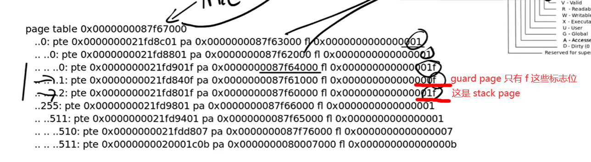

# LEC 7 (fk): Q&A labs

目录：

<!-- @import "[TOC]" {cmd="toc" depthFrom=2 depthTo=2 orderedList=false} -->

<!-- code_chunk_output -->

- [复习页表](#复习页表)
- [之前的 page table lab](#之前的-page-table-lab)

<!-- /code_chunk_output -->

细分目录：

<!-- @import "[TOC]" {cmd="toc" depthFrom=2 depthTo=6 orderedList=false} -->

<!-- code_chunk_output -->

- [复习页表](#复习页表)
  - [关于 guard page 和 stack page](#关于-guard-page-和-stack-page)
- [之前的 page table lab](#之前的-page-table-lab)
  - [第二问：共享内核页](#第二问共享内核页)

<!-- /code_chunk_output -->

## 复习页表

### 关于 guard page 和 stack page

对于 510 ，其标志位是 RWV ，是 trapframe ；对于 511 其标志位是 XV ，是 trampoline 。

## 之前的 page table lab

### 第二问：共享内核页

教授介绍了他关于 page table lab 的解决方案：
- 不是 copy 而是 share
- 具体来讲，就是 share 内核页表，这样就可以让多个进程共享内核页表，而不是每个进程都有自己的内核页表
