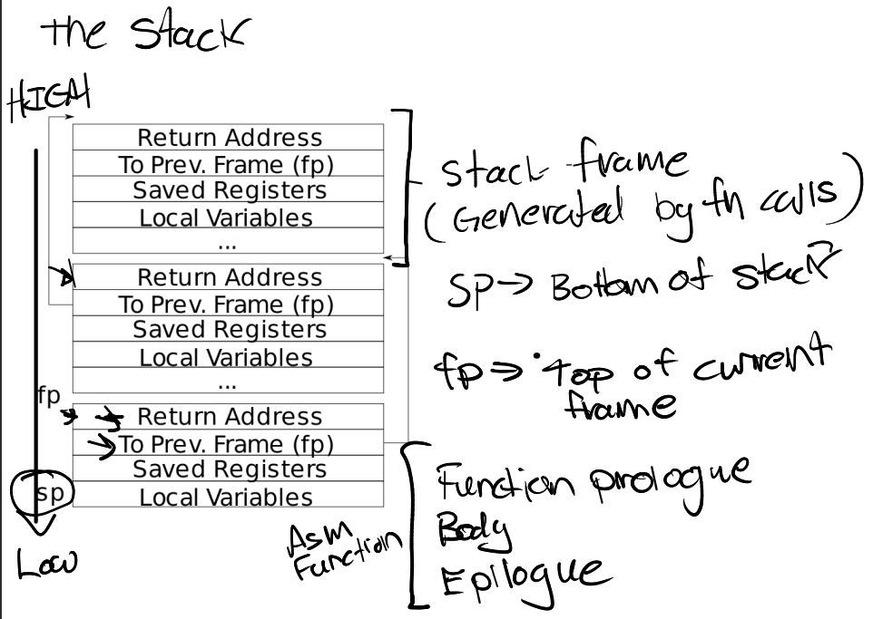
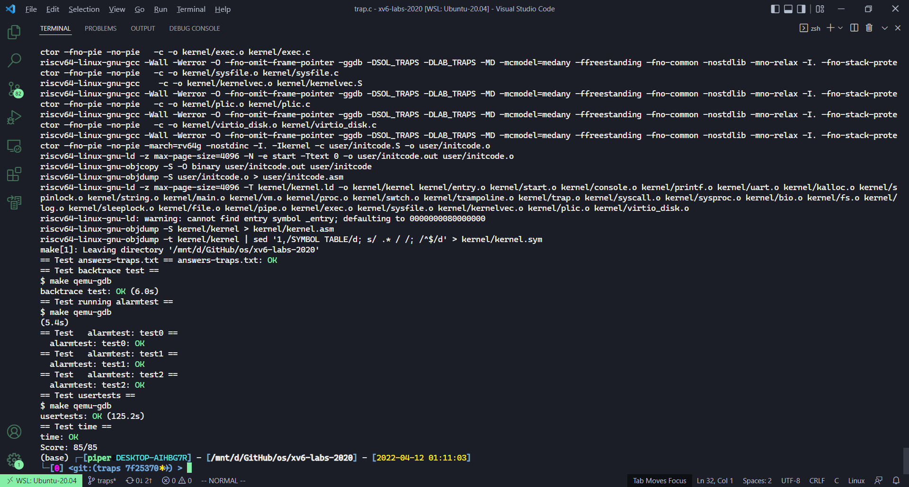

# Lab traps: Trap

本节作业：
- https://github.com/PiperLiu/xv6-labs-2020/tree/traps

目录：

<!-- @import "[TOC]" {cmd="toc" depthFrom=2 depthTo=2 orderedList=false} -->

<!-- code_chunk_output -->


<!-- /code_chunk_output -->

细分目录：

<!-- @import "[TOC]" {cmd="toc" depthFrom=2 depthTo=6 orderedList=false} -->

<!-- code_chunk_output -->

- [RISC-V assembly（汇编、RISC-V是小端机）](#risc-v-assembly汇编-risc-v是小端机)
- [Backtrace 报错时回溯打印栈 stack](#backtrace-报错时回溯打印栈-stack)
- [Alarm 根据 tick 做回调](#alarm-根据-tick-做回调)
  - [test0: invoke handler](#test0-invoke-handler)
  - [test1/test2(): resume interrupted code](#test1test2-resume-interrupted-code)

<!-- /code_chunk_output -->

### RISC-V assembly（汇编、RISC-V是小端机）

It will be important to understand a bit of RISC-V assembly, which you were exposed to in 6.004. There is a file user/call.c in your xv6 repo. `make fs.img` compiles it and also produces a readable assembly version of the program in user/call.asm.

Read the code in call.asm for the functions g, f, and main. The [instruction manual for RISC-V](https://github.com/riscv/riscv-isa-manual) is on the [reference page](https://pdos.csail.mit.edu/6.S081/2020/reference.html). Here are some questions that you should answer (store the answers in a file answers-traps.txt):

Which registers contain arguments to functions? For example, which register holds 13 in main's call to printf?

> `24: 4635  li a2,13` ， `26: 45b1  li a1,12`

Where is the call to function f in the assembly code for main? Where is the call to g? (Hint: the compiler may inline functions.)

> 并没有显示调用， f 和 g 都被编译器优化直接内联 inline 了

At what address is the function printf located?

> `640 <printf>`

What value is in the register ra just after the jalr to printf in main?

> 对于 `34:	600080e7          	jalr	1536(ra) # 630 <printf>` 。 间接跳转指令JALR用I-type编码类型。指令格式为`JALR rd，offset(rs1)`。这里 jalr 没有第一个操作数，因此，返回地址默认存放到ra寄存器中。`ra=pc+4` 即 `0x38` 。

Run the following code.

```
	unsigned int i = 0x00646c72;
	printf("H%x Wo%s", 57616, &i);
```

What is the output? 

[Here's an ASCII table](https://staffwiki.cs.mun.ca/~michael/c/ascii-table.html) that maps bytes to characters.

> `HE110 World` ，对于十六进制 `0xE110 = 0d57616` ，对于字符串， RISC-V 是小端机， i 从低地址到高地址是 `0x72 0x6c 0x64 0x00` ，对应 ascii 表分别是 `r l d` 。

The output depends on that fact that the RISC-V is little-endian. If the RISC-V were instead big-endian what would you set i to in order to yield the same output? Would you need to change 57616 to a different value?

[Here's a description of little- and big-endian](https://www.webopedia.com/definitions/big-endian/) and [a more whimsical description](http://www.networksorcery.com/enp/ien/ien137.txt).

> 如果 RISC-V 是大端机，那么不需要改变 57616 ，只需要改变 i 的值即可： `0x726c6400` 。

In the following code, what is going to be printed after `'y='`? (note: the answer is not a specific value.) Why does this happen?

```
	printf("x=%d y=%d", 3);
```

> 参考[Moksha](https://zhuanlan.zhihu.com/p/444137341)的分析，阅读call.asm, 将3存放到a1寄存器后，在调用printf之前并未对a2寄存器进行修改(本应该有第二个参数的), 第二个参数传入的值是a2寄存器中原有的随机值。

### Backtrace 报错时回溯打印栈 stack

For debugging it is often useful to have a backtrace: a list of the function calls on the stack above the point at which the error occurred.

Implement a backtrace() function in kernel/printf.c. Insert a call to this function in sys_sleep, and then run bttest, which calls sys_sleep. Your output should be as follows:

```
backtrace:
0x0000000080002cda
0x0000000080002bb6
0x0000000080002898
```

After bttest exit qemu. In your terminal: the addresses may be slightly different but if you run `addr2line -e kernel/kernel` (`or riscv64-unknown-elf-addr2line -e kernel/kernel`) and cut-and-paste the above addresses as follows:

```
    $ addr2line -e kernel/kernel
    0x0000000080002de2
    0x0000000080002f4a
    0x0000000080002bfc
    Ctrl-D
```

You should see something like this:
```
    kernel/sysproc.c:74
    kernel/syscall.c:224
    kernel/trap.c:85
```

The compiler puts in each stack frame a frame pointer that holds the address of the caller's frame pointer. Your backtrace should use these frame pointers to walk up the stack and print the saved return address in each stack frame.

Some hints:

- Add the prototype for backtrace to kernel/defs.h so that you can invoke backtrace in sys_sleep.
- The GCC compiler stores the frame pointer of the currently executing function in the register s0. Add the following function to kernel/riscv.h, and call this function in backtrace to read the current frame pointer. This function uses [in-line assembly](https://gcc.gnu.org/onlinedocs/gcc/Using-Assembly-Language-with-C.html) to read s0.

```c
static inline uint64
r_fp()  // 注意 fp 存在 s0 里，这个函数是 read fp
{
  uint64 x;
  asm volatile("mv %0, s0" : "=r" (x) );
  return x;
}
```

- These [lecture notes](../lec/l-riscv-slides.pdf) have a picture of the layout of stack frames. Note that the return address lives at a fixed offset (-8) from the frame pointer of a stackframe, and that the saved frame pointer lives at fixed offset (-16) from the frame pointer. 如下图， fp 为当前函数的栈顶指针， sp 为栈指针， fp-8 存放返回地址， fp-16 存放原栈帧（调用函数的 fp）。



- Xv6 allocates one page for each stack in the xv6 kernel at PAGE-aligned address. You can compute the top and bottom address of the stack page by using PGROUNDDOWN(fp) and PGROUNDUP(fp) (see kernel/riscv.h. These number are helpful for backtrace to terminate its loop. 注意，在 xv6 中，每个栈都被分配了一个页，因此这个栈的栈底就是 PGROUNDUP(fp) 。
- Once your backtrace is working, call it from panic in kernel/printf.c so that you see the kernel's backtrace when it panics.

按照 hints 就好：

```c
kernel/defs.h
// printf.c
void            backtrace(void);

kernel/riscv.h 加入 r_fp

实现一个 backtrace
// printf.c
void
backtrace(void)
{
  uint64 fp = r_fp();
  uint64 stk_bottom = PGROUNDUP(fp);
  printf("backtrace:\n");
  // 下面一定是 fp < stk_bottom 如果是 fp <= stk_bottom 会有 panic: kerneltrap
  for (; fp < stk_bottom; fp = *((uint64*)(fp - 16)))  // 取地址的值跳转
    printf("%p\n", *((uint64*)(fp - 8)));  // 取返回地址上的值
}

在 sys_sleep 和 panic 添加 backtrace 调用
```

### Alarm 根据 tick 做回调

In this exercise you'll add a feature to xv6 that periodically alerts a process as it uses CPU time. This might be useful for compute-bound processes that want to limit how much CPU time they chew up, or for processes that want to compute but also want to take some periodic action. More generally, you'll be implementing a primitive form of user-level interrupt/fault handlers; you could use something similar to handle page faults in the application, for example. Your solution is correct if it passes alarmtest and usertests.

You should add a new `sigalarm(interval, handler)` system call. If an application calls `sigalarm(n, fn)`, then after every n "ticks" of CPU time that the program consumes, the kernel should cause application function fn to be called. When fn returns, the application should resume where it left off. A tick is a fairly arbitrary unit of time in xv6, determined by how often a hardware timer generates interrupts. If an application calls `sigalarm(0, 0)`, the kernel should stop generating periodic alarm calls.

You'll find a file user/alarmtest.c in your xv6 repository. Add it to the Makefile. It won't compile correctly until you've added sigalarm and sigreturn system calls (see below).

alarmtest calls `sigalarm(2, periodic)` in test0 to ask the kernel to force a call to periodic() every 2 ticks, and then spins for a while. You can see the assembly code for alarmtest in user/alarmtest.asm, which may be handy for debugging. Your solution is correct when alarmtest produces output like this and usertests also runs correctly:

```
$ alarmtest
test0 start
........alarm!
test0 passed
test1 start
...alarm!
..alarm!
...alarm!
..alarm!
...alarm!
..alarm!
...alarm!
..alarm!
...alarm!
..alarm!
test1 passed
test2 start
................alarm!
test2 passed
$ usertests
...
ALL TESTS PASSED
$
```

When you're done, your solution will be only a few lines of code, but it may be tricky to get it right. We'll test your code with the version of alarmtest.c in the original repository. You can modify alarmtest.c to help you debug, but make sure the original alarmtest says that all the tests pass.

#### test0: invoke handler

Get started by modifying the kernel to jump to the alarm handler in user space, which will cause test0 to print "alarm!". Don't worry yet what happens after the "alarm!" output; it's OK for now if your program crashes after printing "alarm!". Here are some hints:
- You'll need to modify the Makefile to cause alarmtest.c to be compiled as an xv6 user program.
- The right declarations to put in user/user.h are:
  - `int sigalarm(int ticks, void (*handler)());`
  - `int sigreturn(void);`
- Update user/usys.pl (which generates user/usys.S), kernel/syscall.h, and kernel/syscall.c to allow alarmtest to invoke the sigalarm and sigreturn system calls.
- For now, your sys_sigreturn should just return zero.
- Your sys_sigalarm() should store the alarm interval and the pointer to the handler function in new fields in the proc structure (in kernel/proc.h).
- You'll need to keep track of how many ticks have passed since the last call (or are left until the next call) to a process's alarm handler; you'll need a new field in struct proc for this too. You can initialize proc fields in allocproc() in proc.c.
- Every tick, the hardware clock forces an interrupt, which is handled in usertrap() in kernel/trap.c.
- You only want to manipulate a process's alarm ticks if there's a timer interrupt; you want something like
  - `if(which_dev == 2) ...`
- Only invoke the alarm function if the process has a timer outstanding. Note that the address of the user's alarm function might be 0 (e.g., in user/alarmtest.asm, periodic is at address 0).
- You'll need to modify usertrap() so that when a process's alarm interval expires, the user process executes the handler function. When a trap on the RISC-V returns to user space, what determines the instruction address at which user-space code resumes execution?
- It will be easier to look at traps with gdb if you tell qemu to use only one CPU, which you can do by running
  - `make CPUS=1 qemu-gdb`
- You've succeeded if alarmtest prints "alarm!".

#### test1/test2(): resume interrupted code

Chances are that alarmtest crashes in test0 or test1 after it prints "alarm!", or that alarmtest (eventually) prints "test1 failed", or that alarmtest exits without printing "test1 passed". To fix this, you must ensure that, when the alarm handler is done, control returns to the instruction at which the user program was originally interrupted by the timer interrupt. You must ensure that the register contents are restored to the values they held at the time of the interrupt, so that the user program can continue undisturbed after the alarm. Finally, you should "re-arm" the alarm counter after each time it goes off, so that the handler is called periodically.

As a starting point, we've made a design decision for you: user alarm handlers are required to call the sigreturn system call when they have finished. Have a look at periodic in alarmtest.c for an example. This means that you can add code to usertrap and sys_sigreturn that cooperate to cause the user process to resume properly after it has handled the alarm.

Some hints:
- Your solution will require you to save and restore registers---what registers do you need to save and restore to resume the interrupted code correctly? (Hint: it will be many).
- Have usertrap save enough state in struct proc when the timer goes off that sigreturn can correctly return to the interrupted user code.
- Prevent re-entrant calls to the handler----if a handler hasn't returned yet, the kernel shouldn't call it again. test2 tests this.
- Once you pass test0, test1, and test2 run usertests to make sure you didn't break any other parts of the kernel.

这里有很多细节，参考了[这篇文章](https://blog.csdn.net/rocketeerLi/article/details/121665215)。

这道题是干什么？
- 用户通过系统调用 `sigalarm(n, fn)` 让内核每 n 个时钟中断调用 fn
- 在 user/alarmtest.c 中，每次时钟中断，调用 fn 函数中最后一句话都是另一个系统调用 `sigreturn` ，这个 `sigreturn` 调用会恢复用户进程的所有寄存器值，然后返回到用户进程的上一个中断处。换句话说， fn 可能会改边用户进程的寄存器值，这不行，我们在执行完 fn 后，要恢复用户进程的寄存器值为调用 sigalarm 导致的中断前的状态。这是这道题细节的地方。

最开始，别忘了把 alarmtest 放到 makefile 里。

首先添加两个系统调用，细节比较多，可以参考 [lab2](./lec.03hw.md) ，不详细写了。

```c
// user/user.h
// new syscalls
int sigalarm(int ticks, void (*handler)());
int sigreturn(void);

// user/usys.pl
entry("sigalarm");
entry("sigreturn");

// kernel/syscall.h
#define SYS_sigalarm 22
#define SYS_sigreturn 23

// kernel/syscall.c
extern uint64 sys_sigalarm(void);
extern uint64 sys_sigreturn(void);

static uint64 (*syscalls[])(void) = {
...
[SYS_sigalarm]  sys_sigalarm,
[SYS_sigreturn] sys_sigreturn,
};
```

然后开始实现功能。

修改进程，让进程记录目前调用了多少中断，以及是否要调用回调。因此就修改 kernel/proc.h ：

```c
  // 中断间隔、回调函数、 tick 计数器
  int interval;
  uint64 handler;
  int ticks;
  // 保存在 handler 前 trapframe ，用于恢复
  struct trapframe *pretrapframe;
```

把系统调用也写在 kernel/sysproc.c ：

```c
uint64
sys_sigalarm(void)
{
  int interval;
  uint64 handler;
  struct proc *p;
  if (argint(0, &interval) < 0
      || argaddr(1, &handler)
      || interval < 0)
  {
    return -1;
  }
  p = myproc();
  p->interval = interval;
  p->handler  = handler;
  p->ticks    = 0;
  return 0;
}

uint64
sys_sigreturn(void)
{
  struct proc *p = myproc();
  *p->trapframe = *p->pretrapframe;
  p->ticks = 0;
  return 0;
}
```

然后将调用 handler 的逻辑加入 kernel/trap.c ：

```c
//
// handle an interrupt, exception, or system call from user space.
// called from trampoline.S
//
void
usertrap(void)
{
  int which_dev = 0;

  ...

  // give up the CPU if this is a timer interrupt.
  if(which_dev == 2) {
    if (p->interval) {
      if (p->ticks == p->interval) {
        *p->pretrapframe = *p->trapframe;
        // epc 是 saved user program counter
        // 这样这个中断结束后就会调用 handler
        p->trapframe->epc = p->handler;
        // 这里并不需要将 ticks 设为 0
        // 因为这样可能导致 handler 没运行完，就运行下一个 handler
        // 因此在 sigreturn 里将 tick 设为 0
        // 这样 handler 没有运行到 sigreturn 则永远不能运行新的 handler
      }
      p->ticks++;
    }
    yield();
  }

  usertrapret();
}
```

最后，这进程初始化以及释放的时候要做相应处理：

kernel/proc.c
```c
// Look in the process table for an UNUSED proc.
// If found, initialize state required to run in the kernel,
// and return with p->lock held.
// If there are no free procs, or a memory allocation fails, return 0.
static struct proc*
allocproc(void)
{
  ...
  p->interval = 0;
  p->handler  = 0;
  p->ticks    = 0;
  if ((p->pretrapframe = (struct trapframe *) kalloc()) == 0) {
    release(&p->lock);
    return 0;
  }

  ...
}

// free a proc structure and the data hanging from it,
// including user pages.
// p->lock must be held.
static void
freeproc(struct proc *p)
{
  ...
  p->interval = 0;
  p->handler  = 0;
  p->ticks    = 0;
  if (p->pretrapframe)
    kfree((void *) p->pretrapframe);
}
```


