# LEC 8 (fk): Page faults

笔记大量参考了[肖宏辉](https://www.zhihu.com/people/xiao-hong-hui-15)大佬的翻译。

目录：

<!-- @import "[TOC]" {cmd="toc" depthFrom=2 depthTo=2 orderedList=false} -->

<!-- code_chunk_output -->

- [page fault 课程内容概述](#page-fault-课程内容概述)
- [Lazy page allocation (sbrk)](#lazy-page-allocation-sbrk)
- [Zero Fill On Demand](#zero-fill-on-demand)
- [Copy On Write Fork](#copy-on-write-fork)
- [Demand paging](#demand-paging)
- [Memory Mapped Files](#memory-mapped-files)

<!-- /code_chunk_output -->

细分目录：

<!-- @import "[TOC]" {cmd="toc" depthFrom=2 depthTo=6 orderedList=false} -->

<!-- code_chunk_output -->

- [page fault 课程内容概述](#page-fault-课程内容概述)
  - [内核需要什么样的信息才能够响应 page fault](#内核需要什么样的信息才能够响应-page-fault)
- [Lazy page allocation (sbrk)](#lazy-page-allocation-sbrk)
  - [简单修改 sys_sbrk](#简单修改-sys_sbrk)
- [Zero Fill On Demand](#zero-fill-on-demand)
- [Copy On Write Fork](#copy-on-write-fork)
- [Demand paging](#demand-paging)
  - [在lazy allocation中，如果内存耗尽了该如何办？（dirty page）](#在lazy-allocation中如果内存耗尽了该如何办dirty-page)
- [Memory Mapped Files](#memory-mapped-files)

<!-- /code_chunk_output -->

## page fault 课程内容概述

- lazy allocation，这是下一个lab的内容
- copy-on-write fork
- demand paging
- memory mapped files

几乎所有稍微正经的操作系统都实现了这些功能。比如Linux就实现了所有的这些功能。然而在XV6中，实话实说，一个这样的功能都没实现。在XV6中，一旦用户空间进程触发了page fault，会导致进程被杀掉。这是非常保守的处理方式。

这节课我们就给 xv6 加入这些功能。

page fault 可以让这里的地址映射关系变得动态起来。通过 page fault ，内核可以更新 page table ，这是一个非常强大的功能。因为现在可以动态的更新虚拟地址这一层抽象，结合 page table 和 page fault ，内核将会有巨大的灵活性。我们接下来会看到各种各样利用动态变更 page table 实现的有趣的功能。

### 内核需要什么样的信息才能够响应 page fault

当发生page fault时，内核需要什么样的信息才能够响应page fault。

很明显的，我们需要出错的虚拟地址，或者是触发page fault的源。可以假设的是，你们在page table lab中已经看过一些相关的panic，所以你们可能已经知道，当出现page fault的时候，XV6内核会打印出错的虚拟地址，并且这个地址会被保存在STVAL寄存器中。所以，当一个用户应用程序触发了page fault， **page fault会使用与Robert教授上节课介绍的相同的trap机制，将程序运行切换到内核，同时也会将出错的地址存放在STVAL寄存器中。** 这是我们需要知道的第一个信息。

我们需要知道的第二个信息是出错的原因，我们或许想要对不同场景的page fault有不同的响应。不同的场景是指，比如因为load指令触发的page fault、因为store指令触发的page fault又或者是因为jump指令触发的page fault。**所以实际上如果你查看RISC-V的文档，在SCAUSE（注，Supervisor cause寄存器，保存了trap机制中进入到supervisor mode的原因）寄存器的介绍中，有多个与page fault相关的原因。** 比如，13表示是因为load引起的page fault；15表示是因为store引起的page fault；12表示是因为指令执行引起的page fault。所以第二个信息存在SCAUSE寄存器中，其中总共有3个类型的原因与page fault相关，分别是读、写和指令。ECALL进入到supervisor mode对应的是8，这是我们在上节课中应该看到的SCAUSE值。基本上来说，page fault和其他的异常使用与系统调用相同的trap机制（注，详见lec06）来从用户空间切换到内核空间。如果是因为page fault触发的trap机制并且进入到内核空间，STVAL寄存器和SCAUSE寄存器都会有相应的值。

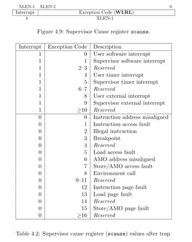

我们或许想要知道的第三个信息是触发page fault的指令的地址。从上节课可以知道，作为trap处理代码的一部分，这个地址存放在SEPC（Supervisor Exception Program Counter）寄存器中，并同时会保存在`trapframe->epc`中。

从硬件和XV6的角度来说，当出现了page fault，现在有了3个对我们来说极其有价值的信息，分别是：
- 引起page fault的内存地址
- 引起page fault的原因类型
- 引起page fault时的程序计数器值，这表明了page fault在用户空间发生的位置

我们之所以关心触发page fault时的程序计数器值，是因为在page fault handler中我们或许想要修复page table，并重新执行对应的指令。理想情况下，修复完page table之后，指令就可以无错误的运行了。所以，能够恢复因为page fault中断的指令运行是很重要的。

## Lazy page allocation (sbrk)

sbrk是XV6提供的系统调用，它使得用户应用程序能扩大自己的heap（从 stack 上面网上扩展）。当一个应用程序启动的时候，sbrk指向的是heap的最底端，同时也是stack的最顶端。这个位置通过代表进程的数据结构中的sz字段表示，这里以p->sz表示。

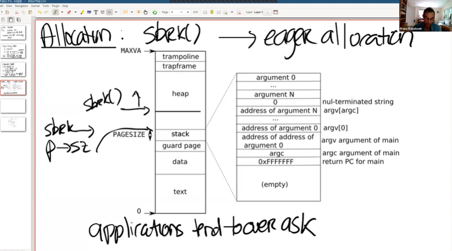

当调用sbrk时，它的参数是整数，代表了你想要申请的page数量。sbrk会扩展stack的上边界。

这意味着，当sbrk实际发生或者被调用的时候，内核会分配一些物理内存，并将这些内存映射到用户应用程序的地址空间，然后将内存内容初始化为0，再返回sbrk系统调用。这样，应用程序可以通过多次sbrk系统调用来增加它所需要的内存。类似的，应用程序还可以通过给sbrk传入负数作为参数，来减少或者压缩它的地址空间。不过在这节课我们只关注增加内存的场景。

**在XV6中，sbrk的实现默认是eager allocation。这表示了，一旦调用了sbrk，内核会立即分配应用程序所需要的物理内存。**

实际上并不需要。

使用虚拟内存和page fault handler，我们完全可以用某种更聪明的方法来解决这里的问题，这里就是利用lazy allocation。核心思想非常简单，sbrk系统调基本上不做任何事情，唯一需要做的事情就是提升p->sz，将p->sz增加n，其中n是需要新分配的内存page数量。但是内核在这个时间点并不会分配任何物理内存。之后在某个时间点，应用程序使用到了新申请的那部分内存，这时会触发page fault，因为我们还没有将新的内存映射到page table。所以，如果我们解析一个大于旧的`p->sz`，但是又小于新的`p->sz`（注，也就是旧的`p->sz + n`）的虚拟地址，我们希望内核能够分配一个内存page，并且重新执行指令。

所以，当我们看到了一个page fault，相应的虚拟地址小于当前`p->sz`，同时大于stack，那么我们就知道这是一个来自于heap的地址，但是内核还没有分配任何物理内存。所以对于这个page fault的响应也理所当然的直接明了：在page fault handler中，通过kalloc函数分配一个内存page；初始化这个page内容为0；将这个内存page映射到user page table中；最后重新执行指令。比方说，如果是load指令，或者store指令要访问属于当前进程但是还未被分配的内存，在我们映射完新申请的物理内存page之后，重新执行指令应该就能通过了。

- 学生提问：在eager allocation的场景，一个进程可能消耗了太多的内存进而耗尽了物理内存资源。如果我们不使用eager allocation，而是使用lazy allocation，应用程序怎么才能知道当前已经没有物理内存可用了？
- Frans教授：这是个非常好的问题。从应用程序的角度来看，会有一个错觉：存在无限多可用的物理内存。但是在某个时间点，应用程序可能会用光了物理内存，之后如果应用程序再访问一个未被分配的page，但这时又没有物理内存，这时内核可以有两个选择，我稍后会介绍更复杂的那个。你们在lazy lab中要做的是，返回一个错误并杀掉进程。因为现在已经OOM（Out Of Memory）了，内核也无能为力，所以在这个时间点可以杀掉进程。在这节课稍后的部分会介绍，可以有更加聪明的解决方案。

### 简单修改 sys_sbrk

我们首先要修改的是`sys_sbrk`函数，`sys_sbrk`会完成实际增加应用程序的地址空间，分配内存等等一系列相关的操作。

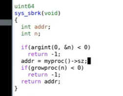

这里我们要修改这个函数，让它只对`p->sz`加n，并不执行增加内存的操作。

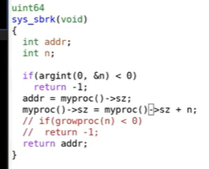

修改完之后启动XV6，并且执行“echo hi”，我们会得到一个page fault。

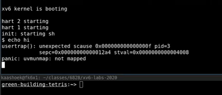

之所以会得到一个page fault是因为，在Shell中执行程序，Shell会先fork一个子进程，子进程会通过exec执行echo。在这个过程中，Shell会申请一些内存，所以Shell会调用sys_sbrk，然后就出错了（注，因为前面修改了代码，调用sys_sbrk不会实际分配所需要的内存）。

这里输出的内容包含了一些有趣的信息：
- 这里输出了SCAUSE寄存器内容，我们可以看到它的值是15，表明这是一个store page fault。
- 我们可以看到进程的pid是3，这极可能是Shell的pid。
- 我们还可以看到SEPC寄存器的值，是`0x12a4`。
- 最后还可以看到出错的虚拟内存地址，也就是STVAL寄存器的内容，是`0x4008`。

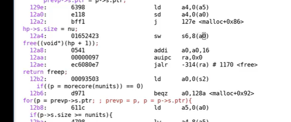

我们可以查看Shell的汇编代码，这是由Makefile创建的。我们搜索SEPC对应的地址，可以看到这的确是一个store指令。这看起来就是我们出现page fault的位置。

如果我们向前看看汇编代码，我们可以看到page fault是出现在malloc的实现代码中。这也非常合理，在malloc的实现中，我们使用sbrk系统调用来获得一些内存，之后会初始化我们刚刚获取到的内存，在`0x12a4`位置，刚刚获取的内存中写入数据，但是实际上我们在向未被分配的内存写入数据。

另一个可以证明内存还没有分配的地方是，XV6中Shell通常是有4个page，包含了text和data。出错的地址在4个page之外，也就是第5个page，实际上我们在4个page之外8个字节。这也合理，因为在`0x12a4`对应的指令中，a0持有的是`0x4000`，而8相对a0的偏移量。偏移之后的地址就是我们想要使用的地址（注，也就是出错的地址）。

以上就是page fault的信息。我们接下来看看如何能够聪明的处理这里的page fault。

首先查看`trap.c`中的usertrap函数，usertrap在lec06中有介绍。在usertrap中根据不同的SCAUSE完成不同的操作。

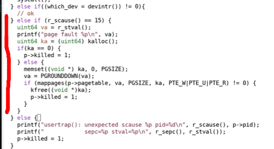

在上面增加的代码中，首先打印一些调试信息。之后分配一个物理内存page，如果ka等于0，表明没有物理内存我们现在OOM了，我们会杀掉进程。如果有物理内存，首先会将内存内容设置为0，之后将物理内存page指向用户地址空间中合适的虚拟内存地址。具体来说，我们首先将虚拟地址向下取整，这里引起page fault的虚拟地址是`0x4008`，向下取整之后是`0x4000`。之后我们将物理内存地址跟取整之后的虚拟内存地址的关系加到page table中。对应的PTE需要设置常用的权限标志位，在这里是`u，w，r bit`位。

接下来运行一些这部分代码。先重新编译XV6，再执行“echo hi”，我们或许可以乐观的认为现在可以正常工作了。

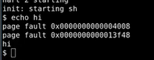

但是实际上并没有正常工作。我们这里有两个page fault，第一个对应的虚拟内存地址是`0x4008`，但是很明显在处理这个page fault时，我们又有了另一个page fault `0x13f48`。现在唯一的问题是，uvmunmap在报错，一些它尝试unmap的page并不存在。这里unmap的内存是什么？

学生回答：之前lazy allocation但是又没有实际分配的内存。

是的，完全正确。这里unmap的是之前lazy allocated，但是又还没有用到的地址。所以对于这个内存，并没有对应的物理内存。所以在uvmunmap函数中，当PTE的v标志位为0并且没有对应的mapping，这并不是一个实际的panic，这是我们预期的行为。

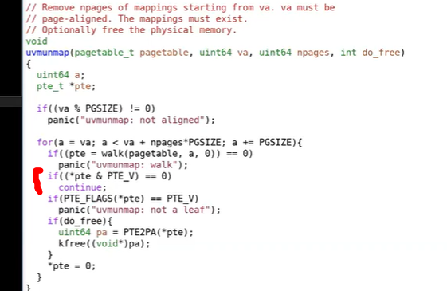

实际上，对于这个page我们并不用做任何事情，我们可以直接continue跳到下一个page。

接下来，我们再重新编译XV6，并执行“echo hi”。

现在我们可以看到2个page fault，但是echo hi正常工作了。现在，我们一定程度上有了最基本最简单的lazy allocation。这里有什么问题吗？

这部分内容对于下一个实验有很大的帮助，实际上这是下一个实验3个部分中的一个，但是很明显这部分不足以完成下一个lazy lab。我们这里做了一些修改，但是很多地方还是有可能出错。就像有人提到的，我这里并没有检查触发page fault的虚拟地址是否小于`p->sz`。还有其他的可能出错的地方吗？

学生回答：通过sbrk增加的用户进程的内存数是一个整型数而不是一个无符号整型数，可能会传入负数。

是的，可能会使用负数，这意味着缩小用户内存。当我们在缩小用户内存时，我们也需要小心一些。实际上，在一个操作系统中，我们可能会在各种各样的用户场景中使用这里的PTE，对于不同的用户场景我们或许需要稍微修改XV6，这就是接下来的lazy lab的内容。你们需要完成足够多的修改，才能通过所有的测试用例。

## Zero Fill On Demand

接下来我将讨论基于page fault和page table可以做的一些其他酷的事情。另一个简单但是使用的非常频繁的功能是zero-fill-on-demand。

当你查看一个用户程序的地址空间时，存在text区域，data区域，同时还有一个BSS区域（注，BSS区域包含了未被初始化或者初始化为0的全局或者静态变量）。当编译器在生成二进制文件时，编译器会填入这三个区域。text区域是程序的指令，data区域存放的是初始化了的全局变量，BSS包含了未被初始化或者初始化为0的全局变量。

之所以这些变量要单独列出来，是因为例如你在C语言中定义了一个大的矩阵作为全局变量，它的元素初始值都是0，为什么要为这个矩阵分配内存呢？其实只需要记住这个矩阵的内容是0就行。

在一个正常的操作系统中，如果执行exec，exec会申请地址空间，里面会存放text和data。因为BSS里面保存了未被初始化的全局变量，这里或许有许多许多个page，但是所有的page内容都为0。

通常可以调优的地方是，我有如此多的内容全是0的page， **在物理内存中，我只需要分配一个page，这个page的内容全是0。然后将所有虚拟地址空间的全0的page都map到这一个物理page上。这样至少在程序启动的时候能节省大量的物理内存分配。**

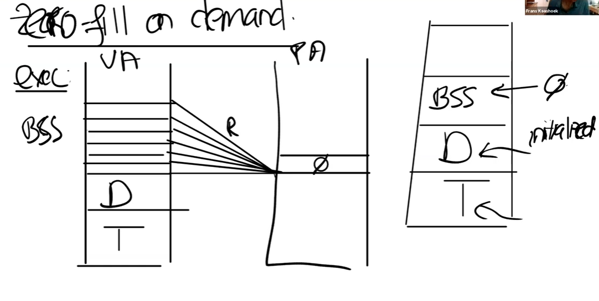

当然这里的mapping需要非常的小心，我们不能允许对于这个page执行写操作，因为所有的虚拟地址空间page都期望page的内容是全0，所以这里的PTE都是只读的。之后在某个时间点，应用程序尝试写BSS中的一个page时，比如说需要更改一两个变量的值，我们会得到page fault。那么，对于这个特定场景中的page fault我们该做什么呢？

学生回答：我认为我们应该创建一个新的page，将其内容设置为0，并重新执行指令。

是的，完全正确。假设store指令发生在BSS最顶端的page中。我们想要做的是，在物理内存中申请一个新的内存page，将其内容设置为0，因为我们预期这个内存的内容为0。之后我们需要更新这个page的mapping关系，首先PTE要设置成可读可写，然后将其指向新的物理page。这里相当于更新了PTE，之后我们可以重新执行指令。

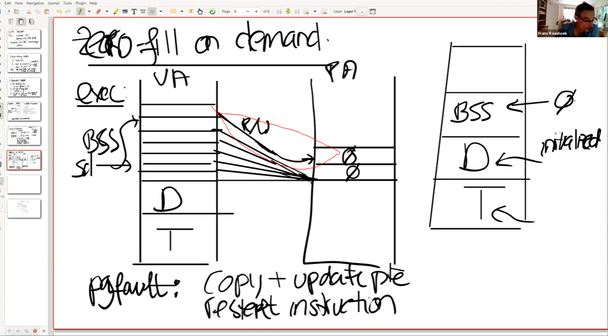

为什么这是一个好的优化？或者说为什么操作系统要这么做？

学生回答：这样节省一部分内存。你可以在需要的时候才申请内存。

是的，这里类似于lazy allocation。假设程序申请了一个大的数组，来保存可能的最大的输入，并且这个数组是全局变量且初始为0。但是最后或许只有一小部分内容会被使用。

第二个好处是在exec中需要做的工作变少了。程序可以启动的更快，这样你可以获得更好的交互体验，因为你只需要分配一个内容全是0的物理page。所有的虚拟page都可以映射到这一个物理page上。

- 学生提问： **但是因为每次都会触发一个page fault，update和write会变得更慢吧？**
- Frans教授：是的，这是个很好的观点，所以这里是实际上我们将一些操作推迟到了page fault再去执行。并且我们期望并不是所有的page都被使用了。如果一个page是4096字节，我们只需要对每4096个字节消耗一次page fault即可。但是这里是个好的观点，我们的确增加了一些由page fault带来的代价。

page fault的代价是多少呢？我们该如何看待它？这是一个与store指令相当的代价，还是说代价要高的多？

学生回答：代价要高的多。store指令可能需要消耗一些时间来访问RAM，但是page fault需要走到内核。

是的，在lec06中你们已经看到了， **仅仅是在trap处理代码中，就有至少有100个store指令用来存储当前的寄存器。除此之外，还有从用户空间转到内核空间的额外开销。所以，page fault并不是没有代价的，之前问的那个问题是一个非常好的问题。**

## Copy On Write Fork

当Shell处理指令时，它会通过fork创建一个子进程。fork会创建一个Shell进程的拷贝，所以这时我们有一个父进程（原来的Shell）和一个子进程。Shell的子进程执行的第一件事情就是调用exec运行一些其他程序，比如运行echo。现在的情况是，fork创建了Shell地址空间的一个完整的拷贝，而exec做的第一件事情就是丢弃这个地址空间，取而代之的是一个包含了echo的地址空间。这里看起来有点浪费。

所以，我们最开始有了一个父进程的虚拟地址空间，然后我们有了子进程的虚拟地址空间。在物理内存中，XV6中的Shell通常会有4个page，当调用fork时，基本上就是创建了4个新的page，并将父进程page的内容拷贝到4个新的子进程的page中。

但是之后，一旦调用了exec，我们又会释放这些page，并分配新的page来包含echo相关的内容。所以对于这个特定场景有一个非常有效的优化：当我们创建子进程时，与其创建，分配并拷贝内容到新的物理内存，其实我们可以直接共享父进程的物理内存page。所以这里，我们可以设置子进程的PTE指向父进程对应的物理内存page。

当然，再次要提及的是，我们这里需要非常小心。因为一旦子进程想要修改这些内存的内容，相应的更新应该对父进程不可见，因为我们希望在父进程和子进程之间有强隔离性，所以这里我们需要更加小心一些。为了确保进程间的隔离性，我们可以将这里的父进程和子进程的PTE的标志位都设置成只读的。

在某个时间点，当我们需要更改内存的内容时，我们会得到page fault。因为父进程和子进程都会继续运行，而父进程或者子进程都可能会执行store指令来更新一些全局变量，这时就会触发page fault，因为现在在向一个只读的PTE写数据。

在得到page fault之后，我们需要拷贝相应的物理page。假设现在是子进程在执行store指令，那么我们会分配一个新的物理内存page，然后将page fault相关的物理内存page拷贝到新分配的物理内存page中，并将新分配的物理内存page映射到子进程。这时，新分配的物理内存page只对子进程的地址空间可见，所以我们可以将相应的PTE设置成可读写，并且我们可以重新执行store指令。实际上，对于触发刚刚page fault的物理page，因为现在只对父进程可见，相应的PTE对于父进程也变成可读写的了。

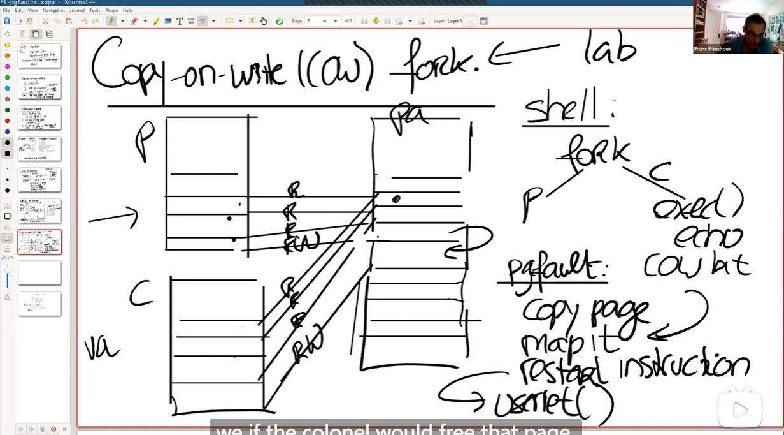

所以现在，我们拷贝了一个page，将新的page映射到相应的用户地址空间，并重新执行用户指令。重新执行用户指令是指调用userret函数，也即是lec06中介绍的返回到用户空间的方法。

- 学生提问：我们如何发现父进程写了这部分内存地址？是与子进程相同的方法吗？
- Frans教授：是的，因为子进程的地址空间来自于父进程的地址空间的拷贝。如果我们使用了特定的虚拟地址，因为地址空间是相同的，不论是父进程还是子进程，都会有相同的处理方式。
- 学生提问：对于一些没有父进程的进程，比如系统启动的第一个进程，它会对于自己的PTE设置成只读的吗？还是设置成可读写的，然后在fork的时候再修改成只读的？
- Frans教授：这取决于你。实际上在lazy lab之后，会有一个copy-on-write lab。在这个lab中，你自己可以选择实现方式。当然最简单的方式就是将PTE设置成只读的，当你要写这些page时，你会得到一个page fault，之后你可以再按照上面的流程进行处理。
- 学生提问：因为我们经常会拷贝用户进程对应的page，内存硬件有没有实现特定的指令来完成拷贝，因为通常来说内存会有一些读写指令，但是因为我们现在有了从page a拷贝到page b的需求，会有相应的拷贝指令吗？
- Frans教授：x86有硬件指令可以用来拷贝一段内存。但是RISC-V并没有这样的指令。当然在一个高性能的实现中，所有这些读写操作都会流水线化，并且按照内存的带宽速度来运行。
- 在我们这个例子中，我们只需要拷贝1个page，对于一个未修改的XV6系统，我们需要拷贝4个page。所以这里的方法明显更好，因为内存消耗的更少，并且性能会更高，fork会执行的更快。
- 学生提问：当发生page fault时，我们其实是在向一个只读的地址执行写操作。内核如何能分辨现在是一个copy-on-write fork的场景，而不是应用程序在向一个正常的只读地址写数据。是不是说默认情况下，用户程序的PTE都是可读写的，除非在copy-on-write fork的场景下才可能出现只读的PTE？
- Frans教授：内核必须要能够识别这是一个copy-on-write场景。几乎所有的page table硬件都支持了这一点。我们之前并没有提到相关的内容，下图是一个常见的多级page table。对于PTE的标志位，我之前介绍过第0bit到第7bit，但是没有介绍最后两位RSW。这两位保留给supervisor software使用，supervisor softeware指的就是内核。内核可以随意使用这两个bit位。所以可以做的一件事情就是，将bit8标识为当前是一个copy-on-write page。

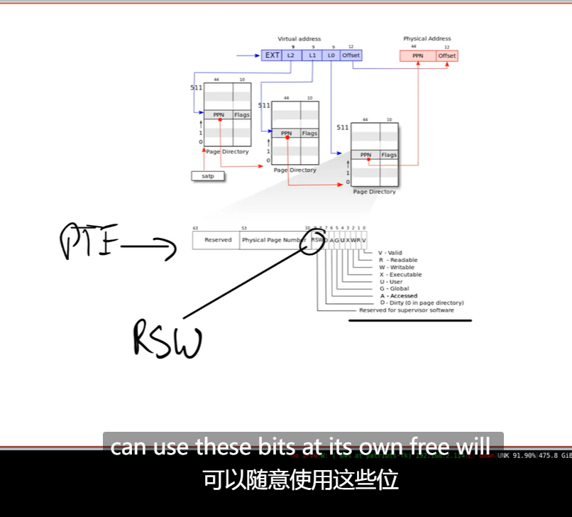

当内核在管理这些page table时，对于copy-on-write相关的page，内核可以设置相应的bit位，这样当发生page fault时，我们可以发现如果copy-on-write bit位设置了，我们就可以执行相应的操作了。否则的话，比如说lazy allocation，我们就做一些其他的处理操作。在copy-on-write lab中，你们会使用RSW在PTE中设置一个copy-on-write标志位。

在copy-on-write lab中，还有个细节需要注意。目前在XV6中，除了trampoline page外，一个物理内存page只属于一个用户进程。trampoline page永远也不会释放，所以也不是什么大问题。 **但是对于这里的物理内存page，现在有多个用户进程或者说多个地址空间都指向了相同的物理内存page，举个例子，当父进程退出时我们需要更加的小心，因为我们要判断是否能立即释放相应的物理page。如果有子进程还在使用这些物理page，而内核又释放了这些物理page，我们将会出问题。那么现在释放内存page的依据是什么呢？**

**我们需要对于每一个物理内存page的引用进行计数，当我们释放虚拟page时，我们将物理内存page的引用数减1，如果引用数等于0，那么我们就能释放物理内存page。** 所以在copy-on-write lab中，你们需要引入一些额外的数据结构或者元数据信息来完成引用计数。

- 学生提问：我们应该在哪存储这些引用计数呢？因为如果我们需要对每个物理内存page的引用计数的话，这些计数可能会有很多。
- Frans教授：对于每个物理内存page，我们都需要做引用计数，也就是说对于每4096个字节，我们都需要维护一个引用计数。
- 学生提问：我们可以将引用计数存在RSW对应的2个bit中吗？并且限制不超过4个引用。
- Frans教授：讲道理，如果引用超过了4次，那么将会是一个问题。因为一个内存引用超过了4次，你将不能再使用这里的优化了。但是这里的实现方式是自由的。
- 学生提问：真的有必要额外增加一位来表示当前的page是copy-on-write吗？因为内核可以维护有关进程的一些信息。
- Frans教授：是的，你可以在管理用户地址空间时维护一些其他的元数据信息，这样你就知道这部分虚拟内存地址如果发生了page fault，那么必然是copy-on-write场景。实际上，在后面的一个实验中，你们需要出于相同的原因扩展XV6管理的元数据。在你们完成这些实验时，具体的实现是很自由的。

## Demand paging

我们回到exec，在未修改的XV6中，操作系统会加载程序内存的text，data区域，并且以eager的方式将这些区域加载进page table。

但是根据我们在lazy allocation和zero-filled on demand的经验，为什么我们要以eager的方式将程序加载到内存中？为什么不再等等，直到应用程序实际需要这些指令的时候再加载内存？程序的二进制文件可能非常的巨大，将它全部从磁盘加载到内存中将会是一个代价很高的操作。又或者data区域的大小远大于常见的场景所需要的大小，我们并不一定需要将整个二进制都加载到内存中。

所以对于exec，**在虚拟地址空间中，我们为text和data分配好地址段，但是相应的PTE并不对应任何物理内存page。对于这些PTE，我们只需要将valid bit位设置为0即可。**

如果我们修改XV6使其按照上面的方式工作，我们什么时候会得到第一个page fault呢？或者说，用户应用程序运行的第一条指令是什么？用户应用程序在哪里启动的？

**应用程序是从地址0开始运行。text区域从地址0开始向上增长。位于地址0的指令是会触发第一个page fault的指令，因为我们还没有真正的加载内存。**

那么该如何处理这里的page fault呢？首先我们可以发现，这些page是on-demand page。我们需要在某个地方记录了这些page对应的程序文件，我们在page fault handler中需要从程序文件中读取page数据，加载到内存中；之后将内存page映射到page table；最后再重新执行指令。

之后程序就可以运行了。在最坏的情况下，用户程序使用了text和data中的所有内容，那么我们将会在应用程序的每个page都收到一个page fault。**但是如果我们幸运的话，用户程序并没有使用所有的text区域或者data区域，那么我们一方面可以节省一些物理内存，另一方面我们可以让exec运行的更快（注，因为不需要为整个程序分配内存）。**

前面描述的流程其实是有点问题的。我们将要读取的文件，它的text和data区域可能大于物理内存的容量。又或者多个应用程序按照demand paging的方式启动，它们二进制文件的和大于实际物理内存的容量。对于demand paging来说，假设内存已经耗尽了或者说OOM了，这个时候如果得到了一个page fault，需要从文件系统拷贝中拷贝一些内容到内存中，但这时你又没有任何可用的物理内存page，这其实回到了之前的一个问题：在lazy allocation中，如果内存耗尽了该如何办？

### 在lazy allocation中，如果内存耗尽了该如何办？（dirty page）

如果内存耗尽了，一个选择是撤回page（evict page）。比如说将部分内存page中的内容写回到文件系统再撤回page。一旦你撤回并释放了page，那么你就有了一个新的空闲的page，你可以使用这个刚刚空闲出来的page，分配给刚刚的page fault handler，再重新执行指令。

重新运行指令稍微有些复杂，这包含了整个userret函数背后的机制以及将程序运行切换回用户空间等等。

以上就是常见操作系统的行为。这里的关键问题是，什么样的page可以被撤回？并且该使用什么样的策略来撤回page？

- 学生回答：Least Recently Used

是的，这是最常用的策略，Least Recently Used，或者叫LRU。除了这个策略之外，还有一些其他的小优化。 **如果你要撤回一个page，你需要在dirty page和non-dirty page中做选择。dirty page是曾经被写过的page，而non-dirty page是只被读过，但是没有被写过的page。** 你们会选择哪个来撤回？

- 学生回答：我会选择dirty page，因为它在某个时间点会被重新写回到内存中。

如果dirty page之后再被修改，现在你或许需要对它写两次了（注，一次内存，一次文件）， **现实中会选择non-dirty page。如果non-dirty page出现在page table1中，你可以将内存page中的内容写到文件中，之后将相应的PTE标记为non-valid，这就完成了所有的工作。** 之后你可以在另一个page table重复使用这个page。所以通常来说这里优先会选择non-dirty page来撤回。

- 学生提问：对于一个cache，我们可以认为它被修改了但是还没有回写到后端存储时是dirty的。那么对于内存page来说，怎么判断dirty？它只存在于内存中，而不存在于其他地方。那么它什么时候会变成dirty呢？
- Frans教授：对于memory mapped files，你将一个文件映射到内存中，然后恢复它，你就会设置内存page为dirty。
- 学生提问：所以这只对一个不仅映射了内存，还映射了文件的page有效？
- Frans教授：是的，完全正确。（注，这里应该是答非所问，一个page只要最近被写过，那么就会是dirty的）

如果你们再看PTE，我们有RSW位， **你们可以发现在bit7，对应的就是Dirty bit。** 当硬件向一个page写入数据，会设置dirty bit，之后操作系统就可以发现这个page曾经被写入了。类似的，还有一个Access bit，任何时候一个page被读或者被写了，这个Access bit会被设置。

为什么这两个信息重要呢？它们能怎样帮助内核呢？
- 学生回答：没有被Access过的page可以直接撤回，是吗？

是的，或者说如果你想实现LRU，你需要找到一个在一定时间内没有被访问过的page，那么这个page可以被用来撤回。而被访问过的page不能被撤回。所以Access bit通常被用来实现这里的LRU策略。

- 学生提问：那是不是要定时的将Access bit恢复成0？
- Frans教授：是的，这是一个典型操作系统的行为。操作系统会扫描整个内存，这里有一些著名的算法例如clock algorithm，就是一种实现方式。
- 另一个学生提问：为什么需要恢复这个bit？
- **Frans教授：如果你想知道page最近是否被使用过，你需要定时比如每100毫秒或者每秒清除Access bit，如果在下一个100毫秒这个page被访问过，那你就知道这个page在上一个100毫秒中被使用了。而Access bit为0的page在上100毫秒未被使用。这样你就可以统计每个内存page使用的频度，这是一个成熟的LRU实现的基础。（注，可以通过Access bit来决定内存page 在LRU中的排名）**

## Memory Mapped Files

这节课最后要讨论的内容，也是后面的一个实验，就是memory mapped files。这里的核心思想是，将完整或者部分文件加载到内存中，这样就可以通过内存地址相关的load或者store指令来操纵文件。为了支持这个功能，一个现代的操作系统会提供一个叫做mmap的系统调用。这个系统调用会接收一个虚拟内存地址（VA），长度（len），protection，一些标志位，一个打开文件的文件描述符，和偏移量（offset）。

这里的语义就是，从文件描述符对应的文件的偏移量的位置开始，映射长度为len的内容到虚拟内存地址VA，同时我们需要加上一些保护，比如只读或者读写。

假设文件内容是读写并且内核实现mmap的方式是eager方式（不过大部分系统都不会这么做），内核会从文件的offset位置开始，将数据拷贝到内存，设置好PTE指向物理内存的位置。之后应用程序就可以使用load或者store指令来修改内存中对应的文件内容。当完成操作之后，会有一个对应的unmap系统调用，参数是虚拟地址（VA），长度（len）。来表明应用程序已经完成了对文件的操作，在unmap时间点，我们需要将dirty block写回到文件中。我们可以很容易的找到哪些block是dirty的，因为它们在PTE中的dirty bit为1。

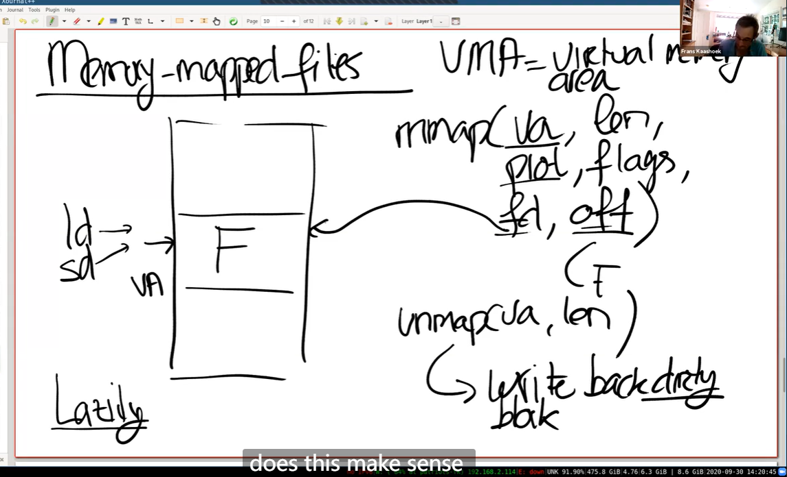

当然，在任何聪明的内存管理机制中，所有的这些都是以lazy的方式实现。你不会立即将文件内容拷贝到内存中，而是先记录一下这个PTE属于这个文件描述符。相应的信息通常在VMA结构体中保存，VMA全称是Virtual Memory Area。例如对于这里的文件f，会有一个VMA，在VMA中我们会记录文件描述符，偏移量等等，这些信息用来表示对应的内存虚拟地址的实际内容在哪，这样当我们得到一个位于VMA地址范围的page fault时，内核可以从磁盘中读数据，并加载到内存中。所以这里回答之前一个问题，dirty bit是很重要的，因为在unmap中，你需要向文件回写dirty block。

- 学生提问：有没有可能多个进程将同一个文件映射到内存，然后会有同步的问题？
- Frans教授：好问题。这个问题其实等价于，多个进程同时通过read/write系统调用读写一个文件会怎么样？
- 这里的行为是不可预知的。write系统调用会以某种顺序出现，如果两个进程向一个文件的block写数据，要么第一个进程的write能生效，要么第二个进程的write能生效，只能是两者之一生效。在这里其实也是一样的，所以我们并不需要考虑冲突的问题。
- 一个更加成熟的Unix操作系统支持锁定文件，你可以先锁定文件，这样就能保证数据同步。但是默认情况下，并没有同步保证。
学生提问：mmap的参数中，len和flag是什么意思？
- Frans教授：len是文件中你想映射到内存中的字节数。prot是read/write。flags会在mmap lab中出现，我认为它表示了这个区域是私有的还是共享的。如果是共享的，那么这个区域可以在多个进程之间共享。
- **学生提问：如果其他进程直接修改了文件的内容，那么是不是意味着修改的内容不会体现在这里的内存中？**
- Frans教授：是的。但是如果文件是共享的，那么你应该同步这些变更。我记不太清楚在mmap中，文件共享时会发生什么。
你们会在file system lab之后做这里相关的mmap lab，这将会是我们最后一个虚拟内存实验。

最后来总结一下最近几节课的内容，我们首先详细看了一下page table是如何工作的，之后我们详细看了一下trap是如何工作的。而page fault结合了这两部分的内容，可以用来实现非常强大且优雅的虚拟内存功能。我们这节课介绍的内容，只是操作系统里面基于page fault功能的子集。一个典型的操作系统实现了今天讨论的所有内容，如果你查看Linux，它包含了所有的内容，以及许多其他有趣的功能。今天的内容希望能给让你们理解，一旦你可以在page fault handler中动态的更新page table，虚拟内存将会变得有多强大。

