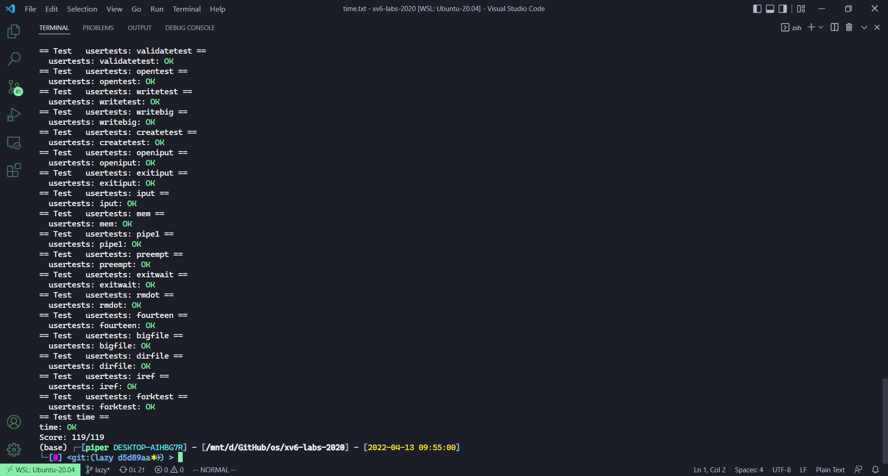

# Lab: xv6 lazy page allocation

本节作业：
- https://github.com/PiperLiu/xv6-labs-2020/tree/lazy

目录：

<!-- @import "[TOC]" {cmd="toc" depthFrom=2 depthTo=2 orderedList=false} -->

<!-- code_chunk_output -->


<!-- /code_chunk_output -->

细分目录：

<!-- @import "[TOC]" {cmd="toc" depthFrom=2 depthTo=6 orderedList=false} -->

<!-- code_chunk_output -->

- [Eliminate allocation from sbrk()](#eliminate-allocation-from-sbrk)
- [Lazy allocation](#lazy-allocation)
- [Lazytests and Usertests](#lazytests-and-usertests)

<!-- /code_chunk_output -->

### Eliminate allocation from sbrk()

Your first task is to delete page allocation from the sbrk(n) system call implementation, which is the function sys_sbrk() in sysproc.c. The sbrk(n) system call grows the process's memory size by n bytes, and then returns the start of the newly allocated region (i.e., the old size). Your new sbrk(n) should just increment the process's size (`myproc()->sz`) by n and return the old size. It should not allocate memory -- so you should delete the call to growproc() (but you still need to increase the process's size!).
Try to guess what the result of this modification will be: what will break?

Make this modification, boot xv6, and type echo hi to the shell. You should see something like this:

```
init: starting sh
$ echo hi
usertrap(): unexpected scause 0x000000000000000f pid=3
            sepc=0x0000000000001258 stval=0x0000000000004008
va=0x0000000000004000 pte=0x0000000000000000
panic: uvmunmap: not mapped
```

The "`usertrap(): ...`" message is from the user trap handler in trap.c; it has caught an exception that it does not know how to handle. Make sure you understand why this page fault occurs. The "`stval=0x0..04008`" indicates that the virtual address that caused the page fault is `0x4008`.

实际上不就是教授课上演示的内容吗？

kernel/sysproc.c

```c
uint64
sys_sbrk(void)
{
  int addr;
  int n;

  if(argint(0, &n) < 0)
    return -1;
  addr = myproc()->sz;
  myproc()->sz += n;  // 新增
  // if(growproc(n) < 0)
  //   return -1;
  return addr;
}
```

运行之后：

```c
$ echo hi
usertrap(): unexpected scause 0x000000000000000f pid=3
            sepc=0x00000000000012ac stval=0x0000000000004008
panic: uvmunmap: not mapped
```

查询 user/sh.asm 的 12ac ：

```asm
  hp->s.size = nu;
    12ac:	01652423          	sw	s6,8(a0)
  free((void*)(hp + 1));
    12b0:	0541                	addi	a0,a0,16
    12b2:	00000097          	auipc	ra,0x0
    12b6:	ec6080e7          	jalr	-314(ra) # 1178 <free>
  return freep;
```

### Lazy allocation

Modify the code in trap.c to respond to a page fault from user space by mapping a newly-allocated page of physical memory at the faulting address, and then returning back to user space to let the process continue executing. You should add your code just before the printf call that produced the "usertrap(): ..." message. Modify whatever other xv6 kernel code you need to in order to get `echo hi` to work.

Here are some hints:
- You can check whether a fault is a page fault by seeing if r_scause() is 13 or 15 in usertrap().
- r_stval() returns the RISC-V stval register, which contains the virtual address that caused the page fault.
- Steal code from uvmalloc() in vm.c, which is what sbrk() calls (via growproc()). You'll need to call kalloc() and mappages().
- Use PGROUNDDOWN(va) to round the faulting virtual address down to a page boundary.
- uvmunmap() will panic; modify it to not panic if some pages aren't mapped.
- If the kernel crashes, look up sepc in kernel/kernel.asm
- Use your vmprint function from pgtbl lab to print the content of a page table.
- If you see the error "incomplete type proc", include "spinlock.h" then "proc.h".

If all goes well, your lazy allocation code should result in `echo hi` working. You should get at least one page fault (and thus lazy allocation), and perhaps two.

其实教授课上也演示过怎么修改了。

kernel/trap.c 的 usertrap() 函数：

```c
  if(r_scause() == 8){
    // system call

    if(p->killed)
      exit(-1);

    // sepc points to the ecall instruction,
    // but we want to return to the next instruction.
    p->trapframe->epc += 4;

    // an interrupt will change sstatus &c registers,
    // so don't enable until done with those registers.
    intr_on();

    syscall();
  } else if((which_dev = devintr()) != 0){
    // ok
  } else if (r_scause() == 13 || r_scause() == 15) {  // 如果是 page fault
    char *mem;
    if ((mem = kalloc()) != 0) {  // 分配一个物理页
      memset(mem, 0, PGSIZE);
      uint64 va = PGROUNDDOWN(r_stval());  // 虚地址向下取整
      // 页表映射
      if (mappages(p->pagetable, va, PGSIZE, (uint64) mem, PTE_W|PTE_R|PTE_U) != 0) {
        kfree(mem);
        printf("usertrap(): mappages() failed\n");
        p->killed = 1;
      }
    } else {  // 物理页分配失败
      printf("usertrap(): kalloc() failed\n");
      p->killed = 1;
    }
  } else {
    printf("usertrap(): unexpected scause %p pid=%d\n", r_scause(), p->pid);
    printf("            sepc=%p stval=%p\n", r_sepc(), r_stval());
    p->killed = 1;
  }
```

vm.c 的 uvmunmap() 函数：

```c
// Remove npages of mappings starting from va. va must be
// page-aligned. The mappings must exist.
// Optionally free the physical memory.
void
uvmunmap(pagetable_t pagetable, uint64 va, uint64 npages, int do_free)
{
  uint64 a;
  pte_t *pte;

  if((va % PGSIZE) != 0)
    panic("uvmunmap: not aligned");

  for(a = va; a < va + npages*PGSIZE; a += PGSIZE){
    if((pte = walk(pagetable, a, 0)) == 0)
      panic("uvmunmap: walk");
    if((*pte & PTE_V) == 0)
      // panic("uvmunmap: not mapped");
    { // 如果不可该页无效，大概率是 lazy allocation ，不 panic
      continue;
    }
    if(PTE_FLAGS(*pte) == PTE_V)
      panic("uvmunmap: not a leaf");
    if(do_free){
      uint64 pa = PTE2PA(*pte);
      kfree((void*)pa);
    }
    *pte = 0;
  }
}
```

### Lazytests and Usertests

We've supplied you with lazytests, an xv6 user program that tests some specific situations that may stress your lazy memory allocator. Modify your kernel code so that all of both lazytests and usertests pass.

- Handle negative sbrk() arguments.
- Kill a process if it page-faults on a virtual memory address higher than any allocated with sbrk().
- Handle the parent-to-child memory copy in fork() correctly.
- Handle the case in which a process passes a valid address from sbrk() to a system call such as read or write, but the memory for that address has not yet been allocated.
- Handle out-of-memory correctly: if kalloc() fails in the page fault handler, kill the current process.
- Handle faults on the invalid page below the user stack.

Your solution is acceptable if your kernel passes lazytests and usertests:

```
$  lazytests
lazytests starting
running test lazy alloc
test lazy alloc: OK
running test lazy unmap...
usertrap(): ...
test lazy unmap: OK
running test out of memory
usertrap(): ...
test out of memory: OK
ALL TESTS PASSED
$ usertests
...
ALL TESTS PASSED
$
```

如何设计一个更加健壮的 lazy allocator ？这里各种 corner cases 教授都为我们考虑清楚了。

首先处理 `negative sbrk() arguments` ，这里一些细节分析参考[这篇博客](https://blog.csdn.net/LostUnravel/article/details/121418421)。

```c
uint64
sys_sbrk(void)
{
  int addr;
  int n;

  if(argint(0, &n) < 0)
    return -1;
  addr = myproc()->sz;
  if (n >= 0 && addr + n > addr) {  // addr + n > addr 保证不溢出
    // 无需检测 addr + n < trapframe ，因为 addr + n 都是 int
    p->sz += n;
  } else if (n < 0 && addr + n >= PGROUNDUP(myproc()->trapframe->sp)) {
    // 这里不能让 heap 把 stack 反噬了
    p-sz = uvmdealloc(p->pagetable, addr, addr + n);
  } else {
    return -1;
  }
  return addr;
}
```

对于 uvmunmap 函数：

```c
    if((pte = walk(pagetable, a, 0)) == 0)
      // panic("uvmunmap: walk");
    { // 如果 sbrk 申请的空间很大，这将导致新增很多一级页表
      // 因此可能一级页表也是未使用的，无效的
      continue;
    }
```

- [X] Handle negative sbrk() arguments.
- [X] Kill a process if it page-faults on a virtual memory address higher than any allocated with sbrk().

对于 fork 函数，无需修改什么：

```c
  // Copy user memory from parent to child.
  if(uvmcopy(p->pagetable, np->pagetable, p->sz) < 0){
    freeproc(np);
    release(&np->lock);
    return -1;
  }
```

但是， fork 中使用 uvmcopy 把父进程空间复制给子进程，因此需要修改 uvmcopy 函数：

```c
// Given a parent process's page table, copy
// its memory into a child's page table.
// Copies both the page table and the
// physical memory.
// returns 0 on success, -1 on failure.
// frees any allocated pages on failure.
int
uvmcopy(pagetable_t old, pagetable_t new, uint64 sz)
{
  pte_t *pte;
  uint64 pa, i;
  uint flags;
  char *mem;

  for(i = 0; i < sz; i += PGSIZE){
    if((pte = walk(old, i, 0)) == 0)
      continue;
      // panic("uvmcopy: pte should exist");
    if((*pte & PTE_V) == 0)
      continue;
      // panic("uvmcopy: page not present");
    pa = PTE2PA(*pte);
    flags = PTE_FLAGS(*pte);
    if((mem = kalloc()) == 0)
      goto err;
    memmove(mem, (char*)pa, PGSIZE);
    if(mappages(new, i, PGSIZE, (uint64)mem, flags) != 0){
      kfree(mem);
      goto err;
    }
  }
  return 0;

 err:
  uvmunmap(new, 0, i / PGSIZE, 1);
  return -1;
}
```

- [X] Handle the parent-to-child memory copy in fork() correctly.

对于 write 和 read 到了 sbrk 未分配的地址时，由于此时已经在 kernel ，因此不会触发 page fault 。因此这里给分配内存就行了。

通过查看代码发现， write 和 read 最终都是调用 copyout 和 copyin 函数，而这二者都是通过 walkaddr 获取物理地址，因此修改 walkaddr 函数：

```c
#include "spinlock.h"
#include "proc.h"

// Look up a virtual address, return the physical address,
// or 0 if not mapped.
// Can only be used to look up user pages.
uint64
walkaddr(pagetable_t pagetable, uint64 va)
{
  pte_t *pte;
  uint64 pa;

  if(va >= MAXVA)
    return 0;

  pte = walk(pagetable, va, 0);
  if(pte == 0 || (*pte & PTE_V) == 0) {
    if (va >= PGROUNDUP(p->trapframe->sp) && va < p->sz) {
      char *mem;
      if ((mem = kalloc()) == 0)
        return 0;
      memset(mem, 0, PGSIZE);
      if (mappages(p->pagetable, PGROUNDDOWN(va), PGSIZE, (uint64) mem, PTE_W|PTE_R|PTE_U) != 0) {
        kfree(mem);
        return 0;
      }
    } else {
      return 0;
    }
  }
  // if((*pte & PTE_V) == 0)
    // return 0;
  if((*pte & PTE_U) == 0)
    return 0;
  pa = PTE2PA(*pte);
  return pa;
}
```

- [X] Handle the case in which a process passes a valid address from sbrk() to a system call such as read or write, but the memory for that address has not yet been allocated.

处理 out-of-memory 或者 faults on the invalid page below the user stack 时的情况，修改 usertrap ：

```c
//
// handle an interrupt, exception, or system call from user space.
// called from trampoline.S
//
void
usertrap(void)
{
  int which_dev = 0;

  if((r_sstatus() & SSTATUS_SPP) != 0)
    panic("usertrap: not from user mode");

  // send interrupts and exceptions to kerneltrap(),
  // since we're now in the kernel.
  w_stvec((uint64)kernelvec);

  struct proc *p = myproc();
  
  // save user program counter.
  p->trapframe->epc = r_sepc();
  
  if(r_scause() == 8){
    // system call

    if(p->killed)
      exit(-1);

    // sepc points to the ecall instruction,
    // but we want to return to the next instruction.
    p->trapframe->epc += 4;

    // an interrupt will change sstatus &c registers,
    // so don't enable until done with those registers.
    intr_on();

    syscall();
  } else if((which_dev = devintr()) != 0){
    // ok
  } else if (r_scause() == 13 || r_scause() == 15) {  // 如果是 page fault
    char *mem;
    if ((mem = kalloc()) != 0) {  // 分配一个物理页
      if (va >= p->sz) {
        printf("usertrap(): invalid va=%p larger than p->sz=%p\n", va, p->sz);
        p->killed = 1;
        goto killp;
      }
      if (va < PGROUNDUP(p->trapframe->sp)) {
        printf("usertrap(): invalid va=%p below user stack: %p\n", va, p->trapframe->sp);
        p->killed = 1;
        goto killp;
      }
      memset(mem, 0, PGSIZE);
      uint64 va = PGROUNDDOWN(r_stval());  // 虚地址向下取整
      // 页表映射
      if (mappages(p->pagetable, va, PGSIZE, (uint64) mem, PTE_W|PTE_R|PTE_U) != 0) {
        kfree(mem);
        printf("usertrap(): mappages() failed\n");
        p->killed = 1;
      }
    } else {  // 物理页分配失败
      printf("usertrap(): kalloc() failed\n");
      p->killed = 1;
    }
  } else {
    printf("usertrap(): unexpected scause %p pid=%d\n", r_scause(), p->pid);
    printf("            sepc=%p stval=%p\n", r_sepc(), r_stval());
    p->killed = 1;
  }

killp:
  if(p->killed)
    exit(-1);

  // give up the CPU if this is a timer interrupt.
  if(which_dev == 2)
    yield();

  usertrapret();
}
```

- [X] Handle out-of-memory correctly: if kalloc() fails in the page fault handler, kill the current process.
- [X] Handle faults on the invalid page below the user stack.


