# LEC 9 (fk): Interrupts

笔记大量参考了[肖宏辉](https://www.zhihu.com/people/xiao-hong-hui-15)大佬的翻译。

目录：

<!-- @import "[TOC]" {cmd="toc" depthFrom=2 depthTo=2 orderedList=false} -->

<!-- code_chunk_output -->

- [真实操作系统内存使用情况](#真实操作系统内存使用情况)
- [Interrupt硬件部分](#interrupt硬件部分)
- [Interrupt软件部分](#interrupt软件部分)
- [详细看UART驱动实现](#详细看uart驱动实现)
- [Interrupt相关的并发（对buffer的producer/consumer并发）](#interrupt相关的并发对buffer的producerconsumer并发)
- [UART读取键盘输入](#uart读取键盘输入)
- [Interrupt的演进（引出polling）](#interrupt的演进引出polling)

<!-- /code_chunk_output -->

细分目录：

<!-- @import "[TOC]" {cmd="toc" depthFrom=2 depthTo=6 orderedList=false} -->

<!-- code_chunk_output -->

- [真实操作系统内存使用情况](#真实操作系统内存使用情况)
- [Interrupt硬件部分](#interrupt硬件部分)
  - [中断是从哪里产生的？](#中断是从哪里产生的)
- [Interrupt软件部分](#interrupt软件部分)
  - [设备驱动概述（UART设备为例）](#设备驱动概述uart设备为例)
  - [如何对设备进行编程（memory mapped I/O）](#如何对设备进行编程memory-mapped-io)
  - [在XV6中设置中断](#在xv6中设置中断)
  - [start.c的start函数以及 main 中如何处理 External 中断](#startc的start函数以及-main-中如何处理-external-中断)
  - [PLIC编程，让断能被CPU感知以及main中scheduler让CPU接收中断](#plic编程让断能被cpu感知以及main中scheduler让cpu接收中断)
- [详细看UART驱动实现](#详细看uart驱动实现)
  - [UART驱动的top部分](#uart驱动的top部分)
  - [UART驱动的bottom部分](#uart驱动的bottom部分)
- [Interrupt相关的并发（对buffer的producer/consumer并发）](#interrupt相关的并发对buffer的producerconsumer并发)
- [UART读取键盘输入](#uart读取键盘输入)
- [Interrupt的演进（引出polling）](#interrupt的演进引出polling)

<!-- /code_chunk_output -->

## 真实操作系统内存使用情况

今天课程的内容是中断。但是在具体介绍中断之前，我想先回顾一下上周一些有趣的内容。因为上周的课程主要是讲内存，我们收到了很多内存相关的问题。我想先讨论一下内存是如何被真实的操作系统（而不是像XV6这样的教学操作系统）所使用。

下图是一台Athena计算机（注，MIT内部共享使用的计算机）的top指令输出。如果你查看Mem这一行：

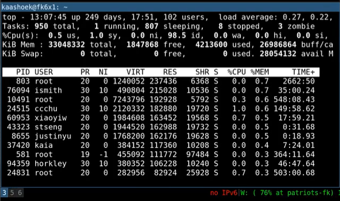

首先是计算机中总共有多少内存（33048332），如果你再往后看的话，你会发现大部分内存都被使用了（4214604 + 26988148）。但是大部分内存并没有被应用程序所使用，而是被buff/cache用掉了。这在一个操作系统中还挺常见的，因为我们不想让物理内存就在那闲置着，我们想让物理内存被用起来，所以这里大块的内存被用作buff/cache。可以看到还有一小块内存是空闲的（1845580），但是并不多。

以上是一个非常常见的场景，大部分操作系统运行时几乎没有任何空闲的内存。这意味着，如果应用程序或者内核需要使用新的内存，那么我们需要丢弃一些已有的内容。现在的空闲内存（free）或许足够几个page用，但是在某个时间点如果需要大量内存的话，要么是从应用程序，要么是从buffer/cache中，需要撤回已经使用的一部分内存。所以，当内核在分配内存的时候，通常都不是一个低成本的操作，因为并不总是有足够的可用内存，为了分配内存需要先撤回一些内存。

另外，我这里将top的输出按照RES进行了排序。如果你查看输出的每一行，VIRT表示的是虚拟内存地址空间的大小，RES是实际使用的内存数量。从这里可以看出，实际使用的内存数量远小于地址空间的大小。所以，我们上节课讨论的基于虚拟内存和page fault提供的非常酷的功能在这都有使用，比如说demand paging。

有关这台机器的其它信息还有：
- 即使它有103个用户登录进来了，它的负载还是很低
- 它有许多许多的进程
- 这台机器已经运行了249天，我们的XV6系统或许运行不了这么久

这里想传达的信息：大部分内存都被使用了，并且RES内存远小于VIRT内存。

## Interrupt硬件部分

中断对应的场景很简单，就是硬件想要得到操作系统的关注。例如网卡收到了一个packet，网卡会生成一个中断；用户通过键盘按下了一个按键，键盘会产生一个中断。操作系统需要做的是，保存当前的工作，处理中断，处理完成之后再恢复之前的工作。这里的保存和恢复工作，与我们之前看到的系统调用过程非常相似。所以系统调用，page fault，中断，都使用相同的机制。

但是中断又有一些不一样的地方，这就是为什么我们要花一节课的时间来讲它。中断与系统调用主要有3个小的差别：
- asynchronous。当硬件生成中断时，Interrupt handler与当前运行的进程在CPU上没有任何关联。但如果是系统调用的话，系统调用发生在运行进程的context下。
- concurrency。我们这节课会稍微介绍并发，在下一节课，我们会介绍更多并发相关的内容。对于中断来说，CPU和生成中断的设备是并行的在运行。网卡自己独立的处理来自网络的packet，然后在某个时间点产生中断，但是同时，CPU也在运行。所以我们在CPU和设备之间是真正的并行的，我们必须管理这里的并行。
- program device。我们这节课主要关注外部设备，例如网卡，UART，而这些设备需要被编程。每个设备都有一个编程手册，就像RISC-V有一个包含了指令和寄存器的手册一样。设备的编程手册包含了它有什么样的寄存器，它能执行什么样的操作，在读写控制寄存器的时候，设备会如何响应。不过通常来说，设备的手册不如RISC-V的手册清晰，这会使得对于设备的编程会更加复杂。

我们这节课的内容非常的简单。我们会讨论
- console中的提示符“`$`”是如何显示出来的
- 如果你在键盘输入“ls”，这些字符是怎么最终在console中显示出来的。

### 中断是从哪里产生的？

> 通用异步收发传输器（Universal Asynchronous Receiver/Transmitter)，通常称作UART。它将要传输的资料在串行通信与并行通信之间加以转换。作为把并行输入信号转成串行输出信号的芯片，UART通常被集成于其他通讯接口的连结上。

因为我们主要关心的是外部设备的中断，而不是定时器中断或者软件中断。外设中断来自于主板上的设备，下图是一个SiFive主板，如果你查看这个主板，你可以发现有大量的设备连接在或者可以连接到这个主板上。

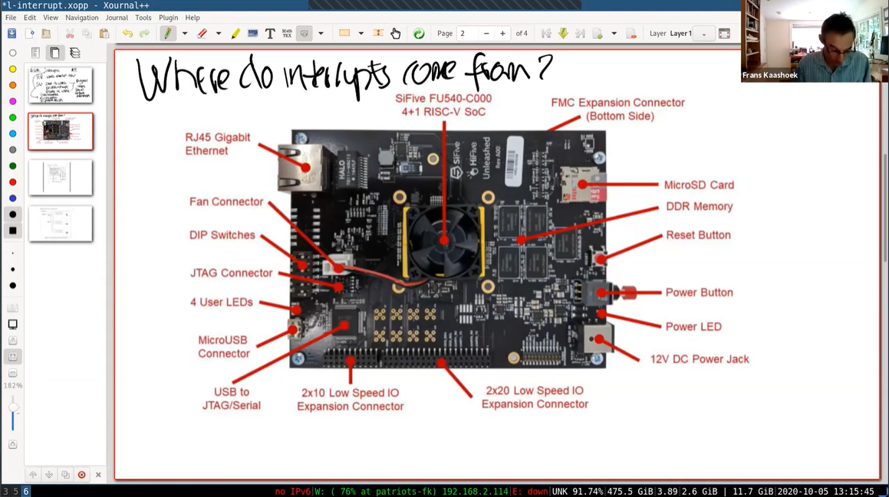

主板可以连接以太网卡，MicroUSB，MicroSD等，主板上的各种线路将外设和CPU连接在一起。这节课的大部分内容都会介绍当设备产生中断时CPU会发生什么，以及如何从设备读写数据。
下图是来自于SiFive有关处理器的文档，图中的右侧是各种各样的设备，例如UART0。我们在之前的课程已经知道UART0会映射到内核内存地址的某处，而所有的物理内存都映射在地址空间的0x80000000之上。 **类似于读写内存，通过向相应的设备地址执行load/store指令，我们就可以对例如UART的设备进行编程。**

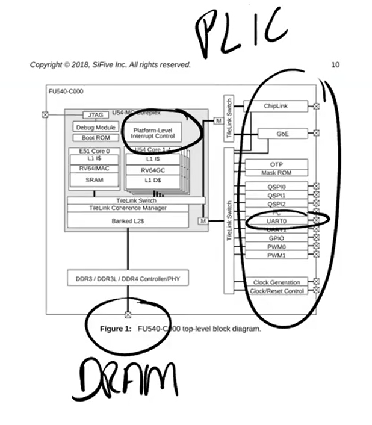

**所有的设备都连接到处理器上，处理器上是通过Platform Level Interrupt Control，简称PLIC来处理设备中断。PLIC会管理来自于外设的中断。如果我们再进一步深入的查看PLIC的结构图。**

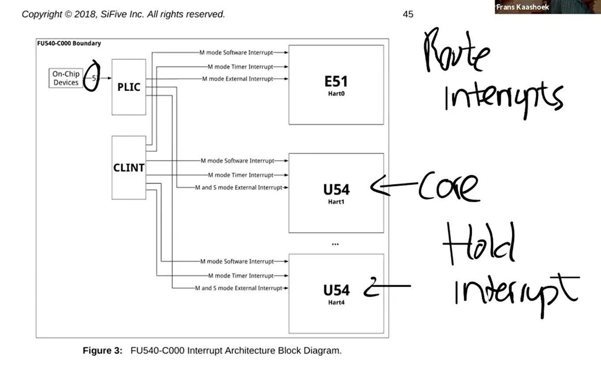

从左上角可以看出，我们有53个不同的来自于设备的中断。这些中断到达PLIC之后，PLIC会路由这些中断。图的右下角是CPU的核，PLIC会将中断路由到某一个CPU的核。如果所有的CPU核都正在处理中断，PLIC会保留中断直到有一个CPU核可以用来处理中断。所以PLIC需要保存一些内部数据来跟踪中断的状态。
如果你看过了文档，这里的具体流程是：
- PLIC会通知当前有一个待处理的中断
- 其中一个CPU核会Claim接收中断，这样PLIC就不会把中断发给其他的CPU处理
- CPU核处理完中断之后，CPU会通知PLIC
- PLIC将不再保存中断的信息

学生提问：PLIC有没有什么机制能确保中断一定被处理？

Frans教授：这里取决于内核以什么样的方式来对PLIC进行编程。PLIC只是分发中断， **而内核需要对PLIC进行编程来告诉它中断应该分发到哪。** 实际上，内核可以对中断优先级进行编程，这里非常的灵活。

学生提问：当UART触发中断的时候，所有的CPU核都能收到中断吗？

Frans教授：取决于你如何对PLIC进行编程。对于XV6来说，所有的CPU都能收到中断，但是只有一个CPU会Claim相应的中断。

## Interrupt软件部分

### 设备驱动概述（UART设备为例）

通常来说，管理设备的代码称为驱动，所有的驱动都在内核中。我们今天要看的是UART设备的驱动，代码在uart.c文件中。如果我们查看代码的结构，我们可以发现大部分驱动都分为两个部分，bottom/top。

bottom部分通常是Interrupt handler。当一个中断送到了CPU，并且CPU设置接收这个中断，CPU会调用相应的Interrupt handler。Interrupt handler并不运行在任何特定进程的context中，它只是处理中断。

top部分，是用户进程，或者内核的其他部分调用的接口。对于UART来说，这里有read/write接口，这些接口可以被更高层级的代码调用。

通常情况下， **驱动中会有一些队列（或者说buffer），top部分的代码会从队列中读写数据，而Interrupt handler（bottom部分）同时也会向队列中读写数据。这里的队列可以将并行运行的设备和CPU解耦开来。**

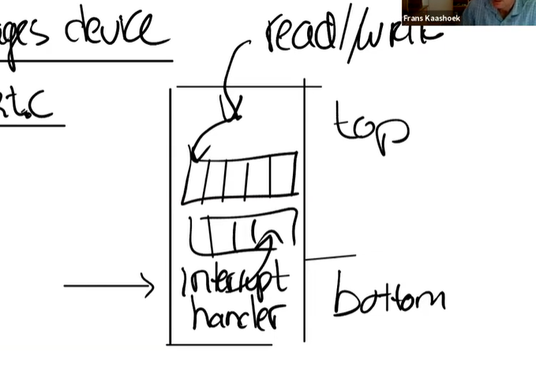

**通常对于Interrupt handler来说存在一些限制，因为它并没有运行在任何进程的context中，所以进程的page table并不知道该从哪个地址读写数据，也就无法直接从Interrupt handler读写数据。** 驱动的top部分通常与用户的进程交互，并进行数据的读写。我们后面会看更多的细节，这里是一个驱动的典型架构。

在很多操作系统中，驱动代码加起来可能会比内核还要大，主要是因为，对于每个设备，你都需要一个驱动，而设备又很多。

### 如何对设备进行编程（memory mapped I/O）

通常来说，对设备编程是通过memory mapped I/O完成的。在SiFive的手册中，设备地址出现在物理地址的特定区间内，这个区间由主板制造商决定。操作系统需要知道这些设备位于物理地址空间的具体位置，然后再通过普通的load/store指令对这些地址进行编程。load/store指令实际上的工作就是读写设备的控制寄存器。例如，对网卡执行store指令时，CPU会修改网卡的某个控制寄存器，进而导致网卡发送一个packet。所以这里的load/store指令不会读写内存，而是会操作设备。并且你需要阅读设备的文档来弄清楚设备的寄存器和相应的行为，有的时候文档很清晰，有的时候文档不是那么清晰。

下图中是SiFive主板中的对应设备的物理地址。

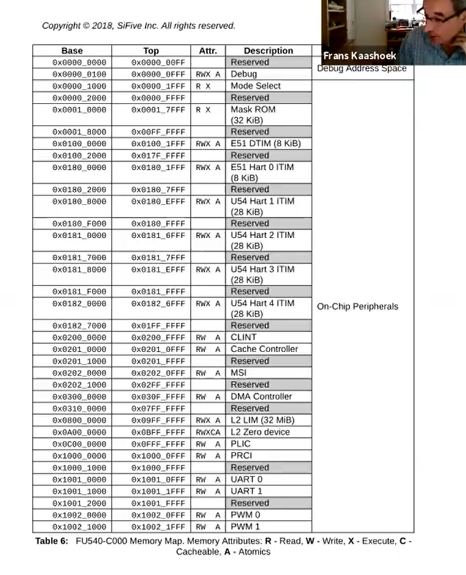

例如，`0x200_0000`对应CLINT，`0xC000000`对应的是PLIC。在这个图中UART0对应的是`0x1001_0000`，但是在QEMU中，我们的UART0的地址略有不同，因为在QEMU中我们并不是完全的模拟SiFive主板，而是模拟与SiFive主板非常类似的东西。

以上就是Memory-mapped IO。

下图是UART的文档。16550是QEMU模拟的UART设备，QEMU用这个模拟的设备来与键盘和Console进行交互。

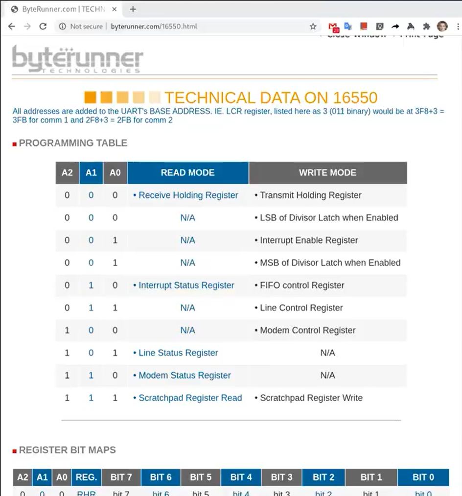

这是一个很简单的芯片，图中表明了芯片拥有的寄存器。例如对于控制寄存器`000`，如果写它会将数据写入到寄存器中并被传输到其他地方，如果读它可以读出存储在寄存器中的内容。UART可以让你能够通过串口发送数据bit，在线路的另一侧会有另一个UART芯片，能够将数据bit组合成一个个Byte。

这里还有一些其他可以控制的地方，例如控制寄存器`001`，可以通过它来控制UART是否产生中断。实际上对于一个寄存器，其中的每个bit都有不同的作用。例如对于寄存器`001`，也就是IER寄存器，`bit0-bit3`分别控制了不同的中断。这个文档还有很多内容，但是对于我们这节课来说，上图就足够了。不过即使是这么简单的一个设备，它的文档也有很多页。

学生提问：如果你写入数据到Transmit Holding Register，然后再次写入，那么前一个数据不会被覆盖掉吗？

Frans教授：这是我们需要注意的一件事情。 **我们通过load将数据写入到这个寄存器中，之后UART芯片会通过串口线将这个Byte送出。当完成了发送，UART会生成一个中断给内核，这个时候才能再次写入下一个数据。** 所以内核和设备之间需要 **遵守一些协议才能确保一切工作正常。** 上图中的UART芯片会有一个容量是16的FIFO，但是你还是要小心，因为如果阻塞了16个Byte之后再次写入还是会造成数据覆盖。

### 在XV6中设置中断

当XV6启动时，Shell会输出提示符“`$ `”，如果我们在键盘上输入ls，最终可以看到“`$ ls`”。我们接下来通过研究Console是如何显示出“`$ ls`”，来看一下设备中断是如何工作的。

实际上“`$ `”和“`ls`”还不太一样，“`$ `”是Shell程序的输出，而“`ls`”是用户通过键盘输入之后再显示出来的。

对于“`$ `”来说，实际上就是CPU将字符传输给UART的寄存器，UART之后会在发送完字符之后产生一个中断。在QEMU中，模拟的线路的另一端会有另一个UART芯片（模拟的），这个UART芯片连接到了虚拟的Console，它会进一步将“`$ `”显示在console上。

另一方面， **对于“`ls`”，这是用户输入的字符。键盘连接到了UART的输入线路，当你在键盘上按下一个按键，UART芯片会将按键字符通过串口线发送到另一端的UART芯片。另一端的UART芯片先将数据bit合并成一个Byte，之后再产生一个中断，并告诉处理器说这里有一个来自于键盘的字符。之后Interrupt handler会处理来自于UART的字符。我们接下来会深入通过这两部分来弄清楚这里是如何工作的。**

RISC-V有许多与中断相关的寄存器：
- SIE（Supervisor Interrupt Enable）寄存器。这个寄存器中有一个bit（E）专门针对例如UART的外部设备的中断；有一个bit（S）专门针对软件中断，软件中断可能由一个CPU核触发给另一个CPU核；还有一个bit（T）专门针对定时器中断。我们这节课只关注外部设备的中断。
- SSTATUS（Supervisor Status）寄存器。这个寄存器中有一个bit来打开或者关闭中断。 **每一个CPU核都有独立的SIE和SSTATUS寄存器，除了通过SIE寄存器来单独控制特定的中断，还可以通过SSTATUS寄存器中的一个bit来控制所有的中断。**
- SIP（Supervisor Interrupt Pending）寄存器。当发生中断时，处理器可以通过查看这个寄存器知道当前是什么类型的中断。
- SCAUSE寄存器，这个寄存器我们之前看过很多次。它会表明当前状态的原因是中断。
- STVEC寄存器，它会保存当trap，page fault或者中断发生时，CPU运行的用户程序的程序计数器，这样才能在稍后恢复程序的运行。

我们今天不会讨论SCAUSE和STVEC寄存器，因为在中断处理流程中，它们基本上与之前（注，lec06）的工作方式是一样的。接下来我们看看XV6是如何对其他寄存器进行编程，使得CPU处于一个能接受中断的状态。

### start.c的start函数以及 main 中如何处理 External 中断

接下来看看代码，首先是位于start.c的start函数。

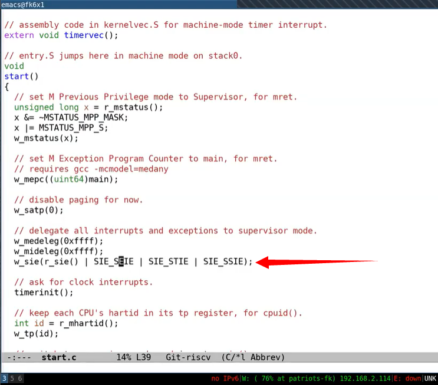

这里将所有的中断都设置在Supervisor mode，然后设置SIE寄存器来接收External，软件和定时器中断，之后初始化定时器。


接下来我们看一下main函数中是如何处理External中断。

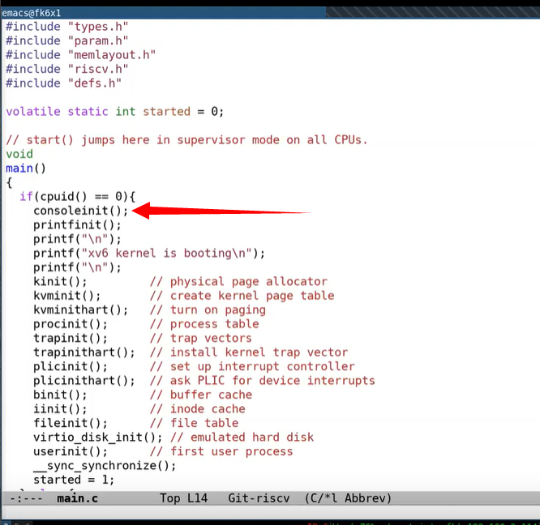

consoleinit 会调用 uartinit ：

```c
void
uartinit(void)
{
  // disable interrupts.
  WriteReg(IER, 0x00);

  // special mode to set baud rate.
  WriteReg(LCR, LCR_BAUD_LATCH);

  // LSB for baud rate of 38.4K.
  WriteReg(0, 0x03);

  // MSB for baud rate of 38.4K.
  WriteReg(1, 0x00);

  // leave set-baud mode,
  // and set word length to 8 bits, no parity.
  WriteReg(LCR, LCR_EIGHT_BITS);

  // reset and enable FIFOs.
  WriteReg(FCR, FCR_FIFO_ENABLE | FCR_FIFO_CLEAR);

  // enable transmit and receive interrupts.
  WriteReg(IER, IER_TX_ENABLE | IER_RX_ENABLE);

  initlock(&uart_tx_lock, "uart");
}
```

这里首先初始化了锁，我们现在还不关心这个锁。然后调用了uartinit，uartinit函数位于uart.c文件。这个函数实际上就是配置好UART芯片使其可以被使用。

这里的流程是先关闭中断，之后设置波特率，设置字符长度为8bit，重置FIFO，最后再重新打开中断。

学生提问：什么是波特率？

**Frans教授：波特率是串口线的传输速率。**

以上就是uartinit函数，运行完这个函数之后，原则上UART就可以生成中断了。

### PLIC编程，让断能被CPU感知以及main中scheduler让CPU接收中断

**但是因为我们还没有对PLIC编程，所以中断不能被CPU感知。最终，在main函数中，需要调用plicinit函数。**

```c
void
plicinithart(void)
{
  int hart = cpuid();
  
  // set uart's enable bit for this hart's S-mode. 
  *(uint32*)PLIC_SENABLE(hart)= (1 << UART0_IRQ) | (1 << VIRTIO0_IRQ);

  // set this hart's S-mode priority threshold to 0.
  *(uint32*)PLIC_SPRIORITY(hart) = 0;
}
```

所以在`plicinithart`函数中，每个CPU的核都表明自己对来自于UART和VIRTIO的中断感兴趣。因为我们忽略中断的优先级，所以我们将优先级设置为0。

到目前为止，我们有了生成中断的外部设备，我们有了PLIC可以传递中断到单个的CPU。 **但是CPU自己还没有设置好接收中断，因为我们还没有设置好SSTATUS寄存器。** 在main函数的最后，程序调用了scheduler函数：


如上打开了中断（实际上就是写 sstatus 寄存器的 SSTATUS_SIE 位）。

在这个时间点，中断被完全打开了。如果PLIC正好有pending的中断，那么这个CPU核会收到中断。

学生提问：哪些核在intr_on之后打开了中断？

Frans教授：任何一个调用了intr_on的CPU核，都会接收中断。实际上所有的CPU核都会运行intr_on函数。

## 详细看UART驱动实现

### UART驱动的top部分

接下来我想看一下如何从Shell程序输出提示符“`$ `”到Console。首先我们看init.c中的main函数，这是系统启动后运行的第一个进程。

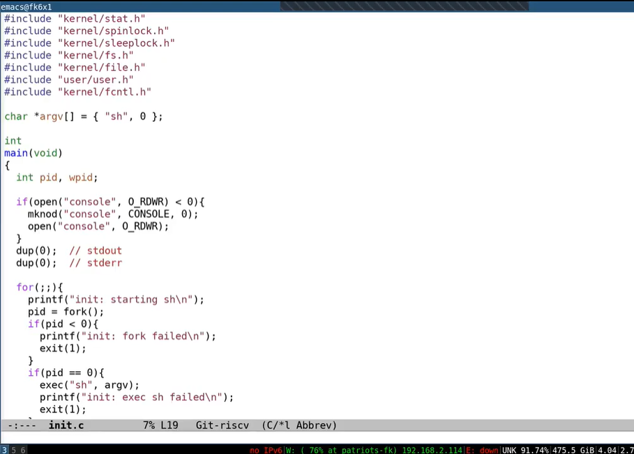

首先这个进程的main函数创建了一个代表Console的设备。这里通过mknod操作创建了console设备。因为这是第一个打开的文件，所以这里的文件描述符0。之后通过dup创建stdout和stderr。这里实际上通过复制文件描述符0，得到了另外两个文件描述符1，2。最终文件描述符0，1，2都用来代表Console。

Shell程序首先打开文件描述符0，1，2。之后Shell向文件描述符2打印提示符“`$ `”。

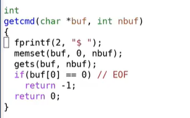

尽管Console背后是UART设备，但是从应用程序来看，它就像是一个普通的文件。Shell程序只是向文件描述符2写了数据，它并不知道文件描述符2对应的是什么。在Unix系统中，设备是由文件表示。我们来看一下这里的fprintf是如何工作的。

在printf.c文件中，代码只是调用了write系统调用，在我们的例子中，fd对应的就是文件描述符2，c是字符“$”。

```c
static void
putc(int fd, int c)
{
  write(fd, &c, 1);
}
```

所以由Shell输出的每一个字符都会触发一个write系统调用。之前我们已经看过了write系统调用最终会走到sysfile.c文件的sys_write函数。

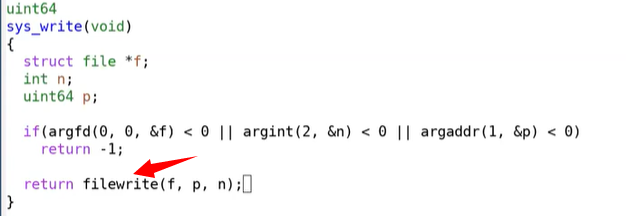

这个函数中首先对参数做了检查，然后又调用了filewrite函数。filewrite函数位于file.c文件中。

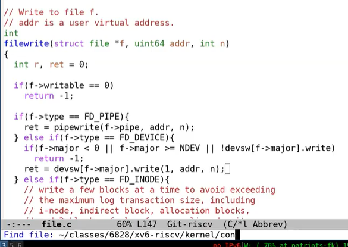

在filewrite函数中首先会判断文件描述符的类型。mknod生成的文件描述符属于设备（FD_DEVICE），而对于设备类型的文件描述符，我们会为这个特定的设备执行设备相应的write函数。因为我们现在的设备是Console，所以我们知道这里会调用console.c中的consolewrite函数。

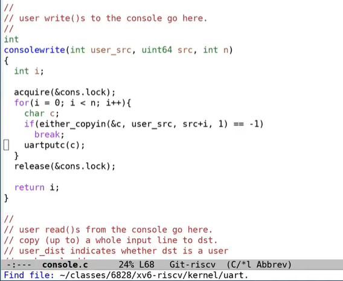

这里先通过either_copyin将字符拷入，之后调用uartputc函数。uartputc函数将字符写入给UART设备， **所以你可以认为consolewrite是一个UART驱动的top部分。** uart.c文件中的uartputc函数会实际的打印字符。

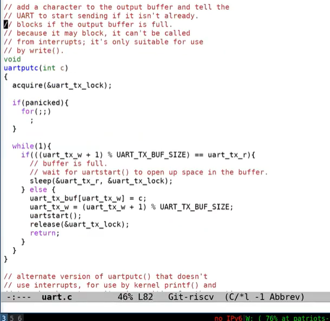

uartputc函数会稍微有趣一些。在UART的内部会有一个buffer用来发送数据，buffer的大小是32个字符。同时还有一个为consumer提供的读指针和为producer提供的写指针，来构建一个环形的buffer（注，或者可以认为是环形队列）。

在我们的例子中，Shell是producer，所以需要调用uartputc函数。在函数中第一件事情是判断环形buffer是否已经满了。如果读写指针相同，那么buffer是空的，如果写指针加1等于读指针，那么buffer满了。当buffer是满的时候，向其写入数据是没有意义的，所以这里会sleep一段时间，将CPU出让给其他进程。当然，对于我们来说，buffer必然不是满的，因为提示符“`$`”是我们送出的第一个字符。所以代码会走到else，字符会被送到buffer中，更新写指针，之后再调用uartstart函数。

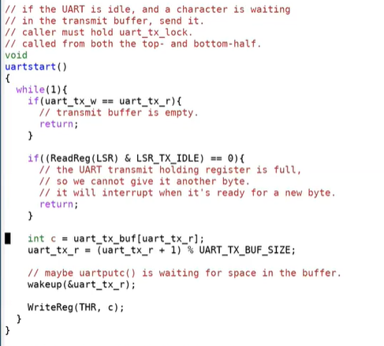

**uartstart就是通知设备执行操作。** 首先是检查当前设备是否空闲，如果空闲的话，我们会从buffer中读出数据，然后将数据写入到THR（Transmission Holding Register）发送寄存器。这里相当于告诉设备，我这里有一个字节需要你来发送。 **一旦数据送到了设备，系统调用会返回，用户应用程序Shell就可以继续执行。** 这里从内核返回到用户空间的机制与之前trap机制是一样的。

### UART驱动的bottom部分

与此同时，UART设备会将数据送出。在某个时间点，我们会收到中断，因为我们之前设置了要处理UART设备中断。接下来我们看一下，当发生中断时，实际会发生什么。

在我们向Console输出字符时，如果发生了中断，RISC-V会做什么操作？我们之前已经在SSTATUS寄存器中打开了中断，所以处理器会被中断。假设键盘生成了一个中断并且发向了PLIC，PLIC会将中断路由给一个特定的CPU核，并且如果这个CPU核设置了SIE寄存器的E bit（注，针对外部中断的bit位），那么会发生以下事情：
- 首先，会清除SIE寄存器相应的bit，这样可以阻止CPU核被其他中断打扰，该CPU核可以专心处理当前中断。处理完成之后，可以再次恢复SIE寄存器相应的bit。
- 之后，会设置SEPC寄存器为当前的程序计数器。我们假设Shell正在用户空间运行，突然来了一个中断，那么当前Shell的程序计数器会被保存。
- 之后，要保存当前的mode。在我们的例子里面，因为当前运行的是Shell程序，所以会记录user mode。
- 再将mode设置为Supervisor mode。
- 最后将程序计数器的值设置成STVEC的值。（注，STVEC用来保存trap处理程序的地址）在XV6中，STVEC保存的要么是uservec或者kernelvec函数的地址，具体取决于发生中断时程序运行是在用户空间还是内核空间。在我们的例子中，Shell运行在用户空间，所以STVEC保存的是uservec函数的地址。而从之前的课程我们可以知道uservec函数会调用usertrap函数。所以最终，我们在usertrap函数中。我们这节课不会介绍trap过程中的拷贝，恢复过程，因为在之前的课程中已经详细的介绍过了。

接下来看一下trap.c文件中的usertrap函数，我们在之前的课中分别在这个函数中处理了系统调用和page fault。今天我们将要看一下如何处理中断。

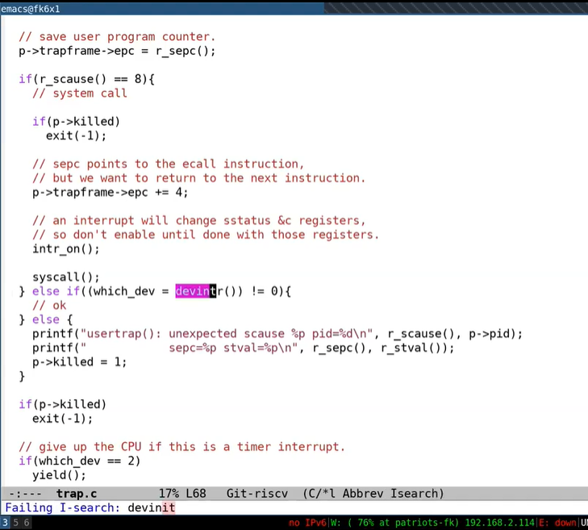

在trap.c的devintr函数中，首先会通过SCAUSE寄存器判断当前中断是否是来自于外设的中断。如果是的话，再调用plic_claim函数来获取中断。

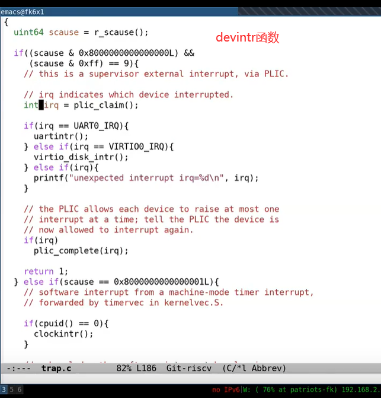

plic_claim函数位于plic.c文件中。在这个函数中，当前CPU核会告知PLIC，自己要处理中断，PLIC_SCLAIM会将中断号返回，对于UART来说，返回的中断号是10。

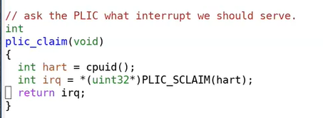

从devintr函数可以看出，如果是UART中断，那么会调用uartintr函数。位于uart.c文件的uartintr函数，会从UART的接受寄存器中读取数据，之后将获取到的数据传递给consoleintr函数。哦，不好意思，我搞错了。我们现在讨论的是向UART发送数据。因为我们现在还没有通过键盘输入任何数据，所以UART的接受寄存器现在为空。

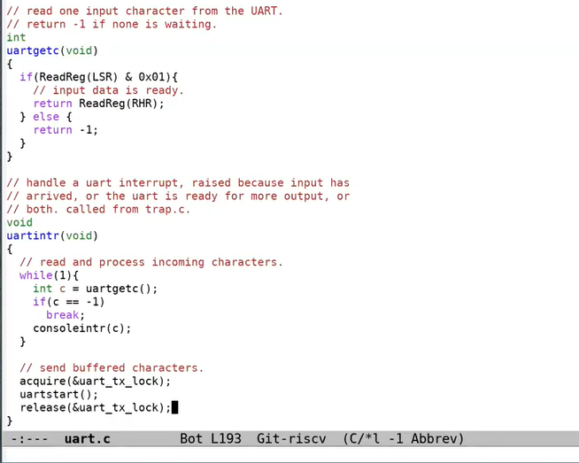

**所以在当前情况下，代码会直接运行到uartstart函数，这个函数会将Shell存储在buffer中的任意字符送出。实际上在提示符“$”之后，Shell还会输出一个空格字符，write系统调用可以在UART发送提示符“$”的同时，并发的将空格字符写入到buffer中。** 所以UART的发送中断触发时，可以发现在buffer中还有一个空格字符，之后会将这个空格字符送出。

这样，驱动的top部分和bottom部分就解耦开了。

学生提问： UART对于键盘来说很重要，来自于键盘的字符通过UART走到CPU再到我们写的代码。但是我不太理解UART对于Shell输出字符究竟有什么作用？因为在这个场景中，并没有键盘的参与。

Frans教授：显示设备与UART也是相连的。所以UART连接了两个设备，一个是键盘，另一个是显示设备，也就是Console。QEMU也是通过模拟的UART与Console进行交互，而Console的作用就是将字符在显示器上画出来。

学生提问：uartinit只被调用了一次，所以才导致了所有的CPU核都共用一个buffer吗？

Frans教授：因为只有一个UART设备，一个buffer只针对一个UART设备，而 **这个buffer会被所有的CPU核共享，这样运行在多个CPU核上的多个程序可以同时向Console打印输出，而驱动中是通过锁来确保多个CPU核上的程序串行的向Console打印输出。**

学生提问：我们之所以需要锁是因为有多个CPU核，但是却只有一个Console，对吧？

Frans教授：是的，如我们之前说的驱动的top和bottom部分可以并行的运行。所以一个CPU核可以执行uartputc函数，而另个一CPU核可以执行uartintr函数，我们需要确保它们是串行执行的，而锁确保了这一点。

学生提问：那是不是意味着，某个时间，其他所有的CPU核都需要等待某一个CPU核的处理？

Frans教授：这里并不是死锁。其他的CPU核还是可以在等待的时候运行别的进程。

## Interrupt相关的并发（对buffer的producer/consumer并发）

接下来我们讨论一下与中断相关的并发，并发加大了中断编程的难度。这里的并发包括以下几个方面：

- 设备与CPU是并行运行的。 **例如当UART向Console发送字符的时候，CPU会返回执行Shell，而Shell可能会再执行一次系统调用，向buffer中写入另一个字符，这些都是在并行的执行。这里的并行称为producer-consumer并行。**
- **中断会停止当前运行的程序。** 例如，Shell正在运行第212个指令，突然来了个中断，Shell的执行会立即停止。对于用户空间代码，这并不是一个大的问题， **因为当我们从中断中返回时，我们会恢复用户空间代码，并继续执行执行停止的指令。** 我们已经在trap和page fault中看过了这部分内容。 **但是当内核被中断打断时，事情就不一样了。所以，代码运行在kernel mode也会被中断，这意味着即使是内核代码，也不是直接串行运行的。** 在两个内核指令之间，取决于中断是否打开，可能会被中断打断执行。 **对于一些代码来说，如果不能在执行期间被中断，这时内核需要临时关闭中断，来确保这段代码的原子性。**
- **驱动的top和bottom部分是并行运行的。** 例如，Shell会在传输完提示符“`$`”之后再调用write系统调用传输空格字符，代码会走到UART驱动的top部分（注，uartputc函数），将空格写入到buffer中。但是同时在另一个CPU核，可能会收到来自于UART的中断，进而执行UART驱动的bottom部分，查看相同的buffer。 **所以一个驱动的top和bottom部分可以并行的在不同的CPU上运行。这里我们通过lock来管理并行。因为这里有共享的数据，我们想要buffer在一个时间只被一个CPU核所操作。**

这里我将会关注在第一点，也就是producer/consumser并发。这是驱动中的非常常见的典型现象。如你们所见的，在驱动中会有一个buffer，在我们之前的例子中，buffer是32字节大小。并且有两个指针，分别是读指针和写指针。

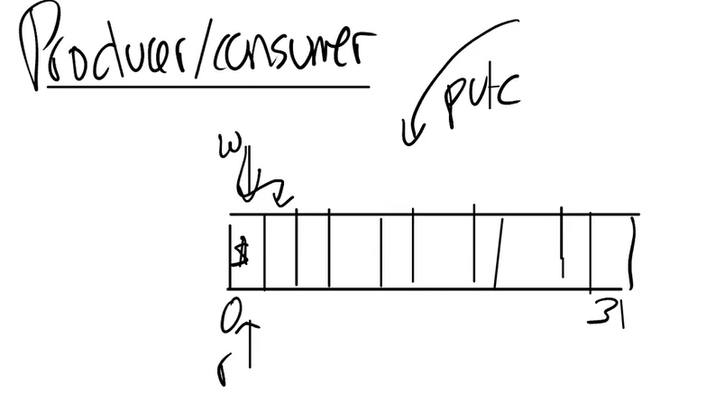

如果两个指针相等，那么buffer是空的。当Shell调用uartputc函数时，会将字符，例如提示符“`$`”，写入到写指针的位置，并将写指针加1。这就是producer对于buffer的操作。

producer可以一直写入数据，直到写指针 + 1等于读指针，因为这时，buffer已经满了。当buffer满了的时候，producer必须停止运行。我们之前在uartputc函数中看过，如果buffer满了，代码会sleep，暂时搁置Shell并运行其他的进程。

Interrupt handler，也就是uartintr函数，在这个场景下是consumer，每当有一个中断，并且读指针落后于写指针，uartintr函数就会从读指针中读取一个字符再通过UART设备发送，并且将读指针加1。当读指针追上写指针，也就是两个指针相等的时候，buffer为空，这时就不用做任何操作。

学生提问：这里的buffer对于所有的CPU核都是共享的吗？

Frans教授：这里的buffer存在于内存中，并且只有一份，所以，所有的CPU核都并行的与这一份数据交互。所以我们才需要lock。

学生提问：对于uartputc中的sleep，它怎么知道应该让Shell去sleep？

Frans教授： sleep会将当前在运行的进程存放于sleep数据中。它传入的参数是需要等待的信号，在这个例子中传入的是uart_tx_r的地址。在uartstart函数中，**一旦buffer中有了空间，会调用与sleep对应的函数wakeup，传入的也是uart_tx_r的地址。任何等待在这个地址的进程都会被唤醒。有时候这种机制被称为conditional synchronization（条件信号）。**

以上就是Shell输出提示符“`$ `”的全部内容。如你们所见，过程还挺复杂的，许多代码一起工作才将这两个字符传输到了Console。

## UART读取键盘输入

在UART的另一侧，会有类似的事情发生，有时Shell会调用read从键盘中读取字符。在read系统调用的底层，会调用fileread函数。在这个函数中，如果读取的文件类型是设备，会调用相应设备的read函数。

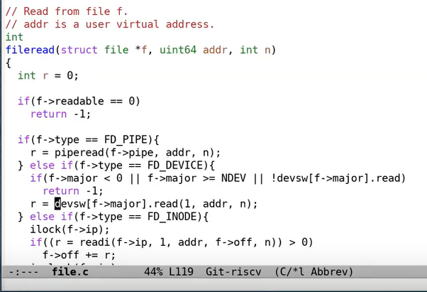

在我们的例子中，read函数就是console.c文件中的consoleread函数。

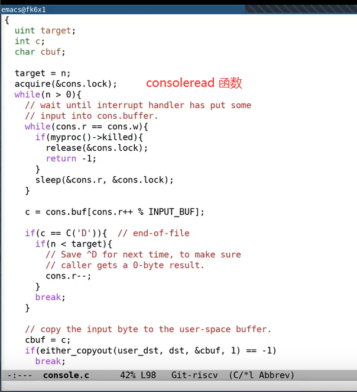

这里与UART类似，也有一个buffer，包含了128个字符。其他的基本一样，也有producer和consumser。但是在这个场景下Shell变成了consumser，因为Shell是从buffer中读取数据。而键盘是producer，它将数据写入到buffer中。

```c
struct {
  struct spinlock lock;
  //input
#define INPUT_BUFFER 128
  char buf[INPUT_BUFFER];
  uint r;  // Read index
  uint w;  // Write index
  uint e;  // Edit index
} cons;
```

从consoleread函数中可以看出，当读指针和写指针一样时，说明buffer为空，进程会sleep。所以Shell在打印完“`$ `”之后，如果键盘没有输入，Shell进程会sleep，直到键盘有一个字符输入。所以在某个时间点，假设用户通过键盘输入了“`l`”，这会导致“`l`”被发送到主板上的UART芯片，产生中断之后再被PLIC路由到某个CPU核，之后会触发devintr函数，devintr可以发现这是一个UART中断，然后通过uartgetc函数获取到相应的字符，之后再将字符传递给consoleintr函数。

默认情况下，字符会通过consputc，输出到console上给用户查看。之后，字符被存放在buffer中。在遇到换行符的时候，唤醒之前sleep的进程，也就是Shell，再从buffer中将数据读出。

所以这里也是通过buffer将consumer和producer之间解耦，这样它们才能按照自己的速度，独立的并行运行。如果某一个运行的过快了，那么buffer要么是满的要么是空的，consumer和producer其中一个会sleep并等待另一个追上来。

## Interrupt的演进（引出polling）

最后我想介绍一下Interrupt在最近几十年的演进。当Unix刚被开发出来的时候，Interrupt处理还是很快的。这使得硬件可以很简单，当外设有数据需要处理时，硬件可以中断CPU的执行，并让CPU处理硬件的数据。

而现在，中断相对处理器来说变慢了。从前面的介绍可以看出来这一点，需要很多步骤才能真正的处理中断数据。如果一个设备在高速的产生中断，处理器将会很难跟上。所以如果查看现在的设备，可以发现，现在的设备相比之前做了更多的工作。所以在产生中断之前，设备上会执行大量的操作，这样可以减轻CPU的处理负担。所以现在硬件变得更加复杂。

如果你有一个高性能的设备，例如你有一个千兆网卡，这个网卡收到了大量的小包，网卡每秒可以生成1.5Mpps，这意味着每一个微秒，CPU都需要处理一个中断，这就超过了CPU的处理能力。那么当网卡收到大量包，并且处理器不能处理这么多中断的时候该怎么办呢？

这里的解决方法就是使用polling。除了依赖Interrupt，CPU可以一直读取外设的控制寄存器，来检查是否有数据。对于UART来说，我们可以一直读取RHR寄存器，来检查是否有数据。现在，CPU不停的在轮询设备，直到设备有了数据。

这种方法浪费了CPU cycles，当我们在使用CPU不停的检查寄存器的内容时，我们并没有用CPU来运行任何程序。在我们之前的例子中，如果没有数据，内核会让Shell进程sleep，这样可以运行另一个进程。

所以，对于一个慢设备，你肯定不想一直轮询它来得到数据。我们想要在没有数据的时候切换出来运行一些其他程序。但是如果是一个快设备，那么Interrupt的overhead也会很高，那么我们在polling设备的时候，是经常能拿到数据的，这样可以节省进出中断的代价。

所以对于一个高性能的网卡，如果有大量的包要传入，那么应该用polling。对于一些精心设计的驱动，它们会在polling和Interrupt之间动态切换（注，也就是网卡的NAPI）。
