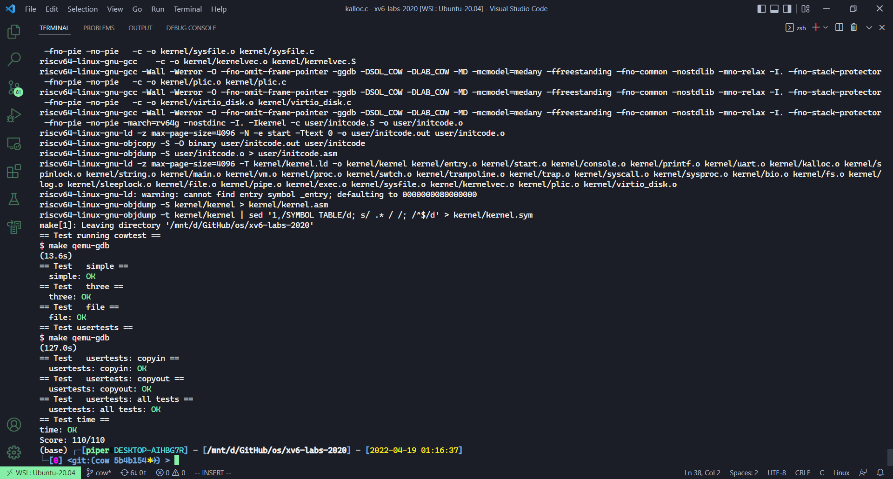

# Lab: Copy-on-Write Fork for xv6

本节作业：
- https://github.com/PiperLiu/xv6-labs-2020/tree/cow-fault
- https://github.com/PiperLiu/xv6-labs-2020/tree/cow

目录：

<!-- @import "[TOC]" {cmd="toc" depthFrom=2 depthTo=2 orderedList=false} -->

<!-- code_chunk_output -->


<!-- /code_chunk_output -->

细分目录：

<!-- @import "[TOC]" {cmd="toc" depthFrom=2 depthTo=6 orderedList=false} -->

<!-- code_chunk_output -->

- [Implement copy-on write](#implement-copy-on-write)

<!-- /code_chunk_output -->

### Implement copy-on write

**The problem**

The fork() system call in xv6 copies all of the parent process's user-space memory into the child. If the parent is large, copying can take a long time. Worse, the work is often largely wasted; for example, a fork() followed by exec() in the child will cause the child to discard the copied memory, probably without ever using most of it. On the other hand, if both parent and child use a page, and one or both writes it, a copy is truly needed.

**The solution**

The goal of copy-on-write (COW) fork() is to defer allocating and copying physical memory pages for the child until the copies are actually needed, if ever.

COW fork() creates just a pagetable for the child, with PTEs for user memory pointing to the parent's physical pages. COW fork() marks all the user PTEs in both parent and child as not writable. When either process tries to write one of these COW pages, the CPU will force a page fault. The kernel page-fault handler detects this case, allocates a page of physical memory for the faulting process, copies the original page into the new page, and modifies the relevant PTE in the faulting process to refer to the new page, this time with the PTE marked writeable. When the page fault handler returns, the user process will be able to write its copy of the page.

COW fork() makes freeing of the physical pages that implement user memory a little trickier. A given physical page may be referred to by multiple processes' page tables, and should be freed only when the last reference disappears.

Your task is to implement copy-on-write fork in the xv6 kernel. You are done if your modified kernel executes both the cowtest and usertests programs successfully.

To help you test your implementation, we've provided an xv6 program called cowtest (source in user/cowtest.c). cowtest runs various tests, but even the first will fail on unmodified xv6. Thus, initially, you will see:

```
$ cowtest
simple: fork() failed
$ 
```

The "simple" test allocates more than half of available physical memory, and then fork()s. The fork fails because there is not enough free physical memory to give the child a complete copy of the parent's memory.

When you are done, your kernel should pass all the tests in both cowtest and usertests. That is:

```
$ cowtest
simple: ok
simple: ok
three: zombie!
ok
three: zombie!
ok
three: zombie!
ok
file: ok
ALL COW TESTS PASSED
$ usertests
...
ALL TESTS PASSED
$
```

Here's a reasonable plan of attack.
- Modify uvmcopy() to map the parent's physical pages into the child, instead of allocating new pages. Clear PTE_W in the PTEs of both child and parent.
- Modify usertrap() to recognize page faults. When a page-fault occurs on a COW page, allocate a new page with kalloc(), copy the old page to the new page, and install the new page in the PTE with PTE_W set.
- Ensure that each physical page is freed when the last PTE reference to it goes away -- but not before. A good way to do this is to keep, for each physical page, a "reference count" of the number of user page tables that refer to that page. Set a page's reference count to one when kalloc() allocates it. Increment a page's reference count when fork causes a child to share the page, and decrement a page's count each time any process drops the page from its page table. kfree() should only place a page back on the free list if its reference count is zero. It's OK to to keep these counts in a fixed-size array of integers. You'll have to work out a scheme for how to index the array and how to choose its size. For example, you could index the array with the page's physical address divided by 4096, and give the array a number of elements equal to highest physical address of any page placed on the free list by kinit() in kalloc.c.
- Modify copyout() to use the same scheme as page faults when it encounters a COW page.

Some hints:
- The lazy page allocation lab has likely made you familiar with much of the xv6 kernel code that's relevant for copy-on-write. However, you should not base this lab on your lazy allocation solution; instead, please start with a fresh copy of xv6 as directed above.
- It may be useful to have a way to record, for each PTE, whether it is a COW mapping. You can use the RSW (reserved for software) bits in the RISC-V PTE for this.
- usertests explores scenarios that cowtest does not test, so don't forget to check that all tests pass for both.
- Some helpful macros and definitions for page table flags are at the end of kernel/riscv.h.
- If a COW page fault occurs and there's no free memory, the process should be killed.

自己做了很久，可惜错了。只要调用 exec 系统调用就会从用户的 main 开始运行。很疑惑。参考了[这篇文章](https://zhuanlan.zhihu.com/p/372428507)，但是觉得这里很多细节不对。我写的错误的代码在：
- https://github.com/PiperLiu/xv6-labs-2020/tree/cow-fault

参考了[这些代码](https://github.com/duguosheng/xv6-labs-2020/commit/c165edb1fa25112fe068b4a80b95ef1c33ea1f1f)。思路如下。

首先， kernel/defs.h 什么的没必要说了。在 kernel/riscv.h 中：

```c
// 用 RSW 中的一位记录是否为 COW 后的页面
#define PTE_COW (1L << 8)
```

然后考虑计数器的加锁等问题，我们在 kernel/kalloc.c 中新增或修改函数如下：

```c

// 引用计数
struct {
  struct spinlock lock;
  int cnt[PHYSTOP / PGSIZE];
} kref;

void
kinit()
{
  initlock(&kmem.lock, "kmem");
  initlock(&kref.lock, "kref");
  freerange(end, (void*)PHYSTOP);
}

void
freerange(void *pa_start, void *pa_end)
{
  char *p;
  p = (char*)PGROUNDUP((uint64)pa_start);
  for(; p + PGSIZE <= (char*)pa_end; p += PGSIZE)
  {
    // 防止 cnt 被减为负数
    kref.cnt[(uint64)p / PGSIZE] = 1;
    kfree(p);
  }
}

// Free the page of physical memory pointed at by v,
// which normally should have been returned by a
// call to kalloc().  (The exception is when
// initializing the allocator; see kinit above.)
void
kfree(void *pa)
{
  struct run *r;

  if(((uint64)pa % PGSIZE) != 0 || (char*)pa < end || (uint64)pa >= PHYSTOP)
    panic("kfree");
  
  // 在 kfree free 空间前 引用计数减一，并增加一个检查
  acquire(&kref.lock);
  -- kref.cnt[(uint64)pa / PGSIZE];
  if (kref.cnt[(uint64)pa / PGSIZE] > 0) {
    release(&kref.lock);
    return ;
  } else if (kref.cnt[(uint64)pa / PGSIZE] < 0) {
    release(&kref.lock);
    panic("kfree(): ref count less than 0");
  }
  release(&kref.lock);

  // Fill with junk to catch dangling refs.
  memset(pa, 1, PGSIZE);

  r = (struct run*)pa;

  acquire(&kmem.lock);
  r->next = kmem.freelist;
  kmem.freelist = r;
  release(&kmem.lock);
}

// Allocate one 4096-byte page of physical memory.
// Returns a pointer that the kernel can use.
// Returns 0 if the memory cannot be allocated.
void *
kalloc(void)
{
  struct run *r;

  acquire(&kmem.lock);
  r = kmem.freelist;
  // 申请一块新空间，引用设为 1
  if(r)
  {
    kmem.freelist = r->next;
    acquire(&kref.lock);
    kref.cnt[(uint64)r / PGSIZE] = 1;
    release(&kref.lock);
  }
  release(&kmem.lock);

  if(r)
    memset((char*)r, 5, PGSIZE); // fill with junk
  return (void*)r;
}

// krefcnt 返回物理地址引用计数
int krefcnt(void* pa)
{
  return kref.cnt[(uint64)pa / PGSIZE];
}

// 增加物理地址引用计数，不成功返回非零值
int inckrefcnt(void* pa)
{
  if (((uint64)pa % PGSIZE) != 0 || (char*)pa < end || (uint64)pa >= PHYSTOP)
    return -1;
  acquire(&kref.lock);
  ++ kref.cnt[(uint64)pa / PGSIZE];
  release(&kref.lock);
  return 0;
}
```

之后还要在 kernel/vm.c 中新增两个工具函数，放在 vm.c 里是因为我觉得他们和虚拟地址相关：

```c
// 判断一个页面是否为 COW
// 是的话返回 0 ， va 无效或不是 COW 页返回 -1
int
cowpage(pagetable_t pagetable, uint64 va)
{
  if (va >= MAXVA)
    return -1;
  pte_t* pte = walk(pagetable, va, 0);
  if (pte == 0)
    return -1;
  if ((*pte & PTE_V) == 0)
    return -1;
  return (*pte & PTE_COW ? 0 : -1);
}

// cow 分配器，给我进程的虚拟地址，根据情况判断是否分配新的 Write 物理页
// 返回 0 则分配失败，否则返回 va 对应的物理地址
void* cowalloc(pagetable_t pagetable, uint64 va)
{
  uint64 pa;
  pte_t* pte;
  char* mem;
  if (va % PGSIZE != 0)
    return 0;
  pa = walkaddr(pagetable, va);
  if (pa == 0)
    return 0;
  pte = walk(pagetable, va, 0);

  // 只有一个引用，则直接修改为 W 即可
  if (krefcnt((char*)pa) == 1) {
    *pte |= PTE_W;
    *pte &= ~PTE_COW;
    return (void*)pa;
  } else {
    // 父进程与子进程同时引用，需要分配新的页面
    mem = kalloc();
    if (mem == 0)
      return 0;
    memmove(mem, (char*)pa, PGSIZE);
    // 将本 pte 标记为不可用，否则会在 mappages 判定为 remap
    *pte &= ~PTE_V;
    if (mappages(pagetable, va, PGSIZE, (uint64)mem, (PTE_FLAGS(*pte) | PTE_W) & ~PTE_COW) != 0) {
      kfree(mem);
      return 0;
    }
    // 尝试释放原来的物理内存
    kfree((char*)PGROUNDDOWN(pa));
    return mem;
  }
}
```

然后就是最核心的逻辑，我们在把父进程的内存复制给子进程时，会调用 uvmcopy 函数，我们修改它：

```c
// Given a parent process's page table, copy
// its memory into a child's page table.
// Copies both the page table and the
// physical memory.
// returns 0 on success, -1 on failure.
// frees any allocated pages on failure.
int
uvmcopy(pagetable_t old, pagetable_t new, uint64 sz)
{
  pte_t *pte;
  uint64 pa, i;
  uint flags;
  // char *mem;

  for(i = 0; i < sz; i += PGSIZE){
    if((pte = walk(old, i, 0)) == 0)
      panic("uvmcopy: pte should exist");
    if((*pte & PTE_V) == 0)
      panic("uvmcopy: page not present");
    pa = PTE2PA(*pte);
    flags = PTE_FLAGS(*pte);
    /** 不需要在创建子进程时分配物理地址了
    if((mem = kalloc()) == 0)
      goto err;
    memmove(mem, (char*)pa, PGSIZE);
    if(mappages(new, i, PGSIZE, (uint64)mem, flags) != 0){
      kfree(mem);
      goto err;
    }
    */
   // 修改标志位、映射到旧的物理页，增加旧物理页计数
    if (flags & PTE_W) {
      flags = (flags | PTE_COW) & ~PTE_W;
      *pte = PA2PTE(pa) | flags;
    }
    if (mappages(new, i, PGSIZE, pa, flags) != 0)
      goto err;
    inckrefcnt((char*)pa);
  }
  return 0;

 err:
  uvmunmap(new, 0, i / PGSIZE, 1);
  return -1;
}
```

最后就是什么时候分配物理内容？调用的时候，只有两种情况，即 usertrap 和 copyout 时。

kernel/trap.c

```c
//
// handle an interrupt, exception, or system call from user space.
// called from trampoline.S
//
void
usertrap(void)
{
  uint64 va;
  int which_dev = 0;

  if((r_sstatus() & SSTATUS_SPP) != 0)
    panic("usertrap: not from user mode");

  // send interrupts and exceptions to kerneltrap(),
  // since we're now in the kernel.
  w_stvec((uint64)kernelvec);

  struct proc *p = myproc();
  
  // save user program counter.
  p->trapframe->epc = r_sepc();
  
  if(r_scause() == 8){
    // system call

    if(p->killed)
      exit(-1);

    // sepc points to the ecall instruction,
    // but we want to return to the next instruction.
    p->trapframe->epc += 4;

    // an interrupt will change sstatus &c registers,
    // so don't enable until done with those registers.
    intr_on();

    syscall();
  } else if((which_dev = devintr()) != 0){
    // ok
  } else if (r_scause() == 13 || r_scause() == 15) {
    va = r_stval();
    // 如果是 COW page 并且的话，则进行 cowalloc
    if (va >= p->sz)
    {
      printf("usertrap(): virtual address too large: %p\n", va);
      p->killed = 1;
    }
    if (cowpage(p->pagetable, va) != 0) {
      printf("usertrap(): page is not for copy-on-write %p\n", va);
      p->killed = 1;
    }
    if (cowalloc(p->pagetable, PGROUNDDOWN(va)) == 0) {
      printf("usertrap(): copy-on-write allocate fault\n");
      p->killed = 1;
    }
  } else {
    printf("usertrap(): unexpected scause %p pid=%d\n", r_scause(), p->pid);
    printf("            sepc=%p stval=%p\n", r_sepc(), r_stval());
    p->killed = 1;
  }

  if(p->killed)
    exit(-1);

  // give up the CPU if this is a timer interrupt.
  if(which_dev == 2)
    yield();

  usertrapret();
}
```

kernel/vm.c

```c
// Copy from kernel to user.
// Copy len bytes from src to virtual address dstva in a given page table.
// Return 0 on success, -1 on error.
int
copyout(pagetable_t pagetable, uint64 dstva, char *src, uint64 len)
{
  uint64 n, va0, pa0;

  while(len > 0){
    va0 = PGROUNDDOWN(dstva);
    pa0 = walkaddr(pagetable, va0);
    // 因为 copyout 负责把内存拿出来写
    // 因此要看看当前物理页能不能写
    if (cowpage(pagetable, va0) == 0)
      pa0 = (uint64) cowalloc(pagetable, va0);
    if(pa0 == 0)
      return -1;
    n = PGSIZE - (dstva - va0);
    if(n > len)
      n = len;
    memmove((void *)(pa0 + (dstva - va0)), src, n);

    len -= n;
    src += n;
    dstva = va0 + PGSIZE;
  }
  return 0;
}
```

唉， `mappages(pagetable, va, PGSIZE, (uint64)mem, (PTE_FLAGS(*pte) | PTE_W) & ~PTE_COW) != 0` 着实让我吃了不少苦头。


