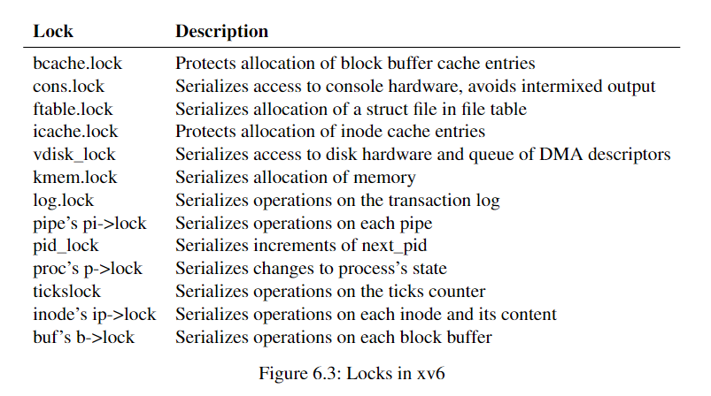

# LEC 10 (fk): Multiprocessors and locking

目录：

<!-- @import "[TOC]" {cmd="toc" depthFrom=2 depthTo=2 orderedList=false} -->

<!-- code_chunk_output -->

- [Chapter 6 Locking](#chapter-6-locking)

<!-- /code_chunk_output -->

细分目录：

<!-- @import "[TOC]" {cmd="toc" depthFrom=2 depthTo=6 orderedList=false} -->

<!-- code_chunk_output -->

- [Chapter 6 Locking](#chapter-6-locking)
  - [6.1 Race conditions 竞态条件](#61-race-conditions-竞态条件)
    - [critical sectio 临界区](#critical-sectio-临界区)
  - [6.2 Code: Locks 这里以自旋锁 spinlock 为例](#62-code-locks-这里以自旋锁-spinlock-为例)
  - [6.3 Code: Using locks](#63-code-using-locks)
  - [6.4 Deadlock and lock ordering](#64-deadlock-and-lock-ordering)
  - [6.5 Locks and interrupt handlers](#65-locks-and-interrupt-handlers)
  - [6.6 Instruction and memory ordering](#66-instruction-and-memory-ordering)
  - [6.7 Sleep locks 引出不用自旋锁 spinlock](#67-sleep-locks-引出不用自旋锁-spinlock)
  - [6.8 Real world](#68-real-world)
  - [6.9 Exercises](#69-exercises)

<!-- /code_chunk_output -->

## Chapter 6 Locking

The word `concurrency` refers to situations in which multiple instruction streams are interleaved, due to multiprocessor parallelism, thread switching, or interrupts.

### 6.1 Race conditions 竞态条件

书上举了内存释放的例子，说白了就是没有原子操作导致某些数据重写了。

A race condition is a situation in which a memory location is accessed concurrently, and at least one access is a write.

####  critical sectio 临界区

```c
acquire(&lisklock);
l->next = list;
list = l;
release(&lisklock);
```

The sequence of instructions between acquire and release is often called a critical section.  The lock is typically said to be protecting list.

You can think of a lock as serializing concurrent critical sections so that they run one at a time, and thus preserve invariants (assuming the critical sections are correct in isolation) 锁把并行临界区内容串行化了。

### 6.2 Code: Locks 这里以自旋锁 spinlock 为例

```c
void
acqure(struct spinlock *lk)  // does not work!
{
    for (;;) {
        if (lk->locked == 0) {
            lk->locked = 1;
            break;
        }
    }
}
```

如上会死锁。我们需要让 `if (lk->locked == 0)` 与 `lk->locked = 1;` 合并为一个原子操作。

这就涉及到原子指令 amoswap 。对于 Xv6 的 acquire ，其使用了轻量的 C library 调用： `__sync_lock_test_and_set` 。

### 6.3 Code: Using locks

A hard part about using locks is deciding how many locks to use and which data and invariants each lock should protect. There are a few basic principles. First, any time a variable can be written by one CPU at the same time that another CPU can read or write it, a lock should be used to keep the two operations from overlapping. Second, remember that locks protect invariants: if an invariant involves multiple memory locations, typically all of them need to be protected by a single lock to ensure the invariant is maintained.

这章主要讨论：锁不能太大，也会牺牲性能（取消并行性）。因此要精确设计。



上图是 xv6 中的锁。

### 6.4 Deadlock and lock ordering

If a code path through the kernel must hold several locks at the same time, it is important that all code paths acquire those locks in the same order. If they don’t, there is a risk of deadlock. 这个在陈硕的 muduo 里也有提到过，加锁可以按照地址大小加。

Xv6 has many lock-order chains of length two involving per-process locks (the lock in each struct proc) due to the way that sleep works (see Chapter 7).

The file-system code contains xv6’s longest lock chains. For example, creating a file requires simultaneously holding a lock on the directory, a lock on the new file’s inode, a lock on a disk block buffer, the disk driver’s `vdisk_lock`, and the calling process’s `p->lock`. To avoid deadlock, file-system code always acquires locks in the order mentioned in the previous sentence.

### 6.5 Locks and interrupt handlers

Some xv6 spinlocks protect data that is used by both threads and interrupt handlers. For example, the clockintr timer interrupt handler might increment ticks (kernel/trap.c:163) at about the same time that a kernel thread reads ticks in sys_sleep (kernel/sysproc.c:64). The lock tickslock serializes the two accesses. 这里提到的是 ticklock 对于 ticks 的保护，涉及到了中断与线程对其调用。

但是这样会有危险： The interaction of spinlocks and interrupts raises a potential danger. Suppose sys_sleep holds tickslock, and its CPU is interrupted by a timer interrupt. clockintr would try to acquire tickslock, see it was held, and wait for it to be released. In this situation, tickslock will never be released: only sys_sleep can release it, but sys_sleep will not continue running until clockintr returns.

所以在 Xv6 中： when a CPU acquires any lock, xv6 always disables interrupts on that CPU. Interrupts may still occur on other CPUs, so an interrupt’s acquire can wait for a thread to release a spinlock; just not on the same CPU.

xv6 re-enables interrupts when a CPU holds no spinlocks; it must do a little book-keeping to cope with nested critical sections. `acquire` calls `push_off` (kernel/spinlock.c:89) and `release` calls `pop_off` (kernel/spinlock.c:100) to track the nesting level of locks on the current CPU. When that count reaches zero, pop_off restores the interrupt enable state that existed at the start of the outermost critical section. The `intr_off` and `intr_on` functions execute RISC-V instructions to disable and enable interrupts, respectively.

It is important that `acquire` call `push_off` strictly before setting `lk->locked` (kernel/spinlock.c:28). If the two were reversed, there would be a brief window when the lock was held with interrupts enabled, and an unfortunately timed interrupt would deadlock the system. Similarly, it is important that `release` call `pop_off` only after releasing the lock (kernel/spinlock.c:66).

### 6.6 Instruction and memory ordering

编译器优化和 CPU 优化也许会改变指令执行顺序。这对并行性有影响。

To tell the hardware and compiler not to perform such re-orderings, xv6 uses `__sync_synchronize()` in both `acquire` (kernel/spinlock.c:22) and `release` (kernel/spinlock.c:47). `__sync_synchronize()` is a memory barrier: it tells the compiler and CPU to not reorder loads or stores across the barrier. The barriers in xv6’s `acquire` and `release` force order in almost all cases where it matters, since xv6 uses locks around accesses to shared data. Chapter 9 discusses a few exceptions.

### 6.7 Sleep locks 引出不用自旋锁 spinlock

**自旋锁 spinlock 会导致其他 acquire 这个锁的进程浪费大量 CPU 计算；此外，自旋锁的进程不可以 yield 。**

We’d like a type of lock that yields the CPU while waiting to acquire, and allows yields (and interrupts) while the lock is held.

Xv6 provides such locks in the form of sleep-locks. `acquiresleep` (kernel/sleeplock.c:22) yields the CPU while waiting, using techniques that will be explained in Chapter 7. At a high level, a sleep-lock has a `locked` field that is protected by a spinlock, and `acquiresleep` ’s call to `sleep` atomically yields the CPU and releases the spinlock. The result is that other threads can execute while `acquiresleep` waits.

Because sleep-locks leave interrupts enabled, they cannot be used in interrupt handlers. Because `acquiresleep` may yield the CPU, sleep-locks cannot be used inside spinlock critical sections (though spinlocks can be used inside sleep-lock critical sections).

**Spin-locks are best suited to short critical sections, since waiting for them wastes CPU time; sleep-locks work well for lengthy operations.**

将在 Chapter 7 讲解 sleep-locks 。

### 6.8 Real world

内容要点有四：
- 把 lock 隐藏起来，比如用同步队列管理更好
- 对于支持 POSIX 线程的操作系统，一个进程可以有多个线程运行在多个 CPU 上，如果进程的内存空间被改变了，那么要注意改边多个 CPU 对应的 hardware page
- 也可以不用原子操作实现锁，但是代价高昂
- 锁是有代价的，许多操作系统选择用 lock-free data structure 和相应算法，但是这样带来的设计复杂性更高

### 6.9 Exercises

原来`注释掉`的英语是“comment out”。
