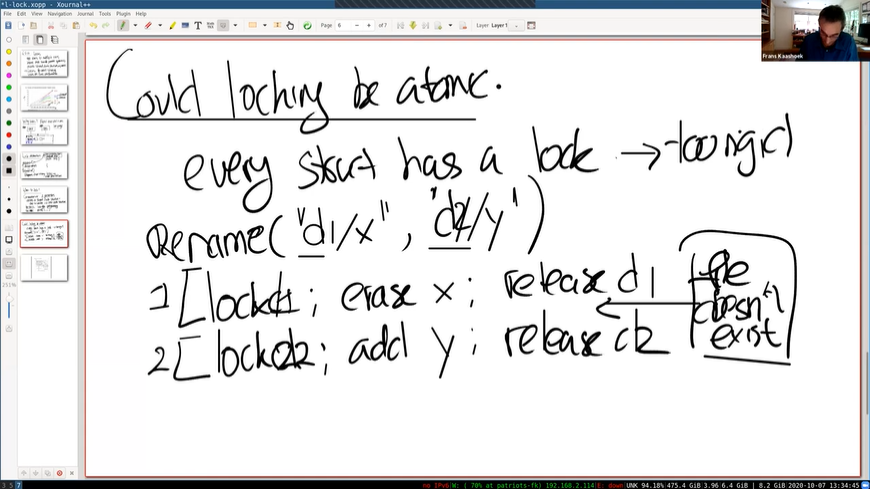
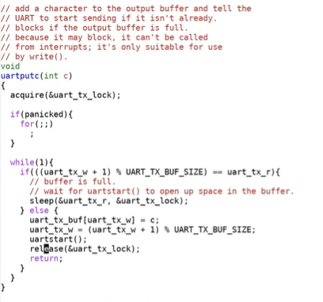

# LEC 10 (fk): Multiprocessors and locking

笔记大量参考了[肖宏辉](https://www.zhihu.com/people/xiao-hong-hui-15)大佬的翻译。

目录：

<!-- @import "[TOC]" {cmd="toc" depthFrom=2 depthTo=2 orderedList=false} -->

<!-- code_chunk_output -->

- [为什么要使用锁？](#为什么要使用锁)
- [什么时候使用锁？](#什么时候使用锁)
- [锁的特性和死锁](#锁的特性和死锁)
- [锁是如何在XV6中工作的（以UART为例）](#锁是如何在xv6中工作的以uart为例)
- [自旋锁 spin lock 的实现](#自旋锁-spin-lock-的实现)

<!-- /code_chunk_output -->

细分目录：

<!-- @import "[TOC]" {cmd="toc" depthFrom=2 depthTo=6 orderedList=false} -->

<!-- code_chunk_output -->

- [为什么要使用锁？](#为什么要使用锁)
  - [为什么要使用多个CPU核](#为什么要使用多个cpu核)
  - [race condition 竞态条件](#race-condition-竞态条件)
  - [critical section 临界区](#critical-section-临界区)
- [什么时候使用锁？](#什么时候使用锁)
  - [能通过自动的创建锁来自动避免race condition吗？（不能）](#能通过自动的创建锁来自动避免race-condition吗不能)
- [锁的特性和死锁](#锁的特性和死锁)
  - [锁缺点：死锁](#锁缺点死锁)
  - [锁缺点：破坏模块化](#锁缺点破坏模块化)
  - [锁缺点：影响性能](#锁缺点影响性能)
- [锁是如何在XV6中工作的（以UART为例）](#锁是如何在xv6中工作的以uart为例)
  - [消费者-生产者模式](#消费者-生产者模式)
  - [uart中的函数](#uart中的函数)
- [自旋锁 spin lock 的实现](#自旋锁-spin-lock-的实现)
  - [test-and-set 操作原子性指令 amoswap](#test-and-set-操作原子性指令-amoswap)
  - [spinlock 具体实现（acquire 和 release）](#spinlock-具体实现acquire-和-release)
  - [为什么在acquire函数的最开始，会先关闭中断？](#为什么在acquire函数的最开始会先关闭中断)
  - [memory ordering 防止指令顺序被优化](#memory-ordering-防止指令顺序被优化)

<!-- /code_chunk_output -->

## 为什么要使用锁？

我们想要通过并行来获得高性能，我们想要并行的在不同的CPU核上执行系统调用，但是如果这些系统调用使用了共享的数据，我们又需要使用锁，而锁又会使得这些系统调用串行执行，所以最后锁反过来又限制了性能。

### 为什么要使用多个CPU核

为什么应用程序一定要使用多个CPU核来提升性能呢？这个实际上与过去几十年技术的发展有关，下面这张非常经典的图可以解释为什么。


这张图有点复杂，X轴是时间，Y轴是单位，Y轴具体意义取决于特定的曲线。这张图中的核心点是，大概从2000年开始：
- CPU的时钟频率就没有再增加过了（绿线）。
- 这样的结果是，CPU的单线程性能达到了一个极限并且也没有再增加过（蓝线）。
- 但是另一方面，CPU中的晶体管数量在持续的增加 （深红色线）。
- 所以现在不能通过使用单核来让代码运行的更快，要想运行的更快，唯一的选择就是使用多个CPU核。所以从2000年开始，处理器上核的数量开始在增加（黑线）。


所以现在如果一个应用程序想要提升性能，它不能只依赖单核，必须要依赖于多核。这也意味着，如果应用程序与内核交互的较为紧密，那么操作系统也需要高效的在多个CPU核上运行。这就是我们对内核并行的运行在多个CPU核上感兴趣的直接原因。

### race condition 竞态条件

这里用 kalloc 的 freelist 举例子，用去掉了 acquire 和 release 来演示。

不详细记录了。

这里有几点很重要，首先，并没有强制说一定要使用锁，锁的使用完全是由程序员决定的。如果你想要一段代码具备原子性，那么其实是由程序员决定是否增加锁的acquire和release。其次，代码不会自动加锁，程序员自己要确定好是否将锁与数据结构关联，并在适当的位置增加锁的acquire和release。

### critical section 临界区

锁的acquire和release之间的代码，通常被称为`critical section`。

## 什么时候使用锁？

什么时候才必须要加锁呢？我这里会给你们一个非常保守同时也是非常简单的规则： **如果两个进程访问了一个共享的数据结构，并且其中一个进程会更新共享的数据结构，那么就需要对于这个共享的数据结构加锁。**

这条规则某种程度上来说又太过严格了。如果有两个进程共享一个数据结构，并且其中一个进程会更新这个数据结构，在某些场合不加锁也可以正常工作。不加锁的程序通常称为lock-free program，不加锁的目的是为了获得更好的性能和并发度，不过lock-free program比带锁的程序更加复杂一些。这节课的大部分时间我们还是会考虑如何使用锁来控制共享的数据，因为这已经足够复杂了，很多时候就算直接使用锁也不是那么的直观。

矛盾的是，有时候这个规则太过严格，而有时候这个规则又太过宽松了。除了共享的数据，在一些其他场合也需要锁，例如对于printf，如果我们将一个字符串传递给它，XV6会尝试原子性的将整个字符串输出，而不是与其他进程的printf交织输出。尽管这里没有共享的数据结构，但在这里锁仍然很有用处，因为我们想要printf的输出也是序列化的。

### 能通过自动的创建锁来自动避免race condition吗？（不能）

那么我们能通过自动的创建锁来自动避免race condition吗？如果按照刚刚的简单规则，一旦我们有了一个共享的数据结构，任何操作这个共享数据结构都需要获取锁，那么对于XV6来说，每个结构体都需要自带一个锁，当我们对于结构体做任何操作的时候，会自动获取锁。

可是如果我们这样做的话，结果就太过严格了，所以不能自动加锁。接下来看一个具体的例子。

假设我们有一个对于`rename`的调用，这个调用会将文件从一个目录移到另一个目录，我们现在将文件`d1/x`移到文件`d2/y`。

如果我们按照前面说的，对数据结构自动加锁。现在我们有两个目录对象，一个是`d1`，另一个是`d2`，那么我们会先对`d1`加锁，删除`x`，之后再释放对于`d1的`锁；之后我们会对`d2`加锁，增加`y`，之后再释放`d2`的锁。这是我们在使用自动加锁之后的一个假设的场景。



在这个例子中，我们会有错误的结果，那么为什么这是一个有问题的场景呢？为什么这个场景不能正常工作？

在我们完成了第一步，也就是删除了`d1`下的`x`文件，但是还没有执行第二步，也就是创建`d2`下的`y`文件时。其他的进程会看到什么样的结果？是的，其他的进程会看到文件完全不存在。这明显是个错误的结果，因为文件还存在只是被重命名了，文件在任何一个时间点都是应该存在的。但是如果我们按照上面的方式实现锁的话，那么在某个时间点，文件看起来就是不存在的。

**所以这里正确的解决方法是，我们在重命名的一开始就对`d1`和`d2`加锁，之后删除`x`再添加`y`，最后再释放对于`d1`和`d2`的锁。**

在这个例子中，我们的操作需要涉及到多个锁，但是直接为每个对象自动分配一个锁会带来错误的结果。在这个例子中，锁应该与操作而不是数据关联，所以自动加锁在某些场景下会出问题。

- 学生提问：可不可以在访问某个数据结构的时候，就获取所有相关联的数据结构的锁？
- Frans教授：这是一种实现方式。但是这种方式最后会很快演进成`big kernel lock`，这样你就失去了并发执行的能力，但是你肯定想做得更好。这里就是使用锁的矛盾点了，如果你想要程序简单点，可以通过`coarse-grain locking（注，也就是大锁）`，但是这时你就失去了性能。

## 锁的特性和死锁

通常锁有三种作用，理解它们可以帮助你更好的理解锁。
- 锁可以避免丢失更新。如果你回想我们之前在kalloc.c中的例子，丢失更新是指我们丢失了对于某个内存page在kfree函数中的更新。如果没有锁，在出现race condition的时候，内存page不会被加到freelist中。但是加上锁之后，我们就不会丢失这里的更新。
- 锁可以打包多个操作，使它们具有原子性。我们之前介绍了加锁解锁之间的区域是critical section，在critical section的所有操作会都会作为一个原子操作执行。
- 锁可以维护共享数据结构的不变性。共享数据结构如果不被任何进程修改的话是会保持不变的。如果某个进程acquire了锁并且做了一些更新操作，共享数据的不变性暂时会被破坏，但是在release锁之后，数据的不变性又恢复了。你们可以回想一下之前在kfree函数中的freelist数据，所有的free page都在一个单链表上。但是在kfree函数中，这个单链表的head节点会更新。freelist并不太复杂，对于一些更复杂的数据结构可能会更好的帮助你理解锁的作用。

### 锁缺点：死锁

最明显的一个例子就是死锁（Deadlock）。

一个死锁的最简单的场景就是：首先acquire一个锁，然后进入到critical section；在critical section中，再acquire同一个锁；第二个acquire必须要等到第一个acquire状态被release了才能继续执行，但是不继续执行的话又走不到第一个release，所以程序就一直卡在这了。这就是一个死锁。

这里就不记录死锁例子了。

### 锁缺点：破坏模块化

所以对于一个系统设计者，你需要确定对于所有的锁对象的全局的顺序。例如在这里的例子中我们让d1一直在d2之前，这样我们在rename的时候，总是先获取排序靠前的目录的锁，再获取排序靠后的目录的锁。如果对于所有的锁有了一个全局的排序，这里的死锁就不会出现了。

不过在设计一个操作系统的时候，定义一个全局的锁的顺序会有些问题。如果一个模块m1中方法g调用了另一个模块m2中的方法f，那么m1中的方法g需要知道m2的方法f使用了哪些锁。因为如果m2使用了一些锁，那么m1的方法g必须集合f和g中的锁，并形成一个全局的锁的排序。这意味着在m2中的锁必须对m1可见，这样m1才能以恰当的方法调用m2。

但是这样又违背了代码抽象的原则。在完美的情况下，代码抽象要求m1完全不知道m2是如何实现的。但是不幸的是，具体实现中，m2内部的锁需要泄露给m1，这样m1才能完成全局锁排序。所以当你设计一些更大的系统时，锁使得代码的模块化更加的复杂了。

- 学生提问：有必要对所有的锁进行排序吗？
- Frans教授：在上面的例子中，这取决于f和g是否共用了一些锁。如果你看XV6的代码，你可以看到会有多种锁的排序，因为一些锁与其他的锁没有任何关系，它们永远也不会在同一个操作中被acquire。如果两组锁不可能在同一个操作中被acquire，那么这两组锁的排序是完全独立的。所以没有必要对所有的锁进行一个全局的排序，但是所有的函数需要对共同使用的一些锁进行一个排序。

### 锁缺点：影响性能

我们想要获得更好的性能，那么我们需要有更多的锁，但是这又引入了大量的工作。

通常来说，开发的流程是：
- 先以coarse-grained lock（注，也就是大锁）开始。
- 再对程序进行测试，来看一下程序是否能使用多核。
- 如果可以的话，那么工作就结束了，你对于锁的设计足够好了；如果不可以的话，那意味着锁存在竞争，多个进程会尝试获取同一个锁，因此它们将会序列化的执行，性能也上不去，之后你就需要重构程序。

## 锁是如何在XV6中工作的（以UART为例）

从代码上看UART只有一个锁。

```c
struct spinlock uart_tx_lock;
```

### 消费者-生产者模式

你可以认为对于UART模块来说，现在是一个coarse-grained lock的设计。这个锁保护了UART的的传输缓存；写指针；读指针。当我们传输数据时，写指针会指向传输缓存的下一个空闲槽位，而读指针指向的是下一个需要被传输的槽位。这是我们对于并行运算的一个标准设计，它叫做消费者-生产者模式。

### uart中的函数

所以现在有了一个缓存，一个写指针和一个读指针。读指针的内容需要被显示，写指针接收来自例如printf的数据。我们前面已经了解到了锁有多个角色。第一个是保护数据结构的特性不变，数据结构有一些不变的特性，例如读指针需要追赶写指针；从读指针到写指针之间的数据是需要被发送到显示端；从写指针到读指针之间的是空闲槽位，锁帮助我们维护了这些特性不变。



函数首先获得了锁，然后查看当前缓存是否还有空槽位，如果有的话将数据放置于空槽位中；写指针加1；调用uartstart；最后释放锁。

如果两个进程在同一个时间调用uartputc，那么这里的锁会确保来自于第一个进程的一个字符进入到缓存的第一个槽位，接下来第二个进程的一个字符进入到缓存的第二个槽位。这就是锁帮助我们避免race condition的一个简单例子。如果没有锁的话，第二个进程可能会覆盖第一个进程的字符。

接下来我们看一下uartstart函数。


如果uart_tx_w不等于uart_tx_r，那么缓存不为空，说明需要处理缓存中的一些字符。锁确保了我们可以在下一个字符写入到缓存之前，处理完缓存中的字符，这样缓存中的数据就不会被覆盖。

最后，锁确保了一个时间只有一个CPU上的进程可以写入UART的寄存器，THR。所以这里锁确保了硬件寄存器只有一个写入者。

当UART硬件完成传输，会产生一个中断。在前面的代码中我们知道了uartstart的调用者会获得锁以确保不会有多个进程同时向THR寄存器写数据。但是UART中断本身也可能与调用printf的进程并行执行。如果一个进程调用了printf，它运行在CPU0上；CPU1处理了UART中断，那么CPU1也会调用uartstart。因为我们想要确保对于THR寄存器只有一个写入者，同时也确保传输缓存的特性不变（注，这里指的是在uartstart中对于uart_tx_r指针的更新）， **我们需要在中断处理函数中也获取锁。**


所以，在XV6中，驱动的bottom部分（注，也就是中断处理程序）和驱动的up部分（注，uartputc函数）可以完全的并行运行，所以中断处理程序也需要获取锁。我们接下来会介绍，在实现锁的时候，为了确保这里能正常工作还是有点复杂的。

## 自旋锁 spin lock 的实现

接下来我们看一下如何实现自旋锁。锁的特性就是只有一个进程可以获取锁，在任何时间点都不能有超过一个锁的持有者。我们接下来看一下锁是如何确保这里的特性。

### test-and-set 操作原子性指令 amoswap

我们先来看一个有问题的锁的实现，这样我们才能更好的理解这里的挑战是什么。实现锁的主要难点在于锁的acquire接口，在acquire里面有一个死循环，循环中判断锁对象的locked字段是否为0，如果为0那表明当前锁没有持有者，当前对于acquire的调用可以获取锁。之后我们通过设置锁对象的locked字段为1来获取锁。最后返回。

如果锁的locked字段不为0，那么当前对于acquire的调用就不能获取锁，程序会一直spin。也就是说，程序在循环中不停的重复执行，直到锁的持有者调用了release并将锁对象的locked设置为0。

- **在这个实现里面会有什么样的问题？**
- **学生回答：两个进程可能同时读到锁的locked字段为0。**

是的，所以这里会有race condition，在下面的位置会有race。


如果CPU0和CPU1同时到达A语句，它们会同时看到锁的locked字段为0，之后它们会同时走到B语句，这样它们都acquire了锁。这样我们就违背了锁的特性。

**为了解决这里的问题并得到一个正确的锁的实现方式，其实有多种方法，但是最常见的方法是依赖于一个特殊的硬件指令。** 这个特殊的硬件指令会保证一次`test-and-set`操作的原子性。在RISC-V上，这个特殊的指令就是`amoswap`（`atomic memory swap`）。这个指令接收3个参数，分别是address，寄存器r1，寄存器r2。这条指令会先锁定住address，将address中的数据保存在一个临时变量中（tmp），之后将r1中的数据写入到地址中，之后再将保存在临时变量中的数据写入到r2中，最后再对于地址解锁。

通过这里的加锁，可以确保address中的数据存放于r2，而r1中的数据存放于address中，并且这一系列的指令打包具备原子性。大多数的处理器都有这样的硬件指令，因为这是一个实现锁的方便的方式。这里我们通过将一个软件锁转变为硬件锁最终实现了原子性。不同处理器的具体实现可能会非常不一样，处理器的指令集通常像是一个说明文档，它不会有具体实现的细节，具体的实现依赖于内存系统是如何工作的，比如说：
- 多个处理器共用一个内存控制器，内存控制器可以支持这里的操作，比如给一个特定的地址加锁，然后让一个处理器执行2-3个指令，然后再解锁。因为所有的处理器都需要通过这里的内存控制器完成读写，所以内存控制器可以对操作进行排序和加锁。
- 如果内存位于一个共享的总线上，那么需要总线控制器（bus arbiter）来支持。总线控制器需要以原子的方式执行多个内存操作。
- 如果处理器有缓存，那么缓存一致性协议会确保对于持有了我们想要更新的数据的cache line只有一个写入者，相应的处理器会对cache line加锁，完成两个操作。

硬件原子操作的实现可以有很多种方法。但是基本上都是对于地址加锁，读出数据，写入新数据，然后再返回旧数据（注，也就是实现了atomic swap）。

### spinlock 具体实现（acquire 和 release）

接下来我们看一下如何使用这条指令来实现自旋锁。让我们来看一下XV6中的acquire和release的实现。首先我们看一下spinlock.h。

```c
struct spinlock {
    uint locked;  // Is the lock held?

    // For debugging:
    char *name;
    struct cpu *cpu;
}
```

acquire 函数如下。


在函数中有一个`while`循环，这就是我刚刚提到的`test-and-set`循环。实际上C的标准库已经定义了这些原子操作，所以C标准库中已经有一个函数`__sync_lock_test_and_set`，它里面的具体行为与我刚刚描述的是一样的。因为大部分处理器都有的`test-and-set`硬件指令，所以这个函数的实现比较直观。我们可以通过查看kernel.asm来了解RISC-V具体是如何实现的。下图就是`atomic swap`操作。


这里比较复杂，总的来说，一种情况下我们跳出循环，另一种情况我们继续执行循环。C代码就要简单的多。如果锁没有被持有，那么锁对象的locked字段会是0，如果locked字段等于0，我们调用`test-and-set`将1写入locked字段，并且返回locked字段之前的数值0。如果返回0，那么意味着没有人持有锁，循环结束。如果locked字段之前是1，那么这里的流程是，先将之前的1读出，然后写入一个新的1，但是这不会改变任何数据，因为locked之前已经是1了。之后`__sync_lock_test_and_set`会返回1，表明锁之前已经被人持有了，这样的话，判断语句不成立，程序会持续循环（spin），直到锁的locked字段被设置回0。

接下来我们看一下release的实现，首先看一下kernel.asm中的指令。


可以看出release也使用了`atomic swap`操作，将0写入到了s1。下面是对应的C代码，它基本确保了将`lk->locked`中写入0是一个原子操作。


- 有很多同学提问说为什么release函数中不直接使用一个store指令将锁的locked字段写为0？有人想回答一下为什么吗？
- 学生回答：因为其他的处理器可能会向locked字段写入1，或者写入0。

是的，可能有两个处理器或者两个CPU同时在向locked字段写入数据。这里的问题是，对于很多人包括我自己来说，经常会认为一个store指令是一个原子操作，但实际并不总是这样，这取决于具体的实现。例如，对于CPU内的缓存，每一个cache line的大小可能大于一个整数，那么store指令实际的过程将会是：首先会加载cache line，之后再更新cache line。所以对于store指令来说，里面包含了两个微指令。这样的话就有可能得到错误的结果。所以为了避免理解硬件实现的所有细节， **例如整数操作不是原子的，或者向一个64bit的内存值写数据是不是原子的，我们直接使用一个RISC-V提供的确保原子性的指令来将locked字段写为0。**

amoswap并不是唯一的原子指令，RISC-V的手册列出了所有的原子指令。

### 为什么在acquire函数的最开始，会先关闭中断？

让我们回到uart.c中。我们先来假设acquire在一开始并没有关闭中断。在uartputc函数中，首先会acquire锁，如果不关闭中断会发生什么呢？

uartputc函数会acquire锁，UART本质上就是传输字符，当UART完成了字符传输它会做什么？是的，它会产生一个中断之后会运行uartintr函数，在uartintr函数中，会获取同一把锁，但是这把锁正在被uartputc持有。如果这里只有一个CPU的话，那这里就是死锁。中断处理程序uartintr函数会一直等待锁释放，但是CPU不出让给uartputc执行的话锁又不会释放。 **在XV6中，这样的场景会触发panic，因为同一个CPU会再次尝试acquire同一个锁。**

所以spinlock需要处理两类并发，一类是不同CPU之间的并发，一类是相同CPU上中断和普通程序之间的并发。 **针对后一种情况，我们需要在acquire中关闭中断。中断会在release的结束位置再次打开，因为在这个位置才能再次安全的接收中断。**

### memory ordering 防止指令顺序被优化

假设我们先通过将locked字段设置为1来获取锁，之后对x加1，最后再将locked字段设置0来释放锁。下面将会是在CPU上执行的指令流。


但是编译器或者处理器可能会重排指令以获得更好的性能。对于上面的串行指令流，如果将`x<-x+1`移到`locked<-0`之后可以吗？这会改变指令流的正确性吗？

并不会，因为x和锁完全相互独立，它们之间没有任何关联。如果他们还是按照串行的方式执行，`x<-x+1`移到锁之外也没有问题。所以在一个串行执行的场景下是没有问题的。实际中，处理器在执行指令时，实际指令的执行顺序可能会改变。编译器也会做类似的事情，编译器可能会在不改变执行结果的前提下，优化掉一些代码路径并进而改变指令的顺序。

但是对于并发执行，很明显这将会是一个灾难。如果我们将critical section与加锁解锁放在不同的CPU执行，将会得到完全错误的结果。所以指令重新排序在并发场景是错误的。 **为了禁止，或者说为了告诉编译器和硬件不要这样做，我们需要使用memory fence或者叫做synchronize指令，来确定指令的移动范围。对于synchronize指令，任何在它之前的load/store指令，都不能移动到它之后。锁的acquire和release函数都包含了synchronize指令。**

这样前面的例子中，`x<-x+1`就不会被移到特定的memory synchronization点之外。我们也就不会有memory ordering带来的问题。这就是为什么在acquire和release中都有`__sync_synchronize`函数的调用。

- 学生提问：有没有可能在锁acquire之前的一条指令被移到锁release之后？或者说这里会有一个界限不允许这么做？
- Frans教授：在这里的例子中，acquire和release都有自己的界限（注，也就是`__sync_synchronize`函数的调用点）。所以发生在锁acquire之前的指令不会被移到acquire的`__sync_synchronize`函数调用之后，这是一个界限。在锁的release函数中有另一个界限。所以在第一个界限之前的指令会一直在这个界限之前，在两个界限之间的指令会保持在两个界限之间，在第二个界限之后的指令会保持在第二个界限之后。
