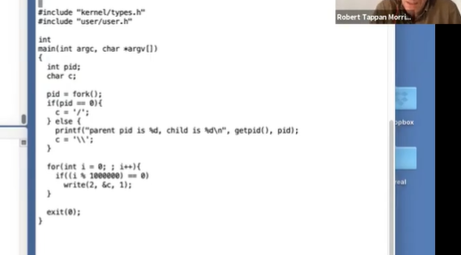

# LEC 11 (rtm): Thread switching

笔记大量参考了[肖宏辉](https://www.zhihu.com/people/xiao-hong-hui-15)大佬的翻译。

目录：

<!-- @import "[TOC]" {cmd="toc" depthFrom=2 depthTo=2 orderedList=false} -->

<!-- code_chunk_output -->

- [线程（Thread）概述](#线程thread概述)
- [Xv6 线程调度](#xv6-线程调度)
- [从代码看进程调度](#从代码看进程调度)

<!-- /code_chunk_output -->

细分目录：

<!-- @import "[TOC]" {cmd="toc" depthFrom=2 depthTo=6 orderedList=false} -->

<!-- code_chunk_output -->

- [线程（Thread）概述](#线程thread概述)
  - [线程的状态（PC、寄存器、Stack）](#线程的状态pc-寄存器-stack)
  - [Xv6 线程机制与 Linux 是不同的](#xv6-线程机制与-linux-是不同的)
  - [实现内核中的线程系统存在以下挑战](#实现内核中的线程系统存在以下挑战)
- [Xv6 线程调度](#xv6-线程调度)
  - [处理运算密集型线程的策略（利用定时器中断， pre-emptive scheduling 与 voluntary scheduling ）](#处理运算密集型线程的策略利用定时器中断-pre-emptive-scheduling-与-voluntary-scheduling)
  - [Xv6 线程切换描述](#xv6-线程切换描述)
  - [更详细的线程调用描述](#更详细的线程调用描述)
  - [Xv6很简单，不区分线程进程概念（与 Xv6 对比）](#xv6很简单不区分线程进程概念与-xv6-对比)
- [从代码看进程调度](#从代码看进程调度)
  - [简单的用户进程演示](#简单的用户进程演示)
  - [yield 与 sched 函数](#yield-与-sched-函数)
  - [swtch函数（把 callee 寄存器保存）](#swtch函数把-callee-寄存器保存)
  - [scheduler函数以及锁完成的事情](#scheduler函数以及锁完成的事情)

<!-- /code_chunk_output -->

## 线程（Thread）概述

为什么计算机需要运行多线程？可以归结为以下原因：
- 首先，人们希望他们的计算机在同一时间不是只执行一个任务。有可能计算机需要执行分时复用的任务，例如MIT的公共计算机系统Athena允许多个用户同时登陆一台计算机，并运行各自的进程。甚至在一个单用户的计算机或者在你的iphone上，你会运行多个进程，并期望计算机完成所有的任务而不仅仅只是一个任务。
- 其次，多线程可以让程序的结构变得简单。线程在有些场合可以帮助程序员将代码以简单优雅的方式进行组织，并减少复杂度。实际上在第一个lab中prime number部分，通过多个进程可以更简单，方便，优雅的组织代码。
- 最后，使用多线程可以通过并行运算，在拥有多核CPU的计算机上获得更快的处理速度。常见的方式是将程序进行拆分，并通过线程在不同的CPU核上运行程序的不同部分。如果你足够幸运的话，你可以将你的程序拆分并在4个CPU核上通过4个线程运行你的程序，同时你也可以获取4倍的程序运行速度。你可以认为XV6就是一个多CPU并行运算的程序。

所以，线程可以认为是一种在有多个任务时简化编程的抽象。一个线程可以认为是串行执行代码的单元。如果你写了一个程序只是按顺序执行代码，那么你可以认为这个程序就是个单线程程序，这是对于线程的一种宽松的定义。虽然人们对于线程有很多不同的定义， **在这里，我们认为线程就是单个串行执行代码的单元，它只占用一个CPU并且以普通的方式一个接一个的执行指令。**

### 线程的状态（PC、寄存器、Stack）

除此之外，线程还具有状态，我们可以随时保存线程的状态并暂停线程的运行，并在之后通过恢复状态来恢复线程的运行。线程的状态包含了三个部分：
- 程序计数器（Program Counter），它表示当前线程执行指令的位置。
- 保存变量的寄存器。
- 程序的Stack。通常来说每个线程都有属于自己的Stack，Stack记录了函数调用的记录，并反映了当前线程的执行点。

操作系统中线程系统的工作就是管理多个线程的运行。我们可能会启动成百上千个线程，而线程系统的工作就是弄清楚如何管理这些线程并让它们都能运行。

### Xv6 线程机制与 Linux 是不同的

多线程的并行运行主要有两个策略：
- 第一个策略是在多核处理器上使用多个CPU，每个CPU都可以运行一个线程，如果你有4个CPU，那么每个CPU可以运行一个线程。每个线程自动的根据所在CPU就有了程序计数器和寄存器。但是如果你只有4个CPU，却有上千个线程，每个CPU只运行一个线程就不能解决这里的问题了。
- 所以这节课大部分时间我们都会关注第二个策略，也就是一个CPU在多个线程之间来回切换。假设我只有一个CPU，但是有1000个线程，我们接下来将会看到XV6是如何实现线程切换使得XV6能够先运行一个线程，之后将线程的状态保存，再切换至运行第二个线程，然后再是第三个线程，依次类推直到每个线程都运行了一会，再回来重新执行第一个线程。

实际上，与大多数其他操作系统一样，XV6结合了这两种策略，首先线程会运行在所有可用的CPU核上，其次每个CPU核会在多个线程之间切换，因为通常来说，线程数会远远多于CPU的核数。

不同线程系统之间的一个主要的区别就是，线程之间是否会共享内存。一种可能是你有一个地址空间，多个线程都在这一个地址空间内运行，并且它们可以看到彼此的更新。比如说共享一个地址空间的线程修改了一个变量，共享地址空间的另一个线程可以看到变量的修改。所以当多个线程运行在一个共享地址空间时，我们需要用到上节课讲到的锁。

XV6内核共享了内存，并且XV6支持内核线程的概念，对于每个用户进程都有一个内核线程来执行来自用户进程的系统调用。所有的内核线程都共享了内核内存，所以XV6的内核线程的确会共享内存。

另一方面，XV6还有另外一种线程。**每一个用户进程都有独立的内存地址空间，并且包含了一个线程，这个线程控制了用户进程代码指令的执行。所以XV6中的用户线程之间没有共享内存，你可以有多个用户进程，但是每个用户进程都是拥有一个线程的独立地址空间。XV6中的进程不会共享内存。**

在一些其他更加复杂的系统中， **例如Linux，允许在一个用户进程中包含多个线程，进程中的多个线程共享进程的地址空间。** 当你想要实现一个运行在多个CPU核上的用户进程时，你就可以在用户进程中创建多个线程。Linux中也用到了很多我们今天会介绍的技术，但是在Linux中跟踪每个进程的多个线程比XV6中每个进程只有一个线程要复杂的多。

还有一些其他的方式可以支持在一台计算机上交织的运行多个任务，我们不会讨论它们，但是如果你感兴趣的话，你可以去搜索`event-driven programming`或者`state machine`，这些是在一台计算机上不使用线程但又能运行多个任务的技术。在所有的支持多任务的方法中，线程技术并不是非常有效的方法，但是线程通常是最方便，对程序员最友好的，并且可以用来支持大量不同任务的方法。

### 实现内核中的线程系统存在以下挑战

- 第一个是如何实现线程间的切换。这里停止一个线程的运行并启动另一个线程的过程通常被称为线程调度（Scheduling）。我们将会看到XV6为每个CPU核都创建了一个线程调度器（Scheduler）。
- 第二个挑战是，当你想要实际实现从一个线程切换到另一个线程时，你需要保存并恢复线程的状态，所以需要决定线程的哪些信息是必须保存的，并且在哪保存它们。
- 最后一个挑战是如何处理运算密集型线程（compute bound thread）。对于线程切换，很多直观的实现是由线程自己自愿的保存自己的状态，再让其他的线程运行。但是如果我们有一些程序正在执行一些可能要花费数小时的长时间计算任务，这样的线程并不能自愿的出让CPU给其他的线程运行。所以这里需要能从长时间运行的运算密集型线程撤回对于CPU的控制，将其放置于一边，稍后再运行它。

## Xv6 线程调度

### 处理运算密集型线程的策略（利用定时器中断， pre-emptive scheduling 与 voluntary scheduling ）

我将首先介绍如何处理运算密集型线程。这里的具体实现你们之前或许已经知道了，就是利用定时器中断。在每个CPU核上，都存在一个硬件设备，它会定时产生中断。XV6与其他所有的操作系统一样，将这个中断传输到了内核中。所以即使我们正在用户空间计算π的前100万位，定时器中断仍然能在例如每隔10ms的某个时间触发，并将程序运行的控制权从用户空间代码切换到内核中的中断处理程序（注，因为中断处理程序优先级更高）。哪怕这些用户空间进程并不配合工作（注，也就是用户空间进程一直占用CPU），内核也可以从用户空间进程获取CPU控制权。

**位于内核的定时器中断处理程序，会自愿的将CPU出让（yield）给线程调度器，并告诉线程调度器说，你可以让一些其他的线程运行了。** 这里的出让其实也是一种线程切换，它会保存当前线程的状态，并在稍后恢复。

在之前的课程中，你们已经了解过了中断处理的流程。这里的基本流程是，定时器中断将CPU控制权给到内核，内核再自愿的出让CPU。

这样的处理流程被称为pre-emptive scheduling。pre-emptive的意思是，即使用户代码本身没有出让CPU，定时器中断仍然会将CPU的控制权拿走，并出让给线程调度器。与之相反的是voluntary scheduling。

有趣的是，在XV6和其他的操作系统中，线程调度是这么实现的： **定时器中断会强制的将CPU控制权从用户进程给到内核，这里是pre-emptive scheduling，之后内核会代表用户进程（注，实际是内核中用户进程对应的内核线程会代表用户进程出让CPU），使用voluntary scheduling。**

在执行线程调度的时候，操作系统需要能区分几类线程：
- 当前在CPU上运行的线程
- 一旦CPU有空闲时间就想要运行在CPU上的线程
- 以及不想运行在CPU上的线程，因为这些线程可能在等待I/O或者其他事件

这里不同的线程是由状态区分，但是实际上线程的完整状态会要复杂的多（注，线程的完整状态包含了程序计数器，寄存器，栈等等）。下面是我们将会看到的一些线程状态：
- RUNNING，线程当前正在某个CPU上运行
- RUNABLE，线程还没有在某个CPU上运行，但是一旦有空闲的CPU就可以运行
- SLEEPING，这节课我们不会介绍，下节课会重点介绍，这个状态意味着线程在等待一些I/O事件，它只会在I/O事件发生了之后运行

今天这节课，我们主要关注RUNNING和RUNABLE这两类线程。前面介绍的定时器中断或者说pre-emptive scheduling，实际上就是将一个RUNNING线程转换成一个RUNABLE线程。通过出让CPU，pre-emptive scheduling将一个正在运行的线程转换成了一个当前不在运行但随时可以再运行的线程。因为当定时器中断触发时，这个线程还在好好的运行着。

对于RUNNING状态下的线程，它的程序计数器和寄存器位于正在运行它的CPU硬件中。而RUNABLE线程，因为并没有CPU与之关联，所以对于每一个RUNABLE线程，当我们将它从RUNNING转变成RUNABLE时，我们需要将它还在RUNNING时位于CPU的状态拷贝到内存中的某个位置，注意这里不是从内存中的某处进行拷贝，而是从CPU中的寄存器拷贝。我们需要拷贝的信息就是程序计数器（Program Counter）和寄存器。

当线程调度器决定要运行一个RUNABLE线程时，这里涉及了很多步骤，但是其中一步是将之前保存的程序计数器和寄存器拷贝回调度器对应的CPU中。

### Xv6 线程切换描述

我们或许会运行多个用户空间进程，例如C compiler（CC），LS，Shell，它们或许会，也或许不会想要同时运行。在用户空间，每个进程有自己的内存，对于我们这节课来说，我们更关心的是每个进程都包含了一个用户程序栈（user stack），并且当进程运行的时候，它在RISC-V处理器中会有程序计数器和寄存器。当用户程序在运行时，实际上是用户进程中的一个用户线程在运行。如果程序执行了一个系统调用或者因为响应中断走到了内核中，那么相应的用户空间状态会被保存在程序的trapframe中，同时属于这个用户程序的内核线程被激活。所以首先，用户的程序计数器，寄存器等等被保存到了trapframe中，之后CPU被切换到内核栈上运行，实际上会走到trampoline和usertrap代码中。之后内核会运行一段时间处理系统调用或者执行中断处理程序。在处理完成之后，如果需要返回到用户空间，trapframe中保存的用户进程状态会被恢复。


除了系统调用，用户进程也有可能是因为CPU需要响应类似于定时器中断走到了内核空间。之前提到的pre-emptive scheduling，会通过定时器中断将CPU运行切换到另一个用户进程。在定时器中断程序中，如果XV6内核决定从一个用户进程切换到另一个用户进程，那么首先在内核中第一个进程的内核线程会被切换到第二个进程的内核线程。之后再在第二个进程的内核线程中返回到用户空间的第二个进程，这里返回也是通过恢复trapframe中保存的用户进程状态完成。

当XV6从CC程序的内核线程切换到LS程序的内核线程时：
- XV6会首先会将CC程序的内核线程的内核寄存器保存在一个context对象中。
- 类似的，因为要切换到LS程序的内核线程，那么LS程序现在的状态必然是RUNABLE，表明LS程序之前运行了一半。这同时也意味着LS程序的用户空间状态已经保存在了对应的trapframe中，更重要的是，LS程序的内核线程对应的内核寄存器也已经保存在对应的context对象中。所以接下来，XV6会恢复LS程序的内核线程的context对象，也就是恢复内核线程的寄存器。
- 之后LS会继续在它的内核线程栈上，完成它的中断处理程序（注，假设之前LS程序也是通过定时器中断触发的pre-emptive scheduling进入的内核）。
- 然后通过恢复LS程序的trapframe中的用户进程状态，返回到用户空间的LS程序中。
- 最后恢复执行LS。

这里核心点在于，在XV6中，任何时候都需要经历：
- 从一个用户进程切换到另一个用户进程，都需要从第一个用户进程接入到内核中，保存用户进程的状态并运行第一个用户进程的内核线程。
- 再从第一个用户进程的内核线程切换到第二个用户进程的内核线程。
- 之后，第二个用户进程的内核线程暂停自己，并恢复第二个用户进程的用户寄存器。
- 最后返回到第二个用户进程继续执行。

### 更详细的线程调用描述

实际的线程切换流程会复杂的多。

假设我们有进程P1正在运行，进程P2是RUNABLE当前并不在运行。假设在XV6中我们有2个CPU核，这意味着在硬件层面我们有CPU0和CPU1。

我们从一个正在运行的用户空间进程切换到另一个RUNABLE但是还没有运行的用户空间进程的更完整的故事是：
- 首先与我之前介绍的一样，一个定时器中断强迫CPU从用户空间进程切换到内核，trampoline代码将用户寄存器保存于用户进程对应的trapframe对象中；
- 之后在内核中运行usertrap，来实际执行相应的中断处理程序。这时，CPU正在进程P1的内核线程和内核栈上，执行内核中普通的C代码；
- **假设进程P1对应的内核线程决定它想出让CPU，它会做很多工作，这个我们稍后会看，但是最后它会调用名为switch的函数，这是整个线程切换的核心函数之一；**
- switch函数会保存用户进程P1对应内核线程的寄存器至context对象。所以目前为止有两类寄存器：用户寄存器存在trapframe中，内核线程的寄存器存在context中。


但是， **实际上switch函数并不是直接从一个内核线程切换到另一个内核线程。XV6中，一个CPU上运行的内核线程可以直接切换到的是这个CPU对应的调度器线程。** 所以如果我们运行在CPU0，switch函数会恢复之前为CPU0的调度器线程保存的寄存器和stack pointer，之后就在调度器线程的context下执行schedulder函数中（后面代码分析有介绍）。

在schedulder函数中会做一些清理工作，例如将进程P1设置成RUNABLE状态。之后再通过进程表单找到下一个RUNABLE进程。假设找到的下一个进程是P2（虽然也有可能找到的还是P1），schedulder函数会再次调用switch函数，完成下面步骤：
- 先保存自己的寄存器到调度器线程的context对象
- 找到进程P2之前保存的context，恢复其中的寄存器
- 因为进程P2在进入RUNABLE状态之前，如刚刚介绍的进程P1一样，必然也调用了switch函数。所以之前的switch函数会被恢复，并返回到进程P2所在的系统调用或者中断处理程序中（注，因为P2进程之前调用switch函数必然在系统调用或者中断处理程序中）。
- 不论是系统调用也好中断处理程序也好，在从用户空间进入到内核空间时会保存用户寄存器到trapframe对象。所以当内核程序执行完成之后，trapframe中的用户寄存器会被恢复。
- 最后用户进程P2就恢复运行了。

每一个CPU都有一个完全不同的调度器线程。调度器线程也是一种内核线程，它也有自己的context对象。任何运行在CPU1上的进程，当它决定出让CPU，它都会切换到CPU1对应的调度器线程，并由调度器线程切换到下一个进程。

- 学生提问：context保存在哪？
- Robert教授：每一个内核线程都有一个context对象。但是内核线程实际上有两类。每一个用户进程有一个对应的内核线程，它的context对象保存在用户进程对应的proc结构体中。
- 每一个调度器线程，它也有自己的context对象，但是它却没有对应的进程和proc结构体，所以调度器线程的context对象保存在cpu结构体中。在内核中，有一个cpu结构体的数组，每个cpu结构体对应一个CPU核，每个结构体中都有一个context字段。
- 学生提问：为什么不能将context对象保存在进程对应的trapframe中？
- Robert教授：context可以保存在trapframe中，因为每一个进程都只有一个内核线程对应的一组寄存器，我们可以将这些寄存器保存在任何一个与进程一一对应的数据结构中。对于每个进程来说，有一个proc结构体，有一个trapframe结构体，所以我们可以将context保存于trapframe中。但是或许出于简化代码或者让代码更清晰的目的，trapframe还是只包含进入和离开内核时的数据。而context结构体中包含的是在内核线程和调度器线程之间切换时，需要保存和恢复的数据。
- 学生提问：出让CPU是由用户发起的还是由内核发起的？
- Robert教授：对于XV6来说，并不会直接让用户线程出让CPU或者完成线程切换，而是由内核在合适的时间点做决定。有的时候你可以猜到特定的系统调用会导致出让CPU，例如一个用户进程读取pipe，而它知道pipe中并不能读到任何数据，这时你可以预测读取会被阻塞，而内核在等待数据的过程中会运行其他的进程。
- 内核会在两个场景下出让CPU。当定时器中断触发了，内核总是会让当前进程出让CPU，因为我们需要在定时器中断间隔的时间点上交织执行所有想要运行的进程。另一种场景就是任何时候一个进程调用了系统调用并等待I/O，例如等待你敲入下一个按键，在你还没有按下按键时，等待I/O的机制会触发出让CPU。
- 学生提问：用户进程调用sleep函数是不是会调用某个系统调用，然后将用户进程的信息保存在trapframe，然后触发进程切换，这时就不是定时器中断决定，而是用户进程自己决定了吧？
- Robert教授：如果进程执行了read系统调用，然后进入到了内核中。而read系统调用要求进程等待磁盘，这时系统调用代码会调用sleep，而sleep最后会调用switch函数。switch函数会保存内核线程的寄存器到进程的context中，然后切换到对应CPU的调度器线程，再让其他的线程运行。这样在当前线程等待磁盘读取结束时，其他线程还能运行。所以，这里的流程除了没有定时器中断，其他都一样，只是这里是因为一个系统调用需要等待I/O（注，感觉答非所问）
- 学生提问：每一个CPU的调度器线程有自己的栈吗？
- Robert教授：是的，每一个调度器线程都有自己独立的栈。 **实际上调度器线程的所有内容，包括栈和context，与用户进程不一样，都是在系统启动时就设置好了。如果你查看XV6的start.s文件，你就可以看到为每个CPU核设置好调度器线程。**

这里有一个术语需要解释一下。当人们在说context switching，他们通常说的是从一个线程切换到另一个线程，因为在切换的过程中需要先保存前一个线程的寄存器，然后再恢复之前保存的后一个线程的寄存器，这些寄存器都是保存在context对象中。在有些时候，context switching也指从一个用户进程切换到另一个用户进程的完整过程。偶尔你也会看到context switching是指从用户空间和内核空间之间的切换。对于我们这节课来说，context switching主要是指一个内核线程和调度器线程之间的切换。

这里有一些有用的信息可以记住。 **每一个CPU核在一个时间只会做一件事情，每个CPU核在一个时间只会运行一个线程，它要么是运行用户进程的线程，要么是运行内核线程，要么是运行这个CPU核对应的调度器线程。** 所以在任何一个时间点，CPU核并没有做多件事情，而是只做一件事情。线程的切换创造了多个线程同时运行在一个CPU上的假象。类似的每一个线程要么是只运行在一个CPU核上，要么它的状态被保存在context中。线程永远不会运行在多个CPU核上，线程要么运行在一个CPU核上，要么就没有运行。

**在XV6的代码中，context对象总是由switch函数产生，所以context总是保存了内核线程在执行switch函数时的状态。** 当我们在恢复一个内核线程时，对于刚恢复的线程所做的第一件事情就是从之前的switch函数中返回（注，有点抽象，后面有代码分析）。

### Xv6很简单，不区分线程进程概念（与 Xv6 对比）

学生提问：我们这里一直在说线程，但是从我看来XV6的实现中，一个进程就只有一个线程，有没有可能一个进程有多个线程？

Robert教授：我们这里的用词的确有点让人混淆。在XV6中，一个进程要么在用户空间执行指令，要么是在内核空间执行指令，要么它的状态被保存在context和trapframe中，并且没有执行任何指令。这里该怎么称呼它呢？你可以根据自己的喜好来称呼它，对于我来说，每个进程有两个线程，一个用户空间线程，一个内核空间线程，并且存在限制使得一个进程要么运行在用户空间线程，要么为了执行系统调用或者响应中断而运行在内核空间线程 ，但是永远也不会两者同时运行。

学生提问：操作系统都带了线程的实现，如果想要在多个CPU上运行一个进程内的多个线程，那需要通过操作系统来处理而不是用户空间代码，是吧？那这里的线程切换是怎么工作的？是每个线程都与进程一样了吗？操作系统还会遍历所有存在的线程吗？比如说我们有8个核，每个CPU核都会在多个进程的更多个线程之间切换。同时我们也不想只在一个CPU核上切换一个进程的多个线程，是吧？

Robert教授：Linux是支持一个进程包含多个线程，Linux的实现比较复杂，或许最简单的解释方式是： **几乎可以认为Linux中的每个线程都是一个完整的进程。Linux中，我们平常说一个进程中的多个线程，本质上是共享同一块内存的多个独立进程。所以Linux中一个进程的多个线程仍然是通过一个内存地址空间执行代码。如果你在一个进程创建了2个线程，那基本上是2个进程共享一个地址空间。之后，调度就与XV6是一致的，也就是针对每个进程进行调度。**

学生提问：用户可以指定将线程绑定在某个CPU上吗？操作系统如何确保一个进程的多个线程不会运行在同一个CPU核上？要不然就违背了多线程的初衷了。

Robert教授：这里其实与XV6非常相似，假设有4个CPU核，Linux会找到4件事情运行在这4个核上。如果并没有太多正在运行的程序的话，或许会将一个进程的4个线程运行在4个核上。或者如果有100个用户登录在Athena机器上，内核会随机为每个CPU核找到一些事情做。

如果你想做一些精细的测试，有一些方法可以将线程绑定在CPU核上，但正常情况下人们不会这么做。

学生提问：所以说一个进程中的多个线程会有相同的page table？

Robert教授：是的，如果你在Linux上，你为一个进程创建了2个线程，我不确定它们是不是共享同一个的page table，还是说它们是不同的page table，但是内容是相同的。

学生提问：有没有原因说这里的page table要是分开的？

Robert教授：我不知道Linux究竟用了哪种方法。

## 从代码看进程调度

kernel/proc.h

```c
// Per-process state
struct proc {
  struct spinlock lock;

  // p->lock must be held when using these:
  enum procstate state;        // Process state
  void *chan;                  // If non-zero, sleeping on chan
  int killed;                  // If non-zero, have been killed
  int xstate;                  // Exit status to be returned to parent's wait
  int pid;                     // Process ID

  // wait_lock must be held when using this:
  struct proc *parent;         // Parent process

  // these are private to the process, so p->lock need not be held.
  uint64 kstack;               // Virtual address of kernel stack
  uint64 sz;                   // Size of process memory (bytes)
  pagetable_t pagetable;       // User page table
  struct trapframe *trapframe; // data page for trampoline.S
  struct context context;      // swtch() here to run process
  struct file *ofile[NOFILE];  // Open files
  struct inode *cwd;           // Current directory
  char name[16];               // Process name (debugging)
};
```

- 首先是保存了用户空间线程寄存器的trapframe字段
- 其次是保存了内核线程寄存器的context字段
- 还有保存了当前进程的内核栈的kstack字段，这是进程在内核中执行时保存函数调用的位置
- state字段保存了当前进程状态，要么是RUNNING，要么是RUNABLE，要么是SLEEPING等等
- lock字段保护了很多数据，目前来说至少保护了对于state字段的更新。举个例子，因为有锁的保护，两个CPU的调度器线程不会同时拉取同一个RUNABLE进程并运行它

### 简单的用户进程演示

我接下来会运行一个简单的演示程序，在这个程序中我们会从一个进程切换到另一个。



这个程序中会创建两个进程，两个进程会一直运行。代码首先通过fork创建了一个子进程，然后两个进程都会进入一个死循环，并每隔一段时间生成一个输出表明程序还在运行。但是它们都不会很频繁的打印输出（注，每隔1000000次循环才打印一个输出），并且它们也不会主动出让CPU（注，因为每个进程都执行的是没有sleep的死循环）。所以我们这里有了两个运算密集型进程，并且因为我们接下来启动的XV6只有一个CPU核，它们都运行在同一个CPU上。为了让这两个进程都能运行，有必要让两个进程之间能相互切换。

接下来让我运行spin程序如下。


你可以看到一直有字符在输出，一个进程在输出“/”，另一个进程在输出"\"。从输出看，虽然现在XV6只有一个CPU核，但是每隔一会，XV6就在两个进程之间切换。“/”输出了一会之后，定时器中断将CPU切换到另一个进程运行然后又输出“\”一会。所以在这里我们可以看到定时器中断在起作用。

接下来，我在trap.c的devintr函数中的207行设置一个断点，这一行会识别出当前是在响应定时器中断。

```c
(gdb) b trap.c:207
```

之后在gdb中continue。立刻会停在中断的位置，因为定时器中断还是挺频繁的。现在我们可以确认我们在usertrap函数中，并且usertrap函数通过调用devintr函数来处理这里的中断（注，从下图 finish 前 where 的栈输出可以看出）。


因为devintr函数处理定时器中断的代码基本没有内容，接下来我在gdb中输入finish来从devintr函数中返回到usertrap函数。当我们返回到usertrap函数时，虽然我们刚刚从devintr函数中返回，但是我们期望运行到下面的yield函数。所以我们期望devintr函数返回2。

```c
// check if it's an external interrupt or software interrupt,
// and handle it.
// returns 2 if timer interrupt,
// 1 if other device,
// 0 if not recognized.
int
devintr()
{
  uint64 scause = r_scause();

  if((scause & 0x8000000000000000L) &&
     (scause & 0xff) == 9){
    // this is a supervisor external interrupt, via PLIC.

    // irq indicates which device interrupted.
    int irq = plic_claim();

    if(irq == UART0_IRQ){
      uartintr();
    } else if(irq == VIRTIO0_IRQ){
      virtio_disk_intr();
    } else if(irq){
      printf("unexpected interrupt irq=%d\n", irq);
    }

    // the PLIC allows each device to raise at most one
    // interrupt at a time; tell the PLIC the device is
    // now allowed to interrupt again.
    if(irq)
      plic_complete(irq);

    return 1;
  } else if(scause == 0x8000000000000001L){
    // software interrupt from a machine-mode timer interrupt,
    // forwarded by timervec in kernelvec.S.

    if(cpuid() == 0){
      clockintr();
    }
    
    // acknowledge the software interrupt by clearing
    // the SSIP bit in sip.
    w_sip(r_sip() & ~2);

    return 2;
  } else {
    return 0;
  }
}
```

关于 usertrap ：

```c
//
// handle an interrupt, exception, or system call from user space.
// called from trampoline.S
//
void
usertrap(void)
{
  ...
  } else if((which_dev = devintr()) != 0){
    // ok
  } ...

  // give up the CPU if this is a timer interrupt.
  if(which_dev == 2)
    yield();

  ...
}
```

可以从gdb中看到devintr的确返回的是2。

- 学生提问：怎么区分不同进程的内核线程？
- Robert教授：每一个进程都有一个独立的内核线程。实际上有两件事情可以区分不同进程的内核线程，其中一件是，每个进程都有不同的内核栈，它由proc结构体中的kstack字段所指向；另一件就是，任何内核代码都可以通过调用myproc函数来获取当前CPU正在运行的进程。内核线程可以通过调用这个函数知道自己属于哪个用户进程。myproc函数会使用tp寄存器来获取当前的CPU核的ID，并使用这个ID在一个保存了所有CPU上运行的进程的结构体数组中，找到对应的proc结构体。这就是不同的内核线程区分自己的方法。

在yield函数中，当前进程会出让CPU并让另一个进程运行。这个我们稍后再看。现在让我们看一下当定时器中断发生的时候，用户空间进程正在执行什么内容。我在gdb中输入`print p`来打印名称为p的变量。变量p包含了当前进程的proc结构体。

我首先会打印p->name来获取进程的名称如下。

```
(gdb) print p->name
$2 = "spin", '\000' <repeats 11 times>
```

当前的进程ID是3，进程切换之后，我们预期进程ID会不一样。

我们还可以通过打印变量p的trapframe字段获取表示用户空间状态的32个寄存器，这些都是我们在Lec06中学过的内容。这里面最有意思的可能是trapframe中保存的用户程序计数器。

```
(gdb) print/x p->trapframe->epc
$5 = 0x62
```

我们可以查看spin.asm文件来确定对应地址的指令。


可以看到定时器中断触发时，用户进程正在执行死循环的加1，这符合我们的预期。

- 学生提问：看起来所有的CPU核要能完成线程切换都需要有一个定时器中断，那如果硬件定时器出现故障了怎么办？
- Robert教授：是的，总是需要有一个定时器中断。用户进程的pre-emptive scheduling能工作的原因是，用户进程运行时，中断总是打开的。XV6会确保返回到用户空间时，中断是打开的。这意味着当代码在用户空间执行时，定时器中断总是能发生。在内核中会更加复杂点，因为内核中偶尔会关闭中断，比如当获取锁的时候，中断会被关闭，只有当锁被释放之后中断才会重新打开，所以如果内核中有一些bug导致内核关闭中断之后再也没有打开中断，同时内核中的代码永远也不会释放CPU，那么定时器中断不会发生。但是因为XV6是我们写的，所以它总是会重新打开中断。XV6中的代码如果关闭了中断，它要么过会会重新打开中断，然后内核中定时器中断可以发生并且我们可以从这个内核线程切换走，要么代码会返回到用户空间。我们相信XV6中不会有关闭中断然后还死循环的代码。
- 同一个学生提问：我的问题是，定时器中断是来自于某个硬件，如果硬件出现故障了呢？
- Robert教授：那你的电脑坏了，你要买个新电脑了。这个问题是可能发生的，因为电脑中有上亿的晶体管，有的时候电脑会有问题，但是这超出了内核的管理范围了。所以我们假设计算机可以正常工作。
- 有的时候软件会尝试弥补硬件的错误，比如通过网络传输packet，总是会带上checksum，这样如果某个网络设备故障导致某个bit反转了，可以通过checksum发现这个问题。但是对于计算机内部的问题，人们倾向于不用软件来尝试弥补硬件的错误。
- 学生提问：当一个线程结束执行了，比如说在用户空间通过exit系统调用结束线程，同时也会关闭进程的内核线程。那么线程结束之后和下一个定时器中断之间这段时间，CPU仍然会被这个线程占有吗？还是说我们在结束线程的时候会启动一个新的线程？
- Robert教授：exit系统调用会出让CPU。尽管我们这节课主要是基于定时器中断来讨论，但是实际上XV6切换线程的绝大部分场景都不是因为定时器中断，比如说一些系统调用在等待一些事件并决定让出CPU。exit系统调用会做各种操作然后调用yield函数来出让CPU，这里的出让并不依赖定时器中断。

### yield 与 sched 函数

kernel/proc.c

```c
// Give up the CPU for one scheduling round.
void
yield(void)
{
  struct proc *p = myproc();
  acquire(&p->lock);
  p->state = RUNNABLE;
  sched();
  release(&p->lock);
}
```

yield函数是整个线程切换的第一步。

yield函数只做了几件事情，它首先获取了进程的锁。实际上，在锁释放之前，进程的状态会变得不一致，例如，yield将要将进程的状态改为RUNABLE，表明进程并没有在运行，但是实际上这个进程还在运行，代码正在当前进程的内核线程中运行。所以这里加锁的目的之一就是：即使我们将进程的状态改为了RUNABLE，其他的CPU核的调度器线程也不可能看到进程的状态为RUNABLE并尝试运行它。否则的话，进程就会在两个CPU核上运行了，而一个进程只有一个栈，这意味着两个CPU核在同一个栈上运行代码（注，因为XV6中一个用户进程只有一个用户线程）。

接下来yield函数中将进程的状态改为RUNABLE。这里的意思是，当前进程要出让CPU，并切换到调度器线程。当前进程的状态是RUNABLE意味着它还会再次运行，因为毕竟现在是一个定时器中断打断了当前正在运行的进程。

之后yield函数中调用了位于proc.c文件中的sched函数。

```c
// Switch to scheduler.  Must hold only p->lock
// and have changed proc->state. Saves and restores
// intena because intena is a property of this
// kernel thread, not this CPU. It should
// be proc->intena and proc->noff, but that would
// break in the few places where a lock is held but
// there's no process.
void
sched(void)
{
  int intena;
  struct proc *p = myproc();

  if(!holding(&p->lock))
    panic("sched p->lock");
  if(mycpu()->noff != 1)
    panic("sched locks");
  if(p->state == RUNNING)
    panic("sched running");
  if(intr_get())
    panic("sched interruptible");

  intena = mycpu()->intena;
  swtch(&p->context, &mycpu()->context);
  mycpu()->intena = intena;
}
```

可以看出，sched函数基本没有干任何事情，只是做了一些合理性检查，如果发现异常就panic。为什么会有这么多检查？因为这里的XV6代码已经有很多年的历史了，这些代码经历过各种各样的bug，相应的这里就有各种各样的合理性检查和pa。

### swtch函数（把 callee 寄存器保存）

swtch函数会将当前的内核线程的寄存器保存到`p->context`中。swtch函数的另一个参数`c->context`，c表示当前CPU的结构体。CPU结构体中的context保存了当前CPU核的调度器线程的寄存器。 **所以swtch函数在保存完当前内核线程的内核寄存器之后，就会恢复当前CPU核的调度器线程的寄存器，并继续执行当前CPU核的调度器线程。**

接下来，我们快速的看一下我们将要切换到的context（注，也就是调度器线程的context）。因为我们只有一个CPU核，这里我在gdb中`print cpus[0].context`。


这里看到的就是之前保存的当前CPU核的调度器线程的寄存器。在这些寄存器中，最有趣的就是ra（Return Address）寄存器，因为ra寄存器保存的是当前函数的返回地址，所以调度器线程中的代码会返回到ra寄存器中的地址。通过查看`kernel.asm`，我们可以知道这个地址的内容是什么。也可以在gdb中输入“`x/i 0x80001f2`e”进行查看。

```
(gdb) x/i 0x80001f2e
   0x80001f2e <scheduler+154>: sd zero,24(s4)
```

输出中包含了地址中的指令和指令所在的函数名。所以我们将要返回到scheduler函数中。


如上， `tbreak` 是指临时打断点的意思。

因为我们接下来要调用swtch函数，让我们来看看swtch函数的内容。swtch函数位于swtch.s文件中。

```S
# Context switch
#
#   void swtch(struct context *old, struct context *new);
# 
# Save current registers in old. Load from new.	


.globl swtch
swtch:
        sd ra, 0(a0)
        sd sp, 8(a0)
        sd s0, 16(a0)
        sd s1, 24(a0)
        sd s2, 32(a0)
        sd s3, 40(a0)
        sd s4, 48(a0)
        sd s5, 56(a0)
        sd s6, 64(a0)
        sd s7, 72(a0)
        sd s8, 80(a0)
        sd s9, 88(a0)
        sd s10, 96(a0)
        sd s11, 104(a0)

        ld ra, 0(a1)
        ld sp, 8(a1)
        ld s0, 16(a1)
        ld s1, 24(a1)
        ld s2, 32(a1)
        ld s3, 40(a1)
        ld s4, 48(a1)
        ld s5, 56(a1)
        ld s6, 64(a1)
        ld s7, 72(a1)
        ld s8, 80(a1)
        ld s9, 88(a1)
        ld s10, 96(a1)
        ld s11, 104(a1)
        
        ret
```

首先，ra寄存器被保存在了a0寄存器指向的地址。a0寄存器对应了swtch函数的第一个参数，从前面可以看出这是当前线程的context对象地址；a1寄存器对应了swtch函数的第二个参数，从前面可以看出这是即将要切换到的调度器线程的context对象地址。

所以函数中上半部分是将当前的寄存器保存在当前线程对应的context对象中，函数的下半部分是将调度器线程的寄存器，也就是我们将要切换到的线程的寄存器恢复到CPU的寄存器中。之后函数就返回了。所以调度器线程的ra寄存器的内容才显得有趣，因为它指向的是swtch函数返回的地址，也就是scheduler函数。

这里有个有趣的问题，或许你们已经注意到了。swtch函数的上半部分保存了ra，sp等等寄存器，但是并没有保存程序计数器pc（Program Counter），为什么会这样呢？

**学生回答：因为程序计数器不管怎样都会随着函数调用更新。**

是的，程序计数器并没有有效信息，我们现在知道我们在swtch函数中执行，所以保存程序计数器并没有意义。但是我们关心的是我们是从哪调用进到swtch函数的，因为当我们通过swtch恢复执行当前线程并且从swtch函数返回时，我们希望能够从调用点继续执行。ra寄存器保存了swtch函数的调用点，所以这里保存的是ra寄存器。我们可以打印ra寄存器，如你们所预期的一样，它指向了sched函数。

```
(gdb) print $ra
$7 = (void (*)()) 0x80001fae <sched+122>
```

另一个问题是，为什么RISC-V中有32个寄存器，但是swtch函数中只保存并恢复了14个寄存器？

学生回答： **因为swtch是按照一个普通函数来调用的，对于有些寄存器，swtch函数的调用者默认swtch函数会做修改，所以调用者已经在自己的栈上保存了这些寄存器，当函数返回时，这些寄存器会自动恢复。所以swtch函数里只需要保存Callee Saved Register就行。**

完全正确！ **因为swtch函数是从C代码调用的，所以我们知道Caller Saved Register会被C编译器保存在当前的栈上。Caller Saved Register大概有15-18个，而我们在swtch函数中只需要处理C编译器不会保存，但是对于swtch函数又有用的一些寄存器。所以在切换线程的时候，我们只需要保存Callee Saved Register。**

最后我想看的是sp（Stack Pointer）寄存器。

```c
(gdb) print $sp
$8 = (void *) 0x3fffff9f90
```

从它的值很难看出它的意义是什么。它实际是当前进程的内核栈地址，它由虚拟内存系统映射在了一个高地址。

现在，我们保存了当前的寄存器，并从调度器线程的context对象恢复了寄存器，我直接跳到swtch函数的最后，也就是ret指令的位置。

```c
(gdb) stepi 28
0x000000008000256e in swtch()
=> 0x000000008000256e <swtch+104>: 82 80 ret
```

在我们实际返回之前，我们再来打印一些有趣的寄存器。首先sp寄存器有了一个不同的值。

```c
(gdb) print $sp
$9 = (void *) 0x8000a110 <stack0+4000>
```

sp寄存器的值现在在内存中的stack0区域中。这个区域实际上是在启动顺序中非常非常早的一个位置，start.s在这个区域创建了栈，这样才可以调用第一个C函数。 **所以调度器线程运行在CPU对应的bootstack上。**

其次是ra寄存器：

```c
(gdb) print $ra
$11 = (void (*)()) 0x80001f2e <scheduler+154>
```

现在指向了scheduler函数，因为我们恢复了调度器线程的context对象中的内容。

**现在，我们其实已经在调度器线程中了，这里寄存器的值与上次打印的已经完全不一样了。虽然我们还在swtch函数中，但是现在我们实际上位于调度器线程调用的swtch函数中。调度器线程在启动过程中调用的也是swtch函数。接下来通过执行ret指令，我们就可以返回到调度器线程中。**

- 学生提问：我不知道我们使用的RISC-V处理器是不是有一些其他的状态？但是我知道一些Intel的X86芯片有`floating point unit state`等其他的状态，我们需要处理这些状态吗？
- Robert教授：你的观点非常对。在一些其他处理器例如X86中，线程切换的细节略有不同，因为不同的处理器有不同的状态。所以我们这里介绍的代码非常依赖RISC-V。其他处理器的线程切换流程可能看起来会非常的不一样，比如说可能要保存floating point寄存器。我不知道RISC-V如何处理浮点数，但是XV6内核并没有使用浮点数，所以不必担心。但是是的，线程切换与处理器非常相关。
- 学生提问：为什么swtch函数要用汇编来实现，而不是C语言？
- Robert教授：C语言中很难与寄存器交互。可以肯定的是C语言中没有方法能更改sp、ra寄存器。所以在普通的C语言中很难完成寄存器的存储和加载，唯一的方法就是在C中嵌套汇编语言。所以我们也可以在C函数中内嵌swtch中的指令，但是这跟我们直接定义一个汇编函数是一样的。或者说swtch函数中的操作是在C语言的层级之下，所以并不能使用C语言

### scheduler函数以及锁完成的事情

```c
// Per-CPU process scheduler.
// Each CPU calls scheduler() after setting itself up.
// Scheduler never returns.  It loops, doing:
//  - choose a process to run.
//  - swtch to start running that process.
//  - eventually that process transfers control
//    via swtch back to the scheduler.
void
scheduler(void)
{
  struct proc *p;
  struct cpu *c = mycpu();
  
  c->proc = 0;
  for(;;){
    // Avoid deadlock by ensuring that devices can interrupt.
    intr_on();

    for(p = proc; p < &proc[NPROC]; p++) {
      acquire(&p->lock);
      if(p->state == RUNNABLE) {
        // Switch to chosen process.  It is the process's job
        // to release its lock and then reacquire it
        // before jumping back to us.
        p->state = RUNNING;
        c->proc = p;
        swtch(&c->context, &p->context);

        // Process is done running for now.
        // It should have changed its p->state before coming back.
        c->proc = 0;
      }
      release(&p->lock);
    }
  }
}
```

现在我们正运行在CPU拥有的调度器线程中，并且我们正好在之前调用swtch函数的返回状态。之前调度器线程调用swtch是因为想要运行pid为3的进程，也就是刚刚被中断的spin程序。

**虽然pid为3的spin进程也调用了swtch函数，但是那个swtch并不是当前返回的这个swtch。spin进程调用的swtch函数还没有返回，而是保存在了pid为3的栈和context对象中。现在返回的是之前调度器线程对于swtch函数的调用。**

在scheduler函数中，因为我们已经停止了spin进程的运行，所以我们需要抹去对于spin进程的记录。我们接下来将`c->proc`设置为0（`c->proc = 0;`）。因为我们现在并没有在这个CPU核上运行这个进程，为了不让任何人感到困惑，我们这里将CPU核运行的进程对象设置为0。

之前在yield函数中获取了进程的锁，因为yield不想进程完全进入到Sleep状态之前，任何其他的CPU核的调度器线程看到这个进程并运行它。而现在我们完成了从spin进程切换走，所以现在可以释放锁了。这就是`release(&p->lock)`的意义。现在，我们仍然在scheduler函数中，但是其他的CPU核可以找到spin进程，并且因为spin进程是RUNABLE状态，其他的CPU可以运行它。这没有问题，因为我们已经完整的保存了spin进程的寄存器，并且我们不在spin进程的栈上运行程序，而是在当前CPU核的调度器线程栈上运行程序，所以其他的CPU核运行spin程序并没有问题。但是因为启动QEMU时我们只指定了一个核，所以在我们现在的演示中并没有其他的CPU核来运行spin程序。

接下来我将简单介绍一下`p->lock`。从调度的角度来说，这里的锁完成了两件事情。

首先，出让CPU涉及到很多步骤，我们需要将进程的状态从RUNNING改成RUNABLE，我们需要将进程的寄存器保存在context对象中，并且我们还需要停止使用当前进程的栈。所以这里至少有三个步骤，而这三个步骤需要花费一些时间。所以锁的第一个工作就是在这三个步骤完成之前，阻止任何一个其他核的调度器线程看到当前进程。锁这里确保了三个步骤的原子性。从CPU核的角度来说，三个步骤要么全发生，要么全不发生。

第二，当我们开始要运行一个进程时，`p->lock`也有类似的保护功能。当我们要运行一个进程时，我们需要将进程的状态设置为RUNNING，我们需要将进程的context移到RISC-V的寄存器中。但是，如果在这个过程中，发生了中断，从中断的角度来说进程将会处于一个奇怪的状态。比如说进程的状态是RUNNING，但是又还没有将所有的寄存器从context对象拷贝到RISC-V寄存器中。所以，如果这时候有了一个定时器中断将会是个灾难，因为我们可能在寄存器完全恢复之前，从这个进程中切换走。而从这个进程切换走的过程中，将会保存不完整的RISC-V寄存器到进程的context对象中。所以我们希望启动一个进程的过程也具有原子性。在这种情况下，切换到一个进程的过程中，也需要获取进程的锁以确保其他的CPU核不能看到这个进程。**同时在切换到进程的过程中，还需要关闭中断，这样可以避免定时器中断看到还在切换过程中的进程。（注，这就是为什么需要加锁，因为 acquire 关闭了中断）**

现在我们在scheduler函数的循环中，代码会检查所有的进程并找到一个来运行。现在我们知道还有另一个进程，因为我们之前fork了另一个spin进程。这里我跳过进程检查，直接在找到RUNABLE进程的位置设置一个断点。


可以看到进程名还是spin，但是pid已经变成了4，而前一个进程的pid是3。我们还可以查看目标进程的context对象。


其中ra寄存器的内容就是我们要切换到的目标线程的代码位置。虽然我们调用的是swtch函数，但是我们前面已经看过了swtch函数会返回到即将恢复的ra寄存器地址，所以我们真正关心的就是ra指向的地址。

通过打印这个地址的内容，可以看到switch函数会返回到sched函数中。这完全在意料之中，因为可以预期的是，将要切换到的进程之前是被定时器中断通过sched函数挂起的，并且之前在sched函数中又调用了switch函数。

在swtch函数的最开始，我们仍然在调度器线程中，但是这一次是从调度器线程切换到目标进程的内核线程。所以从swtch函数内部将会返回到目标进程的内核线程的sched函数，通过打印backtrace如下。


我们可以看到，之前有一个usertrap的调用，这必然是之前因为定时器中断而出现的调用。之后在中断处理函数中还调用了yield和sched函数，正如我们之前看到的一样。但是，这里调用yield和sched函数是在pid为4的进程调用的，而不是我们刚刚看的pid为3的进程。

- 学生提问：如果不是因为定时器中断发生的切换，我们是不是可以期望ra寄存器指向其他位置，例如sleep函数？
- Robert教授：是的，我们之前看到了代码执行到这里会包含一些系统调用相关的函数。你基本上回答了自己的问题，如果我们因为定时器中断之外的原因而停止了执行当前的进程，swtch会返回到一些系统调用的代码中，而不是我们这里看到sched函数。我记得sleep最后也调用了sched函数，虽然bracktrace可能看起来会不一样，但是还是会包含sched。所以我这里只介绍了一种进程间切换的方法，也就是因为定时器中断而发生切换。但是还有其他的可能会触发进程切换，例如等待I/O或者等待另一个进程向pipe写数据。

**这里有件事情需要注意，调度器线程调用了swtch函数，但是我们从swtch函数返回时，实际上是返回到了对于swtch的另一个调用，而不是调度器线程中的调用。我们返回到的是pid为4的进程在很久之前对于swich的调用。这里可能会有点让人困惑，但是这就是线程切换的核心。**

另一件需要注意的事情是，swtch函数是线程切换的核心，但是swtch函数中只有保存寄存器，再加载寄存器的操作。线程除了寄存器以外的还有很多其他状态，它有变量，堆中的数据等等，但是所有的这些数据都在内存中，并且会保持不变。我们没有改变线程的任何栈或者堆数据。 **所以线程切换的过程中，处理器中的寄存器是唯一的不稳定状态，且需要保存并恢复。而所有其他在内存中的数据会保存在内存中不被改变，所以不用特意保存并恢复。** 我们只是保存并恢复了处理器中的寄存器，因为我们想在新的线程中也使用相同的一组寄存器。

