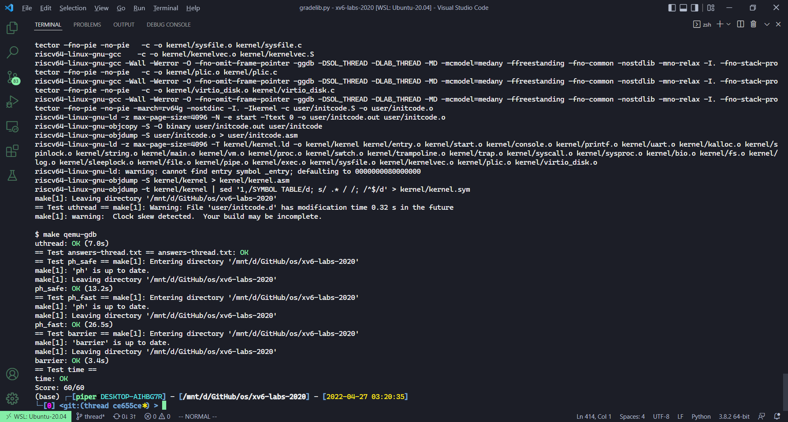

# Lab: Multithreading

本节作业：
- https://github.com/PiperLiu/xv6-labs-2020/tree/thread

目录：

<!-- @import "[TOC]" {cmd="toc" depthFrom=2 depthTo=2 orderedList=false} -->

<!-- code_chunk_output -->


<!-- /code_chunk_output -->

细分目录：

<!-- @import "[TOC]" {cmd="toc" depthFrom=2 depthTo=6 orderedList=false} -->

<!-- code_chunk_output -->

- [Uthread: switching between threads （用户态模拟线程切换）](#uthread-switching-between-threads-用户态模拟线程切换)
- [Using threads 基于 unix 库给 pthread 加锁](#using-threads-基于-unix-库给-pthread-加锁)
- [Barrier 使用条件变量](#barrier-使用条件变量)

<!-- /code_chunk_output -->

### Uthread: switching between threads （用户态模拟线程切换）

In this exercise you will design the context switch mechanism for a user-level threading system, and then implement it. To get you started, your xv6 has two files user/uthread.c and user/uthread_switch.S, and a rule in the Makefile to build a uthread program. uthread.c contains most of a user-level threading package, and code for three simple test threads. The threading package is missing some of the code to create a thread and to switch between threads.

Your job is to come up with a plan to create threads and save/restore registers to switch between threads, and implement that plan. When you're done, make grade should say that your solution passes the uthread test.

Once you've finished, you should see the following output when you run uthread on xv6 (the three threads might start in a different order):

```
$ make qemu
...
$ uthread
thread_a started
thread_b started
thread_c started
thread_c 0
thread_a 0
thread_b 0
thread_c 1
thread_a 1
thread_b 1
...
thread_c 99
thread_a 99
thread_b 99
thread_c: exit after 100
thread_a: exit after 100
thread_b: exit after 100
thread_schedule: no runnable threads
$
```

This output comes from the three test threads, each of which has a loop that prints a line and then yields the CPU to the other threads.

At this point, however, with no context switch code, you'll see no output.

You will need to add code to thread_create() and thread_schedule() in user/uthread.c, and thread_switch in user/uthread_switch.S. One goal is ensure that when thread_schedule() runs a given thread for the first time, the thread executes the function passed to thread_create(), on its own stack. Another goal is to ensure that thread_switch saves the registers of the thread being switched away from, restores the registers of the thread being switched to, and returns to the point in the latter thread's instructions where it last left off. You will have to decide where to save/restore registers; modifying struct thread to hold registers is a good plan. You'll need to add a call to thread_switch in thread_schedule; you can pass whatever arguments you need to thread_switch, but the intent is to switch from thread t to next_thread.

Some hints:
- thread_switch needs to save/restore only the callee-save registers. Why? 这个老师课上已经提问过，因为 caller 是给函数运算用的，可能随时会改变，没必要记住
- You can see the assembly code for uthread in user/uthread.asm, which may be handy for debugging.
- To test your code it might be helpful to single step through your thread_switch using riscv64-linux-gnu-gdb. You can get started in this way:

```
(gdb) file user/_uthread
Reading symbols from user/_uthread...
(gdb) b uthread.c:60
```

This sets a breakpoint at line 60 of uthread.c. The breakpoint may (or may not) be triggered before you even run uthread. How could that happen?

Once your xv6 shell runs, type "uthread", and gdb will break at line 60. Now you can type commands like the following to inspect the state of uthread:

```
  (gdb) p/x *next_thread
With "x", you can examine the content of a memory location:
  (gdb) x/x next_thread->stack
You can skip to the start of thread_switch thus:

   (gdb) b thread_switch
   (gdb) c
You can single step assembly instructions using:

   (gdb) si
```

On-line documentation for gdb is [here](https://sourceware.org/gdb/current/onlinedocs/gdb/).

说白了就是再巩固一下线程切换。

```c
#include "kernel/types.h"
#include "kernel/stat.h"
#include "user/user.h"

/* Possible states of a thread: */
#define FREE        0x0
#define RUNNING     0x1
#define RUNNABLE    0x2

#define STACK_SIZE  8192
#define MAX_THREAD  4

// 保留寄存器内容
// 和 kernel/proc.h 完全一样
struct context {
  uint64 ra;
  uint64 sp;

  // callee-saved
  uint64 s0;
  uint64 s1;
  uint64 s2;
  uint64 s3;
  uint64 s4;
  uint64 s5;
  uint64 s6;
  uint64 s7;
  uint64 s8;
  uint64 s9;
  uint64 s10;
  uint64 s11;
};

struct thread {
  char       stack[STACK_SIZE]; /* the thread's stack */
  int        state;             /* FREE, RUNNING, RUNNABLE */
  // 新增 context
  struct context context;

};
struct thread all_thread[MAX_THREAD];
struct thread *current_thread;
extern void thread_switch(uint64, uint64);
              
void 
thread_init(void)
{
  // main() is thread 0, which will make the first invocation to
  // thread_schedule().  it needs a stack so that the first thread_switch() can
  // save thread 0's state.  thread_schedule() won't run the main thread ever
  // again, because its state is set to RUNNING, and thread_schedule() selects
  // a RUNNABLE thread.
  current_thread = &all_thread[0];
  current_thread->state = RUNNING;
}

void 
thread_schedule(void)
{
  struct thread *t, *next_thread;

  /* Find another runnable thread. */
  next_thread = 0;
  t = current_thread + 1;
  for(int i = 0; i < MAX_THREAD; i++){
    if(t >= all_thread + MAX_THREAD)
      t = all_thread;
    if(t->state == RUNNABLE) {
      next_thread = t;
      break;
    }
    t = t + 1;
  }

  if (next_thread == 0) {
    printf("thread_schedule: no runnable threads\n");
    exit(-1);
  }

  if (current_thread != next_thread) {         /* switch threads?  */
    next_thread->state = RUNNING;
    t = current_thread;
    current_thread = next_thread;
    /* YOUR CODE HERE
     * Invoke thread_switch to switch from t to next_thread:
     * thread_switch(??, ??);
     * 在这里实现线程切换的逻辑
     * 因为不涉及 CPU 以及内核态，因此不需要锁
     */
    thread_switch((uint64) &t->context, (uint64) &next_thread->context);
  } else
    next_thread = 0;
}

void 
thread_create(void (*func)())
{
  struct thread *t;

  for (t = all_thread; t < all_thread + MAX_THREAD; t++) {
    if (t->state == FREE) break;
  }
  t->state = RUNNABLE;
  // YOUR CODE HERE
  t->context.ra = (uint64)func;
  t->context.sp = (uint64)t->stack + STACK_SIZE;
}

void 
thread_yield(void)
{
  current_thread->state = RUNNABLE;
  thread_schedule();
}

volatile int a_started, b_started, c_started;
volatile int a_n, b_n, c_n;

void 
thread_a(void)
{
  int i;
  printf("thread_a started\n");
  a_started = 1;
  while(b_started == 0 || c_started == 0)
    thread_yield();
  
  for (i = 0; i < 100; i++) {
    printf("thread_a %d\n", i);
    a_n += 1;
    thread_yield();
  }
  printf("thread_a: exit after %d\n", a_n);

  current_thread->state = FREE;
  thread_schedule();
}

void 
thread_b(void)
{
  int i;
  printf("thread_b started\n");
  b_started = 1;
  while(a_started == 0 || c_started == 0)
    thread_yield();
  
  for (i = 0; i < 100; i++) {
    printf("thread_b %d\n", i);
    b_n += 1;
    thread_yield();
  }
  printf("thread_b: exit after %d\n", b_n);

  current_thread->state = FREE;
  thread_schedule();
}

void 
thread_c(void)
{
  int i;
  printf("thread_c started\n");
  c_started = 1;
  while(a_started == 0 || b_started == 0)
    thread_yield();
  
  for (i = 0; i < 100; i++) {
    printf("thread_c %d\n", i);
    c_n += 1;
    thread_yield();
  }
  printf("thread_c: exit after %d\n", c_n);

  current_thread->state = FREE;
  thread_schedule();
}

int 
main(int argc, char *argv[]) 
{
  a_started = b_started = c_started = 0;
  a_n = b_n = c_n = 0;
  thread_init();
  thread_create(thread_a);
  thread_create(thread_b);
  thread_create(thread_c);
  thread_schedule();
  exit(0);
}
```

关于 uthread_switch.S 也是完全模仿 kernel 就行：

```S
	.text

	/*
         * save the old thread's registers,
         * restore the new thread's registers.
         */

	.globl thread_switch
thread_switch:
	/* YOUR CODE HERE */
	    sd ra, 0(a0)
        sd sp, 8(a0)
        sd s0, 16(a0)
        sd s1, 24(a0)
        sd s2, 32(a0)
        sd s3, 40(a0)
        sd s4, 48(a0)
        sd s5, 56(a0)
        sd s6, 64(a0)
        sd s7, 72(a0)
        sd s8, 80(a0)
        sd s9, 88(a0)
        sd s10, 96(a0)
        sd s11, 104(a0)

        ld ra, 0(a1)
        ld sp, 8(a1)
        ld s0, 16(a1)
        ld s1, 24(a1)
        ld s2, 32(a1)
        ld s3, 40(a1)
        ld s4, 48(a1)
        ld s5, 56(a1)
        ld s6, 64(a1)
        ld s7, 72(a1)
        ld s8, 80(a1)
        ld s9, 88(a1)
        ld s10, 96(a1)
        ld s11, 104(a1)
	ret    /* return to ra */
```

这里的线程是个假线程：
- 并没有涉及到 CPU 上的切换，完全在用户态中，仅仅是把一个进程分为三个线程依次执行罢了；每个线程主动出让，而非是用硬件中断
- 关于各个线程的栈，都是在 uthread 进程中的堆模拟的

### Using threads 基于 unix 库给 pthread 加锁

In this assignment you will explore parallel programming with threads and locks using a hash table. You should do this assignment on a real Linux or MacOS computer (not xv6, not qemu) that has multiple cores. Most recent laptops have multicore processors.

This assignment uses the UNIX pthread threading library. You can find information about it from the manual page, with man pthreads, and you can look on the web, for example [here](https://pubs.opengroup.org/onlinepubs/007908799/xsh/pthread_mutex_lock.html), [here](https://pubs.opengroup.org/onlinepubs/007908799/xsh/pthread_mutex_init.html), and [here](https://pubs.opengroup.org/onlinepubs/007908799/xsh/pthread_create.html).

The file notxv6/ph.c contains a simple hash table that is correct if used from a single thread, but incorrect when used from multiple threads. In your main xv6 directory (perhaps ~/xv6-labs-2020), type this:

```bash
$ make ph
$ ./ph 1
```

Note that to build ph the Makefile uses your OS's gcc, not the 6.S081 tools. The argument to ph specifies the number of threads that execute put and get operations on the the hash table. After running for a little while, ph 1 will produce output similar to this:

```bash
100000 puts, 3.991 seconds, 25056 puts/second
0: 0 keys missing
100000 gets, 3.981 seconds, 25118 gets/second
```

The numbers you see may differ from this sample output by a factor of two or more, depending on how fast your computer is, whether it has multiple cores, and whether it's busy doing other things.

ph runs two benchmarks. First it adds lots of keys to the hash table by calling put(), and prints the achieved rate in puts per second. The it fetches keys from the hash table with get(). It prints the number keys that should have been in the hash table as a result of the puts but are missing (zero in this case), and it prints the number of gets per second it achieved.

You can tell ph to use its hash table from multiple threads at the same time by giving it an argument greater than one. Try `ph 2`:

```bash
$ ./ph 2
100000 puts, 1.885 seconds, 53044 puts/second
1: 16579 keys missing
0: 16579 keys missing
200000 gets, 4.322 seconds, 46274 gets/second
```

The first line of this ph 2 output indicates that when two threads concurrently add entries to the hash table, they achieve a total rate of 53,044 inserts per second. That's about twice the rate of the single thread from running ph 1. That's an excellent "parallel speedup" of about 2x, as much as one could possibly hope for (i.e. twice as many cores yielding twice as much work per unit time).

However, the two lines saying 16579 keys missing indicate that a large number of keys that should have been in the hash table are not there. That is, the puts were supposed to add those keys to the hash table, but something went wrong. Have a look at notxv6/ph.c, particularly at put() and insert().

Why are there missing keys with 2 threads, but not with 1 thread? Identify a sequence of events with 2 threads that can lead to a key being missing. Submit your sequence with a short explanation in answers-thread.txt
To avoid this sequence of events, insert lock and unlock statements in put and get in notxv6/ph.c so that the number of keys missing is always 0 with two threads. The relevant pthread calls are:

```c
pthread_mutex_t lock;            // declare a lock
pthread_mutex_init(&lock, NULL); // initialize the lock
pthread_mutex_lock(&lock);       // acquire lock
pthread_mutex_unlock(&lock);     // release lock
```

You're done when make grade says that your code passes the ph_safe test, which requires zero missing keys with two threads. It's OK at this point to fail the ph_fast test.

Don't forget to call `pthread_mutex_init()`. Test your code first with 1 thread, then test it with 2 threads. Is it correct (i.e. have you eliminated missing keys?)? Does the two-threaded version achieve parallel speedup (i.e. more total work per unit time) relative to the single-threaded version?

There are situations where concurrent `put()`s have no overlap in the memory they read or write in the hash table, and thus don't need a lock to protect against each other. Can you change ph.c to take advantage of such situations to obtain parallel speedup for some `put()`s? Hint: how about a lock per hash bucket?

Modify your code so that some put operations run in parallel while maintaining correctness. You're done when make grade says your code passes both the ph_safe and ph_fast tests. The ph_fast test requires that two threads yield at least 1.25 times as many puts/second as one thread.

测试如下。

```bash
┌─[piper@DESKTOP-AIHBG7R] - [/mnt/d/GitHub/os/xv6-labs-2020] - [2022-04-27 12:12:29]
└─[0] <git:(thread 22703ba✱✈) > ./ph 2
100000 puts, 3.945 seconds, 25345 puts/second
1: 16360 keys missing
0: 16360 keys missing
200000 gets, 8.601 seconds, 23252 gets/second
┌─[piper@DESKTOP-AIHBG7R] - [/mnt/d/GitHub/os/xv6-labs-2020] - [2022-04-27 12:13:33]
└─[0] <git:(thread 22703ba✱✈) > ./ph 4
100000 puts, 1.288 seconds, 77633 puts/second
3: 36834 keys missing
0: 36834 keys missing
1: 36834 keys missing
2: 36834 keys missing
400000 gets, 8.099 seconds, 49387 gets/second
┌─[piper@DESKTOP-AIHBG7R] - [/mnt/d/GitHub/os/xv6-labs-2020] - [2022-04-27 02:01:13]
└─[0] <git:(thread 22703ba✱✈) > ./ph 5
100000 puts, 0.960 seconds, 104217 puts/second
0: 43384 keys missing
2: 43384 keys missing
1: 43384 keys missing
3: 43384 keys missing
4: 43384 keys missing
500000 gets, 7.195 seconds, 69489 gets/second
┌─[piper@DESKTOP-AIHBG7R] - [/mnt/d/GitHub/os/xv6-labs-2020] - [2022-04-27 02:01:25]
└─[0] <git:(thread 22703ba✱✈) > ./ph 8
100000 puts, 0.526 seconds, 190265 puts/second
0: 56667 keys missing
4: 56667 keys missing
2: 56667 keys missing
5: 56667 keys missing
6: 56667 keys missing
1: 56667 keys missing
3: 56667 keys missing
7: 56667 keys missing
800000 gets, 7.198 seconds, 111135 gets/second
┌─[piper@DESKTOP-AIHBG7R] - [/mnt/d/GitHub/os/xv6-labs-2020] - [2022-04-27 02:01:38]
└─[0] <git:(thread 22703ba✱✈) > ./ph 1
100000 puts, 6.955 seconds, 14378 puts/second
0: 0 keys missing
100000 gets, 6.867 seconds, 14563 gets/second
```

这里设置多个线程，每个线程把各自负责的数据（比如如果有 2 个线程，第一个线程把数据 0 到 49999 放到哈希表里作为 key ，第二个线程把 50000 到 99999 放到哈希表里作为 key ，而 value 是线程的编号）。

**注意这里的哈希表只有 5 个桶，使用的是拉链法，并且是线程不安全的。** 比如两个线程同时在一个桶 insert 。因此必须保证 insert 是原子操作。

```bash
┌─[piper@DESKTOP-AIHBG7R] - [/mnt/d/GitHub/os/xv6-labs-2020] - [2022-04-27 02:35:53]
└─[0] <git:(thread 22703ba✱✈) > ./ph 1
100000 puts, 7.066 seconds, 14152 puts/second
0: 0 keys missing
100000 gets, 7.776 seconds, 12861 gets/second
┌─[piper@DESKTOP-AIHBG7R] - [/mnt/d/GitHub/os/xv6-labs-2020] - [2022-04-27 02:36:20]
└─[0] <git:(thread 22703ba✱✈) > ./ph 2
100000 puts, 3.714 seconds, 26924 puts/second
0: 0 keys missing
1: 0 keys missing
200000 gets, 6.889 seconds, 29034 gets/second
┌─[piper@DESKTOP-AIHBG7R] - [/mnt/d/GitHub/os/xv6-labs-2020] - [2022-04-27 02:36:35]
└─[0] <git:(thread 22703ba✱✈) > ./ph 3
ph: notxv6/ph.c:117: main: Assertion `NKEYS % nthread == 0' failed.
[1]    4680 abort      ./ph 3
┌─[piper@DESKTOP-AIHBG7R] - [/mnt/d/GitHub/os/xv6-labs-2020] - [2022-04-27 02:36:44]
└─[134] <git:(thread 22703ba✱✈) > ./ph 4
100000 puts, 1.578 seconds, 63354 puts/second
1: 0 keys missing
0: 0 keys missing
3: 0 keys missing
2: 0 keys missing
400000 gets, 6.157 seconds, 64972 gets/second
┌─[piper@DESKTOP-AIHBG7R] - [/mnt/d/GitHub/os/xv6-labs-2020] - [2022-04-27 02:36:55]
└─[0] <git:(thread 22703ba✱✈) > ./ph 8
100000 puts, 1.000 seconds, 100017 puts/second
6: 0 keys missing
1: 0 keys missing
2: 0 keys missing
0: 0 keys missing
7: 0 keys missing
3: 0 keys missing
4: 0 keys missing
5: 0 keys missing
800000 gets, 6.303 seconds, 126919 gets/second
```

加锁后代码如下：

```c
#include <stdlib.h>
#include <unistd.h>
#include <stdio.h>
#include <assert.h>
#include <pthread.h>
#include <sys/time.h>

#define NBUCKET 5
#define NKEYS 100000

struct entry {
  int key;
  int value;
  struct entry *next;
};
struct entry *table[NBUCKET];
// 给每个桶分配一个 lock
pthread_mutex_t lock[NBUCKET] = {PTHREAD_MUTEX_INITIALIZER};
int keys[NKEYS];
int nthread = 1;

double
now()
{
 struct timeval tv;
 gettimeofday(&tv, 0);
 return tv.tv_sec + tv.tv_usec / 1000000.0;
}

static void 
insert(int key, int value, struct entry **p, struct entry *n)
{
  struct entry *e = malloc(sizeof(struct entry));
  e->key = key;
  e->value = value;
  e->next = n;
  *p = e;
}

static 
void put(int key, int value)
{
  int i = key % NBUCKET;

  // is the key already present?
  struct entry *e = 0;
  for (e = table[i]; e != 0; e = e->next) {
    if (e->key == key)
      break;
  }
  if(e){
    // update the existing key.
    e->value = value;
  } else {
    // the new is new.
    pthread_mutex_lock(&lock[i]);  // 加锁
    insert(key, value, &table[i], table[i]);
    pthread_mutex_unlock(&lock[i]);  // 解锁
  }
}

static struct entry*
get(int key)
{
  int i = key % NBUCKET;


  struct entry *e = 0;
  for (e = table[i]; e != 0; e = e->next) {
    if (e->key == key) break;
  }

  return e;
}

static void *
put_thread(void *xa)
{
  int n = (int) (long) xa; // thread number
  int b = NKEYS/nthread;

  for (int i = 0; i < b; i++) {
    put(keys[b*n + i], n);
  }

  return NULL;
}

static void *
get_thread(void *xa)
{
  int n = (int) (long) xa; // thread number
  int missing = 0;

  for (int i = 0; i < NKEYS; i++) {
    struct entry *e = get(keys[i]);
    if (e == 0) missing++;
  }
  printf("%d: %d keys missing\n", n, missing);
  return NULL;
}

int
main(int argc, char *argv[])
{
  pthread_t *tha;
  void *value;
  double t1, t0;

  if (argc < 2) {
    fprintf(stderr, "Usage: %s nthreads\n", argv[0]);
    exit(-1);
  }
  nthread = atoi(argv[1]);
  tha = malloc(sizeof(pthread_t) * nthread);
  srandom(0);
  assert(NKEYS % nthread == 0);
  for (int i = 0; i < NKEYS; i++) {
    keys[i] = random();
  }

  //
  // first the puts
  //
  t0 = now();
  for(int i = 0; i < nthread; i++) {
    assert(pthread_create(&tha[i], NULL, put_thread, (void *) (long) i) == 0);
  }
  for(int i = 0; i < nthread; i++) {
    assert(pthread_join(tha[i], &value) == 0);
  }
  t1 = now();

  printf("%d puts, %.3f seconds, %.0f puts/second\n",
         NKEYS, t1 - t0, NKEYS / (t1 - t0));

  //
  // now the gets
  //
  t0 = now();
  for(int i = 0; i < nthread; i++) {
    assert(pthread_create(&tha[i], NULL, get_thread, (void *) (long) i) == 0);
  }
  for(int i = 0; i < nthread; i++) {
    assert(pthread_join(tha[i], &value) == 0);
  }
  t1 = now();

  printf("%d gets, %.3f seconds, %.0f gets/second\n",
         NKEYS*nthread, t1 - t0, (NKEYS*nthread) / (t1 - t0));
}
```

### Barrier 使用条件变量

In this assignment you'll implement a [barrier](https://en.wikipedia.org/wiki/Barrier_(computer_science)): a point in an application at which all participating threads must wait until all other participating threads reach that point too. You'll use pthread condition variables, which are a sequence coordination technique similar to xv6's sleep and wakeup.

You should do this assignment on a real computer (not xv6, not qemu).

The file notxv6/barrier.c contains a broken barrier.

```
$ make barrier
$ ./barrier 2
barrier: notxv6/barrier.c:42: thread: Assertion `i == t' failed.
```

The 2 specifies the number of threads that synchronize on the barrier ( nthread in barrier.c). Each thread executes a loop. In each loop iteration a thread calls barrier() and then sleeps for a random number of microseconds. The assert triggers, because one thread leaves the barrier before the other thread has reached the barrier. The desired behavior is that each thread blocks in barrier() until all nthreads of them have called barrier().

Your goal is to achieve the desired barrier behavior. In addition to the lock primitives that you have seen in the ph assignment, you will need the following new pthread primitives; look [here](https://pubs.opengroup.org/onlinepubs/007908799/xsh/pthread_cond_wait.html) and [here](https://pubs.opengroup.org/onlinepubs/007908799/xsh/pthread_cond_broadcast.html) for details.

```
pthread_cond_wait(&cond, &mutex);  // go to sleep on cond, releasing lock mutex, acquiring upon wake up
pthread_cond_broadcast(&cond);     // wake up every thread sleeping on cond
```

Make sure your solution passes `make grade`'s barrier test.

pthread_cond_wait releases the mutex when called, and re-acquires the mutex before returning.
We have given you barrier_init(). Your job is to implement barrier() so that the panic doesn't occur. We've defined struct barrier for you; its fields are for your use.

There are two issues that complicate your task:

You have to deal with a succession of barrier calls, each of which we'll call a round. bstate.round records the current round. You should increment bstate.round each time all threads have reached the barrier.

You have to handle the case in which one thread races around the loop before the others have exited the barrier. In particular, you are re-using the bstate.nthread variable from one round to the next. Make sure that a thread that leaves the barrier and races around the loop doesn't increase bstate.nthread while a previous round is still using it.

Test your code with one, two, and more than two threads.

代码如下：

```c
#include <stdlib.h>
#include <unistd.h>
#include <stdio.h>
#include <assert.h>
#include <pthread.h>

static int nthread = 1;
static int round = 0;

struct barrier {
  pthread_mutex_t barrier_mutex;
  pthread_cond_t barrier_cond;
  int nthread;      // Number of threads that have reached this round of the barrier
  int round;     // Barrier round
} bstate;

static void
barrier_init(void)
{
  assert(pthread_mutex_init(&bstate.barrier_mutex, NULL) == 0);
  assert(pthread_cond_init(&bstate.barrier_cond, NULL) == 0);
  bstate.nthread = 0;
}

static void 
barrier()
{
  // YOUR CODE HERE
  //
  // Block until all threads have called barrier() and
  // then increment bstate.round.
  //
  pthread_mutex_lock(&bstate.barrier_mutex);
  ++ bstate.nthread;
  if (bstate.nthread == nthread) {
    bstate.nthread = 0;
    ++ bstate.round;
    /**
     * 只有所有线程都调用过一次 barrier 之后，才进入下一轮
     * 通过条件变量通知所有处于 wait 的线程
     */
    pthread_cond_broadcast(&bstate.barrier_cond);
  } else {
    /** pthread_cond_wait:
     * MUTEX is assumed to be locked before
     * 这里让本线程处于等待条件变量的状态，并且其他线程可以获取该 mutex 互斥锁
     */
    pthread_cond_wait(&bstate.barrier_cond, &bstate.barrier_mutex);
  }
  pthread_mutex_unlock(&bstate.barrier_mutex);  // 别忘了释放锁
}

static void *
thread(void *xa)
{
  long n = (long) xa;
  long delay;
  int i;

  for (i = 0; i < 20000; i++) {
    int t = bstate.round;
    assert (i == t);
    barrier();
    usleep(random() % 100);
  }

  return 0;
}

int
main(int argc, char *argv[])
{
  pthread_t *tha;
  void *value;
  long i;
  double t1, t0;

  if (argc < 2) {
    fprintf(stderr, "%s: %s nthread\n", argv[0], argv[0]);
    exit(-1);
  }
  nthread = atoi(argv[1]);
  tha = malloc(sizeof(pthread_t) * nthread);
  srandom(0);

  barrier_init();

  for(i = 0; i < nthread; i++) {
    assert(pthread_create(&tha[i], NULL, thread, (void *) i) == 0);
  }
  for(i = 0; i < nthread; i++) {
    assert(pthread_join(tha[i], &value) == 0);
  }
  printf("OK; passed\n");
}
```


