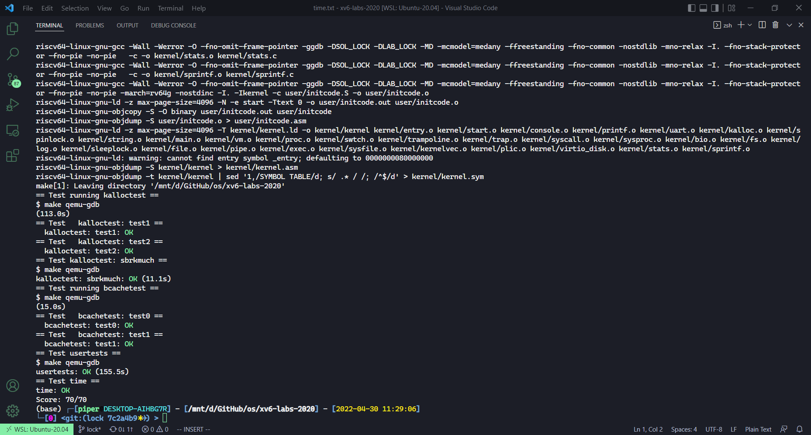
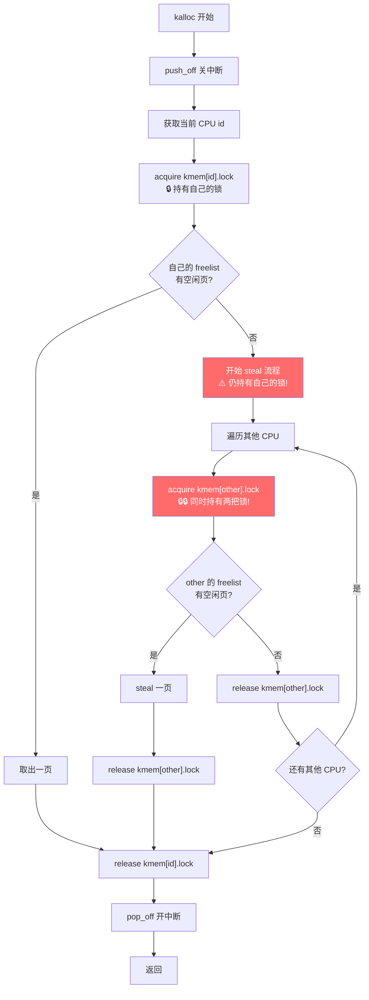
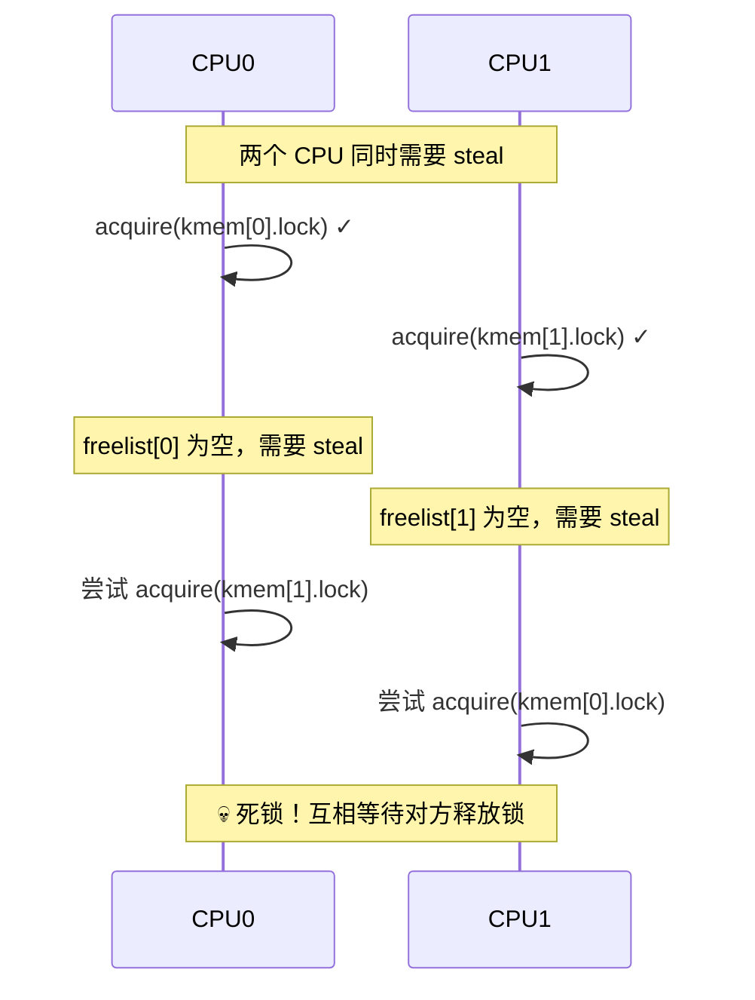
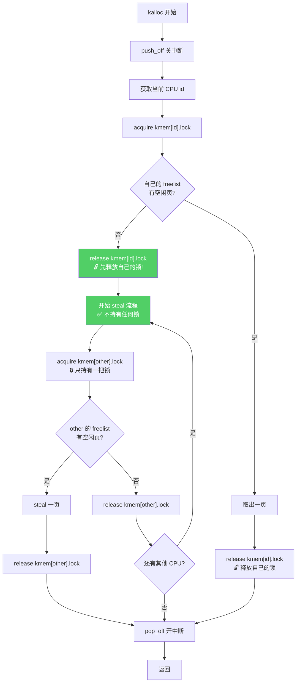
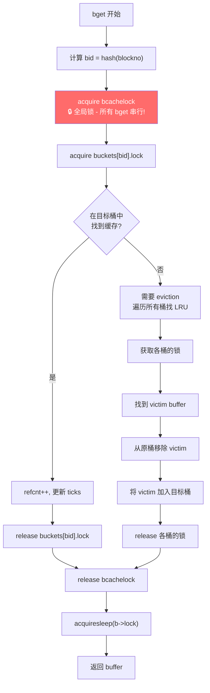
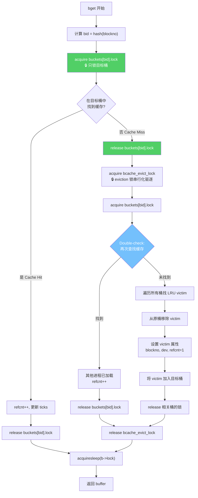
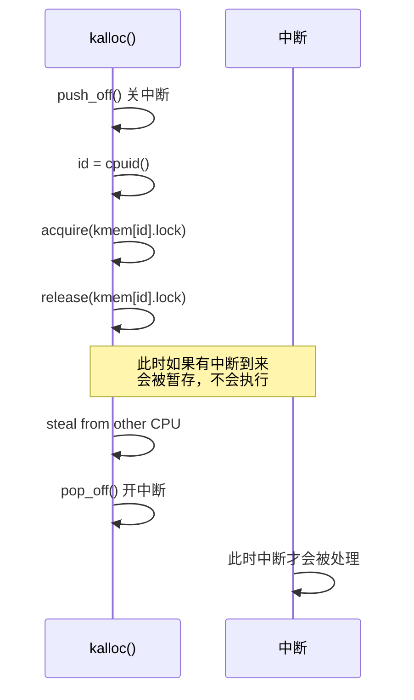
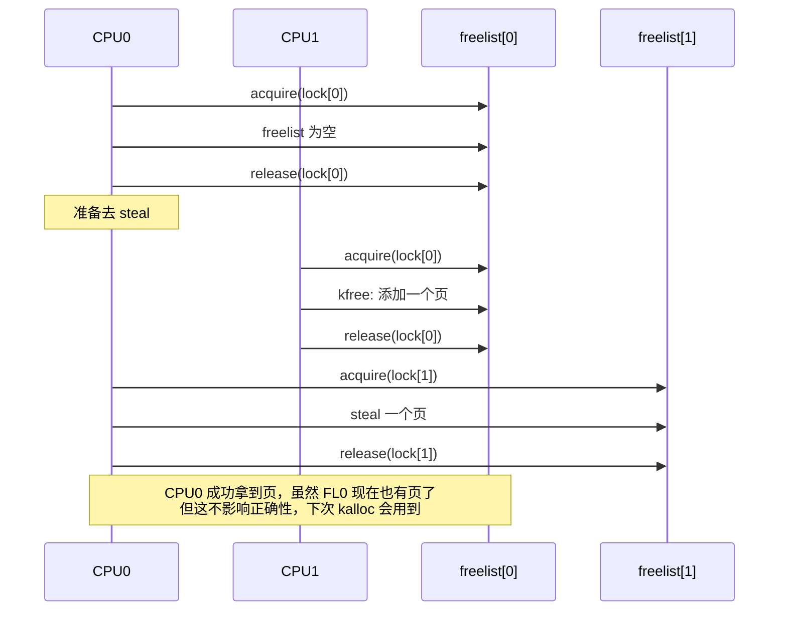
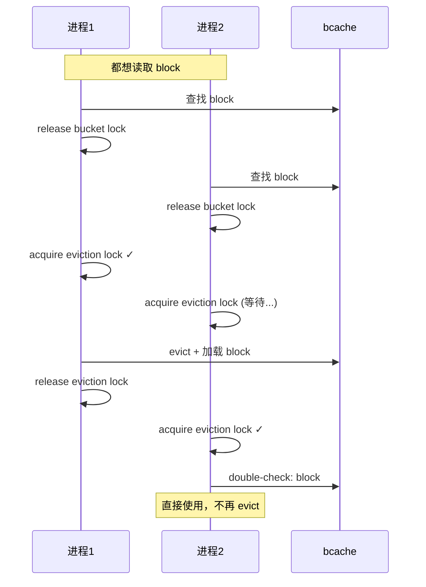

# Lab: locks

本节作业：
- https://github.com/PiperLiu/xv6-labs-2020/tree/lock

目录：

<!-- @import "[TOC]" {cmd="toc" depthFrom=2 depthTo=2 orderedList=false} -->

<!-- code_chunk_output -->

- [专有名词与背景知识](#专有名词与背景知识)
- [Memory allocator 每个 CPU 核单独一个 freelist 链表](#memory-allocator-每个-cpu-核单独一个-freelist-链表)
- [Buffer cache 把 bcache 分桶（分成多个链表），这样可以分解加锁的压力](#buffer-cache-把-bcache-分桶分成多个链表这样可以分解加锁的压力)
- [2026年回顾：代码中潜在的问题分析](#2026年回顾代码中潜在的问题分析)
- [流程图对比：旧实现 vs 修复后实现](#流程图对比旧实现-vs-修复后实现)
- [常见问题解答（Q&A）](#常见问题解答qa)
- [2026年修复：正确的解决方案](#2026年修复正确的解决方案)

<!-- /code_chunk_output -->

细分目录：

<!-- @import "[TOC]" {cmd="toc" depthFrom=2 depthTo=6 orderedList=false} -->

<!-- code_chunk_output -->

- [专有名词与背景知识](#专有名词与背景知识)
  - [kalloc / kfree 与 freelist](#kalloc--kfree-与-freelist)
  - [bcache (Buffer Cache)](#bcache-buffer-cache)
  - [steal（窃取）](#steal窃取)
  - [eviction（驱逐）](#eviction驱逐)
  - [refcnt（引用计数）](#refcnt引用计数)
- [Memory allocator 每个 CPU 核单独一个 freelist 链表](#memory-allocator-每个-cpu-核单独一个-freelist-链表)
- [Buffer cache 把 bcache 分桶（分成多个链表），这样可以分解加锁的压力](#buffer-cache-把-bcache-分桶分成多个链表这样可以分解加锁的压力)
- [2026年回顾：代码中潜在的问题分析](#2026年回顾代码中潜在的问题分析)
  - [作业背景与当时的解题思路](#作业背景与当时的解题思路)
  - [问题分析](#问题分析)
  - [1. kalloc.c 中的问题](#1-kallocc-中的问题)
  - [2. bio.c 中的问题](#2-bioc-中的问题)
  - [总结](#总结)
- [流程图对比：旧实现 vs 修复后实现](#流程图对比旧实现-vs-修复后实现)
  - [kalloc() 旧实现流程（有死锁风险）](#kalloc-旧实现流程有死锁风险)
  - [kalloc() 修复后流程（无死锁风险）](#kalloc-修复后流程无死锁风险)
  - [bget() 旧实现流程（全局锁串行化）](#bget-旧实现流程全局锁串行化)
  - [bget() 修复后流程（真正的并行）](#bget-修复后流程真正的并行)
- [常见问题解答（Q&A）](#常见问题解答qa)
  - [Q1: "先释放自己的锁再 steal" 会导致本 CPU 的其他操作冲突吗？](#q1-先释放自己的锁再-steal-会导致本-cpu-的其他操作冲突吗)
  - [Q2: 释放锁后，自己的 freelist 会被其他 CPU 修改吗？](#q2-释放锁后自己的-freelist-会被其他-cpu-修改吗)
  - [Q3: 为什么 brelse 中读取 b->blockno 是安全的？](#q3-为什么-brelse-中读取-b-blockno-是安全的)
  - [Q4: 为什么需要 double-check？](#q4-为什么需要-double-check)
- [2026年修复：正确的解决方案](#2026年修复正确的解决方案)
  - [kalloc.c 修复](#kallocc-修复)
  - [bio.c 修复](#bioc-修复)
  - [修复后测试结果](#修复后测试结果)

<!-- /code_chunk_output -->

## 专有名词与背景知识

在开始本 lab 之前，先了解一些关键概念：

### kalloc / kfree 与 freelist

**kalloc** (kernel allocate) 是 xv6 的内核物理内存分配器，负责分配 4096 字节（一页）的物理内存。它在以下场景被调用：
- 用户进程增长地址空间（如 `sbrk` 系统调用）
- 创建新进程时分配内核栈
- 分配页表页
- 分配 pipe buffer

**kfree** 则负责释放物理内存页，将其归还给空闲池。

**freelist** （空闲链表）是 kalloc/kfree 管理空闲物理页的数据结构。每个空闲页的起始位置存储一个指向下一个空闲页的指针，形成单向链表：

```
freelist -> [page1] -> [page2] -> [page3] -> NULL
             |           |           |
           (空闲页)    (空闲页)    (空闲页)
```

### bcache (Buffer Cache)

**bcache** (buffer cache，缓冲区缓存) 是磁盘块在内存中的缓存层，位于文件系统和磁盘驱动之间。它的作用是：
1. **减少磁盘 I/O** ：将频繁访问的磁盘块缓存在内存中
2. **同步访问** ：确保同一磁盘块在内存中只有一个副本，多个进程对同一块的访问都通过这个缓存

bcache 在以下场景被调用：
- `bread(dev, blockno)`：读取磁盘块，先查缓存，未命中则从磁盘读取
- `bwrite(b)`：将缓存的块写回磁盘
- `brelse(b)`：释放对缓存块的引用

### steal（窃取）

当某个 CPU 的 freelist 为空时，需要从其他 CPU 的 freelist "窃取"空闲页。这是 per-CPU freelist 设计中的关键操作。

### eviction（驱逐）

当 buffer cache 已满，需要加载新的磁盘块时，必须选择一个现有的缓存块"驱逐"出去，腾出空间。通常使用 **LRU（Least Recently Used，最近最少使用）** 策略：选择最长时间未被访问的块进行驱逐。

### refcnt（引用计数）

`refcnt` 记录有多少个进程正在使用某个 buffer。只有 `refcnt == 0` 的 buffer 才可以被 evict。

---

## Memory allocator 每个 CPU 核单独一个 freelist 链表

The program user/kalloctest stresses xv6's memory allocator: three processes grow and shrink their address spaces, resulting in many calls to kalloc and kfree. kalloc and kfree obtain kmem.lock. kalloctest prints (as `"#fetch-and-add`") the number of loop iterations in acquire due to attempts to acquire a lock that another core already holds, for the kmem lock and a few other locks. The number of loop iterations in acquire is a rough measure of lock contention. The output of kalloctest looks similar to this before you complete the lab:

```bash
$ kalloctest
start test1
test1 results:
--- lock kmem/bcache stats
lock: kmem: #fetch-and-add 83375 #acquire() 433015
lock: bcache: #fetch-and-add 0 #acquire() 1260
--- top 5 contended locks:
lock: kmem: #fetch-and-add 83375 #acquire() 433015
lock: proc: #fetch-and-add 23737 #acquire() 130718
lock: virtio_disk: #fetch-and-add 11159 #acquire() 114
lock: proc: #fetch-and-add 5937 #acquire() 130786
lock: proc: #fetch-and-add 4080 #acquire() 130786
tot= 83375
test1 FAIL
```

`acquire` maintains, for each lock, the count of calls to acquire for that lock, and the number of times the loop in acquire tried but failed to set the lock. kalloctest calls a system call that causes the kernel to print those counts for the kmem and bcache locks (which are the focus of this lab) and for the 5 most contended locks. If there is lock contention the number of acquire loop iterations will be large. The system call returns the sum of the number of loop iterations for the kmem and bcache locks.

For this lab, you must use a dedicated unloaded machine with multiple cores. If you use a machine that is doing other things, the counts that kalloctest prints will be nonsense. You can use a dedicated Athena workstation, or your own laptop, but don't use a dialup machine.

The root cause of lock contention in kalloctest is that kalloc() has a single free list, protected by a single lock. To remove lock contention, you will have to redesign the memory allocator to avoid a single lock and list. **The basic idea is to maintain a free list per CPU, each list with its own lock. Allocations and frees on different CPUs can run in parallel, because each CPU will operate on a different list.** The main challenge will be to deal with **the case in which one CPU's free list is empty, but another CPU's list has free memory; in that case, the one CPU must "steal" part of the other CPU's free list. Stealing may introduce lock contention, but that will hopefully be infrequent.**

Your job is to implement per-CPU freelists, and stealing when a CPU's free list is empty. You must give all of your locks names that start with "kmem". That is, you should call initlock for each of your locks, and pass a name that starts with "kmem". Run kalloctest to see if your implementation has reduced lock contention. To check that it can still allocate all of memory, run usertests sbrkmuch. Your output will look similar to that shown below, with much-reduced contention in total on kmem locks, although the specific numbers will differ. Make sure all tests in usertests pass. make grade should say that the kalloctests pass.

```bash
$ kalloctest
start test1
test1 results:
--- lock kmem/bcache stats
lock: kmem: #fetch-and-add 0 #acquire() 42843
lock: kmem: #fetch-and-add 0 #acquire() 198674
lock: kmem: #fetch-and-add 0 #acquire() 191534
lock: bcache: #fetch-and-add 0 #acquire() 1242
--- top 5 contended locks:
lock: proc: #fetch-and-add 43861 #acquire() 117281
lock: virtio_disk: #fetch-and-add 5347 #acquire() 114
lock: proc: #fetch-and-add 4856 #acquire() 117312
lock: proc: #fetch-and-add 4168 #acquire() 117316
lock: proc: #fetch-and-add 2797 #acquire() 117266
tot= 0
test1 OK
start test2
total free number of pages: 32499 (out of 32768)
.....
test2 OK
$ usertests sbrkmuch
usertests starting
test sbrkmuch: OK
ALL TESTS PASSED
$ usertests
...
ALL TESTS PASSED
$
```

Some hints:
- You can use the constant NCPU from kernel/param.h
- Let freerange give all free memory to the CPU running freerange.
- The function cpuid returns the current core number, but it's only safe to call it and use its result when interrupts are turned off. You should use push_off() and pop_off() to turn interrupts off and on.
- Have a look at the snprintf function in kernel/sprintf.c for string formatting ideas. It is OK to just name all locks "kmem" though.

说白了就是每个 CPU 核一个 freelist，每个 freelist 对应一个 lock。

```c
// Physical memory allocator, for user processes,
// kernel stacks, page-table pages,
// and pipe buffers. Allocates whole 4096-byte pages.

#include "types.h"
#include "param.h"
#include "memlayout.h"
#include "spinlock.h"
#include "riscv.h"
#include "defs.h"

void freerange(void *pa_start, void *pa_end);

extern char end[]; // first address after kernel.
                   // defined by kernel.ld.

struct run {
  struct run *next;
};

struct {
  struct spinlock lock;
  struct run *freelist;
// } kmem;
} kmem[NCPU];

void
kinit()
{
  /**
  initlock(&kmem.lock, "kmem");
  */
  char lockname[8];
  for (int i = 0; i < NCPU; ++ i) {
    snprintf(lockname, sizeof(lockname), "kmem_%d", i);
    initlock(&kmem[i].lock, lockname);
  }
  freerange(end, (void *)PHYSTOP);
}

void
freerange(void *pa_start, void *pa_end)
{
  char *p;
  p = (char*)PGROUNDUP((uint64)pa_start);
  for(; p + PGSIZE <= (char*)pa_end; p += PGSIZE)
    kfree(p);
}

// Free the page of physical memory pointed at by v,
// which normally should have been returned by a
// call to kalloc().  (The exception is when
// initializing the allocator; see kinit above.)
void
kfree(void *pa)
{
  struct run *r;

  if(((uint64)pa % PGSIZE) != 0 || (char*)pa < end || (uint64)pa >= PHYSTOP)
    panic("kfree");

  // Fill with junk to catch dangling refs.
  memset(pa, 1, PGSIZE);

  r = (struct run*)pa;

  push_off();  // 关中断后调用 cpuid 才合理
  int id = cpuid();  // 给当前 cpu 分配一个空页
  acquire(&kmem[id].lock);
  r->next = kmem[id].freelist;
  kmem[id].freelist = r;
  release(&kmem[id].lock);
  pop_off();

  /**
  acquire(&kmem.lock);
  r->next = kmem.freelist;
  kmem.freelist = r;
  release(&kmem.lock);
  */
}

// Allocate one 4096-byte page of physical memory.
// Returns a pointer that the kernel can use.
// Returns 0 if the memory cannot be allocated.
void *
kalloc(void)
{
  struct run *r;

  /**
  acquire(&kmem.lock);
  r = kmem.freelist;
  if(r)
    kmem.freelist = r->next;
  release(&kmem.lock);
  */

  push_off();  // 关中断
  int id = cpuid();
  acquire(&kmem[id].lock);
  r = kmem[id].freelist;
  // 如果 r 上还有页
  if (r)
    kmem[id].freelist = r->next;
  else {  // 否则去 steal 别的 cpu 的一页
    int _id;
    for (_id = 0; _id < NCPU; ++ _id) {
      if (_id == id) continue;
      acquire(&kmem[_id].lock);
      r = kmem[_id].freelist;
      if (r) {
        kmem[_id].freelist = r->next;
        release(&kmem[_id].lock);
        break;
      }
      release(&kmem[_id].lock);
    }
  }
  release(&kmem[id].lock);
  pop_off();

  if(r)
    memset((char*)r, 5, PGSIZE); // fill with junk
  return (void*)r;
}
```

上面的代码很简单。这里需要额外记录一下 lab 的验证程序，这个不需要咱们写，咱们看看 spinlock.c 咋统计的：

```c
// Mutual exclusion spin locks.

#include "types.h"
#include "param.h"
#include "memlayout.h"
#include "spinlock.h"
#include "riscv.h"
#include "proc.h"
#include "defs.h"

#ifdef LAB_LOCK
#define NLOCK 500

static struct spinlock *locks[NLOCK];
struct spinlock lock_locks;

void
freelock(struct spinlock *lk)
{
  acquire(&lock_locks);
  int i;
  for (i = 0; i < NLOCK; i++) {
    if(locks[i] == lk) {
      locks[i] = 0;
      break;
    }
  }
  release(&lock_locks);
}

static void
findslot(struct spinlock *lk) {
  acquire(&lock_locks);
  int i;
  for (i = 0; i < NLOCK; i++) {
    if(locks[i] == 0) {
      locks[i] = lk;
      release(&lock_locks);
      return;
    }
  }
  panic("findslot");
}
#endif

void
initlock(struct spinlock *lk, char *name)
{
  lk->name = name;
  lk->locked = 0;
  lk->cpu = 0;
#ifdef LAB_LOCK
  lk->nts = 0;
  lk->n = 0;
  findslot(lk);
#endif  
}

// Acquire the lock.
// Loops (spins) until the lock is acquired.
void
acquire(struct spinlock *lk)
{
  push_off(); // disable interrupts to avoid deadlock.
  if(holding(lk))
    panic("acquire");

#ifdef LAB_LOCK
    __sync_fetch_and_add(&(lk->n), 1);
#endif      

  // On RISC-V, sync_lock_test_and_set turns into an atomic swap:
  //   a5 = 1
  //   s1 = &lk->locked
  //   amoswap.w.aq a5, a5, (s1)
  while(__sync_lock_test_and_set(&lk->locked, 1) != 0) {
#ifdef LAB_LOCK
    __sync_fetch_and_add(&(lk->nts), 1);
#else
   ;
#endif
  }

  // Tell the C compiler and the processor to not move loads or stores
  // past this point, to ensure that the critical section's memory
  // references happen strictly after the lock is acquired.
  // On RISC-V, this emits a fence instruction.
  __sync_synchronize();

  // Record info about lock acquisition for holding() and debugging.
  lk->cpu = mycpu();
}

// Release the lock.
void
release(struct spinlock *lk)
{
  if(!holding(lk))
    panic("release");

  lk->cpu = 0;

  // Tell the C compiler and the CPU to not move loads or stores
  // past this point, to ensure that all the stores in the critical
  // section are visible to other CPUs before the lock is released,
  // and that loads in the critical section occur strictly before
  // the lock is released.
  // On RISC-V, this emits a fence instruction.
  __sync_synchronize();

  // Release the lock, equivalent to lk->locked = 0.
  // This code doesn't use a C assignment, since the C standard
  // implies that an assignment might be implemented with
  // multiple store instructions.
  // On RISC-V, sync_lock_release turns into an atomic swap:
  //   s1 = &lk->locked
  //   amoswap.w zero, zero, (s1)
  __sync_lock_release(&lk->locked);

  pop_off();
}

// Check whether this cpu is holding the lock.
// Interrupts must be off.
int
holding(struct spinlock *lk)
{
  int r;
  r = (lk->locked && lk->cpu == mycpu());
  return r;
}

// push_off/pop_off are like intr_off()/intr_on() except that they are matched:
// it takes two pop_off()s to undo two push_off()s.  Also, if interrupts
// are initially off, then push_off, pop_off leaves them off.

void
push_off(void)
{
  int old = intr_get();

  intr_off();
  if(mycpu()->noff == 0)
    mycpu()->intena = old;
  mycpu()->noff += 1;
}

void
pop_off(void)
{
  struct cpu *c = mycpu();
  if(intr_get())
    panic("pop_off - interruptible");
  if(c->noff < 1)
    panic("pop_off");
  c->noff -= 1;
  if(c->noff == 0 && c->intena)
    intr_on();
}

#ifdef LAB_LOCK
int
snprint_lock(char *buf, int sz, struct spinlock *lk)
{
  int n = 0;
  if(lk->n > 0) {
    n = snprintf(buf, sz, "lock: %s: #fetch-and-add %d #acquire() %d\n",
                 lk->name, lk->nts, lk->n);
  }
  return n;
}

int
statslock(char *buf, int sz) {
  int n;
  int tot = 0;

  acquire(&lock_locks);
  n = snprintf(buf, sz, "--- lock kmem/bcache stats\n");
  for(int i = 0; i < NLOCK; i++) {
    if(locks[i] == 0)
      break;
    if(strncmp(locks[i]->name, "bcache", strlen("bcache")) == 0 ||
       strncmp(locks[i]->name, "kmem", strlen("kmem")) == 0) {
      tot += locks[i]->nts;
      n += snprint_lock(buf +n, sz-n, locks[i]);
    }
  }
  
  n += snprintf(buf+n, sz-n, "--- top 5 contended locks:\n");
  int last = 100000000;
  // stupid way to compute top 5 contended locks
  for(int t = 0; t < 5; t++) {
    int top = 0;
    for(int i = 0; i < NLOCK; i++) {
      if(locks[i] == 0)
        break;
      if(locks[i]->nts > locks[top]->nts && locks[i]->nts < last) {
        top = i;
      }
    }
    n += snprint_lock(buf+n, sz-n, locks[top]);
    last = locks[top]->nts;
  }
  n += snprintf(buf+n, sz-n, "tot= %d\n", tot);
  release(&lock_locks);  
  return n;
}
#endif
```

其实逻辑很简单，对于开启了 LAB_LOCK 宏的情况， `nts` 统计了该锁的自选等待次数（浪费的计算量），而 `n` 记录了系统中调用了 acquire 次数。

## Buffer cache 把 bcache 分桶（分成多个链表），这样可以分解加锁的压力

This half of the assignment is independent from the first half; you can work on this half (and pass the tests) whether or not you have completed the first half.

If multiple processes use the file system intensively, they will likely contend for bcache.lock, which protects the disk block cache in kernel/bio.c. bcachetest creates several processes that repeatedly read different files in order to generate contention on bcache.lock; its output looks like this (before you complete this lab):

```bash
$ bcachetest
start test0
test0 results:
--- lock kmem/bcache stats
lock: kmem: #fetch-and-add 0 #acquire() 33035
lock: bcache: #fetch-and-add 16142 #acquire() 65978
--- top 5 contended locks:
lock: virtio_disk: #fetch-and-add 162870 #acquire() 1188
lock: proc: #fetch-and-add 51936 #acquire() 73732
lock: bcache: #fetch-and-add 16142 #acquire() 65978
lock: uart: #fetch-and-add 7505 #acquire() 117
lock: proc: #fetch-and-add 6937 #acquire() 73420
tot= 16142
test0: FAIL
start test1
test1 OK
```

You will likely see different output, but the number of acquire loop iterations for the bcache lock will be high. If you look at the code in kernel/bio.c, you'll see that bcache.lock protects the list of cached block buffers, the reference count (b->refcnt) in each block buffer, and the identities of the cached blocks (b->dev and b->blockno).

Modify the block cache so that the number of acquire loop iterations for all locks in the bcache is close to zero when running bcachetest. Ideally the sum of the counts for all locks involved in the block cache should be zero, but it's OK if the sum is less than 500. Modify bget and brelse so that concurrent lookups and releases for different blocks that are in the bcache are unlikely to conflict on locks (e.g., don't all have to wait for bcache.lock). You must maintain the invariant that at most one copy of each block is cached. When you are done, your output should be similar to that shown below (though not identical). Make sure usertests still passes. make grade should pass all tests when you are done.

```bash
$ bcachetest
start test0
test0 results:
--- lock kmem/bcache stats
lock: kmem: #fetch-and-add 0 #acquire() 32954
lock: kmem: #fetch-and-add 0 #acquire() 75
lock: kmem: #fetch-and-add 0 #acquire() 73
lock: bcache: #fetch-and-add 0 #acquire() 85
lock: bcache.bucket: #fetch-and-add 0 #acquire() 4159
lock: bcache.bucket: #fetch-and-add 0 #acquire() 2118
lock: bcache.bucket: #fetch-and-add 0 #acquire() 4274
lock: bcache.bucket: #fetch-and-add 0 #acquire() 4326
lock: bcache.bucket: #fetch-and-add 0 #acquire() 6334
lock: bcache.bucket: #fetch-and-add 0 #acquire() 6321
lock: bcache.bucket: #fetch-and-add 0 #acquire() 6704
lock: bcache.bucket: #fetch-and-add 0 #acquire() 6696
lock: bcache.bucket: #fetch-and-add 0 #acquire() 7757
lock: bcache.bucket: #fetch-and-add 0 #acquire() 6199
lock: bcache.bucket: #fetch-and-add 0 #acquire() 4136
lock: bcache.bucket: #fetch-and-add 0 #acquire() 4136
lock: bcache.bucket: #fetch-and-add 0 #acquire() 2123
--- top 5 contended locks:
lock: virtio_disk: #fetch-and-add 158235 #acquire() 1193
lock: proc: #fetch-and-add 117563 #acquire() 3708493
lock: proc: #fetch-and-add 65921 #acquire() 3710254
lock: proc: #fetch-and-add 44090 #acquire() 3708607
lock: proc: #fetch-and-add 43252 #acquire() 3708521
tot= 128
test0: OK
start test1
test1 OK
$ usertests
  ...
ALL TESTS PASSED
$
```

Please give all of your locks names that start with "bcache". That is, you should call initlock for each of your locks, and pass a name that starts with "bcache".

Reducing contention in the block cache is more tricky than for kalloc, because bcache buffers are truly shared among processes (and thus CPUs). For kalloc, one could eliminate most contention by giving each CPU its own allocator; that won't work for the block cache. We suggest you look up block numbers in the cache with a hash table that has a lock per hash bucket.

There are some circumstances in which it's OK if your solution has lock conflicts:
- When two processes concurrently use the same block number. bcachetest test0 doesn't ever do this.
- When two processes concurrently miss in the cache, and need to find an unused block to replace. bcachetest test0 doesn't ever do this.
- When two processes concurrently use blocks that conflict in whatever scheme you use to partition the blocks and locks; for example, if two processes use blocks whose block numbers hash to the same slot in a hash table. bcachetest test0 might do this, depending on your design, but you should try to adjust your scheme's details to avoid conflicts (e.g., change the size of your hash table).

bcachetest's test1 uses more distinct blocks than there are buffers, and exercises lots of file system code paths.

Here are some hints:
- Read the description of the block cache in the xv6 book (Section 8.1-8.3).
- It is OK to use a fixed number of buckets and not resize the hash table dynamically. Use a prime number of buckets (e.g., 13) to reduce the likelihood of hashing conflicts.
- Searching in the hash table for a buffer and allocating an entry for that buffer when the buffer is not found must be atomic.
- Remove the list of all buffers (bcache.head etc.) and instead time-stamp buffers using the time of their last use (i.e., using ticks in kernel/trap.c). With this change brelse doesn't need to acquire the bcache lock, and bget can select the least-recently used block based on the time-stamps.
- It is OK to serialize eviction in bget (i.e., the part of bget that selects a buffer to re-use when a lookup misses in the cache).
- Your solution might need to hold two locks in some cases; for example, during eviction you may need to hold the bcache lock and a lock per bucket. Make sure you avoid deadlock.
- When replacing a block, you might move a struct buf from one bucket to another bucket, because the new block hashes to a different bucket. You might have a tricky case: the new block might hash to the same bucket as the old block. Make sure you avoid deadlock in that case.
- Some debugging tips: implement bucket locks but leave the global bcache.lock acquire/release at the beginning/end of bget to serialize the code. Once you are sure it is correct without race conditions, remove the global locks and deal with concurrency issues. You can also run make CPUS=1 qemu to test with one core.

虽然还没学文件系统，但是先来看一下 bio 做了什么事。如下是原有代码。

kernel/bio.h

```c
struct buf {
  int valid;   // has data been read from disk?
  int disk;    // does disk "own" buf?
  uint dev;
  uint blockno;
  struct sleeplock lock;
  uint refcnt;
  struct buf *prev; // LRU cache list
  struct buf *next;
  uchar data[BSIZE];
};
```

kernel/bio.c

```c
// Buffer cache.
//
// The buffer cache is a linked list of buf structures holding
// cached copies of disk block contents.  Caching disk blocks
// in memory reduces the number of disk reads and also provides
// a synchronization point for disk blocks used by multiple processes.
//
// Interface:
// * To get a buffer for a particular disk block, call bread.
// * After changing buffer data, call bwrite to write it to disk.
// * When done with the buffer, call brelse.
// * Do not use the buffer after calling brelse.
// * Only one process at a time can use a buffer,
//     so do not keep them longer than necessary.


#include "types.h"
#include "param.h"
#include "spinlock.h"
#include "sleeplock.h"
#include "riscv.h"
#include "defs.h"
#include "fs.h"
#include "buf.h"

struct {
  struct spinlock lock;
  struct buf buf[NBUF];

  // Linked list of all buffers, through prev/next.
  // Sorted by how recently the buffer was used.
  // head.next is most recent, head.prev is least.
  struct buf head;
} bcache;

void
binit(void)
{
  struct buf *b;

  initlock(&bcache.lock, "bcache");

  // Create linked list of buffers
  bcache.head.prev = &bcache.head;
  bcache.head.next = &bcache.head;
  for(b = bcache.buf; b < bcache.buf+NBUF; b++){
    b->next = bcache.head.next;
    b->prev = &bcache.head;
    initsleeplock(&b->lock, "buffer");
    bcache.head.next->prev = b;
    bcache.head.next = b;
  }
}

// Look through buffer cache for block on device dev.
// If not found, allocate a buffer.
// In either case, return locked buffer.
static struct buf*
bget(uint dev, uint blockno)
{
  struct buf *b;

  acquire(&bcache.lock);

  // Is the block already cached?
  for(b = bcache.head.next; b != &bcache.head; b = b->next){
    if(b->dev == dev && b->blockno == blockno){
      b->refcnt++;
      release(&bcache.lock);
      acquiresleep(&b->lock);
      return b;
    }
  }

  // Not cached.
  // Recycle the least recently used (LRU) unused buffer.
  for(b = bcache.head.prev; b != &bcache.head; b = b->prev){
    if(b->refcnt == 0) {
      b->dev = dev;
      b->blockno = blockno;
      b->valid = 0;
      b->refcnt = 1;
      release(&bcache.lock);
      acquiresleep(&b->lock);
      return b;
    }
  }
  panic("bget: no buffers");
}

// Return a locked buf with the contents of the indicated block.
struct buf*
bread(uint dev, uint blockno)
{
  struct buf *b;

  b = bget(dev, blockno);
  if(!b->valid) {
    virtio_disk_rw(b, 0);
    b->valid = 1;
  }
  return b;
}

// Write b's contents to disk.  Must be locked.
void
bwrite(struct buf *b)
{
  if(!holdingsleep(&b->lock))
    panic("bwrite");
  virtio_disk_rw(b, 1);
}

// Release a locked buffer.
// Move to the head of the most-recently-used list.
void
brelse(struct buf *b)
{
  if(!holdingsleep(&b->lock))
    panic("brelse");

  releasesleep(&b->lock);

  acquire(&bcache.lock);
  b->refcnt--;
  if (b->refcnt == 0) {
    // no one is waiting for it.
    b->next->prev = b->prev;
    b->prev->next = b->next;
    b->next = bcache.head.next;
    b->prev = &bcache.head;
    bcache.head.next->prev = b;
    bcache.head.next = b;
  }
  
  release(&bcache.lock);
}

void
bpin(struct buf *b) {
  acquire(&bcache.lock);
  b->refcnt++;
  release(&bcache.lock);
}

void
bunpin(struct buf *b) {
  acquire(&bcache.lock);
  b->refcnt--;
  release(&bcache.lock);
}
```

这里的 buf 实际上就是对磁盘内容在内存中的缓存，可以减少我们对磁盘的直接读写，并且可以让多个进程并行读写磁盘内容。

这里的 buf 用双线链表组织的，这样好实现 LRU 找最近最少使用的缓存。

这里为了防止多个进程同时读写一个 buf ，因此给每个 buf 加了一个 sleep lock ，即获取时要保证这个 buf 没有被其他进程获取。

**这个实现有什么问题呢？最明显的一点就是，bget 等操作时会把整个 bcache 都锁住。** 因此我们现在的任务就是把 bcache 一个链表分成好几个链表，这样就会降低 bget 同时访问一个链表的记录，从而减少卡在 acquire 的时间。

这里有个典型的死锁的情况要思考： **bget 将要先后获取两个链表的锁，因此如果两个 bget 并行，非常可能死锁（互相等待）；因此即便分成多个链表，也得给 bget 运行时加一个总链表。**

kernel/buf.h

```c
struct buf {
  int valid;   // has data been read from disk?
  int disk;    // does disk "own" buf?
  uint dev;
  uint blockno;
  struct sleeplock lock;
  uint refcnt;
  struct buf *prev; // LRU cache list
  struct buf *next;
  uchar data[BSIZE];
  // 因为不是一个链表了，因此根据 timestamp 找远未使用的 buf
  uint ticks;
};
```

kernel/bio.c

```c
// Buffer cache.
//
// The buffer cache is a linked list of buf structures holding
// cached copies of disk block contents.  Caching disk blocks
// in memory reduces the number of disk reads and also provides
// a synchronization point for disk blocks used by multiple processes.
//
// Interface:
// * To get a buffer for a particular disk block, call bread.
// * After changing buffer data, call bwrite to write it to disk.
// * When done with the buffer, call brelse.
// * Do not use the buffer after calling brelse.
// * Only one process at a time can use a buffer,
//     so do not keep them longer than necessary.


#include "types.h"
#include "param.h"
#include "spinlock.h"
#include "sleeplock.h"
#include "riscv.h"
#include "defs.h"
#include "fs.h"
#include "buf.h"

// 新增哈希桶，拉链法保存 buf
#define NBUCKET 11
#define HASH_BLOCKNO(blockno) (blockno % 11)
struct
{
 struct spinlock lock;
 struct buf head;
} buckets[NBUCKET];

// 把 buf 存在静态区
struct buf bufs[NBUF];
// 依然需要一个 bcache 的 lock ，否则 bget 可能死锁
struct spinlock bcachelock;

/** 不再需要 bcache 了
struct {
  struct spinlock lock;
  struct buf buf[NBUF];

  // Linked list of all buffers, through prev/next.
  // Sorted by how recently the buffer was used.
  // head.next is most recent, head.prev is least.
  struct buf head;
} bcache;
*/

void
binit(void)
{
  struct buf *b;
  char lockname[16];

  /** 注释掉旧的生成 buf 逻辑
  initlock(&bcache.lock, "bcache");
  */
  initlock(&bcachelock, "global_bcache");

  // 首先初始化每个桶（每个链表）
  for (int i = 0; i < NBUCKET; ++ i) {
    snprintf(lockname, sizeof(lockname), "bcache_%d", i);
    initlock(&buckets[i].lock, lockname);
    buckets[i].head.prev = &buckets[i].head;
    buckets[i].head.next = &buckets[i].head;
  }

  // 初始化 NBUF 个 buf
  // 因为都是空 buf ，全部放在 bucket[0] 中（放在哪无所谓）
  for (b = bufs; b < bufs + NBUF; ++ b) {
    b->next = buckets[0].head.next;
    b->prev = &buckets[0].head;
    initsleeplock(&b->lock, "buffer");
    buckets[0].head.next->prev = b;
    buckets[0].head.next = b;
  }

  /** 注释掉旧的生成 buf 逻辑
  // Create linked list of buffers
  bcache.head.prev = &bcache.head;
  bcache.head.next = &bcache.head;
  for(b = bcache.buf; b < bcache.buf+NBUF; b++){
    b->next = bcache.head.next;
    b->prev = &bcache.head;
    initsleeplock(&b->lock, "buffer");
    bcache.head.next->prev = b;
    bcache.head.next = b;
  }
  */
}

// Look through buffer cache for block on device dev.
// If not found, allocate a buffer.
// In either case, return locked buffer.
static struct buf*
bget(uint dev, uint blockno)
{
  struct buf *b, *tmpb;
  int bid, bi = -1;
  uint minticks = 1;
  for (int i = 1; i < 31; ++ i) minticks += (1 << i);

  bid = HASH_BLOCKNO(blockno);

  /**
  acquire(&bcache.lock);
  */
  // 防止两个 bget 死锁，因为 bget 可能要持有两个链表的锁
  acquire(&bcachelock);
  // 要对第 bid 条链表处理，因此锁住
  acquire(&buckets[bid].lock);

  // Is the block already cached?
  /**
  for(b = bcache.head.next; b != &bcache.head; b = b->next){
    if(b->dev == dev && b->blockno == blockno){
      b->refcnt++;
      release(&bcache.lock);
      acquiresleep(&b->lock);
      return b;
    }
  }
  */
  // 首先在这条链表上找一下，是否需要的 block 已经在 buf 中？
  for (b = buckets[bid].head.next; b != &buckets[bid].head; b = b->next) {
    if (b->dev == dev && b->blockno == blockno) {
      b->refcnt ++ ;
      acquire(&tickslock);
      b->ticks = ticks;
      release(&tickslock);
      release(&buckets[bid].lock);
      release(&bcachelock);
      acquiresleep(&b->lock);
      return b;
    }
  }

  // Not cached.
  // Recycle the least recently used (LRU) unused buffer.
  /**
  for(b = bcache.head.prev; b != &bcache.head; b = b->prev){
    if(b->refcnt == 0) {
      b->dev = dev;
      b->blockno = blockno;
      b->valid = 0;
      b->refcnt = 1;
      release(&bcache.lock);
      acquiresleep(&b->lock);
      return b;
    }
  }
  */
  // LRU：找时间戳最久远的，把这个 buf 回收了给 (dev, blockno)
  // 这里因为可能持有两个链表的锁，因此如果两个 bget 并行，则可能导致死锁
  // 因此在最外围有 bcachelock
  for (int i = 0; i < NBUCKET; ++ i) {
    if (i != bid)
      acquire(&buckets[i].lock);
    for (tmpb = buckets[i].head.prev; tmpb != &buckets[i].head; tmpb = tmpb->prev) {
      if (tmpb->refcnt == 0 && tmpb->ticks < minticks) {
        minticks = tmpb->ticks;
        b = tmpb;
        if (bi != i) {  // 如果候选 buf 所在链表改变，则释放之前候选 buf 所在链表锁
          if (bi != bid && bi != -1)
            release(&buckets[bi].lock);
          bi = i;
        }
      }
    }
    // 候选的 buf 所在链表不 release ， release 本次探索的链表
    if (i != bid && bi != i && holding(&buckets[i].lock))
      release(&buckets[i].lock);
  }
  // 找到了合适的 buf ，要注意，还要把这个 buf steal 到自己的链表中
  if (bi != -1 && b->refcnt == 0) {
    b->dev = dev;
    b->blockno = blockno;
    b->valid = 0;
    b->refcnt = 1;
    acquire(&tickslock);
    b->ticks = ticks;
    release(&tickslock);
    // steal 到自己的链表
    b->next->prev = b->prev;
    b->prev->next = b->next;
    if (bi != bid)  // b 所在原链表可以释放
      release(&buckets[bi].lock);
    b->next = buckets[bid].head.next;
    b->prev = &buckets[bid].head;
    buckets[bid].head.next->prev = b;
    buckets[bid].head.next = b;
    release(&buckets[bid].lock);
    release(&bcachelock);
    acquiresleep(&b->lock);
    return b;
  }
  panic("bget: no buffers");
}

// Return a locked buf with the contents of the indicated block.
struct buf*
bread(uint dev, uint blockno)
{
  struct buf *b;

  b = bget(dev, blockno);
  if(!b->valid) {
    virtio_disk_rw(b, 0);
    b->valid = 1;
  }
  return b;
}

// Write b's contents to disk.  Must be locked.
void
bwrite(struct buf *b)
{
  if(!holdingsleep(&b->lock))
    panic("bwrite");
  virtio_disk_rw(b, 1);
}

// Release a locked buffer.
// Move to the head of the most-recently-used list.
void
brelse(struct buf *b)
{
  // 仅对 b 所在的链表加锁就好
  int bid = HASH_BLOCKNO(b->blockno);

  if(!holdingsleep(&b->lock))
    panic("brelse");

  releasesleep(&b->lock);

  /**
  acquire(&bcache.lock);
  */
  acquire(&buckets[bid].lock);
  b->refcnt--;
  if (b->refcnt == 0) {
    // no one is waiting for it.
    /** 基于 ticks 时间戳做 LRU ，不需要头插法了
    b->next->prev = b->prev;
    b->prev->next = b->next;
    b->next = bcache.head.next;
    b->prev = &bcache.head;
    bcache.head.next->prev = b;
    bcache.head.next = b;
    */
    acquire(&tickslock);
    b->ticks = ticks;
    release(&tickslock);
  }

  /**
  release(&bcache.lock);
  */
  release(&buckets[bid].lock);
}

void
bpin(struct buf *b) {
  // 仅对 b 所在的链表加锁就好
  int bid = HASH_BLOCKNO(b->blockno);
  /**
  acquire(&bcache.lock);
  */
  acquire(&buckets[bid].lock);
  b->refcnt++;
  /**
  release(&bcache.lock);
  */
  release(&buckets[bid].lock);
}

void
bunpin(struct buf *b) {
  // 仅对 b 所在的链表加锁就好
  int bid = HASH_BLOCKNO(b->blockno);
  /**
  acquire(&bcache.lock);
  */
  acquire(&buckets[bid].lock);
  b->refcnt--;
  /**
  release(&bcache.lock);
  */
  release(&buckets[bid].lock);
}
```

注意，我在调试时总是遇到 panic: freeing free block 类似的错误。但是我检查逻辑似乎没什么错误了，之后 make clean 了一下就好使了，而且再也没出现过类似 panic ，很迷。



---

## 2026年回顾：代码中潜在的问题分析

### 作业背景与当时的解题思路

**Memory allocator 部分的作业要求：**

原始的 xv6 内存分配器 `kalloc()` 使用单一的 freelist 和单一的锁 `kmem.lock`。当多个 CPU 同时进行内存分配/释放时，所有操作都必须串行获取这把锁，导致严重的锁争用。Lab 要求我们实现 per-CPU freelists，即每个 CPU 维护自己的空闲页链表和对应的锁，从而让不同 CPU 的内存操作可以并行执行。当某个 CPU 的 freelist 为空时，需要从其他 CPU "steal" 空闲页。

**当时的解题思路：**
- 将 `kmem` 改为数组 `kmem[NCPU]`，每个 CPU 一个 freelist
- `kfree` 时将页面释放到当前 CPU 的 freelist
- `kalloc` 时优先从当前 CPU 的 freelist 分配，若为空则遍历其他 CPU 的 freelist 进行 steal

**Buffer cache 部分的作业要求：**

原始的 bcache 使用单一的双向链表存储所有 buffer，由单一的 `bcache.lock` 保护。当多个进程密集使用文件系统时，会产生严重的锁争用。Lab 要求我们使用哈希表（每个桶一把锁）来减少锁争用，同时必须保证每个 block 最多只有一个 cached copy。

**当时的解题思路：**
- 使用 11 个哈希桶，每个桶维护一个双向链表和对应的锁
- 使用 `blockno % 11` 作为哈希函数
- 用时间戳 `ticks` 替代链表顺序来实现 LRU
- 为了防止 `bget` 中同时获取多个桶的锁导致死锁，引入全局锁 `bcachelock`

---

### 问题分析

虽然当时 `make grade` 拿到了 70/70 分，但代码中实际上存在一些潜在的正确性和性能问题。

### 1. kalloc.c 中的问题

**问题 1：steal 时的死锁风险**

在 `kalloc()` 函数中，当本 CPU 的 freelist 为空需要 steal 时，代码是 **在持有自己锁的情况下** 去获取其他 CPU 的锁：

```c
acquire(&kmem[id].lock);
r = kmem[id].freelist;
if (r)
  kmem[id].freelist = r->next;
else {
  for (_id = 0; _id < NCPU; ++ _id) {
    if (_id == id) continue;
    acquire(&kmem[_id].lock);  // 持有 kmem[id].lock 的情况下获取 kmem[_id].lock
    ...
  }
}
release(&kmem[id].lock);
```

假设 CPU 0 和 CPU 1 同时需要 steal：
- CPU 0 持有 `kmem[0].lock`，尝试获取 `kmem[1].lock`
- CPU 1 持有 `kmem[1].lock`，尝试获取 `kmem[0].lock`

这会导致 **死锁** ！

**修复建议** ：在 steal 之前先释放自己的锁，或者按照固定顺序（如锁的索引从小到大）获取锁。

### 2. bio.c 中的问题

**问题 1：全局锁 `bcachelock` 导致并行度降低**

代码中使用了 `bcachelock` 全局锁来防止 bget 死锁：

```c
acquire(&bcachelock);
acquire(&buckets[bid].lock);
```

这实际上破坏了 lab 的初衷——减少锁争用。所有的 `bget` 调用都必须串行获取 `bcachelock`，这使得分桶的优化效果大打折扣。测试之所以能通过，是因为测试主要检查的是 `#fetch-and-add` 的总数而非实际并发性能。

**问题 2：全局锁命名绕过了测试检测（严重问题！）**

感谢 [zySail 的 issues#3](https://github.com/PiperLiu/CS-courses-notes/issues/3) 指出：全局锁的命名为 `"global_bcache"` 而不是以 `"bcache"` 开头：

```c
initlock(&bcachelock, "global_bcache");  // 命名不符合规范！
```

实验手册明确要求： **所有锁的名字必须以 "bcache" 开头** 。测试程序 `statslock()` 中检查锁名的逻辑是：

```c
if(strncmp(locks[i]->name, "bcache", strlen("bcache")) == 0 || ...)
```

由于 `"global_bcache"` 不是以 `"bcache"` 开头（而是以 `"global"` 开头），这个全局锁的争用情况 **完全不会被统计到测试结果中** ！这就是为什么尽管每次 `bget` 都要获取全局锁，测试仍然显示 bcache 相关锁的 `#fetch-and-add` 接近于零。

如果将锁名改为 `"bcache_global"`：

```c
initlock(&bcachelock, "bcache_global");  // 正确的命名
```

再次运行测试，`#fetch-and-add` 的总数将会很高，测试将无法通过。

**问题 3：brelse/bpin/bunpin 中的竞态条件**

```c
void brelse(struct buf *b) {
  int bid = HASH_BLOCKNO(b->blockno);
  acquire(&buckets[bid].lock);
  b->refcnt--;
  ...
}
```

这里有一个微妙的问题：`b->blockno` 是在 **没有持有任何锁** 的情况下读取的。如果此时另一个 CPU 正在 `bget` 中对这个 buf 进行 eviction 并修改其 `blockno`（将其 steal 到另一个桶），那么：
- `brelse` 读取到旧的 `blockno`，计算出旧的 `bid`
- 在获取 `buckets[bid].lock` 期间，buf 被 steal 到新桶
- 结果是 `brelse` 持有了错误桶的锁，但操作的 buf 已经在另一个桶中

这会导致 `refcnt` 的修改没有被正确的锁保护。

**问题 4：ticks 读取的原子性**

```c
acquire(&tickslock);
b->ticks = ticks;
release(&tickslock);
```

虽然对 `ticks` 的读取加了锁，但在遍历寻找 LRU 时：

```c
if (tmpb->refcnt == 0 && tmpb->ticks < minticks) {
```

对 `tmpb->ticks` 的读取没有加锁保护。由于 `ticks` 是 `uint`（32位），在 RISC-V 上通常是原子读取的，这个问题不太严重，但严格来说不够正确。

**问题 5：eviction 逻辑中候选 buf 可能被其他进程抢占**

在找到候选 buf（`bi != -1`）后，代码检查：

```c
if (bi != -1 && b->refcnt == 0) {
```

但在遍历过程中，我们可能已经释放了某些桶的锁（当找到新的候选时释放旧候选所在桶的锁）。在这期间，之前被选中的候选 buf 可能已经被其他进程获取（`refcnt` 变为非零）。虽然最后有 `b->refcnt == 0` 的检查，但如果检查失败就会直接 `panic("bget: no buffers")`，而实际上可能还有其他可用的 buffer。

### 总结

这些问题在测试中没有暴露的原因：
1. 测试的并发压力和特定场景有限，不足以触发所有竞态条件
2. `bcachelock` 全局锁虽然降低了并行度，但也掩盖了更细粒度锁可能带来的竞态问题
3. 死锁需要特定的时序才会触发，概率较低
4. **最关键的是：全局锁命名为 `"global_bcache"` 而非 `"bcache_global"`，导致测试程序根本没有统计这个锁的争用情况！**

这也解释了为什么当时调试时遇到 "panic: freeing free block" 这样的奇怪错误——很可能就是上述竞态条件在某些时序下触发的结果。`make clean` 后"好了"只是因为重新编译后的时序恰好没触发问题而已。

---

## 流程图对比：旧实现 vs 修复后实现

### kalloc() 旧实现流程（有死锁风险）



**死锁场景示意：**



### kalloc() 修复后流程（无死锁风险）



### bget() 旧实现流程（全局锁串行化）



**问题：全局锁 `bcachelock` 让所有 `bget` 调用串行化，分桶优化形同虚设！**

### bget() 修复后流程（真正的并行）



**关键改进：**
1. **Cache Hit 路径** （最常见）：只需要目标桶的锁，不同桶的访问完全并行
2. **Cache Miss 路径** ：才需要 eviction 锁，且有 double-check 避免重复加载
3. **eviction 锁命名正确** ：`"bcache_evict"` 会被测试统计

---

## 常见问题解答（Q&A）

### Q1: "先释放自己的锁再 steal" 会导致本 CPU 的其他操作冲突吗？

**问题详述** ：在 kalloc 修复方案中，我们在 steal 之前先释放了 `kmem[id].lock`。如果此时本 CPU 上有其他线程/中断处理程序也调用 kalloc/kfree，会不会产生冲突？

**回答** ： **不会** ，原因如下：

1. **xv6 是非抢占式内核**：在内核态执行时，当前 CPU 上不会有其他线程抢占。只有主动调用 `yield()` 或返回用户态时才会发生调度。

2. **中断已被关闭** ：注意代码开头的 `push_off()`，它关闭了中断。即使有中断到来，也会被延迟到 `pop_off()` 之后处理。因此在 kalloc 执行期间，不会有中断处理程序在同一 CPU 上调用 kalloc/kfree。

3. **cpuid 的安全性** ：正因为中断被关闭，`cpuid()` 返回的值在整个函数执行期间保持不变（进程不会被迁移到其他 CPU）。



### Q2: 释放锁后，自己的 freelist 会被其他 CPU 修改吗？

**回答** ： **会，但不影响正确性** 。

考虑这个场景：
- CPU 0 释放了 `kmem[0].lock`，准备去 steal
- 此时 CPU 1 可能调用 `kfree()`，将一个页面加入 `kmem[0].freelist`

这完全没问题！实际上这是件好事——当 CPU 0 完成 steal 返回后，它的 freelist 可能已经有新的空闲页了。即使我们"错过"了这个页，下次 kalloc 时也能用到。



### Q3: 为什么 brelse 中读取 b->blockno 是安全的？

**回答** ：因为调用 `brelse(b)` 时，调用者必须持有 `b->lock`（sleeplock），这意味着 `b->refcnt >= 1`。而 eviction 只会选择 `refcnt == 0` 的 buffer。因此在 `brelse` 读取 `b->blockno` 时，这个 buffer 不可能被 evict，其 `blockno` 不会被修改。

```c
void brelse(struct buf *b)
{
  // 前提：调用者持有 b->lock，意味着 b->refcnt >= 1
  // 因此 b 不会被 evict，读取 blockno 是安全的
  int bid = HASH(b->blockno);  // 安全！
  
  releasesleep(&b->lock);      // 释放 sleeplock
  
  acquire(&buckets[bid].lock);
  b->refcnt--;                 // 减引用计数
  ...
}
```

### Q4: 为什么需要 double-check？

在获取 eviction 锁后再次检查目标桶，是为了处理以下竞态：



如果没有 double-check，P2 会再次 evict 并加载 block #100，导致同一个 block 有两个缓存副本，违反了 bcache 的核心不变式。

---

## 2026年修复：正确的解决方案

### kalloc.c 修复

**修复死锁问题** ：在 steal 之前先释放自己的锁，steal 完成后再重新获取（如果需要）。

```c
void *
kalloc(void)
{
  struct run *r;

  push_off();
  int id = cpuid();
  acquire(&kmem[id].lock);
  r = kmem[id].freelist;
  if (r) {
    kmem[id].freelist = r->next;
  }
  release(&kmem[id].lock);  // 先释放自己的锁

  if (!r) {  // 需要 steal
    for (int _id = 0; _id < NCPU; ++_id) {
      if (_id == id) continue;
      acquire(&kmem[_id].lock);
      r = kmem[_id].freelist;
      if (r) {
        kmem[_id].freelist = r->next;
        release(&kmem[_id].lock);
        break;
      }
      release(&kmem[_id].lock);
    }
  }
  pop_off();

  if (r)
    memset((char*)r, 5, PGSIZE);
  return (void*)r;
}
```

### bio.c 修复

**核心思路** ：去掉全局锁，改用更精细的锁策略。关键点是：
1. 查找已缓存的 block 时只需要持有目标桶的锁
2. 需要 eviction 时，使用全局锁来串行化 eviction 过程（这是 lab 允许的）
3. 确保 `brelse` 等函数在读取 `blockno` 前，buffer 不会被 evict（通过 `refcnt > 0` 保证）

```c
// Buffer cache.

#include "types.h"
#include "param.h"
#include "spinlock.h"
#include "sleeplock.h"
#include "riscv.h"
#include "defs.h"
#include "fs.h"
#include "buf.h"

#define NBUCKET 13
#define HASH(blockno) ((blockno) % NBUCKET)

struct {
  struct spinlock lock;
  struct buf head;
} buckets[NBUCKET];

struct buf bufs[NBUF];
struct spinlock bcache_evict_lock;  // 仅用于串行化 eviction

void
binit(void)
{
  struct buf *b;
  char lockname[16];

  initlock(&bcache_evict_lock, "bcache_evict");

  for (int i = 0; i < NBUCKET; ++i) {
    snprintf(lockname, sizeof(lockname), "bcache_%d", i);
    initlock(&buckets[i].lock, lockname);
    buckets[i].head.prev = &buckets[i].head;
    buckets[i].head.next = &buckets[i].head;
  }

  // 初始化所有 buf，放入 bucket 0
  for (b = bufs; b < bufs + NBUF; ++b) {
    b->next = buckets[0].head.next;
    b->prev = &buckets[0].head;
    initsleeplock(&b->lock, "buffer");
    buckets[0].head.next->prev = b;
    buckets[0].head.next = b;
    b->ticks = 0;
  }
}

static struct buf*
bget(uint dev, uint blockno)
{
  struct buf *b;
  int bid = HASH(blockno);

  // 第一步：在目标桶中查找是否已缓存
  acquire(&buckets[bid].lock);
  for (b = buckets[bid].head.next; b != &buckets[bid].head; b = b->next) {
    if (b->dev == dev && b->blockno == blockno) {
      b->refcnt++;
      acquire(&tickslock);
      b->ticks = ticks;
      release(&tickslock);
      release(&buckets[bid].lock);
      acquiresleep(&b->lock);
      return b;
    }
  }
  release(&buckets[bid].lock);

  // 第二步：需要 eviction，获取全局 eviction 锁来串行化
  acquire(&bcache_evict_lock);

  // 再次检查（double-check），可能其他进程已经加载了这个 block
  acquire(&buckets[bid].lock);
  for (b = buckets[bid].head.next; b != &buckets[bid].head; b = b->next) {
    if (b->dev == dev && b->blockno == blockno) {
      b->refcnt++;
      acquire(&tickslock);
      b->ticks = ticks;
      release(&tickslock);
      release(&buckets[bid].lock);
      release(&bcache_evict_lock);
      acquiresleep(&b->lock);
      return b;
    }
  }

  // 在所有桶中寻找 LRU buffer
  struct buf *victim = 0;
  uint min_ticks = ~0U;
  int victim_bid = -1;

  for (int i = 0; i < NBUCKET; ++i) {
    if (i != bid)
      acquire(&buckets[i].lock);
    for (b = buckets[i].head.next; b != &buckets[i].head; b = b->next) {
      if (b->refcnt == 0 && b->ticks < min_ticks) {
        if (victim && victim_bid != bid && victim_bid != i) {
          release(&buckets[victim_bid].lock);
        }
        victim = b;
        min_ticks = b->ticks;
        victim_bid = i;
      }
    }
    if (i != bid && victim_bid != i)
      release(&buckets[i].lock);
  }

  if (victim) {
    // 从原桶移除
    victim->next->prev = victim->prev;
    victim->prev->next = victim->next;
    if (victim_bid != bid)
      release(&buckets[victim_bid].lock);

    // 设置新属性并加入目标桶
    victim->dev = dev;
    victim->blockno = blockno;
    victim->valid = 0;
    victim->refcnt = 1;
    acquire(&tickslock);
    victim->ticks = ticks;
    release(&tickslock);

    victim->next = buckets[bid].head.next;
    victim->prev = &buckets[bid].head;
    buckets[bid].head.next->prev = victim;
    buckets[bid].head.next = victim;

    release(&buckets[bid].lock);
    release(&bcache_evict_lock);
    acquiresleep(&victim->lock);
    return victim;
  }

  panic("bget: no buffers");
}

struct buf*
bread(uint dev, uint blockno)
{
  struct buf *b = bget(dev, blockno);
  if (!b->valid) {
    virtio_disk_rw(b, 0);
    b->valid = 1;
  }
  return b;
}

void
bwrite(struct buf *b)
{
  if (!holdingsleep(&b->lock))
    panic("bwrite");
  virtio_disk_rw(b, 1);
}

void
brelse(struct buf *b)
{
  if (!holdingsleep(&b->lock))
    panic("brelse");

  releasesleep(&b->lock);

  int bid = HASH(b->blockno);
  acquire(&buckets[bid].lock);
  b->refcnt--;
  if (b->refcnt == 0) {
    acquire(&tickslock);
    b->ticks = ticks;
    release(&tickslock);
  }
  release(&buckets[bid].lock);
}

void
bpin(struct buf *b)
{
  int bid = HASH(b->blockno);
  acquire(&buckets[bid].lock);
  b->refcnt++;
  release(&buckets[bid].lock);
}

void
bunpin(struct buf *b)
{
  int bid = HASH(b->blockno);
  acquire(&buckets[bid].lock);
  b->refcnt--;
  release(&buckets[bid].lock);
}
```

**关键改进点：**

1. **去掉了每次 bget 都要获取的全局锁** ：查找已缓存的 block 时只需要目标桶的锁，大大提高了并行度

2. **eviction 锁命名正确** ：`"bcache_evict"` 以 `"bcache"` 开头，会被测试统计（但由于 eviction 很少发生，争用也很少）

3. **Double-check 机制** ：在获取 eviction 锁后再次检查目标桶，避免重复加载同一 block

4. **竞态条件修复** ：`brelse` 中读取 `b->blockno` 时，由于调用者刚释放 sleeplock，说明 `refcnt > 0`，此时不会被 evict，所以安全

5. **哈希桶数改为 13** ：质数桶数可以减少哈希冲突

### 修复后测试结果

```bash
$ make grade
== Test running kalloctest == 
  kalloctest: test1: OK 
  kalloctest: test2: OK 
== Test kalloctest: sbrkmuch == 
kalloctest: sbrkmuch: OK
== Test running bcachetest == 
  bcachetest: test0: OK 
  bcachetest: test1: OK 
== Test usertests == 
usertests: OK
== Test time == 
time: OK 
Score: 70/70
```

修复后的代码不仅通过了所有测试，而且真正实现了 lab 的目标：减少锁争用，提高并行度。
